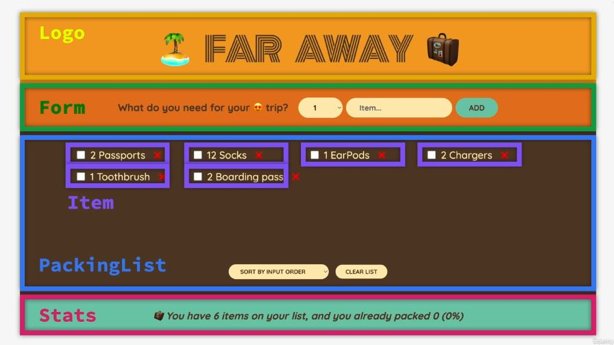

# `Travel List Project`

## `Table-Of-Contents`

1. [Building_Project_Layout](#building_project_layout)
2. [Rendering_Items_list](#rendering_items_list)
3. [Building_Form_Handling_Submission](#building_form_handling_submission)
4. [ControlledElements](#controlledelements)
5. [State_VS_Props](#state_vs_props)
6. [Exercise_1-Building_Accordion](#exercise_1-building_accordion)

---

## `Building_Project_Layout`

`Breaking up the User Interface into a components`



`Codes in index.js`

```js
import React from 'react';
import ReactDOM from 'react-dom/client';
import './index.css';
import App from './App';

const root = ReactDOM.createRoot(document.getElementById('root'));
root.render(
  <React.StrictMode>
    <App />
  </React.StrictMode>
);

```

In App.js file, as always we'll create an export App function as a root component. And then we'll have 4 big functions/components that are identified in above image.  
For now we are building all of these components in App.js file, but in real world we create a new file for each component.

[🔝 Back to Top](#table-of-contents)

---

## `Rendering_Items_list`

Rendering list is one of the most common tasks in REACT development. Let's now render a list of packing items.  
We have an array of few objects,each object describe one item to be packed. like this:

```js
const initialItems = [
  { id: 1, description: 'Passports', quantity: 2, packed: false },
  { id: 2, description: 'Socks', quantity: 12, packed: false },
];
```

Remember to render a list we simple used map method on the array.

```js
function PackingList() {
  return (
    <ul className="list">
      {initialItems.map((item) => (
        <Item item={item} />
      ))}
    </ul>
  );
}
```

here we have lot of item, first the name of the component(Item), the name of the prop, and then the object itself, which remember is the argument of the callback function in each iteration on the map method.  
We also add some styles conditionally.

```js
const initialItems = [
  { id: 1, description: 'Passports', quantity: 2, packed: false },
  { id: 2, description: 'Socks', quantity: 12, packed: true },
  { id: 3, description: 'Charger', quantity: 1, packed: false },
];

function PackingList() {
  return (
    <div className="list">
      <ul>
        {initialItems.map((item) => (
          <Item item={item} />
        ))}
      </ul>
    </div>
  );
}

function Item({ item }) {
  return (
    <li>
      <span style={item.packed ? { textDecoration: 'line-through' } : {}}>
        {item.description}
        {item.quantity}
      </span>
      <button>❌</button>
    </li>
  );
}

```

[🔝 Back to Top](#table-of-contents)

---

## `Building_Form_Handling_Submission`

One of the most important things that we do on the web is to interact with web applications through forms. So forms are fundamental in web applications. Let's now start learning, how to work with forms in REACT.

When we build forms in REACT, we use the normal HTML form element. In form, we have a select element, input element and then a button.  
In select element, we have 20 option elements, so we do not manually duplicate options 20 times. Instead we'll create an array of 20 elements and loop over that array, and in each iteration we create a new option element. To create a new array in REACT, we will do is to go into JavaScript mode and then use **Array.from method**, in this method we pass length as an object as a first argument, that will then create an empty array with 20 elements. And then as a second argument we will pas a callback function, in that callback function we have access to current element and index, now we just return index + 1. So as a result we get an array of 1 to 20 values as an elements.

```js
<select>
  {Array.from({ length: 20 }, (_, i) => i + 1)}
</select>
```

Now on this **from method** we'll chain a **map method**, and loop over currently created array, and create a new list of option elements.

```js
<select>
    {Array.from({ length: 20 }, (_, i) => i + 1).map((num) => (
      <option value={num} key={num}>{num}</option>
        ))}
</select>
```

Remember: In each list item in REACT we need to pass a unique key, In this case that's the value(num) itself.

Let's now talk about events, What we want to happen here is when we click on add button we want this form to be submitted. We can then react to this form submission with an event handler. Just like before we will add the event handler inside the Form component. And we listen onSubmit event on the form element.

```js
// Form Component
function Form() {
  function handleSubmit(e) {
    e.preventDefault();
  }

  return (
    <form className="add-form" onSubmit={handleSubmit}>
      <h3>What do you need for your 😍 trip?</h3>

      <select>
        {Array.from({ length: 20 }, (_, i) => i + 1).map((num) => (
          <option value={num} key={num}>
            {num}
          </option>
        ))}
      </select>
      <input type="text" placeholder="Item" />
      <button>Add</button>
    </form>
  );
}
```

Now the question is **how do we actually ge the data from the form into the handleSubmit eventHandler?** There are multiple ways of doing this. we could get that data right from the event object(e). However in REACT we usually don't do this. Instead we use something called **controlled elements**, but that's a topic for whole new lecture.

[🔝 Back to Top](#table-of-contents)

---

## `ControlledElements`

Let's now learn about yet another fundamental REACT concept, which is **controlled elements**.

By default, input fields like input and select, they maintain their own state inside the DOM, so basically inside the HTML itself. Now this makes it hard to read their values and it als leaves this state right here int the DOM, which is not ideal. So in REACT, we usually like to keep all this state in just one central place, So inside the REACT application and not inside the DOM. And in order to do that we use a technique called controlled elements. With this technique it is REACT who controls and owns the state of these input fields and no longer the DOM.  
Since we want to now keep these data inside the application, what that means is that we need some **state**. Because that form data of course changes over time and we also want to maintain our application in sync with it.  
In order to implement the Controlled Elements technique, we follow to three steps.

1. We create a piece of state.

    ```js
    const [description, setDescription] = useState('');```

2. Use this state as a value of the input field, so the value of input filed.

    ```js
    <input type="text" placeholder="Item" value={description} />
    ```

3. Need to connect this state with the value that we actually going to type there in input field. So for that also on the same element(input element) we need to listen for the change event.

```js
<input
        type="text"
        placeholder="Item"
        value={description}
        onChange={(e) => setDescription(e.target.value)}
/>
```

Basically here⤴ whenever we type something in the input field, the change event is fired off and we can react to that event with the onChange event handler. event handlers always receive the event object, then on the event we read the target, which is basically the entire element.

Just do the same thing for select element

```js
const [quantity, setQuantity] = useState(1);
<select value={quantity} onChange={(e) => setQuantity(e.target.value)}>
```

Here the value of the quantity is as a string, the reason for that is e.target.value is always gonna be a string. So before we place this value into the state let first convert into the number. We could use + operator before +e.target.value Or we can use Number function.

`Quick Recap`  
The technique of control elements basically consists of three steps. We **define a piece of state**, then we **use that piece of state** on the element that we want to control, and then finally we need to **update that state variable** and we do so with the onChange event.

Let's now go ahead and quickly use these values in handleSubmit handler function.

```js
function handleSubmit(e) {
    e.preventDefault();

    const newItem = { description, quantity, packed: false, id: Date.now() };

    console.log(newItem);
  }
```

Now we got that value, just to finish let's tweak our handle submit function a little bit, for example, when we submit the form without any item, then it still works, but the description is simply empty string, which is our default value of description in useState. However we don't want this to happen, so when there is no description, then we shouldn't even be able to submit the form. That is simple enough. We can add a guard clause in handleSubmit handler.  
Finally when we submit the form the input fields should go back to it's initial state, so empty state. For that we can simply use our setter functions.  

```js
  function handleSubmit(e) {
    e.preventDefault();

    if (!description) return;

    const newItem = { description, quantity, packed: false, id: Date.now() };
    console.log(newItem);

    setDescription('');
    setQuantity('');
  }
```

Now we have render this data into the UI. We may not use props because these(PackingList & Form) are siblings. The Form is not a parent component of the PackingList component, and therefore we cannot pass props from Form to the PackingList component. `Data only fow down the tree, but not up or side ways.` So need to find another solution. And so this is where we really need to start thinking more about state and state management. For this section we leave this project here, and in next section we will talk about `thinking in REACT`.

[🔝 Back to Top](#table-of-contents)

---

## `State_VS_Props`

A very common beginner question or sometimes even an interview question is this. **What's the difference between state and props?**  

- **State is an internal data**, owned by component. While **Props is an external data**, owned by parent component. We can think of props as a function parameters. So as a communication channel between parent and child components.
- States can be thought of as a components memory, because it can hold data over time(across multiple re-renders).
- State can be updated by the component itself, this will then cause the component to be rerendered by REACT. Therefore we use this mechanism of state to make components interactive. On the other side **props** works very differently, **they are read only**. They cannot modified by the component that is receiving them.
- However, **when the child component receives new updated props that will actually also cause the component to rerender**. So whenever a piece of state is passed as a props to the child component, then when that state updates, both components (component owning, and component receiving, the state) are rerendered.
- State is used by developers to make components interactive, Props are use to give the parent component, the ability to configure their child components.

[🔝 Back to Top](#table-of-contents)

---

## `Exercise_1-Building_Accordion`

It's not super hard to understand how state works in REACT, but it can actually be quite tricky to understand how exactly to use it in practice in different situations. But this is a number one skill that we need to have as a REACT developer, and that's way we'll do some practice here.

What we're gonna build is a Flash card project, where a flash card is basically a question on one side. and then when we click on it we get the answer on the other side. when we click on another card then the fist one is close and open clicked one, it's just like an accordion. Here all we need is one piece of state to control all of these cards. This piece of state will keep track of which question ID is currently the active question.

We have an array with all the questions as objects.

### `Style Code and Comments⤵`

```js
import { useState } from "react";
import "./styles.css";

export default function App() {
  return (
    <div className="App">
      <FlashCards />
    </div>
  );
}

const questions = [
  {
    id: 3457,
    question: "What language is React based on?",
    answer: "JavaScript",
  },
  {
    id: 7336,
    question: "What are the building blocks of React apps?",
    answer: "Components",
  },
  {
    id: 8832,
    question: "What's the name of the syntax we use to describe a UI in React?",
    answer: "JSX",
  },
  {
    id: 1297,
    question: "How to pass data from parent to child components?",
    answer: "Props",
  },
  {
    id: 9103,
    question: "How to give components memory?",
    answer: "useState hook",
  },
  {
    id: 2002,
    question:
      "What do we call an input element that is completely synchronised with state?",
    answer: "Controlled element",
  },
];

function FlashCards() {
  const [selectedId, setSelectedId] = useState(null); // null, because we want none of the qustion to opened in the beginning.

  function handleClick(id) {
    setSelectedId(id !== selectedId ? id : null); // condition for if click again, then it should close
  }

  return (
    <div className="flashcards">
      {questions.map((question) => (
        <div
          key={question.id}
          onClick={() => handleClick(question.id)} // remember here, don't do this directly: handleClick(question.id)
          className={question.id === selectedId ? "selected" : ""}
        >
          <p>
            {question.id === selectedId ? question.answer : question.question}
          </p>
        </div>
      ))}
    </div>
  );
}

```

[🔝 Back to Top](#table-of-contents)

---

## `Challenge_2`

In this challenge, we will upgrade the date counter, that we built before.

[CodeSandBox-Link](https://codesandbox.io/p/sandbox/states-event-challenge-1-forked-z7cqnw?file=%2Fsrc%2FApp.js%3A1%2C1-74%2C1)

**`Code`**  

```js
import { useState } from "react";
import "./styles.css";

export default function App() {
  return (
    <div className="App">
      <Counter />
    </div>
  );
}

function Counter() {
  const [step, setStep] = useState(1);
  const [count, setCount] = useState(0);
  const date = new Date();
  date.setDate(date.getDate() + count);

  function plusCounterHandler() {
    setCount((c) => c + step);
  }
  function minusCounterHandler() {
    setCount((c) => c - step);
  }

  function handleReset() {
    setStep(1);
    setCount(0);
  }

  return (
    <>
      <div>
        <input
          type="range"
          min="0"
          max="10"
          value={step}
          onChange={(e) => setStep(Number(e.target.value))}
        />
        <span>{step}</span>
      </div>

      <div>
        <button onClick={minusCounterHandler}>➖</button>
        {/* <span>Count: {count}</span> */}
        <input
          type="text"
          value={count}
          onChange={(e) => setCount(Number(e.target.value))}
        />

        <button onClick={plusCounterHandler}>➕</button>
      </div>

      <p>
        <span>
          {count === 0
            ? "Today "
            : count > 0
            ? `${count} days from today is `
            : `${Math.abs(count)} days ago was `}
        </span>
        <span>{date.toDateString()}</span>
      </p>

      {count !== 0 || step !== 1 ? (
        <div>
          <button onClick={handleReset}>Reset</button>
        </div>
      ) : null}
    </>
  );
}

```

[🔝 Back to Top](#table-of-contents)
