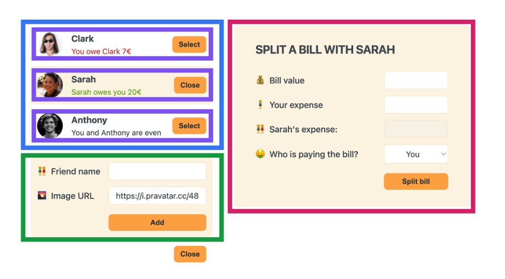

# `Eat-N-Split_Practice-Project`

## `Table of Contents`

1. [Building_Static_App-List_of_Friends](#building_static_app-list_of_friends)
2. [Building_the_Static_App_Forms](#building_the_static_app_forms)
3. [Display_Add_New_Friend_Form](#display_add_new_friend_form)
4. [Adding_New_Friend](#adding_new_friend)
5. [Selecting_a_friend](#selecting_a_friend)
6. [Creating_Controlled_Elements](#creating_controlled_elements)
7. [Splitting_a_Bill](#splitting_a_bill)

## `Splitting UI into Components`



## `Building_Static_App-List_of_Friends`

```js
const initialFriends = [
  {
    id: 118836,
    name: 'Clark',
    image: 'https://i.pravatar.cc/48?u=118836',
    balance: -7,
  },
  {
    id: 933372,
    name: 'Sarah',
    image: 'https://i.pravatar.cc/48?u=933372',
    balance: 20,
  },
  {
    id: 499476,
    name: 'Anthony',
    image: 'https://i.pravatar.cc/48?u=499476',
    balance: 0,
  },
];

export default function App() {
  return (
    <div className="app">
      <div className="sidebar">
        <FriendsList />
      </div>
    </div>
  );
}

function FriendsList() {
  const friends = initialFriends;

  return (
    <ul>
      {friends.map((friend) => (
        <Friend friend={friend} key={friend.id} />
      ))}
    </ul>
  );
}

function Friend({ friend }) {
  return (
    <li>
      
      <h3>{friend.name}</h3>

      {friend.balance < 0 && (
        <p className="red">
          You owe {friend.name} {Math.abs(friend.balance)}€
        </p>
      )}

      {friend.balance > 0 && (
        <p className="green">
          {friend.name} owes you {Math.abs(friend.balance)}€
        </p>
      )}

      {friend.balance === 0 && <p>You and {friend.name} are even.</p>}
      <button className="button">Selects</button>
    </li>
  );
}

```

---

## `Building_the_Static_App_Forms`

We already built two components. Next, let's build the two forms.  
Here we need a button multiple times, we'll just place that into it's own component. So we build the Button reusable.

```js

export default function App() {
  return (
    <div className="app">
      <div className="sidebar">
        <FriendsList />
        <FormAddFriend />
        <Button>Add Friend</Button>
      </div>

      <FormSplitBill />
    </div>
  );
}

function Button({ children }) {
  return <button className="button">{children}</button>;
}

function FormAddFriend() {
  return (
    <form className="form-add-friend">
      <label>👩🏻‍🤝‍👩🏻 Friend name</label>
      <input type="text" />

      <label>📸 Image URL</label>
      <input type="text" />

      <Button>Add</Button>
    </form>
  );
}

function FormSplitBill() {
  return (
    <form className="form-split-bill">
      <h2>Split a bill with Saud</h2>

      <label>💰 Bill value</label>
      <input type="text" />

      <label>🕴 Your expense</label>
      <input type="text" />

      <label>👬 Saud's expense</label>
      <input type="text" disabled />

      <label>💲 Who is paying the bill</label>
      <select>
        <option value="you">You</option>
        <option value="friend">Saud</option>
      </select>

      <Button>Split Bill</Button>
    </form>
  );
}
```

---

## `Display_Add_New_Friend_Form`

Let's now conditionally display and hide the new friend form. When clicking on the `Add Friend` button, display the form and change the text of button to `close`.

From App component we're rendering the `FormAddFriend` so we'll add `state` there in App component.

```js
<div className="sidebar">
  <FriendsList />
  {showAddFriend <FormAddFriend />}
  <Button>Add Friend</Button>
</div>
```

Here we want to add onClick event on this Button component but we haven't any onClick property on the Button component, because this in not a native html element. But the button element, that is inside the Reusable Button component is of course accept onClick property. So here we pass onClick event to the button.

```js

function Button({ children, onClick }) {
  return (
    <button onClick={onClick} className="button">
      {children}
    </button>
  );
}

export default function App() {
  const [showAddFriend, setShowAddFriend] = useState(false);

  function handleShowAddFriend() {
    setShowAddFriend((show) => !show);
  }

  return (
    <div className="app">
      <div className="sidebar">
        <FriendsList />
        {showAddFriend && <FormAddFriend />}
        <Button onClick={handleShowAddFriend}>
          {showAddFriend ? 'Close' : 'Add Friend'}
        </Button>
      </div>

      <FormSplitBill />
    </div>
  );
}

```

Nice we're now able to display and hide the form, but of course the form doesn't work yet. So let's take care of that in next lecture.

---

## `Adding_New_Friend`

Let's now implement the first feature of the app, which is the ability to add new friends to the list.

The first thing we need to get the values of input fields into our application(FormAddFriend component), so we use controlled elements where we will have one piece of state for each of the inputs. And when use inputs some text in the field, then the input field will be sync with the state. So we'll use onChange events to update the state variable.  

After that we will add onSubmit event. in that handler function we will create an object of the user, so that'll contain the properties of new user. for id we'll use built in browser `crypto.randomUUID()`, this is a very good way of generating random IDs right in the browser.

```js
  const [name, setName] = useState('');
  const [image, setImage] = useState('https://i.pravatar.cc/48');

  function handleSubmit(e) {
    e.preventDefault();

    const id = crypto.randomUUID();
    const newFriend = {
      name,
      image: `${image}?=${id}`,
      balance: 0,
      id,
    };
    console.log(newFriend);

  }
```

Here⤴ for the image we use default url of the image and then id. here this url <https://i.pravatar.cc/48> gives us an image of size 48, and then when we reload, it'll each time give us a different image. But we don't want that, So we want each image to fixed to the person, But when we attach any string with that we'll always get the exact same image.

Now after submitting the form we should go to the default state. Also add a guard clause, if there is no name of no image.

```js
function FormAddFriend() {
  const [name, setName] = useState('');
  const [image, setImage] = useState('https://i.pravatar.cc/48');

  function handleSubmit(e) {
    e.preventDefault();
    if (!name || !image) return;

    const id = crypto.randomUUID();
    const newFriend = {
      name,
      image: `${image}?=${id}`,
      balance: 0,
      id,
    };
    setName('');
    setImage('https://i.pravatar.cc/48');
  }
```

Okay, so the form now works, but now comes the harder part. So How do we know actually get the object that we get here in handleSubmit() onto our friends list? *Let's think about it. So each time we add a new friend, we want that friend immediately added to the friend list. So we want something to happen in the UI, In other words, we want the UI to render. So once again, that's a clear sign that we need some state.*  
**But now we need to figure out where to place that piece of state.** So our FriendList component is the one that is going to display the friends. However, it's the FormAddFriend component where we want to update that list of friends, because there we add a new friend. As these both components are siblings, so we've to lift the friends state up there into the App component, because this way all of the components are actually can get access to that friend state.
  
```js
const [friends, setFriends] = useState(initialFriends);
```

We created this state variable, and pass this friend variable to the FriendList component, where we want to render the list of friends, And to update this variable we have to give access this setter function to the FormAddFriend component where we get a new friend from the user. To give access we could pass this setter function directly to the FormAddFriend component, and there we update the FriendList array, But we'll create a new function to add a new friend right in the App component, and then we'll pass this function to the FormAddFriend component as a prop, This function will receive a friend object, which is the one that we created in the FormAddFriend component, so we'll pass that object to this function. And there in the FormAddFriend we will add this function to the onSubmit event.

```js
// App component
function handleAddFriend(friend){
    setFriends(friends => [...friends, friend]);
  }
```

Here⤴ we're first spreading the current friend state variable and add the new one that we received from the FormAddFriend component. We're doing like this *[...friends, friend]* to add a new friend object instead of simply using push method because that would mutate the original array so it wouldn't create a new one. **And so REACT in that case would not rerender in many situations. So don't do that!! Because REACT is all about immutability.**

```js
export default function App() {
  const [friends, setFriends] = useState(initialFriends);

  const [showAddFriend, setShowAddFriend] = useState(false);

  function handleShowAddFriend() {
    setShowAddFriend((show) => !show);
  }

  function handleAddFriend(friend) {
    setFriends((friends) => [...friends, friend]);
  }

  return (
    <div className="app">
      <div className="sidebar">
        <FriendsList friends={friends} />
        {showAddFriend && <FormAddFriend onAddFriend={handleAddFriend} />}
        <Button onClick={handleShowAddFriend}>
          {showAddFriend ? 'Close' : 'Add Friend'}
        </Button>
      </div>

      <FormSplitBill />
    </div>
  );
}


function FormAddFriend({ onAddFriend }) {
  const [name, setName] = useState('');
  const [image, setImage] = useState('https://i.pravatar.cc/48');

  function handleSubmit(e) {
    e.preventDefault();
    if (!name || !image) return;

    const id = crypto.randomUUID();
    const newFriend = {
      name,
      image: `${image}?=${id}`,
      balance: 0,
      id,
    };

    onAddFriend(newFriend);
    setName('');
    setImage('https://i.pravatar.cc/48');
  }

  return (
    <form className="form-add-friend" onSubmit={handleSubmit}>
      <label>👩🏻‍🤝‍👩🏻 Friend name</label>
      <input
        type="text"
        value={name}
        onChange={(e) => setName(e.target.value)}
      />

      <label>📸 Image URL</label>
      <input
        type="text"
        value={image}
        onChange={(e) => setImage(e.target.value)}
      />

      <Button>Add</Button>
    </form>
  );
}
```

Now it's working, But one small thing we want here is that, each time the form is submitted, then the form should close and disappear immediately. So we can use that handleAddFriend handler function not only to set the new friend state, but also to hide the form again. To hide all we have to do is to set setShowAddFriend to false.

```js
// In App component
function handleAddFriend(friend) {
  setFriends((friends) => [...friends, friend]);
  setShowAddFriend(false);
}
```

With this we completed this feature

---

## `Selecting_a_friend`

Now in order to make our form work, the first thing that we need to do is to add the ability of the user selecting a friend. So whenever we click on the select button, it will then open up the form with the information of the selected friend, then there will also a selected friend as marked with orange background, and button text change to close. So in general we want the Friend component to communicate with the FormSplitBill component, These components are also sibling components, actually even worse than sibling. Because Friend component is child of FriendList component, and FriendList component itself is sibling of FormSplitBill component. So in all these cases we need some lifted up state. So again first common parent is App component. So add this state variable to the App component

```js
const [selectedFriend, setSelectedFriend] = useState(null);
```

Initially no friend list should selected, so we just pur null here, and we can use this selectedFriend state variable to render the form conditionally, so basically initially it should not be appear on UI. just like this⤵

```js
// App component
{selectedFriend && <FormSplitBill />}
```

```js
// App component [setter func]
function handleSelection(friend) {
  setSelectedFriend(friend);
}
```

This function⤴ we'll pass to the Friend component, (while passing we changed the name handleSelection to onSelection). There we will add this to onClick property of the select button. like this ⤵

```js
<Button onClick={() => onSelection(friend)}>Select</Button>
```

To sync data of form with selectedFriend, all we have to do it so pass selectedFriend to the FormSplitBill component, and use this prop to update the info.

```js
{selectedFriend && <FormSplitBill selectedFriend={selectedFriend} />}
```

Next things is to change button text from Select to Close, and add background to the currently selected friend. **How do we know inside of the Friend component if it's selected?** So first of all we've to pass in currently selected friend, then we can compare that with each friend.  
Here we see that in FriendList we have nothing to do with the selectedFriend variable, but we should have to pass through it to give access to the Friend component whenever this happens, **so whenever we have a component that doesn't actually need the prop, but all it does with the prop is to pass it down into one of it's child, we say we're prop drilling.**

```js
// Friend component
const isSelected = selectedFriend?.id === friend.id;  // boolean, it will just compare and store true or false
```

And notice here⤴ we used **optional chaining**, because initially our selected friend is null so it'll give an error. so to avoid from that error we just use **optional chaining**.

We want when click on select button the text of button should Close so⤵

```js
<Button onClick={() => onSelection(friend)}>
        {isSelected ? 'Close' : 'Select'}
      </Button>
```

Also when we click on the select button agin, so on Close button for now, then it should close the form. so updated version of handleSelection handler⤵

```js
  function handleSelection(friend) {
    // setSelectedFriend(friend);
    setSelectedFriend((curSelected) =>
      curSelected?.id === friend.id ? null : friend
    );
  }

```

Now finally we want, when one form is opened and the use wants to open another form before closing first one, then first one should close automatically. This will show a huge power of state. All we need one line of code where we handle click for select friend. So all we have to do in handleSelection is to, after selection friend, update setShowAddFriend to false. Just this⤵

```js
function handleSelection(friend) {
  // setSelectedFriend(friend);
  setSelectedFriend((curSelected) =>
    curSelected?.id === friend.id ? null : friend
  );
  setShowAddFriend(false);
}
```

---

## `Creating_Controlled_Elements`

The next step to making our form work is to take the input elements that we already have and make them controlled elements so elements that are entirely controlled by REACT components.

```js
// FormSplitBill component
const [bill, setBill] = useState('');
const [paidByUser, setPaidByUser] = useState('');
const [whoIsPaying, setWhoIsPaying] = useState('user'); // 'user' is one of the value of option.

```

Here we set initial to the empty string, because these are input text elements and so this is how it needs to work.

Remember we just disabled the friend paid field. because there will be just a computed value, so total bill - userPaid bill.  But initially the bill is an empty string so we have to check if there bill then store. just like this⤵

```js
const paidByFriend = bill ? bill - paidByUser : ''; 
```

Now we have one problem here, if we put our own expense greater then the total bill, then there will be friend's expense in negative, which is obviously not correct. So we need to ensure that our expense is always at most equal to the bill.  
So here ⤵ if the userPaid is > bill then we pass paidByUser, which is initial state value or may be previous state value, so there will be no rerender, otherwise there should be a value that we typing in text box.

```js
<label>🕴 Your expense</label>
  <input type="text"
    value={paidByUser}
    onChange={(e) =>
    setPaidByUser(
    Number(e.target.value) > bill ? paidByUser : Number(e.target.value)
  )}
/>
```

So now we converted our form into a controlled form where all the elements are now controlled elements.

What we need to do next is to add the logic of actually splitting the bill and then updating the balance between the two friends, leave that for next video.

Here we have some logical errors, let's fill the form, then select any other friend from friend list, then the from is not been reset. So the state that we had before is exactly the same when we click on other friends. But with the knowledge that we have at this point, we are not yet ready to fix this and also not really ready to understand it. All I could say for now is that this happens because the form components is rendered in exactly the same place in the component tree as before. So when we click on any other friend then the same component rendered in exactly the same position. And the component doesn't disappear in the mean time, so therefore it's not really rerendered. For now leave this, we'll fix it later.

---

## `Splitting_a_Bill`

Now in the final lecture all we have to do is to listen to the submit event on the form and then handle it accordingly.

So whenever we split a bill some text on UI is changing, that's the 'You owe Clark 7$' here 7 (which is balance value) should be updated. So it means there is something is clearly happening on the screen. However, does that mean that we now need a new piece of state? No, because we already have these friends in our state, and all we're doing is to update them. so all we have to do is to update the balance value.

we just created a handler function in App component to update the balance value of friend on submit.

```js
// App component
 function handleSplitBill(value) {
    console.log(value);
  } // just for now..
```

```js
// FormSplitBill component
function handleSubmit(e) {
    e.preventDefault();

    if (!bill || !paidByUser) return;

    onSplitBill(whoIsPaying === 'user' ? paidByFriend : -paidByUser);
}
```

Here⤴, Remember that the bill can be paid by you/user or by the selected friend, based on that we now need to set the value. So we'll use the ternary operator. Remember that negative numbers in the balance are owned by user and positive numbers means that your friend is owing you. So if user/you is paying then friend will be owing you their part, therefore this will be a positive number. And in the opposite case if friend is paying, then you/user will actually own your part, so it's going to be negative number, because the negative numbers are ones that owned by you. so we put *-paidByUser*

Now all things are working. Just we've to clear all the form's fields. Two options of doing this. 1- clear the state in the form. 2- After the bill is split, so after the submission, the form should close automatically, Which we'll implement here. With the power of state that's easy enough, all we've to do is to set the setSelectedFriend to null. *setSelectedFriend(null);*

```js
  function handleSplitBill(value) {
    setFriends((friends) =>
      friends.map((friend) =>
        friend.id === selectedFriend.id
          ? { ...friend, balance: friend.balance + value }
          : friend
      )
    );
    setSelectedFriend(null);
  }
```

*With this our Application is feature complete.*

---

***`Finished Part One`***  
***`02/02/2024`***

---
