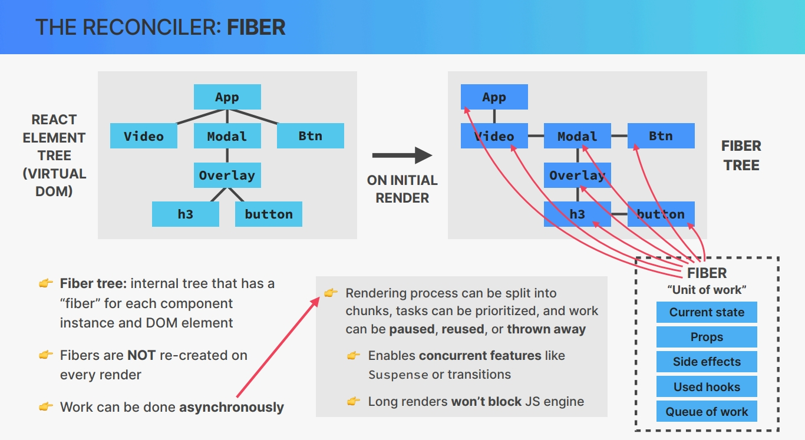
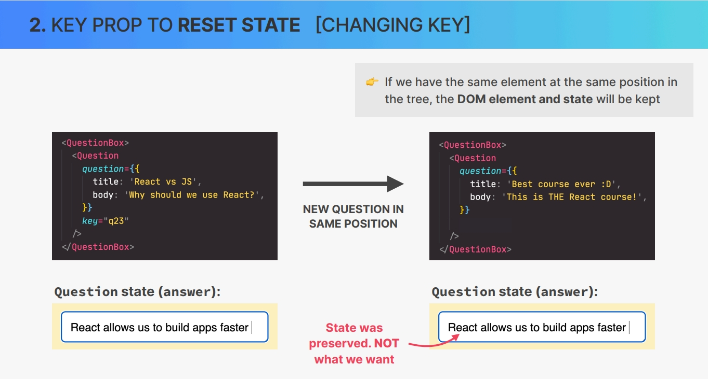
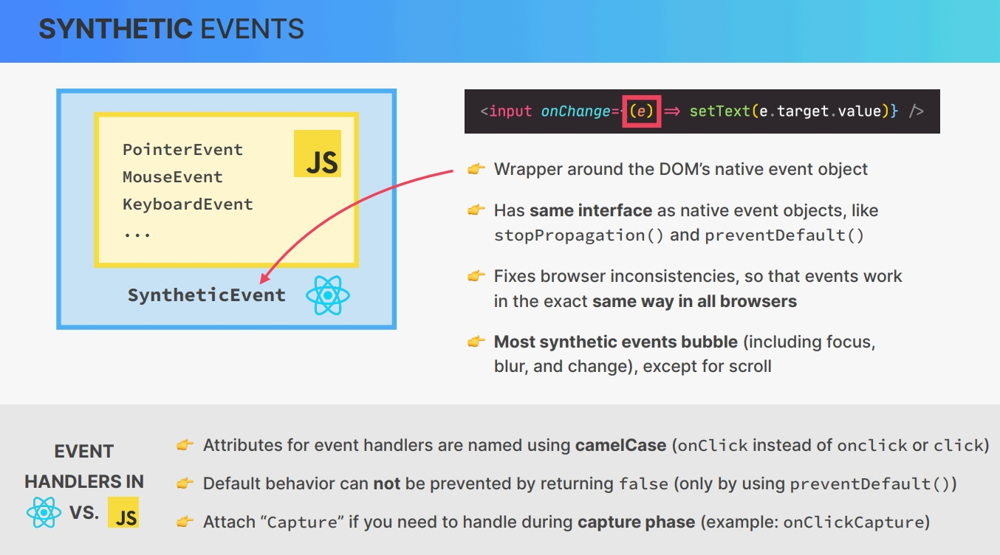

# `How React Works Behind the Scenes`

## `Table of Contents`

1. [Project Setup and Walkthrough](#project-setup-and-walkthrough)
2. [Components, Instances, and Elements](#components-instances-and-elements)
3. [Instances and Elements in Practice](#instances-and-elements-in-practice)
4. [How Rendering Works_Overview](#how-rendering-works_overview)
5. [The Render Phase](#the-render-phase)
   1. [Diffing Rules in Practice](#diffing-rules-in-practice)
6. [The Commit Phase](#the-commit-phase)
7. [How Diffing Works](#how-diffing-works)
8. [The Key Prop](#the-key-prop)
9. [Resetting State with Key Prop](#resetting-state-with-key-prop)
10. [Using Key Prop Fix Eat-N-Split App](#using-key-prop-fix-eat-n-split-app)
11. [Rules for Render Logic Pure Components](#rules-for-render-logic-pure-components)
12. [State Update Batching](#state-update-batching)
13. [State Update Batching in Practice](#state-update-batching-in-practice)
14. [How Events Work in React](#how-events-work-in-react)
15. [Libraries vs Frameworks and The React Ecosystem](#libraries-vs-frameworks-and-the-react-ecosystem)
16. [Section Summary](#section-summary)

---

## `Project Setup and Walkthrough`

### `Starter Code For this Project`

```javascript
import { useState } from "react";

const content = [
  {
    summary: "React is a library for building UIs",
    details:
      "Dolor in reprehenderit in voluptate velit esse cillum dolore eu fugiat nulla pariatur. Occaecat cupidatat non proident, sunt in culpa qui officia deserunt mollit anim id est laborum.",
  },
  {
    summary: "State management is like giving state a home",
    details:
      "Lorem ipsum dolor sit amet, consectetur adipisicing elit, sed do eiusmod tempor incididunt ut labore et dolore magna aliqua. Excepteur sint occaecat cupidatat non proident, sunt in culpa qui officia deserunt mollit anim id est laborum.",
  },
  {
    summary: "We can think of props as the component API",
    details:
      "Ut enim ad minim veniam, quis nostrud exercitation ullamco laboris nisi ut aliquip ex ea commodo consequat. Duis aute irure dolor in reprehenderit in voluptate velit esse cillum dolore eu fugiat nulla pariatur.",
  },
];

export default function App() {
  return (
    <div>
      <Tabbed content={content} />
    </div>
  );
}

function Tabbed({ content }) {
  const [activeTab, setActiveTab] = useState(0);

  return (
    <div>
      <div className="tabs">
        <Tab num={0} activeTab={activeTab} onClick={setActiveTab} />
        <Tab num={1} activeTab={activeTab} onClick={setActiveTab} />
        <Tab num={2} activeTab={activeTab} onClick={setActiveTab} />
        <Tab num={3} activeTab={activeTab} onClick={setActiveTab} />
      </div>

      {activeTab <= 2 ? (
        <TabContent item={content.at(activeTab)} />
      ) : (
        <DifferentContent />
      )}
    </div>
  );
}

function Tab({ num, activeTab, onClick }) {
  return (
    <button
      className={activeTab === num ? "tab active" : "tab"}
      onClick={() => onClick(num)}
    >
      Tab {num + 1}
    </button>
  );
}

function TabContent({ item }) {
  const [showDetails, setShowDetails] = useState(true);
  const [likes, setLikes] = useState(0);

  function handleInc() {
    setLikes(likes + 1);
  }

  return (
    <div className="tab-content">
      <h4>{item.summary}</h4>
      {showDetails && <p>{item.details}</p>}

      <div className="tab-actions">
        <button onClick={() => setShowDetails((h) => !h)}>
          {showDetails ? "Hide" : "Show"} details
        </button>

        <div className="hearts-counter">
          <span>{likes} ❤️</span>
          <button onClick={handleInc}>+</button>
          <button>+++</button>
        </div>
      </div>

      <div className="tab-undo">
        <button>Undo</button>
        <button>Undo in 2s</button>
      </div>
    </div>
  );
}

function DifferentContent() {
  return (
    <div className="tab-content">
      <h4>I'm a DIFFERENT tab, so I reset state 💣💥</h4>
    </div>
  );
}
```

---

## `Components Instances and Elements`

Let's start with the conceptual difference between React components, component instances and React elements. _This is a pretty common interview question._

**Components** are what we write in order to describe a piece of the user interface. It's just a regular JavaScript function, but it's a function that returns React elements. So it returns an element tree, and we usually write these elements using JSX syntax. A component is a generic description of the UI, So we can essentially think of a component as blueprint or a template. And out of this blueprint/template React creates one or multiple **component instances**. React does this each time we use the component somewhere in our code. If we create three instances of a component, then React will call the component three times. So,  
**Component Instances** is an actual physical manifestation/appearance of a component living in our component tree. While the **component** is itself is really just a function that we wrote before being called. **Each instance of a component holds it's own state and props and that also has its own lifecycle.** So component instance can be born, it can live for some time until it will eventually die.  
As React executes the code, in each of these instances, each of them will return one or more **React elements**. Behind the scenes the JSX get converted into multiple React.createElement function calls. Then, as React calls these createElement functions the result will be a **React element.** So, **React element is the result of component/function in our code. It simply a big immutable JavaScript object that react keeps in memory.** `What is this object actually?`  
A React element basically contains all the information that is necessary in order to create DOM elements for the current component instance. This React element will eventually be converted to actual DOM elements and then paint it onto the screen by the browser.  
**Based on all these, the DOM elements are the actual final visual representation of the component instances in the browser.** It's not React elements that are rendered to the DOM. React elements just live inside the React application and have nothing to do with the DOM. They are simply converted to DOM elements when they are painted on the screen at the end.

---

## `Instances and Elements in Practice`

Let's now shortly look at component instances and React elements in our code.
👉 We can actually look at the component instance simply by using the component and logging it to the console. **_console.log(<componentName/>)_**

```javascript
console.log(<DifferentContent />);
```

By running this we should see something in the console. So as soon as React sees this component calling, it will internally call the different content function and will then return the react element that we have in console. In console we also has **type: DifferentContent** because this is an instance of DifferentContent. Why we don't call the component directly, calling the function ourselves? like **_DifferentContent()_** We can do that also.

```javascript
console.log(DifferentContent());
```

By this⤴ we still got a react element. However, it's a very different one. This one has no longer has the type of DifferentContent. Instead it's a div so **type: div**, which is basically just the content of this component. So what this means is that right now React does not no longer see this as a component instance, and instead it just see the raw React element, which is really not what we want. So never do this. Because when we call directly, then React no longer sees as a component instance.

**_So, always call the component like this <componentName/>, not as function calling like componentName()_**

---

## `How Rendering Works_Overview`

It's time to finally learn about how exactly React renders our applications behind the scenes. We'll discuss in next three lectures.

### `Some Recaps from Previous Lectures`

As we build our application, what we're really doing is building a bunch of components. We then use these components to inside other components as many times as we want, which will cause React to create one or more instances of each component, which will holds their own states and props. And there each JSX will produce a bunch of react.createElement function calls, which internally will produce a react element for each component instance. And this react element will ultimately be transformed to DOM elements and displayed as a UI on the screen.

**Now let's talk about how these React elements actually end up in the DOM and displayed on the screen.**

In this lecture we're going to have a quick overview of each of the phases involved in displaying our components onto the screen. _This process that we're about to study is started by React each time that a new render is triggered. Most of the time by updating state somewhere in the application. So state changes trigger renders._ So the first phase is `Render is Triggered`.

`Render Phase:` In this phase React calls our component functions and figures out how it should be update the DOM, in order to reflect the latest state changes, however it does actually not update the DOM in this phase.  
**_In React rendering is not about updating the DOM or displaying elements on the screen. Rendering only happens internally inside of React and so it does not produce any visual changes._** _In all the previous sections I have always used the term rendering with the meaning of displaying elements on the screen because that was just easy to understand. However as we just learned, the rendering is really this phase(render phase) plus next phase(commit phase)._

`Commit Phase:` In this phase new elements might be placed in the DOM and already existing elements might get updated or deleted in order to correctly reflect the current state of the application. So, it's really this commit phase that's responsible for what we traditionally call rendering.

`Browser Paint:` Then finally the browser will notice that the DOM has been updated and so it repaints the screen. Now this has nothing to do with React anymore, but it's still worth mentioning that, it's this final phase that actually produces the visual changes that users see on their screen.


### `Triggering of a render Phase`

There only two ways in which a render can be triggered.

1. `Initial Render:` Very first time tha application runs.
2. `State is Updated:` State update happening in one or more component instances somewhere in the application, which is what we call a `rerender`.

**It's important to note that the render process really is triggered for the entire application**, not just for one component. That doesn't mean that the entire DOM is updated because remember, in React rendering is only about calling the component functions and figuring out what needs to change in the DOM later.

**In practice**, it looks like React only rerenders the component where the state update happens, but that's not how it **works behind the scenes.**

A render is not triggered immediately after a state update happens. Instead it's scheduled for when the JavaScript engine basically has some free time on its hands. But this difference is usually just a few milliseconds that we won't notice.


---

## `The Render Phase`

Probably the most complicated and most confusing lecture of the entire course.

**`REVIEW: Mechanics of State in React`**


In previous tutorials I told you that we can conceptually imagine this diagram(re-render) as a new view on the screen, so into the DOM. However, now we know that this was technically not true because rendering is not about the screen or DOM or view. It's just about calling component functions. I also told there, whenever there is a rerender, React discards the old component view and replaces it with the brand new one. However, that's also technically not true. So the DOM wil actually not be updated for the entire component instance. **So If those things are not true, then let's now learn what happens instead and how rendering actually works.**

In this lecture, we're going to learn all about how renders are actually performed in the render phase. So,  
At the beginning of the render phase, React will go through the entire component tree, take all the component instances that triggered a render and actually render them, which simply means call the corresponding component function that we have written in our code. This will create updated React Element which all together make up the so-called **virtual DOM**.

**Let's dig a little deeper into what the virtual DOM actually is.**  
On the initial render, React will take the entire component tree and transform it into one big React Element, which will basically a React Element tree. This is what we call virtual DOM. So, the virtual DOM is just a tree of all react elements created from all instances in the component tree, and it's relatively cheap and fast to create a tree like this, even if we need many iterations of it. Because in the end it's just a JavaScript object. Virtual DOM is probably the most hyped and most used term when people describe what React is and how it works. If virtual DOM is just a simple object, it's actually not such a big deal. That's why the React team has really downplayed the meaning of this name. And the official documentation actually no longer mentioned the term virtualDOM anywhere. We're still using this term because everyone still uses it and also because it just sounds a bit nicer than **React Elementary**.  
Some people confuse the term virtualDOM with the term shadowDOM, even though it has nothing to do with the virtualDOM in React. Shadow DOM is just a browser technology that is used in stuff like web components.


`SEE THE ATTACHED IMAGE`  
Let's suppose that there is going to be state update in component D, which of course trigger a rerender. That means that React will call the function of component D again and place the new React element in a new React element tree, so in new virtual DOM. But now comes very important part, which is, whenever React renders a component, that render will cause all of its child components to be rendered as well. And that happens no matter if the props that we pass down have changed or not. So if the updated component returns one or more components, those nested components will be rerendered as well all the way down the component tree. This means that if we update the highest component in a component tree, which is in this example a component A, (see attached image above), then the entire component tree will be rerendered. React uses this strategy because it doesn't know beforehand whether an update in a component will affect the child components or not. And so by default React prefers to play it safe and just render everything. Also keep in mind once again that this does not mean that the entire DOM is updated. It just a virtual DOM that will be recreated, which is really not a big problem in small or medium applications.


What happens next is that this new virtual DOM that was created after the state update will get reconciled with the current so-called `fiber tree` as it exists before the state update. This reconciliation is done in React's reconciler, which is called **fiber**, and that's why we have a fiber tree. Then the result of this reconciliation is going to be an updated fiber tree. So a tree that will eventually be used to write the DOM. This is a high level overview of the inputs and outputs of reconciliation. But of course now we need to understand **what reconciliation is** and **how it works?**  
So you might be wondering why do we even need stuff like the virtual DOM, a reconciler, and those fiber tree? Why not simply update the entire DOM whenever state changes somewhere in the application? Well, the answer is simple, creating a virtual DOM, so the React element tree for the entire app is cheap and fast because it's just a JavaScript object. But writing to the DOM is not cheap and fast. It would be extremely inefficient and wasteful to always write the entire virtual DOM to the actual DOM each time that a render was triggered. Also, usually when a state changes somewhere in the app, only a small portion of the DOM changes needs to be updated and the rest of the DOM that is already present can be reused. React reuse as much of existing DOOM as possible.

**How does React actually do that? How does it know what changed from one render to the next one?** That's where a process of reconciliation comes to play. **So, reconciliation is basically deciding exactly which DOM elements need to be inserted, deleted or updated in order to reflect the latest state changes.** The result of reconciliation process is going to be a list of DOM operations that are necessary to update the current DOM with the new state. Reconciliation is processed by a reconciler, and we can say that reconciler really is the engine of React. It's like the heart of React. It's this reconciler that allows us to never touch the DOM directly and instead simply tell React what the next snapshot of the UI should look like based on state. As we mentioned above the **current reconciler in React is called fiber.**


This is how it works?  
During the initial render of the application, fiber takes the entire React element tree. So the virtual DOM and based on it builds yet another tree, which is the fiber tree. The fiber tree is a special internal tree where for each component instance and DOM element in the app there is one so-called fiber. What special about this tree is unlike React elements in the virtual DOM, fibers are not recreated on every render. So the fiber tree is never destroyed. Instead it's a mutable data structure. And once it has been created during the initial render, it simply mutated over and over again in future reconciliation steps. And this fibers the perfect place for keeping track of things like the current component state, props, side effects, list of used hooks and more.  
So the actual state and props of any component instance that we see on the screen are internally stored inside the corresponding fiber in the fiber tree. Each fiber also contains a queue of work to do. like updating state, updating refs, running registered side effects, performing DOM updates and so on. This is why a fiber is also defined as a unit of work. Now if we take a quick look at the fiber tree, we will see that the fibers are arranged in a different way than the elements in the React element tree. So instead of a normal parent child relationship, each first child has a link to its parent and all the other children then have a link to their previous sibling. And this kind of structure is called a linked list, and it makes it easier for React to process the the work that is associated with each fiber. In below image we also see that both trees(Virtual DOM & Fiber tree) include not only React elements or components, but also regular DOM elements such as h3 and button elements in this example. So both trees really are a complete representation of the entire DOM structure, not just of React components.  


Going back to the idea that fibers are units of work. One extremely important characteristic of the fiber reconciler, is that work can be performed asynchronously. This means that the rendering process, which what the reconciler does, can be split into chunks. Some tasks can be prioritized over others and work can be paused, reused or thrown away if not valid. Keep in mind that all this happens automatically behind the scenes.  
There are, however, also some practical used of this asynchronous rendering because it enables modern, so-called concurrent features like suspense or transitions starting in React 18. It also allows the rendering process to pause and resume later so that it won't block the browser's JavaScript engine with too long renders, which can be problematic for performance in large applications. This is only possible because the render phase does not produce any visible output to the DOM yet.

Now it's time to talk about what fiber actually does, which is the reconciliation process. Let's take a practical example to understand this.


In this example, in the App component there is a piece of state called showModel, which is currently set to true. Let's say that the state is updated to false. This will trigger a rerender which will create a new virtual DOM. In this tree the model and all its children are actually gone because they are no longer displayed when show model is not true. Also all remaining React elements are yellow, meaning that all of them were rerendered. **Do you remember why that is?** It's because all children of a rerendered element are rerendered as well. Anyway this new virtual DOM now needs to be reconciled with the current fiber tree, which will then result a new updated tree, which internally is called `Work in Progress Tree`. So whenever reconciliation needs to happen, fiber walks through the entire tree step by step and analyzes exactly what needs to change between the current fiber and the updated fiber tree based on the new virtual DOM. This process of comparing elements step by step based on their position in the tree is called `Diffing`. We'll explore how diffing works a bit late in this section.  
Anyway, let quickly analyze fiber tree where a marked new work that is related to `DOM mutations`. First the Btn component has some new text, and so the work that will need to be done in this fiber is a DOM update. Then we have Model, Overlay, h3 and button. So these were in the current fiber tree but are no longer in the virtual DOM and therefore they are marked as `DOM deletion`.  
Finally, we have the interesting case of the video component. So this component was rerendered because it's child of the App component, but it actually didn't change. And so as a result of reconciliation, the DOM will not be updated in this case. Now, once this process is over, all these mutations will be placed into a list called the `List of Effects`, which will be used in the next phase, so in the commit phase to actually mutate the DOM.

`High Level Overview of the Render Phase`


We learned that the result of the reconciliation process is a second updated fiber tree, plus a list of DOM updates that need to be performed in the next phase. So React still hasn't written anything to the DOM yet, but it has figured out this so-called list of effects. So this is the final result of the render phase as it includes the DOM operations that will finally be made in the commit phase, which is the topic of our next lecture.

---

## `The Commit Phase`

So we just finished learning about the render phase, which resulted in a list of DOM updates. And this list will now get used in the commit phase. Now technically speaking, the current work-in-progress fiber tree also goes into this commit phase, but let's keep it simple here. So these are more conceptual diagrams so that we can understand what is happening, not a 100% accurate description of the algorithms inside React. Alright? But anyway, as you know by now, the commit phase is where React finally writes to the DOM. So it inserts, deletes and updates DOM elements. You will sometimes also read that React flushes updates to the DOM in this phase. So basically,  
React goes through the effects list that was created during rendering and applies them one by one to the actual DOM elements that were in the already existing DOM tree. Now writing to the DOM happens all in one go. So we say that the commit phase is synchronous, unlike the rendering phase, which can be paused. So committing cannot be interrupted and this is necessary so that the DOM never shows partial results, which ensures that the UI always stays consistent. In fact, that's the whole point of dividing the entire process into the render phase and the commit phase in the first place. It's so that rendering can be paused, resumed and discarded, and the results of all that rendering can then be flushed to the DOM in one go.  
Then, once the commit phase is completed, the work-in-progress fiber tree becomes the current tree for the next render cycle. That's because, remember, fiber trees are never discarded and never recreated from scratch. Instead, they are reused in order to save precious rendering time. And with that, we close up the commit phase. The browser will then notice that the DOM has been changed and as a result, it will repaint the screen whenever it has some idle time. So this is where these DOM updates are finally made visible to the user in the form of an updated user interface. Now I'm not gonna go into how this phase works because this is really more about how browsers work internally and not React. However, there's still one more thing that we need to talk about.  
So the browser paint phase that we just mentioned is of course performed by whatever browser the user is using. And the render phase is obviously performed by the React library. But what about the commit phase? We would think that it's also done by React. Right? But actually that's not true. It's actually a separate library that writes to the DOM. And it's called react-dom. So not very creative, but that's just what it's called. So, in fact, React itself does never touch the DOM, and it actually has no idea where the result of the render phase will actually be committed and painted. So React only does the render phase, but not the commit phase. And the reason for that is that React itself was designed to be used independently from the platform where elements will actually be shown.  
And therefore, React can be used with many different so-called hosts. Now, up until this point, we have only ever thought of React in conjunction with the DOM, because we usually use it to build web applications. And in 90% of the cases, that's actually what we do with React. But the truth is that React is used with other hosts as well. For example, we can actually build native mobile applications for iOS and Android using React Native. Or we can build videos with React using a package called Remotion. And we can even create all kinds of documents like Word or PDF documents, Figma designs and many more using different so-called **Renderers**. Now if we think about this, Renderer is actually a pretty terrible name. Because according to React's own terminology, Renderers do not render, but they commit the results of the render phase. But I think that this renderer name comes from a time before React divided the render and the commit phase into two separate phases. And so they chose this term of renderer because it fits with the common sense definition of rendering. But anyway, in all these situations, the results of the render phase is not really a list of DOM updates, but a list of updates of whatever elements are used in the host that's being used. So the term virtual DOM then also doesn't really make much sense when we look at it from this angle. Which is just one more reason why the React team prefers the more accurate name of React Element Tree.


Now all these details are of course not really that important. What I want you to retain from this slide is that the React library is not the one responsible for writing to the DOM. Because a DOM is just one of many hosts to which React apps can be committed. So, to which they can be output, basically. And for each of these hosts, we have a different package that we can use. And that's why in our index.js file, we always import both React and React DOM. Right? And so now you know the exact reason why we have to do that.

Alright, so after looking at all these phases in so much detail, let's do a quick recap here and summarize everything that we have learned.  
So, the whole process of rendering and displaying a React application on the screen starts with a trigger, which can either be the initial render of the app or a state update in one of the component instances. This then triggers the render phase, which does not produce any visual output. So this phase starts by rendering all component instances that need a re-render. And rendering in React simply means to call the component's functions. This will create one or more updated React elements, which will be placed in a new virtual DOM, which is actually simply a tree of React elements. Now, what's really important to remember about this process is that rendering a component will cause all of its child components to be rendered as well, no matter if props changed or not.  
This is because React doesn't know whether children have been affected by the parent rerendering or not. Now, next up, this new virtual DOM needs to be reconciled with the current fiber tree. So with the representation of the element tree, before the state update. This is necessary because it would be slow and inefficient to destroy and rebuild the entire DOM tree each time that something on the screen must be updated. Instead, Reconciliation tries to reuse as much of the DOM as possible by finding the smallest number of DOM updates that reflect the latest state update on the screen. Now this reconciliation process is done using a reconciler called Fiber, which works with a mutable data structure called the Fiber Tree. And in this tree, for each React element and DOM element, there is a Fiber, and this Fiber holds the actual component state, props, and a queue of work.  
After reconciliation, this queue of work will contain the DOM updates that are needed for that element. Now, the computation of these DOM updates is performed by a diffing algorithm, which step-by-step compares the elements in the new virtual DOM with the elements in the current Fiber Tree, to see what has changed. So, the final result of the render phase, so basically of this reconciliation and diffing process, is a second, updated Fiber Tree, as well as a list of all necessary DOM updates. Now, it's important to note that the render phase is asynchronous. So Fiber can prioritize and split work into chunks and pause and resume some work later. And this is necessary for concurrent features and also to prevent the JavaScript engine to be blocked by complex render processes.  
But anyway, the output of the render phase, so the list of DOM updates, actually be written to the DOM in the commit phase. So in this phase, a so-called renderer like React DOM will insert, delete and update DOM elements so that we end up with an updated DOM that reflects the new state of the application. And unlike the render phase, the commit phase is actually synchronous. So all the DOM updates are performed in one go in order to ensure a consistent UI over time. Now, finally, once the browser realizes that the DOM has been updated, it starts a new browser paint in order to visually update the user interface on the screen. Okay, and there you have it. This is how, in a nutshell, we go from updated React elements all the way to an updated DOM and user interface on the screen.

---

## `How Diffing Works`

In the lecture about the renderer phase, we left out one critical piece, which was the **diffing algorithm** that is part of the reconciliation process. So, we mentioned diffing back then, but we didn't really go into how diffing works. And since that's really important, let's do that now.

So, **diffing is first of all based on two fundamental assumptions.**

1. The first one is that **two elements of different types will produce different trees**.
2. The second assumption is that **elements with a stable key**, so a key that is consistent over time, **will stay the same across renders**.

Now, these assumptions may seem pretty obvious, especially the first assumption, but they allow the algorithm to be orders of magnitude faster going, for example, from a billion operations per thousand processed elements to just a thousand operations.

Now, remember that **diffing is comparing elements step by step between two renders based on their position in the tree.** And there are basically two different situations that need to be considered.

`First`, having two different elements at the same position in the tree between two renders.  
And `second`, having the same element at the same position in the tree. So those are the only two situations that matter. And so let's now start with the first situation.

So let's say that at some point an application is re-rendered and in the diffing process we find that an element has changed in a certain position of the tree. Now here we're actually not looking at a tree but at the JSX code which leads to that tree. because I find that it's a bit easier to understand this way.


But anyway, in the case of a DOM element changing like this, changing simply means that the type of the element has changed. Like in this example(image⤴) **from a div to a header**. So in a situation like this, React will assume that the element itself plus all its children are no longer valid. Therefore, all these elements will actually be destroyed and removed from the DOM. And that also includes their state, which is really important to remember. So as we see in this example, both the div element and the search bar component will be removed from the DOM and will then be rebuilt as a header with a brand new search bar component instance as a child. So if the child elements stayed the same across renders, the tree will actually get rebuilt.  
But it gets rebuilt with brand new elements. And so **if there were any components with state, that state will not be recovered.** So this effectively resets state. And this has huge implications for the way that React applications work in practice and That's why we will see some examples of this behavior in the next lecture. Now everything we just learned works the exact same way for React elements. So basically for component instances as we can see in this second example.⤴  
So here the search bar component changed to a profile menu component and therefore the search bar is again completely destroyed including its date and removed from the DOM. Okay, so this is the first situation.

The second situation is **when between two renders, we have the exact same element at the same position in the tree.**


And this one is actually way more straightforward. So if after a render, an element at a certain position in the tree is the same as before, like in these examples right here, the element will simply be kept in the DOM. And that includes all child elements and, more importantly, the component's state. Now, this may sound pretty obvious, but it actually has some important implications in practice. So, again, **the same element at the same position in the tree stays the same and preserves state.** And it works like this for DOM elements and for React elements as well. Now, looking at these examples, we actually see that something has changed. However, it was not the element type that has changed, but simply the class name attribute in the div and the weight prop in the search bar component.  
And so what React is going to do is to simply mutate the DOM element attributes. And in the case of React elements, it will pass in the new props. But that's it. So React tries to be as efficient as possible and so the DOM elements themselves will stay the same. They are not removed from the DOM and even more importantly, the state will not be destroyed.  
Now, sometimes we actually don't want this standard behavior, but instead to create a brand new component instance with new state. And so that's where the **key prop** comes into play as we will learn about after seeing these rules that we just learned about In action.

---

### `Diffing Rules in Practice`

See practical effects of diffing rules in our project.

In our project, when we go from one tab to another, the likes❤ count is preserved for each tab, although texts are changing from one tab to another but the `likes` state is preserved, also if we click on hide details button in one of the tab and move to another tab, then that tab is also expanded by default, it means here also `showDetails` state is preserved. So

**What is actually happening?**  
Basically, each time we click on one of these tabs, then the details about tabs, so the TabContent component is rerendering. However, we can see in developer tool component tree(inspect), as we clicking on the Tabs the TabContent component instance always stays in the exact same position in the tree. And with this, we are now in the situation that we learned in the previous lecture where we have the same element, in this case the same component(TabContent) in the same position. So because of that, the state is preserved across renders. So by clicking on Tab the component instance of TabContent component is not destroyed, so it stays in the DOM and the only thing that changes is the props that it receives.

**But what if we now click on Tab number 4?** As we can see in our code here it should render the DifferentContent component. So on click on Tab4 we immediately got a new component instance of DifferentContent, it's in the same position on the tree, but it's no longer TabContent but DifferentContent. Now if we go back to any other tab like Tab2, Tab3, then all the states has been reset. That's because the TabContent component that we had before has been completely destroyed and removed from the DOM in the meantime while we were at the DifferentContent. So,  
This is the direct consequence of the diffing rules. And this means that these rules are very important actually in practice.  
Sometimes, of course, we do not want this behavior. The solution is in next lecture!

---

## `The Key Prop`

Remember how I mentioned the key prop when we talked about how the diffing algorithm works. And so let's not take some time to look at the key prop in detail in order to learn what it does and when we need to use it. So the key prop is a special prop that we can use to tell the diffing algorithm that a certain element is unique. And this works for both dom elements and react elements. So in practice this means that we can give each component instance a unique identification which will allow react to distinguish between multiple instances of the same component type.


Now that's all great, but why do we actually need this? Well, remember that the second assumption of the diffing algorithm is that whenever an element has a stable key, so a key that stays the same across renders the element will be kept in the dom even if the position in the tree has changed. And this is the whole reason why we should use the key prop in lists as we have already done so many times throughout the course. And so in the next slide, you will finally learn why we need to do that. On the other hand, when the key of a certain element changes between renders the element will be destroyed and a new one will be created in its place even if the element's position in the tree is exactly the same as before.

And so this is great to reset state which is the second big use case of the key prop. But let's go back to the first big use case of the key prop which is to use keys in lists. And let's start by considering this example(first one from the image) without keys. So here we have a list with 2 question items which clearly have no key prop, but let's see what happens when we add a new item to the top of the list. Well, the 2 list items that we already had are clearly still the same, but they will now appear at different positions in the React element tree.

They are no longer the 1st and 2nd children, but now they are the 2nd and the 3rd children. So we basically have the same elements but at different positions in the tree. And so according to the diffing rules that we learned earlier these 2 DOM elements will be removed from the DOM and then immediately recreated at their new positions. And this is obviously bad for performance because removing and rebuilding the same dom element is just wasted work, right? But the thing is that React doesn't know that this is wasted work.


Of course we developers intuitively know that these two elements are actually the same as before but react has no way of knowing that. But what if we could actually change that? Well, that's where keys come into play because remember a key allows us developers to uniquely identify an element. So we can give react that information that it doesn't have on its own. And so now when we add a new item to the top of the list the two original elements are of course still in different positions of the tree but they do have a stable key. So a key that stays the same across renders. So that's q1 and q2 in this case. And so according to the diffing rules these two elements will now be kept in the DOM, even though their position in the tree is different. So they will not be destroyed and the result will be a bit more of a performant UI. Now of course you won't really notice this difference on small lists, but it will make a huge difference when you have a really big list with thousands of elements, which can actually happen in some applications.

So in summary always use the key prop when you have multiple child elements of the same type. So just like the question elements in this example. And you already knew that you should do that because well otherwise React will complain and give us a warning, but now you hopefully understand exactly why you need to do it. Alright. So we looked at the use case for a stable key.

And so now let's look at the use case for a changing key, which is used to reset state in component instances. Now here we don't need a big code example because we will do this in practice in the next lecture. But let me just show you what I mean by resetting state. So let's say we have this question inside question box(see image) and we pass in this object as a prop. Now the question component instance has an answer state which right now is set to react allows us to build apps faster.



But now let's imagine that the question changes to this one (second block from image). So we still have the same element at the same position in the tree. All that changed was the question prop. So what do you think will happen to the state in this case? Well, let's remember one of the diffing rules which says that if we have the same element at the same position in the tree the dom element and its state will be kept.

Therefore what's gonna happen is that the state of question will be preserved. So it will still show the answer that was in the component state before. But that answer is of course completely irrelevant to this new question, right? So it doesn't make any sense to keep this state around here. So basically what we need is a way to reset this state.

And as you can guess this is where the key prop comes into play once again. So now we have a key of q23 in this first question which allows react to uniquely identify this component instance. Then when a new question appears we can give it a different key. And so by doing this we tell React that this should be a different component instance and therefore it should create a brand new dom element. And the result of doing this is that the state will be reset which is exactly what we need in this situation in order to make this small app work in a logical way.

So whenever you find yourself in a position where you need to reset state, just make sure that you give the element a key and that the key changes across renders. Now, this actually isn't necessary very often, but you will sometimes find yourself in this situation. And so when this happens it's very important to know that this is the solution. Okay. And to make this even more clear now, let's go back to our small project.

---

## `Resetting State with Key Prop`

So let's now use what we just learned about the key prop to our advantage and fix our tabbed component. So as we have just explored previously, as we change the state in the Tab component, that state will be preserved as we rerender that component. That's because this component is exactly of the same type as before and it also stays in the exact same place in component tree between renders. Therefore it's state is not reset, it is only reset when we change to a different component type.

So let's now use key prop to fix this, and it's extremely easy, all we have to do is to give this tab content a different key for each of the Tab. So then each time that this tab content component is rerendered, it will get a different key. And then React will see it as a unique component instance and therefore then the old one will be destroyed and the state will be reset. So give each TabContent component a unique key. Here summary is always different so we can use that.

```javascript
<TabContent item={content.at(activeTab)} key={content.at(activeTab).summary} />
```

So here the key will change across renders and again it will reset the state.

---

## `Using Key Prop Fix Eat-N-Split App`

Fix one problem from Eat-N-Split app that we have left. The problem is, when we fill a form and before submitting if we move to the another person then the form that we filled is preserved. So as we select another friend, the only thing that changes is really the props that is being passed into the component(FormSplitBill component). This is the exact same problem that we fixed in previous lecture.

```js
<FormSplitBill
  selectedFriend={selectedFriend}
  onSplitBill={handleSplitBill}
  key={selectedFriend.id}
/>
```

---

## `Rules for Render Logic Pure Components`

In order for the rendering process to work in the way that we just learned before, our render logic needs to follow some simple rules. So let's look at these rules in this lecture. But first of all, **what actually is render logic?** Well, in order to understand that let's actually take a look at the **2 types of logic that we can write in React components**. So that's `render logic` and `event handler functions`.

So **render logic** is basically all the code that lives at the top level of our component functions and that participates in describing how the view of a certain component instance should look like. So in this code example(image) there is a lot of render logic. So we have these two(1st red arrow pointing) lines of code at the top level and then also the return block(3rd arrow) where our component returns its JSX. So these describe exactly how the component will be displayed on the screen. However, if we look closely, we can identify yet another(2nd one) piece of render logic here even though this code is actually inside a function.


So as we can see in the return block, the code there is actually calling this createList function. And therefore, that logic also participates in describing the component view, And so it's also render logic. So basically **render logic is all the code that is executed as soon as the component is rendered, so each time that the function is called**.

Now moving on to event handler functions, those are very easy to identify. So **they are basically pieces of code that are executed as a consequence of the event that the handler is listening to.**

So in our example(blue arrow and line) we have this line of code that essentially registered handle new answer for the change event and therefore handle new answer is our event handler function. And this is of course nothing new at this point. So we have done this many times in the course, right? But it's still important to differentiate between these two types of logic because they do actually do fundamentally different things.

**_So while render logic is code that renders the component, event handlers contain code that actually does things._** _So basically code that makes things happen in the application. So event handlers contain things like state updates, HTTP requests, reading input fields, page navigation, and many more. So all things that basically change and manipulate the application in some way._

**Now why is this all so important?** Well, it's important because React requires that components are pure when it comes to render logic in order for everything to work as expected.

**But what does pure actually mean?** To answer that let's have a quick refresher on **functional programming principles** which are quite important in React in general.  
And let's start with **side effects**. So a `side effect` happens whenever a function depends on any data that is outside the function scope or even more importantly whenever a function modifies data that is outside its scope. And I like to think as a side effect as a function's interaction with the outside world.


For example, this function(on image) is mutating an outside object and so this is clearly a side effect. Other examples of side effects are HTTP requests, writing to the dom, setting timers and more.  
The other important functional concept is **pure functions which are basically functions without side effects**. So basically these are functions that do not change any variable outside their scope.  
Also **when we give a pure function the same input, it will always return the same output.**  
For example, this function⤴ is clearly a pure function because if we give it the same argument r, it will always give us the area of the circle based on that r value. So the output only depends on the inputs which makes this function predictable. This other function(last one⤴ ) on the other hand is completely unpredictable because it returns a string that contains a date and that date changes every second. So in this case even if we give the function the same input the output will always be different because the date will always be different. And therefore this is an impure function.

And the same is true for the second function. So notice how this function mutates an outside variable which of course makes this function impure as well. **Now calling functions impure makes it sound as if side effects are somehow bad, but that's actually not true.** So side effects are not bad in themselves. In fact, if we think about it, any program can only be useful if it has some interaction with the outside world at some point, right?

Like a web application that never fetches any data or never writes to the DOM is just completely useless. However, **in order to make useful and bug free applications, we need to know when and how to create side effects which brings us back to react and its rules for render logic.** And essentially there's just one big rule which is that **components must be pure functions when it comes to render logic. This means that if we give a certain component instance the same props, so the same input then the component should always return the exact same output in the form of JSX.** In practice this means that render logic is not allowed to produce any side effects.

So in other words **the logic that runs at the top level and is responsible for rendering the component should have no interaction with the outside world.** This means that render logic is not allowed to perform network requests to create timers or to directly work with the dom API. For example, listening to events using at event listener. Now according to what we learned previously, **render logic must also not mutate objects or variables that are outside the scope of the component function. And this is actually the reason why we cannot mutate props which remember is one of the hard rules of react.**  
And so now you know why that rule exists. It's because doing so would be a side effect and side effects are not allowed.

Finally, **we really cannot update state or refs in render logic.** **And updating state in render logic would actually create an infinite loop which is why we can never do that.** State updates are technically not side effects but it's still important for them to be on this list.

Now there are other side effects that are technically not allowed as well, but that we create all the time like using console dot log or creating random numbers. So these are clearly interactions with the outside world, but they don't seem to do any harm. And so we can safely keep doing them.

All right, but now you might be wondering if all this stuff is not allowed then **how will I ever be able to make an API call to fetch some data?** Well, **keep in mind that these side effects are only forbidden inside render logic.** This means that you have other options for running your side effects.

First of all, we saw earlier that event handler functions are not render logic and therefore side effects are allowed and actually encouraged to be used inside these functions. And second, if we need to create a side effect as soon as the component function is first executed, we can register that side effect using a special hook called `useEffect`, but we will learn all about that in the next section. For now, let's move on to another super important topic which is state update batching.

### `Summary -see image`


---

## `State Update Batching`

So we have dived really deep into some aspects of the render phase, like the rules for render logic and how the key prop works. But now let's take one step back and go back to one very important aspect of the `first triggering phase` **which is the fact that state updates are batched**. So in that first lecture about how rendering works, we had this sentence which says **_that renders are not triggered immediately_**. And so in this lecture I want to focus on this part which says that there is also batching of multiple set state calls. Now as always, the easiest way of explaining difficult concepts is by using a small code example.


So here we have 3 pieces of state defined using the useState hook and we also have a button in the user interface. Then whenever there is a click on the button the event handler function named reset is called. In this function the 3 pieces of state answer, best and solved are basically reverted back to their original state. Therefore this function is called reset. Now actually this is the part that interests us in this lecture.

And so let's now focus only on the event handler function. Now what I want to do here is to analyze how these three pieces of state are actually updated behind the scenes. So we might think that as react sees the set answer function call it would update the state to the empty string as requested and then trigger a re-render and the commit phase. Then it would move on to the next line and do the same thing again. And finally do the entire thing one more time for the 3rd state update.


So intuitively, we would think that if there are 3 state variables being updated in this event handler then React would re render 3 times, right? However, this is actually not how it works. So this is not how react updates multiple pieces of state in the same event handler function. Instead, **these state updates will actually get batched into just one state update for the entire event handler. So updating multiple pieces of state won't immediately cause a rerender for each update.**

Instead, all pieces of state inside the event handler are updated in one go, so they are batched. And only then will react trigger 1 single render and commit. And conceptually it makes sense that react works this way, because if we're updating these pieces of state together it probably means that they should just represent one new view. And therefore React only updates the screen once. So if these data updates belong together it really wouldn't make much sense to update the screen 3 times.

Doing so would also create 2 wasted renders because we're not interested in the first two renders, only the final one which already contains all the 3 state updates. **_Therefore, the fact that React automatically batches state updates in this way is yet another performance optimization that React gives us out of the box._**

Now batching state updates is extremely useful, but it can also have surprising results. So let's turn our attention to this line of code⤵(in image) now where we reference the answer state variable right after updating it. **So what do you think will be the value of this variable at this point?** _`Important Question`_


Well, let's try to think about this. So remember that component state is stored in the FiberTree during the render phase. Now at this point in the code the render phase has not happened yet. So React is still reading the function line by line to figure out what state needs to be updated but it hasn't actually updated the state yet and it also hasn't re rendered yet. That's the whole point of batching state updates in the first place, right?


So what this means is that at this point of the code the answer variable will still hold the current state. So the state before the update even though we already told React to update it. So at this point we say that our state is stale, meaning that the state is no longer fresh and updated because in fact a state update will only be reflected in the state variable after the re render. And so for this reason we say that updating state in react is asynchronous. And again, it is asynchronous because react does not give us the updated state variable immediately after the set answer call, but only after the re render has happened.

Now the same thing is also true whenever there is only one piece of state being updated. So no matter how many state variables are being updated, the updated state is only available after the rerender, not immediately.  
Now sometimes we actually do need the new value immediately after updating it. And in the case that we need the new value in order to update the same state again or in other words **if we need to update state based on a previous state update in the same event handler, we can pass a callback function into the setState function instead of a single value.** And we have actually done this in practice all the time, right?

Now so far we have only talked about batching in event handler functions like our reset function. That's because before React 18 React only did automatic batching in event handlers, but not in situations that happen after a browser event has already happened. However, there are certain very important situations in which we do need to update state long after a browser event like a click has happened. Examples of that are timeouts and promises. For instance we might want to run our reset function only a second after a click event or we might want to run it after some data has been fetched.


So it would be nice to also have automatic batching in those situations to improve performance, right? Well, that's actually one of the important features that React 18 gave us. So before React 18, if this reset function was called by a timeout or by a promise, state updates inside the function would not be batched. Instead, in these situations, React would actually update the state variables one by one and therefore in this case render 3 times. Now another case is handling native events using dom methods such as add event listener where state updates also used to not be batched but now they are.

So again, if you're using the latest react version you will now get automatic batching all the time everywhere in your code. And if for some reason you're working with an older version of React maybe at your work, it's important that you know that batching used to work in a different way before version 18. Now there are also some extremely rare situations in which automatic batching can be problematic. So if you ever find yourself in a situation like that, you can just wrap the problematic state update in a **_reactDom.flushSync() function._** And react will then exclude that update from batching. But you will most likely never need this. I'm just mentioning this here so that you know that it exists.

Okay, and that's it about state update batching. It turned out to be a bit longer than I thought, but as always there's just so much interesting stuff to learn and so I hope that you don't mind at all. But in any case, let's quickly go to the next lecture so I can show you some of this in practice.

---

## `State Update Batching in Practice`

So let's move back to our project and see how React batches, state updates in practice and how this state updates is asynchronous. Let's come down to our TabContent component and then play around a little bit with the states that we have here.

First of all we want to implement the functionality of the **undo** button. This button will basically undo/reset the two state that we have there(likes and showDetails).

```js
function handleUndo() {
  setShowDetails(true);
  setLikes(0);
}

console.log("RENDER");

<button onClick={handleUndo}>Undo</button>;
```

So as we learned in the previous lecture, inside of this⤴ event handler function. There two state updates are batched. So they will only cause one component rerender. To prove that just log anything to the console. then each time that the component gets rerendered, this console.log render to the console. If we click on undo button then we should only see only one RENDER in console, although we have two states updating. Yeah exactly.  
To check that the state updates is an asynchronous. If we try to log the number of likes in handleUndo handler function immediately after setLikes(0) statement, then we should get the previous value of likes, so the value before resetting.

```js
function handleUndo() {
  setShowDetails(true);
  setLikes(0);
  console.log(likes); // Here we get the previous value of likes, so the value before resetting. Not zero
}
```

So the reason that we get this result instead of zero is that state is in fact actually only updated after the rerendering or during the rerendering, but not immediately after we call the setLikes() function.

By the way, **if we click again on the undo button, so basically after once resetting, then what will get rendered?** So here see 0 but there's no RENDER was logged to the console. **Why do you think that is? so Why was the component instance not rerendered this time?** It's because both of the state values were already at their default, so detail is already true and likes is 0, And so as we attempted to update the state, both of them were actually not updated, that's because the new state was equal to the current state. So in this situation, React will not try to attempt to update the state, and the of course, it will also not rerender the component instance. So that's why nothing happens.

Now let's implement the three plus(+++) button. When we click there, we actually want a super like, this should then improve by three. create a handler function for that.

```js
function handleTripleInc() {
  setLikes(likes + 1);
  setLikes(likes + 1);
  setLikes(likes + 1);
}

// from JSX
<button onClick={handleTripleInc}>+++</button>;
```

**What do you think is going to happen when I click here on triple like button? Particularly in State** **_`Important question`_**  
I only increased once, so not three as we might expect. **Let's see why that is?** At the beginning of this function likes was zero. Then in first function call setLikes(likes + 1), should be one, Then in the next line, as we already see in previous example likes is still zero, that's because the state update is an asynchronous, so 0 + 1 again, and in third function call it's exactly the same. So in all three functions calls the likes is zero then plus one. **So here the state is now stale**

**So the thing is how could we make this work if we really wanted to update the state three times like we write here?** Actually, we have been doing that all along. So all the time whenever, we were updating the state based on the current state, we would use a callback function instead of just a value.

```js
function handleTripleInc() {
  // setLikes(likes + 1);
  // setLikes(likes + 1);
  // setLikes(likes + 1);

  setLikes((likes) => likes + 1);
  setLikes((likes) => likes + 1);
  setLikes((likes) => likes + 1);
}
```

In callback function the first argument is the current value of the state and then we just return the new one. YEAH, NOW IT WORKS. THIS IS THE TRICK THAT CHANGES THE WAY THE STATE IS UPDATED.

_This is the reason we have been telling,_ **_that each time we set state based on the current state we should always use a callback function._**

So it's best practice to always use a callback function to change the state, even if it's not based on the current state.

```js
function handleInc() {
  setLikes((likes) => likes + 1);
}

function handleTripleInc() {
  // setLikes(likes + 1);
  // setLikes(likes + 1);
  // setLikes(likes + 1); // Not working as expected

  // setLikes((likes) => likes + 1);
  // setLikes((likes) => likes + 1);
  // setLikes((likes) => likes + 1); // working

  handleInc();
  handleInc();
  handleInc(); // working, but should change handleInc function.
}
```

Now to finish, let's just prove that automatic batching now works in REACT-18, even outside of the event handlers. Here we have a button, `Undo in 2s` It should reset/undo our state two seconds later after clicking.

```js
function handleUndoLater() {
  setTimeout(handleUndo, 2000);
}
// here handleUndo is no longer an event handler function.
// It's just any function that simply gets called at a later time.

<button onClick={handleUndoLater}>Undo in 2s</button>;
```

Indeed, two seconds later, our state was updated and our component was only rendered once. This proves that in Rect 18 batching not only inside event handlers, but also inside a setTimeout, and the same is true for promises and other situations.

---

## `How Events Work in React`

Let's now leave the topics of rendering and state and turn towards another essential part of react applications that we haven't really talked about yet, and that's **events**. So in this lecture, we will learn how React handles events and how they work behind the scenes.

But let's start with a quick refresher on how **event propagation** and **event delegation** work in the dom. Because this is important to understand how React works and also because I believe that many people don't have a good grasp on how events actually work in the browser. So let's consider this tree(⤵ image) of dom elements.


And note that this really is a dom tree. So not a Fiber tree or a React element tree. And now let's say that some event happens like a click on one of the 3 buttons. And so here is what's gonna happen in the browser. As soon as the event fires, **a new event object will be created But it will not be created where the click actually happened.**

Instead, the object will be created at the root of the document. So at the very top of the tree. From there, the event will then travel down the entire tree during the so called `capturing phase`. All the way until it reaches the target element. And the target element is simply the element on which the event was actually first triggered.

So at the target, we can choose **to handle the event by placing an event handler function on that element**, which usually is exactly what we do. Then immediately after the target element has been reached, the event object travels all the way back up the entire tree during the so called `bubbling phase`.

Now there are 2 very important things to understand about this process.  
**The first is that during the capturing and bubbling phase, the event really goes through every single child and parent element one by one.** In fact, it's as if the event originated or happened in each of these dom elements.  
**The second important thing is that by default, event handlers listen to events not only on the target element but also during the bubbling phase.** So if we put these two things together, it means that every single event handler in a parent element will also be executed during the bubbling phase, as long as it's also listening for the same type of event. For example, if we added another click event handler to the header element, then during this whole process, both the handlers at the target and the header element would be executed when the click happens. Now sometimes we actually don't want this behavior. And so in that case, we can prevent the event from bubbling up any further simply by calling the stop propagation method on the event object. **_e.stopPropagation()_** And this works in vanilla JavaScript and also in React. But it's actually very rarely necessary. So only use this if there really is no other solution.  
Okay. So this is essentially how events work in the browser.

Now the fact that **events bubble like this allows developers to implement a very common and very useful technique called `event delegation`.** **So with event delegation, we can handle events for multiple elements in one central place, which is one of the parent elements.** So imagine that instead of 3 buttons, there would be like a 1000 buttons. Now if we wanted to handle events on all of them, each button would have to have its own copy of the event handler function which could become problematic for the apps performance and memory usage.

So instead by using event delegation we can simply add just one handler function to the first parent element of these buttons. Then when a click happens on one of the buttons the event will bubble up to the options div in this example, where we can then use the events target property in order to check whether the event originated from one of the buttons or not. And if it did, we can then handle the event in this central event handler function.

_Now if you took my JavaScript course then you will already know how to do this in practice because in fact we do this all the time in vanilla JavaScript applications._  
However, in React apps it's actually not so common for us to use this technique. But that might leave you wondering, if this is actually not important in React, then **why are we even talking about this?**

Well, for two reasons. **First**, because sometimes you find some strange behaviors related to events in your applications, which might actually have to do with event bubbling. And so as a good React developer you always want to understand exactly what's going on in order to fix these problems. And the **second** reason is that this is actually what React does behind the scenes with our events. And so let's take a look at that(next image).


So let's consider this same DOM tree and let's say again that we want to attach an event handler to one of the buttons or even to some other dom element. And this is what that would look like in react code. So we would simply use the on click prop to listen for click events and then pass it a function. So that's really easy, right? Now if we think about how React actually registers these event handlers behind the scenes, we might believe that it would look something like this.

So React might select the button and then add the event handler to that element. So that sounds pretty logical, right? However, this is actually not what React does internally. Instead, **what React actually does is to register this and all other event handler functions to the root dom container. And that root container is simply the dom element in which the React app is displayed.**

So if we use the default of create react app, that's usually the div element with an ID set to root. So again, instead of selecting the button where we actually placed our event handler, we can imagine that React selects the root element and then adds all our event handlers to that element. And I say imagine because the way React does all this behind the scenes is actually a lot more complex than this, but that's not really worth diving into here. The only thing that's worth knowing is that **React physically registers one event handler function per event type. And it does so at the root node of the fiber tree during the render phase.**

So **if we have multiple on click handlers in our code, React will actually somehow bundle them all together and just add one big on click handler to the root node of the fiber tree.** And so this is yet another important function of the Fiber Tree.  
But anyway, what this means is that behind the scenes, React actually performs event delegation for all events in our applications. So we can say that React delegates all events to the root DOM container because that's where they will actually get handled, not in the place where we thought we registered them. And so this works exactly how in vanilla JavaScript.

So again, whenever a click happens on the button, a new event object is fired off which will then travel down the DOM tree until it reaches the target element. From there the event will bubble back up. Then as soon as the event reaches the root container where react registered all our handlers, the event will actually finally get handled according to whatever handlers match the event and the target element. And finally, once that's all done the event of course continues bubbling up until it disappears into nowhere. And the beauty of this is that it all happens automatically and invisibly just to make our react apps yet a little bit more performant.

**Now just one small detail that I want you to notice is that it's really the dom tree that matters here, not the component tree.** So just because one component is a child of another component, that doesn't mean that the same is true in the displayed DOM tree. So just keep that in mind when thinking about bubbling in React applications.

Alright. So we talked a lot about events and event objects and so now let's finish by taking a look at how these event objects actually work behind the scenes.



So whenever we declare an event handler like this one(⤴ image), React gives us access to the event object that was created, just like in vanilla JavaScript. However, in React, this event object is actually different. **So in vanilla JavaScript, we simply get access to the native dom event object.** For example, pointer event, mouse event, keyboard event and many others. **React on the other hand will give us something called a synthetic event, which is basically a thin wrapper around the DOM's native event object.**

And by wrapper we simply mean that synthetic events are pretty similar to native event objects, but they just add or change some functionalities on top of them. So these synthetic events have the same interface as native event objects and that includes the important methods, stop propagation and prevent default.  
What's special about synthetic events though and one of the reasons why the React team decided to implement them is the fact that they fix some browser inconsistencies, making it so that events work in the exact same way in all browsers.  
**The React team also decided that all of the most important synthetic events actually bubble, including the focus, blur and change events which usually do not bubble.** **The only exception here is the scroll event which does also not bubble in React.**

Okay. And now to finish, I want to quickly mention some differences between how event handlers work in React and vanilla JavaScript.  
👉 The first one is that in React, the prop name to attach an event handler are named using camelCase. So something like `onClick` with an upper case C. In HTML on the other hand, it would be `onclick` all lower case. And if we used an add event listener in vanilla JavaScript, the event would simply be called `click`, so without the on prefix.  
👉 Now, in vanilla JavaScript, whenever we want to stop the default behavior of the browser in response to an event, we can return false from the event handler function. And the big example of that is the browser automatically reloading the page when we submit a form. However, if we would attempt to return false in a React event handler, that would simply not work. So in React, the only way to prevent the browser's default behavior is to call prevent default on the synthetic event object.  
👉 And finally, in the rare event that you need to handle an event in the capturing phase rather than in the bubbling phase, you can simply attach capture to the event handler name. For example, `onClickCapture` instead of just `onClick`. But most likely you will never use this. So just keep this somewhere in the back of your mind. Alright.

So what we just learned in this last image is basically everything that you need to know in practice in order to successfully work with events in React. The rest all happens invisibly behind the scenes. But I hope that you also found the rest of the lecture interesting and that it gave you even more confidence in working with events in your applications.

---

## `Libraries vs Frameworks and The React Ecosystem`

Alright, and now to finish off this section, let's talk about something entirely different. So this lecture is not really about how React works behind the scenes, but more about what React actually is, which is a library.  
So for future React developers like you, it's important to understand what it means that **React itself is a library and not a framework.** And so let's now learn about the differences as well as the React ecosystem. And to understand the difference between a framework and a library, let's start with an analogy.

So imagine that you want to make your own sushi for the first time, just like I did recently for the first time as well. So you have two choices about how you want to do it. The first option is to just buy one of those all in one sushi kits which will come with all the ingredients that you need. And so then you don't have to buy anything separately. All you have to do is to assemble these ingredients into your sushi. However, there is also a downside to this because now you're stuck with the ingredients that are included in the kit that you bought. So if you find out that you don't like one of these ingredients, then you still have to use it anyway.


Now instead of getting an all in one kit, you also have the option to buying all the ingredients separately. And so this will give you complete freedom to choose only the best ingredients and the ones that you like the most. On the other hand, all this freedom can give you decision fatigue because now for each ingredient you need to research which brand is the best option and then you also have to go buy each of the products separately. And even worse, if one of your selected brands changes or is no longer sold, then you need to start the whole process over.

Okay, but probably at this point you're wondering, why is he going on and on about sushi? Well, the reason is that this analogy actually translates beautifully into the difference between building a web application using a framework or using a library. So we could actually just replace the images here and call it a day.


So we could describe Angular, Vue, or Svelte, as the all in one kit and react as buying separate ingredients.

And the pros and cons of building a web app with each of these approaches are basically exactly the same as in making sushi at home.

Okay, but actually let's now replace these terms with their actual definitions and actually learn what's the difference between a framework and a library.

So in the world of JavaScript, **a framework is basically a complete structure that includes everything that you need in order to build a complete large scale application**. We can say that frameworks like Angular are batteries included because they include stuff like routing, styling, HTTP requests, form management and more all out of the box. Now the downside of this is that you're stuck with the framework's tools and conventions, even if you don't like or agree with them. However, that's actually not always bad. And so this is not a real downside for some developers.


Now on the other hand, we have JavaScript libraries **which are basically pieces of code that developers share for other developers to use.** And the prime example here is of course **React**, which is what we call a **view library**. View because all React does is to draw components onto a user interface, so onto a so called view.

Now if you want to build a large scale single page application, you will need to include many external third party libraries for things like routing, styling, HTTP requests, and so on. So all these functionalities are not part of React itself, unlike what happens with Angular and other frameworks. And so this is how this notion that react is a library ties into the analogy of buying separate ingredients to make sushi. Because to build a react app we have to choose all these separate libraries.

Now don't get me wrong here. We can actually build react apps with just react itself. So without using any libraries. But that only makes sense for small apps or while we are still learning React. **Now being able to choose multiple libraries in order to build your application offers you incredible freedom because you can choose exactly the ones that you like the most. And also every app will have different requirements and so each app will require a different combination of libraries.** And so including all of them in a framework might not even be necessary.

However, on the other hand, the implication of this is that as a React developer, you need to be able to find and download all the right libraries for your specific application. And of course, on top of that, you then need to learn how to use these libraries and even stay up to date with them over time. But don't worry, it's actually not as bad as it may sound. So if you follow this course until the end, you will have a very good understanding of the most important libraries that we usually include into most react projects, which leads me actually to the next point, which is `React's huge third party library ecosystem`.


So React's huge popularity has led to a really, really large ecosystem of libraries that we can include in our react projects for different needs like routing for single page applications, making **HTTP requests**, **managing remote server state**, **managing global application state**, **styling**, **managing forms**, **animations and transitions** and even **entire UI component libraries**. Now I will not go over all of them here one by one because that just takes too much time and you can also just research them if you need. So instead, I will show you which ones I consider the most important libraries and so these are the ones that we will use later in the course. So things like React Router, React Query, Redux, Styled Components or Tailwind. Now many React developers actually do feel overwhelmed by having to take so many decisions and choosing between so many third party libraries.

And so this fact among some other reasons has led to the development of multiple opinionated React Frameworks such as **Next.Js**, **Remix** or **Gatsby**.

So Next.Js or Remix are React frameworks because they are actually built on top of React. So they basically extend React's functionality.


And they are opinionated because other developers basically included their own opinions into how to handle stuff like routing, state management or styling into these frameworks. So where in a traditional React app we have to make decisions about what libraries to include, in an app built with a React framework. Some of these important decisions have already been taken away from you, the developer. And so this makes project development much easier and much faster and it can also lead to a better overall developer experience.

Now different frameworks specialize in different aspects, but all of them offload much of the setup work from you. Also all of them offer many other advantages besides just being opinionated, such as server side rendering or static side generation. In fact, we can even describe many of these frameworks as **full stack React frameworks**, because they include so many features that we can actually build full stack apps with them, all while using React as the base layer. But anyway, this is just a brief overview of React Frameworks. We will learn a lot more about this in the last part of the course where we will actually build a very large project using Next.Js.

Now this will not be included in the course at launch time, but I will include it at a later point. But at this point, I just wanted to let you know that these frameworks exist because, of course, we can only learn about them once we really master React itself and also its most important third party libraries.

---

## `Section Summary`

Welcome to the last lecture of the section. And it was a long and complicated section, I know, but hopefully you enjoyed learning about all these internal workings of React as much as I did. And now to finish, I thought it was a great idea to summarize the key learnings that you should retain from this section. Now this is not a summary of everything that we learned, but only the practical takeaways and conclusions that you will actually need to know in practice. So as you build your own react apps and this is necessary because I've mentioned multiple times that you actually don't need to know all this complicated stuff about how React works behind the scenes. But you do need to know the practical implications of it. And so in this lecture is where I gathered all those practical implications in the form of text slides that you can save and read in the future.

But anyway, let's now move on to our first point which is that **a component is basically like a blueprint for a piece of UI** that will eventually exist on the screen. **When we then use a component, React creates a component instance which is like an actual physical manifestation of a component which contains props, state, effects and more.** So following the analogy of the blueprint, the component is like a blueprint for a house and the component instances are like the actual houses that have been built from that blueprint.

Finally, **a component instance when rendered will return a React element.** Okay, so let's now move on to rendering.

**So in React rendering only means calling component functions and calculating what dom elements need to be inserted, deleted or updated later.** So rendering has nothing to do with actually writing, so with actually updating the dom. **Writing to the dom is actually called committing in the react language.**

So what I want you to remember here is that **each time a component instance is rendered and rerendered, the function is simply called again**.

**But what actually triggers a render to happen?** Well, only the initial app render and state updates can cause a render, which will happen for the entire application. So even though it might look as if only one single component is rendered, the process is actually executed for all components. Now **when a component instance does get rerendered, all its children will get rerendered as well.**

Now this doesn't mean that all children will get updated in the dom because thanks to reconciliation, **React will check which elements have actually changed between the two renders.** Now **one of the main parts of this reconciliation is diffing.**

So **diffing is how React decides which dom elements need to be added or modified later.** Now **if between two renders a certain react element stays at the same position in the elementary, the corresponding dom element and the component state will simply stay the same.** So the dom will not be modified in this case, which is a huge win for performance.

However, **if the element did change to a different position in the tree or if it changed to a different element type altogether then the dom element and the corresponding state will be destroyed.** So they will basically be reset. **Now one cool thing about the diffing algorithm is the fact that we can actually influence it by giving elements a key prop, which then allows React to distinguish between multiple component instances of the same component type.**

So **when the key on a certain element stays the same across renders, the element is kept in the dom even if it appears at a different position in the tree.** And so this is the reason why we need to use keys in lists because it will prevent unnecessary recreations of elements in the dom.

Now on the other hand, **when we change the key between renders the DOM element will be destroyed and rebuilt.** And so this is a very nice trick that we can use in order to reset state, which is sometimes necessary as we saw in two practical examples in this section.

Next, we have one very important rule that you must never ever forget, **which is that you should never declare a new component inside another component.** That's because doing so will recreate that nested component every time the parent component rerenders. So that nested component would always be a new variable basically.

And so this means that React would always see the nested component as a brand new component and therefore reset its state each time that the parent state is updated. Now the reason why this happens is not the important part, but what matters is that **you should always always declare. So you should write new components at the top level of a file, never inside another component.**

Now **the logic that is responsible for creating DOM elements, so basically logic that produces JSX is called render logic.** And this render logic is not allowed to produce any side effects.

So render logic can have no API calls, no timers, no object or variable mutations and no state updates. The only place where side effects are allowed is inside event handlers and inside useEffect.

Okay. Now after all this rendering, **it's time to finally update the DOM, which happens in the commit phase.** However, it's actually not react that does this committing, but a so called **renderer** called reactDom. That's why we always need to include both these libraries in a react web application project. We can also use other renderers to use React on different platforms, for example to build mobile or native applications with React Native.

Alright, and now for the rest of this last slide, let's leave the topics related to rendering behind and quickly talk about state and events.

**So when we have multiple state updates inside an event handler function, all these state updates will be batched. So basically they will happen all at once.** And this is super important because it means that multiple related state updates will only create one rerender, which once again is great for performance.

And since React 18, automatic batching even happens inside timeouts, promises and native event handlers. **Now one super important practical implication of this is that we cannot access a state variable immediately after we update it, which is why we say that state updates are asynchronous.**

Next up, **when we use events inside event handler functions we get access to a so called synthetic event object**, not the browser's native object. So the React team created synthetic events so that events work the exact same way across all browsers.

**And the main difference between synthetic and native events is that most synthetic events do actually bubble. And that includes the focus, blur and change events, which do usually not bubble as native browser events.** **The only exception here is the scroll event.**

Okay, and now finally let's remember that **React is a library and not a framework.** This means that you can basically assemble your applications using your favorite or the community's favorite third party libraries. And this is great for flexibility and creative freedom. The downside of this freedom is that there is an basically infinite amount of libraries that you can choose from. And so you need to first find and then learn all these additional libraries that you need. However, that's not that big of a problem because you will learn about the most commonly used libraries in the main projects of this course.


---

**`Next Section is in 08-usepopcorn - v2 Directory`**

---

**_`14-06-2024__1:34 AM`_**

**_`Q-Hostel MUST`_**

---
