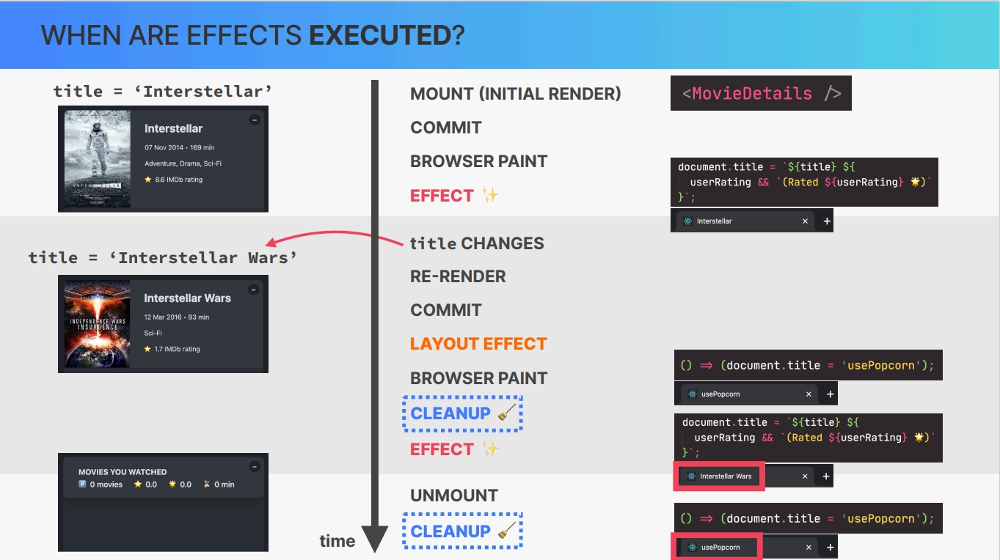

# `Effects and Data Fetching`

Probably 95% of all React apps out there fetch some kind of data from some API, Making data fetching an essential skill when building web applications. Now, one way of fetching data in a react app is inside an effect. And so that's what this section is all about. So in this section, we'll continue working on the use popcorn project as we learn all about side effects. So we're gonna focus on the **use effect** **hook**, **how and when effects are executed**, and **how we can clean effects up**.

And loading external data into our applications finally makes them feel a lot more real world and alive. And so let's quickly get started.

---

## `Table of Contents`

1. [The Component Lifecycle](#the-component-lifecycle)
2. [How NOT to Fetch Data in React](#how-not-to-fetch-data-in-react)
3. [useEffect](#useeffect)
4. [A First Look at Effects](#a-first-look-at-effects)
5. [Using an Async Function](#using-an-async-function)
6. [Adding a Loading State](#adding-a-loading-state)
7. [Handling Errors](#handling-errors)
8. [The useEffect Dependency Array](#the-useeffect-dependency-array)
9. [Synchronous Queries with Movie Data](#synchronous-queries-with-movie-data)
10. [Selecting a Movie](#selecting-a-movie)
11. [Loading Movie Details](#loading-movie-details)
12. [Adding a Watched Movie](#adding-a-watched-movie)
13. [Adding new Effect Changing Page Title](#adding-new-effect-changing-page-title)
14. [The useEffect Cleanup Function](#the-useeffect-cleanup-function)
15. [Cleanup the Title](#cleanup-the-title)
16. [Cleaning up Data Fetching](#cleaning-up-data-fetching)
17. [Effect_Listening to a keypress](#effect_listening-to-a-keypress)
18. [Entire code of this Section](#entire-code-of-this-section)
19. [Coding Challenge_Currency converter](#coding-challenge_currency-converter)

---

## `The Component Lifecycle`

So in this section we're finally gonna come back to our use popcorn project. However, before we go any further, we just need to look at one more slide here where we will quickly learn about the life cycle of components because this is gonna be highly relevant for the rest of the section. And actually **I should say that we're gonna learn about the life cycle of a component instance because it's only an actual physical instance of a component that can go through a life cycle.** But as I mentioned earlier, it's just a bit too much work to always say component instance. And so for the rest of this lecture I will just say component most of the time which is what everybody else also does. So no one can always say component instance. That's just too much work.

But anyway, **what does component life cycle actually mean?** Well, the life cycle of a component basically encompasses the different phases that a specific component instance can go through over time. And the first phase in any component life cycle is that a component instance is **mounted**, which is also called the **initial render**. So this is when a component is rendered for the very first time based on everything that we have learned in the previous section. This is also when fresh state and props are created for the component instance. And therefore, I like to use the analogy that the component is born in this phase.

Now once the component has been rendered and is on the screen it can be re rendered an unlimited number of times. Now as we learned in the previous section, a react application is re rendered whenever there is a state update, right?

However, back then we were only talking about the entire application not about one specific component instance. So in practical terms **a component will also be re rendered when the props that it receives change when its parent component rerenders or when something called context changes, and more about context later.** Now the re render phase is actually optional. So it doesn't always happen in all components. So some components are only mounted and then unmounted right away which actually brings us to the next phase.

So finally there comes a point in time where a component instance is no longer needed. And so that's when the component is unmounted. This is when a component basically dies. So in this step the component instance is completely destroyed and removed from the screen along with its state and props. And of course we have already seen this happening many times in the applications that we have been building.

So this can happen when users navigate to a new section or a new page of the app or when they close the app altogether. Now, of course, a new instance of the same component can be mounted later but this specific instance is now gone. So it has been unmounted and that's actually it. So pretty straightforward, right? Especially after that deep dive last section.

**So why was it even worth learning about this now?** Well, it's important to know about the component life cycle because **we can hook into different phases of this life cycle.** So we can basically define code to be executed at these specific points in time which can be extremely useful. And we do so by using the useEffect hook, which is the big topic of this section.


---

## `How NOT to Fetch Data in React`

Let's now load some data into a react application for the very first time. However, in this lecture let's start by doing it the wrong way basically, which is going to be a great learning experience.

As we have learned before in the previous section **we should never update state in render logic**, right? But now in this lecture let's actually break that rule so that we can see why it actually exists in the first place. And breaking rules like this is actually a pretty great way of learning React and also its rules even better.

Now the idea here is to fetch some movie data as soon as the app component here mounts for the very first time. So as soon as it has its initial render. So to fetch that data we use the OMDB API which is basically like an open version of IMDB. Now to get started, you need to get your own API key which you can get for free.

And then once you have that you can just come back here to the main page so we can see how we can use this API. So our data requests should simply be sent to this URL. So just copy that and then here(in App component) let's fetch the data using the fetch API. So using the fetch function like this. Alright.

But anyway, here now of course you need to place your own key and actually I want to do this. So I want to place this key in a separate variable. So let's define that out outside the component function. So key and by now after that long previous section you know why we should actually define a variable like this outside the component function.

And the reason for that is that each time the component gets re rendered this entire function here will be executed again. So basically all the render logic. And so if this variable definition here is part of that render logic it will also be recreated each time that the component renders which is in this case of course not a big deal but it's good to already get into the habit of not doing that.

So **when you're just defining a variable like this that doesn't depend on anything that's inside the component then just declare it outside.**

And now let's go back to the documentation page <https://www.omdbapi.com/> where we can see that we can query the API in 2 ways. So we can search for an ID or title or we can actually search by some query string. And so that's actually what we will do here. So here let's use s and then equal and then here you can type your favorite movie which for me probably is interstellar. Not 100% sure of that but it's definitely a great one.

```js
// HERE SOMETHING WILL DIFFERENT FROM JONAS CODE

const apiKey = "f84fc31d";
const searchTerm = "interstellar";
// const url = `https://www.omdbapi.com/?apikey=${apiKey}&s=${searchTerm}`; // Error CORS issues

// It's wos working. some error so I'm using the fetch function with https://api.allorigins.win/get as a proxy to overcome CORS issues.
const url = `https://api.allorigins.win/get?url=${encodeURIComponent(
  `https://www.omdbapi.com/?apikey=${apiKey}&s=${searchTerm}`
)}`; // now working

fetch(url)
  .then((response) => {
    if (!response.ok) {
      throw new Error("Network response was not ok");
    }
    return response.json();
  })
  .then((data) => {
    console.log(data);
  })
  .catch((error) => {
    console.error("Fetch error:", error);
  });
```

Okay. But anyway, now we need to handle the promise that the fetch function here returns inside and of course here it's then. So inside a then method which gets access to the response and then here we can convert that response to JSON immediately which will return another promise and so we chain on another then and then here we get access to the data which we can then for now log to the console. And for now that's actually it. So let's check out our console and let's just reload quickly. And indeed you see that React was able to fetch the data from the API.

So we are just interested in the search here. And so all the movies here are in fact about interstellar, which means that our query here is already working.

Now as we learned in the previous section, this data fetching that we're doing right here is actually introducing a side effect into the components render logic. So it is clearly an interaction with the outside world which should never be allowed in render logic. So So again **all this code that is here at the top level of the function is of course code that will run as the component first mounts and therefore it is called render logic.**

And so again here we should have no side effects. I mean in this example where we only log something to the console it actually appears to work just fine. But watch what happens if we set some state here.

And so as I was just saying let's now here actually set state for movies and watched states. So that list of movies that we get from the API we now want to get it into our movie state.

```js
export default function App() {
  const [movies, setMovies] = useState([]);
  const [watched, setWatched] = useState(tempWatchedData);

  const apiKey = "f84fc31d";
  const searchTerm = "interstellar";
  const url = `https://api.allorigins.win/get?url=${encodeURIComponent(
    `https://www.omdbapi.com/?apikey=${apiKey}&s=${searchTerm}`
  )}`; // now working

  fetch(url)
    .then((response) => response.json())
    .then((data) => setMovies(JSON.parse(data.contents).Search)); // Causing infinite recursion
  // Here i used JSON.parse to convert  to convert JSON string into a JavaScript object.

  return (
    <>
      <NavBar>
        <Logo />
        <Search />
        <NumResults movies={movies} />
      </NavBar>
      <Main>
        <Box>
          <MovieList movies={movies} />
        </Box>
        <Box>
          <WatchedSummary watched={watched} />
          <WatchedMovieList watched={watched} />
        </Box>
      </Main>
    </>
  );
}
```

Beautiful, we got some data from the API, showing up in our UI. But watch what happens when we check out the network tab. **So you see that it's basically running an infinite number of requests here. So it keeps going and it never really stops. So every second our app is firing off multiple fetch requests to this API which of course is a really really bad idea.** So,

**why do you think that is? Why do you think all these fetch requests are being fired off?**

Well, the reason is that **setting the state here in the render logic will then immediately cause the component to rerender itself again.** So that's just how state works, right? However as the component is rerendered the function here of course is executed again which then will fetch again which in turn will set the movies again as well. And then this whole thing starts over and over again. So as the state is dead the component is re rendered again, which then will fetch again, which will set the movies again. And so this really is an infinite loop of state setting and then the component re rendering. And so this is the reason why it is really not allowed to set state in render logic.

So let's quickly set this back here so that we don't have like a 1000000 requests here. And so as we reload then it stops.

And let's just see another example here quickly. So let's say we did set watched immediately here in the top level code to some empty array and then actually we do get a real error.

```js
fetch(url)
  .then((response) => response.json())
  // .then((data) => setMovies(JSON.parse(data.contents).Search));
  .then((data) => console.log(data));

setWatched([]); // Real Error
```

We get the error of _Too many re-renders. React limits the number of renders to prevent an infinite loop_. And so that's now because of this state setting right here.

**_So if we're really setting the state here in the top level even without being inside a then handler then immediately react will complain that there are too many renders, which means that we again entered that infinite loop where updating state will cause the component to rerender which will cause the state to be set and so on into infinity._**

So let's of course get rid of that, let's reload here, and so now we are again good. However, we do actually want to set the state here(functions Top level). So we do want set movies here but without all the problems that we just saw. And so how can we do that? Well, that's where we need the `useEffect` hook which we will learn about in the next lecture.

---

## `useEffect`

So let's now learn about the next important tool in our React toolbox which is the **useEffect hook**. So we already know about the useState hook and so now it's time for our second hook which is the useEffect hook.

Now the idea of the useEffect hook is to give us a place where we can safely write side effects like our data fetching but the side effects registered with the useEffect hook will only be executed after certain renders. For example, only right after the initial render which is exactly what we are looking for in the situation.

Now we will learn all about what this hook actually is? but for now let's just use it in practice. So just like with **useState** we just write **useEffect** and then we also need to make sure that it has been imported automatically here from React. So just like useState again this is also a function that is part of React and so therefore that we need to import.

**Now the useEffect doesn't return anything so we don't store the result into any variable but instead we pass in a function. And so this function is then called our effect and it contains the code that we want to run as a side effect.** So let's paste the fetch in this function, but we are actually not done yet because **now we need to pass in a second argument which is the so called dependency array.**  
Now this dependency array is actually the most confusing part of this hook and we will again learn all about this throughout this section. But for now what you need to do here is to just pass in an empty array which means that the effect that we just specified here will only run on mount(initial render). So it will only run when this app component here renders for the very first time.

_And so now here let's change this back to setMovies, give it a save, and yeah, our movies here are now in the user interface but even more importantly let's check if the problem from before has been solved. And indeed now we have no more infinite loops here and no more infinite requests to our API. So the problem that we created in the previous lecture has indeed been fixed. And so now our effect is only running as the component mounts. Great._

And so this is basically the very bare bones way in which we do data fetching in simple react applications like this one. At least if we want to fetch our data as soon as the application loads. Now in a larger more real world application, we may use some external library for data fetching. But again in a small application like this one this is now a great way to fetch some data on mount. So when our application first loads.

### `Quick Recap`

So let's just quickly recap here. So we used the useEffect hook to register an effect. And so that effect is the function, which we passed in useEffect, which contains the side effect that we want to register. And basically register means that we want this code here not to run as the component renders but actually after it has been painted onto the screen. And so that's exactly what useEffect does.

So while before the code was executed while the component was rendering. So while the function was being executed now this effect will actually be executed after render. And so that's a lot better. Then as a second argument we passed the empty array here into useEffect. And so this means that this effect will only be executed as the component first mounts.

Okay, and that's actually it. So this is how we use the useEffect hook in practice in a simple situation like this. And so next up, let's now take a bit of a closer look at this new hook.

---

## `A First Look at Effects`

So we just used the useEffect hook for the very first time in order to fetch movie data as the component mounts. **But what actually is an effect and how is it different from an event handler function?** Well, let's find out in this lecture. And just so we're all on the same page, let's start by reviewing what a side effect is. **So basically in React, a side effect is any interaction between a React component and the world outside that component.**

And we can think of a side effect as some code that actually makes something useful happen. For example, fetching data from some API. So what this means is that we actually need side effects all the time when we build React apps. Now we already know that **side effects should not happen during the component render.** Or in other words, side effects should not be in render logic.

Instead, **we can create side effects in 2 different places in React**. First one is **inside event handlers**. And remember that event handlers are simply functions that are triggered whenever the event that they are listening to happens. However, simply reacting to events is sometimes not enough for what an application needs. Instead, in some situations, we need to write some code that will be executed automatically as the component renders.

And so this is **when we can create a so called effect by using the useEffect hook.**

So **by creating an effect, we can basically write code that will run at different moments of a component instance life cycle.** So when the **component mounts**, when it **rerenders** or even when it **unmounts**. And this is really great because, it opens up a whole new door of possibilities.


Okay, but let's now get just a bit deeper into how effects work by comparing event handlers to effects created with the useEffect hook.

And let's go back to the example of fetching movie data that we have been using. So fetching movie data is very clearly a side effect because it's clearly an interaction with the world outside the component. Now there are 2 different possibilities of when we might want to create this side effect. **The first possibility is that we might want to fetch movie data only when a certain event happens.** So in that case we will of course just use an event handler function.

The Second possibility of when to fetch the data would be to do so **immediately after the component mounts**, so after it is first rendered. And so this is exactly what we did in the previous lecture when we first used the use event hook to specify an effect that was executed right after the component was painted to the screen. So we can say that these two pieces of code produce the exact same result.


So they both fetch data about a movie, but they do so at different moments in time. **So the event handler executes when an event happens** and **the effect executes whenever the component first renders, at least in this situation because the exact moment at which the effect is executed actually depends on its dependency array which I shortly mentioned in the last lecture.** So we can basically use this dependency array to tell the effect to also run after a component rerenders. But I won't go deep into this right now because that's easier to explain with code. But speaking of the dependency array, this array is just one of 3 parts that any effect can have.

So besides the dependency array we have of course **the effect code itself** and also **each effect can return a so called clean up function** **which is a function that will be called before the component rerenders or unmounts.**

Now thinking about different moments of the component life cycle, so mounting, rerendering, and unmounting can be very helpful to understand how effects work. However, we should actually not think about life cycles but about synchronization. So **the real reason why effects exist is not to run code at different points of the life cycle but to keep a component synchronized with some external system.** So in this example that would be to keep the component in sync with the movie data that comes from some external API.

And if that sounds super confusing keep in mind that this is just a first introduction to effects. We will come back to all this after having used the useEffect hook a bit more in practice. But anyway, to finish our comparison here, as we just learned, **we use effects to keep a component in sync with the external world.** While on the other hand, **we use event handlers to react to a certain event that happened in the user interface.**

**_Now what's very important to note here is that event handlers are always the preferred way of creating side effects. So whenever possible, we should not overuse the useEffect hook. So basically, everything that can be handled inside event handlers should be handled there._**

---

## `Using an Async Function`

Let's now convert our effect to an async function instead of the basic promise handling that we're doing right now. So many times when we need a lot of code to handle a promise it's a lot easier and nicer to just have an async function. And here I will just assume that you already know what async await is. So we might think that all we need to do in order to use an async function is to place the async keyword here, so before the function keyword, and then use await inside of it. **However, we immediately get this warning from ESLint which tells us that effect callbacks are synchronous to prevent race conditions**.

So basically **the effect function that we place into useEffect cannot return a promise which is what an async function does.** So instead of doing it directly, we just create a new function and then we place the async function in there. So let's call this one fetchMovies. Okay. And then let's of course adapt this function here to using the await keyword.

Alright. But now of course nothing is happening because no where we are calling this function. So our effect is now this function(outside) right here, right? But this function, all it's doing right now is to define yet another function. So this async fetch movies and so then at the end we just call it and then it is back to working.

```js
export default function App() {
  const [movies, setMovies] = useState([]);
  const [watched, setWatched] = useState([]);

  useEffect(function () {
    async function fetchMovies() {
      const response = await fetch(url);
      const data = await response.json();

      setMovies(JSON.parse(data.contents).Search);
      console.log(movies);
    }

    fetchMovies();
  }, []);
```

Okay, And now what I also want to do is to log our movies to the console. So the movies that we received from the API to the console **console.log(movies)**⤴ just so I can show you something. **And let's reload to actually see the true result which is an empty array.** **So why is this happening?**

Well hopefully you learned in the previous section that **setting state is asynchronous.** So in other words after the state has been set here **setMovies()** or actually after we instructed React to set the state that doesn't mean that this happens immediately. So instead it will happen after this function here has been called.

And so right here in this line of code where we log, we have stale state which basically means that we still have the old value as the state was before. And in this case before it was just the empty array, so our initial state.

Now what I wanted to talk about is why we always have these 2 outputs. So basically why we have these 2 requests here happening, so in console we always has two values for single log. Well, **the reason for that is React's strict mode.** So **when strict mode is activated in React 18, our effects will not run only once but actually twice.** So React will call our effects twice but only in development. So when our application is in production this will no longer be happening.

And so this is just so that react can identify if there are any problems with our effects. So if we come here quickly just to index.js and if we remove the strict mode from here, let's reload and then you see that we only get one output here which means that there was only one HTTP request. So the effect was only called once indeed.

But let's put it back because this is somehow a bit safer. Okay, and that's it for this lecture. Next up let's make this data fetching here a bit more complete with a loading state.

---

## `Adding a Loading State`

Let's now add a very simple loading indicator to our application. So basically whenever the movie data here is still being loaded in the background, we want to instead display some kind of loading indicator right on the UI. And to show you what I mean let's come here to the network tab which is always a good friend when we're dealing with HTTP requests. And then let's throttle our network here to a slow 3G. And so then I can easier show you what I mean. So all of this will now take a lot of time to load, but here you now see this flash where there is no content basically. So the movie data was loading but hadn't arrived yet.

And so now again, in the meantime, we want to display some loading indicator. So in order to do that we need some more state. So a state variable which basically tells our UI that the data is still being loaded and then as soon as the data has been loaded we want to display then the data and not that loading indicator anymore.

But anyway, let's simply create that state variable and usually it is called isLoading. And so then setIsLoading and let's start with false. Now then let's come here to our effect into our async function. And so then right before the fetching actually starts let's set isLoading to true. And so this then will indicate our UI that loading is being happened and that we can then render that indicator over there. And then when all of this is done, so let's do it right at the very end. So this one we don't need anymore. So here after everything is finished we can then set the isLoading state back to false. And now it's very easy. So here inside this box, we basically want to say that if is loading then we want to display that indicator and I will actually create a new component for that.

```js
// App component
const [isLoading, setIsLoading] = useState(false);

useEffect(function () {
  async function fetchMovies() {
    setIsLoading(true);
    const response = await fetch(url);
    const data = await response.json();

    setMovies(JSON.parse(data.contents).Search);
    console.log(movies);
    setIsLoading(false);
  }

  fetchMovies();
}, []);

<Box>{isLoading ? <Loader /> : <MovieList movies={movies} />}</Box>;

// Loader component
function Loader() {
  return <p className="loader">Loading...</p>;
}
```

Let's call it loader or else display that movie list. Okay. So creating that loader, that's just very simple. We just return a paragraph with the class of loader, and then here we can say just loading.

Yeah, but you immediately saw that it was already working.

And so with this, this whole behavior is a bit more natural and also a bit more real world because in all real applications you always have some indication to the user that some data is being fetched.

---

## `Handling Errors`

So whenever we are doing any data fetching in any web application and dealing with asynchronous data, we always need to assume that something can go wrong. And so therefore, let's now account for that situation by handling those errors. So, one of the things that can go wrong is your users suddenly losing their Internet connection. So let's simulate that here again in our network tab, and let's make sure that we are first on slow 3g. Then let's reload here, and then while the movies are loaded we will click on offline.

So right now, so you see that now the application basically never leaves this state. And also when we come to our console here we see that we failed to fetch which again is because our user basically now lost their internet connection. So when that happens we want to display some kind of error message here on the screen and not keep the application in this loading state here forever. Because like this the user will think that the data might eventually arrive, but of course it will not. Now reacting to errors like this is actually not built into the fetch function itself. And so we have to kind of do that manually.

And so let's try that here in our fetch movies function. So here on the response object that we receive from fetch exists one **ok** property. And so here we can check for that. So basically if the response is not **ok** then we want to throw a new error. **_if (!response.ok)
throw new Error("Something went wrong with fetching movies.");_**

Okay. And so now if we throw an error we need to wrap all of our code into a try catch block. So try and catch which again is just a normal JavaScript feature.

So let's actually just log error dot message. So this is the property of the error where the string that we passed in **_new Error("Something went...")_** object will get saved into But then what we're actually interested in is to get this message here onto the screen. So basically displaying the string on UI, instead of loading... So that means that we need another piece of state. **So basically a piece of state indicating whether we currently have an error or not.**

**So error and setError. And so here this one is actually not a boolean but it's the error message.** Okay. So here let's then set the error to actually that message. And again error.message is basically this string that we passed into the error.

And error is the error itself as it was passed into this catch block. And again, that is just basic JavaScript. Alright? And then let's do some conditional rendering here to basically get the error here onto the screen whenever there exists 1. Okay.

And let's start by creating a new error component here or maybe let's call it ErrorMessage and it will receive a prop with some message that it will then display on the screen. So let's return again a paragraph this time with the class name of error. So this is a very simple presentational component. Remember that? Okay.

```js
function ErrorMessage({ message }) {
  return (
    <p className="error">
      <span>💥💣🤯</span> {message}
    </p>
  );
}
```

Now here in our conditional rendering, basically what we want to do is that when it's no longer loading then we want to display this movie list but only if there was no error also. So basically here we now would have to nest another ternary inside this ternary. But that makes for really ugly code and so let's do something else instead.

```js
<Box>
  {/* {isLoading ? <Loader /> : <MovieList movies={movies} />} */}
  {isLoading && <Loader />}
  {isLoading && !error && <MovieList movies={movies} />}
  {error && <ErrorMessage message={error} />}
</Box>
```

So here the situation is indeed a little bit tricky with all these different states that we have and with all the conditional rendering but while these are now 3 mutually exclusive conditions. So it is either loading or it is not loading and there is no error or there is an error. So only one of these 3 here can be true at the same time. And so that's very important so that we don't display multiple of these components at the same time by mistake.

_So let's give it a save and let's try again. So back to our 3g, and then I will set it to offline very soon. Let's wait for it._

And there it is. So we get our error message correctly displayed here. However, there's still some problem because the loading state is still set to true. And in fact, that's actually correct. So as soon as the error is thrown, rest of the code is no longer evaluated. And so therefore is loading is never set to false. So our application will keep thinking that the data is still being loaded.

So again the problem is that after the **throw new Error()** is being thrown then React will basically never see this piece of code here where the loading state is reset. So instead of doing that here let's attach a **finally block** here. So this block of code here will basically always be executed at the very end.

Now I want to handle another kind of error which is not really an error but also a situation where we want to display a message which is **the situation in which we cannot find any movie for the search query.** if we put something like this: **const query = "hf2jk3lk4kjj4";**

And of course, the API will not find anything. Lets check with some random text as a query. what happens here? Well, basically the length cannot be read of undefined. And so the problem here is that the data that comes back from the API now is apparently undefined.

So as I was saying in the very beginning, we always need to handle all these different situations that can go wrong. And when we are working with data fetching, there's always a lot of things that can go wrong. So working with data is a lot of work but it's also essential in most if not all web applications. But anyway, here we can now use the response to our advantage in order to throw another error in this situation.

So we can say that data. Response, So in this case if data dot response is equal false and so for some reason the API here responds with a string of false and not a boolean, but well this still works. So in this case let's also throw a new error and let's simply say movie not found. Alright.

And beautiful. Let's just reload and then here we get this log. So that's this console dot error coming from here and then indeed we get our error message also displayed on the UI. So this one was maybe a little bit trickier. So let's just quickly recap.

```JS
const apiKey = "f84fc31d";
// const query = "interstellar";
const query = "jkjkjkjlk";
const url = `https://api.allorigins.win/get?url=${encodeURIComponent(
  `https://www.omdbapi.com/?apikey=${apiKey}&s=${query}`
)}`;

export default function App() {
  const [movies, setMovies] = useState([]);
  const [watched, setWatched] = useState([]);
  const [isLoading, setIsLoading] = useState(false);
  const [error, setError] = useState("");

  useEffect(function () {
    async function fetchMovies() {
      try {
        setIsLoading(true);
        const response = await fetch(url);

        if (!response.ok)
          throw new Error("Something went wrong with fetching movies.");

        const data = await response.json();
        console.log(data);

        if (JSON.parse(data.contents).Response === "False")
          throw new Error("Movie not found");
        setMovies(JSON.parse(data.contents).Search);
        console.log(movies);
        setIsLoading(false);
      } catch (err) {
        console.error(err.message);
        setError(err.message);
      } finally {
        setIsLoading(false);
      }
    }

    fetchMovies();
  }, []);

  // setWatched([]); // Infinite loop

  return (
    <>
      <NavBar>
        <Logo />
        <Search />
        <NumResults movies={movies} />
      </NavBar>
      <Main>
        <Box>
          {/* {isLoading ? <Loader /> : <MovieList movies={movies} />} */}
          {isLoading && <Loader />}
          {!isLoading && !error && <MovieList movies={movies} />}
          {error && <ErrorMessage message={error} />}
        </Box>
        <Box>
          <WatchedSummary watched={watched} />
          <WatchedMovieList watched={watched} />
        </Box>
      </Main>
    </>
  );
}

function Loader() {
  return <p className="loader">Loading...</p>;
}

function ErrorMessage({ message }) {
  return (
    <p className="error">
      <span>💥💣🤯</span> {message}
    </p>
  );
}
```

So what we did was to implement another state variable this time specific for the error. So that whenever some error occurred we could store the error message in there and then display it in the UI as soon as an error occurred. Now as soon as an error did occur we threw a new error and then we caught that error inside the catch block of this try catch. And so this is a standard way of catching errors in JavaScript. And so in this situation we then set the error state to the message of the error that we specified here.

Then finally we used of course that state variable in order to render something on the screen conditionally. So this part here is maybe a bit confusing and so make sure that after this lecture you just analyze exactly what's happening here and that in fact these three conditions here are mutually exclusive. So only one of them will ever be true. Okay, and I think that for now this is enough for error handling in this application.

---

## `The useEffect Dependency Array`

So I have mentioned the useEffectDependency array a few times already, but we don't know yet what it actually does and how it works. As we saw at the beginning of this section, by default an effect will run after each and every render. However, that's almost never what we want. But the good news is that we can change this default behavior by passing a dependency array into the useEffect took as a second argument.

**But why does useEffect actually need an array of dependencies?** Well, the reason is that without this array React doesn't know when to actually run the effect. But if we do specify the effect dependencies **by passing in the dependency array, the effect will be executed each time that one of the dependencies changes.** And we will come back to why this is so amazing in the next slide. But for now, this is all you need to know.

**Now, what exactly are those dependencies?** Well, **effect dependencies are state variables and props that are used inside the effect**. And the rule is that each and every one of those state variables and props must be included in the dependency array.


But let's take a look at an example to understand what I'm talking about. And the code here(image ⤴) is really not important. What matters is that **the effect uses the title prop and the userRating state.** We can clearly see at the top of the code that title is indeed a prop and that user rating is indeed a piece of state. Therefore, both of them must be included in the dependency array. So the effect function depends on these variables to do its work.  
And therefore we need to tell react about them. Otherwise if the title or the userRating changes react will not know about this change and therefore it won't be able to re execute the effect code. **And this will then lead to a bug called stale closure.**

_And we will talk about what a stale closure is and also about some more rules for the dependency array in a later more advanced section. But for now let's actually understand why the dependency array is so important for the useEffect hook._

So I like to think of the useEffect hook as an event listener that is listening for one or more dependencies to change. And when one of the dependencies does change useEffect will simply execute the effect again. So a bit like a regular event listener but for effects. But let's go back to our previous example where we had the title and userRating dependencies in the array. So whenever the title or the user rating changes, React will execute the effect again.  
So it will run the code one more time which will in turn update the document title. So the website title that we see in a browser tab. So essentially effects react to updates to state and props that are used inside the effect because again those are the effects dependencies. **So in a way effects are reactive, just like React reacts to state updates by re rendering the UI.** And this is extremely useful and powerful as we will see throughout the rest of the course.

But all this only works if we correctly specify the dependency array. Okay, but now let's remember how I said in the very first lecture about effects that effects are used to keep a component synchronized with some external system. So some system that lives outside of our react based code. And if we think about it, that's exactly what is happening here. So the state and props of our component are now in fact synchronized with an external system, which is in this case the title of the document.


Now updating the title in some other way will of course not magically update the title or user rating. So the synchronization only works in one way, but that's not really the point. The same actually happens with state updates and we still say that the UI is in sync with state. So the point is that **useEffect truly is a synchronization mechanism.** So a mechanism to synchronize effects with the state of the application, and you will discover this each time that you're gonna use an effect. And so let's go explore this a little bit further.

So as we just learned, whenever a dependency changes, the effect is executed again. But now let's remember that **dependencies are always state or props.** And what happens to a component each time that its state or props are updated?  
**The component will rerender. This means that effects and the life cycle of a component instance are deeply interconnected.** That's why when the useEffect hook was first introduced many people thought that it was a life cycle hook rather than a hook for synchronizing the component with a side effect. Now the conclusion and the big takeaway from this is that **we can use the dependency array in order to run effects whenever the component renders or rerenders.** So in a way the useEffect hook is actually about synchronization and about the component lifecycle.

**Okay. And so with this knowledge let's look at the 3 different types of dependency arrays that we can specify and also how they affect both synchronization and life cycle.**


1. `Multiple Dependencies`  
   So when we have multiple dependencies like in this first example(⤴ image), variables x y and z, it means that the effect synchronizes with x y and z. Now in terms of the life cycle it means that the effect will run on the initial render and also on each rerender triggered by updating one of the dependencies x, y, or z.

   So again, just to make this crystal clear, the effect will be executed each time the component instance is being rerendered by an update to x, y, or z. But if some other piece of state or prop is updated then this particular effect will not be executed.

2. `Empty Dependency Array`  
   **Now if we have an empty dependency array that means that the effect synchronizes with no state or props and therefore it will only run on mount.** In other words, if an effect has no dependencies it doesn't use any values that are relevant for rendering the component. And so therefore it's safe to be executed only once.

3. `No dependency Array at all`  
   Finally, if we have no array at all we already know that the effect will run on every render, which is usually a really bad idea and not what we want.

   Now if the effect runs on every render that basically means that the effect synchronizes with everything. So essentially every state and every prop in a component will be dependencies in this case.

And now to finish, let's look at when exactly effects are executed during the render and commit process. Now I mentioned in the 1st lecture on effects that effects are executed after render. And while that's not wrong, it's also not the full story.

So let's look at a timeline of events that happen as components render and rerender. And I found this extremely useful when I first learned about the useEffect hook myself. And so I think that you will benefit from this as well. So as we already know, the whole process starts with mounting the component instance. In this case an instance of movie details.

After that the result of rendering is committed to the DOM and finally the DOM changes are painted onto the screen by the browser. So this is just what we learned in the previous section. **But where do effects come into play here? Well, effects are actually only executed after the browser has painted the component instance on the screen. So not immediately after render as you might have thought initially.**

That's why we say that effects run asynchronously after the render has already been painted to the screen. And the reasons why effect work this way is that effects may contain long running processes such as fetching data. So in a situation like that, if react would execute the effect before the browser paints a new screen, it would block this entire process and users would see an old version of the component for way too long. And of course, that would be very undesirable. **Now one important consequence of the fact that effects do not run during render is that if an effect set state then a second additional render will be required to display the UI correctly.** And so this is one of the reasons why you shouldn't overuse effects.


Okay, but moving on now, let's say that the title was initially set to interstellar, but then it changes to interstellar wars. And since this title is a prop, it means that the component will rerender and the dom changes will be committed and painted to the screen again. Now since title is part of the dependency array of this effect the effect will be executed again at this point. So just as we learned in the last slide.

And this whole process can of course be repeated over and over again until this movie details instance finally unmounts and disappears from the screen.

Now you might notice that there is actually a hole between the commit and BrowserPaint. Right? **And the reason is that in React there's actually another type of effect called a layout effect. So the only difference between a regular effect and a layout effect is that the layout effect runs before the browser actually paints the new screen.**

But we almost never need this and so the react team actually discourages the use of this use layout effect hook. I simply mentioned this here so that you know that this also exists. And actually there are even 2 more holds in this timeline, but we will talk about these mystery steps by the end of the section. So stay tuned for that.

---

## `Synchronous Queries with Movie Data`

Let's now put some of the things that we just learned in the previous lecture into practice and also magically synchronize our search query with the movie search results. And I actually want to start this lecture with a couple of experiments. Lets rename variable query to tempQuery and that's because now we actually want to get the query state that right now lives here inside Search component into the App component, so into its parent component.

So we're basically lifting this state up because we will need it here inside the App component. So now let's pass those props in. So that's query equals query and setQuery equals setQuery.

Okay. let's do those experiments that I was talking about. So basically I want to write a couple of effects here and then I want you to guess in which order they will be executed. At least that's gonna be our first experiment.

So let's write one effect and then as always we need to specify a function and this one will log to the console the string A. Alright. Then let's get another one and notice how this one doesn't have a dependency array. Well, let's actually add it to this one but the second one here won't have any. So this one will just log the string B. And then finally, I will simply do a console dot log right here in the top level.

```js
useEffect(function () {
  console.log("A");
}, []);

useEffect(function () {
  console.log("B");
});

console.log("C");
```

Okay. And now without running this code let's try to guess in which order these three strings here will appear in the console. So have you thought about it?

Okay, And actually we have a lot of, renders here, a lot of results, but that's because the application has rendered and rerendered a couple of times. And so then we got all these logs and also keep in mind that these effects actually run twice. But what matters here is that first we got C then A and then B.  
**So why did we get C first even though it appears later here in the code?** **Well, the reason is that as we just discussed before effects actually only run after the browser paint while the render logic itself runs well as the name says during render.** And so then it makes sense that of course console.log('C'd) executed first, So during the render of this component. And then we have A and B which come from these two effects and so A is rendered first simply because it appears first in the code.

Okay. Now let's actually clear the console and now **what I'm going to do is to type something here in the search bar.** `[Important]`

And so let's see what happens then, and we get some more outputs. So we get C and B. **So is this what you were expecting?**

Well, let's again analyze what just happened here. So we updated the state here which is the query state. And as a result the component was rerendered. And then just like before, this code here(that's inside the component function) was executed and so therefore we see the letter C first. And then after that we also have a B log. And so there is this effect here which has no dependency array **which remember basically means that this effect is synchronized with everything**. And so therefore it needs to run on every render while this other effect here, this first effect(A) is synchronized with **no variables at all which is the meaning of this empty array.** And therefore this effect(A) was not executed as the component was re rendered with the query state.

Okay. So now we can change here the strings only for you to keep as a reference here just so we're understanding what's actually happening. like this:

```js
// App component

useEffect(function () {
  console.log("After initial render only");
}, []);

useEffect(function () {
  console.log("After every render");
});

console.log("During render");
```

So now let's do another one. So one final experiment here which will be yet another effect. Let's call this one D now and here in the dependency array we will have the query state. So give it a safe and now watch what happens when we type in search input field. Now we have this other effect(D) which is synchronized with the query state variable. And so this query just changed and therefore this effect was executed and logged D. And if we keep doing this then D keeps getting logged to the console. While if we changed some of other states then we would not get D logged here.

```javascript
useEffect(
  function () {
    console.log("D");
  },
  [query]
);
```

But anyway that's no use what we just did here to our actual advantage in the application. And so now the time has come where we actually want to use the query from here right inside this URL where we fetch the movies. So basically we want to fetch movies based on the search query right here from UI. So instead of the temporary query let's now use query. Give it a save but of course like this it is not going to work.

```js
const url = `https://api.allorigins.win/get?url=${encodeURIComponent(
  `https://www.omdbapi.com/?apikey=${apiKey}&s=${query}` // here query is query state
)}`;
```

So as we change this here in search bar something nothing is going to happen. **And why is that?** Well, it's because this effect is not yet synchronized with the query state. So we are using the state variable inside the effect but the effect doesn't know yet that it will have to rerun each time that the query state changes. And so to fix that we need to include that query here in a dependency array.

And so as we give it a save now, let's again reload and here now we get this error that the movie is not found which is because our query by default is just this empty string. But if we try now, let's say test then, well, it still doesn't work. So let's come again to our network tab. So let's just check out if actually the HTTP request has been correctly made. And so by doing this you're also learning about these very important developer tools here. Okay.

So here we see some new HTTP requests and as we click here we actually do see a response. So there is something there but somehow our movies are still not being shown here. And I think I know the reason for that which is that we are never resetting the error state. So at some point we had some error here but now we no longer have an error. But at no point in the application we are actually resetting it.

So we should do it right here at the very beginning. So basically always before we start fetching for data we reset the error. So set error and then back to the empty string. Give it a save and now we get some results for test. Okay.

Now I want to fix this problem that when we have no search query here then it tells us movie not found which is not really true. I mean it is true because the API actually searched for a movie with an empty string but in a situation where we have no query we actually don't even want to search, Right?  
And so let's do that here in our effect. And actually let's do it before we even call this function fetchMovies(). So we can say if there is no query dot length so it's going to be 0 in this situation then simply set the movies back to an empty array.

So basically then removing all the movies from the user interface and let's also reset the error back to nothing and then return. And so in this situation, then the fetch movies function will not even be called.

```js
if (!query.length) {
  setMovies([]);
  setError("");
  return;
}

fetchMovies();
```

And here we can actually go even further. So we can say, like, if the query length is less than 3 then it's not even worth searching as well. So it doesn't even make sense to have a query just like this **tes**.

```js
if (query.length < 3) {
  setMovies([]);
  setError("");
  return;
}

fetchMovies();
```

Right? So there's no movies really called like that. So going back again to our network tab, if you just type like this you see then no new fetch requests were made. But now if I keep writing, so now we have more than 3 characters then we had our first HTTP request to the API. Then we got these results and if I type again then you see we got another one. And now when I delete all this then it simply goes back to empty. So we deleted all the movies from our state basically.

Okay. And so with this we have the basic functionality already implemented.

`So let's recap what we just did here and what is going to happen whenever we type a new query here.`

So the query is of course a piece of state, right? So that is pretty obvious. And so we are referencing that query variable a couple of times inside our effect here. Right? And so therefore we then included this query variable also in the dependency array of this effect.

And so now our useEffect hook is basically like an event handler that is listening for the query to change. And so then when it changes the entire effect is executed again, which in our case means that a new request is gonna be made to our movies API. So again, this effect that we just wrote here basically reacts to an update to this state variable which makes the entire effect basically reactive. So reactive to that state. But at the same time our effect will also be still executed during the initial render.

Just right now that is the empty string which we just basically told our effect to ignore. So let's write another amazing movie here. And so as we save this now and so as our application first loads it will immediately fetch the data right here. And so indeed as we just learned in the previous lecture, this effect basically now runs on the initial render and whenever the state variable here updates. So it is synchronized with this variable here.

And as you see this is really really powerful and can be used in all kinds of situations. So make sure that you really understand everything that we just did here as this was a really really important lecture. And then let's move on to the next lecture where we will finally add the ability to select one of these movies so that we can then load some additional details here into the right side. So that's gonna be really really fun and so I hope to see you there soon.

```js
// updated App component
export default function App() {
  const [movies, setMovies] = useState([]);
  const [watched, setWatched] = useState([]);
  const [isLoading, setIsLoading] = useState(false);
  const [error, setError] = useState("");
  const [query, setQuery] = useState("");

  useEffect(
    function () {
      async function fetchMovies() {
        try {
          setIsLoading(true);
          setError("");

          const url = `https://api.allorigins.win/get?url=${encodeURIComponent(
            `https://www.omdbapi.com/?apikey=${apiKey}&s=${query}`
          )}`;

          const response = await fetch(url);

          if (!response.ok)
            throw new Error("Something went wrong with fetching movies.");

          const data = await response.json();
          // console.log(data);

          if (JSON.parse(data.contents).Response === "False")
            throw new Error("Movie not found");
          setMovies(JSON.parse(data.contents).Search);
          // console.log(movies);
          setIsLoading(false);
        } catch (err) {
          // console.error(err.message);
          setError(err.message);
        } finally {
          setIsLoading(false);
        }
      }

      if (query.length < 3) {
        setMovies([]);
        setError("");
        return;
      }

      fetchMovies();
    },
    [query]
  );

  // setWatched([]); // Infinite loop

  return (
    <>
      <NavBar>
        <Logo />
        <Search query={query} setQuery={setQuery} />
        <NumResults movies={movies} />
      </NavBar>
      <Main>
        <Box>
          {/* {isLoading ? <Loader /> : <MovieList movies={movies} />} */}
          {isLoading && <Loader />}
          {!isLoading && !error && <MovieList movies={movies} />}
          {error && <ErrorMessage message={error} />}
        </Box>
        <Box>
          <WatchedSummary watched={watched} />
          <WatchedMovieList watched={watched} />
        </Box>
      </Main>
    </>
  );
}
```

---

## `Selecting a Movie`

Let's keep working on our application and allow users to select a movie so that they can see some details about it. So what we want to do now again is to add the ability to select movie like we did, and so then our app will load some additional data about that movie and display it here. And then we can also go back by clicking on this button which will then close that movie. Alright. So basically that is adding some more dynamics to the application. And so what that means once again is that we need a new piece of state.

And so that state will basically store which movie has been selected here. Now the selection itself, so updating the state will happen in this box on the left side, right? But the displaying of the movie happens here on the right side box, so this box will also need to know about the selected ID. And so this means that this new piece of state, so the selectedId state will have to live in the parent component. So right in App component.

**So selectedId and setSelectedId. And we're going to start with null value as a default of useState**. **Now you might be wondering why here we are only going to store the ID and not the entire movie object itself.** Well, the reason for that is that the movies that we get here from the search are very limited. So we only get the data really about the title, the year, and the poster here. While here on the right side we will want all kinds of details that are not included in this first search. So there will have to be another API call. And we can see that here when we click it loads the movie again. And so only then all of these details here are fetched.

And this fetch here, so this movie will be fetched based on the ID that we got in the array so in from the movies array. So let's take a look at that quickly. **console.log(JSON.parse(data.contents).Search);** So it's very important that you understand how we actually built this application. So it's not just about the React concepts themselves but also about the logic of how we build an application. So I think that's also pretty important.

So let's see. So taking a closer look at our results each of the objects has the poster, the title, the type, the year, and the ID. And again, it's based on this ID that we then will search for details. And actually let's copy this ID here and we will temporarily put this in selectedId state as a default value. Alright.

Now let's create a new component. And so that component will then be displayed if there is a selectedId. So basically that's like a selected movie.

```js
function MovieDetails({ selectedId }) {
  return <div className="details">{selectedId}</div>;
}
```

And now going back up here into our JSX, here on the right side we now want to display that component that we just created in case that there is a selectedId. So let's wrap all of this into a JavaScript mode block and then let's do a ternary operator. So all we have to do is to say if there is an selected Id then display MovieDetails, that's the component that we just created. And then we pass in the selected ID. Okay. And if not then that's where we want to display these two, i-e WatchedSummary and WatchedMovieList. However this is not going to work, because here we have a piece of JSX after else:. So all this which has basically 2 root elements. So it doesn't have just one single parent element which remember is always necessary in a piece of JSX.

And so this is yet another great use case of a fragment because of course we don't want to create like a new div element or something like that around these two. And again, the reason for that is here as the third part of the ternary operator we needed a new piece of JSX which cannot have 2 elements as the root element. And so we just created 1 root element with the fragment. Okay.

So now we can indeed see that ID, that we passed in as a default value of selectedId state. But of course we don't want this to be hard coded. So let's set it back to null.

And so the final step as always is to update the state. **So where are we going to do that?**

Well, basically as the user clicks one of these Movie objects or actually Movie components. So in Movie component on the li we can attach the on click handler. However we don't have access to any function here yet. So let's first go back and create that function. So this is just what we have done many times before which is in a component that owns the state we write some event handler functions that we then pass down to some child component to update the state in the parent.

So here we will call it handleSelectMovie and so then this will pass in a movieID and set selectedID to that ID.

```js
function handleSelectMovie(id) {
  setSelectedId(id);
}
```

And let's this function to the Movie, which is inside MovieList and so we need to pass it there first. So here we are going to need a little bit of prop drilling but if it's just one level then that's not a big deal at all. So let's call this here onSelectMovie will be handleSelectMovie. And in MovieList, then we accept that prop and pass it right into the Movie.

```js
// In App component
{
  !isLoading && !error && (
    <MovieList movies={movies} onSelectMovie={handleSelectMovie} />
  );
}

// MovieList Component
function MovieList({ movies, onSelectMovie }) {
  return (
    <ul className="list">
      {movies?.map((movie) => (
        <Movie movie={movie} key={movie.imdbID} onSelectMovie={onSelectMovie} />
      ))}
    </ul>
  );
}

// Movie component
function Movie({ movie, onSelectMovie }) {
  return (
    // So just like we have been doing so so many times except that here and then here we need to create a brand new function.
    // Remember not just calling a function. Okay. And then we pass in the movie. ImdbID.
    <li onClick={() => onSelectMovie(movie.imdbID)}>
      
      <h3>{movie.Title}</h3>
      <div>
        <p>
          <span>🗓</span>
          <span>{movie.Year}</span>
        </p>
      </div>
    </li>
  );
}
```

Okay, and now just to finish let's quickly add the ability to also close the movie detail which is simply to set the selected ID back to null.

So let's create that function as well. So handleCloseMovie. This one doesn't need anything because all it will do is to set the SetSelectedID to null. Okay. And then of course we need to pass this function into the movie detail.

```js
function handleCloseMovie() {
  setSelectedId(null);
}
```

And so since in this case we are not passing in any ID here or anything there's no need to create a new function. so we only have to write:

```js
function MovieDetails({ selectedId, onCloseMovie }) {
  return (
    <div className="details">
      <button className="btn-back" onClick={onCloseMovie}>
        {" "}
        // no need of any callback &larr;
      </button>
      {selectedId}
    </div>
  );
}
```

Now finally we could also implement that when we click again on the movie, it should close, without clicking on close button. So of course if we click on one of the other ones then we see the ID here change. But if we click on the same again we could also make it so that the movie then closes.

And so let's do that to finish this lecture. So going back to the handleSelectMovie function, we can simply do a ternary operator. So basically we can ask if the ID is equal to the current one then set the new selected ID to null. So this means that we will now set the new state based on the current one. So let's just use the callback. So selected ID and then we just say ID equal to the already selected ID and if so, set the new one to null and otherwise to the passed in ID.

```js
function handleSelectMovie(id) {
  setSelectedId((selectedId) => (id === selectedId ? null : id));
}
```

So let's try that And if I click again, yeah, then it closes. Beautiful. And so with this we are now ready to, in the next lecture, actually fetch the movie that corresponds to the selected ID here.

---

## `Loading Movie Details`

So let's now load movie details about individual movies. So essentially whenever this MovieDetails component here is going to mount we will want to fetch the movie corresponding to the selectedId. So basically loading the currently selected movie. **So since we want to do that each time that this component mounts that means that we will want a useEffect. Right?**

So our effect function and then as I just said we want this to happen each time the component renders. And so that's simply the empty dependency array. Okay. And now we want an async function and let's call this one getMovieDetails.

Okay. And now let's actually come here to our API documentation. And so now here what we want to do is to search by ID. So here the parameter is now this **i** which will receive exactly this type of imbdID that we have been working with. So let's actually grab the fetch from here because it's very similar.

Now we want to get some of data here into our visible user interface. So in a visible part of the component. And so how do we do that? Well as always we need a new piece of state.

So movie and setMovie and here the default will now be an empty object because an object is exactly what we got back here from this API call. And let's just do setMovie to the data that's fetched from api.

Alright. And so now we should be ready to use that data here in our JSX. So actually let's destructure now the object because I really don't like these variable names all upper case. So we will basically now destructure data out of this movie.

Let's just use all of the destructured variables in our rendering logic(for now console.log) just so we can see you what's going to happen. Let's select any of the movie, then you see that first we get undefined undefined undefined... and then after a second we get the actual values of each of the variables.

Well, here in the very beginning when the component is initially mounted then the movie is still the empty object that we set default value of movie state. And so then title and year etc, read from that empty object are simply undefined. So then this effect here starts and it gets the movie and will then store it into our movie state. And so then the component is rerendered and then of course this object is no longer empty. And so then the rendering logic here will read all of this data out of the object and so then we successfully log that to the console over here.

Create a JSX with all of these data.

Alright. And now there's just one thing missing. So we want to add star rating component. So exact same rating component that we just built in previous section.

And so let's actually now grab that StarRating component that we built earlier. So let's write star rating, and I thought that it would actually get automatically imported, but let's then do it manually.

So import star rating and then star rating. Okay.

Now it is a bit too big and also we want 10 stars not just 5. So here we can now use that API basically that we built for this component. So that's max rating to 10 and then the size of, 24.

And then let's also place this into a div with the class name of rating. Okay. Beautiful. Now of course, for now this rating is not being stored anywhere.

And so if we reload now and then of course it is gone. But for now the component here is working pretty nice. But watch what happens if I now try to select another movie here. So let's say this one. So nothing happened. Right? Now if I close this and then open up the second one here, then that it's working fine. But again, if I now click on another one, then we got the same problem. Our component here is not updating. **So why do you think that is? What might be happening here?**

Well, we told our effect here to load the movie data whenever the component first mounts, right? However, when we click here on one of these other movies this component is actually not mount again. So the initial render will not happen again because the component is already mounted. And the reason for that is the one that we learned in the previous section.

It is because this component here, so the MovieDetailComponent is rendered in exactly the same place in a component tree. And so as we click here on another movie, simply another prop will be passed into the component, but the component itself will not be destroyed. It will stay in a component tree. And so the only thing that is changing as we click on one of the other movies is the id prop that is being passed in. So the selected id prop, that's the only thing that is changing.  
And so therefore right now this effect here will not run again because again it is only running when the component mounts which really only happens once. Now of course if I close this and then go to another one then the component has been unmounted first and then it is mounting again. And so therefore, then it is going to work. **So how do we solve this? Well, the answer lies again right here in the dependency array.**

**So here if we now pass in the selectedId in the dependency array, which is the prop that changes,** then let's see what happens. So you saw that now it did actually work. And so the reason is that now as the selectedID prop changes then the effect will indeed be executed again because remember this dependency array is a little bit like an event listener that is listening for one of the dependencies to change. And so now as we click on another movie this prop here will change. And so, yeah, our effect is then executed again which gives us exactly the functionality that we were looking for.  
So that's really great and really powerful and it's therefore also really important to understand how exactly this dependency array works.

And now just one final thing which is that watch what happens when I click on one of the other movies, actually here. Well, probably you cannot really see it because you can't really see when I click but there is a visible delay between the click and something changing here. And so of course that's because in the background the movie needs to be fetched. So just like before what we want now is a quick loading indicator just to let the user know that something is happening.

And so let's do that exactly as before. So we create a new is loading state and then set is loading and we start with false. And then immediately before we start fetching we set is loading to true and as soon as it is done, we set it back to false. So just as simple as this. And by the way in this time here we are not handling errors but you could do that, just like we did in the beginning.

Great. So this was another very important part of our application and we did it pretty fast because some parts were just the repetition of before and we also wrote a lot of JSX here. But yeah, **of course the main part is here the effect and understanding how the dependency array works.** So make sure to really get that and then let's move on and actually make this rating here work so that we can add a movie to our WatchList.

### `Code`

```js
// MovieDetails component
function MovieDetails({ selectedId, onCloseMovie }) {
  const [movie, setMovie] = useState({});
  const [isLoading, setIsLoading] = useState(false);

  const {
    Title: title,
    Year: year,
    Poster: poster,
    Runtime: runtime,
    imdbRating,
    Released: released,
    Actors: actors,
    Director: director,
    Genre: genre,
    Plot: plot,
  } = movie;

  useEffect(
    function () {
      setIsLoading(true);
      async function getMovieDetails() {
        try {
          const url = `https://api.allorigins.win/get?url=${encodeURIComponent(
            `https://www.omdbapi.com/?apikey=${apiKey}&i=${selectedId}`
          )}`;

          const response = await fetch(url);

          if (!response.ok)
            throw new Error("Something went wrong with fetching movies.");

          const data = await response.json();

          if (JSON.parse(data.contents).Response === "False")
            throw new Error("Movie not found");
          setMovie(JSON.parse(data.contents));
          setIsLoading(false);
        } catch (err) {
          // setError(err.message);
        } finally {
          // setIsLoading(false);
        }
      }

      getMovieDetails();
    },
    [selectedId]
  );

  return (
    <div className="details">
      {isLoading ? (
        <Loader />
      ) : (
        <>
          <header>
            <button className="btn-back" onClick={onCloseMovie}>
              &larr;
            </button>
            
            <div className="details-overview">
              <h2>{title}</h2>
              <p>
                {released} &bull; {runtime}
              </p>
              <p>{genre}</p>
              <p>
                <span>⭐</span>
                {imdbRating} IMBD Rating
              </p>
            </div>
          </header>
          <section>
            <div className="rating">
              <StarRating maxRating={10} size={24} />
            </div>
            <p>
              <em>{plot}</em>
            </p>
            <p>Starring {actors}</p>
            <p>Directed by {director}</p>
          </section>
        </>
      )}
    </div>
  );
}
```

---

## `Adding a Watched Movie`

Let's now make or Watched Movies List work and let's do it all in one go. So this is gonna be a long one and so let's quickly get started. And let's actually get started by quickly recapping what this watch list actually is. So remember how we already have watched state in App component, which right now is empty array, as we set as a default value of state.

We have WatchedMovie component, So each of these movies needs the poster, the title, the rating, the user rating, and the runtime. So basically we need to create a brand new object for each of these movies and then pass each of these objects here into this watched array, remember watched is a state.

So actually let's start by creating that function with which we can add a new item to that array. So let's call it handleAddWatch then we get a movie, let's call this watched and then let's do it as always. So we call setWatched and then we get the current watched movies array and then we create a brand new one based on that one. So based on all the elements of that array and then the brand new movie object.

```js
function handleAddWatched(movie) {
  setWatched((watched) => [...watched, movie]);
}
```

Okay, and now we just need to pass that in. So again as a prop And you see that this component is getting really big at the same for this entire file. So if you want feel free to split up this file into multiple files. So one component per file.

But anyway, I will just keep working here. And so let's pass that function that we just created here as onAddWatched. So we're passing that into MovieDetails because that is where we will actually have the button to add the movie to the watched list.

Okay. But now let's then move to the MovieDetails component and let's add a button right there. So here let's say button with the class name of btn-add and then at to list. Now here of course we need our event handler and let's actually create another event handler, which will then call the one that we passed into the component because here we actually need to do a lot of stuff.

So function handleAdd and so again this one will then eventually call that function that we passed here as a prop. So that was onAddWatched. So again, in the end we will call that function onAddWatched which remember needs a new movie object as the input.

So let's create that object here. So this movie object will also need an IMDB Id and here we can simply use the one that is currently selected. So the currently selectedID is of course the IMDBId of that movie that we are going to add. Then remember we also need the title of the movie, the year, the poster, the IMDB rating and we actually need to convert that to a number. And the reason for that is that the rating needs to be a number so that we can then do the statistics here. So calculating the averages. So let's just use the number function on the imdbRating.  
And finally we also need the runtime. Now, if we take a look at one of the movies we see that the runtime includes the minutes. And so again with this we can then later not do any calculations. So we need to basically split that.

Now let's see if this already works at this point. yeah it did work. So that's great.

```js
// MovieDetails component

function handleAdd() {
  const newWatchedMovie = {
    imdbID: selectedId,
    title,
    year,
    poster,
    imdbRating: Number(imdbRating),
    runtime: runtime.split(" ").at(0),
  };

  onAddWatched(newWatchedMovie);
  onCloseMovie();
}

<button className="btn-add" onClick={handleAdd}>
  + Add to list
</button>;
```

Now after adding in watched list then the movie detail should close and the watched list should show. For now we add any movie to the watched list but then nothing happens. So I think that as we click here we should probably close this movie and then basically go back. And so then we can immediately see the new movie that has been added.

So that's not too difficult because we already have a function for that. So it's this handleCloseMovie. And so this is the function that we now want to call here as well as soon as a new movie is added there to that list. So into movie details.

Okay. But anyway, yeah, here it is. So after adding a movie we then want to immediately also close the movie. Okay. Let's add this. Added in above code⤴

And so there it is again. Now you immediately see that there is a problem because **we already have the same movie on the list**, but we will take care of that a little bit later.

For now the only thing that we are missing here is the rating stars. And so that's actually what we're gonna take care of next.

So basically we want to be able to get rating from the user and then as we add to the list that should be the rating that should be added to this new watched movie, right? Or in other words we now need the state(rating) that we have, So like this 9 rating we need it outside the StarRating component and inside our MovieDetails component. So, how do we do that? Well, remember that we actually created a way of getting that state outside the component by adding in a function. So we defined the onSetRating prop.

And so into StarRating component we can pass a state setter function. So then we need that state setter function. So let's create yet another piece of state here for that rating. So user rating and set user rating. So use state and here let's just start at an empty string.

And so now we can just add that new state right here to that object. So user rating and now as we have this user rating we only want to allow a movie to be added to the list if the user actually gave it a rating. So if user rating is greater than 0, then display the button.

```js
// MovieDetails component
const [userRating, setUserRating] = useState("");

function handleAdd() {
  const newWatchedMovie = {
    imdbID: selectedId,
    title,
    year,
    poster,
    imdbRating: Number(imdbRating),
    runtime: runtime.split(" ").at(0),
    userRating, // added this one
  };

  onAddWatched(newWatchedMovie);
  onCloseMovie();
}

// updated jsx
<div className="rating">
  <StarRating maxRating={10} size={24} onSetRating={setUserRating} />
  {userRating > 0 && (
    <button className="btn-add" onClick={handleAdd}>
      + Add to list
    </button>
  )}
</div>;
```

Great. Now next up, we need to ensure that I cannot just add sme movie as many times as I want.

So basically when we come here to the MovieDetails component we want to check if this movie is already in the list and if it is then we don't want to display any of this here. So then we can no longer rate it and it should then simply display the rating that we already gave. Alright.

So what we need to do is to now pass the watched Array into that component ie MovieDetails. Right? So we simply pass it as a prop.

So we need to check if this array of objects includes the array that is currently selected. So let's do that. So watched and let's first transform this simply into array of ids. So we grab all the movies and then we simply take out the movie dot imdbID.

And indeed, now it works. So we have this array now and so now all we need to do is to check whether this array includes the currently selectedID.

Alright. And now based on that we will basically display this entire thing here. So all of this.

Now here we need to return yet again a piece of JSX with a fragment, And, yeah. So working with JSX as you see can always be a bit confusing and even after you have done it for years it can still take a little bit of time. Alright.

```js
// App component
<MovieDetails
  selectedId={selectedId}
  onCloseMovie={handleCloseMovie}
  onAddWatched={handleAddWatched}
  watched={watched} // watched array, as a prop
/>;

// MovieDetails component
// watch.map will give an array.
// and in that array we're checking for selected is already there.
const isWatched = watched.map((movie) => movie.imdbID).includes(selectedId);

// now conditional rendering
<div className="rating">
  {!isWatched ? (
    <>
      <StarRating maxRating={10} size={24} onSetRating={setUserRating} />
      {userRating > 0 && (
        <button className="btn-add" onClick={handleAdd}>
          + Add to list
        </button>
      )}
    </>
  ) : (
    <p>Yor rated this movie</p>
  )}
</div>;
```

And so we fixed that problem. Now all we have left to do is to then place the current rating there in place of just putting a paragraph. So let's again derive that from the watched array. So let's say const watchedUserRating and then let's take **watched.find**. So we will just find the movie where the movie dot imdbId is equal to the selectedId and then if that exists and so here we are now using optional chaining because there might be actually no movie already in the list. So if we haven't watched the movie then here this find method will return nothing. So here then we need optional chaining so that the user rating is only taken from that object in case it actually exists. Alright. So again pretty standard JavaScript.

```js
const watchedUserRating = watched.find(
  (movie) => movie.imdbID === selectedId
)?.userRating;
// find((movie) => movie.imdbID===selectedId) will return that movie.
// so by using optional chaining, if t's exist, then get userRating from that movie

<p>Yor rated this movie {watchedUserRating}</p>;
```

And so with this, we are now almost almost done.

And now the only thing that is left to do is the ability to also remove movies from the list.

So let's go again back up in app component where the state actually lives And then let's add the function for handle delete watched. So then here let's pass in the ID and then here we do it just like we always do. So we use the current watched movies array and then we filter out the one that we no longer want.

So the movies so these movies are right here, they are inside the WatchedMoviesList. And so therefore we need to pass this function into there so that we can then pass it into each of these movie components right there.

But anyway here let's now create this button. We need to give it the class of btn-delete and then on click and don't forget it needs to be a function not a function call.

So on, delete, watched and then all we have to do is to pass in the id. So once again, that's movie dot imdbId. And that should be it.

```js
// App component
function handleDeleteWatched(id) {
  setWatched((watched) => watched.filter((movie) => movie.imdbID !== id));
}

// jsx
<WatchedMovieList watched={watched} onDeleteWatched={handleDeleteWatched} />;

// WatchedMovieList component: received prop and send to it's child components, where we need that.

// WatchedMovie component
// Received as prop
<button className="btn-delete" onClick={() => onDeleteWatched(movie.imdbID)}>
  X
</button>;
```

_`Now I'm aware that we moved a lot of like data up and down the tree and the same for some handler functions. And so please again just make sure that you really understand what we just did here.`_

And with that I think our component tree from developer tool (inspect) can really help you out a lot. So just analyze all the props that, all these components receive, how the state changes over time and so all of that will really help you out in becoming a better react developer. Because as I mentioned many times before you will also have to learn to work with other developers code. And so then these skills of really analyzing the code and the data flow will become very handy.

---

## `Adding new Effect Changing Page Title`

In this lecture, let's change the page title in the browser, to the movie that we are currently watching.

Now to start as we see the initial title of the page is actually usePopcorn. So the name of the application and not just react app, that we had till now. So let's come into our public folder and in index.html, let's just change the title here to use popcorn. let's now actually try to implement changing the title to the currently watched movie. **So how are we going to do that?**

Well, changing the page title in the browser, so outside of the application is a side effect because we are very clearly going to interact with the outside world. So basically with the world outside of our React application. And so again, this is then considered a side effect. So what this means is that we will want to register a side effect using again the useEffect hook.

**Now, where exactly are we going to do that? So in which component are we going to use useEffect or in other words in which component do we actually want to register the side effect?**

Well, thinking about it we want this title to change as soon as we click on one of these movies which will then trigger the MovieDetails component here to mount. And so it's in exactly that situation where we want to change the browser title here. And so that component is where we want that effect.

So let's come to MovieDetails and simply add another effect. So we should always use different effects for different things. So basically that each effect has only one purpose. So it only does one thing. We want to run this effect on initial mount, so we put an empty dependency array.

Okay. And now it's very easy. So we can just change the title of the page in the browser by setting document dot title.

Let's use a template literal, and then I will just write movie and then the actual title of the movie.

But again, let's just reload and you see that now it actually says undefined. **So why is that? That looks very weird, right?** But let's think about it because after we do that it will actually make sense. So our effect here will right now only be executed as the component first mounts.

Now at that point, so when the component first mounts, what is the title going to be? And remember how actually we already inspected that earlier. And so you see that initially the title is undefined, which is because in the beginning this movie(state) object is still empty. And only after the movie actually arrives from the API the component will rerender and then we have the correct title that is then logged to the console. So moving back to our effect, basically what happens here is that again in the beginning the title is undefined. And so since this effect only runs exactly once when the component mounts it will just stay undefined forever.

So when the component rerenders with the correct movie object and the correct title our effect will right now not react to that. So it will not be re executed. Now luckily for us, we already know how to fix that. Right? So we just have to include this title variable here in the dependency array.

Let's just try that again. So first we get undefined and then we get inception, which again is because now our effect is basically listening for this variable to change. And when it does change, then our effect is executed again. Now there's just one problem which is that we actually don't want to see the undefined here in the beginning.

So we don't want temporarily to be our movie set to undefined. But we can simply fix that by writing if there is no title then just return. So try that again and, yeah, that's fixed now.

```js
useEffect(
  function () {
    if (!title) return;
    document.title = `Movie | ${title}`;
  },
  [title]
);
```

Great. There's just one final problem which is that when we go back then you see that the movie actually stays here in the title. So it will not go back to just usePopcorn as we would probably want. **So how could we change that?** And right now we actually don't know how to do that yet because for that we will first need to learn about the concept of cleaning up. And so, let's do that right in the next lecture.

---

## `The useEffect Cleanup Function`

So the third part of an effect is the `clean up function`. And so let's now come back to the timeline that we have looked at before and the holes that we have left in it. So remember that after the last effect run, the title of the page in the browser tab was set to interstellar wars, right? However, once we unmounted the MovieDetails component, we would probably like the title to return to the original text, which was simply usePopcorn. So just the name of the application.

**But how could we do that?** **How can we ensure that the page title stays synchronized with the application even after the component has disappeared?**

Well, basically what we need is a way to execute some code as the component unmounts. And we can do exactly that by returning a so called clean up function from the effect. And in this case that's simply a function that sets the title back to usePopcorn.

Alright. But you see that we still have another hole in the timeline image⤵(in blue color) and that's because the cleanup function that we return from the effect is actually also executed on re renders. So right before the next effect is executed again.



So let's recap this important new information that we just learned. So the cleanup function is a function that we can return from an effect, and I say can because the cleanup function is optional. So we don't have to always return one from the effect.

Now the **cleanup function will run on 2 occasions.**

1. It runs before the effect is executed again in order to clean up the results of the previous side effect.
2. It also runs right after the component instance has unmounted in order to give us the opportunity to reset the side effect that we created if that's necessary.

So remember that we have the dependency array in order to run code whenever the component mounts or re renders. And now with the cleanup function we also have a way to run some code whenever the component unmounts. And so with this we have the entire component lifecycle covered.

Now you might be wondering **when do we actually need a cleanup function?** Well, basically **we need a cleanup function whenever the side effect keeps happening after the component has been re rendered or unmounted.** For example, you might be doing an HTTP request in your effect.

**Now if the component is rerendered while the first request is still running a new second request would be fired off, right? And so this might then create a bug called a `race condition`**. And therefore it's a good idea to cancel the request in a cleanup function whenever the component re renders or unmounts.  
And of course there are many other examples. So when you subscribe to some API service, you should cancel the subscription. When you start a timer, you should stop the timer in the cleanup function or if you add an event listener you should clean up by removing it.

Okay, and now to finish let me give you one more important rule about effects **which is that each effect should only do one thing.** So if you need to create multiple effects in your components which is completely normal just use multiple useEffect hooks. This not only makes each effect much easier to understand but it also makes effects easier to clean up using a cleanup function. And with that being said, let's return to our application.

---

## `Cleanup the Title`

So with our knowledge about the cleanup function we can now very easily solve the problem that we still have with our page title. So remember that we need a cleanup function whenever the side effect that we introduced in the effect keeps happening after the component has already been unmounted. And so that is actually exactly our case here. So indeed, we no longer have the inception movie(previously selected movie) here but the side effect is still happening. So the title is still showing that old movie that we had selected before.

And so the cleanup function is of course the perfect solution for this case. So a cleanup function, remember, **is simply a function that we return from an effect.** And so let's specify a function in second useEffect from MovieDetails component and then return it from the this effect function. Okay. And here all we want to do is to basically reset the document dot title to its original form that's usePopcorn.

```js
useEffect(
  function () {
    if (!title) return;
    document.title = `Movie | ${title}`;

    // cleanup function
    return function () {
      document.title = "usePopcorn";
    };
  },
  [title]
);
```

And this is all we have to do. So let's reload. Let's select our movie then indeed we get the title but as we go back our title also goes back to use popcorn. Great. And so this is actually all the code that we have to write to solve this problem.

But let's just do a quick experiment just so I can show you something. So let's log to the console the title in returning function, so in cleanup function.

```js
return function () {
  document.title = "usePopcorn";
  console.log(`Clean up effect for movie ${title}`);
};
```

Open any movie to mount MovieDetails, and then unmount/close the MovieDetails component, remember when this component will be unmounted, so that's when the cleanup function of the effect will get executed. Then let's see what is logged to the console. So we get `Clean up effect for movie inception.`

Now it might seem obvious that we get the name here but if we think about it it actually might seem a bit strange, right?  
Because as we learned in the previous lecture, this cleanup function here will actually run after the component has already unmounted. And so if that's the case then how will the function actually remember this title here? So again, this function here runs only after the component has already disappeared from our component tree and so all the state including the movie object has been destroyed. **But still our function here remembers the title. So how is that? 🤔🤔😔**

Well, it's because of a very important concept in JavaScript called a closure.  
So basically, `a closure in JavaScript means that a function will always remember all the variables that were present at the time and the place that the function was created.` So in the case of our clean up function here, it was created by the time this effect first was created. And so by that time the title was actually defined as inception.

So in this case, the movie that we were seeing before. So it was inception at the time this function was created. And so therefore, we say that this function closed over the title variable and will therefore remember it in the future. So in this case, even after the component has already unmounted. Okay?

So that was just a bit of a theoretical explanation of what happens behind the scenes but I think it's pretty important to understand this idea of closures because it is really a crucial part of how effects work in React. And therefore we will actually also come back to this issue a bit later. But anyway, I also want to show you that `the cleanup function runs between renders. So basically after each re render.`

---

## `Cleaning up Data Fetching`

Next up, we also need to clean up our data fetching because right now we're actually creating way too many HTTP requests as we search for movies. And to show you what I mean by that, let's come to our network tab again. Let's add some throttling here and then make sure that you hear in the fetch tab only. Then let's clear all the requests that had been made before and then I will just very quickly search for a movie here.

Alright. And so here we can now see all the requests that have been made. So basically we see that we made one request for each keystroke/key press. So it started here i then in, then int, then ints or whatever, then incept incept and all the way until the final word. Now the problem with that is that this created all these different requests that were basically happening at the same time.

**And that has three problems.** `First` of all, having so many requests at the same time will slow each of them down. And `second`, this means that we will end up downloading way too much data because we're actually not even interested in the data for all of these other queries. But still, they were downloaded here. Now in this case it's very, very little data, so that's not going to have any impact.

`Third` big problem with having all of these requests happening at the same time which is imagine any request took little bit longer than the other ones. And so then this one would be the last one to arrive. And so in that case it would be the movies or the results from this request that would be stored in our state and that would be rendered in our UI, which is of course not what we want. We always want exactly the last request of all to be the one that matters. But if one of them takes longer than the rest then that one will actually become the one that we see in our UI. **And this is actually a pretty common problem which even has the name of a `race condition` because all these requests here are basically racing with one another seeing which one arrives first.**

And so let's now learn how we can clean up basically our fetch requests so that as soon as a new request is fired off the previous one will stop, so it will get canceled.

And so let's now fix that issue back in our code. And the way that we will do this is by using a native browser API which is the **abort controller**. And we will then use that abort controller in or clean up function.

**So the first step for using the abort controller is to actually create one.** So let's define a new variable called controller and then we use new abort controller. `const controller = new AbortController();` And again, this is actually a browser API. So this has nothing to do with React but with the browser itself. So just like the fetch function right here.

Okay. Then here in order to connect the abort controller with the fetch function we pass in a second argument where we define an object with the signal property. And so there we pass in controller dot signal. So it's not really important to understand exactly how this abort controller works. This is basically just following a recipe.

Okay. So we have our board controller and we connected it with our fetch. And so now in the cleanup function, so a function that we return from here, we can then actually say controller dot abort. Alright. And that's actually it.

```js
// App component
useEffect(
  function () {
    const controller = new AbortController();

    async function fetchMovies() {
      try {
        ...
        const response = await fetch(url, { signal: controller.signal });
        ...
    }
    fetchMovies();

    // clean up function
    return function () {
      controller.abort();
    };
  },
  [query]
);
```

And immediately you see in network tab that all these other ones which are not the last one got cancelled. Right? And so we can also see that now we no longer have all these different requests happening at the same time.

See waterfall view from network tab, first req started and then immediately as the next one started this one was finished. So it was canceled. This thing keeps popping up, then finally the last one that we were actually interested in was of course not canceled. So last one then went all the way until the end.

**Let's just see why this is actually working.** So each time that there is a new keystroke here the component gets re rendered, right? And as we already know between each of these re renders, this function, so the cleanup function will get called.

And so what that means is that each time that there is a new keystroke, so a new rerender, our controller will abort the current fetch request. And so that is exactly what we want, right? **So we want to cancel the current request each time that the new one comes in.** And so that is exactly the point in time in which our cleanup function gets called. And so again, the cleanup function is a perfect place for doing this kind of work between renders.

**Now, the problem with this is that as soon as a request get cancelled, JavaScript actually sees that as an error.** And so that's why we then get the error in UI. So basically this fetch request as it is canceled, it will throw an error which will then immediately go here into our catch block where the error is set. And so that's why we can also see the errors down in console. So saying that the user aborted a request which is exactly what we have here.

However, this is not really an error here in our application and so we want to ignore that. So what we can do in order to do that is to say if error. Name is different from abort error, only then we actually want to set the error.

```js
try {
  ...
} catch (err) {
  // console.error(err.message);

  if (err.name !== "AbortError") {
    setError(err.message);
  }
} finally {
  setIsLoading(false);
}
```

And this works because the error that is thrown here, so this object that we then get access to will have the name property set to abort error. And then here we use that to our advantage to again basically ignore these errors that are of this type.

Now to make this work here actually we need to also set the error to an empty string after the movies have been set in try block. So we basically set the error to an empty string in try block at the beginning and at the end as well. Okay. And so let's try that now.

And so if at some point in the future you are going to do your own HTTP requests in an effect like this, make sure to always clean up after your fetch requests in case that you have a situation where many requests can be fired off very rapidly one after another, which is exactly the situation that we have here.

So here when we click on one of the movies and the data gets fetched, then usually we will not have so many requests one after another unless we click like really fast between these movies right here. But that's usually not going to happen. And so therefore there's no need to clean up the fetch that we're doing here in this MovieDetails component.

---

## `Effect_Listening to a keypress`

Let's now implement a new small feature which will require us to listen globally to a key press event. And it's very simple. When we open up a movie to see the details instead of clicking on button to go back, we want to now implement the feature that the user can also just click on the escape key.

And so again for that we basically need to globally listen to that key press event. So let's get to work and the way in which we can react to a keypress event in the entire app is basically by simply attaching an event listener to the entire document. So let's do that here right in the App component. **And so since this is clearly a side effect because we will be directly touching the DOM, we need another effect.**

So useEffect then our effect function and then as always we start by saying basically that this effect should run on mount, so with the empty dependency array.

And so now all we need to do is to write document dot at event listener which remember is simply a dom function. So we are really doing some dom manipulation and so we are stepping really outside of react here, which is the reason why the react team also calls the useEffect hook here an `escape hatch`. So basically a way of escaping having to write all the code using the React way.

So if e.code is equal Escape, then we will want to call our handleCloseMovie function. So we already have that functionality and so all we have to do is to call that function right here. And let's also just for some experiment log here something to the console.

```js
// App component
useEffect(function () {
  document.addEventListener("keydown", function (e) {
    if (e.code === "Escape") {
      handleCloseMovie();
      console.log("CLOSING...");
    }
  });
}, []);
```

So let's reload, then let's open up a movie, and then let's see what happens when I hit the escape key. And indeed, the movie here was closed, and we also got CLOSING... logged to the console. But watch what happens right now, so there in no MovieDetail component is open, as I hit the escape key again.

So you see we get CLOSING... again and actually. So again, as I keep hitting the escape key we see here by this log that actually this callback function here so the event listener is still listening for the key down event and it will then execute this function each time that the key press happens, which is however not really what we want in this situation because we actually don't even have a movie opened.

So basically **what we want instead is to only attach this event listener here to the document whenever we actually have the movie details in our tree. So whenever that component instance is actually mounted.**

So that's easy enough. We just cut the effect from App component and we want it in our MovieDetails component. Alright. I just started to place it there(App) so that we could understand why we actually need it here(MovieDetails).

Now here you see that actually ESLint is complaining and the reason for that is that we must actually include this function(onCloseMovie()) so in our dependency array. So that doesn't seem to make a lot of sense but we will later learn why that is. So again when React tells us that we need to include something here in the array we actually must do that. Otherwise there might be some consequences that we do not want.

But anyway, let's now try to hit the escape key again while the MovieDetails component is not mounted. And so now we didn't get that console dot log. And so therefore now this function is of course not being executed. But as I open up the movie and then I hit the key again, then you see that we get the CLOSING... log and of course the movie has closed. Let's do that again and notice how now we are getting even more of these logs. Let's clean that and do that again and a few more times. And so you see that we get dozens of these logs here saying CLOSING... which don't really seem to make much sense. **And so it seems like these are basically accumulating, right?**

**`So the reason for that is that actually each time that a new MovieDetails component mounts a new event listener is added to the document. So basically always an additional one to the ones that we already have. So again, each time that this effect here is executed it will basically add one more event listener to the document.`**

And so if we open up 10 movies and then close them all we will end up with 10 of the same event listeners attached to the document which of course is not what we want. **And so what this means is that here we also need to clean up our event listeners.** Or in other words, we need to return a function here which will execute document dot remove event listener. So basically as soon as the movie details component unmounts the event listener will then again be removed from the document. And so then we will avoid having so many event listeners in our dom which might become a memory problem in a larger application with like 100 or 1000 of event listeners.

Now here the function that we pass in, so the one that we want to remove must be exactly the same as here in the add event listener. And so we cannot simply copy and paste this function right here. So it must be again the same. And so let's cut it(evenHandling function) from addEventListener and create a brand new function. Let's just give it a name of callback And then, let's use that here and here. Give it a save. Let's reload here. Okay.

```js
useEffect(
  function () {
    function callback(e) {
      if (e.code === "Escape") {
        onCloseMovie();
        console.log("CLOSING... ");
      }
    }

    document.addEventListener("keydown", callback);

    return function () {
      document.removeEventListener("keydown", callback);
    };
  },
  [onCloseMovie]
);
```

Great. So this is how we handle key press events in a React application.

So, again, we need to basically step out of the React way and back into like classical dom stuff. And so for that we need an effect. So we specified our effect, we listened for the event and each time that the component unmounts or even each time that it re renders we will then remove the old event listener from the document. Alright. And this is actually going to be the last lecture of this section.

And finally, let's now search for a movie here. So enter stellar, for example. Alright. So I selected the movie and now let's say that I searched for something else. And so in this situation I think that it would be best to close the current movie, so the MovieDetails.

So whenever there is a new search we simply want to close the movie. And so that's pretty simple. We just have to before we fetch the movie simply call handleCloseMovie.

```js
handleCloseMovie();
fetchMovies();
```

Right? So we are only fetching data as a result of searching here for movies in the search bar. So basically only as a response to this event. And so therefore we could now actually transform this useEffect that we have here into a regular event handler function because remember that is actually the preferred way of handling events in React. And again, this is actually now more of an event handler than anything else.

Right? So again, if you think about that then maybe you come to the same conclusion that maybe this shouldn't be an effect anymore and really an event handler function. So if you want you can go ahead and convert that but it's also not really necessary because the main point of this section here was to learn about the useEffect Hook. And in many situations we do actually want to start fetching on mount. And so in those situations this is still a perfectly valid way of doing that at least in small applications like this one.

---

## `Entire code of this Section`

```js
import { useEffect, useLayoutEffect, useState } from "react";
import StarRating from "./StarRating";

const tempMovieData = [
  {
    imdbID: "tt1375666",
    Title: "Inception",
    Year: "2010",
    Poster:
      "https://m.media-amazon.com/images/M/MV5BMjAxMzY3NjcxNF5BMl5BanBnXkFtZTcwNTI5OTM0Mw@@._V1_SX300.jpg",
  },
  {
    imdbID: "tt0133093",
    Title: "The Matrix",
    Year: "1999",
    Poster:
      "https://m.media-amazon.com/images/M/MV5BNzQzOTk3OTAtNDQ0Zi00ZTVkLWI0MTEtMDllZjNkYzNjNTc4L2ltYWdlXkEyXkFqcGdeQXVyNjU0OTQ0OTY@._V1_SX300.jpg",
  },
  {
    imdbID: "tt6751668",
    Title: "Parasite",
    Year: "2019",
    Poster:
      "https://m.media-amazon.com/images/M/MV5BYWZjMjk3ZTItODQ2ZC00NTY5LWE0ZDYtZTI3MjcwN2Q5NTVkXkEyXkFqcGdeQXVyODk4OTc3MTY@._V1_SX300.jpg",
  },
];

const tempWatchedData = [
  {
    imdbID: "tt1375666",
    Title: "Inception",
    Year: "2010",
    Poster:
      "https://m.media-amazon.com/images/M/MV5BMjAxMzY3NjcxNF5BMl5BanBnXkFtZTcwNTI5OTM0Mw@@._V1_SX300.jpg",
    runtime: 148,
    imdbRating: 8.8,
    userRating: 10,
  },
  {
    imdbID: "tt0088763",
    Title: "Back to the Future",
    Year: "1985",
    Poster:
      "https://m.media-amazon.com/images/M/MV5BZmU0M2Y1OGUtZjIxNi00ZjBkLTg1MjgtOWIyNThiZWIwYjRiXkEyXkFqcGdeQXVyMTQxNzMzNDI@._V1_SX300.jpg",
    runtime: 116,
    imdbRating: 8.5,
    userRating: 9,
  },
];

const average = (arr) =>
  arr.reduce((acc, cur, i, arr) => acc + cur / arr.length, 0);

const apiKey = "f84fc31d";
const tempQuery = "interstellar";
// const query = "jkjkjkjlk";

export default function App() {
  const [movies, setMovies] = useState([]);
  const [watched, setWatched] = useState([]);
  const [isLoading, setIsLoading] = useState(false);
  const [error, setError] = useState("");
  const [query, setQuery] = useState("");
  const [selectedId, setSelectedId] = useState(null);

  function handleSelectMovie(id) {
    setSelectedId((selectedId) => (id === selectedId ? null : id));
  }

  function handleCloseMovie() {
    setSelectedId(null);
  }

  function handleAddWatched(movie) {
    setWatched((watched) => [...watched, movie]);
  }

  function handleDeleteWatched(id) {
    setWatched((watched) => watched.filter((movie) => movie.imdbID !== id));
  }

  useEffect(
    function () {
      const controller = new AbortController();

      async function fetchMovies() {
        try {
          setIsLoading(true);
          setError("");

          const url = `https://api.allorigins.win/get?url=${encodeURIComponent(
            `https://www.omdbapi.com/?apikey=${apiKey}&s=${query}`
          )}`;

          const response = await fetch(url, { signal: controller.signal });

          if (!response.ok)
            throw new Error("Something went wrong with fetching movies.");

          const data = await response.json();
          // console.log(data);

          if (JSON.parse(data.contents).Response === "False")
            throw new Error("Movie not found");
          setMovies(JSON.parse(data.contents).Search);
          setError("");
          console.log(JSON.parse(data.contents).Search);
          setIsLoading(false);
        } catch (err) {
          // console.error(err.message);

          if (err.name !== "AbortError") {
            setError(err.message);
          }
        } finally {
          setIsLoading(false);
        }
      }

      if (query.length < 3) {
        setMovies([]);
        setError("");
        return;
      }

      handleCloseMovie();
      fetchMovies();

      return function () {
        controller.abort();
      };
    },
    [query]
  );

  // setWatched([]); // Infinite loop

  return (
    <>
      <NavBar>
        <Logo />
        <Search query={query} setQuery={setQuery} />
        <NumResults movies={movies} />
      </NavBar>
      <Main>
        <Box>
          {/* {isLoading ? <Loader /> : <MovieList movies={movies} />} */}
          {isLoading && <Loader />}
          {!isLoading && !error && (
            <MovieList movies={movies} onSelectMovie={handleSelectMovie} />
          )}
          {error && <ErrorMessage message={error} />}
        </Box>
        <Box>
          {selectedId ? (
            <MovieDetails
              selectedId={selectedId}
              onCloseMovie={handleCloseMovie}
              onAddWatched={handleAddWatched}
              watched={watched}
            />
          ) : (
            <>
              <WatchedSummary watched={watched} />
              <WatchedMovieList
                watched={watched}
                onDeleteWatched={handleDeleteWatched}
              />
            </>
          )}
        </Box>
      </Main>
    </>
  );
}

function Loader() {
  return <p className="loader">Loading...</p>;
}

function ErrorMessage({ message }) {
  return (
    <p className="error">
      <span>💥💣🤯</span> {message}
    </p>
  );
}

function NavBar({ children }) {
  return <nav className="nav-bar">{children}</nav>;
}

function Logo() {
  return (
    <div className="logo">
      <span role="img">🍿</span>
      <h1>usePopcorn</h1>
    </div>
  );
}

function Search({ query, setQuery }) {
  return (
    <input
      className="search"
      type="text"
      placeholder="Search movies..."
      value={query}
      onChange={(e) => setQuery(e.target.value)}
    />
  );
}

function NumResults({ movies }) {
  return (
    <p className="num-results">
      Found <strong>{movies.length}</strong> results
    </p>
  );
}

function Main({ children }) {
  return <main className="main">{children}</main>;
}

function Box({ children }) {
  const [isOpen, setIsOpen] = useState(true);

  return (
    <div className="box">
      <button className="btn-toggle" onClick={() => setIsOpen((open) => !open)}>
        {isOpen ? "–" : "+"}
      </button>
      {isOpen && children}
    </div>
  );
}

function MovieList({ movies, onSelectMovie }) {
  return (
    <ul className="list list-movies">
      {movies?.map((movie) => (
        <Movie movie={movie} key={movie.imdbID} onSelectMovie={onSelectMovie} />
      ))}
    </ul>
  );
}

function Movie({ movie, onSelectMovie }) {
  return (
    <li onClick={() => onSelectMovie(movie.imdbID)}>
      
      <h3>{movie.Title}</h3>
      <div>
        <p>
          <span>🗓</span>
          <span>{movie.Year}</span>
        </p>
      </div>
    </li>
  );
}

function MovieDetails({ selectedId, onCloseMovie, onAddWatched, watched }) {
  const [movie, setMovie] = useState({});
  const [isLoading, setIsLoading] = useState(false);
  const [userRating, setUserRating] = useState("");

  const isWatched = watched.map((movie) => movie.imdbID).includes(selectedId);

  const watchedUserRating = watched.find(
    (movie) => movie.imdbID === selectedId
  )?.userRating;

  const {
    Title: title,
    Year: year,
    Poster: poster,
    Runtime: runtime,
    imdbRating,
    Released: released,
    Actors: actors,
    Director: director,
    Genre: genre,
    Plot: plot,
  } = movie;

  function handleAdd() {
    const newWatchedMovie = {
      imdbID: selectedId,
      title,
      year,
      poster,
      imdbRating: Number(imdbRating),
      runtime: runtime.split(" ").at(0),
      userRating,
    };

    onAddWatched(newWatchedMovie);
    onCloseMovie();
  }

  useEffect(
    function () {
      function callback(e) {
        if (e.code === "Escape") {
          onCloseMovie();
        }
      }

      document.addEventListener("keydown", callback);

      return function () {
        document.removeEventListener("keydown", callback);
      };
    },
    [onCloseMovie]
  );

  useEffect(
    function () {
      setIsLoading(true);
      async function getMovieDetails() {
        try {
          const url = `https://api.allorigins.win/get?url=${encodeURIComponent(
            `https://www.omdbapi.com/?apikey=${apiKey}&i=${selectedId}`
          )}`;

          const response = await fetch(url);

          if (!response.ok)
            throw new Error("Something went wrong with fetching movies.");

          const data = await response.json();

          if (JSON.parse(data.contents).Response === "False")
            throw new Error("Movie not found");
          setMovie(JSON.parse(data.contents));
          setIsLoading(false);
        } catch (err) {
          // setError(err.message);
        } finally {
          // setIsLoading(false);
        }
      }

      getMovieDetails();
    },
    [selectedId]
  );

  useEffect(
    function () {
      if (!title) return;
      document.title = `Movie | ${title}`;

      // cleanup function
      return function () {
        document.title = "usePopcorn";
        // console.log(`Clean up effect for movie ${title}`);
      };
    },
    [title]
  );

  return (
    <div className="details">
      {isLoading ? (
        <Loader />
      ) : (
        <>
          <header>
            <button className="btn-back" onClick={onCloseMovie}>
              &larr;
            </button>
            
            <div className="details-overview">
              <h2>{title}</h2>
              <p>
                {released} &bull; {runtime}
              </p>
              <p>{genre}</p>
              <p>
                <span>⭐</span>
                {imdbRating} IMBD Rating
              </p>
            </div>
          </header>
          <section>
            <div className="rating">
              {!isWatched ? (
                <>
                  <StarRating
                    maxRating={10}
                    size={24}
                    onSetRating={setUserRating}
                  />
                  {userRating > 0 && (
                    <button className="btn-add" onClick={handleAdd}>
                      + Add to list
                    </button>
                  )}
                </>
              ) : (
                <p>
                  Yor rated this movie {watchedUserRating} <span>⭐</span>
                </p>
              )}
            </div>
            <p>
              <em>{plot}</em>
            </p>
            <p>Starring {actors}</p>
            <p>Directed by {director}</p>
          </section>
        </>
      )}
    </div>
  );
}

function WatchedSummary({ watched }) {
  const avgImdbRating = average(watched.map((movie) => movie.imdbRating));
  const avgUserRating = average(watched.map((movie) => movie.userRating));
  const avgRuntime = average(watched.map((movie) => movie.runtime));

  return (
    <div className="summary">
      <h2>Movies you watched</h2>
      <div>
        <p>
          <span>#️⃣</span>
          <span>{watched.length} movies</span>
        </p>
        <p>
          <span>⭐️</span>
          <span>{avgImdbRating}</span>
        </p>
        <p>
          <span>🌟</span>
          <span>{avgUserRating.toFixed(2)}</span>
        </p>
        <p>
          <span>⏳</span>
          <span>{avgRuntime.toFixed(2)} min</span>
        </p>
      </div>
    </div>
  );
}

function WatchedMovieList({ watched, onDeleteWatched }) {
  return (
    <ul className="list">
      {watched.map((movie) => (
        <WatchedMovie
          movie={movie}
          key={movie.imdbID}
          onDeleteWatched={onDeleteWatched}
        />
      ))}
    </ul>
  );
}

function WatchedMovie({ movie, onDeleteWatched }) {
  return (
    <li>
      
      <h3>{movie.title}</h3>
      <div>
        <p>
          <span>⭐️</span>
          <span>{movie.imdbRating}</span>
        </p>
        <p>
          <span>🌟</span>
          <span>{movie.userRating}</span>
        </p>
        <p>
          <span>⏳</span>
          <span>{movie.runtime} min</span>
        </p>

        <button
          className="btn-delete"
          onClick={() => onDeleteWatched(movie.imdbID)}
        >
          X
        </button>
      </div>
    </li>
  );
}
```

## `Coding Challenge_Currency converter`

Welcome to the next coding challenge. And in this one, we will build very simple currency conversion tool. So we can input some amount of money that we want to convert from one currency to another.

And this conversion here is actually done by an API which contains real time currency conversion data.  
<https://www.frankfurter.app/docs/>

So here I already have basically the HTML skeleton laid out for you here in the app component. And so your task now is to first transform these elements here into controlled input elements. So just like we have done before and then after that I want you to use an effect like we did in this section in order to actually do an API call to this URL `https://api.frankfurter.app/latest?amount=100&from=EUR&to=USD` here which will then do the actual conversion. So your fetch request will be made to this URL right here and then you can replace the amount, the from currency and the to currency.

And I will just start by making these three elements here controlled elements. So let's create some pieces of state. So amount and setAmount. And let's actually start with 1 as default. So that's const. And then here, let's do the fromCur and setFromCur. And here the default is going to be euro. And then let's do the same for the other currency.

And so let's now get to work on the effect. So useEffect and then passing in our effect function as always, and then let's initially run this on component mount. So we will do an HTTP request to this URL and therefore we will need a fetch function which returns a promise and therefore we now need an async function. And since the effect function itself cannot be async, let's create another one in here.

So here in response form api we can see that inside the rates object we have the USD property which is our toCurrency. And so that's the converted value right here. So let's try to read that value.

So that's inside data dot rates, and now we need to dynamically read the property from there. So in this case that's USD but of course we cannot hard code that because if our 2 currency would be Euros then here we would have Euros.  
So as always what we need is a new piece of state and setConverted. And so just like before as soon as the data arrives we will update the state which will then update our user interface and show us the converted value.

```js
setConverted(JSON.parse(data.contents).rates[toCur]); // toCur is a state. we get the response according to this state variable.

// jsx
<p>
  {converted} {toCur}
</p>;
```

So that's working just fine but what if we change something in the input field? So now if we update this to 100 but you see that nothing is happening, so the the text inside this p tag is not changing.  
And if you remember everything we just learned throughout this section, this is going to make total sense to you because as we type a new number here we will update the state that is inside the app component. And therefore, we will re render this component. **However, our effect right now only runs on the initial render. So we don't have anything here in our dependency array and so React has no way of knowing that it should also rerun this effect right now.**

And so let's change that. So let's basically give our dependency array all the values that our effect in fact depends on. And so those are amount, the fromCur, and the toCur. So each time one of these three changes then our effect here should basically synchronize with any of those. `[amount, fromCur, toCur]`

**_`I like to use the analogy that this dependency array is essentially like listening for one of these three variables to change and then each time that happens it will just re execute our effect again. And so this means that really our effect is now synchronized to these three variables.`_**

So setIsLoading to true and of course first I need to create this new piece of state. So isLoading and setIsLoading and we start with false. And then before the fetch happens we set it to true. And once we are done we set it to false again. So set is loading back to false.

**But now where do we actually use this is loading state?** So we could, of course, again display some loader here. So something like a text displaying loading. But instead what I want to do here is to basically disable three fields that we have in our app. And so that then has the purpose of showing the user that something is happening. And also besides that it then prevents the user from typing in anything else and creating multiple HTTP requests at the same time.

So let's do that. And this we haven't done before actually, but in all of these input elements we can specify the disabled prop, which again is standard HTML. And so disabled basically takes a true or false. So if we set it just to true, then you see that it gets, like, grayed out and then we cannot do anything with it.

Now, of course, we don't want it to always be true but instead we want it to be disabled when is loading is true. Okay. And we will do this many other times throughout the course. So this is a pretty common thing to do actually. Okay.

```js
<input
  type="text"
  value={amount}
  onChange={(e) => setAmount(Number(e.target.value))}
  disabled={isLoading}
/>
// same for all three fields
```

Now there's just one final thing that I want to do which is what happens when these 2 are the same. And in fact, we even get an error in this situation because the API is not made for the case that we are converting from one currency to the same one.

So let's fix that and that's not too hard. So before we do any of this we can check if the from currency is the same as the to currency. And so in that case then we basically do not want to run the convert function. So let's do that down here. So outside of this function and before even calling it.

So we just say if from cur is equal to the to currency then return and also set the converted value to the amount which is simply because the converted value will be the same as the amount if the currency is the same, right? So let's try that here. So now 1 Euro is 1 Euro and we didn't even have to call the API for this conversion because it is in fact not really a conversion. Okay.

```js
if (fromCur === toCur) {
  return setConverted(amount);
}
convert();
```

### `CODE`

```js
// `https://api.frankfurter.app/latest?amount=100&from=EUR&to=USD`

import { useEffect, useState } from "react";

export default function App() {
  const [amount, setAmount] = useState(1);
  const [fromCur, setFromCur] = useState("EUR");
  const [toCur, setToCur] = useState("USD");
  const [converted, setConverted] = useState("");
  const [isLoading, setIsLoading] = useState(false);

  const url = `https://api.allorigins.win/get?url=${encodeURIComponent(
    `https://api.frankfurter.app/latest?amount=${amount}&from=${fromCur}&to=${toCur}`
  )}`;

  useEffect(
    function () {
      async function convert() {
        setIsLoading(true);
        const res = await fetch(url);
        const data = await res.json();
        console.log(JSON.parse(data.contents));
        setConverted(JSON.parse(data.contents).rates[toCur]);
        setIsLoading(false);
      }

      if (fromCur === toCur) return setConverted(amount);
      convert();
    },
    [amount, fromCur, toCur]
  );

  return (
    <div>
      <input
        type="text"
        value={amount}
        onChange={(e) => setAmount(Number(e.target.value))}
        disabled={isLoading}
      />
      <select
        value={fromCur}
        onChange={(e) => setFromCur(e.target.value)}
        disabled={isLoading}
      >
        <option value="USD">USD</option>
        <option value="EUR">EUR</option>
        <option value="CAD">CAD</option>
        <option value="INR">INR</option>
      </select>
      <select
        value={toCur}
        onChange={(e) => setToCur(e.target.value)}
        disabled={isLoading}
      >
        <option value="USD">USD</option>
        <option value="EUR">EUR</option>
        <option value="CAD">CAD</option>
        <option value="INR">INR</option>
      </select>
      <p>
        {converted} {toCur}
      </p>
    </div>
  );
}
```

And now after you hopefully review everything we just learned in this section, I see you right in the next one where we will dive even deeper into the topic of React Hooks.

---

**_`22 june 2024`_**

---
