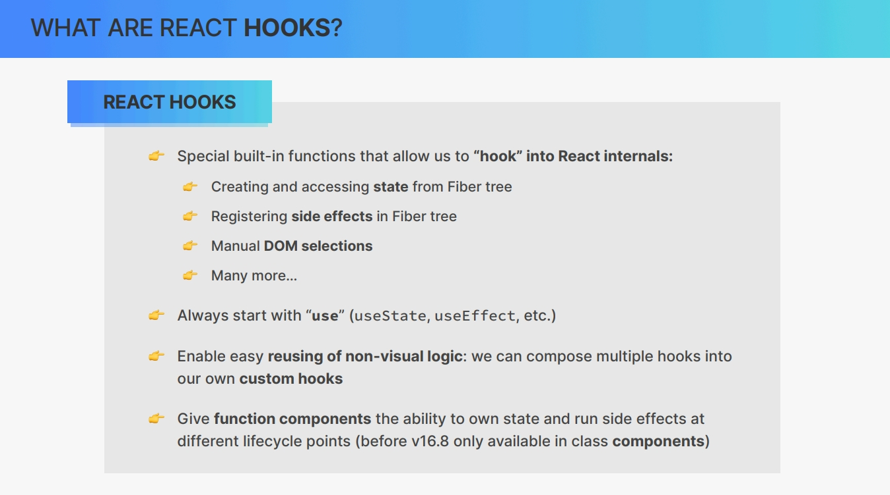
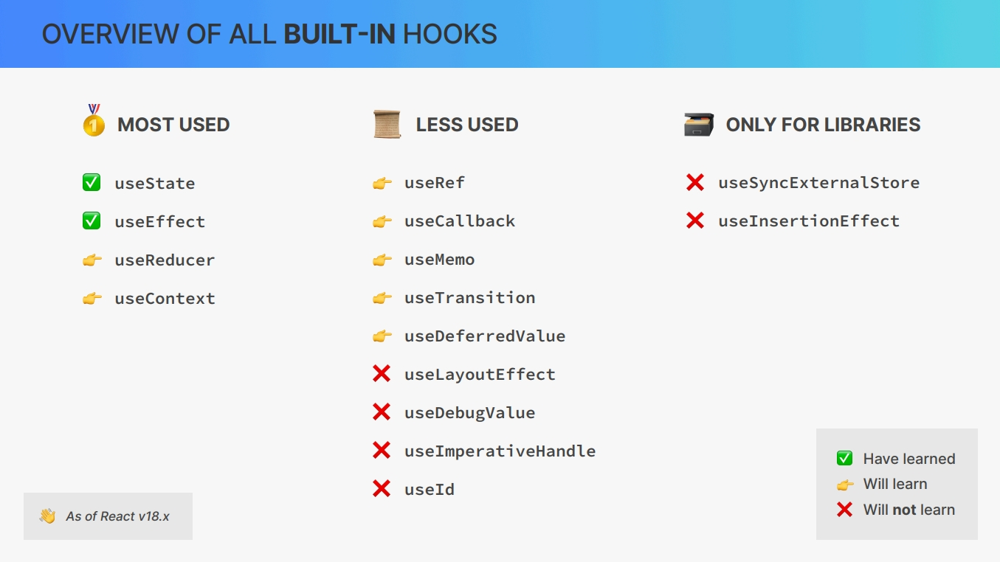
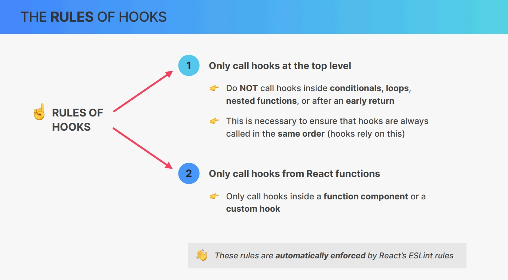
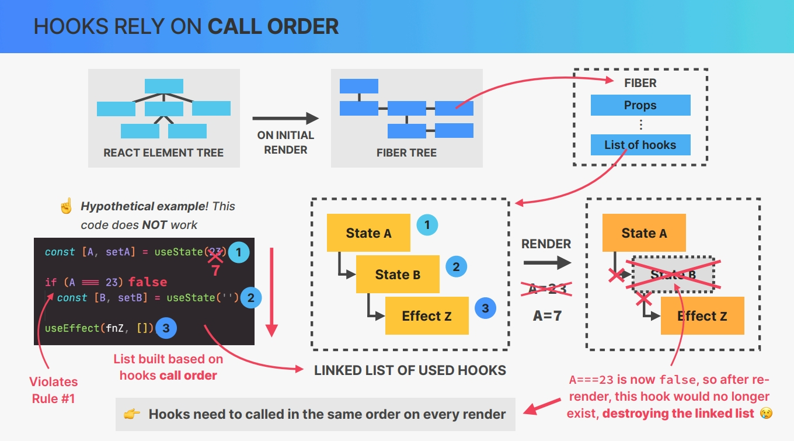
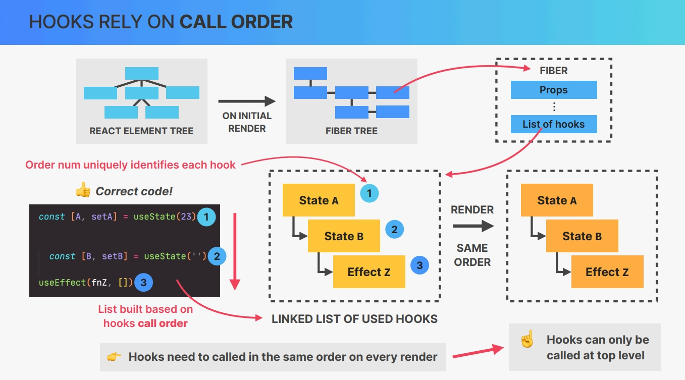
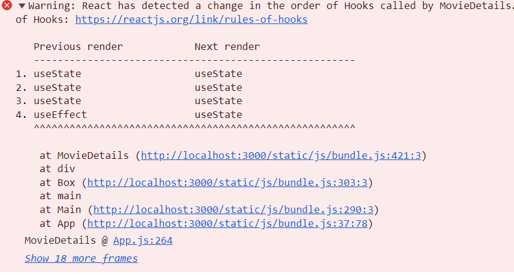
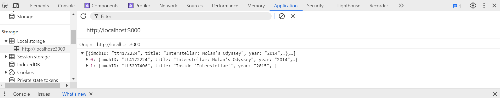
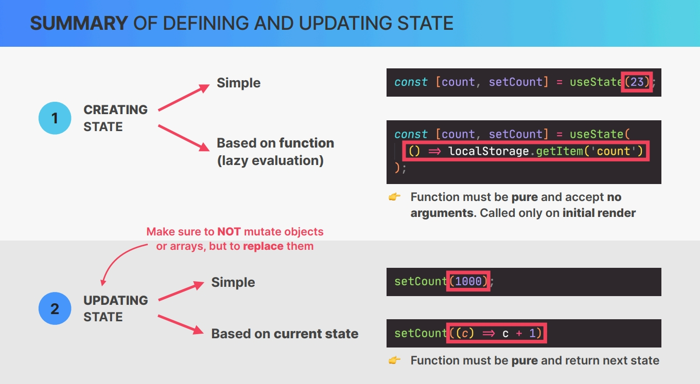
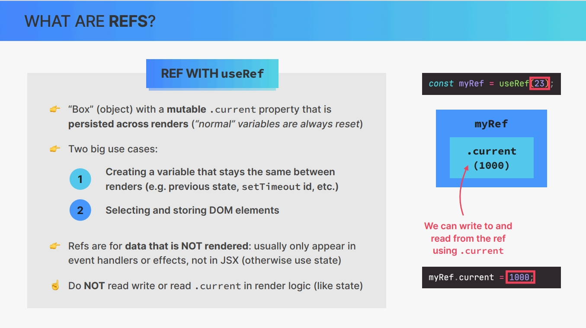
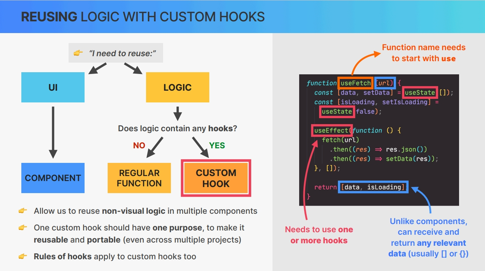

# `Custom Hooks, refs, And more about useState hook`

## `Table of Contents`

1. [React Hooks and Their Rules](#react-hooks-and-their-rules)
2. [Rules of Hooks in Practice](#rules-of-hooks-in-practice)
3. [More Details of useState](#more-details-of-usestate)
4. [Initializing State with a Callback_Lazy Initial State](#initializing-state-with-a-callback_lazy-initial-state)
5. [useState Summary](#usestate-summary)
6. [How NOT to select DOM Elements](#how-not-to-select-dom-elements)
7. [Introducing Another Hook useRef](#introducing-another-hook-useref)
8. [Refs to Select DOM Elements](#refs-to-select-dom-elements)
9. [Refs to Persist Data between Renders](#refs-to-persist-data-between-renders)
10. [What are Custom Hooks When to create One](#what-are-custom-hooks-when-to-create-one)
11. [Creating our First Custom Hook useMovies](#creating-our-first-custom-hook-usemovies)
12. [Creating useLocalStorageState](#creating-uselocalstoragestate)
13. [Creating useKey](#creating-usekey)
14. [Coding Challenge_UseGeoLocation](#coding-challenge_usegeolocation)

---

## `React Hooks and Their Rules`

We have already used a few different React Hooks at this point of the course, but we have never really learned what a React Hook actually is and how they work. And so let's now do that in this lecture.

**React Hooks are essentially special functions that are built into React and which allow us to hook into some of React's internal mechanisms.** Or in other words, hooks are basically APIs that expose some internal react functionality such as creating and accessing state from the fiber tree or registering side effects in the fiber tree as well. So again, the fiber tree is somewhere deep inside React and usually not accessible to us at all. But using the useState or the useEffect hook, we can essentially hook into that internal mechanism.

Now hooks also allow us to manually select and store dom nodes, access context and many many other things. Now, **what all hooks have in common is that they all start with the word use in order to make it easy for us and for React to distinguish hooks from other regular functions.** And in fact, we can even create our own so called custom hooks which will also start with the word use. **And this is actually one of the greatest things about hooks in general because custom hooks give us developers an easy way of reusing non visual logic.** So logic that is not about the UI.

Now you might be aware of this or not, but there was a time when we had to use components based on JavaScript classes if we wanted to give component state and access to the component life cycle. However, this came with a few problems which led the React team to introduce hooks. **And so now with hooks, our components based on functions can have their own state and also run side effects.** And so this was a huge step forward for React and made it even more popular than it already was.



Now we only used 2 hooks so far but React actually comes with almost 20 built in hooks. And so let's get a quick overview of them here. So `useState` and `useEffect` are of course some of the most important hooks and therefore the most used ones along with `useReducer` and `useContext` that we will actually study pretty soon. Then we have this huge list of some less used hooks but where some of them are actually still quite important like useRef, useCallback and useMemo. So some of these are actually worth learning but others are a bit more obscure, I would say.

And finally, there are a few hooks that are intended only for library authors. And so of course, we will also not bother looking at those.



**Now in order for hooks to actually work as intended, there are two very simple rules of hooks that we must follow.**

1. The first rule is that **hooks can only be called at the top level**.

   In practice, this means that we cannot call hooks inside conditionals like if statements and also not inside loops or functions nested inside the component. We can also not call hooks after an early return because that's also similar to a condition. **But why? Why is this such an important rule?** Well, it's because hooks only work if they are always called in the exact same order which can only be ensured if we only call them at the top level. And we will look at this in more detail in the next slide.

2. The second rule is actually a bit simpler. All it says is that **hooks can only be called from react functions.**

   In practice this means that hooks can only be called from function components or from custom hooks, but not from regular functions or even class components. Now the great news is that you actually won't have to worry about these rules at all if you're using a linter because these two rules are automatically enforced by React's ESLint rules.



So let's now try to answer the question of **why do hooks need to be called in the same order on every render.** And let's actually start from the very beginning based on all the knowledge that we already have at this point.

So remember that whenever an application is rendered, React creates a tree of React elements, also called the virtual DOM. On the initial render, React also builds a fiber tree out of the virtual DOM where each element is a fiber. Now each of these fibers contains a lot of stuff like the received props, a list of work and crucially for us, a linked list of all the hooks that were used in the component instance. So to understand how hooks work behind the scenes, let's build ourselves a linked list of used hooks based on this(image⤵) hypothetical code example. And I say hypothetical because this code actually doesn't work.

**And can you spot why that is?** This code actually violates the first rule of hooks because it conditionally defines state here. But by breaking this rule, we will understand why hooks rely on the order in which they were called. And speaking of this order, **our list will be built based on the call order of the used hooks.**

So first, this useState call for A then another useState call for B and then finally the useEffect call. So this is our list of hooks but it's not a linked list yet. **But what does linked actually mean?** Well, it means that the first list element contains a reference to the second element which in turn has a link to the third list element. So all the list elements are linked together which is actually a common data structure in computer science.

But anyway, moving back to our code example, let's now imagine that a re render happened because state A was updated from 23 to 7. But this now creates a huge problem. Notice how state B was only created initially because the condition a equal 23 was true, Right? However, after this rerender the condition is now false, which means that this(B) useState hook would not be called. And so state B would then no longer exist in this linked list of hooks after the render.



**But what's the problem with that, you might ask?** Well, the problem is that the first hook is still pointing to the original second hook, so to state B. But that link is now broken. So state A is now linking to a hook that no longer exists And nothing is pointing to the effect hook Z, meaning that the linked list has been destroyed. It works this way because fibers are not recreated on every render. And so this list is also not recreated.

So if one of the hooks just disappears from the list, then the order of the list will get completely broken. `So in conclusion,` if we conditionally use a hook like we did here that will completely mess up the list of hooks between renderers which will leave react confused and unable to correctly track all the hooks that were used. And so this is the reason why hooks need to be called in the same order on every single render. And the only way in which we can assure that is by only calling hooks at the top level, which is exactly what the first rule of hooks says.

So following this rule, the code and the list of hooks would look just like this(⤵ image).



So without any conditionals in the code and with the list of hooks always in the same order.

**Now, of course, this opens up the question of why even bother having this linked list if it requires this strange rule to exist?** Well, the big reason is that a linked list which relies on the hook call order is the simplest way to associate each hook with its value. So basically, the order in which the hook is called uniquely identifies the hook.

For example, React knows that hook number 1 has a state of 23 and that hook number 2 has a state of empty string. So the value is associated with the call order. And this is very convenient because by using the call order, we developers don't have to manually assign names to each hook, which would create multiple problems that we don't need to get into at this point.

---

## `Rules of Hooks in Practice`

Let's now actually break the main rule of hooks that we just learned about, which is that hooks can only be called at the top level.

But now let's break some rules here which as I mentioned before is always a great way of learning why the rules exist in the first place. So coming here to our MovieDetails component, this is where we will now write some code to break that rule.

So in the dev tools, check out the MovieDetails component, And so down here we have the list of hooks that we just saw in the previous lecture. so indeed you see that the hooks are actually numbered. So in fact, each of the hooks is identified by react by their order number. Not some name or anything like that but really only the number.

So for now we have 3 state and then 3 effects. Now if we did call a hook outside of the top level, so basically if we called a hook conditionally that would mess up this entire order here. And so that's where we would then run into problems, and that's exactly what we want to do now.

```js
/* eslint-disable*/
if (imdbRating > 8) [isTop, setIsTop] = useState(true);
```

But now let's check out what happens with interstellar where the rating is greater than 8. So as we click, well, our application immediately stops working. So let's come here to the console and then react immediately tells us that it has detected the change in the order of hooks called in this component. So it tells us here actually some helpful information. So in the previous render there were 3 use date hooks and then the number 4 was an effect. So this effect right here was hook number 4 before in the previous render. And that previous render actually happened after we clicked on the movie but while the movie data had not been fetched yet.



So at that point the IMDb rating here was still undefined and so then this useDate hook was not called. But then as soon as the data arrived the IMDb rating was indeed greater than 8.

And so then React called useState here and so then on the next render, the 4th hook was no longer the use effect but this state right here. And so therefore, now clearly we can see that our linked list of hooks is different. And so React is not happy about that at all. So let's of course turn this off and then it should go back to working. So this one is pretty obvious that we shouldn't use it.

However, in certain situations you might not have ESLint installed. And so in those cases you really need to be very careful. Now one more subtle thing that can happen is an early return. So if we say, if imdbrating greater than 8 then let's immediately return some JSX here.

```js
if (imdbRating > 8) return <p>Greatest ever!!</p>;
```

And so if we do the same thing as before, interstellar, then here the IMDB rating is less than 8. But as we click here, then we run into exactly the same problem. Now this time the error message doesn't contain, the previous list of hooks but still it tells us that this time fewer hooks were actually rendered. And so that's because right now we only have the movie and so these three states but then the effects, so the 3 effects that we had they are now no longer created. So instead of the 6 hooks we now only have 3 hooks.

And so therefore, this again creates a big problem because like this we cannot guarantee that all the hooks are always called in the same order. So be very careful of that.

---

## `More Details of useState`

Let's now look at the super important useState hook again and review some important details that we have already talked about as well. So we have been using the useState hook since almost the beginning of the course because this is in fact the most important hook in React.  
However, I want to again review some important parts of it and I want to draw your attention to one very important detail which is the fact that these **initial values that we pass into useState only really matter on the initial render.** So let's see an example of that.

And let's say that we actually wanted something like. So we wanted a piece of state called isTop which is true if the IMDB rating is greater than 8.
So let's see if that works, actually. And let's then log this state to the console. Okay.

```js
const [isTop, setIsTop] = useState(imdbRating > 8);
console.log(isTop);
```

Here in console we see a false even though the rating here is actually greater than 8.

**So why is that?**  
`Well, it is because of the reason that I just mentioned before which is the fact that whatever we pass into useState is the initial state and React will only look at this initial state on the initial render, so when the component first mounts.` However, when the component first mounts here the IMDB rating will still be undefined. And so this here is then false and so it will stay false forever because nowhere we update the state and on the second render, So when we then finally get the movie data, this compression(imdbRating>8) will not be executed again. And so therefore, it will stay false forever.

**Now one way of fixing this would be to use a useEffect.** So if we did useEffect passing in a function and then we wanted to run this effect each time that the IMDB rating updates. And so each time that does happen, then we want to call setIsTop.

```js
const [isTop, setIsTop] = useState(imdbRating > 8);
console.log(isTop);

useEffect(
  function () {
    setIsTop(imdbRating > 8);
  },
  [imdbRating]
);
```

And so in this case, this should then work. And let's see. And indeed, now it is true. And so that is simply because of this use effect. '

Now, of course, in this situation, we shouldn't even use a piece of state in the first place. So if this was the functionality that we really wanted, then what we should do is derived state. So we shouldn't create a real state with the useState hook but instead we should just do const isTop and then simply imdbRating greater than 8.

```js
const isTop = imdbRating > 8;
console.log(isTop);
```

This simple code works seamlessly. And so it is true. And that's because this variable isTop is of course regenerated each time that the function here is executed, so after each render. And so this is the power and one of the great advantages of derived state which is that it updates basically as the component gets rerendered. And this is really as simple as it can get.

And now I want to come back to this function (handleAdd function) to give you yet another example or another proof that **updating state really is asynchronous** and that we need to use a callback function to update state in certain situations. So let's say that when we add a new movie to our watch list right here we want it to display the average of the rating that we gave and the rating that is coming from IMDB.

So let's create a new piece of state because if we want to display something on the screen, well then we need a new piece of state. So let's call this avgRating and setAvgRating. And set it to 0.

So set average rating, and let's say that first we wanted to set it to the actual current IMDB rating which is a string. So let's convert that to a number. So IMDB rating. And now watch what happens if we alert this. So then it becomes really visible.

```js
// in handleAdd Function. MovieDetails
setAvgRating(Number(imdbRating));
alert(avgRating);
```

And so the AVG rating should now be 8.6 because we set it to IMDB rating which is 8.6. So watch what happens. Well, it is still 0. And so that's again because the state is set asynchronously here. Or in other words, we do not get access to the updated state right after doing that. So right after we call the state updating function. So only once React is done processing this event handler, it will then update all the state and re render the UI. Alright.

But, anyway, let's now do another one. So setAvgRating, and so let's now attempt to calculate the average. So taking IMDB rating or actually we want the average rating. So average rating plus the user rating and then divided by 2. So let's see.

```js
setAvgRating(Number(imdbRating));
// alert(avgRating);
setAvgRating((avgRating + userRating) / 2);
```

So our average is not correctly being calculated. So this 5 here is really just 10 divided by 2. So the reason for that is that here the average rating is still at 0. And so then 0+10 divided by 2 is indeed the 5.

**But why is the average rating still at 0 here even though we have updated it before?** So it's asynchronous state setting which means that at this point here, the average rating has not been set yet. So it's still at 0 which is the initial value right here. And so because of that, we say that the average rating state is `stale` at this point.

So we have stale state right here. But luckily for us, we already know how to solve this which is by passing in a callback function. And so that callback will get access to the current value. And so let's again call that average rating but of course it could be called anything. So let's try one more time.

```js
setAvgRating(Number(imdbRating));
// alert(avgRating);
// setAvgRating((avgRating + userRating) / 2); // Not working as intended, b/c os asynchronous nature
setAvgRating((avgRating) => (avgRating + userRating) / 2);
```

So now we get the correct average. Nice. So this time what happened was that the average was again set to the IMDB rating, so the 8.6. But then in the next line here, we already got access to that new value.

the parameter in callback function will simply be current state value but we can then of course give it any name that we want.

```js
// if (imdbRating > 8) [isTop, setIsTop] = useState(true);
// if (imdbRating > 8) return <p>Greatest ever!!</p>;

// const [isTop, setIsTop] = useState(imdbRating > 8);
// console.log(isTop);

// useEffect(
//   function () {
//     setIsTop(imdbRating > 8);
//   },
//   [imdbRating]
// );

const isTop = imdbRating > 8;
console.log(isTop);

const [avgRating, setAvgRating] = useState(0);

setAvgRating(Number(imdbRating));
alert(avgRating);
// setAvgRating((avgRating + userRating) / 2); // Not working as intended, b/c os asynchronous nature
setAvgRating((avgRating) => (avgRating + userRating) / 2);
```

Alright. And now there's just one final thing to learn about the useState hook which is that besides using a callback like this to update state, we can also use a callback to initialize state. And so let's learn how to do that in the next lecture.

---

## `Initializing State with a Callback_Lazy Initial State`

In this lecture, we're finally gonna build a brand new feature for our app, which is to persist the watch list in local storage. So right now, if we have some movies here in our watch list and if we then reload the page, then you see that of course our movies are going to be gone. So they're not persisted, so they're not stored anywhere. And so that's why in this lecture, we will now use local storage to store this watched data information in the browser. So we're going to do this in two parts.

`First:` Each time that the watch list state is updated, we will update the local storage. So we will store that data into local storage.  
`Second:` Each time that the application loads, so when the app component first mounts we will read that data from local storage and store it into the watched state.

### `First: Update local storage`

So, let's do that starting with the first part which is to store the watched movies into local storage each time that they are updated. And **we can actually do that in two different ways or in two different places.**

So **the first option is to store that data into local storage each time that a new movie is actually added.** So basically, right in this event handler function that is responsible for adding new movies to the watch list, so the handleAddWatched function. So each time that happens we can then store the new watch list into local storage. So that's the first option.

**And the second option is to simply do it in an effect.**

1. **`Storing data from event handler function`**

   And so let's actually do both of them starting here in this event handler function.

   Now by the way, if you're not familiar with local storage, it's basically just a very simple key value pair storage that is available in the browser and where we can store some data for each domain. So basically, the data that we store in local storage now will only be available to exactly this URL right here, not for example in this other one. And the way we use local storage is simply calling local storage which is a function available in all browsers and then we setItem(). Then we pass in the name of the key. So basically the name of the data that we want, to store and then second the actual data.

   Now here we cannot simply use the watched array like **localStorage.setItem('watched', watched)** because it has just been updated here. And so as we already know, this updating happens in an asynchronous way. And so therefore, right here this is still stale state.

   So it's basically still the old version before a new movie has been added. So we need to build a new array based on the watched, so the current state plus the new movie. And then finally, we need to convert all of this into a string. `Because in local storage, we can only store key value pairs where the value is a string.`

   And so let's use the built in `JSON dot stringify`. Alright. And this should now actually work.

   ```javascript
   function handleAddWatched(movie) {
     setWatched((watched) => [...watched, movie]);

     localStorage.setItem("watched", JSON.stringify([...watched, movie]));
   }
   ```

   So let's add that to the list and maybe another one. Alright. And so now we have our 2 movies in the list. Now we can check if they have been stored into local storage.

   So in the dev tools, we just come to application and then here on the left side you should have this local storage. And so indeed, here we see that our array of watched movies has indeed been stored into local storage. Great. So that's working. But as I was saying, we can also do it right inside an effect. So instead of doing it in the event handler function.

   

2. **`Inside of an effect`**

   And we will actually do it in an effect instead of here in this event handler function because later in the section we will want to make this storing data into local storage reusable. So let's just comment this out and then let's come down here and create a new effect. So you see that I like to have always the states here in the beginning of the component then the event handler functions which update some of the state and then in the end the effects.

   So let's create a new effect with a function And then as we were just saying, we want this effect to run each time that the watched movies are updated.

   And now we don't have to create any new array because this effect here will only run after the movies have already been updated. So after watched is already the new state. And so we can then simply use that here.

   ```js
   useEffect(
     function () {
       localStorage.setItem("watched", JSON.stringify(watched));
     },
     [watched]
   );
   ```

   Nice. So that part is working.

### `Second: Read data from local storage`

And so now we need to take care of the second part, which is to read this data back into the application as soon as the app component mounts. So the component that owns this watched state.

**Now, how can we do that?** Well, we might think that we should use another effect in order to get the data from local storage on the initial render and then store that data in the watched state. However, there is actually a better way. And so let me show that to you.

So let's do some modification here in watched state. So what we're going to do now is to instead of just passing in a value is to pass in a callback function. And so that's because the **useState hook also accepts a callback function instead of just a single value.** And so we can then initialize the state with whatever value this callback function will return.

And so let's try that out. So let's pass in a function here. So creating a brand new function, and so then let's create a new variable. Let's say stored value and then we can just read from local storage with the getItem method. So getItem and then the key that we used before to store the data in local storage. So that's this key right here. And so then we just need to return this value.

And so again, react will then call this function here on the initial render and will use whatever value is returned from this function as the initial value of the state. **And this function here actually needs to be a pure function and it cannot receive any arguments.** So passing arguments here is not going to work. So just a very simple pure function that returns something and that something will be used by react as the initial state.

And also just like the values that we pass in, react will only consider this function here on the initial render. So this function is only executed once on the initial render and is simply ignored on subsequent re renders.

So remember that we stored the data as a string by doing JSON dot stringify. And then when we get the data back, we need to convert it back by doing jason.parse.

```js
// updated watched state
const [watched, setWatched] = useState(function () {
  const storedData = localStorage.getItem("watched");
  return storedData ? JSON.parse(storedData) : [];
});
```

Alright. And beautiful. So here, the movie that we added to our watch list before is now indeed back in our watch list after reloading the page.

So we successfully stored the data in local storage and retrieved it as the application loads. So our callback function here is doing its job and so this creates a much better experience for the user. So whenever the initial value of the useDate took depends on some sort of computation, we should always pass in a function like this. So function that react can execute on its initial render. So we should not call a function inside use state.

```js
useState(localStorage.getItem("watched"));
```

So we should not do this⤴. Okay? So this is very different. Here we are calling a function, not passing a function in. And so this we should not do because even though react would ignore the value of this, it would still call this function on every render which is not good.

So never do this and instead pass in a function that react can then call later. Okay.

Now let's again go back to our application, tap here because now we want to see what happens when we delete a movie from UI. And you see that it actually automatically got removed here from the local storage as well. **So why is that?**

Well, it's because thanks to our effect here⤵, we have effectively synchronized the watched state with our local storage.

```js
useEffect(
  function () {
    localStorage.setItem("watched", JSON.stringify(watched));
  },
  [watched]
);
```

So when the watched state changes, our local storage changes as well. And so this is a great advantage of having used the use effect hook instead of setting localStorage right in the event handler because if we had done it like this then we would also have to manually set the local storage here as we deleted a movie. So here we would then also have to do the exact same thing and use all this here as the new local storage. But so now since we have basically synchronized the 2 of them we no longer need to do that.

Okay, So we learned here yet another way of using the useState hook. So now we know that besides passing in a single value, we can also pass in a callback function. So So this all can be a little bit confusing with all these different options that we have. And so in the next lecture we will basically summarize everything that we know about the useDate hook since that is such an important hook in React development.

---

## `useState Summary`

Let's quickly summarize everything that we know about the use date hook in one single slide so that you can keep it as a handy reference.

So we use the useState hook to first create state and then the setter function that results from creating state to update state. Now **we can create a state variable in the simple way** which is what we do most of the time, but we can also **create state based on a callback function**.

**_`So whenever the initial state depends on some computation, for example reading data from local storage, we can pass in a callback function like this instead of just a single value. And this process is sometimes called lazy evaluation.`_**

**Now this callback function is only called on the initial render of the component.** So on subsequent re renders it will simply be ignored. Also **this callback needs to fulfill two requirements.** `First`, it must be a **pure function** and `second`, it should require **no arguments** in order to work. And that's actually it.

That's how we create state variables using useState. And now about updating state, we can again update state in a simple way just by passing a single value into the returned setter function as the next state. So in this⤵ example, the next state would be 1,000. On the other hand, in many situations, we actually want to update state based on the current state. For example, increasing a counter by 1.

So if that's the case, we can give the setter function a callback function like this⤵. So a function that is pure and returns the next state based on the current state. And this is, in my opinion, the preferred way of updating state whenever it makes sense.

Now one important rule to keep in mind about updating state is that you **should never mutate objects or arrays.** Instead, you must create a new object or a new array which incorporates the changes that you want to make and then pass that new object into the setter function. And we have done that multiple times already, but I just wanted to mention this here in the summary lecture as well.

Okay. So in conclusion, both for creating and for updating state, we have both a simple way and a way that requires a callback function. So this can be a little bit confusing which is why I decided to create this overview. So I hope that this makes everything crystal clear and that you have now mastered the use they took once and for all.



---

## `How NOT to select DOM Elements`

So with the topic of useState now behind us, let's turn our focus on something called `refs`. And so in this lecture, let's manually select a DOM element so that you see why we actually need refs in React.

So as an experiment let's try to automatically give the search input field, focus each time that the Search component mounts. So basically each time the application mounts we will automatically focus on the movie search input field. Okay.

And in order to do that we actually need to select this input element. And so let's try to do that with the tools that we already have, in Search component. So we come here into our search component which is where that input field is located. And so then we can basically use a useEffect and then manually select this DOM element.

And so now what we can do is to call the focus method on that element. And so this is just some straightforward typical DOM manipulation.

```js
useEffect(function () {
  const el = document.querySelector(".search");
  console.log(el);
  el.focus();
}, []);
```

Okay. And so now if we reload the application, this input field automatically got focused. So our code here is basically doing its job.

However, as we learned at the very beginning, **react is all about being declarative**. And so manually selecting a dom element like this is not really the React way of doing things. So it's not in line with the rest of our React code. So in react we really don't want to manually add event listeners like this and also having to add classes or IDs just for the purpose of selecting is not really nice. And again, not really the React way of doing things.

Also, if for some reason we would need some dependency in useEffect dependency array, for example, If this code should rerun each time the query changes then that would mean that we would select the element over and over again which is also not ideal.

`And so to solve all these problems and to make the action of selecting an elements more declarative such as everything else in React we need the concept of refs. And so that's what we're going to learn about in the next lecture.`

---

## `Introducing Another Hook useRef`

It's time to introduce yet another React hook. And this time, it's to `useRef hook`. And fortunately for us, this is one of the easiest hooks of all. And so let's now take a look.

So **we use the useRef hook to create something called a ref.**  
**But what actually is a ref?** Well, **ref stands for `reference` and essentially it's like a box into which we can put any data that we want to be preserved between renders.** Now **in technical terms when we use useRef, React will give us an object with a mutable current property. And we can then write any data into this current property and of course also read from it.**

So in this small example(⤵image), the current property was first set to the initial value of 23 and we then changed it to 1,000. So as you can see, this current property is actually mutable, so unlike everything else in React. But **what's really special about refs is that they are persisted across renders.** So their current property value stays the same between multiple renders. So just like state. **And this gives us two big use cases for refs.**

1. First, as we just said, **we can use refs to create variables that will stay the same between renders.** And useful examples of this are preserving the previous state or storing the ID of a setTimeout function.

2. The second use case is actually far more important, **which is to select and store DOM elements.** So this is what we attempted to do in the last lecture and which actually brought us to this lecture. So just like the ID of a setTimeout, a DOM element is also a piece of data that we want to store and preserve across renders. And so refs are perfect for this.

**Refs are usually for data that is not rendered in the visual output of the component.** **So usually refs only appear in event handlers or effects but not in the JSX.** Of course we can use refs inside JSX too, but usually that's not the place for them. **If you need data that participates in the visual output of the component, that's usually a good sign that you actually need state and not a ref.**

**Just like with state, we are not allowed to write or to read the current property in render logic as that would create an undesirable side effect. Instead, we usually perform these mutations inside a useEffect hook.**



We've discussed a couple of times at all the similarities between refs and state which is because these two are in fact quite similar. **So let's now analyze what they have in common and what's different between them.**

- We can say that **refs are like state but with less powers.** So what they have in common is that they are **both persisted across renders.** So the component remembers these values even after re rendering.
- The big difference is that **updating state will actually cause the component to rerender while updating refs does not.** So the big takeaway from this is that **we use `State` when we want to store data that should rerender the component and `Refs` for data that should only be remembered by the component over time but never rerender it.**

And this is basically also what we already learned back in the lecture on the fundamentals of state management. So remember that this diagram⤵ is taken from that lecture. Now back then we didn't know what a ref was, but now we do. Now going back to the examples of preserving previous state and storing the ID of a set time out, these are pieces of data that we want React to remember between renders, but we don't want them to re render the UI whenever we update them. And so that's why we use refs for this kind of data.

So this is the main distinction between state and refs, but there are also some minor ones.

- So as we also just learned, **state is immutable but refs are not.**
- Also, **state is updated asynchronously**, which means that we cannot use the new state immediately after updating it. **With refs, on the other hand, updates are not asynchronous.** And so we can actually read a new current property immediately after updating it. So basically just like any other regular JavaScript object.

---

## `Refs to Select DOM Elements`

So let's now do the same thing that we did before which was to automatically focus on the input element but this time using a Ref.

**Using a Ref with a DOM element happens in 3 steps.**

1. **`Create a Ref`**

   First of all, we **create the ref** and so for that we use the useRef hook. So we just write useRef and then we need to again make sure that it is now correctly imported from React. So we call the useRef hook and then here we pass in the initial value that we want to be in that **current property** that we just talked about. **Now in this case when we work with a dom element that is usually just null.**

   Alright. And so this⤴ will simply return a ref that we can give any name, and store this into a variable called inputEl because that's what we will want to store inside this ref.

   ```javascript
   const inputEl = useRef(null); // will return a ref
   ```

2. **`Connect to the Element`**

   So we have our Ref and now as a second step let's actually come to the element that we want to select. And so all we have to do is to use the ref prop and then we just pass in the ref that we just created.  
   And so **now these 2 are basically connected in a declarative way. So there's no need to manually do some query selection like we did previously.** `So all we are doing is to tell react that the ref that will contain this input element, by putting ref={inputEl}, should be the inputEl ref that we created, so the inputEl that store returned ref of useRef().`

3. **`Use the Ref`**
   And so now **in order to use this ref in the 3rd step we can use the useEffect hook**.

   So a new function that simply runs on mount. So we need to use an effect in order to use a ref that contains a dom element like this one because **the ref only gets added to dom element, in this case the input element, after the dom has already loaded. And so therefore we can only access it in an effect which also runs after the dom has been loaded.** So this is the perfect place for using a ref that contains a dom element.

And so now if we want to do the same thing as before we just use our input element and then remember that we need to read the **current property** **which is basically like that box where whatever we store in the ref will get stored.**

So input element dot current And so here(inputEl.current) is now really the dom element itself. And so this is where we can then call the focus method on. And just to see we can also log this to the console. So input element dot current.

```js
const inputEl = useRef(null);
useEffect(function () {
  console.log(inputEl.current);
  inputEl.current.focus();
}, []);

return (
  <input
    ...
    ref={inputEl}
  />
);
```

And so just like before our input field got automatically focused and also the dom element itself was rendered to the console. Alright. And so again this means that we successfully connected the ref that we created here with the dom element. So simply by passing this ref into the ref prop/property in input element. And so then in a useEffect after the dom has been loaded we can use this dom element inside the ref dot current property.

---

Alright. But now I actually want to do something a little bit more interesting. So to show you the new feature that we want to implement, which is, when from anywhere in the application, we hit the Enter Key then automatically this input field got focused.

So let's implement that. And so for that the first thing that we need to do is to listen for that key press event.

So let's do that. So document dot addEventListener and then on the key down event. And here, let's actually again specify a callback function which we will then create. And so the reason why we placed this in a separate callback function was so that we could clean up after our event.

So return a cleanup function, addEventListener, key down and then the callback. Okay.

But now of course this will work on any key press. So whenever any key is pressed it will call this callback function and then our element will get focused. But we only want that to happen when the enter key is pressed. So let's say e.code needs to be equal Enter

```js
const inputEl = useRef(null);
useEffect(function () {
  function callback(e) {
    if (e.code === "Enter") inputEl.current.focus();
  }

  document.addEventListener("keydown", callback);

  // Clean up function
  return () => {
    document.removeEventListener("keydown", callback);
  };
}, []);
```

Now test it, yeah, beautiful. But now let's say that I already had a search query for something. And then if we hit the enter key now, then of course it will simply focus here, but it will not delete the text yet. But that's very easy to solve. We just say setQuery which we already get access in this component. So we just set that to an empty string. And so that should now work.

There's just one final problem which is, let's say that if we write some text in search filed and then if we hit the enter key again. And so this will then delete the text that we have.

So basically we don't want all of this, `inputEl.current.focus(); setQuery("");` to happen when the element is already focused, so when it's already active. But luckily for us we can easily check which element is currently active thanks to the `document dot active element property.`

`if document.activeElement, which is the element that is currently being focused. So if that is equal to our input element, so inputEl.current, then just return. So in this case, basically just don't do anything.`

Alright. So let's try that again. So that just works fine.

So it was just a minor feature but it was very helpful to understand how we use refs to select DOM elements in the React way. Now there's just one small thing that I'm noticing here which is that React is complaining about a missing dependency. So here we have to also place the setQuery function in dependency array. And so that's because the set query function is indeed a prop to this component. And so therefore since we are using it here in the effect we then need to declare it in the dependency array.

```js
function Search({ query, setQuery }) {
  // useEffect(function () {
  //   const el = document.querySelector(".search");
  //   console.log(el);
  //   el.focus();
  // }, []);

  // Now exact same thing, but using a Ref hood
  const inputEl = useRef(null);
  useEffect(
    function () {
      function callback(e) {
        if (document.activeElement === inputEl.current) return;

        if (e.code === "Enter") {
          inputEl.current.focus();
          setQuery("");
        }
      }

      document.addEventListener("keydown", callback);

      // Clean up function
      return () => {
        document.removeEventListener("keydown", callback);
      };
    },
    [setQuery]
  );

  return (
    <input
      className="search"
      type="text"
      placeholder="Search movies..."
      value={query}
      onChange={(e) => setQuery(e.target.value)}
      ref={inputEl}
    />
  );
}
```

---

## `Refs to Persist Data between Renders`

So after using a ref to select a dom element in the previous lecture, let's now focus on **the other use case of refs, which is to simply give us a variable that is persisted across renders without triggering a rerender.**

**`Problem Statement__Desired Functionality`**

So let's just search for some movie here. Now let's say that behind the scenes of this application, we want to count how many times the user selects a different rating. So for example, let's say first a user rate this 3 then 7 and then 9, without clicking the **+ add to list** button. So this means that it took a user long time to decide between the right rating of the movie. And so let's say that in our application we somehow wanted to register that. Now I said behind the scenes because we actually don't want this data to show up on the screen. So basically we don't want like a counter anywhere in UI in the app which tells us how many times the user has clicked on stars. So again, it should happen behind the scenes.

**`Solution`**

**And so for this, what we need is a variable that is persisted between renders but that does not cause a rerender when it is updated. And so a ref is a perfect use case for this.**

**`Implementation`**

So let's then come here to the MovieDetails component, and let's create a new Ref right after the states. So let's call this one countRef and then useRef and then just like with useState, we pass in the initial value of that variable. And so in the beginning the count is of course at 0.

```js
const countRef = useRef(0);
```

And so now the idea is that each time the user gives a new rating, so by clicking on one of the stars, this countRef Ref should get updated. So that then when the user actually adds the movie to the list, by clicking add button, we can then add that to the new watched movie object so that we can then finally store, that value somewhere, So that count that we're going to create here.

**First, let's now take care of actually updating the Ref.** And the way we do that is again using a useEffect because remember that we are not allowed to mutate the Ref in render logic. So instead we need to use a useEffect.

**When do we want to update the ref?** Well, each time that the user rates the movie, so each time userRating state is change. Okay. And so now all we want to do is to take our countRef and then manually mutate the current property. So we can say that countRef dot current should be equal countRef dot current plus one.  
And actually this updating(of countRef) should only happen when there already is a rating because the effect will also run on mount and so then it will already add plus 1 in initial render even without the user having rated. Let's just say if there is a user rating which in the beginning is not because it will still be this empty string.

```js
const countRef = useRef(0);

useEffect(
  function () {
    if (userRating) countRef.current = countRef.current + 1;
  },
  [userRating]
);
```

So again, here we imperatively updated this variable. So with a Ref we don't have a setter function but instead we simply mutate the current property which is in the Ref. **And so that's why we say that a Ref is basically like a box that can hold any value.** So we could, for example, also instead of just storing the count here store all the different ratings that the user has given in an array. So that would also be perfectly possible.

Anyway, let's then now come here to the function(handleAdd) where the new movie is actually added to the watch list. And here let's then create a new property, **countRatingDecisions**. And so this should then be equal to the countRef dot current property. Alright, and that's it. So this should now already be working. So let's test it out here.

```js
function handleAdd() {
  const newWatchedMovie = {
    imdbID: selectedId,
    title,
    year,
    poster,
    imdbRating: Number(imdbRating),
    runtime: runtime.split(" ").at(0),
    userRating,
    countRatingDecisions: countRef.current,
  };
  onAddWatched(newWatchedMovie);
  onCloseMovie();
}
```

Let's just make sure to reload. Alright. So let's count how many times we click here. So let's say first we think the movie is a 7 then maybe, maybe it's a 9 but then we think even better and then we come to the conclusion that it's actually an 8. So we clicked 3 times here and so let's now add this to the list by clicking on addToList button.

Now in order to check out if this actually worked, let's come here to our app. So where we have our state. So that in there we can then see if the value was correctly set because, of course, we are not rendering that new value anywhere here. So here it is and indeed count rating decisions was set to 3, which are exactly the 3 times that we clicked on a different rating. Nice.

**`Quick Recap`**

So let's just recap what we did here and why this works. So we created ref, countRef, where we want to store the amount of clicks that happen on a rating before the movie is added. But we don't want to render that information onto the user interface. Or in other words, we do not want to create a re render. And so that's why a ref is perfect for this.

So then each time the user rating was updated, the component was re rendered. And so then after that re render, this effect(the effect where we update countRef) was executed which means that after the rating had been updated then our ref would be updated as well. So we would update the current property to simply adding 1.  
And so then we just used the countRef.current property later down here whenever we create a new object to be added to our list.

---

Now, of course, if we tried to do the same thing with a regular variable, then that wouldn't work. So let's try that also. Let's say, count.  
So just count equals 0 and then so let's just do the same thing here. So if user rating then count++. And then let's just add that count in the add object. And so then we will see that this doesn't work. And then we see that we have 4 count rating decisions, but the count here is only at 1.  
And so one is basically just the last click that happened. **So the `let` variable which is just a simple variable is of course reset after every rerender. So it's always going back to 0.** And so then when the last click happened that 0 was here increased to 1 and then that count was added to the object.

`So in conclusion, this normal variable is not persisted across renders and it doesn't trigger a rerender. On the other extreme we have state which does both of these things. So it triggers a re render and it is persisted. And then in the middle we have a ref which is indeed persisted across renders but it does not trigger a rerender when updated. And so that's why we normally don't use a ref in the JSX output.`

**`Code of this Lecture`**

```js
// MovieDetails Component

const countRef = useRef(0);
// let count = 0; // using normal variable, just for checking.

useEffect(
  function () {
    if (userRating) countRef.current++;
    // if (userRating) count++; // regular variable // not working
  },
  [userRating /* count */]
);

...

function handleAdd() {
    const newWatchedMovie = {
      ...
      countRatingDecisions: countRef.current,
      // count, // regular variable // not working
    };
}
```

And later on we will even see some other more real world use cases of refs, for example storing the ID of a timer to stop it. But for now I hope that this use case of a ref also made sense to you. And we don't use refs all the time but it's still good to know how they work and to keep them in the back of your mind.

---

## `What are Custom Hooks When to create One`

The last part of this section is all about **custom hooks**. And so let's start by understanding what custom hooks are and when to create one.  
Now **custom hooks are all about reusability.** **And in React, we have basically two types of things that we can reuse, a **piece of UI** or a **piece of logic**.**

Now if we want to reuse a piece of UI, we already know that we use a component. On the other hand, **if we want to reuse logic, in React you first need to ask the question, does the logic that I want to reuse have any hooks?** **If not, all you need is a regular function, which can live either inside or outside of your component.**

However, **if the logic does contain any react hook, we cannot just extract the logic into a regular function.** Instead, what we need to create is, a custom hook. So basically, **custom hooks allow us to reuse stateful logic among multiple components. And actually, not only stateful logic but really any logic that contains 1 or more React Hooks.**  
**_`So we can say that custom hooks allow us to reuse non visual logic, which is a more generic term.`_**

**Just like regular functions or components or effects, one hook should only have one purpose.** So it should only do one specific well defined thing.  
So the idea is not to simply put all the hooks of a component into a custom hook and call it a day. the idea is to **make custom hooks reusable and portable** so that you can even use them in completely different projects. And actually now that we have had hooks for so many years in React, developers have started to share their custom hooks with the world.

**And so there are now lots of custom hook libraries that you we download from NPM and use in your projects.** Now since custom hooks are made out of regular React Hooks, the rules of hooks that we learned about before still apply to them as well.

But now let's look at an actual custom hook so that we can learn just a bit more about them.  
So first, **a custom hook is really just a JavaScript function.** So it can receive and return any data that is relevant to this custom hook. In fact, it's very common to return an object or an array from a custom hook.  
**And notice how this is different from components which are also just regular JavaScript functions but which can only receive props and always have to return some JSX.**

**The difference between regular functions and custom hooks is that custom hooks need to use one or more React Hooks.** So this custom hook (see in image⤵), for example, uses 2 useState and one useEffect hook to abstract a simple fetch functionality into this custom hook.

And finally, in order for us and react to recognize this function as an actual hook, **the function name needs to start with the word use.** So just like all the built in React Hooks. So in this example, that's useFetch **and this is really not optional.** So we need to give the function a name starting with use. Otherwise, it's gonna be just a regular function in the eyes of React.



Alright. And that's all the theory that you need to know about custom hooks. And so let's now go build ourselves some custom hooks for the rest of this section.

---

## `Creating our First Custom Hook useMovies`

And as our first custom hook, let's start with a hook called useMovies.  
**There are basically 2 strategies to decide if we want to create a new custom hook.**

1. The first one is that we want to **reuse some part of our non visual logic.** So just as we learned in the previous lecture.
2. And the second factor might be that we simply want to **extract a huge part of our component out into some custom hook.** And so that's actually what we will do in this lecture. So we will take this useEffect here which fetches our movie data and we will extract it into a hook called useMovies. And so then we get rid of all of this code here in our component. And of course if you wanted we could then later reuse this hook in some other project. Okay.

So in this lecture I will show you how we can extract all the stateful logic that belongs together into a nice and well packaged custom hook. So let's do that. And actually for that I will create a brand new file here in our source and I will then call it useMovies.js. Okay. And from here we will export a function which is going to be our custom hook called exactly useMovies.

Okay. And notice that here we're not doing an export default but a named export. And so that's kind of a strategy that I like to use. **So using default exports for components like for our App component, and using named exports for custom hooks.** Now that's not really mandatory but that's just the way I like to do it.

### `App component before extracting useEffect function`

```js
export default function App() {
  const [movies, setMovies] = useState([]);
  const [isLoading, setIsLoading] = useState(false);
  const [error, setError] = useState("");
  const [query, setQuery] = useState("");
  const [selectedId, setSelectedId] = useState(null);

  // const [watched, setWatched] = useState([]);
  const [watched, setWatched] = useState(function () {
    const storedData = localStorage.getItem("watched");
    return storedData ? JSON.parse(storedData) : [];
  });

  function handleSelectMovie(id) {
    setSelectedId((selectedId) => (id === selectedId ? null : id));
  }

  function handleCloseMovie() {
    setSelectedId(null);
  }

  function handleAddWatched(movie) {
    setWatched((watched) => [...watched, movie]);

    // localStorage.setItem("watched", JSON.stringify([...watched, movie]));
  }

  function handleDeleteWatched(id) {
    setWatched((watched) => watched.filter((movie) => movie.imdbID !== id));
  }

  useEffect(
    function () {
      localStorage.setItem("watched", JSON.stringify(watched));
    },
    [watched]
  );

  useEffect(
    function () {
      const controller = new AbortController();

      async function fetchMovies() {
        try {
          setIsLoading(true);
          setError("");

          const url = `https://api.allorigins.win/get?url=${encodeURIComponent(
            `https://www.omdbapi.com/?apikey=${apiKey}&s=${query}`
          )}`;

          const response = await fetch(url, { signal: controller.signal });

          if (!response.ok)
            throw new Error("Something went wrong with fetching movies.");

          const data = await response.json();
          // console.log(data);

          if (JSON.parse(data.contents).Response === "False")
            throw new Error("Movie not found");
          setMovies(JSON.parse(data.contents).Search);
          setError("");
          console.log(JSON.parse(data.contents).Search);
          setIsLoading(false);
        } catch (err) {
          // console.error(err.message);

          if (err.name !== "AbortError") {
            setError(err.message);
          }
        } finally {
          setIsLoading(false);
        }
      }

      if (query.length < 3) {
        setMovies([]);
        setError("");
        return;
      }

      handleCloseMovie();
      fetchMovies();

      return function () {
        controller.abort();
      };
    },
    [query]
  );

  // setWatched([]); // Infinite loop

  return (
    <>
      <NavBar>
        <Logo />
        <Search query={query} setQuery={setQuery} />
        <NumResults movies={movies} />
      </NavBar>
      <Main>
        <Box>
          {/* {isLoading ? <Loader /> : <MovieList movies={movies} />} */}
          {isLoading && <Loader />}
          {!isLoading && !error && (
            <MovieList movies={movies} onSelectMovie={handleSelectMovie} />
          )}
          {error && <ErrorMessage message={error} />}
        </Box>
        <Box>
          {selectedId ? (
            <MovieDetails
              selectedId={selectedId}
              onCloseMovie={handleCloseMovie}
              onAddWatched={handleAddWatched}
              watched={watched}
            />
          ) : (
            <>
              <WatchedSummary watched={watched} />
              <WatchedMovieList
                watched={watched}
                onDeleteWatched={handleDeleteWatched}
              />
            </>
          )}
        </Box>
      </Main>
    </>
  );
}
```

And so let's start by extracting useEffect(huge one(last)). So give it a save and immediately we see that we are missing all of these state variables. So in this case, the state setter functions. And so that's because fetching the movies requires a lot more than just this useEffect.

So notice how we actually also need multiple state variables. So the `movies` `isLoading` and `error`. All of them are necessary to make the functionality of fetching movies work. And so let's also extract them from here and paste them where they are necessary. Okay. And then we just have some problems with importing. So import, useState, and useEffect from react.

Okay. So that's looking already better but we still have some missing information right here. So we're missing the key and we're missing the query. So to fix that we can simply accept the query as a parameter to our function. And so now remember that this really is a function. This is not a component and so here we don't accept props but really we accept, arguments like this.

**What exactly should we actually return from this custom hook?** Well, basically we want to return everything that we need in the App. So basically all the variables that somewhere in our JSX are necessary. And so that's basically exactly the three pieces of state that we just cut from App. So it's the `movies`, the `error` and the `isLoading` state because again we will need these somewhere here in our JSX. And so that's basically what we will want this custom hook to return. And so let's return them from here.

```js
return { movies, error, isLoading };
```

Yeah. So right after the useEffect, we will return and we will place them all into one object. So it could be an array as well but it's very common to just return an object especially when we have so many different things like movies, isLoading and error.

Okay. And so now all we have to do is to then in App component when we're calling this function(custom hook), get the data that is returned and destructure them into their own variables again. So that movies, isLoading and error.

```js
const { movies, error, isLoading } = useMovies(query);
```

And so that's actually it. So again, here we are returning these three pieces of information. So these state variables that we are going to need outside of this custom hook. And so basically then this returns an object which we then immediately destructure.

---

And so if we give this a save and try this now then you see that it's working just like before. The only difference right now is that when we select a movie here and then we search for another one, then this one(that's already opened previously) is not closed. And so that's because we are no longer calling handleCloseMovie function. **So what should we do about it?**

Well, we can just leave it as it is right now, in order to make this really reusable or we could also accept a callback function that the user of this custom hook can pass in if they want and then we can call that at the very beginning. And so this is a way of customizing this custom hook a little bit more.  
So we can think of these arguments(of custom hook) a bit like the public API of this custom hook. So just like we can think of props as the custom API of a component. So a custom hook like this can also be created by someone and then consumed by someone else. And so that's the whole point of creating reusable pieces of stateful logic.

And just to make this a bit more clear, we can call this callback function at the very beginning of our effect. So we can say callback and then we only want to call it if it actually exists. And so we can basically do optional chaining on calling a function as well. So that's just like this: **`callback?.();`**  
And so now this function will only be called if it actually exists. So without this optional chaining part here we would first have to check if it does exist and then we would call it.

So if we now try this again since we didn't pass in any callback yet, this will then work without problems. So you see no problems there but now we can actually pass in that callback which is handleCloseMovie. `const { movies, error, isLoading } = useMovies(query, handleCloseMovie);` **And we can use this function here before it is actually defined because remember that in JavaScript function declarations like this are hoisted.** So one of the reasons why I always prefer function declarations.

**`QUICK RECAP`**  
And now let's just quickly recap what we did here.  
So basically, we took all the logic that belongs together to search for movies and simply placed it here into this custom hook. And notice that we used 4 hooks to achieve that result. So one useEffect and 3 useStates. And that's important because remember **a custom hook actually needs to use at least one React hook. Otherwise, it's just a regular function,**

So we took all the logic that belongs together, packed it here into this one function and then returned everything that is necessary for the app to keep working in exactly the same way as before.

```JS
// useMovies_Custom Hook

import { useState, useEffect } from "react";

const apiKey = "f84fc31d";

export function useMovies(query, callback) {
  const [movies, setMovies] = useState([]);
  const [isLoading, setIsLoading] = useState(false);
  const [error, setError] = useState("");

  useEffect(
    function () {
      callback?.();

      const controller = new AbortController();

      async function fetchMovies() {
        try {
          setIsLoading(true);
          setError("");

          const url = `https://api.allorigins.win/get?url=${encodeURIComponent(
            `https://www.omdbapi.com/?apikey=${apiKey}&s=${query}`
          )}`;

          const response = await fetch(url, { signal: controller.signal });

          if (!response.ok)
            throw new Error("Something went wrong with fetching movies.");

          const data = await response.json();
          // console.log(data);

          if (JSON.parse(data.contents).Response === "False")
            throw new Error("Movie not found");
          setMovies(JSON.parse(data.contents).Search);
          setError("");
          console.log(JSON.parse(data.contents).Search);
          setIsLoading(false);
        } catch (err) {
          // console.error(err.message);

          if (err.name !== "AbortError") {
            setError(err.message);
          }
        } finally {
          setIsLoading(false);
        }
      }

      if (query.length < 3) {
        setMovies([]);
        setError("");
        return;
      }

      // handleCloseMovie();
      fetchMovies();

      return function () {
        controller.abort();
      };
    },
    [query]
  );

  return { movies, error, isLoading };
}


```

```js
// Calling useMovies Hook
const { movies, error, isLoading } = useMovies(query, handleCloseMovie);
```

---

## `Creating useLocalStorageState`

In this lecture, we're going to create a new custom hook called useLocalStorageState, which basically will behave exactly like the use state hook but where the state actually gets stored in local storage.  
And so with that hook, we will then be able to replace watch state. So this state which gets the initial value from use state or from local storage actually, plus the useEffect, which is responsible for storing the state in local storage. Okay. So right in our source folder, let's create a new file `useLocalStorageState.js`.

Okay. So export and then again use local storage state. Now some people would probably just call this, useLocalStorage, but I want to make it really clear that the idea of this hook is to work in the exact same way as the use state hook. But now let's come back here And in order for us to know how we should design our hook, let's first call it.

So as I mentioned, I want this hook to work basically the same way as the useState hook. And so it should also return an array of the state. So let's call it watched and a setter function, so setWatched. And then we want to pass in the initial state which remember for the watched array was simply this empty array.

```js
// calling from App
const [watched, setWatched] = useLocalStorageState([]);
```

And so first of all, we can specify the parameter. So the parameter here is basically the initial state.

And now here I want to give these variables(watched and setWatched) some more generic names because remember that the idea of this hook here is to easily reuse it in other projects. So let's just call this `value` and then `setValue`. Now, right now we simply have a custom hook which sets some state and reads the state from local storage. But that's not super helpful yet because of course we also need to update the state in local storage. So we also need to get this useEffect that update the localStorage.

Now there's still one big problem here which is that we have this key here hard coded as `watched`. So of course, this needs to be reusable and generic. And so therefore, we need to allow the user to pass in the name of the key. So this is not 100% similar to useState anymore but this is really necessary. Otherwise, this cannot work.

Okay. And now to return, we simply return an array which has the value and setValue. And so then it works exactly like the use date hook.

So here in App we already destructured that result so that array again into the state variable and into the stateSetter. Now here we just need to pass in that key. So that's watched.

And so we need to say here basically, if there is a stored value, then return this and otherwise then return the initial state, which in this case is going to be that empty array.

```js
return storedData ? JSON.parse(storedData) : initialState;
```

So remember that whatever this function here returns will be the initial state value of this useState hook. And so then at the very beginning value becomes this empty array. And then as this effect here is executed after the re render that value is already that empty array. And so that's what is then stored here into our local storage. Okay.

So what we did again was to take all the code that belonged together and placed it into yet another hook. And in this case we made it so that this hook looks as close as possible to the useState hook. So we also pass in some initial state and then we get back a state variable and the updater function as always. But thanks to our special custom hook, now these work a bit different.

```js
// useLocalStorageState Custom Hook

import { useState, useEffect } from "react";

export function useLocalStorageState(initialState, key) {
  const [value, setValue] = useState(function () {
    const storedData = localStorage.getItem(key);
    return storedData ? JSON.parse(storedData) : initialState;
  });

  useEffect(
    function () {
      localStorage.setItem(key, JSON.stringify(value));
    },
    [value, key]
  );

  return [value, setValue];
}
```

```javascript
// Calling useLocalStorageState custom hook

const [watched, setWatched] = useLocalStorageState([], "watched");
```

---

## `Creating useKey`

To finish this section, let's now create another custom hook called useKey, which will abstract the functionality of attaching and removing an event handler for a key press.  
So here in the MovieDetails component, we have that functionality that if we open a movie and then hit the Escape key then it will close the movie. And so we implemented that using a useEffect hook. And so since this is using a React hook we can abstract this into its own custom hook because actually we do something very similar to focus on the search bar. And so that is using basically some similar functionality. And so it's a good idea to abstract this functionality into a custom hook and then reuse that in both these places. So let's copy this code here. Let's create another file for another custom hook. So this one is called `useKey.js`.

**And so now what do we actually need as inputs to this custom hook?** Well, this one is actually the easiest one of all because this one doesn't need to return anything and all we need is to know what should happen.

So basically we need a callback function(action) and key. So we want the key, for example, in this case here, that would be the Escape key. And a callback function for what action should be executed whey a user pressed the Escape key, so in this case it would be onCloseMovie().

Then we also need the key and action in dependency array. Always make sure to include every single variable that is used into your effect.

Now here we just need one small fix so to say because the user might pass in this key, like, in different formats.

**So they might write escape all in lowercase or maybe uppercase. And so what we should do here is to just transform key that they pass in to lowercase and then also the code that we get from the event to lowercase as well so that we can then correctly compare them.** And that's a pretty normal thing to do when we compare strings.

And so this should at this point already be working. So let's come back in MovieDetails component in App.js and then let's use useKey hook.

And so here we now need to pass in the key. So that's in this case the escape key. And the action will be on closeMovie. **`useKey("Escape", onCloseMovie);`**

So our custom hook is working. And so let's now immediately reuse it in this search component.

let's now again use useKey here in Search component. And so this time the key that we are looking for is the Enter key like this. But now as for the callback function, this is actually a little bit more tricky because watch at what we have here as the callback function. So we have all this ⤵. Second if block is already in the custom hook. So where it compares the pressed key with the key that we're interested in here.

```js
function callback(e) {
  if (document.activeElement === inputEl.current) return;

  if (e.code === "Enter") {
    inputEl.current.focus();
    setQuery("");
  }
}
```

```js
// Calling from Search component

const inputEl = useRef(null);

useKey("Enter", function () {
  if (document.activeElement === inputEl.current) return;

  inputEl.current.focus();
  setQuery("");
});
```

So hitting the enter key and yes, that works just as well. So here the callback function.

Anyway, we finished now this application and this section as well.

**`CODE`**

```js
// useKey Custom Hook (useKey.js)

import { useEffect } from "react";

export function useKey(key, action) {
  useEffect(
    function () {
      function callback(e) {
        if (e.code.toLowerCase() === key.toLowerCase()) {
          action();
        }
      }

      document.addEventListener("keydown", callback);

      return function () {
        document.removeEventListener("keydown", callback);
      };
    },
    [action, key]
  );
}
```

```js
// CALLING useKey CUSTOM HOOK

// From MovieDetails component
useKey("Escape", onCloseMovie);

// From Search component
const inputEl = useRef(null);
useKey("Enter", function () {
  if (document.activeElement === inputEl.current) return;

  inputEl.current.focus();
  setQuery("");
});
```

---

## `Coding Challenge_UseGeoLocation`

In this challenge, let's practice creating a custom hook based on some code that is already working. So here we have a very simple application which all it does is to get your position using geolocation as soon as you click on this button. So when you click here, your browser will then automatically ask for your permission and then when you allow, it will give you your GPS position and the link which you can click and which will bring you to the open street map application on your location. Okay. Also the app then clicks how many times you have requested your position.

So my task for you now is to extract this logic into a custom hook called useGeolocation and then use that custom hook to make this component work again.

And so this state right here(that count how many clicks happen on the `get my position` button.) might not really be relevant to this custom hook. So this custom hook should really only contain the logic that is about getting the position from geolocation. And so that's what I want you to think about while you're doing this exercise. So again, basically make sure to not include this state here which indicates how many times the button has been clicked. So that's a small additional challenge but I'm sure you can do it.

So basically we take all the non visual logic, so all the logic that contains some react hooks and which is relevant to a certain thing, in this case, that thing is to use geolocation. So then we took 3 state variables and also this event handler function(getPosition) and then returned all of that from our hook and used it in App. And so then we encapsulated all of those states and all the logic inside this custom hook.

### `CODE`

```js
import { useState } from "react";

function useGeolocation() {
  const [isLoading, setIsLoading] = useState(false);
  const [position, setPosition] = useState({});
  const [error, setError] = useState(null);

  function getPosition() {
    if (!navigator.geolocation)
      return setError("Your browser does not support geolocation");

    setIsLoading(true);
    navigator.geolocation.getCurrentPosition(
      (pos) => {
        setPosition({
          lat: pos.coords.latitude,
          lng: pos.coords.longitude,
        });
        setIsLoading(false);
      },
      (error) => {
        setError(error.message);
        setIsLoading(false);
      }
    );
  }

  return { isLoading, position, error, getPosition };
}

export default function App() {
  const {
    isLoading,
    position: { lat, lng }, // Nested destructuring
    error,
    getPosition,
  } = useGeolocation();

  const [countClicks, setCountClicks] = useState(0);

  function handleClick() {
    setCountClicks((count) => count + 1);
    getPosition();
  }

  return (
    <div>
      <button onClick={handleClick} disabled={isLoading}>
        Get my position
      </button>

      {isLoading && <p>Loading position...</p>}
      {error && <p>{error}</p>}
      {!isLoading && !error && lat && lng && (
        <p>
          Your GPS position:{" "}
          <a
            target="_blank"
            rel="noreferrer"
            href={`https://www.openstreetmap.org/#map=16/${lat}/${lng}`}
          >
            {lat}, {lng}
          </a>
        </p>
      )}

      <p>You requested position {countClicks} times</p>
    </div>
  );
}
```

---

**_`28/06/2024`_**

---
