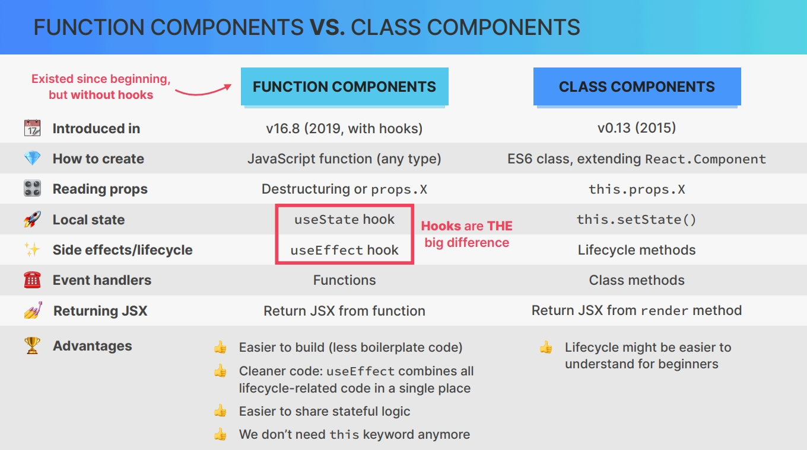

# `React Before Hooks Class-Based React`

## `Table of Contents`

1. [Section Overview](#section-overview)
2. [Our First Class Component](#our-first-class-component)
3. [Working with Event Handlers](#working-with-event-handlers)
4. [Class Components VS Function Components](#class-components-vs-function-components)
5. [Starting the Classy Weather App](#starting-the-classy-weather-app)

---

## `Section Overview`

Welcome to the last and optional section of the intermediate react part of the course. This one is all about class based react. **So once upon a time, we used to write react components in quite a different way. Instead of using functions and hooks, we used classes and so called life cycle methods.**  
Now you will most likely never have to write a class component in your work or personal projects, but you will encounter them in older code bases and you might even need to convert class components to function components at some point.

---

## `Our First Class Component`

Let's start with our very first class component. So basically, **back in the day before 2019, in React we would write components not using functions but using JavaScript classes.**

So the class keyword, then the name of the componentName and then this class would actually be a child class of react.component. So extends and then react.component. And so therefore, we would have to also import react in every component file. So import React from React. Okay.

And then we should also export this component. Let's do that down here. Export default, Counter. Okay. And so this is how we would set up a brand new component using classes.

```js
import React from "react";

class Counter extends React.Component {}

export default Counter;
```

So, using ES6 classes, so modern JavaScript classes which extend the parent class of `React Component`. **And this parent class gives us a couple of methods and one of them is the render method.** So every single react component that is written with classes needs to include the render method. **So this render method is basically equivalent to the function body of a function component.** **So every single class component needs to have a render method which returns some JSX.**

So let's just do that here. And JSX, of course, works in the exact same way as in function components.

```javascript
class Counter extends React.Component {
  render() {
    return (
      <div>
        <button>-</button>
        <span>0</span>
        <button>+</button>
      </div>
    );
  }
}
```

So next up, let's actually **add some state to our component which works in a very different way than in function components.** **Because here, we cannot use the use state hook.** **So hooks are only for function components but not of course for class components.** That's the huge difference between the 2 actually.

**And so in a class component, if we want to add state to a component, we first need to call the `constructor method`.**

**So this one(constructor) is part of all ES6 classes and it receives props and it also calls the parent constructor as well by using the `super method` or the super function.** And it does so by passing in the props again.

So this is a lot of boilerplate that we have to write when we want to use class components. And so this is why basically all React developers now prefer functional components. So, again, this is a lot of work and super annoying to having to write all this boilerplate that really doesn't do anything, at least not anything super useful. Okay.

```js
class Counter extends React.Component {
  constructor(props) {
    super(props);
  }
  render() {
    return <div>...</div>;
  }
}
```

**And now to initialize state, we do that also right in the constructor method. That's because this method(constructor) here is called each time a new object is instantiated from this class.**

But anyway, **here we are now defining basically a state property on the current object.** So the current component will get the state that we define here. **So that(state) has to be an object and then for each state variable that we want we need to create one property in this object**. So we want to count, as our first state and initial value of 1. And so this is yet another huge difference between functional and class components.

```js
 constructor(props) {
    super(props);

    this.state = {
      count: 0, // defining & initializing count state variable
    };
  }
```

So in class components, we only have 1 huge state object and not multiple state variables like we do with the useState hook. Now we can access that state(count) in our render method. So instead of the 0, let's actually access the state. **And the way we have to do this is again a little bit annoying.** **So we have to write `this.state.count`**

```js
<span>{this.state.count}</span>
```

So, **the `this` keyword here(in render method) will in this case simply point to the current component instance.** And so then from there we read the state and from there the count. And so in class components, you will see this kind of thing all the time. It's always gonna be this dot state dot something or this dot props dot something.

**_`CODE`_**

```javascript
import React from "react";

class Counter extends React.Component {
  constructor(props) {
    super(props);

    this.state = {
      count: 30,
    };
  }
  render() {
    return (
      <div>
        <button>-</button>
        <span>{this.state.count}</span>
        <button>+</button>
      </div>
    );
  }
}

export default Counter;
```

And so next, what we need to do is to then of course attach some event handlers to these buttons to then actually update the state. So let's do that in the next lecture.

---

## `Working with Event Handlers`

Let's now learn how we can work with event handlers and how we update state in class components.  
So just like before, basically here we want to use the onClick property in order to add an event handler to this button. But now, **where do we actually write that event handler?** Well, **remember how I said that this render method here is basically equivalent to the function body of a functional component or a function component.** So I use these 2 terms interchangeably so they're basically the same.  
But anyway, **since this is equivalent to basically the function body of the functional component, we might think that this is where we now define our event handlers.** So just like we do in functional components, right? **However, that's not what we do in class components.** So in class components this render method should be as clean as possible. **So it should contain as little render logic as possible.**

And so instead, **our handler functions are defined as class methods.** So let's define handleDecrement(), And so with this, we have a brand new class method. And so here, now we update the state.  
But before we do that. let me actually show you something that we need to do first. So let log the **this keyword** because the **this keyword** is necessary all the time. But now let's then connect this onClick prop with this handler function. And the way we do that is again using the **this keyword** and then handle decrement.

```js
handleDecrement() {
  console.log(this);
}

// in render method
<button onClick={this.handleDecrement}>-</button>;
// this keyword basically points to the current component instance which will inherit this method(handleDecrement) from the class definition.
```

In console we get `undefined` or in other words that the **this keyword** inside this handler here is undefined. However, we need the **this keyword** to point to the current component because that's how we will update the state. So we will update the state by doing `this.setState`. So we are going to need the **this keyword**. But again, it is currently undefined.  
**And the reason for that is simply the way in which JavaScript works.** **So when React calls our event handler, it first actually behind the scenes creates a copy of this function. And so then the function call is just a normal function call which is not bound to any object.** And so because of that this function then loses the binding to the current **this keyword**. Note that, **All event handlers that are called here inside the JSX will lose their binding to the **this keyword**.**

`And so we need to fix that by coming again to our constructor method and then we basically need to overwrite the method. So writing this.handleDecrement = this.handleDecrement and then we use the bind method to manually bind the **this keyword** to this function.`

```js
constructor(props) {
  super(props);
  this.state = {
    count: 30,
  };
  this.handleDecrement = this.handleDecrement.bind(this);
}
```

And so by doing this, we basically give this method access to the current component instance again. And so now if we click this minus button we see that we actually get access to this object. So we can see even the state, the props that it received and some other stuff. Now we have to update the state.

And so as I mentioned earlier, we do this(update state) by calling the setState method on the **this keyword**. And the way this setState method works is very similar to the state setter functions that we get back from a useState hook call.

So basically we can update state in 2 different ways. **We can just pass in the new state in setState method** or **we can update the state based on the current state.**  
So let's actually do the second 1. So by providing a callback function, which gets access to the entire current state object. So let's call that currentState and then let's actually explicitly return the new state object just so we know that this is what we need to do.

```js
handleDecrement() {
    this.setState((curState) => {
      return { count: curState.count - 1 };
    });
  }
```

So we need to return a new object where the count property is then updated. So we can get the current count from curState.count and then we just minus 1.

Let me just tell you the other way, the first way of updating the state. And so here we could also have passed in simply a value. So setting the count, for example, to 10 whenever we click here.

```js
handleDecrement() {
  this.setState({ count: 10 });
}
```

So we see that works as well. But of course, here we want to set state based on the current state.

_Alright. And by the way, notice how all the concepts behind react that we have been talking about before still apply to class components. So things like updating the state will rerender the UI and all things like that. So those fundamentals haven't changed. The only thing that's changing is that we write the component in a completely different way._

Okay, And so now let's, instead of just displaying the number here, display the date. So just like we did before in that date calculator. And so this kind of very simple render logic is actually allowed here in the render method.

So we just shouldn't define functions here like we do in our render logic in functional components but some simple logic like this is allowed. So we define our date. Let's just pass in a string here so that JavaScript can parse the date object out of it. So let's say we are in 2027 and then we want to set the date.

```javascript
render() {
    const date = new Date("August 28 2024");
    date.setDate(date.getDate() + this.state.count);

    return (
      <div>
        <button onClick={this.handleDecrement}>-</button>
        <span>
          {date.toDateString()} [{this.state.count}]
        </span>
        <button onClick={this.handlerIncrement}>+</button>
      </div>
    );
  }
```

Okay. And so with this we finish this short introduction to class components and are now ready to build the ClassyWeather application. But before we go do that, let's just quickly learn all the differences between class components and function components in the next video.

---

### `Quick Info`

REMEMBER: The **arrow function** will automatically binds **this keyword** to the instance of the class, without explicit binding in the constructor.

```js
handleDecrement = () => {
  console.log(this);
};
// Here no need to explicitly bind the this keyword to the instance from the constructor
```

---

### `Entire code till now`

```js
import React from "react";

class Counter extends React.Component {
  constructor(props) {
    super(props);

    this.state = {
      count: 0,
    };
    this.handleDecrement = this.handleDecrement.bind(this);
    this.handlerIncrement = this.handlerIncrement.bind(this);
  }

  handleDecrement() {
    this.setState((curState) => {
      return { count: curState.count - 1 };
    });
    // this.setState({ count: 10 });
  }

  handlerIncrement() {
    this.setState((curState) => {
      return { count: curState.count + 1 };
    });
  }

  render() {
    const date = new Date("August 28 2024");
    date.setDate(date.getDate() + this.state.count);

    return (
      <div>
        <button onClick={this.handleDecrement}>-</button>
        <span>
          {date.toDateString()} [{this.state.count}]
        </span>
        <button onClick={this.handlerIncrement}>+</button>
      </div>
    );
  }
}

export default Counter;
```

---

## `Class Components VS Function Components`

**Now before we really dive into class components, it's a good idea to get familiar with all the main differences between function components and class components.**

- Function components are the **current way of creating components in React** as they were introduced into React in 2019 with React version 16.8. Class components on the other hand have been around for a long time. So since version 0.13 back in 2015. Now, technically, React has always had function components but without hooks. So before 16.8, function components were very limited and not really useful because they couldn't even have their own state.
- In order to create a function component we just **use any type of JavaScript function no matter if a function declaration or an arrow function.** With class components, as the name says, we have to create an ES6 class that extends the provided `react.component` parent class.
- when we're using class components we're actually **using object oriented programming principles,** like having to use the this keyword to read incoming props and to define local component state, which can become a bit annoying over time. With function components on the other hand, these things are much easier. So to read props, all we have to do is to use the received props object and to define local state we can use the useState hook.
- But probably the biggest difference between these 2 types of components is how they handle side effects and the component lifecycle. **So in class components, we actually have special methods that were defined by react in order to run code at different points of the life cycle. And so these are called life cycle methods** and we will look at the most important ones throughout this section. Now with function components, **we care a lot more about synchronization rather than the component life cycle.** And we do so by using the useEffect hook. I mean, we know that this synchronization with useEffect still kind of translates into the component life cycle, but the focus is more on synchronizing the component with a side effect.
- And actually I think it's safe to say that **hooks in general are the big and the main difference between function and class components.** Hooks just introduced a completely new way of thinking and of writing React applications. So the day that hooks were introduced React development really changed forever. And if you ask me it actually changed for a lot better.

But anyway, **some smaller differences are** in event handlers and in a way in which we return the JSX from our components. So **in function components, we simply handle events with functions that we define inside the component function body.** While **in class components we have to create a new class method for every single event handler.**  
Now as for the JSX, **in function components we return our JSX from the function while in class components we need to return JSX from a special render method which is yet another react specific thing that you need to remember when you work with class components.**

So in general, function components with hooks have a lot of advantages over class components. They are easier to build because they require a lot less react specific boilerplate code and they produce much cleaner code. And the main reason for this cleaner code is that the useEffect hook combines all code related to the life cycle in 1 single place. While in class components, that code is usually spread across multiple lifecycle methods, which can become quite confusing in large components.

Now, 1 of the big reasons why hooks were introduced in the first place is that they make it much easier to share stateful logic simply by creating custom hooks.  
And finally, in function components we can get rid of the annoying and error prone **this keyword** which was especially hard to grasp for many beginners.

**The only advantage I would say that class components have is the fact that some people find it easier to understand the component life cycle because of life cycle methods with explicit names such as componentDidMount or componentWillUnmount.**



---

## `Starting the Classy Weather App`

`Previously wrote codes⤴ are in Counter.js file.`

So let's start working on the ClassyWeather application.

```js
// App Component__just static
import React from "react";

class App extends React.Component {
  render() {
    return (
      <div className="app">
        <h1>Classy Weather</h1>
        <div>
          <input type="text" placeholder="Search for location..." />
          <button>Get Weather</button>
        </div>
      </div>
    );
  }
}

export default App;
```

And next up let's make this input field⤴ a controlled element. So an element where React controls and owns the state. And so this idea of controlled elements is exactly the same as before in function components. So many of the things that we learned previously still apply to class components.  
And so **this means that we now need to give this component state.** **And remember that we do that by calling the constructor method which is a method that is available on all JavaScript classes.** So this is not coming from React but this one is called with props so that we can then call the parent component. So that is react component by using the super keyword.

```js
constructor(props) {
    super(props);
    this.state = {
      location: "Islamabad",
      weatherData: null,
    };
  }
```

Okay. So this is really like a recipe that we need to follow and it's always the same. And so that's why we say that these class components have a lot more boilerplate code. So it's all of this stuff that doesn't really do much but which we still have to do in order to make this work.

**Now just like always, we use this state variable as a value of input field. But now that state lives in `this.state.location.`**  
Now all we have to do is to **then listen for the change event and update the state as the user types.** And so again, we get the current event and then here we set the state. **So in class components we do this by using `this.setState` and then we pass in the new object or at least the properties that have changed.**  
So location will be equal to `e.target.value`.

```javascript
<input
            type="text"
            placeholder="Search for location..."
            value={this.state.location}
            onChange={(e) => this.setState({ location: e.target.value })}
          />
```

And so if we reload this now, then that's working just fine. And we can see that also here in the dev tools. So you see that just like before we can see the entire state down here. The only difference is that now it doesn't say hooks and it doesn't have here the numbers for the hooks of course as well.

But besides that, yeah, everything works the same. Now notice that here in this event handler function, we didn't have to manually bind the this keyword like we did before. We only have to do that when we define the event handler as an outside method, which is exactly what we will do next. So basically as an event handler for the event of clicking here on this button. So let's do that and let's call it fetch weather.

And for now we will only just log something here to the console like loading data and then let's also again log the this keyword here. So just so we see again the problem that we have. So let's attach that here. And so again, that is this dot and then whatever name of the method. So let's see.

And well, here we have the wrong prop name. Let's just reload that. And now as we click here, we get loading data and we also get again that our this keyword is undefined. And that's going to be a problem because we will need the this keyword here to later set some state. And so just like we did in our counter we need to now explicitly bind the this keyword to this method.

So we say this dot weather is equal to this dot fetchweather and then we explicitly bind the this keyword to this method. So basically giving it access to the current component instance so that then we can set the state on there. So give it a safe, try that again. And now indeed we get all current component instance here. So it has our state and everything.

And if we change that here then of course it won't change here but if we do that again then, yeah, now we have the new updated state right there. Okay. And with this, we are now ready to actually fetch the weather data in the next video.

---
