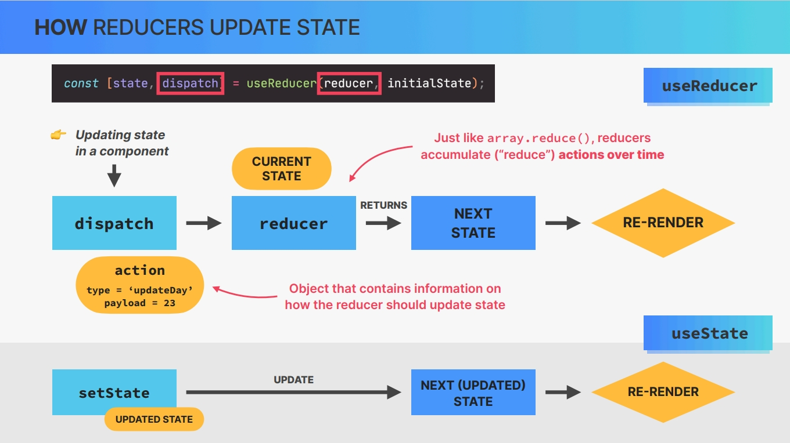
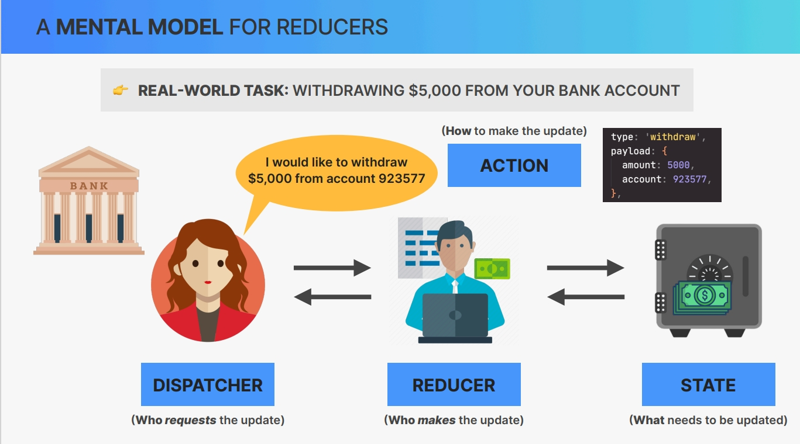

# `The Advanced useReducer Hook`

## `Table of Contents`

1. [Section Overview](#section-overview)
2. [Yet Another Hook_useReducer](#yet-another-hook_usereducer)
3. [Managing Related Pieces of State](#managing-related-pieces-of-state)
4. [Managing State with useReducer](#managing-state-with-usereducer)
5. [The React Quiz App](#the-react-quiz-app)
6. [Loading Questions from Fake API](#loading-questions-from-fake-api)
7. [Handling Loading, Error, and Ready Status](#handling-loading-error-and-ready-status)
8. [Start a New Quiz](#start-a-new-quiz)
9. [Displaying Questions](#displaying-questions)
10. [Handling New Answers](#handling-new-answers)
11. [Moving to the next Question](#moving-to-the-next-question)
12. [Displaying Progress](#displaying-progress)
13. [Finishing a Quiz](#finishing-a-quiz)
14. [Restarting a Quiz](#restarting-a-quiz)
15. [Setting up a Timer with useEffect](#setting-up-a-timer-with-useeffect)
16. [Section Summary useState vs useReducer](#section-summary-usestate-vs-usereducer)
17. [Challenge Creating a Bank Account with useReducer](#challenge-creating-a-bank-account-with-usereducer)

---

## `Section Overview`

Hello and welcome back to the next section, where we'll dive deep into the advanced **useReducer hook**. This special hook gives us another powerful way of managing state. And since state is super important in React, useReducer is a super important hook. And it's also important to master it in order to later understand Redux. So that's why I dedicated an entire section to the youth reducer hook.

Now this section does run pretty long but that's because we're gonna use useReducer to build entire new project. Reinforcing all the other skills that we have already learned so far.

---

## `Yet Another Hook_useReducer`

Let's start this section by getting a first high level overview of how to use the useReducer hook in practice over this lecture and the next one. What we're going to build in this section is gonna be called React quiz. Alright.

Let's start in App.js file, So as always export default function App and then here let's just create a div and in this div we will immediately call the DateCounter component. We need to import that from dateCounter.

For first two lectures, this is⤵ all we have to do in App.js file

```javascript
import DateCounter from "./DateCounter";

export default function App() {
  return (
    <div>
      <DateCounter />
    </div>
  );
}
```

So this DateCounter is identical to what we implemented in one of the previous challenges.

```js
// Starter file(DateCounter)
import { useState } from "react";

function DateCounter() {
  const [count, setCount] = useState(0);
  const [step, setStep] = useState(1);

  // This mutates the date object.
  const date = new Date("june 21 2027");
  date.setDate(date.getDate() + count);

  const dec = function () {
    // setCount((count) => count - 1);
    setCount((count) => count - step);
  };

  const inc = function () {
    // setCount((count) => count + 1);
    setCount((count) => count + step);
  };

  const defineCount = function (e) {
    setCount(Number(e.target.value));
  };

  const defineStep = function (e) {
    setStep(Number(e.target.value));
  };

  const reset = function () {
    setCount(0);
    setStep(1);
  };

  return (
    <div className="counter">
      <div>
        <input
          type="range"
          min="0"
          max="10"
          value={step}
          onChange={defineStep}
        />
        <span>{step}</span>
      </div>

      <div>
        <button onClick={dec}>-</button>
        <input value={count} onChange={defineCount} />
        <button onClick={inc}>+</button>
      </div>

      <p>{date.toDateString()}</p>

      <div>
        <button onClick={reset}>Reset</button>
      </div>
    </div>
  );
}
export default DateCounter;
```

What we're going to do now is to basically replace these two(count and step) useState hooks with useReducer hooks. So it's very important that we understand exactly what these⤴ code here does and how it works, So all the event handlers that we have here and how they update these two states and how the states interact with one another. So only proceed in this lecture once you are really sure how everything works here.

Okay. But anyway, let's now talk about the `useReducer Hook`.  
**The **useReducer Hook** is basically a more advanced and more complex way of managing state instead of the useState hook. Now the useReducer hook works with a so called reducer function which is a pure function that will always take in the previous state and the so called action as an argument and will then return the next state.** But instead of talking about it, let's actually use it.

And I will start by replacing it with count state. So let's write again count and then dispatch = then useReducer and so this hook takes in not only the initial state but also the reducer function that I was just talking about. So the reducer function is the first argument and the second argument is again the initial state.

```js
const [count, dispatch] = useReducer(reducer, 0);
```

Let's create outside of the component that reducer function. So that's just function reducer. And so as I was saying this reducer function takes as the arguments the current state and an action. And so the first thing that we're going to do is to just log these tow to the console.

```js
// outside of the App component
function reducer(state, action) {
  console.log(state, action);
}
```

Okay. **So we have our reducer function, but when does this function actually get called?** Well, that's where this **dispatch** here actually comes into play.

**So we see that the useReducer hook does return the current state, just like the useState hook, but then instead of also returning a state updating function(setState), the reuseReducer hook returns as a second thing dispatch function.** **And so this dispatch function can also be used to update the state.** It just works in a slightly different way. So let's just call this function right here in the increment inc function.

```js
const inc = function () {
  dispatch(1);
};
```

So let's actually click on inc button and here we get our output. The output that we get is 0 1, meaning that the state is 0 and the action is 1. **So why is that?**

Well, it is because the reducer function gets access to the current state, which right now is 0, so the initial state and then it also gets access to the action which right now is simply this 1 that we passed into the dispatch function. So this passed value is basically going to become the action in the reducer.  
And so the idea of the reducer is to take these 2 things, so the current state plus the action and based on that return the next state. And so let's do that.

So all we want to do is to return the state plus the action in this case. And so whatever we return here will then become the new state.

```js
function reducer(state, action) {
  console.log(state, action);
  return state + action;
}
```

Let's just reload and there we go. So our state was indeed successfully updated.

So let's then again call the dispatch function from decrement event handler, **which in the terms of useReducer we call dispatching an action.** So here we will dispatch an action of minus 1 And so then that minus 1 will get added to the current state which will then decrease the value.

```js
const dec = function () {
  dispatch(-1);
  // setCount((count) => count - 1);
  // setCount((count) => count - step);
};
```

And so that works just fine. Great. Now at this point this isn't really useful, is it? I mean we had to do a lot of additional work to get the same functionality as just this, right? But trust me it will get a lot more useful as we keep going here.  

So next up, let's think about how we can set the state because remember when we type some number in the number input filed, we actually want the state to update to that number. So that's what we have here in the defineCount function.  
However, this is not going to work really in the same way that we have been doing. So here if we just dispatch e.target.value then that will simply be added to the current state.

```js
const defineCount = function (e) {
  // setCount(Number(e.target.value));
  dispatch(Number(e.target.value)); // not working as expected
};
```

This is just adding the values, that obviously is not want we want. **And so therefore, now it's time to actually start thinking about actions here.** **So basically in this case we have 3 actions.** We have **decreasing the count**, we have **increasing** it, and we **have setting it**. And so we should actually name these actions.

So what we're going to do is to not just pass in this value but an object which contains the action as well as this value. So let's write type and then let's call this dec for decreasing and then and payload and then set it to 1. Okay.

```js
const dec = function () {
  // dispatch(-1);
  dispatch({ type: "dec", payload: -1 });
};
```

**So this object is what we now call an action when we work with reducer functions.** And in theory, this object here could have any shape that we wanted. But it is kind of a standard to always just have the type property and the payload property. So this is the standard that you will always see when using the useReducer hook and the same is actually true later in Redux. So in case you heard of that. So let's do the same thing in increment as well.

And so now here reducer instead of just doing that, we now need to account for these different types. So let's say if the action dot type is inc, well then return the current state plus action dot payload. Then if it is decrease then minus and if the action dot type is setCount then actually simply return action.payload  

```js
function reducer(state, action) {
  if (action.type === "inc") return state + action.payload;
  if (action.type === "dec") return state - action.payload;
  if (action.type === "setCount") return action.payload;
}

  // In App component
 const dec = function () {
    // dispatch(-1);
    dispatch({ type: "dec", payload: 1 });
  };

  const inc = function () {
    // dispatch(1);
    dispatch({ type: "inc", payload: 1 });
  };

  const defineCount = function (e) {
    // dispatch(Number(e.target.value)); // now working
    dispatch({ type: "setCount", payload: Number(e.target.value) });
  };

```

And if all this sounds and looks really confusing then please don't worry at this point. So now we are only getting like a overview of how all this works in practice but I will explain you exactly what the use reducer hook is, how it really works, and, yeah, we will have some nice diagrams and hopefully by then all of this will make a lot of sense.

Now just to finish here, let's think a little bit more about these that we did here. So actually is there a need to pass in the payload when incrementing and decrementing? Well, not really because the reducer should actually know itself what happens when we want to decrease. Right? So decreasing and increasing is really just adding or subtracting 1.

And so we should add that logic here directly in our reducer. So our reducer should know by himself or by itself how to perform these types of actions. And so then we can remove the payload from inc and dec handler and make it a little bit easier to dispatch this action. So the payload property here is optional.

```js
function reducer(state, action) {
  if (action.type === "inc") return state + 1;
  if (action.type === "dec") return state - 1;
  if (action.type === "setCount") return action.payload;
}

  const dec = function () {
    dispatch({ type: "dec" });
  };

  const inc = function () {
    dispatch({ type: "inc"});
  };

  const defineCount = function (e) {    dispatch({ type: "setCount", payload: Number(e.target.value) });
  };

```

And with this, we finished the first part of transforming this count state here from a simple use state to a use reducer. And so let's **quickly recap** what happened here.

So this new hook(useReducer) takes in not only the initial state which was 0, but also a reducer function **which will always get access to the current state and the action that we pass into the dispatch function.** So **where does this dispatch function come from?** Well, it is one of the things that useReducer returns. So this returns always the current state which here we decided to call count and then it also returns the dispatch function which we can then use to dispatch actions like this 1. So the convention is to dispatch actions that contain a type and then optionally also a payload with the goal to pass in some value into the reducer.

And so then our reducer function takes the current state and it takes all the information that is contained in the action in order to compute the next state. So usually based on the action type the reducer then takes some kind of decision. For example if it's inc, so increment then it simply adds 1, if it's decrement then it subtracts 1 from the current state and if it's setCount then it will simply set the new state as the value that came in as the payload. And so those values are returned and so this return value is what will become the next state. And so then as always the component is rerendered and the UI is updated as well.

---

## `Managing Related Pieces of State`

Welcome back. So let's now also incorporate the step state into the reducer that we have been building. So usually, we use reducers when we have some more complex state to manage. So not just one single value as we have been doing here. So what this means is that **usually the state is going to be an object and not just one single value.**

Let's define an object called initialState, and this is a pretty common name. And so here, let's define our count as 0 and then the step as 1, so exactly the same default/initial values that we had before. And then here we will now pass in that initial state instead of just the 0. And then now our state will no longer be called count but, let's call it just state, so a general name.

And we could also immediately destructure that state object there, but let's do that separately. So let's say count and step destructuring from state.

```js
const initialState = { count: 0, step: 1 };
const [state, dispatch] = useReducer(reducer, initialState); // default state is initialState, which is an object so we need to destructure.s
const { count, step } = state; // destructuring
```

And so let's just go back for now to our console dot log. so log the state and action in reducer function.

```javascript
function reducer(state, action) {
  console.log(state, action);
}
```

Also don't need this anymore and so let's just quickly reload and click on 1 of these buttons here which will then dispatch an action. So all I wanted to do here is to now show you the state and the action again.  
So the state that we now get in the reducer is the same as this initialStep that we passed into useReducer.

```json
// Output of log⤴
{count: 0, step: 1} // state
{type: 'inc'} // action
```

And so then we need to return an object with the same shape. So it also contains the count and the step. And so let's now adapt our reducer function here for that.

Now, actually, it is very common to use a switch statement inside of a reducer function, instead of multiple ifs, we just do usually a switch. And the value that we want to evaluate is of course the action dot type. And then we just do one case for, well, all the possible cases that we can have.  
**So what do we want to return in the case that the action type is decrease?** Well, before we were just returning the state plus 1, but now we can no longer do that.

So now we need to return an object with that⤴ shape, Remember? So how do we do that? Well, first of all let's set the count based on state.count + 1 and then we also need to set the step. But instead of writing it out explicitly, what **we do is to spread out the entire current state object here. And then with this part here we basically overwrite the count property there.**

```js
function reducer(state, action) {
  console.log(state, action);
  // return { count: 0, step: 1 };

  switch (action.type) {
    case "dec":
      return { ...state, count: state.count - 1 };
    case "inc":
      return { ...state, count: state.count + 1 };
    case "setCount":
      return { ...state, count: action.payload };

    default:
      throw new Error("Invalid action type ");
  }
}
```

And so this is exactly the way that we have been updating objects in the past as well. So basically creating a brand new object which contains all the information of the previous object and then whatever we want to overwrite.

Okay. So for now this is going to work exactly the same way as before.

---

**And now let's actually do the same thing for the step. So here we now also want to dispatch an action with the type of setStep. And the payload is going to be exactly the same.** So again, we convert to a number e.target.value. Okay. So setStep.

```js
const defineStep = function (e) {
  // setStep(Number(e.target.value));
  dispatch({ type: "setStep", payload: Number(e.target.value) });
};
```

And so now here we need to then add a new case for that. And so in this case we want to return the entire state and set the step this time to action dot payload. So that's state.

```js
case "setStep":
  return { ...state, step: action.payload };
```

That works. And so now the only thing that we have to do is to actually take this step here into account when we increase and decrease. So that's easy enough. So that's just state dot step instead of 1.

```js
switch (action.type) {
  case "dec":
    return { ...state, count: state.count - state.step };
  case "inc":
    return { ...state, count: state.count + state.step };
  ...
}
```

Up until this point maybe all of this still doesn't seem so interesting. So everything that we did so far could easily have been achieved with the useSate hooks as well, Right? But now let's actually do something different in reset function. So what we did before was to simply take the both state setters and then call both of them and set to default ones.

**But now we can do one big state transition which does all that at the same time. And so that's going to be one of the huge advantages of the useReducer hook.** So especially of course if we had even more states than just these 2. So let me show what I mean in practice. So here we can just dispatch an action with the type, for example, reset.

And here we don't need to pass any data into the reducer and therefore we don't need to specify the payload because we can do that right inside the reducer function.

```js
const reset = function () {
  dispatch({ type: "reset" });
};

// reducer function
case "reset":
  return { count: 0, step: 1 };
```

And so here we can essentially update these 2 pieces of state at the same time.  
And we can do even better. Let's cut initialState variable from DateCounter component and put it to the top level, so this can actually live outside. And in "reset" we can just return the initialState. Alright.

```js
case "reset":
  return initialState;
```

So all we're doing here actually in these event handlers is to just dispatch, so in each handler we are just calling the dispatch function. And so we could just move all of these dispatches then right into the JSX. So that would actually make a lot of sense but I won't do that right now. But, yeah, we could just replace all these event handlers that we have here because all of them, all they do is to dispatch actions.

The logic itself, so t**he real logic of what they do is now all centralized in one reducer function.** And so that is the beauty and the big advantage of the reducer function.  
So basically we have all the possible state updates that can happen in our application in one central place. And so this makes it really easy to understand the entire application without having to go into all the different components and all the different functions.

All these advantages will become more clear later on. For now in these 2 lectures, I just wanted to focus on the mechanics of the useReducer Hooks. So really how it works and especially how this reducer function here works. But I know that this all looks very confusing right now because I perfectly remember how I felt when I first learned about this quite complex hook.  
But since we are in the advanced react part now, it's time to learn about these more difficult things.

**_`ENTIRE CODE OF DATE COUNTER APP`_**

```js
import { useReducer, useState } from "react";
const initialState = { count: 0, step: 1 };

function reducer(state, action) {
  // console.log(state, action);
  switch (action.type) {
    case "dec":
      return { ...state, count: state.count - state.step };
    case "inc":
      return { ...state, count: state.count + state.step };
    case "setCount":
      return { ...state, count: action.payload };

    case "setStep":
      return { ...state, step: action.payload };

    case "reset":
      return initialState;

    default:
      throw new Error("Invalid action type ");
  }
}

function DateCounter() {
  const [state, dispatch] = useReducer(reducer, initialState);
  const { count, step } = state;

  // This mutates the date object.
  const date = new Date("june 21 2027");
  date.setDate(date.getDate() + count);

  const dec = function () {
    dispatch({ type: "dec" });
  };

  const inc = function () {
    // dispatch(1);
    dispatch({ type: "inc" });
  };

  const defineCount = function (e) {
    dispatch({ type: "setCount", payload: Number(e.target.value) });
  };

  const defineStep = function (e) {
    dispatch({ type: "setStep", payload: Number(e.target.value) });
  };

  const reset = function () {
    dispatch({ type: "reset" });
  };

  return (
    <div className="counter">
      <div>
        <input
          type="range"
          min="0"
          max="10"
          value={step}
          onChange={defineStep}
        />
        <span>{step}</span>
      </div>

      <div>
        <button onClick={dec}>-</button>
        <input value={count} onChange={defineCount} />
        <button onClick={inc}>+</button>
      </div>

      <p>{date.toDateString()}</p>

      <div>
        <button onClick={reset}>Reset</button>
      </div>
    </div>
  );
}
export default DateCounter;

```

But anyway, in the next lecture we will have some nice diagrams that will really illustrate the flow of the data and of the state here. And so stay tuned for that.

---

## `Managing State with useReducer`

**So we just learned how to use the use reducer hook to centralize all the state updating logic in one central place, which is the reducer function.** So let's now dive deeper into the concept of reducers and how and why they can make our applications a lot better in certain situations.  
So up until this point, we have been using the useState hook to manage all our state. Right?  
However, as components and state updates become more complex, using use state to manage all state is, in certain situations, not enough. For example:

- some components have a l**ot of state variables and also a lot of state updates** that are spread across multiple event handlers all over the component or maybe even multiple components. And so this can quickly become overwhelming and hard to manage.  
- It's also very common that **multiple state updates need to happen at the same time**. So as a reaction to the same event. For example, when we want to start a game we might have to set the score to 0, set an is playing status and start a timer.  
- And finally, many times **updating one piece of state depends on one or more other pieces of state**, which can also become challenging when there is a lot of state.


And so, in all these cases, useReducer can really help. So these are the problems that reducers try to solve.

**And so let's now see how useReducer solve these problems.**

**useReducer is an alternative way of setting and managing state** which is **ideal for complex state** and **for related pieces of state.**  
We already used useReducer in the last two lectures and this⤵ is what that looked like.

```js
const [state, dispatch] = useReducer(reducer, initialState);
```

So **we call useReducer with a reducer function and its initial state, and it returns a state and a dispatch function.**  
So starting from the beginning, when we use useReducer, we usually store related pieces of state in a state object that is returned from the useReducer hook. Now, **it could also be a primitive value but usually we use objects**.  
Now, as we already know, **useReducer needs something called a reducer function in order to work.** This function is where we place all the logic that will be responsible for updating the state. **And moving all state updating logic from event handlers into this 1 central place allows us to completely decouple state logic from the component itself, which makes our components so much cleaner and so much more readable.**  
So when we manage state with useReducer, **it's ultimately this reducer function that will be updating the state object.** So in a way, it's a bit like the setState function in useState but with superpowers.  
Now, **in practice, the reducer is simply a function that takes in the current state and an action, and based on those values returns the next state, so the updated state.**

Now **keep in mind that state is immutable in React.** **This means that the reducer is not allowed to mutate the state.** And in fact, **no side effects are allowed in the reducer at all.** So,  
**`A reducer must be a pure function that always returns a new state, based on the current state and the received action.`**

**The `action`, is simply an object that describes how state should be updated. It usually contains an action-type and a so called payload, which is basically input data.** And it's based on this action type and payload that the reducer will then determine how exactly to create the next state.  

And now the final piece of the puzzle is this. **How do we actually trigger a state update?**  
Well, that's where the dispatch function comes into play. **So useReducer will return a so called dispatch function, which is a function that we can use to trigger state updates.** **So instead of using setState to update state, we now use the dispatch function in order to send an action from the event handler where we're calling dispatch to the reducer. And the reducer will then use this action to compute the next state.**


So these are all the pieces that need to fit together in order to effectively use the useReducer hook. So, `an action object`, `a dispatch function`, `a reducer` and `a state object`.

Let's also look at a diagram to really see how all of these pieces actually fit together in order to update state.  
So let's say that we're in an event handler in some component and we now need to update some state. So what do we do?  
Well, We call the dispatch function that we got back from useReducer in order to dispatch an action to the reducer. And this action is an object that contains information for the reducer. So, information about how the reducer should update the state. In this case(see image⤵), the action type is update day and the payload is 23, which probably means that the reducer will set the day state to 23.  
Now the object doesn't need to have this exact shape with a type in a payload, but it's a standard that has been adopted by most developers. Now, the reducer takes in this action together with the current state and it will then return a brand new state object which we usually call the next state in the context of reducers. And as always with state, updating state will then trigger a rerender of the component instance.  
Now, if you're wondering why the reducer function is actually called a reducer, **the answer is that it's because it follows the exact same idea as the array reduce method.** So just like the reduce method accumulates all array values into one single value, the react reducer accumulates all actions into one single state over time.

Behind the scenes the dispatch function has access to the reducer because we passed it into the useReducer hook, right? So dispatch is really coordinating this whole thing and also giving the reducer access to the current state.  
And now to understand this even better, let's compare the mechanism of useReducer with the much simpler useState mechanism. So when we use useState, we get back a setter function. And let's just call it setState. And then when we want to update state, we just pass the new updated state value that we want and react will simply update the state which in turn will trigger the rerender. So it's a lot simpler and more straightforward than useReducer.  
But since useReducer solves the problems that we saw earlier in this lecture, it's a great choice in many situations even though it's a bit more complicated to set up. But we will talk more about the big advantages of useReducer and also when to use it later in the section.



Now, I understand that this whole idea of dispatching actions and writing reducers is super confusing in the beginning. I know because I do remember how confused I was back in the day. And so let me show you now a really helpful analogy that made all this really clear to me when I first learned about this.  

So, imagine that you needed to take $5000 out of your bank account for some reason. Now since this is a large amount, you can't just do it from an ATM.  
So you need to go physically to a bank. Now, once you're at the bank, how do you actually get those $5000? Do you walk straight into the bank's vault, grab the cash and then go home? Well, I don't think so, right? That's usually not how it works.  


How it does work is that you go into the bank and there you'll find a person sitting at a desk ready to assist you. Now when you arrive at the bank, you already know how much cash you want to withdraw and from what account number. And so you walk right to the person and tell them that you would like to withdraw $5000 from account 923577, for example. What happens then is that usually the person will type something into his computer, check if you actually have the cash in your account. And if so, he goes to the bank's vault and gets the money to finally hand it over to you. It's your money after all, right?  

But note the big difference between this real version and the previous version of the story where you just grabbed the cash yourself. In this real version, you told the person what to do and how to do it, and he then got the money for you on your behalf. And so you didn't take the money directly yourself, and that's a huge difference. So does this maybe start to sound familiar?  
Well, I hope it does. And so let's now bring this analogy back to useReducer and identify what each of these pieces represents in the use reducer mechanism. And let's start with the most important thing, the state. So what do you think the state is in this analogy? Well, **the state is represented by the bank's vault** because this is where the relevant data, so the money is stored and also updated. So the vault is what needs to be updated and so that's our state. Nice.  
let's think about how the money is taken from the vault. **So about how state is actually updated**. So starting from the beginning, what do you think the customer going to the bank represents in this analogy?  
Well, **the customer going to the bank and requesting the money is clearly the dispatcher** because it is who is requesting the state update. Right? And they're doing so by going to the person and requesting to withdraw the $5000.  
So what is the reducer here and what is the action? Well, **the reducer is going to be the person working at the bank** because that's the one who actually makes the update. In this case, it's the one who goes to the vault to get your money.  
But how does the person know how much money to take and from what account? They know because you told them so exactly in your request message. And so that **request message is clearly the action.** In this example, the action can be modeled like this with the action type being withdraw and the payload being the data about the withdrawal that you want to make.



So, summarizing, you went into the bank with a clear action in mind. You then dispatched that action to the reducer, so to the person working there who took the action and followed the instructions to take the right amount of money from your account, so from state. He then gave you your money finishing this cycle. So you did not go directly into the vault and took your money. Instead, you had the person as a middleman who knows a lot better than you how to perform different actions on the vault. So he knows how to deposit, how to withdraw, how to open and close an account, how to request a loan and more. And he does all this without you having to worry about the details. So exactly like a reducer function which also decouples and abstracts all the state updating logic away from you so that you can have clean and easy to understand components.  
So I hope that this now made the relationship between dispatcher, reducer, action, and state crystal clear.

---

## `The React Quiz App`

Let's start building a brand new app that will hopefully show you how extremely helpful the useReducer Hook can be. So as the name says, this app is basically a very simple quiz about some react concepts.

Now in this lecture all I want to do is to just set up here the app skeleton. So basically just setting up the structure with the header and the app itself. And so then in the next lecture we can start fetching the questions and start building the application.

So our parent div here will have the class name of app and then inside that app we will have a header. Now we will start to actually create one file per component. So making this project development a bit more real world. Now in case of the Header I actually already created that component for us. So it's just this very simple component that doesn't even have any logic or any state and it doesn't even accept props. So it's just a very simple presentational component that has the image, so the logo and the title.

**`HEADER.JS FILE`**

```JS
function Header() {
  return (
    <header className='app-header'>
      
      <h1>The React Quiz</h1>
    </header>
  );
}

export default Header;
```

And there we go. So there we have our header and then here below that we will have basically the main content. And so for that main content let's create a Main component.  
So let's create a new file with a new component. So this one will be called Main.Js because Main will be the name of the component.  
**`And now let's actually for the first time use that snippet that I gave you at the very beginning of the course.`**  
So all we have to write is `rfc`, hit enter and bam, it creates a brand new component for us even with the name of the file. So it got the name here from the file and then it accordingly names the component.  
And now here in Main, what will we place as the content?  
**Well, basically here we want this content of Main component to stay in App component. So we want to just pass it into the Main. And so for that we use the children prop,** remember? So basically doing `component composition` here. We have done this multiple times already at this point.

**`MAIN.JS FILE`**

```js
function Main({ children }) {
  return <main className="main">{children}</main>;
}

export default Main;

```

**`APP.JS FILE`**

```JS
import Header from "./Header";
import Main from "./Main";
export default function App() {
  return (
    <div className="app">
      <Header />

      <Main>
        <p>1/15</p>
        <p>Question?</p>
      </Main>
    </div>
  );
}

```

---

## `Loading Questions from Fake API`

Okay. So let's now set up a fake API on a fake web server and then use that to load the questions data into our application. So this time we're not going to use a real API because I created these questions myself. And so then there is no API with that. But I still want to basically pretend that we are loading these questions from somewhere.  
And so therefore we can create a fake API using an NPM package called `JSON Server`.  

**`npm install json-server`**

And now what we need to do next in order to be able to call that package. So to run the JSON server command we need to add a **new npm script** to the package.json file. And so let's now create our own npm script here with the name of server. And so what should happen here then is that we want to call, so we want to basically run the json-server package and we want to watch a certain file. And so that file is going to be our questions.json. And actually, let's take a look at that question.json file. So basically it is just one object with the questions property and then that property has one array. And so then the array is usual array of objects. So each object then has a question, the options, the correct one, and the number of points. And so this is the file that we now want to watch. So basically to create an API from. And so we just do data which is the folder and then questions.json. And finally, we also need to specify the port, let's say 8000.  

```json
"server": "json-server --watch data/questions.json --port 8000"
```

And that should be enough to get us going. So let's do **`npm run server`**. So here we need to run keywords. It's not just npm server but npm run server.

let's open up this url in browser: <<http://localhost:8000/questions> And, yeah, we see our json data.

We also need questions at the end of url which is basically the endpoint we are creating here. And it is called questions because that is the name here of this field.so the name of the field in object where we stored array of objects, that is in questions.json file.

```json
// in questions.json file
{
  "questions": [ // this questions
    { ... },
    { ... }, 
  ]
}
```

```json
// Data we're seeing on this url: http://localhost:8000/questions

[
  { ... },
  { ... }
]
```

And also we notice that the data browser gives as is just the array, that is in question.json file, so here we don't have question filed and then inside that an array, instead just an array.  
So let's now grab this URL <http://localhost:8000/questions> and then fetch it into our application. So we want to load that data on mount and so for that let's use our friend the useEffect hook.

```js
// App component
useEffect(function () {
  fetch("http://localhost:8000/questions")
    .then((res) => res.json())
    .then((data) => console.log(data))
    .catch((err) => console.error("Error"));
}, []);
```

Okay. So let's actually try that. So let's reload, come to our console, and beautiful, here is our data. But now, of course, we will at one point need to display that data here in the UI. And so for that we are going to need state. And as you can imagine we will now use the useReducer hook to create that state.

```js
const [state, dispatch] = useReducer(reducer, initialState);
```

And so let's create both of reducer function and initialState object outside of App component. reducer() will take in the current state and the action that was dispatched. Okay. And now let's start by creating our initial state and here let's create **questions** which by default will just be an empty array.  
Now besides this, what we also want is the **loading state**. So to tell the user that questions are being fetched. However, this time around we will do it in a different way. So we will not create the isLoading state as always, but instead we will use this time a **status state**. And so this status will basically be a string of the current status of the application that will change throughout time.  
So in the beginning our application will be in the `loading state.` But throughout time we will be able to be in different states. So we can be in `loading state`. We can be in an `error state`. We can be in a `ready state` once the data has arrived and we are ready to start the quiz. We can be in an `active state` once the quiz is actually running and we can be in a `finished state` once the quiz is finished. And so this is a bit of a nicer way of handling all these different statuses that the application can be in.  
So instead of having a isLoading or isError or isReady or isActive states, we just have the status and then inside the status we then tell the application what is currently going on. This has nothing to do with useReducer. It's just another technique.

```js
const initialState = {
  questions: [],

  // 'loading', 'error', 'ready', 'active', 'finished'
  status: "loading",
};
```

But anyway, let's now come to our reducer function and then let's again set up that switch statement that we already saw earlier. So this is now basically a recipe that you will always follow, so which is always the same. So at least the setup here.

So we switch the `action dot type`. So we basically want to test for different types and let's start with the case of **dataReceived**. So this will be the action that we're going to dispatch right here as soon as we actually have the data.

So here we will now no longer log the data to the console in then method, but instead we will dispatch an action to the reducer. And let's create our common usual event here. So that's simply with the **type** and so that's the dataReceived type which we can also think of of an event. So basically it's like here we are now creating this data received event which our reducer will then basically respond to. So that's the first part and now here we also need a **payload** because we want to actually send some data.So send some information to the reducer so that the reducer can then use this to compute the next state. And so here, that payload will be the data that we just received. Okay.

```js
useEffect(function () {
  fetch("http://localhost:8000/questions")
    .then((res) => res.json())
    .then((data) => dispatch({ type: "dataReceived", payload: data }))
    .catch((err) => console.error("Error"));
}, []);
```

And so here in reducer function, remember we need to return a new state object and so we will grab all the current state and then we will set questions to the data that we just received. So that's action dot payload.  
But what is **really great about reducer func is that we can now set this other piece of state that is related to the question** or to questions and that is the status. So the status and the questions many times will change at the same time. And so that's why having a reducer is so useful because now we can here in the same place also set the status to ready. So basically we updated these 2 state variables, so these 2 pieces of state all in one go in this one dispatch. So just by dispatching this one event we updated both the questions and the status.  
But anyway, let's also create then our default case. And so here we will just like before throw a new error saying that the action is unknown. So give this a safe and let's see what happens.

```js
function reducer(state, action) {
  switch (action.type) {
    case "dataReceived":
      return { ...state, questions: action.payload, status: "ready" };
      // here👆 we'er setting both questions and status in one go.

    default:
      throw new Error("Action unknown type " + action.type);
  }
}
```

So we are no longer logging to the console but we should now have those questions in our state already. So we can't see it on the UI yet but let's take a look at our dev tools and yeah, we have our questions in the state and the status has also successfully been changed to ready. So we transitioned to this new state where we changed these two properties(questions & status) of our state object. So that's working great.

And now let's just create another event here basically for the case there is an error.

So case **dataFailed**, and so here let's again return the entire state and then we simply set the status here to error. And so then later on we will use of course the status to display different things in our UI in the JSX. So when there is an error we will display that error and if we are ready, so if the status is ready then we will display the questions.

```js
case "dataFailed":
  return { ...state, status: "error " };
```

But now let's actually dispatch that action. So the type is this time dataFailed. And here actually let's not pass in any payload because we're not really interested in the error that we're going to receive. So all we will do is tell or state that now the status is an error. So just to test this, let's quit the process here where we load the data. So with control c, we can finish this from terminal. And so now we can no longer fetch data from that endpoint. And so we see that we get some error already. And also here we see that the status has been set to error. So that's also working but of course let's go back to having our API work.

```js
useEffect(function () {
  fetch("http://localhost:8000/questions")
    .then((res) => res.json())
    .then((data) => dispatch({ type: "dataReceived", payload: data }))
    .catch((err) => dispatch({ type: "dataFailed" }));
}, []);
```

**`Quick Recap`**  
Okay, So we did a lot of things. So let's just quickly recap all that we did. So we installed the **json-server** package to create basically this fake API and then we created our NPM script, in this case called **server**, to then run that package and then watch the file where we actually have this questions data as an array.

And so then inside our application we use the useEffect hook to fetch that data on the initial render. Then to store that data in state, this time we used the useReducer hook. And so then we created the initial state object and the reducer. So that's pretty standard stuff.

So we have the questions array and we have a status. And of course as we keep building the application we will add a lot more information here. So we will add like 3 or 4 more pieces of state. But for now we are just working with these 2 and so then as soon as our data is successfully fetched, we dispatch the action here where we tell our reducer that the type of the action is data received and then as the payload we pass in the actual data. And so then our reducer receives that action and handles it right  in switch statement where we then assign the payload. So that data that we received from the API onto the questions array.  
But that's not all because at the same time we now were able to set our status to ready here all in 1 go. So just with the call of 1 dispatch function. Now the advantage of this reducer is of course not really clear yet because we only have these 2 cases yet and only these 2 state variables. But it will become really clear and really helpful as we go through this section.

---

## `Handling Loading Error and Ready Status`

So with our reducer now in place, it's time to handle the different status that the application can have. So remember that at the beginning our application is in the **loading** status. So that's how it starts And then when we receive some data the status change to **ready**. And so that's when we will then want to display the list of questions. And also there can be an error and so then the status changes to **error**.

And so now we want to display different UIs for these three situations. And all of these situations will be always displayed inside the Main component. Let's now we will conditionally display some components. So here we can use state dot status but that's maybe a bit too much work. And so that's actually destructure our state object.  
Now we could do that outside so creating these variables here but we can do it on the fly. So basically with nested destructuring.

```js
// const [state, dispatch] = useReducer(reducer, initialState);
const [{questions, status}, dispatch] = useReducer(reducer, initialState);
```

And so now we can just check for the status is **loading**, and if it is then we want to display something.

Now in this case we want to show a loader and I actually also already have that loader component here. So it's again a very simple presentational component and so there was no need to create it from scratch.  
These different status are mutually exclusive. So we don't need any ternaries or even nested ternaries. so we just write like this

```js
<Main>
  {status === "loading" && <Loader />}
  {status === "error" && <Error />}
</Main>
```

Okay. And we have another state or status that we can handle which is the **ready status**. So ready basically means that the questions have arrived and that we are ready to start the quiz.

So in status **ready** we will want to create yet another component. So let's just check that out. So when we load the app we briefly saw the loading indicator there flash and then this here is the start screen, where we see a welcome message, this is the component that we want in ready state. So just with this text(welcome msg), number of questions, and then a button to start. So very simple stuff.  

So let's create a new file here for that component and I'm gonna call it the StartScreen.js and then again **using that snippet rfc which by the way stands for react functional component.**

```js
function StartScreen() {
  return (
    <div className="start">
      <h2>Welcome to the React Quiz!</h2>
      <h3>X question to test your React mastery</h3>
      <button>Let's start</button>
    </div>
  );
}

export default StartScreen;
```

Now what we want here👆 in place of X, is actually the number of questions. And so that's basically the length of the questions array. So the questions array has the length of 15 and so 15 is what we want to see there. **So where do we calculate that value? Should we maybe place it here also into our state object?**  
Well, that's actually not necessary. So just like we have always been doing we can just calculate derived state right here in the App component because in fact this is just derived state because we can simply calculate it from the question array itself.

And of course we could also pass the entire array into this component but there's really no need to. And also we will need this in other places. So let's pass the number of questions equal to number of questions.

```js
// Defining derived state
const numQuestions = questions.length;

// Passing to StartScreen component
{status === "ready" && <StartScreen numQuestions={numQuestions} />}
```

So then we can receive that in StartScreen component. So destructuring the numQuestions. And finally numQuestions in place of X in h3.

```js
function StartScreen({ numQuestions }) {
  return (
    <div className="start">
      <h2>Welcome to the React Quiz!</h2>
      <h3>{numQuestions} question to test your React mastery</h3>
      <button className="btn btn-ui">Let's start</button>
    </div>
  );
}
export default StartScreen;
```

Okay, and so with this we actually fulfilled our goal for this lecture. And so in the next one, we will then finally start our game or or quiz by clicking the button.

---

## `Start a New Quiz`

Now it's time to implement the functionality of starting a new quiz. So how are we going to do that? Well, After we click here on `Let's start` button we basically want to display the first question inside the Main component.  
And since we have been using this status state to basically decide what will be rendered in a Main component, all we have to do now is to change that status to something else('active') and then display that Question.

And let's actually start with that. So let's say if the status was active, then here we want to display the Question component.  
So we are using these different status to decide what will be displayed in the Main component of the Application.

```javascript
<Main>
  {status === "loading" && <Loader />}
  {status === "error" && <Error />}
  {status === "ready" && <StartScreen numQuestions={numQuestions} />}
  {status === "active" && <Question />}
</Main>
```

**But now the question is how do we actually set this status to active?** Or in other words, **how do we now start the game?** Well, all we have to do is to create basically a new action type in our reducer which will set the status to start or to active actually.

So let's create a new action type here and let's call this one start. And so here we want to return a new state as always which is comprised of the current state and the status set to active.

```js
case "start":
  return { ...state, status: "active" };
```

Alright. And so now it's very easy. We just have to dispatch an action from this button(let Start) with the action type of start that we just created.

So we're going to do that in StartScreen component. So here we will want to dispatch that action. And so therefore we now need access to that dispatch function. So it needs to be a prop and so let's pass that into the StartScreen. And so as you see **we are basically passing the dispatch function around just like before we were passing around event handler functions or the setState functions,** Right?

```js
{status === "ready" && (
  <StartScreen numQuestions={numQuestions} dispatch={dispatch} />
)}
```

So if we were still using useState then we would now probably create some new event handler here and then we would pass that event handler into the StartScreen. But now we don't need to do any of that anymore because we are handling all the state transitions in the reducer. And then all we do is to pass the dispatcher functions around because then it's very easy.  
All we have to do is to then call that dispatch function with the action that we want to dispatch, whenever a click happen on Start button. So creating a new function here as always and then dispatch and the type of the event will be as we just defined earlier start.And this should actually be enough.

```js
// StartScreen component
<button className="btn btn-ui" onClick={() => dispatch({type: 'start'})}>Let's start</button>
```

---

## `Displaying Questions`

So let's now render and display the current question. So, of course, we will not render all the questions at the same time, but instead one by one. And so therefore, **we need a way of knowing which the current question is.** So basically we need some way of keeping track which question is the current one. And so let's add a new piece of state to our initial state in App component.

And we could call this the current or the current index, but I would like to just call it index. And this index starts at 0 because we will use this index to take a certain question object out of the questions array. And so the first element of this questions array is element number 0. Therefore our index starts at 0. And so then in the future at some point if we want to display the next question we can already imagine that we will do that by changing this index. So then in the future when we change that index from 0 to 1 that should display the next question. So it should then rerender the screen and therefore this needs to be a state variable.

```js
const initialState = {
  questions: [],

  // 'loading', 'error', 'ready', 'active', 'finished'
  status: "loading",
  index: 0,
};
```

All right, So that's the reasoning behind why we need this variable, or this piece of state and also why it needs to be state in the first place. And again, it's because it needs to rerender the screen once it is updated.

But anyway, let's now take this index to pass in the question object into our Question component. So this component will of course need access to that current question and as we just said that will be questions. So the array at the current position which is index.

```js
{status === "active" && <Question question={questions[index]} />}
```

And now let's go to this component and just like before if I hit the command key and then click here it will automatically go to that component even if it is in another file. Alright.  
So here let's now receive that question, first, let's take a look at the shape of this object so that we actually know what we are dealing with. So log the question object.  
So inside the question, we have the question property.  
Then we also have array of the options. And so next we will want to loop over this array and display these options as well. Now this time I will not use a unordered list for that because we will not have list elements but actual buttons.

```js
<div>
  <h4>{question.question}</h4>

  <div className="options">
    {question.options.map((option, index) => (
      <button key={option} className="btn btn-option">
        {option}
      </button>
    ))}
  </div>
</div>
```

_Now here, actually I would like to split this component in to two. So whenever there is a list like this, I personally prefer to have a smaller component in a situation like this. So based on the logical separation of the content of this component, I would say that we can now split this component. And actually we are creating so many components that it is a common practice to create a new folder called **components**._

```js
// Question component
import Options from "./Options";

function Question({ question }) {
  console.log(question);
  return (
    <div>
      <h4>{question.question}</h4>
      <Options question={question} />
    </div>
  );
}
export default Question;
```

```js
// Options component
function Options({ question }) {
  return (
    <div className="options">
      {question.options.map((option, index) => (
        <button key={index} className="btn btn-option">
          {option}
        </button>
      ))}
    </div>
  );
}
export default Options;
```

---

## `Handling New Answers`

Now in this lecture, we are going to implement the logic for handling a new answer. So a new answer is basically when we click on one of an options here. When we click on any option then there will be 3 things happened.  
`First`, the correct and the wrong answers are displayed.  
`Second`, the points that we got were updated.  
`Third`, the next button was displayed down.  
So basically when we click on one of these options we need to rerender the screen. And so once again that means that we need a new piece of state. And so that state should basically store which of the options was selected.

So in other words, which was the answer? So answer 0, 1, 2, or 3. So basically the answer is just going to be the index number of the options.  
So let's come back to our App.js and add yet another piece of state to our initialState. So let's just call it answer and in the beginning it will be null. So there will be no answer initially.  
And now next let's then create an action in our reducer to update that answer.

```js
case "newAnswer":
  return { ...state, answer: action.payload };
```

And so now we need to go here into  Options component because here is where the click on the button will happen. So here is where we will now need to dispatch a new action. So that means that we need to pass the dispatch function into Question. So dispatch and then the dispatch function, and we will also need the answer that we gave.

```javascript
// Passing from App to Question
<Question
  question={questions[index]}
  dispatch={dispatch}
  answer={answer}
/>

// Pass from Question to Options
function Question({ question, dispatch, answer }) {
  console.log(question);
  return (
    <div>
      <h4>{question.question}</h4>
      <Options question={question} dispatch={dispatch} answer={answer} />
    </div>
  );
}

```

So a bit of prop drilling, you can maybe identify here, but that's not a big deal if it's like just this 1 level.

So on click so dispatch and the type of this newAnswer as we used in reducer function, and the payload should then be the answer that was given. **Now, what is the answer?** Well, remember how we said earlier that the answer is basically the index of the option. And the reason for that is that the correct option is also marked using these same indexes. So then how do we get the current index here? Well, we can just get it here as the second argument of the map method. So that's just how this method works where the first option is the **current element** of the array and the second argument is the **current index**.

```js
function Options({ question, dispatch, answer }) {
  return (
    <div className="options">
      {question.options.map((option, index) => (
        <button
          key={option}
          className="btn btn-option"
          onClick={() => dispatch({ type: "newAnswer", payload: index })}
        >
          {option}
        </button>
      ))}
    </div>
  );
}

export default Options;
```

And so next up let's then do some formatting based on this answer. And so that's why this options received that answer prop. So that state right here in the Options component. **So what we're going to do is to basically change the class names here conditionally.**

So let's create a template literal, and then first of all let's create a class for the selected option. Let's say if the current index is equal to the answer then add the answer class and otherwise don't add anything. So when we're doing conditional CSS we should always use the ternary operator.

```js
// on button element
className={`btn btn-option ${index === answer ? "answer" : ""}`}
```

So that's the first thing. And now we also then basically need to paint them in the right color depending if the option is the correct option or not. So let's again enter here the JavaScript mode and then let's say if the current index is equal to question dot correct option, then add the class correct and otherwise wrong.

```js
<button
  key={option}
  className={`btn btn-option ${index === answer ? "answer" : ""} ${
  index === question.correctOption ? "correct" : "wrong"
  }`} // This logic is not correct. go below👇
  onClick={() => dispatch({ type: "newAnswer", payload: index })}
  >
  {option}
</button>
```

Okay Great! And now we can actually click multiple times on different options, but of course that should not be allowed. So once the user clicks on one of these options then it should be locked in. And so we then can no longer click.  
And so let's just disable the button with the disabled prop and in here basically we want to know if there was an answer. So any answer at all would then disable this button. So since we know that the initial state of the answer is null we can just check if the answer is not null. So if it's not null means that there was an answer and then we want to disable the buttons.

So all our options are already painted, so before selecting any option the correct and wrong answer are already printed with their colors accordingly. So that's very bad because it gives away the correct option. And so actually what we did above👆 was not really correct. So basically classifying each of them as correct and wrong. We only want that to happen if there was an answer at all. So we need to reuse that. So let's just place that in a special variable. Let's say **hasAnswered**. Okay. `const hasAnswered = answer !== null;`

```javascript
function Options({ question, dispatch, answer }) {
  const hasAnswered = answer !== null;

  return (
    <div className="options">
      {question.options.map((option, index) => (
        <button
          key={option}
          className={`btn btn-option ${index === answer ? "answer" : ""} ${
            hasAnswered
              ? index === question.correctOption
                ? "correct"
                : "wrong"
              : ""
          }`}
          disabled={hasAnswered}
          onClick={() => dispatch({ type: "newAnswer", payload: index })}
        >
          {option}
        </button>
      ))}
    </div>
  );
}

export default Options;

```

**Great. So we took care of one of the three things that should happen**. So again, the `correct answers should be displayed`, then the `user score should be updated` and the `next button should be displayed`.  
So let's now quickly take care of the second part. So basically that the user score should be updated. So that is something that needs to again update on the screen which means that we need yet another state variable. So let's call this points and the user starts at 0. Okay. **And now where do we update these points?**  
Well, **it makes sense that it is exactly in the same place where we received the new answer.** So right with answer we will also update the points(in newAnswer case from switch statement). **So how are we going to do that?** Because of course the points should only be awarded if the answer was correct. So we need to first figure out which is the current question, then if the answer is correct and only then we want to add the points to the current points.

So that sounds confusing so let's just do it. So first of all let's figure out which is the current question because we actually don't have that stored in the state. So we only know the index but not the question itself. `const question = state.questions.at(state.index);`. And so here really we are leveraging the current state that we get into the reducer to compute the next state. So really relying on that current state.  
So with this we know which is the current question. And so now we can then check if the current question is equal to the received answer. So that received answer is again action. Payload and now let's check if it is equal to question.correctOption again So if that is the case then we want to add some points to the current points. And so that is state dot points plus something. Let's just do 1 for now. And otherwise the points will just stay the same. So then we will just return again state dot points. Okay. Here we are adding 1 for now but that is not what we want to add in the end because notice again how each of our questions object actually has a different points value. So that is at the current question dot points.

```js
function reducer(state, action) {
  switch (action.type) {
    case "dataReceived":
      return { ...state, questions: action.payload, status: "ready" };

    case "dataFailed":
      return { ...state, status: "error" };

    case "start":
      return { ...state, status: "active" };

    case "newAnswer":
      const question = state.questions.at(state.index);

      return {
        ...state,
        answer: action.payload,
        points:
          action.payload === question.correctOption
            ? state.points + question.points
            : state.points,
      };

    default:
      throw new Error("Action unknown type " + action.type);
  }
}
```

Alright. So I understand that this here might seem a bit confusing but this is really just understanding what kind of data we have and then working with that data. And also you notice that here we now have for the first time quite a more complex state updating logic in our reducer. And this is perfectly fine and actually encouraged. **So whenever it's possible we should try to put as much of the logic for calculating the next state right into the reducer.**  

So this should be working. Let's check it. So we know that this question is worth 10 points. And so if we select the correct 1, then you notice that our points have indeed been updated to 10. So that's 0+10 And if we select the wrong 1, then our points stay at 0.

Great. So of course we will later then display these points in the UI but let's leave that for a bit later because next up we need to take care of displaying the next button and handling the logic of actually moving to that next question.

---

## `Moving to the next Question`

So now we have the simple task of moving to the next question as soon as an answer has been given. So as soon as the user clicks on one of the options, we want a button down to appear that we can click. And so then we will move automatically to the next question. **Now, as we have discussed before, moving to the next question basically means increasing this index.** Right? Because it is based on this index that the current question is being read and then displayed. So that's what we do right here. So we're passing in the questions object that corresponds to the current index.  

And so let's now here create yet another possible action in our reducer. Now let's call this one just **nextQuestion**.

So here we will just return the current state and all we want to change is the index property which will be set to state dot index+one and that should be it at least for now.

```js
case "nextQuestion":
  return { ...state, index: state.index + 1 };
```

And so now we need to create actually that button. So besides the question we want to then display the button. And so let's actually always display a button component but that button component will then only render the button element itself if there has been an answer. So we could also do it the other way around and do the conditional rendering right here but instead we're going to do that conditional rendering inside the button.

So we will allow this next button to basically decide if it wants to render itself or not. And so since we want to dispatch an action from there we need to pass that in. And so now of course we need to create this component. But before we do that here we have a problem because we need a fragment now. Okay.

And then let's already receive the dispatch function but we also need the answer. And so that's because of what I was saying earlier. So that we want this component here to allow if it wants to render the button or not in case there has been an answer.

And so now we can say, so doing an early return, we can say if the answer is null which remember means that there has been no answer then just return nothing here. So just return null And otherwise, then we actually create a button. And for this state transition that this will trigger our reducer doesn't need any data and therefore there is no payload here necessary.

```js
function NextButton({ dispatch, answer }) {
  if (answer === null) return null;
  return (
    <div>
      <button
        className="btn btn-ui"
        onClick={() => dispatch({ type: "nextQuestion" })}
      >
        Next
      </button>
    </div>
  );
}

export default NextButton;

```

Okay, and let's see if this works. So let's start and let's click and indeed there is our button. And so let's now test and yeah, it moved forward to the next question but we still have **a problem which is that our answer has not been reset.** And so therefore we are still showing the previously given reply. So that's easy to fix but what matters is that we can now actually move through these different questions. So let's then just quickly fix that problem.

And so all we need to do is to again come to our central place where all these data updating takes place(in reducer function). So what should we do here? Well, we just need to set the answer back to null and that will fix it.  

```js
// In reducer function
case "nextQuestion":
  return { ...state, index: state.index + 1, answer: null };
```

And once again, we can really see here in action how all these different state variables closely belong together. And so the useReducer hook really was the perfect solution for managing our state in this application. But anyway, let's now again test this and, yeah, that fixes it.

---

## `Displaying Progress`

So let's continue building our application and display the progress that the user has been making in the quiz. what we want to show is the current question out of the number of question and the current points out of the number of points and then also this nice progress bar. **So basically what we want to do is to besides the question and the next button also display a progress component.** And let's actually first go build that component.

So a new file, just calling it Progress.js.

So that will basically be the sum of all the points of all the questions. However we don't have that value yet.  
Okay. And now let's get the maximum amount of points that the user can make. And so that again is derived state because we can just compute that from the questions array.

So let's say max possible points. So that's questions reduce because we want to reduce this into just 1 single value. And so here the callback always gets the previous value and the current value in the array. So that's the first argument and then the second argument is the initial value. And so now all we need to do is to add the previous value.

```js
const maxPossiblePoints = questions.reduce(
  (prev, cur) => prev + cur.points, 0);
```

The only thing that we are missing is, we also want a progress bar here at the top of header, that keeps going as soon as we complete more questions. And this element is actually a progress bar. So this one is a new one(new html element) or at least the one that I haven't really used before.  
And so here we can define the max value that this can take, so it will go basically from 0 to 15 in this case, and then we can also define the current value. So this is basically like an input element and so we are making it a controlled element in a way even though we cannot really set the state on the progress bar. But anyway here the current value will be the current index.

```javascript
<progress max={numQuestion} value={index} /> // it's an html element
```

Let's click here on any option, and now we see that it didn't really move the progress bar. It will only move once we click on next button. So then it moved here to 1(filled color).  
Here this behavior here is slightly different because, when we click on any option it should immediately moves, so the progress bar should update, without clicking a next button. So somehow basically this detects if there is an answer and if so it then immediately moves this value forward. So let's implement that here in the Progress component.

So we can just pass in the answer and then I will show you a very nice trick that we can use.  

```js
value={index + Number(answer !== null)} 
```

So we can convert to a number the boolean, that will result from checking again if there is an answer or not, so doing this. So basically what this does is that if there is no answer then this is false. And so then number will convert that **false to a 0**. But **if there is an answer then this will of course be true and then that true will be converted to 1**. And so then we add 1 to the index. So let's see.

```js
// Calling Progress Component
<Progress
  index={index}
  numQuestion={questions.length}
  points={points}
  maxPossiblePoints={maxPossiblePoints}
  answer={answer}
/>
```

```js
// Progress Component
function Progress({ index, numQuestion, points, maxPossiblePoints, answer }) {
  return (
    <header className="progress">
      <progress max={numQuestion} value={index + Number(answer !== null)} />

      <p>
        Question{" "}
        <strong>
          {index + 1} / {numQuestion}
        </strong>
      </p>
      <p>
        <strong>
          {points} / {maxPossiblePoints}
        </strong>
      </p>
    </header>
  );
}

export default Progress;

```

---

## `Finishing a Quiz`

Our next task is to implement the functionality of actually finishing the quiz. So after the user has given an answer to the last question, we no longer want to display all of this inside the Main component but instead we will want our application to move into a **finished status**, so that then we can display like a finished screen.  
`So in the beginning we have a start screen, so when the application is ready then while it is active we show the Progress Question and Next button. And then when the user is actually finished we will have the status set to finished.`

Let's create the component first So FinishScreen.js

```js
function FinishScreen({ points, maxPossiblePoints }) {
  const percentage = (points / maxPossiblePoints) * 100;

  return (
    <p className="result">
      You scored <strong>{points}</strong> out of {maxPossiblePoints} (
      {Math.cell(percentage)}%)
    </p>
  );
}

export default FinishScreen;
```

But as I mentioned earlier nowhere in our code we can make the status change to finished. But just to test this, let's do that in Dev Tool(components tab). And so that's one of the great advantages of having these dev tools. Yeah Working...

Now we actually want to trigger the status to become finished. **So when should that happen?**

When the index will just go to 15, and then we will have no question to display. And so it is in this situation where we actually want this button to not go to the next index but instead to change the status to finished, okay? Now if we click on Next button from last question we get an error because there is no question with that index. Alright.

And so let's go here to our NextButton and say that actually we only want to return this kind of button that dispatches the next question event if a certain condition is met. And so that condition is that the index is less than the number of questions.

```js
function NextButton({ dispatch, answer, numQuestions, index }) {
  if (answer === null) return null;

  if (index < numQuestions - 1)
    return (
      <div>
        <button
          className="btn btn-ui"
          onClick={() => dispatch({ type: "nextQuestion" })}
        >
          Next
        </button>
      </div>
    );
}

export default NextButton;
```

So you see there is a lot of props being passed around in this application but we will actually learn a nice solution to this problem. So it's not really a problem but we can make it a bit nicer with some tools that we will learn about later.

But anyway, let's just simulate this again. And so if we now go to the index of 14 then as we finish we should no longer see that button there.

But now, we then of course need another button. So let's say then if the index is equal to the number of questions minus 1. So that's our 14 in this case. So in this case we say finish and then here we will want to dispatch something else. So let's say an event called **finish**.

```js
function NextButton({ dispatch, answer, numQuestions, index }) {
  if (answer === null) return null;

  if (index < numQuestions - 1)
    return (
      <div>
        <button
          className="btn btn-ui"
          onClick={() => dispatch({ type: "nextQuestion" })}
        >
          Next
        </button>
      </div>
    );

  if (index === numQuestions - 1)
    return (
      <div>
        <button
          className="btn btn-ui"
          onClick={() => dispatch({ type: "finish" })}
        >
          Finish
        </button>
      </div>
    );
}

export default NextButton;

```

So let's then add or basically handle that right in our reducer. So finish, and this one is going to be quite simple again at least for now because here all we do for now is to set the status to finished.

```js
case "finish":
  return { ...state, status: "finished" };
```

So let's reload here again. So we got our finish button. And so now as we click here, yeah, beautiful. So our status changed to finish and we got of course the FinishScreen. Okay, let's just make the screen a little bit nicer with some emoji here which will express basically how well the user did.

```js
let emoji;
  if (percentage === 100) emoji = "🥇";
  if (percentage >= 80 && percentage < 100) emoji = "🎉";
  if (percentage >= 50 && percentage < 80) emoji = "😀";
  if (percentage >= 0 && percentage < 50) emoji = "🤔";
  if (percentage === 0) emoji = "🤦‍♀️";

<span>{emoji}</span>
```

So that looks a little bit better, Gives the user, like, an immediate feedback. Great.

Right now, there's just 1 more feature that I actually want to implement which is a high score. So if the user does the quiz and then they score 100 points, but then the next time they do it again, then they score 200, then we want to store that 200 as the high score.

And so we want to also display that here in FinishScreen as a paragraph. And then here, let's actually return a fragment because we don't want to pollute our markup here with some unnecessary div. Okay.

**So when and where and how is the best way of calculating this high score?** Well, I think that the best place to do so is exactly when the user finishes the game. And so that is right in the finish event, so in reducer function(case 'finish': ) Right? So when this happens the game finishes. And so here we can perfectly fine calculate the high score.  

So this is another piece of state because of course we need it to be remembered across re renders. So here we also start at 0. And, yeah, then let's update the high score as the game finishes. So we can just do state dot points which are the current points at the end of the game and then we can compare that to the current high score.

```js
case "finish":
  return {
    ...state,
    status: "finished",
    highscore:
    state.points > state.highscore ? state.points : state.highscore,
  };
```

```js
// FinishScreen component
function FinishScreen({ points, maxPossiblePoints, highscore }) {
  const percentage = (points / maxPossiblePoints) * 100;

  let emoji;
  if (percentage === 100) emoji = "🥇";
  if (percentage >= 80 && percentage < 100) emoji = "🎉";
  if (percentage >= 50 && percentage < 80) emoji = "😀";
  if (percentage >= 0 && percentage < 50) emoji = "🤔";
  if (percentage === 0) emoji = "🤦‍♀️";

  return (
    <>
      <p className="result">
        <span>{emoji}</span> You scored <strong>{points}</strong> out of{" "}
        {maxPossiblePoints} ({Math.ceil(percentage)}%)
      </p>
      <p className="highscore">(Highscore: {highscore} points)</p>
    </>
  );
}

export default FinishScreen;
```

---

## `Restarting a Quiz`

So after a quick break, let's now finally build the simple feature that allows a user to restart a quiz. And with our reducer that we already have in place, this is almost too easy now. So we have updated related pieces of state so many times in this section so far that I think that you could actually implement this on your own. So this entire feature you might be able to just build it on your own now.

Alright. And going back to our reducer, case restart. And so here we could now do this in 2 different ways. So we could define all the variables that we want to reset to their initial state. So just like this👇, for example, setting the score back to 0 and basically doing all of this here because actually we want to restore all of them except for the questions array. And also we also want to reset this the status to 'ready', instead of 'loading'.

```javascript
case "restart":
  return { score: 0, index:0, points: 0 , etc};
```

But instead of doing this⤴ try to do this⤵. So we expand the entire initial state back here and then we just add the questions back in.

So we say questions is equal state dot questions so that we don't lose them and then finally the status should become ready.

```js
  case "restart":
    // return {
    //   ...state,
    //   points: 0,
    //   highscore: 0,
    //   index: 0,
    //   points: 0,
    //   answer: null,
    //   status: null,
    // };
    return { ...initialState, questions: state.questions, status: "ready" }; // preferred way!
```

I just prefer this way, because it's a bit more explicit that we basically want to reset to something similar to the initial state. So this was really easy, wasn't it?  

And so I actually really really like this pattern. So it makes the state logic that we have here, all of it so decoupled from all the different components. And this is especially helpful when we later come back to the code and want to understand what is happening.  
So then all we will have to do is to basically read through these cases. And by that, we can then understand what happens in our application and how the state transitions. So even without understanding much of the application, just by reading the reducer, we will know that some data might be received, that it might fail, that something will start, that there can be a newAnswer, that there can be a nextQuestion, and so on. So again, just from reading the reducer. And so because of this, our state updates are really a lot more declarative.  
So we just map these different actions to the state transitions that we then write out right. So really really amazing pattern, but I will talk more about that again by the end of the course when we summarize everything that we learned.

Great. So that was actually it. So we finished that part as well.

---

## `Setting up a Timer with useEffect`

Welcome to the last lecture of this project. And in this one, we're going to use our old friend **useEffect to implement a timer feature**. And this new feature will play really nicely with the reducer that we already have. So when the game is going to start, the timer will also start and once the timer reaches 0, we will have the game stop by setting the status to 'finished' again. So we will be able to model this behavior really beautifully with our reducer.

So let's start by creating a timer component which will display the current time that is remaining and that will actually also start the timer in the beginning. So that component should be right here at the bottom of our UI, so basically down here besides this button. So what we want is actually for these 2 components(Timer & NextButton) to be inside a footer. So we will want a timer, so the component that we will build next, and then we want again these 2 inside a footer HTML element.

```js
 <footer>
  <Timer />
  <NextButton
    dispatch={dispatch}
    answer={answer}
    numQuestions={numQuestions}
    index={index}
  />
</footer>
```

Now this⤴ is ugly like this. So as you already know, I really don't like to see it this way. And so let's just quickly create ourselves a Footer component. Okay. And so all this will do is to return a footer element which will then contain the children that we passed in.

```js
function Footer({ children }) {
  return <footer>{children}</footer>;
}

export default Footer;
```

Alright. So doing some more component composition here. And of course, we could also just call both the timer and the next button in here, but then we would have to pass all the props in here just to then pass them into these other components. And so that's not really necessary.

Okay. And so here, let's now again use the useEffect hook to create a side effect on mount. So as this component here mounts, we basically want to initialize the timer, and we are doing that right here(in Timer component). So we are starting the timer here in this component because this timer component will mount as soon as the game starts. So of course we couldn't start the timer in the app component here because then the timer will start running as soon as the entire application mounts, but that's not what we want. So we have to place this effect into 1 of the components that mounts as the game starts.

**But anyway, how do we actually create a timer in JavaScript?** Well, first of all this of course needs to be a function here but then we will now use the set interval function. And so this function will simply run the function that we pass in here every couple of milliseconds which we can also define.

Now we want some state value that we can then decrease every second.  
And then let's come here again to our initialState and add one final piece of state. And so that is going to be the secondsRemaining. And we could do it also the other way around. So we could start at 0 and then add one every second until we reach a certain number. But here instead we will start at some number.

So for now let's just say 10 seconds and then we will remove 1 second every second and once that reaches 0, so once there are no more seconds remaining then we will finish the game. So let's now implement what I explained. And so once again we will just leverage our reducer here again and add one final event here. And this 1 I'm going to call it tick. So because like a clock this will happen every second.

```js
 case "tick":
  return {...state,
    secondsRemaining: state.secondsRemaining - 1,
  };
```

So let's see. And yeah, that's working. Great. Now of course for now we are still allowing this to go below 0 and so let's fix that next.  
So basically we now want to check every second if this has reached 0 and if it has then we will finish our game. So exactly like we have been saying in the very beginning. So this feature fits now really really nicely into the entire state structure that we already have(so in reducer function). So we can just now use again the status, and then we can check if state dot secondsRemaining is equal 0. And if it is, then here we return finished and otherwise it just stays the same.

```js
case "tick":
  return {
    ...state,
    secondsRemaining: state.secondsRemaining - 1,
    status: state.secondsRemaining === 0 ? "finished" : state.status,
  };
```

Great. And even if we restart the quiz then it starts again at the value that we had before. So that is because here when we restart, we just took the entire initialState here again. Remember that?

But maybe you noticed something here when we restarted the quiz. So let's try that again and see how fast this goes now. And if we do again, it will be even faster. Actually, we don't even have to start the quiz that this moves now to the finish screen. **So clearly something is going wrong.**

So notice how fast this goes. **And the reason for that is that our timer actually does never stop right now.** **So we have no cleanup function and so therefore our timer here will keep running even after this component has unmounted.** So that of course we need to fix and so this is an amazing use case for the cleanup function. So what we need to do is to store the ID of the timer that gets returned from this method.

And so we can then use ID in the cleanup function that we return from setInterval. So to clear an interval we basically just have to pass in the ID of the timer that we started with set interval. **So every single set interval timer will return a unique ID. And so we can then again use that to clear, so to cancel that timer.** And so now this will run between renders and even more importantly after this component is unmounted.  

```js
useEffect(
    function () {
      const id = setInterval(() => {
        dispatch({ type: "tick" });
      }, 1000);

      return function cleanup() {
        clearInterval(id);
      };
    },
    [dispatch]
  );
```

And so then the timer will really actually stop. So what we had before was that each time we restarted our quiz a new timer got added. And so then we had many timers running at the same time which were all dispatching this action. And so then our time was going down really really fast because of that. But this should fix it.

**`NOTICE:`**  
Now notice how here we are getting all of these renders or actually all of these console dot logs and that's because of course now the entire application, so all the components will rerender every single second. So so let's just quickly review what we learned before and that is that **as one component rerenders, all its child components will rerender as well. So our state lives here in this global app component. And so therefore, as our state rerenders, so will we render all of these child components.**

And so that is of course also true here for the question component that does these logs to the console in every second due to the changes in secondsRemaining state. And so this could become a performance issue in a really large application with like a thousands components. So in that case you probably shouldn't have your most parent component rerendering every single second. But in this case this is really not a problem.

Now, of course our 10 seconds that we have for now to complete the quiz are not nearly enough, right? And so what we want to **do now is to calculate the amount of seconds from the number of questions that we have.**  
So we want to now calculate it from the number of questions. However, we don't know that number at the very beginning, right? And so let's just set this secondsRemaining state to null in initialState, and instead calculate this number here as we start the game. So at this point when this action('start') is dispatched we will already have the questions array. And so then here, we can calculate those seconds remaining.

So let's say state. Questions. Length, so the amount of questions, and then maybe 30 seconds per question. Now we shouldn't actually place like a magic number like this here. So instead we should always create a constant out there for a value like this. Otherwise it will be really weird and unclear to suddenly see a 30 in here. So let's create a constant that will be called seconds per question. And it's kind of a convention to have these as upper case. So sex per question equals 30.

```js
// at top level of App
const SECS_PER_QUESTION = 30;

// in switch statement
case "start":
  return {
    ...state,
    status: "active",
    secondsRemaining: state.questions.length * SECS_PER_QUESTION,
  };
```

So that should work now. And yeah. Now To finish let's then also format this a little bit nicer. So for example, separating the minutes from the seconds.

So let's create a minutes variable here. So let's do math dot floor, and so then we just divide the seconds by 60. And so this here will give us the amount of minutes and then we round that down with math dot floor so that we can then besides the minutes also display the seconds. And so this will be seconds remaining and then the reminder of dividing that by 60. So that's again just pretty standard stuff.

```js
const mins = Math.floor(secondsRemaining / 60);
const seconds = secondsRemaining % 60;
```

And then here, let's display that. So minutes and seconds. Give it a save. And now this doesn't look really nice because ideally we also want like a trailing 0 there in some situations. So if it is less than 10.

But that's pretty easy as well. So minutes less than 10 And if so, then just place a 0 there. And so there it is. And well, then the same thing for the seconds.

```js
<div className="timer ">
  {mins < 10 && "0"}
  {mins}:{seconds < 10 && "0"}
  {seconds}
</div>
```

With this we finished our application. So it's feature complete now. The only thing that we might do is to fix our title. So let's come here and call this the react quiz. And there it is, beautiful.

```js
import { useEffect } from "react";

function Timer({ dispatch, secondsRemaining }) {
  const mins = Math.floor(secondsRemaining / 60);
  const seconds = secondsRemaining % 60;

  useEffect(
    function () {
      const id = setInterval(() => {
        dispatch({ type: "tick" });
      }, 1000);

      return function cleanup() {
        clearInterval(id);
      };
    },
    [dispatch]
  );

  return (
    <div className="timer ">
      {mins < 10 && "0"}
      {mins}:{seconds < 10 && "0"}
      {seconds}
    </div>
  );
}

export default Timer;

```

```js
// App component
import { useEffect, useReducer } from "react";

import Header from "./Header";
import Main from "./Main";
import Loader from "./Loader";
import Error from "./Error";
import StartScreen from "./StartScreen";
import Question from "./Question";
import NextButton from "./NextButton";
import Progress from "./Progress";
import FinishScreen from "./FinishScreen";
import Footer from "./Footer";
import Timer from "./Timer";

const SECS_PER_QUESTION = 30;

const initialState = {
  questions: [],

  // 'loading', 'error', 'ready', 'active', 'finished'
  status: "loading",
  index: 0,
  answer: null,
  points: 0,
  highscore: 0,
  secondsRemaining: 10,
};

function reducer(state, action) {
  switch (action.type) {
    case "dataReceived":
      return { ...state, questions: action.payload, status: "ready" };

    case "dataFailed":
      return { ...state, status: "error" };

    case "start":
      return {
        ...state,
        status: "active",
        secondsRemaining: state.questions.length * SECS_PER_QUESTION,
      };

    case "newAnswer":
      const question = state.questions.at(state.index);

      return {
        ...state,
        answer: action.payload,
        points:
          action.payload === question.correctOption
            ? state.points + question.points
            : state.points,
      };

    case "nextQuestion":
      return { ...state, index: state.index + 1, answer: null };

    case "finish":
      return {
        ...state,
        status: "finished",
        highscore:
          state.points > state.highscore ? state.points : state.highscore,
      };

    case "restart":
      // return {
      //   ...state,
      //   points: 0,
      //   highscore: 0,
      //   index: 0,
      //   points: 0,
      //   answer: null,
      //   status: null,
      // };
      return { ...initialState, questions: state.questions, status: "ready" };

    case "tick":
      return {
        ...state,
        secondsRemaining: state.secondsRemaining - 1,
        status: state.secondsRemaining === 0 ? "finished" : state.status,
      };

    default:
      throw new Error("Action unknown type " + action.type);
  }
}

export default function App() {
  // const [state, dispatch] = useReducer(reducer, initialState);
  const [
    { questions, status, index, answer, points, highscore, secondsRemaining },
    dispatch,
  ] = useReducer(reducer, initialState);

  const numQuestions = questions.length;
  const maxPossiblePoints = questions.reduce(
    (prev, cur) => prev + cur.points,
    0
  );

  useEffect(function () {
    fetch("http://localhost:8000/questions")
      .then((res) => res.json())
      .then((data) => dispatch({ type: "dataReceived", payload: data }))
      .catch((err) => dispatch({ type: "dataFailed" }));
  }, []);

  return (
    <div className="app">
      <Header />

      <Main>
        {status === "loading" && <Loader />}
        {status === "error" && <Error />}
        {status === "ready" && (
          <StartScreen numQuestions={numQuestions} dispatch={dispatch} />
        )}
        {status === "active" && (
          <>
            <Progress
              index={index}
              numQuestion={questions.length}
              points={points}
              maxPossiblePoints={maxPossiblePoints}
              answer={answer}
            />
            <Question
              question={questions[index]}
              dispatch={dispatch}
              answer={answer}
            />
            <Footer>
              <Timer dispatch={dispatch} secondsRemaining={secondsRemaining} />
              <NextButton
                dispatch={dispatch}
                answer={answer}
                numQuestions={numQuestions}
                index={index}
              />
            </Footer>
          </>
        )}
        {status === "finished" && (
          <FinishScreen
            points={points}
            maxPossiblePoints={maxPossiblePoints}
            highscore={highscore}
            dispatch={dispatch}
          />
        )}
      </Main>
    </div>
  );
}

```

---

- And you could take this project even further if you wanted. So I have at least 3 ideas for features that could be implemented. So first of all in the start screen right here we could do different kinds of stuff. For example, allowing the user to only select a certain number of questions or also to allow the user to filter for the difficulty of questions.  
- Now another thing that we could do is to upload the high score of the quiz to our fake API as well. And then as we reload the application later that could then refetch the high score and place it back in our state so that we don't lose that value.  
- And finally another idea that I had is that we could store all the answers here in some array instead of just the current answer like we do right now. And so by doing that the user could then go back and forth in time and review their answers like that. So if you want, you can have some more fun with this project.

And so now to finish this section we will quickly review what we learned about useReducer and compare it with the useState hook. So see you there soon.

---

## `Section Summary useState vs useReducer`

To finish this section, let's review what we learned about useReducer by comparing it with useState, both in terms of how they work and when we should use each of them.  

So as we already know, use state is ideal for **single pieces of state that are independent from each other**. So things like numbers, strings and also arrays or simple objects. On the other hand, we reach for **useReducer when we have multiple pieces of state that are related and dependent on each other or when we have some really complex state on our hand.**

Now when we have a few states with useState, the **logic to update that state is usually placed right into event handlers or effects**. And these might be spread all over the component or even located in child components if we're using lifted state. And that's where one of the big advantages of use reduce comes into play because **with useReduce we centralize all state updating logic in one place which is the reducer function.** And with this, all that logic is nicely decoupled from the components. **Then whenever we need to update the state we just dispatch an action to the reducer which knows exactly how to perform state updates for different actions.** So essentially, reducers map state transitions to actions with well defined names, which makes them a lot more declarative.  
And going back to the game example from the first lecture, instead of setting 3 separate states like these in order to start a game, we can just dispatch the action start game and the reducer will then take care of the rest. And this really is an amazing pattern. **The only downside of this approach is that it can be a bit more difficult to understand and to implement. It can take a bit more time but that might be worth it.**

Now, just finishing our comparison here with **useState, of course, we do not dispatch any actions.** All we do is directly updating state by calling the setState function which leaves us with state updates that feel a lot more imperative when compared to dispatching an action. But on the bright side, this of course is a lot easier to understand and to use because we don't have to write any reducer function. And most of the time this is completely fine. And so then useState is the way to go.


---

**I'm now gonna give you a simple framework for deciding between useState and useReducer whenever you need to add state to a component**.

So, the first and most obvious question to ask ourselves is whether we only need **one piece of state**. If that's the case, then the answer is very simple. We just use one **useState hook** and call it a day.  
Now, if we do need **more than just one piece of state**, the next question to ask is, **do my states frequently need to be updated together?** So just like in that game example from earlier and if the **answer is yes**, then we might have a good use case for a **useReducer**. However, there's probably one more question that we need to ask first. **Are we willing to actually write a slightly more complex useReducer hook with a reducer function?** And if we are not, then we just keep using the useState hook. But if we are okay with taking the time to write a reducer, then this is definitely a good use case for useReducer. Nice.

So let's keep going. If our state does not update frequently together then the next step is to figure out whether we need more than 3 or 4 pieces of related state and whether that state even includes some objects. So this is what we can call **complex state**. So in this case, and if we're willing to actually write a reducer then **useReducer** is again the way to go. Finally, our state might actually not be that **complex but we still feel like we have way too many event handlers that make the component and also its child components too large and too confusing.** In that case you might also consider going with useReducer. Otherwise, if the question is no again, then useState is once again the way to go.

**So, in general, even after learning about useReducer, useState should probably still remain your default choice for managing React state. But if use state gives you one of these problems that we have been talking about then it's time to consider a useReducer. And that's actually it.**


So at this point you are probably in the top 5% of React developers when it comes to understanding the useReducer hook. So you're making excellent progress, really. And now to finish, it's time to practice the useReducer hook on your own.

---

**_04 July 2024 03:58 AM_**

---

## `Challenge Creating a Bank Account with useReducer`

INSTRUCTIONS / CONSIDERATIONS:

1. Let's implement a simple bank account! It's similar to the example that I used as an analogy to explain how useReducer works, but it's simplified (we're not using account numbers here)

2. Use a reducer to model the following state transitions: openAccount, deposit, withdraw, requestLoan, payLoan, closeAccount. Use the `initialState` below to get started.

3. All operations (expect for opening account) can only be performed if isActive is true. If it's not, just return the original state object. You can check this right at the beginning of the reducer

4. When the account is opened, isActive is set to true. There is also a minimum deposit amount of 500 to open an account (which means that the balance will start at 500)

5. Customer can only request a loan if there is no loan yet. If that condition is met, the requested amount will be registered in the 'loan' state, and it will be added to the balance. If the condition is not met, just return the current state

6. When the customer pays the loan, the opposite happens: the money is taken from the balance, and the 'loan' will get back to 0. This can lead to negative balances, but that's no problem, because the customer can't close their account now (see next point)

7. Customer can only close an account if there is no loan, AND if the balance is zero. If this condition is not met, just return the state. If the condition is met, the account is deactivated and all money is withdrawn. The account basically gets back to the initial state

---

And so hopefully you did something similar to what I'm going to implement here now. So here we will have our reducer function and the initialState of course and so this will then return the state which I will immediately destructure into balance loan and is active and we will also get the dispatch function. Alright.  

Next we need to create a reducer which takes in the current state and the action that was dispatched.  
Now let's do our typical switch here. So over action dot type and let's already create all our cases at once. So we already know which ones they are. So we have openAccount, deposit, withdraw, requestLoan, payLoan and closeAccount, And let's also, as always, add a default case where we just throw a new error. Okay. Now let's go back here to our JSX so we can use the variables that we got. So we want to display the balance and the loan.

**So remember that this reducer function always needs to return some state. We cannot just return nothing, null etc**  

---

```js
import { useReducer } from "react";
import "./styles.css";

const initialState = {
  balance: 0,
  loan: 0,
  isActive: false
};

function reducer(state, action) {
  if (!state.isActive && action.type !== "openAccount") return state;

  switch (action.type) {
    case "openAccount":
      return {
        ...state,
        balance: 500,
        isActive: true
      };
    case "deposit":
      return { ...state, balance: state.balance + action.payload };
    case "withdraw":
      return { ...state, balance: state.balance - action.payload };
    case "requestLoan":
      if (state.loan > 0) return state;
      return {
        ...state,
        loan: action.payload,
        balance: state.balance + action.payload
      };
    case "payLoan":
      return { ...state, loan: 0, balance: state.balance - state.loan };
    case "closeAccount":
      if (state.loan > 0 || state.balance !== 0) return state;
      return initialState;
    default:
      throw new Error("Unkown");
  }
}

export default function App() {
  const [{ balance, loan, isActive }, dispatch] = useReducer(
    reducer,
    initialState
  );

  return (
    <div className="App">
      <h1>useReducer Bank Account</h1>
      <p>Balance: {balance}</p>
      <p>Loan: {loan}</p>

      <p>
        <button
          onClick={() => dispatch({ type: "openAccount" })}
          disabled={isActive}
        >
          Open account
        </button>
      </p>
      <p>
        <button
          onClick={() => dispatch({ type: "deposit", payload: 150 })}
          disabled={!isActive}
        >
          Deposit 150
        </button>
      </p>
      <p>
        <button
          onClick={() => dispatch({ type: "withdraw", payload: 50 })}
          disabled={!isActive}
        >
          Withdraw 50
        </button>
      </p>
      <p>
        <button
          onClick={() => dispatch({ type: "requestLoan", payload: 5000 })}
          disabled={!isActive}
        >
          Request a loan of 5000
        </button>
      </p>
      <p>
        <button
          onClick={() => dispatch({ type: "payLoan" })}
          disabled={!isActive}
        >
          Pay loan
        </button>
      </p>
      <p>
        <button
          onClick={() => dispatch({ type: "closeAccount" })}
          disabled={!isActive}
        >
          Close account
        </button>
      </p>
    </div>
  );
}

```

---
