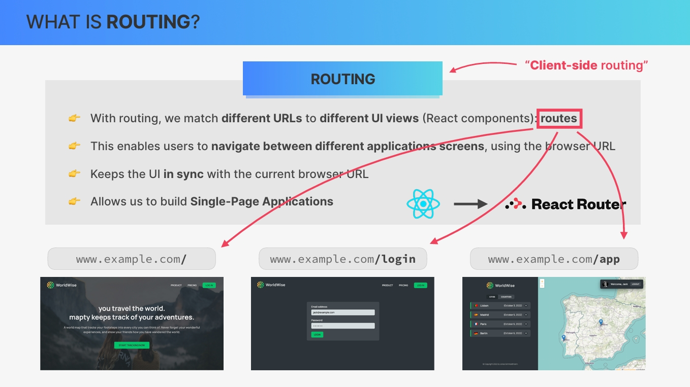
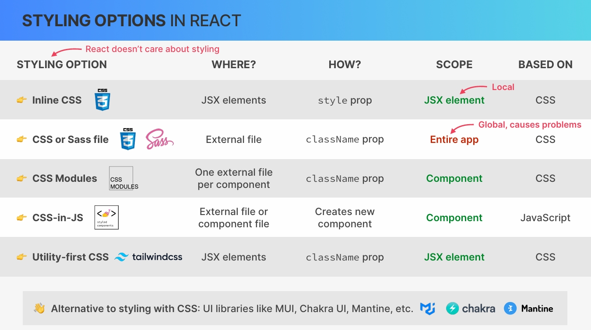

# `React Router Building Single-Page Applications (SPA)`

## `Table of Contents`

1. [Section Overview](#section-overview)
2. [Creating Our First App With Vite **WorldWise**](#creating-our-first-app-with-vite_worldwise)
3. [Routing and Single Page Applications](#routing-and-single-page-applications)
4. [Implementing Main Pages and Routes](#implementing-main-pages-and-routes)
5. [Linking Between Routes with Link and NavLink](#linking-between-routes-with-link-and-navlink)
6. [Styling Options For React Applications](#styling-options-for-react-applications)
7. [Using CSS Modules](#using-css-modules)
8. [Building the Pages](#building-the-pages)
9. [Building the App Layout](#building-the-app-layout)
10. [Nested Routes and Index Route](#nested-routes-and-index-route)
11. [Implementing the Cities List](#implementing-the-cities-list)
12. [Implementing the countries List](#implementing-the-countries-list)
13. [Storing State in the URL](#storing-state-in-the-url)
14. [Dynamic Routes with URL parameters](#dynamic-routes-with-url-parameters)
15. [Reading and Setting a Query String](#reading-and-setting-a-query-string)
16. [Programmatic Navigation with useNavigate](#programmatic-navigation-with-usenavigate)

---

## `Section Overview`

Welcome to our first real world project. So in this section, we're gonna learn and use the most important third party library that is used in almost all react projects. And that library is **React Router.** So with React Router, we are able to build applications with multiple pages that feel as fluid and smooth as the apps on our smartphones. And these are what we call Single Page Applications (SPA).

And so throughout this section we'll gain hands on experience by building this gorgeous single page application called WorldWise while also using a new way of styling react applications called **CSS Modules.** So we have a lot of ground to cover and so let's get back to work.

---

## `Creating Our First App With Vite_WorldWise`

Welcome to our biggest project yet, which is gonna be called worldWise. And what's special about this one is that **we're gonna use Vite** for the first time to set up this project instead of **create-react-app**.

Let's now actually set up a new application on our computer using Vite for the very first time.  
As always we need to open up a new terminal or a command prompt and move to the folder where we want to create that project. And so now instead of using **npx create-react-app** we will do **npm create Vite@4**. And in the future once you start building your own applications with Vite you will then use **@latest**. So to use the latest version of Vite.  

So let's just type **npm install** or just **npm i** for short. And so this will then install all the packages but it will be a lot faster than with create react app. So there's a lot less packages necessary apparently, so this is going to be a lot faster. But while this is installing and actually now it already finished but what I wanted to do now was just to take a quick look at the file structure. So we have our node modules again which will contain all the libraries necessary, so React, React DOM and a bunch of other ones that are necessary behind the scenes.  
Then we have also the public folder again, but this time index.html is actually outside that folder. So that's another small difference here. And the reason for that is simply that the developer who maintains this template here thinks basically that this is the best structure.  
Let's just take a look here at our source(src) folder. And so here we see that instead of an index.js we have this main.jsx. **So the file extension is now this jsx which as we can see down here stands for JavaScript JSX**. So it's pretty much the same as a JavaScript file but **Vite really needs this to be JSX files and not just JS files**. So here the entry point is not index.jss, but again this file called main.jsx. And notice how this one almost doesn't have any junk at all. So unlike the index.js file that we get from create react app. Alright.  
Then we also have our app.jsx file as always. This one is just a bit different, but let's just as always get rid of everything and then here I will use that snippet that we started using in the previous section to very quickly scaffold a new component. **rfc**

Here is another difference, we don't do that with **npm start**. So instead we can check out here that we have **dev** script. And so here we need to run **npm run dev**. Okay. And so that's running now successfully but notice how it actually didn't open up a new browser tab. So we need to manually do that.  

And now to finish, remember how I also told you at the beginning of the course that the **great thing about create react app is that it already comes with all the important developer tools pre installed.** And the most important one of those is by far ESLint. ESLint helped us so much and prevented so many bugs from happening. So building a React app without ESLint is a bit like coding half blinded.

So we really don't want that. And so we now need to config ESLint here in our Vite project. So again we need to do that manually each time that we set up a new project with Vite.

**`Let's then config ESLint.`**

So to configure ESLint we need to install a few npm packages. So that's ESLint itself, then the Vite ESLint plugin. And finally we also need to install all the react specific ESLint rules. So that's ESLint config react app.  
**_`npm install  eslint vite-plugin-eslint eslint-config-react-app --save-dev`_**

And next we need to actually config our project to integrate with these packages. So the first step was to install those 3 packages and the second one is to create a new file called **`.eslintrc.json`**. And so here we can basically configure the behavior of ESLint.  
And in this case what we want to do is to extend the default rules of ESLint with those react rules that we just installed.  

```json
// .eslintrc.json
{
  "extends": "react-app"
}

```

And then finally, we also need to config our Vite project with this **`vite.config.js`** file. So in this file we can configure all kinds of things about development and building of our project but here all we need to do is to now add the ESLint plugin to this array. So for that we first import that here. So import ESLint from the vite-plugin-eslint and then finally we add that here to our plugins array.

```js
import { defineConfig } from "vite";
import react from "@vitejs/plugin-react";
import eslint from "vite-plugin-eslint"; // new added

// https://vitejs.dev/config/
export default defineConfig({
  plugins: [react(), eslint()], // eslint() new added
});
```

Give it a save and that should then work.  
So with this we have vite correctly set up. It is a little bit of work but you just have to write down somewhere how it works and then do it every time. So that's not too bad especially if it's a big project that you will be working on for a long time.

But anyway with this we have our project set up and so now we can start learning about the main concepts that we will talk about in this section which are routing, single page applications, and React Router.

---

## `Routing and Single Page Applications`

So this section is all about **React Router** and **Single Page Applications**. And so let's start by understanding what these actually are.  

So **when we use routing in a web application, we basically match different URLs to different views in the user interface.** **In the specific case of React, we match each URL to a specific React component and we call each of these matches between a URL and a component a route.** **Then when one of those specific URLs gets visited, the corresponding react component will be rendered.**  
For example, we could show this homepage,(image ⤵) so this home component whenever a user visits the root URL of example.com. But when they go to slash login on the same URL, we then show the login component. And if they log in successfully we can then redirect them to the slash app path. So to show them the app screen. So in this example, we have 3 routes that the user can visit, the root URL, /login and /app, which will all render different React components.

So basically, this enables users to navigate between different screens of the application by simply using links and the URL in the browser. At the same time, routing like this keeps the user interface nicely in sync with the current browser URL, which has a couple of nice advantages that we're gonna discuss later.  

Now, this type of routing that I just described here only works this way on the client side, so in the user's browser. There is of course also routing on the server side but not in client side React applications like the ones that we have been building and that we will build in this section. But anyway, most front end frameworks have these client side routing capabilities baked right into the framework. But React is different because it relies on third party packages for many different functionalities and Routing is one of them.



**So in React, routing is usually handled by this third party package called `React Router`.** And this is probably the most important and most used React third party library out there. So if you want to learn React development, you need to learn React Router. The reason for that is that **routing is fundamental for building something that we call Single Page Applications.**

So single page applications or spas(SPAs) for short, are **web applications that are executed entirely on the client.** So only in the user's web browser. And just like we discussed before, **single page applications rely heavily on the concept of routes where different URLs correspond to different views.**  
And here (⤵see image) is how single page applications work. Whenever a user clicks on a special link provided by the router, the URL in the browser simply changes. In the case of React, this job is usually done by React Router.  
Now **changing the URL will then trigger the DOM to be updated as a result.** And in single page applications, it's always JavaScript that will update the DOM and therefore the page. u

Usually on a normal web page when we click on a link, the browser will load a completely new page and then show us that new page. But single page applications are completely different. **The page is simply updated by JavaScript which means that there will never be a complete page reload and that's the whole point of the single page application.** It's the entire app in just one page. So without any hard reloads. This makes the web application feel just like a native desktop or a mobile application, which is really a fantastic user experience.

Now going back to React, whenever the URL is changed, React router and React itself will update the DOM by simply rendering the component that corresponds to the new URL. And then, the whole cycle can be repeated as many times as necessary. So each time the user keeps clicking on a router link that will change the URL and the component that's being displayed on the screen, all without reloading the page.  
Now it's quite common that some pages need to display some external data, but that's not a problem at all. Whenever that happens, a component can just load some additional data from a server, usually from some kind of web API.  
So while the single page app itself runs entirely on the client, it can always communicate with a server in order to fetch some data that it needs, just like we have been doing before in other applications.  
**What we cannot do is to load a completely new page because then it would no longer be a single page app.** Now we could actually say that all react apps are in fact single page applications because all of them are never reloaded. Right?  
So think of all the apps that we have built up until this point. They were all apps where React updated to DOM and so they didn't have to reload ever.  
However, in a professional application that's just not enough. So big and complex applications rely on URLs and need the routing capabilities that I described in this lecture because only then they can become real single page applications.

---

## `Implementing Main Pages and Routes`

So now that we know what routing and routes are, let's use the React Router library for the very first time. So in order to implement some routes for the main pages in our application.  
So with routing we now want to **associate basically specific parts of the URL to specific components in our application.**

So to start, let's actually create the pages, So the components for the pages. And for that, I will create a new folder inside our sources and I will call this one pages. So pages is for these structural components that we will then match to these URLs.  
**And let's start with the product page**. So `product.jsx` and then let's again use that snippet to be a bit faster.  
Let's also create just a few more pages. So let's do the `homepage.jsx`. And then let's also create a pricing page, `pricing.`jsx.

Okay. And so with this we have three pages and so we can create three routes for them. And so that's what we will do next.  
Let's install our react router package. So **npm install react-router-dom@6** and then very important it needs to be the one for the dom.

**Now since react version 6.4, there are two big ways of defining routes in our code** **and we are going to use the more traditional approach which is basically to define our routes in a declarative way.** So what this means is that basically we will use a couple of special components that react router gives us to define our routes right in the JSX.

So that sounds confusing and so let's just do it. So we start by using the `BrowserRouter`.  
make sure you have imported BrowserRouter from 'react-router-dom'. So now in there we need the Routes component and again make sure that it has been correctly imported. And now finally we do the actual route definition.

So we need all of these other components here but then now we can finally use the Route component. And so this is where we define basically the URL which is called the **path prop** and then for each path of course we will be able to define one component. And here let's start with product. So the one that we already have here right now, and then here we need to define a **react element**. So not just the name of a component but really a React element which we get by using the component.

```jsx
import { BrowserRouter, Route, Routes } from "react-router-dom";
import Product from "./pages/Product";
import Pricing from "./pages/Pricing";
import Homepage from "./pages/Homepage";

function App() {
  return (
    <BrowserRouter>
      <Routes>
        <Route path="/" element={<Homepage />} />
        <Route path="product" element={<Product />} />
        <Route path="pricing" element={<Pricing />} />
      </Routes>
    </BrowserRouter>
  );
}

export default App;

```

And so let's check that out in our component tree. And so now we get all these components that we have here right inside our component tree plus a few other ones. `But mainly we have our browser router, then router, then the routes that we wrote into our code, and finally the product component.`  
So what React Router did was to take a look at the URL here, and so then it saw that we had product here. And so then it saw all these different routes that we defined here and it then selected the 1 that matches that part of the URL. And so that's product, and so then this element here will be displayed here in the UI.

Now let me just show you something here. So let's say we had some div around all of these and then here we had some h1 element with something like this:

```jsx
return (
  <div>
    <h1>Hello</h1>
    <BrowserRouter>
      <Routes>
        <Route path="/" element={<Homepage />} />
        <Route path="product" element={<Product />} />
        <Route path="pricing" element={<Pricing />} />
      </Routes>
    </BrowserRouter>
  </div>
```

So then this h1 would always stay in the all the pages.  
So if you had a part of the page that you really want to always stay the same, then this is how you would do it.  
But usually what we do is to just have our app component basically deciding which page should be displayed in the UI. It will not really have its own output. All it will do is, displaying one of the pages which is the one that matches the route(url).

Now to finish let me just show you another thing. So let's create here another page called **`PageNotFound.jsx`**, And so what we can do now is at the end, create a route with the path set to the **star**. And so this will basically catch all the routes that were not matched to 1 of these other 3. And so this is how we basically implement a page not found.  

```jsx
<Route path="*" element={<PageNotFound />} />
```

Alright. So, again, **this last route here with the star will basically be matched if none of the other routes are matched.** So this then catches like any URL that is not matched by all routes. So let's say this 1 and then we get not found which makes sense because none of our routes really match this URL here.

Great. So at this point we have basically half of the single page application. So we already have all our routes but at this point we cannot really transition from them without a page reload. So all we are doing here is to manually change the URL and then our application goes to that page. But of course that's not what we want. So you want that single page app feeling where we can seamlessly transition between pages. And so that's what we will implement in the next lecture by linking between these pages.

---

## `Linking Between Routes with Link and NavLink`

So let's now create some links between our different routes in order to really turn our application into a single page application.  
**So to start, let's say that on our homepage we want a link to the pricing page. So how are we going to do that?** Well, let's try with the most obvious idea that we might get which is to simply create an anchor element. So basically creating a link in the traditional html way.

```js
function Homepage() {
  return (
    <div>
      <h1>WorldWise</h1>
      <a href="/pricing">Pricing</a>
    </div>
  );
}

export default Homepage;
```

Let's now try to click this and see what happens. So, **it actually did move to that page, but if you watched closely, then maybe we can notice that the whole page actually reloaded.** And so this is not what we want. We don't want any hard refreshes of our page, but instead we want to seamlessly move from one page to the other simply by replacing the DOM content here on our page. So this is not what we want.

So let's get rid of it. **And instead, we will now use the Link element that is  provided by React Router.** So let's do that and let's make sure that it's got imported. And now here we can use the **to prop**. And so this is where we then specify /pricing. And it's important that we specify the slash, so that our URL always starts from the root. So basically we get root slash pricing.  
Okay. So let's go back and let's reload here. And now watch what happens as we click here down there. We moved to another page and we got no new requests except this SVG here for some reason (see in dev Network tab), but that really doesn't matter. So the only thing that really happened was that our DOM got replaced. And we can also see that nicely in our component tree now. So let's go back. So now we have our homepage and as I click here notice that the only thing that changed was that immediately here or component tree changed.

```jsx
import { Link } from "react-router-dom";

function Homepage() {
  return (
    <div>
      <h1>WorldWise</h1>
      <Link to="/pricing">Pricing</Link>
    </div>
  );
}

export default Homepage;
```

Okay. And so that's how we use the link component from React Router to seamlessly transition between pages, making this now a single page application.  

**Great. So we can move now from the homepage to the pricing page, but what about all other pages?** Well, **let's just implement a page navigation which we can then reuse in all these pages so that we can transition between them.**  
So that's going to be a new component but not a new page. And so let's come here and create a new folder called components. And so this is where we will then create our **PageNav.jsx** component.

```jsx
// PageNav.jsx
import { Link } from "react-router-dom";

function PageNav() {
  return (
    <nav>
      <ul>
        <li>
          <Link to="/">Home</Link>
        </li>
        <li>
          <Link to="/pricing">Pricing</Link>
        </li>
        <li>
          <Link to="/product">Product</Link>
        </li>
      </ul>
    </nav>
  );
}

export default PageNav;
```

So let's include this in all of the pages.

```jsx
function Homepage() {
  return (
    <div>
      <PageNav />
      <h1>WorldWise</h1>
    </div>
  );
}
export default Homepage;
```

And now, yeah, beautiful. So we can really now seamlessly navigate through our application and nothing reloads and it feels just really nice.  

Now one thing that we do many times in navigation like these, is to display which is the currently visited page. So for example, highlighting right now the pricing page since this is the page that we are visiting.  
And so actually React Router gives us a tool for that. So instead of using **Link**, we can use the **NavLink** element.

**And so now it works exactly the same thing as before but if we inspect this element then we see that the currently active page gets class of active.** **And so then in our CSS we can select this class and style this element differently.**  
Now, for now we don't have any CSS yet because we will learn how to use a different way of incorporating CSS into a project this time. But later once we have that then we will be able to style this active class. And speaking of CSS that will actually be the topic of our next lecture. So how we can use different ways of CSS in our applications. And so let's move there right now.

```jsx
// PageNav.js component
import { NavLink } from "react-router-dom";

function PageNav() {
  return (
    <nav>
      <ul>
        <li>
          <NavLink to="/">Home</NavLink>
        </li>
        <li>
          <NavLink to="/pricing">Pricing</NavLink>
        </li>
        <li>
          <NavLink to="/product">Product</NavLink>
        </li>
      </ul>
    </nav>
  );
}

export default PageNav;

```

---

## `Styling Options For React Applications`

One important part of building web applications is of course to style them with CSS. Now up until this point, we have always just included a **global external CSS file** into our applications and then used the class names from there in our JSX. However, in this project we will do something a bit different, which is to use CSS modules.  

But before we do that I want to take a minute to quickly explore all the different options that we can use to style react applications because there are actually a lot of them. **But first you might be wondering, why are there actually so many different ways of styling a React app?**  
Well, it's because one fundamental philosophy of React is to be an opinionated in regards to many common aspects of building web applications. And so one of them is styling. So React really doesn't care about how you style your applications. And so as a result, we have lots of different styling options, most of them being provided by 3rd party libraries.

### `Styling Options`

1. So the first option is one that we have used a few times in the beginning which is to **simply apply some inline CSS to JSX elements using the style prop.** And this is actually more common in React than in regular HTML because of React's idea of separation of concerns. Now an inline style is scoped to the particular JSX element that it's applied to, which means that it is locally scoped. So it applies only to that exact element.  
2. Now we have also multiple times **included an external CSS file and then simply applied the CSS classes using the className prop.** And the same would actually also have worked for a Sass file. Now in this case, **our styles are actually global** which means that every single JSX element in the entire application could use any of these classes in the external CSS file. And this can create huge problems, especially in big projects.  
    For example, because you won't know which components are using which classes. And when you then update 1 of the classes it will have repercussions in other components. Or when a developer adds a new class with a name that already exists that will create clashes between those two classes. So basically global CSS is a nightmare in large apps. **So in professional projects, CSS is almost never global.** Instead, CSS should be scoped to an individual component which brings us to the next styling options which is CSS modules.  
3. **CSS modules are pretty similar to regular CSS files with the difference that we write just one CSS file for each of our components.** **The styles in that file will then be scoped to only that component so that no other component can use them.** And this then makes the components way more modular and reusable. And at the same time it better reflects react separation of concerns. And in fact, this is exactly what we will do in this project.
4. Now if we want to take it even one step further we can go with **a CSS in JavaScript library like styled components.** So as the name says, with CSS in JavaScript, we actually write our CSS inside a JavaScript file. So in the same file where we define our components. What's special about a CSS in JavaScript library is that **it allows us to create React components that have our styles directly applied to them,** which we can then use just like regular components. So this fully embraces the React philosophy that a component should contain all the information about its appearance. And so that includes CSS.
5. And finally, **we can also use a utility first CSS framework like `tailwind`,** which is getting more popular every day.  
    So in tailwind you use predefined utility classes to define individual styles, to use flexbox, to make layouts responsive, to make hover effects, and really to design your entire UI and all that without ever having to leave the JSX markup.
6. Finally we do actually have one more option here **which is basically to not write any CSS at all.** Wait, what? No CSS? **Well, it is actually possible because we can build our entire project using a fully fledged UI component library,** for example, like `Material-UI`, `Chakra-UI` or `Mantine`.  
    So essentially a component library like those contains all kinds of pre built and pre styled components that are common in most web applications. This is however not ideal for beginners, but again it might be worth exploring later.



---

## `Using CSS Modules`

Let's now learn all the fundamentals of CSS modules that we need, which is actually really easy.  
So luckily for us, CSS modules already come out of the box both with create react app and Vite. So there's nothing to install in order to make CSS modules work. Now as we just learned in the previous lecture, what we do with CSS modules is to create one external CSS file per component.

So let's do that  for PageNav.js component. So right in the components folder, we will create a new file. And now this file needs to follow the convention of the name of the component, so PageNav and then the important part is that we add dot module dot css, like this: **`PageNav.module.css`** And so this is now the CSS module for the PageNav component. And so now here we can define some classes. So let's for example create a nav class. Now here really we need to define class names. **We cannot use the element selector like ul, li etc.**

```css
/* PageNav.module.css file */
.nav {
  display: flex;
  justify-content: space-between;
}

/* ul {
  list-style: none;
} */ /* This will not going to work. */
```

Now if we save this then you see that of course nothing changed here for now and that's because we still need to import and use these class names now in our markup. So we have to connect these two files by basically importing these styles into this PageNav component. And then as usual, we add these classes that we defined to our elements. **All the classes that we define in the module are basically exported into one big object that we can then use. And usually we call that simply styles.**  
And so now this nav class that we defined in css module is available on **styles.nav**, so on styles object. And so, to add that class, we need to enter JavaScript mode then use `styles.nav.`

```jsx
import styles from "./PageNav.module.css";

function PageNav() {
  return
    <nav className={styles.nav}>
}
```

And for some reason it seems like the styles here have actually been applied on ul as well. So this does work but it's a really bad idea because this will then select all the ul elements on the entire application which defeats the whole purpose of CSS modules where this styles, so these classes are supposed to only be applied to this component. **So never use the normal element selector but here instead, we will now basically select all the unordered lists that are inside our nav class. `.nav ul`**

Now notice how here in dev tool we got this really weird class name. And so this is what CSS modules does. So they take our class name that we defined ourselves and then they attach a random ID to the end. And so if we then create another nav class in some other CSS module that will get a different random ID. And so then these are in the end different classes again.

**And so now let me show you how this can really avoid naming clashes.** So a problem where we or another developer on the team might accidentally create a new class name that already exists which might then mess up all the other ones. So the other elements that use that class name. So that's a common problem when we use global CSS like we have been doing. So let's now avoid that. And in order to do that, let's first create a new page, which will be called AppLayout.js, so this will basically be for the main application where we have that list on the left side and the map on the right side. So let's then add another route for that page right in the App file.

```js
<Route path="app" element={<AppLayout />} />
```

So now we have another route working in our application and now let's also create a navigation for this app. So that's going to be a new component and so let's call this one the `AppNav.jsx` and let's right away also create the CSS module. So `AppNav.module.CSS`. Alright.

What I really wanted to do now was to create another class with exactly the same class name as we have in the other navigation. So I will now again create a nav class and this one will have a background color of purple.

And by the way, here we could also immediately destructure the styles object, to extract our classes. -NOT RECOMMENDED

```css
/* AppNav.module.css */
.nav {
  background-color: rebeccapurple;
}
```

```jsx
// AppNav.jsx
import styles from "./AppNav.module.css";
// import { nav } from "./AppNav.module.css";

function AppNav() {
  return <nav className={styles.nav}>App Navigation</nav>;
}

export default AppNav;
```

**And now let's talk about global CSS** because sometimes we of course do need some CSS that is really global, like a global reset or setting some font properties on the body. So some stuff that we usually do in a CSS file. And so for that, we can actually keep including an external CSS file like we have been doing all this time. So to do that, let's grab index.css file from starter folder and paste it into src folder as usual. And include our CSS file right into main.jsx.

**So this global file has are basically the definition of the CSS variables which are going to be global and these resets but no class names anywhere to be seen.**

But anyway, what I want to do now here at the end since we are already speaking about global CSS is to show you **how we can define some more global CSS also inside CSS modules.**

```css
/* In PageNav.module.css */
.test {
  background-color: red;
}
```

**So let's say that we wanted a test class, which for some reason we wanted to include into our Homepage but without importing this module.**

```jsx
// In Homepage.jsx
<h1 className="test">Home Page WorldWise</h1>
```

So this really wouldn't work right now because as we already know this class that we just exported from the CSS module is now prefixed or actually it get added to the end with random id , right? And therefore, our homepage here cannot read just the test class. So that's the whole reason why we have to export our classes into the styles object and then use it. But again, let's say that now we wanted to use it as regular css class, so basically we want to create a global test class. We could do that like this:

```css
/* PageNav.module.css */
:global(.test) {
  background-color: red;
}
```

So we could do this by using this global function and then wrapping our selector in there. And so now as we save this then this test class gets global as the name says. And so now our h1 here can access the test class without that weird string attached to it in the end. Now this is not really helpful but it was important to show you how this global function works because now **we can use this in order to style the active link** like we have been talking about before that active link will get the `active` class, So remember how the page that is currently active gets the active class attached to it.

So like this. Now if we were trying to do this, .nav and then selecting the active class in there this wouldn't work. like this:

```css
.nav .active{
  background-color: green;
}
/* will not work, as this active will get random id at the end */
```

And so you see that indeed it has the active class name but it doesn't work. And so that's because again CSS modules will see this class from our css module and it will then add that random string to it.nAnd so then that class will be different from that one that got automatically.  
And so the solution to that in a case like this is to use global. And now that works. So now we get our green background.

```css
.nav :global(.active) {
  background-color: green;
} 
/* will work */
```

So this global function is usually mostly important when we are working with some classes that are provided from external sources. So in this case, the active class is given to us by
React Router. And so then if we want to style that we need to use this global thing. So otherwise, if we just want to define some global classes we wouldn't do it inside a module but just inside our global CSS file.

Alright. And so this is actually all that I wanted to show you about CSS modules. **There's also something else which is called `composing classes`** but I think that's not really important. So we're not going to talk about that here because this is really all you need to know in order to effectively use CSS modules in your own projects and of course also in this one.

---

## `Building the Pages`

So now that we know the fundamentals of both the technologies that we're gonna use in this project, so that's React Router and CSS modules, we are now ready to build the actual pages of the application. And so let's now go do that.  
And what I mean by actual pages are, Homepage, Product Page, Pricing Page, and Login Page.

let's also grab 4 images and drag them into the public folder. So just like we have been doing before, we will use images from the public folder, not from this assets folder that we also have inside the sources folder. So the **assets folder is, to be directly imported into our JavaScript code.**

So our homepage now looks like this, by getting starter file. `Homepage.jsx` and `Homepage.module.css`.

```jsx
// Homepage.jsx [Starter File]
import styles from "./Homepage.module.css";

export default function Homepage() {
  return (
    <main className={styles.homepage}>
      <section>
        <h1>
          You travel the world.
          <br />
          WorldWise keeps track of your adventures.
        </h1>
        <h2>
          A world map that tracks your footsteps into every city you can think
          of. Never forget your wonderful experiences, and show your friends how
          you have wandered the world.
        </h2>
      </section>
    </main>
  );
}

```

```css
/* Homepage.module.css */
.homepage {
  height: calc(100vh - 5rem);
  margin: 2.5rem;
  background-image: linear-gradient(
      rgba(36, 42, 46, 0.8),
      rgba(36, 42, 46, 0.8)
    ),
    url("../bg.jpg");
  background-size: cover;
  background-position: center;
  padding: 2.5rem 5rem;
}

.homepage section {
  display: flex;
  flex-direction: column;
  height: 85%;
  align-items: center;
  justify-content: center;
  gap: 2.5rem;
  text-align: center;
}

.homepage h1 {
  font-size: 4.5rem;
  line-height: 1.3;
}

.homepage h2 {
  width: 90%;
  font-size: 1.9rem;
  color: var(--color-light--1);
  margin-bottom: 2.5rem;
}

```

Alright, let's now complete this Homepage and add a button down to the h2 tag. So this button or this link actually should take us to the App page. So to the AppLayout component. And so this should be a link. So one of those links from React router. So again, this will take us to the App page and here actually we are now using a global className which is the **cta** class And then `Start tracking now`.

```jsx
import Link from 'react-router-dom';
<Link to="/app" className="cta">
  Start tracking now
</Link>
```

And then of course we need to bring in the link from React Router dom. And so now that works. So this global className(cta)⤴, is located in our index.css file.

So next up, let's take care of the Logo. Which is actually part of the entire navigation. So in the Homepage we now want to get back that navigation **`(AppNav)`** that we already started to build.

Let's now open up the AppNav component because this is going to be our next task that we need to work on. So building now this page navigation and actually this is already looking pretty well. So what we should do is to add another nav link here for the login page. So this one will move us to the login page and then actually in our real app here, we don't have a link for the homepage.  
But instead, that Homepage will open as we click on this Logo. So let's remove this 1 here and then let's bring in the logo that we already have once again in our starter components.

Beautiful! There it is. So our navigation is working fine. We didn't include it here yet but it is working. **But now the only thing that we need to do is to actually include a link in the Logo.** Right now we see that it's not a link yet, and so let's open up the Logo by clicking here on this component. So command or control clicking. So here we return this image as we see. And so let's just wrap this img into a Link. **So this link coming, of course, from React Router.**

```js
// Logo.jsx
import { Link } from "react-router-dom";
import styles from "./Logo.module.css";

function Logo() {
  return (
    <Link to="/">
      ;
    </Link>
  );
}

export default Logo;
```

And so this time⤴ we are actually using a Link and not a NavLink because we don't want to add any special styles when this is selected. So that's really not necessary here. And so with this we finish our logo.  
Now let's open up these other pages and add this navigation(PageNav) there as well. So that's the `Login page`, the `Pricing page`, and the `Product page`. So all these pages will get that navigation.

```css
a.ctaLink:link,
a.ctaLink:visited {
  background-color: var(--color-brand--2);
  color: var(--color-dark--0);
  padding: 0.8rem 2rem;
  border-radius: 7px;
}
```

And notice here we are using basically the JavaScript way of writing the variable to define a CSS class, instead of the normal CSS way which would be like, cta-link

```jsx
// PageNav.jsx
import { NavLink } from "react-router-dom";
import styles from "./PageNav.module.css";
import Logo from "./Logo";

function PageNav() {
  return (
    <nav className={styles.nav}>
      <Logo />
      <ul>
        <li>
          <NavLink to="/">Home</NavLink>
        </li>
        <li>
          <NavLink to="/pricing">Pricing</NavLink>
        </li>
        <li>
          <NavLink to="/product">Product</NavLink>
        </li>
        <li>
          <NavLink to="/login" className={styles.ctaLink}>
            Login
          </NavLink>
        </li>
      </ul>
    </nav>
  );
}

export default PageNav;
```

```jsx
// App.jsx
import { BrowserRouter, Route, Routes } from "react-router-dom";
import Product from "./pages/Product";
import Pricing from "./pages/Pricing";
import Homepage from "./pages/Homepage";
import Login from "./pages/Login";
import AppLayout from "./pages/AppLayout";
import PageNotFound from "./pages/PageNotFound";

function App() {
  return (
    <BrowserRouter>
      <Routes>
        <Route path="/" element={<Homepage />} />
        <Route path="product" element={<Product />} />
        <Route path="pricing" element={<Pricing />} />
        <Route path="/login" element={<Login />} />
        <Route path="app" element={<AppLayout />} />
        <Route path="*" element={<PageNotFound />} />
      </Routes>
    </BrowserRouter>
  );
}

export default App;
```

---

## `Building the App Layout`

Next up, let's build the static layout of the main application screen.

Let's now open up our `AppLayout.jsx` file so that we can now start working on this part. So basically what we want to achieve in the end is to having the Sidebar here and the Map. And so basically we will now create these two components first. So let's do that here inside our components. So Sidebar.jsx and Map.jsx.

```jsx
// Sidebar.jsx
import styles from "./Sidebar.module.css";
import Logo from "./Logo";
import AppNav from "./AppNav";

function Sidebar() {
  return (
    <div className={styles.sidebar}>
      <Logo />
      <AppNav />

      <p>List of cities</p>

      <footer className={styles.footer}>
        <p className={styles.copyright}>
          &copy; Copyright {new Date().getFullYear()} By WorldWise Inc. All
          rights reserved
        </p>
      </footer>
    </div>
  );
}

export default Sidebar;
```

Let's now come to AppLayout.jsx and include the Sidebar there.

So we need to import css module again but now let me show you an easier way. So by using a snippet. So come to our index.css file where I placed this snippet code for you. Let's paste that code and so now we will have a snippet which we can use with this prefix of **`csm`**. So that stands for CSS Modules and that will then automatically import those styles for us.

Alright. So let's then build Map And for now here we will just write map and then also use some more styles. So our snippet, csm, and you see this makes it really a lot faster. So then it is **mapContainer** class and then let's include this right in the AppLayout.jsx

```jsx
// Map.jsx
import styles from "./Map.module.css";
function Map() {
  return <div className={styles.mapContainer}>Map</div>;
}
export default Map;
```

```jsx
// AppLayout.jsx
import Map from "../components/Map";
import Sidebar from "../components/Sidebar";
import styles from "./AppLayout.module.css";

function AppLayout() {
  return (
    <div className={styles.app}>
      <Sidebar />
      <Map />
    </div>
  );
}
export default AppLayout;
```

So I usually like having the pages without much stuff in them so that most of the code is actually inside my components folder.

---

## `Nested Routes and Index Route`

So let's now move back to React router and learn about probably the most confusing part of declaring routes which are nested routes.  
**So we need nested routes when we want a part of the user interface to be controlled by a part of the URL.** So in this case we have cities or countries in the url, and according to the url we display cities or countries in sidebar. Also when we click on map the url (place of cites) is changing and as a result we got a form in sidebar. So nested routes are basically to implement exactly this behavior. So where we show a part of the UI based on some part of the URL.

Note how nested routes are not simply routes which are made up of multiple parts like /app/cities. So just because we have a longer path with these 2 parts this doesn't make it a nested route. Instead, this is actually a nested route because this path(/cities) influences what component is rendered inside the aside nav component.  

Okay, And so now let's do that in our code in our own application. So we want to now declare a couple of nested routes, and we do that basically inside a route element, in App.jsx, here we will do nested routes.

```jsx
<Route path="app" element={<AppLayout/>}/>
```

Let's transform this⤴ to a nested Route

```jsx
<Route path="app" element={<AppLayout />}>
  <Route path="cities" element={<p>List of cities!</p>} />
  <Route path="countries" element={<p>Countries</p>} />
  <Route path="form" element={<p>Form</p>} />
</Route>
```

Just doing like this we created a nested route. With this for now we are done. So we have defined three child routes of this app route.

But now where are these elements( all p tags for different routes) actually going to be displayed in the UI? **Or in other words, how are we now actually going to display one component or one element inside another component?**  
Well, that's where the Outlet component provided by React Router comes into play. So where do we actually want to display these elements (p tags for now)? Well, they should be inside the Sidebar. So right in that component we are now going to use that Outlet element.  **`<Outlet />`**

```jsx
// Sidebar component
import styles from "./Sidebar.module.css";
import Logo from "./Logo";
import AppNav from "./AppNav";
import { Outlet } from "react-router-dom";

function Sidebar() {
  return (
    <div className={styles.sidebar}>
      <Logo />
      <AppNav />

      <Outlet />

      <footer className={styles.footer}>
        <p className={styles.copyright}>
          &copy; Copyright {new Date().getFullYear()} By WorldWise Inc. All
          rights reserved
        </p>
      </footer>
    </div>
  );
}

export default Sidebar;
```

And there it is. So if we put /cites like this <http://localhost:5173/app/cities> then there is our list of cities paragraph that we defined right in nested route in App.jsx.

This paragraphs are render into the Outlet element, this is actually pretty similar to the children prop, which we use whenever we pass some element inside another element in JSX, but with Outlet  we are not using elements but routes. So of course the children prop is not going to work but instead we use something similar which is the **Outlet element.**

Okay. But what happens when we just put the /app alone, so without specifying any of the nested routes. Here inner sidebar is empty which is not what we want. Instead we want, when we come just to /app then we want to show by default the city list.  
**So we can actually do that with something called an `index route`.**

**An index route is basically the default child route that is going to be matched if none of other nested routes are matches.**

```jsx
<Route index element={<p>LIST of Cities</p>} />
```

And we could actually do the same thing with our homepage.

```jsx
<Route path="/" element={<Homepage />} />

// Change the above line to ⤵

<Route index element={<Homepage />} />
```

Now we want to implement AppNav component to go into different routes

Now if we think about this then what we just implemented here is actually very similar to something like a tabs component, but implemented in a very different way. So before if we wanted to implement a tab component where we have these tabs here and then the content changes according to which is the active tab, we would have implemented that using the useState hook to manage the currently active tab.  
But here with react router, we do the same thing but in a very different way. So instead of using the useState hook to manage state, we basically allow react router and the URL to store that state of the active tab. And so then whenever this URL here changes then we change which tab is currently active.  
So React Router is a whole new way of thinking about how we build an application. Now, of course, that doesn't mean at all that all we have learned before is useless.  
So we still build components like accordions or tapped components using the useState hook all the time. But from now on the overall navigation of the application is in the real world always managed by something like React router.

---

## `Implementing the Cities List`

Now it's time to load our city's data from a fake API again and then to actually render that data into the UI.  
Use **csm snippet**, to import CSS module.

```jsx
// CityList component
import styles from "./CityList.module.css";

function CityList() {
  return <ul className={styles.cityList}>LIST</ul>;
}

export default CityList;
```

```jsx
// using CityList in App.jsx
 <Route path="app" element={<AppLayout />}>
  <Route index element={<CityList />} />
  <Route path="cities" element={<CityList />} />
  <Route path="countries" element={<p>Countries</p>} />
  <Route path="form" element={<p>Form</p>} />
</Route>
```

Next up, let's actually set up our fake API again so that we can then fetch our city data from there. And so just like in the previous section for that we will **install the `json-server` package**. And then inside a package.json file add a new script to run and start json-server from console/terminal.  
This time we also want to add an artificial delay so that it looks as if the API always takes half a second to actually fetch the data.

```json
npm install json-server

"serve": "json-server --watch data/cities.json --port 3001 --delay 500"

// Delay is only available on version 0.17.3 
npm i json-server@0.17.3
```

Now check this url: <http://localhost:3001/cities>  
We see the cities. And so here are three cities that we can now load into our application using the fetch function just like before.  
So where are we going to do that? Well, we could do it right here in the CityList because this is where we will first need this data, but we will later on also need this data in some other places. We need it also in countries. So countries will be derived from all the cities. And finally, we also need it to display markers in the map. So each city gets its own marker with some data of the city, and so then there we will need that data again. And so let's just place that data for now at least in the App component.

---

```jsx
// in App.jsx, Pretty standard stuff that we have been doing all the time.

const [cities, setCities] = useState({});
  const [isLoading, setIsLoading] = useState(false);

  useEffect(function () {
    async function fetchCites() {
      try {
        setIsLoading(true);
        const res = await fetch(`${BASE_URL}/cities`);
        const data = await res.json();
        setCities(data);
      } catch (err) {
        alert("There was an error loading data...");
      } finally {
        setIsLoading(false);
      }
    }
    fetchCites();
  }, []);
```

So this is pretty standard stuff that we have been doing all the time here. Okay. And so right now this should already been working at the very beginning. So when we first load our application.

And now we want to pass that data so that there we can show a loading spinner or we can show then the data itself. So let's do that. And so now we see the advantage of why here we need to use an element and not a component because now we can very easily pass in that data. So cities will be cities and then isLoading equals isLoading.

```jsx
<Route
  index
  element={<CityList cities={cities} isLoading={isLoading} />}
/>
<Route
  path="cities"
  element={<CityList cities={cities} isLoading={isLoading} />}
/>
```

And now the first thing that we want to do is to if isLoading then we want to just return a spinner here.  
But otherwise we want to of course render this list. And so as always what we do is to take our cities and then map over them. So pretty standard stuff.

```jsx
import Spinner from "./Spinner";

import styles from "./CityList.module.css";
import CityItem from "./CityItem";

function CityList({ cities, isLoading }) {
  if (isLoading) return <Spinner />;
  return (
    <ul className={styles.cityList}>
      {cities.map((city) => (
        <CityItem city={city} key={city.id} />
      ))}
    </ul>
  );
}

export default CityList;
```

Now let's take care of the CityItem themselves.

So here let's actually use the time HTML element. And so then here the date and actually let's format this date a little bit because like this it doesn't look really nice and I think we have a function for that already here in the city component.

```jsx
import styles from "./CityItem.module.css";

const formatDate = (date) =>
  new Intl.DateTimeFormat("en", {
    day: "numeric",
    month: "long",
    year: "numeric",
  }).format(new Date(date));

function CityItem({ city }) {
  const { cityName, emoji, date } = city;
  return (
    <li className={styles.cityItem}>
      <span className={styles.emoji}>{emoji}</span>
      <h3 className={styles.name}>{cityName}</h3>
      <time className={styles.date}>({formatDate(date)})</time>
      <button className={styles.deleteBtn}>&times;</button>
    </li>
  );
}

export default CityItem;
```

And now to finish let's just take care of the situation in which there is no cities yet. So imagining that the user uses the application for the very first time then there will be no data yet. And so let's change that right in the CityList component. So we can do some more conditional rendering.

So if cities.length is nonexistent then let's return some other component that I also already included which is this Message component. So this is just a presentational component which all it does is to receive a message string and then it displays that nicely in the UI with the emoji right there.

```jsx
if (!cities.length)
  return (
    <Message message="Add you first city by clicking on the city on the map" />
  );
```

---

## `Implementing the countries List`

Let's now quickly build the list of all the countries that the user has already visited. So basically we need to filter out the duplicate countries, b/c may a a user visited two countries from the same country.

But now let's take care of that where we will derive countries from the cities array. Now the idea is basically to create a new array which only contains the ones where the city name is unique. And so for complex operation like this I many times like to reach for the reducer method.  

```jsx
// in CountryList.jsx
const countries = cities.reduce((acc, city) => {
  if (!acc.map((el) => el.country).includes(city.country))
    return [...acc, { country: city.country, emoji: city.emoji }];
  else return acc;
}, []);
```

And there we go. So now only the 3 countries here that are unique basically remained right here in the array. So this is just a common JavaScript here, has nothing to do with react development. So that's why we don't need to go deep into how this code works. So basically all this does is to as it loops over the city array it keeps constructing the countries array which starts at 0, so completely empty. And so then in each iteration it asks if this array here already includes the current city. So the city that is currently being looped over. And if not, well then we basically add a new object to that array which contains the current country and the emoji.

```jsx
import Spinner from "./Spinner";
import Message from "./Message";

import styles from "./CountryList.module.css";
import CountryItem from "./CountryItem";

function CountryList({ cities, isLoading }) {
  if (isLoading) return <Spinner />;

  if (!cities.length)
    return (
      <Message message="Add you first city by clicking on the city on the map" />
    );

  // list of countries by using reduce method, i also need country name and emoji from city:
  const countries = cities.reduce((acc, city) => {
    if (!acc.map((el) => el.country).includes(city.country))
      return [...acc, { country: city.country, emoji: city.emoji }];
    else return acc;
  }, []);

  return (
    <ul className={styles.countryList}>
      {countries.map((country) => (
        <CountryItem country={country} key={country} />
      ))}
    </ul>
  );
}

export default CountryList;
```

---

## `Storing State in the URL`

Now it's time to take the usefulness of React Router to the next level by actually storing state in the URL so that we can use it in different places of the application.  
But you might be wondering, storing state in the URL, don't we actually use the useState hook to manage state? Well, that's true most of the time but the URL is actually also an excellent place to store state and especially UI state.  
**And with UI state, I mean state that affects what the UI looks like. So things like an open or close panel or a currently applied list sorting order or filter.** So these examples of state are great candidates to be stored in the URL and basically to be managed by the URL with React Router.

**Now, why would we want to do that?** And that's again an excellent question.

- So the first reason is that placing state in the URL is an **easy way to store state in a global place that is easily accessible to all components in the app.**
    So before, if we wanted state to be accessible everywhere we would have to store it in a parent component and then pass it all the way down to all child components using props. But if we place state in the URL we can easily just read the value from there wherever the component is in the component tree. So basically we can move some state management from react to the URL.
- Also placing state in the URL is in many situations a **good way to pass data from one page into the next page without having to store that data in some temporary place inside the app.**
- And finally, another amazing reason why we should place UI state right in the URL is that doing so **makes it possible to bookmark or to share the page with the exact UI state that the page had at the time that we are sharing or bookmarking it.**  
    For example, in an online shop we might be filtering products by color and by price. And if that filter is saved in the URL, we can then share the page with someone and they will see the exact same filters applied to the list of products. So that's really helpful and enables a great user experience.  

Okay. But enough talking, let's see how we can actually do this using React router.

<http://example.com/app/cities/lisbon?lat=38.343&lng=-8.9834>  
So in a URL like this, we have path like /app/cities/, that we already now, But for actually storing state in the URL we use **params** or the **query string**.  
Now params which stands for parameters are very useful to pass data to the next page while the query string is useful to store some global state that should be accessible everywhere.


But to understand this a bit better, let's look at this example in more detail. So this URL that we just looked at corresponds to this view(see in picture ⤵). And in the URL you see that the param is Lisbon. And so because of that the page that was loaded is exactly about the city of Lisbon.

So, by creating a link that points to a URL with this param, we are able to pass the city name to the next page whenever the user clicks on that link. And of course if the URL had another city name as the param, let's say Berlin, then the loaded page would be about Berlin. And so that's the power of params, but there is more because we also have the query string and it works in a very similar way. So in this example, we store the lat and lng pieces of state in a query string which correspond to disposition on the map. And the same is true of course for the other URL.  


So each of these cities has of course a unique location and that location is reflected right in the URL. And so in this example, we leveraged the power of the URL to manage state in an effective way by reading the city name and the GPS location from the URL instead of using application state inside React.

---

## `Dynamic Routes with URL parameters`

So let's now use react router params in order to pass some data between pages. So just like we have learned in the previous lecture.

We'll have a url like this: /app/cities/478373j4, so the id of clicked city.  
So we have app slash cities and then slash the ID of the city. And if we go to another one then the ID changes. And so if I now click on this link then the component down used that URL to fetch the data about the city from the fake API. And so that's what I mean by passing data from one page to the other.

So in this case we passed the ID of the city, from one component to the other, without storing that data somewhere inside the React application which we would have to do without React Router.

**let's Implement this in our Application**  
To use **params** with React Router we basically do it in 3 steps. `First` we **create a new route**, `then` we **link to that route**, and `then` in that route we **read the state from the URL**. So that's just a high level overview, and so let's now do all of these steps one by one.

1. `Crating new Route`

    And so first we create a brand new Route. So a new route with a **path of cities and then slash colon and then whatever name we want to give the parameter**. So let's call it id in this case.  **_`path="/cities/:id"`_**

    ```jsx
    <Route path="cities/:id" element={<City />} />
    ```

    So this was the first step which was to create a route with this path linked to this city component.

2. `Link the URL`  
    Now next up as the second step we actually need to link this url/route that we created now. So we want to link with each city item, So let's come to CityItem. And so now inside of each list item element we will actually place a link. So one of these special <Links></Links> that comes from React router.

    Now let's add the **to prop** where we put the link, so where we want to send the data. So let's create a template literal and then all we want here is actually the city ID.

    ```jsx
    function CityItem({ city }) {
      const { cityName, emoji, date, id } = city;
      return (
        <li>
          <Link className={styles.cityItem} to={`${id}`}>
            <span className={styles.emoji}>{emoji}</span>
            <h3 className={styles.name}>{cityName}</h3>
            <time className={styles.date}>({formatDate(date)})</time>
            <button className={styles.deleteBtn}>&times;</button>
          </Link>
        </li>
      );
    }
    ```

    Now, as we click one of the city then it actually moves and here we get the URL with the id of clicked city. So we get that ID inside the cities slash ID URL exactly like we have defined. like this:⤵

    ```url
    // CORRECT
    <Link className={styles.cityItem} to={`${id}`}>
    http://localhost:5173/app/cities/17806751

    // NOT CORRECT
    <Link className={styles.cityItem} to={`/${id}`}>
    http://localhost:5173/17806751
    ```

    **`And it's really important that here we only pass in the ID because in this format this will then simply add it to the current URL. <Link className={styles.cityItem} to={`${id}`}> While if we started this with a slash like: to={`/${id}`}, then it would simply go to the root URL slash the ID. So that's not what we want. We want to basically attach this ID here to the end of the URL that we already have.`**

3. `Read the data from the URL`  
    Now in the 3rd step we can then read the data from the URL into the component. And with that we will then finish this entire cycle. So let's come into the City component and then in order to get that data from the URL we use the **`useParams hook`**, which is once again provided to us by react router. So it needs to be included here and so this will then return something to us. So let's just call that x for now and then I want to console dot log dot x. So we got this object with the id. like this: {id: '73930385'}  
    And the reason why this is called id is because that's the parameter name that we gave it in Link to **to prop**. And so then here in the component where we consume this data from the URL we usually immediately destructure that. _const { id } = useParams();_

    Nice. So we just learned how to use this very important tool of react router that are params.

**`QUICK RECAP`**  
So let's quickly recap. So we created a new route. Anyway here we specify the name of the param and as always the element that should be rendered when the URL matches this path. Then we basically link to this route. So we create a link that we can actually move to this page in our application and we did so by passing in this data. So this ID of each city and then as a final step we read that data from the URL using **useParams** hook.

---

## `Reading and Setting a Query String`

And now let's learn how to use the second way of storing state in the URL, which is the **query string**.  
And so in this lecture, I want to do exactly what I showed you in that slide 2 lectures ago. So where we added the position of the current city right to the URL as a query string. So adding that data to the query string is actually really, really easy. All we have to do is to add it to the path that the user will go to when they click on the link.

So we are in the CityItem component which gets access to the current city. And each of the city gets also access to a position object. It contains the latitude and the longitude. And so let's now add the latitude to our string. So we are building this URL. So we already have the ID and now we need the question mark and then the name of the state variable that we want to share, basically.

```jsx
<Link
  className={styles.cityItem}
  to={`${id}?lat=${position.lat}&lng=${position.lng}`}
>
```

Now the state that we had inside our application was now transferred to the URL. So we have both the latitude and the longitude right now in this globally accessible URL. And so it is as if this data is now global state which we can access from everywhere.  
So that includes for example the Map component. So let's now move to the Map component which we already created earlier. And so in there let's now try to read this latitude and longitude data from the URL. **And so for that we use the use search params custom hook that React Router gives us.**

So here it is, `useSearchParams` and this one is a bit similar to React's useState hook. So it returns an array which has basically the current state which we usually call the searchParams. And then second we get a function with which we can set the searchParams.

```jsx
const [searchParams, setSearchParams] = useSearchParams();
```

And now let's try to store first the latitude into this lat variable because this data is actually not directly accessible on the searchParams. So it's not like an object that gives us this data here instead it's an object onto which we need to now call the **get** method. **So get and then the name of the variable itself**. So let which is exactly this name right in the url. So this needs to match this.

```jsx
const [searchParams, setSearchParams] = useSearchParams();
const lat = searchParams.get("lat");
const lng = searchParams.get("lng");
```

And so basically with this by clicking on one of these links in the list we successfully share the state. So in this case the position state with our entire application. So at every component that wants to access it.

So let's grab this and move here into the city component and let's do the same thing there.

**_So now, once again we were able to pass the data into all kinds of different components without having to store it anywhere inside our react application. So we didn't have to create any new piece of state but instead we just stored it in the URL and then made it accessible everywhere._**

So remember that we got the state into the URL in the first place by passing it into the Kink. So into the **to** prop of the Link. So this is how we create a query string but we can also then update the query string using this setSearchParam functions. So let's do that here as well.

And so we will just create a temporary button. Let's say change position with an on click handler. And now say setSearchParams and then we need to actually pass in an object with the entire new query string.

```jsx
<button
  onClick={() => {
    setSearchParams({ lat: 23, lng: 50 });
  }}
>
  Change Position
</button>
```

Alright. So, here⤴ we don't use the set function as you might expect but instead we now need to pass in a brand new object. And with this this query string state is updated updated everywhere. And so that is really powerful. So it changed not only in the URL but also everywhere in the application where this data is read.

Both the params and the query string now working, we can demonstrate one of the great advantages of having all the state stored in the URL that we talked about earlier, which is that now we can just take the URL and then for example share it with someone. So we can now copy this and then send it in some WhatsApp message or something like that, and then the other person can open up their browser, paste that URL there, open it up and then they will see the page at exactly the same state.

But anyway, as you just saw throughout these two lectures using params and query strings really are amazing techniques that you are going to start using all the time once you start using React router on your own.

---

## `Programmatic Navigation with useNavigate`

Next up, let's learn about programmatic navigation with the `useNavigate` custom hook.

**So programmatic navigation basically means to move to a new URL without the user having to click on any link.** And a common use case of this behavior is right after submitting a form. So many times when the user submits a form, we want them to move to a new page in our application automatically, so without having to click on any link. And so then we can use programmatic navigation to achieve that.

Now in this example what I want to do is that whenever the user clicks somewhere in the Map Component we then want to move automatically to the Form component. And clicking on Map cannot really happen with a Link, and so that's why we need programmatic navigation.

---

But first of all create a route for form.

```jsx
<Route path="form" element={<Form />} />
```

The element will be a Form component, which has been given to us already in the starter data. So we already have that in our component directory.

```jsx
// Form component
// "https://api.bigdatacloud.net/data/reverse-geocode-client?latitude=0&longitude=0"

import styles from "./Form.module.css";

export function convertToEmoji(countryCode) {
  const codePoints = countryCode
    .toUpperCase()
    .split("")
    .map((char) => 127397 + char.charCodeAt());
  return String.fromCodePoint(...codePoints);
}

function Form() {
  const [cityName, setCityName] = useState("");
  const [country, setCountry] = useState("");
  const [date, setDate] = useState(new Date());
  const [notes, setNotes] = useState("");

  return (
    <form className={styles.form}>
      <div className={styles.row}>
        <label htmlFor="cityName">City name</label>
        <input
          id="cityName"
          onChange={(e) => setCityName(e.target.value)}
          value={cityName}
        />
        {/* <span className={styles.flag}>{emoji}</span> */}
      </div>

      <div className={styles.row}>
        <label htmlFor="date">When did you go to {cityName}?</label>
        <input
          id="date"
          onChange={(e) => setDate(e.target.value)}
          value={date}
        />
      </div>

      <div className={styles.row}>
        <label htmlFor="notes">Notes about your trip to {cityName}</label>
        <textarea
          id="notes"
          onChange={(e) => setNotes(e.target.value)}
          value={notes}
        />
      </div>

      <div className={styles.buttons}>
        <button>Add</button>
        <button>&larr; Back</button>
      </div>
    </form>
  );
}

export default Form;
```

So here we have our form, but at this point we have no way of moving to this URL, so to _app/form_. We now want that to happen when the user clicks somewhere on the Map.  
So let's do that. And so let's attach an event handler onClick on map container.

---

Now we need to actually use the useNavigate hook. So another hook that is provided by React Router. And all this one does is to return a function called navigate. And so then we can use this function to basically move to any URL. So we just need to call that. Just like this:

```jsx
const navigate = useNavigate(); // return a function
---
<div
  className={styles.mapContainer}
  onClick={() => {
    navigate("form");
  }}
>
```

And so let's say we want to move to the form, and that's it. So let's go somewhere else. At least it should be here in the app. And so now let's see what happens when I click somewhere here, and indeed it did move to the form. So without us having to click on any link.

So this is programmatic navigation where we basically, in an imperative way, navigate to this URL. So here in enough, we do that also. So we also navigate to another page but in a declarative way because we just declare this component in our JSX and that will then do the work of navigating to the city's URL for us. But in this case again we do it in an imperative way because we cannot use the link in this situation. And the same again, after submitting a form.

So then we would have to also call this navigate function. And so we will do that later. So this is one use case of the navigate function but we can also do something else which is to simply navigate back which is in fact something that we cannot do just with links. So let's try that out by coming here to the form. And so here we actually have a button to go back, and so now we want to implement that functionality.

But before we do that I now want to create actually a reusable button component. So let's create a new file here, button.jsx, and here it is now a button element and then let's see what we need here as props. So we need the children prop so that we can pass in some content. Then we also need to accept the on click prop. And finally, here I also want to accept a type string.

And so using that type I then want to conditionally add a CSS class. But let me show that to you in the end. So first let's do our typical things which is to allow the user to attach an on click event handler to this button. Okay. Then we also need to get in our styles and then let's add the class name here, styles.btn.

Okay. So let's come back here and use that button. And for now we don't pass in here the on click event handler as we will do that later. So here we got some styling already but that is not enough. So let's come here to the CSS module for the button and notice that besides the button class we have these 3 other classes.

And so now we want to allow the user to pass in a type which can be either primary or back or position. And then according to that we will add the corresponding class. So what I mean is this. So instead of now manually passing in here a class name we just pass in a string with the type of button that we want. So here we want a primary button.

And so then here we receive that inside the button as the type and then we will use that as a class name here. So this means that now we need to add 2 class names. And the way we do that in CSS modules is that we need to create a template literal. So let's wrap this first in backticks then into this, curly braces. And then here let's do the other one.

So for example, here we could say now styles dot primary. And so then all the buttons would get green like this because the primary is the one with the green background. But remember that actually here we want the type. And so, here we now need to do it like this, and so here we get indeed the primary type but if we use now the back button, so let's do that, Then we will get another style. So type off back and then let's see what we get.

And beautiful. So we basically dynamically now selected the style that we want using this type prop string. So let's close that, and now finally let's attach the on click handler here so that we can again use the navigate function right here now. So let's include our custom hook again. So use navigate from react router dom and by the way this used to be called use history in a previous version of React router.

And so now we want to navigate back. So how do we do that? Well, we just need to define basically the number of steps that we want to go back in the browser's history. So if we say minus 1, then that means that we basically navigate back. So let's try that out here and moving to cities.

And then as I click here that will open the form. And so now when I click here we should move back to cities. Right? Well, that didn't really work. I mean, maybe you saw a flash of this moving back but then it reloaded the page here again.

And so the reason for that is that this button is located inside a form. So we are inside a form and so therefore this will trigger the form to be submitted. And so that will then cause the page to reload. So what we also need to do here is to prevent default. So we need to receive the event and then we need to do e dot prevent default.

And so this will then prevent this button as it is clicked to submit this form. So let's try that again. Clicking here will open this, and now as we move back we are back here in this URL. And if I go to countries then click here again and click back then we move back to countries. And of course, we could also move forward by doing plus 1 here or we could move back twice by doing minus 2, but usually what we always need is just like this.

Okay. And that's actually it. That is programmatic navigation for you. Now here I'm just noticing we have some problem. So something with the country list.

So country list, I remember that we removed the key from here but we never put it back. So let's just use the country dot country which is unique in this situation. So let's reload and then we get no more error.

---
