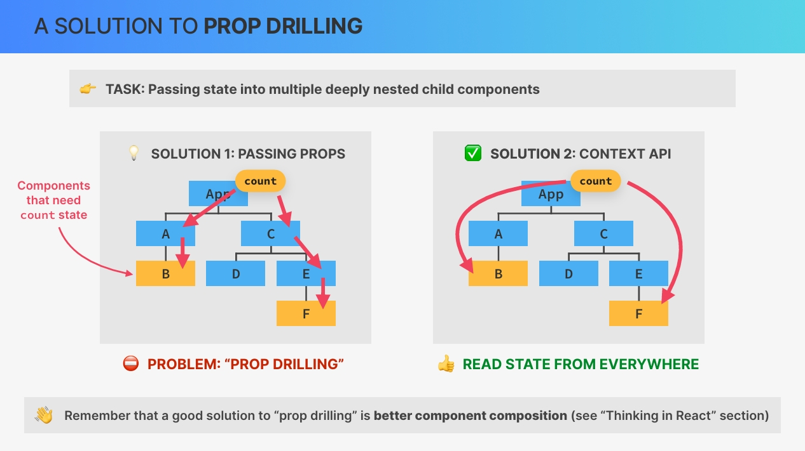
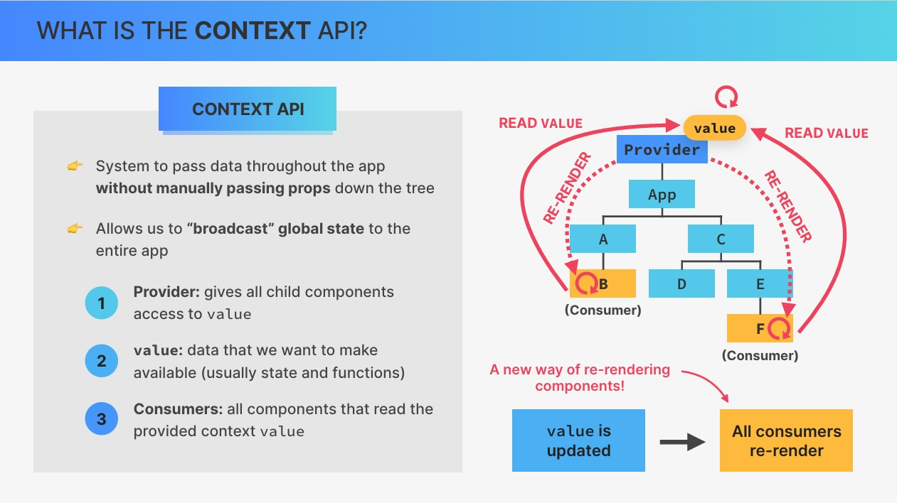

# `Advanced State Management The Context API`

## `Table of Contents`

1. [Section Overview](#section-overview)
2. [CHALLENGE #1 Understand The Atomic Blog App](#challenge-1-understand-the-atomic-blog-app)
3. [What is the Context API](#what-is-the-context-api)
4. [Creating and Providing a Context](#creating-and-providing-a-context)

---

## `Section Overview`

Welcome to a topic that many people really want to learn about, and that is the **context API** for advanced state management.  
And we're gonna start by exploring React's context API in isolation where teach you a very powerful context pattern. After that we'll take learned and apply it to the `world wise application` that we have been building. We will also dive even deeper into state management itself and learn about some new types of state and tools to handle them. Along the way, we'll wrap up this project, for example, by including nice interactive map, which is the reason why this section runs a little bit longer than the other ones.

So let's waste no time and get back to the actual course.

---

## `CHALLENGE #1 Understand The Atomic Blog App`

Let's do something unconventional now and start the section with a challenge. However, this is a very different challenge because all I want you to do in this one is to study and understand both the code and the data flow in a small new application `Atomic Blog` on your own.

- So first of all, notice how we don't have any node modules folder. And so the first thing to do is to install that by opening up our terminal and run npm install.  
- Now we don't even know how this project was built. So if it is a **Vite project** or if it's a **create react app project**. And to check that out we can open up or package.json, and then there in the script we see that all of them start with react-scripts and not Vite. So therefore this is a create-react-app.

So this is the atomic blog. Now I will not explain what this application is and what it does because that's the whole point of this challenge. So for the rest of this video, I want you to now explore the code in the source code folder and then the application as well.

So probably for that you should take a look at the component tree first and then move to the code and check where most of the state lives and then how that state and the data in general flow through the application tree.  

Now one of the main things that I want you to notice as you do this is how there is a lot of prop drilling going on. Now some of that prop drilling could actually easily be solved, but this example has all of that prop drilling actually on purpose. So it's a bit of an artificial example just to showcase this problem.  

But anyway, I will now leave you to it. So take at least 15 or 20 minutes to understand this application now because you will need to understand it actually to keep going in this section. So I will suppose that after this lecture you really know the code base in and out.

And then once you're done doing that I meet you in the next lecture where we will talk about what the context API is.

### `Entire Code for Now`

```jsx
import { useEffect, useState } from "react";
import { faker } from "@faker-js/faker";

function createRandomPost() {
  return {
    title: `${faker.hacker.adjective()} ${faker.hacker.noun()}`,
    body: faker.hacker.phrase(),
  };
}

function App() {
  const [posts, setPosts] = useState(() =>
    Array.from({ length: 30 }, () => createRandomPost())
  );
  const [searchQuery, setSearchQuery] = useState("");
  const [isFakeDark, setIsFakeDark] = useState(false);

  // Derived state. These are the posts that will actually be displayed
  const searchedPosts =
    searchQuery.length > 0
      ? posts.filter((post) =>
          `${post.title} ${post.body}`
            .toLowerCase()
            .includes(searchQuery.toLowerCase())
        )
      : posts;

  function handleAddPost(post) {
    setPosts((posts) => [post, ...posts]);
  }

  function handleClearPosts() {
    setPosts([]);
  }

  // Whenever `isFakeDark` changes, we toggle the `fake-dark-mode` class on the HTML element (see in "Elements" dev tool).
  useEffect(
    function () {
      document.documentElement.classList.toggle("fake-dark-mode");
    },
    [isFakeDark]
  );

  return (
    <section>
      <button
        onClick={() => setIsFakeDark((isFakeDark) => !isFakeDark)}
        className="btn-fake-dark-mode"
      >
        {isFakeDark ? "☀️" : "🌙"}
      </button>

      <Header
        posts={searchedPosts}
        onClearPosts={handleClearPosts}
        searchQuery={searchQuery}
        setSearchQuery={setSearchQuery}
      />
      <Main posts={searchedPosts} onAddPost={handleAddPost} />
      <Archive onAddPost={handleAddPost} />
      <Footer />
    </section>
  );
}

function Header({ posts, onClearPosts, searchQuery, setSearchQuery }) {
  return (
    <header>
      <h1>
        <span>⚛️</span>The Atomic Blog
      </h1>
      <div>
        <Results posts={posts} />
        <SearchPosts
          searchQuery={searchQuery}
          setSearchQuery={setSearchQuery}
        />
        <button onClick={onClearPosts}>Clear posts</button>
      </div>
    </header>
  );
}

function SearchPosts({ searchQuery, setSearchQuery }) {
  return (
    <input
      value={searchQuery}
      onChange={(e) => setSearchQuery(e.target.value)}
      placeholder="Search posts..."
    />
  );
}

function Results({ posts }) {
  return <p>🚀 {posts.length} atomic posts found</p>;
}

function Main({ posts, onAddPost }) {
  return (
    <main>
      <FormAddPost onAddPost={onAddPost} />
      <Posts posts={posts} />
    </main>
  );
}

function Posts({ posts }) {
  return (
    <section>
      <List posts={posts} />
    </section>
  );
}

function FormAddPost({ onAddPost }) {
  const [title, setTitle] = useState("");
  const [body, setBody] = useState("");

  const handleSubmit = function (e) {
    e.preventDefault();
    if (!body || !title) return;
    onAddPost({ title, body });
    setTitle("");
    setBody("");
  };

  return (
    <form onSubmit={handleSubmit}>
      <input
        value={title}
        onChange={(e) => setTitle(e.target.value)}
        placeholder="Post title"
      />
      <textarea
        value={body}
        onChange={(e) => setBody(e.target.value)}
        placeholder="Post body"
      />
      <button>Add post</button>
    </form>
  );
}

function List({ posts }) {
  return (
    <ul>
      {posts.map((post, i) => (
        <li key={i}>
          <h3>{post.title}</h3>
          <p>{post.body}</p>
        </li>
      ))}
    </ul>
  );
}

function Archive({ onAddPost }) {
  // Here we don't need the setter function. We're only using state to store these posts because the callback function passed into useState (which generates the posts) is only called once, on the initial render. So we use this trick as an optimization technique, because if we just used a regular variable, these posts would be re-created on every render. We could also move the posts outside the components, but I wanted to show you this trick 😉
  const [posts] = useState(() =>
    // 💥 WARNING: This might make your computer slow! Try a smaller `length` first
    Array.from({ length: 10000 }, () => createRandomPost())
  );

  const [showArchive, setShowArchive] = useState(false);

  return (
    <aside>
      <h2>Post archive</h2>
      <button onClick={() => setShowArchive((s) => !s)}>
        {showArchive ? "Hide archive posts" : "Show archive posts"}
      </button>

      {showArchive && (
        <ul>
          {posts.map((post, i) => (
            <li key={i}>
              <p>
                <strong>{post.title}:</strong> {post.body}
              </p>
              <button onClick={() => onAddPost(post)}>Add as new post</button>
            </li>
          ))}
        </ul>
      )}
    </aside>
  );
}

function Footer() {
  return <footer>&copy; by The Atomic Blog ✌️</footer>;
}

export default App;
```

---

## `What is the Context API`

**Let's start this section by understanding what the context API is and what problem it solves.**  

And we're actually gonna start with the problem that the context API solves. So let's say that in our application, we need to pass some state into multiple deeply nested child components just like in this(⤵see below img) fictional example.  
So in this application the components B and F both need access to the count state variable. And so that's the task that we need to solve.

Now, the **first solution that comes to mind is to simply pass the state variable as props all the way down until it reaches the components that need the count state.** However, this then creates a new problem because passing props down through multiple levels of the tree can quickly become cumbersome and inconvenient. And we actually talked about exactly this problem before, a problem that we call **`prop drilling`**.  

**Now back then I told you that one good solution to prop drilling is to compose components in a better way.** However, doing so is not always possible. **And so component composition with the children prop as we have learned before doesn't always solve this problem.**  

So instead what we need is actually a way of directly passing the state from a parent component into a deeply nested child component. So that would immediately solve the problem. **It turns out that React has actually thought of that and has given us the context API to do just that.**



**So the context API basically allows components everywhere in the tree to read state that a context shares.**

Let's now look at that in a bit more detail.  
**The context API is a system to pass data throughout the application without having to manually pass props down the component tree.** It essentially allows us to **broadcast global state**. So state that should be available to all the child components of a certain context.

Now in order to learn about the different parts of this system, let's bring back the component tree from the previous image.  



So the first part of the context API is the **provider**, w**hich is a special react component that gives all child components access to a so called `value`.** And this provider can sit everywhere in the component tree, but it's common to place it at the very top. Now this `value` is the data that we want to make available. So the data that we want to broadcast through the provider.nAnd so we pass this value into the provider.  
**Usually, this `value` contains one or more state variables and even some setter functions.**

**Finally, we have `consumers` which are all the components that read the value that we passed into the provider.** So in other words, consumers are the components that subscribe to the context. And so they are able to read the value from the context. And we can create as many consumers as we want for any context provider.

So that's how the context API works. **But what happens when the context value actually changes? So when it gets updated.**  
**Whenever the context `value` is updated, all consumers will automatically be rerendered.** So all the components that are reading the context value. So, whenever the value that is shared is updated in some way, the provider will immediately notify the consumers about the value change and it will then rerender those components. And so this means that now we have a new way in which component instances can be rerendered.

**So we already knew that state updates re render a component instance, but now we know that an update to a context value also rerenders a component as long as that component is subscribed to that exact context.**  

And that is the fundamentals of the context API and how it solves the prop drilling problem. We can create as many contexts as we want in our application and place them wherever we want in the component tree. And so all this allows for new and interesting ways of managing state as we're gonna explore throughout this section.

---

## `Creating and Providing a Context`

---
