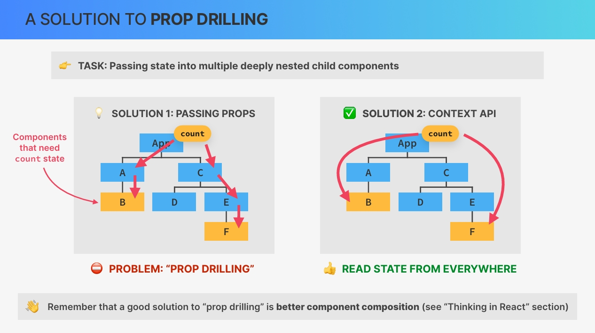
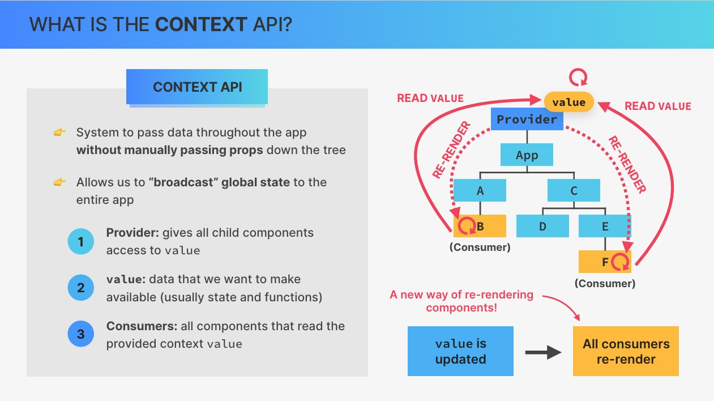
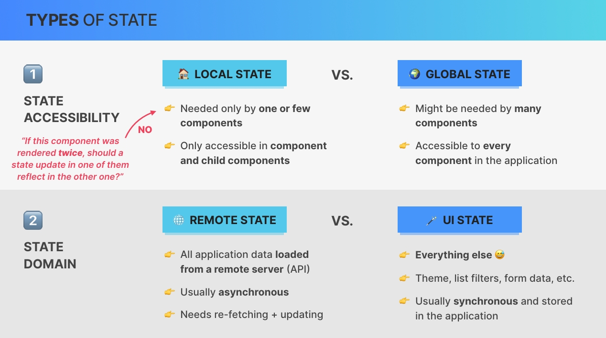
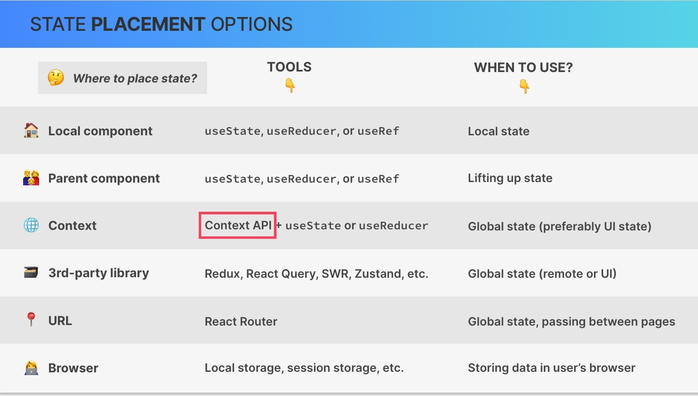
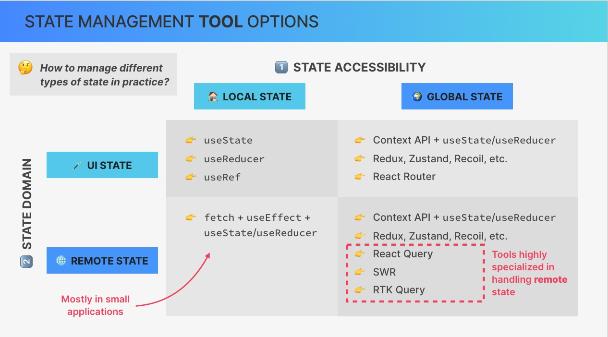

# `Advanced State Management The Context API`

## `Table of Contents`

1. [Section Overview](#section-overview)
2. [CHALLENGE #1 Understand The Atomic Blog App](#challenge-1-understand-the-atomic-blog-app)
3. [What is the Context API](#what-is-the-context-api)
4. [Creating and Providing a Context](#creating-and-providing-a-context)
5. [Consuming the Context](#consuming-the-context)
6. [Advanced Pattern a Custom Provider and Hook](#advanced-pattern-a-custom-provider-and-hook)
7. [Thinking In React Advanced State Management](#thinking-in-react-advanced-state-management)
8. [Back to WorldWise_Creating a CitesContext](#back-to-worldwise_creating-a-citescontext)

---

## `Section Overview`

Welcome to a topic that many people really want to learn about, and that is the **context API** for advanced state management.  
And we're gonna start by exploring React's context API in isolation where teach you a very powerful context pattern. After that we'll take learned and apply it to the `world wise application` that we have been building. We will also dive even deeper into state management itself and learn about some new types of state and tools to handle them. Along the way, we'll wrap up this project, for example, by including nice interactive map, which is the reason why this section runs a little bit longer than the other ones.

So let's waste no time and get back to the actual course.

---

## `CHALLENGE #1 Understand The Atomic Blog App`

Let's do something unconventional now and start the section with a challenge. However, this is a very different challenge because all I want you to do in this one is to study and understand both the code and the data flow in a small new application `Atomic Blog` on your own.

- So first of all, notice how we don't have any node modules folder. And so the first thing to do is to install that by opening up our terminal and run npm install.  
- Now we don't even know how this project was built. So if it is a **Vite project** or if it's a **create react app project**. And to check that out we can open up or package.json, and then there in the script we see that all of them start with react-scripts and not Vite. So therefore this is a create-react-app.

So this is the atomic blog. Now I will not explain what this application is and what it does because that's the whole point of this challenge. So for the rest of this video, I want you to now explore the code in the source code folder and then the application as well.

So probably for that you should take a look at the component tree first and then move to the code and check where most of the state lives and then how that state and the data in general flow through the application tree.  

Now one of the main things that I want you to notice as you do this is how there is a lot of prop drilling going on. Now some of that prop drilling could actually easily be solved, but this example has all of that prop drilling actually on purpose. So it's a bit of an artificial example just to showcase this problem.  

But anyway, I will now leave you to it. So take at least 15 or 20 minutes to understand this application now because you will need to understand it actually to keep going in this section. So I will suppose that after this lecture you really know the code base in and out.

And then once you're done doing that I meet you in the next lecture where we will talk about what the context API is.

### `Entire Code for Now`

```jsx
import { useEffect, useState } from "react";
import { faker } from "@faker-js/faker";

function createRandomPost() {
  return {
    title: `${faker.hacker.adjective()} ${faker.hacker.noun()}`,
    body: faker.hacker.phrase(),
  };
}

function App() {
  const [posts, setPosts] = useState(() =>
    Array.from({ length: 30 }, () => createRandomPost())
  );
  const [searchQuery, setSearchQuery] = useState("");
  const [isFakeDark, setIsFakeDark] = useState(false);

  // Derived state. These are the posts that will actually be displayed
  const searchedPosts =
    searchQuery.length > 0
      ? posts.filter((post) =>
          `${post.title} ${post.body}`
            .toLowerCase()
            .includes(searchQuery.toLowerCase())
        )
      : posts;

  function handleAddPost(post) {
    setPosts((posts) => [post, ...posts]);
  }

  function handleClearPosts() {
    setPosts([]);
  }

  // Whenever `isFakeDark` changes, we toggle the `fake-dark-mode` class on the HTML element (see in "Elements" dev tool).
  useEffect(
    function () {
      document.documentElement.classList.toggle("fake-dark-mode");
    },
    [isFakeDark]
  );

  return (
    <section>
      <button
        onClick={() => setIsFakeDark((isFakeDark) => !isFakeDark)}
        className="btn-fake-dark-mode"
      >
        {isFakeDark ? "☀️" : "🌙"}
      </button>

      <Header
        posts={searchedPosts}
        onClearPosts={handleClearPosts}
        searchQuery={searchQuery}
        setSearchQuery={setSearchQuery}
      />
      <Main posts={searchedPosts} onAddPost={handleAddPost} />
      <Archive onAddPost={handleAddPost} />
      <Footer />
    </section>
  );
}

function Header({ posts, onClearPosts, searchQuery, setSearchQuery }) {
  return (
    <header>
      <h1>
        <span>⚛️</span>The Atomic Blog
      </h1>
      <div>
        <Results posts={posts} />
        <SearchPosts
          searchQuery={searchQuery}
          setSearchQuery={setSearchQuery}
        />
        <button onClick={onClearPosts}>Clear posts</button>
      </div>
    </header>
  );
}

function SearchPosts({ searchQuery, setSearchQuery }) {
  return (
    <input
      value={searchQuery}
      onChange={(e) => setSearchQuery(e.target.value)}
      placeholder="Search posts..."
    />
  );
}

function Results({ posts }) {
  return <p>🚀 {posts.length} atomic posts found</p>;
}

function Main({ posts, onAddPost }) {
  return (
    <main>
      <FormAddPost onAddPost={onAddPost} />
      <Posts posts={posts} />
    </main>
  );
}

function Posts({ posts }) {
  return (
    <section>
      <List posts={posts} />
    </section>
  );
}

function FormAddPost({ onAddPost }) {
  const [title, setTitle] = useState("");
  const [body, setBody] = useState("");

  const handleSubmit = function (e) {
    e.preventDefault();
    if (!body || !title) return;
    onAddPost({ title, body });
    setTitle("");
    setBody("");
  };

  return (
    <form onSubmit={handleSubmit}>
      <input
        value={title}
        onChange={(e) => setTitle(e.target.value)}
        placeholder="Post title"
      />
      <textarea
        value={body}
        onChange={(e) => setBody(e.target.value)}
        placeholder="Post body"
      />
      <button>Add post</button>
    </form>
  );
}

function List({ posts }) {
  return (
    <ul>
      {posts.map((post, i) => (
        <li key={i}>
          <h3>{post.title}</h3>
          <p>{post.body}</p>
        </li>
      ))}
    </ul>
  );
}

function Archive({ onAddPost }) {
  // Here we don't need the setter function. We're only using state to store these posts because the callback function passed into useState (which generates the posts) is only called once, on the initial render. So we use this trick as an optimization technique, because if we just used a regular variable, these posts would be re-created on every render. We could also move the posts outside the components, but I wanted to show you this trick 😉
  const [posts] = useState(() =>
    // 💥 WARNING: This might make your computer slow! Try a smaller `length` first
    Array.from({ length: 10000 }, () => createRandomPost())
  );

  const [showArchive, setShowArchive] = useState(false);

  return (
    <aside>
      <h2>Post archive</h2>
      <button onClick={() => setShowArchive((s) => !s)}>
        {showArchive ? "Hide archive posts" : "Show archive posts"}
      </button>

      {showArchive && (
        <ul>
          {posts.map((post, i) => (
            <li key={i}>
              <p>
                <strong>{post.title}:</strong> {post.body}
              </p>
              <button onClick={() => onAddPost(post)}>Add as new post</button>
            </li>
          ))}
        </ul>
      )}
    </aside>
  );
}

function Footer() {
  return <footer>&copy; by The Atomic Blog ✌️</footer>;
}

export default App;
```

---

## `What is the Context API`

**Let's start this section by understanding what the context API is and what problem it solves.**  

And we're actually gonna start with the problem that the context API solves. So let's say that in our application, we need to pass some state into multiple deeply nested child components just like in this(⤵see below img) fictional example.  
So in this application the components B and F both need access to the count state variable. And so that's the task that we need to solve.

Now, the **first solution that comes to mind is to simply pass the state variable as props all the way down until it reaches the components that need the count state.** However, this then creates a new problem because passing props down through multiple levels of the tree can quickly become cumbersome and inconvenient. And we actually talked about exactly this problem before, a problem that we call **`prop drilling`**.  

**Now back then I told you that one good solution to prop drilling is to compose components in a better way.** However, doing so is not always possible. **And so component composition with the children prop as we have learned before doesn't always solve this problem.**  

So instead what we need is actually a way of directly passing the state from a parent component into a deeply nested child component. So that would immediately solve the problem. **It turns out that React has actually thought of that and has given us the context API to do just that.**



**So the context API basically allows components everywhere in the tree to read state that a context shares.**

Let's now look at that in a bit more detail.  
**The context API is a system to pass data throughout the application without having to manually pass props down the component tree.** It essentially allows us to **broadcast global state**. So state that should be available to all the child components of a certain context.

Now in order to learn about the different parts of this system, let's bring back the component tree from the previous image.  



So the first part of the context API is the **provider**, w**hich is a special react component that gives all child components access to a so called `value`.** And this provider can sit everywhere in the component tree, but it's common to place it at the very top. Now this `value` is the data that we want to make available. So the data that we want to broadcast through the provider.nAnd so we pass this value into the provider.  
**Usually, this `value` contains one or more state variables and even some setter functions.**

**Finally, we have `consumers` which are all the components that read the value that we passed into the provider.** So in other words, consumers are the components that subscribe to the context. And so they are able to read the value from the context. And we can create as many consumers as we want for any context provider.

So that's how the context API works. **But what happens when the context value actually changes? So when it gets updated.**  
**Whenever the context `value` is updated, all consumers will automatically be rerendered.** So all the components that are reading the context value. So, whenever the value that is shared is updated in some way, the provider will immediately notify the consumers about the value change and it will then rerender those components. And so this means that now we have a new way in which component instances can be rerendered.

**So we already knew that state updates re render a component instance, but now we know that an update to a context value also rerenders a component as long as that component is subscribed to that exact context.**  

And that is the fundamentals of the context API and how it solves the prop drilling problem. We can create as many contexts as we want in our application and place them wherever we want in the component tree. And so all this allows for new and interesting ways of managing state as we're gonna explore throughout this section.

---

## `Creating and Providing a Context`

Let's now start using the **context API** in practice in our `The Atomic Blog` application.

So as I said in that challenge lecture, it's extremely important that you got yourself highly familiar with this application(atomic blog) because what we're going to do now and over the next few lectures is to **completely refactor this entire application from having all the prop drilling that you find in this application to using the context API instead.** And we are going to learn about the context API in this separate project because this one is a lot simpler than the world wise application. And like this, we can learn this very important part of React in isolation so that we don't mix many different concepts altogether.

**Let's now start to solving prop drilling problem and learn how the context API works in practice.**  
Remember from the last lecture that basically the context API has three parts. There is a **provider**, there is a **value** and then there are all the **consumer components** which will read the value from the context.

1. **`Creating Provider`**  
    Let's start with the first step which is to create the provider.  
    In order to create a provider we first need to create a **new context**.

    So for that we call **createContext** which is a function that is included in React, just like useState or use Effect. **_`createContext();`_** Into this create context function, we could pass in a default value for this context. However, we usually never do that because that value cannot change over time. And so it's actually pretty useless. So instead, we usually pass in null or we just leave this empty.  
    But anyway, calling createContext() will return a context. So let's call this a **PostContext** in this case because here we are going to store the information about posts. Notice how here the **variable name actually starts with an upper case letter**. And so the reason for that is that **this is actually basically a component.** So components always use the upper case letter at the beginning.  

    ```JSX
    // 1) CREATE A CONTEXT
    const PostContext = createContext();
    ```

    The first one is to create a new context. So we have our context now and now we can pass the value into the context provider. So let's then go right into our App JSX because this is where we are going to use that component. And let's actually make it the parent component of all of these Jsx. So PostContext, and now on there we get the dot Provider property.

    ```jsx
    return (
        <PostContext.Provider>
          <section>
            <button
              onClick={() => setIsFakeDark((isFakeDark) => !isFakeDark)}
              className="btn-fake-dark-mode"
            >
              {isFakeDark ? "☀️" : "🌙"}
            </button>

            <Header
              posts={searchedPosts}
              onClearPosts={handleClearPosts}
              searchQuery={searchQuery}
              setSearchQuery={setSearchQuery}
            />
            <Main posts={searchedPosts} onAddPost={handleAddPost} />
            <Archive onAddPost={handleAddPost} />
            <Footer />
          </section>
        </PostContext.Provider>
      );
    ```

    Now this on its own doesn't do anything yet because now what we need to do is to pass the value into this provider. So this is basically the second step.

2. **`Pass the value to child components`**
    So the second step is to provide value to the child components. So to do that, in <PostContext.Provider> we specify the `value` prop on this component and then we enter JavaScript mode so that here we can then define an object. **So here we need an object which will contain all the data that we want to make accessible to the child components.** And so that's basically gonna be similar to these props that we pass from one component to another.

    ```jsx
    return (
    // 2) PROVIDE THE VALUE TO THE CHILD COMPONENT
    <PostContext.Provider
      value={{
        posts: searchedPosts,
        onAddPost: handleAddPost,
        onClearPosts: handleClearPosts,
        searchQuery,
        setSearchQuery,
      }}
    >
      <section>
        <button
          onClick={() => setIsFakeDark((isFakeDark) => !isFakeDark)}
          className="btn-fake-dark-mode"
        >
          {isFakeDark ? "☀️" : "🌙"}
        </button>

        <Header
          posts={searchedPosts}
          onClearPosts={handleClearPosts}
          searchQuery={searchQuery}
          setSearchQuery={setSearchQuery}
        />
        <Main posts={searchedPosts} onAddPost={handleAddPost} />
        <Archive onAddPost={handleAddPost} />
        <Footer />
      </section>
    </PostContext.Provider>

    );

    ```

    Basically what we did was to pass states, derived state(searchedPosts) and also two event handler functions that are in App component into our context value. So we created an object which contains one property for each of these values that we want to pass in.

    And so let's now do the same thing also for the searchQuery and setSearchQuery.⤴

    **Now usually we create one context per state domain.** **So basically we would have one context only for the posts and then another context only for the search data.** So in fact, this is actually called the post context and so it should only be for first three parts. And then we could also create a search context where we would place last two.

Now we have all our data inside our context and so it's time to consume the context in all the components that actually need access to this data. And so let's do that in the next lecture.

---

## `Consuming the Context`

**With the context provider and value now in place, let's consume the context value in multiple components and get rid of all the annoying props that we have in our application.**  

And let's actually start by removing props from one component at a time. So starting here with the Header component, let's get rid of all of the props, so that we can then recreate the same functionality only by reading the value out of the context.

### `Calling Component with Props`

```jsx
// Calling component With Props
<Header
  posts={searchedPosts}
  onClearPosts={handleClearPosts}
  searchQuery={searchQuery}
  setSearchQuery={setSearchQuery}
/>

```

### `Calling component with our Context`

```jsx
// Calling component With context
<Header />
```

### `Header Component with Props`

```jsx
// Header Component with props, so before context. 
function Header({ posts, onClearPosts, searchQuery, setSearchQuery }) {
  return (
    <header>
      <h1>
        <span>⚛️</span>The Atomic Blog
      </h1>
      <div>
        <Results posts={posts} />
        <SearchPosts
          searchQuery={searchQuery}
          setSearchQuery={setSearchQuery}
        />
        <button onClick={onClearPosts}>Clear posts</button>
      </div>
    </header>
  );
}
```

So here we can remove all these props. And so if all we have is props drilling then it means that this component itself doesn't need any data, so any value out of the context. But actually it does because here we have this onClearPosts prop which this component really needs. And so therefore we now need to get this onClearPosts function from the context.

**Let's now read this function(onClearPosts) right from the context.** So to do that, **it's time to meet yet another react hook and this one is simply called useContext.** It is indeed another function that is coming from the React library. **And then here what we need to do is to pass in the entire context object.** So that's **PostContext** and not PostContext dot provider or dot consumer which also exists but really only PostContext. So this will then return something and let's just call that x for now and take a look at it.

```jsx
const x = useContext(PostContext);
console.log(x);
```

**And so, here we can see that it does basically return the entire value that we passed into the context.**

And so we can then destructure that and basically take out only the part that we want. So that's onClearPosts in this case. Okay.

### `Header component with Context`

```jsx
function Header() {
  // 3)  CONSUMING THE CONTEXT VALUE
  const { onClearPosts } = useContext(PostContext); 

  return (
    <header>
      <h1>
        <span>⚛️</span>The Atomic Blog
      </h1>
      <div>
        // props are removed from Results and SearchPosts, because in this component we don't need that data, we're just passing to child component. so no need here. 
        <Results />
        <SearchPosts />
        <button onClick={onClearPosts}>Clear posts</button>
      </div>
    </header>
  );
}
```

As we removed props of Results and SearchPosts so it gives errors and that's because results and SearchPosts, of course, also rely on some props. So let's move there and let's also give them their value from the context.

And so now all we need to do is the same thing in all the components that need the data.

```jsx
function SearchPosts() {
  // 3)  CONSUMING THE CONTEXT VALUE
  const { searchQuery, setSearchQuery } = useContext(PostContext);
  return (
    <input
      value={searchQuery}
      onChange={(e) => setSearchQuery(e.target.value)}
      placeholder="Search posts..."
    />
  );
}

function Results() {
  // 3)  CONSUMING THE CONTEXT VALUE
  const { posts } = useContext(PostContext);
  return <p>🚀 {posts.length} atomic posts found</p>;
}
```

So use context, post context, give it a safe, and beautiful. Now we are back to working. So let's see our component tree again. But what really matters is that we got the post's data into this really nested component without having to pass in any props. And so that's exactly the functionality of the context API that we learned at the very first lecture of this section. So this post's data is basically now being broadcasted by this provider and injected into the Results without ever having to pass through the Header. And so the prop drilling really is gone, at least for that part because as we see we still have a few props.

Let's do same for all other props. And I think that's actually it. So let's just check and indeed none of our components now receive props anymore. And notice how much cleaner here is our JSX.

So with this we finished actually implementing all context. And as you see it was actually pretty easy, right? We can however do a couple of improvements to the way that we use the context API in practice. And so let's do that in the next lecture.

---

## `Advanced Pattern a Custom Provider and Hook`

**Now that we know how to use the Context API in practice, we can take it to the next level and implement a `custom provider component` as well as a `custom hook` to then consume the data.**

**_`UPDATED CODES IN PREVIOUS LECTURES`_**  

```JSX
import { createContext, useContext, useEffect, useState } from "react";
import { faker } from "@faker-js/faker";

function createRandomPost() {
  return {
    title: `${faker.hacker.adjective()} ${faker.hacker.noun()}`,
    body: faker.hacker.phrase(),
  };
}

// 1) CREATE A CONTEXT
const PostContext = createContext();

function App() {
  const [posts, setPosts] = useState(() =>
    Array.from({ length: 30 }, () => createRandomPost())
  );
  const [searchQuery, setSearchQuery] = useState("");
  const [isFakeDark, setIsFakeDark] = useState(false);

  // Derived state. These are the posts that will actually be displayed
  const searchedPosts =
    searchQuery.length > 0
      ? posts.filter((post) =>
          `${post.title} ${post.body}`
            .toLowerCase()
            .includes(searchQuery.toLowerCase())
        )
      : posts;

  function handleAddPost(post) {
    setPosts((posts) => [post, ...posts]);
  }

  function handleClearPosts() {
    setPosts([]);
  }

  // Whenever `isFakeDark` changes, we toggle the `fake-dark-mode` class on the HTML element (see in "Elements" dev tool).
  useEffect(
    function () {
      document.documentElement.classList.toggle("fake-dark-mode");
    },
    [isFakeDark]
  );

  return (
    // 2) PROVIDE THE VALUE TO THE CHILD COMPONENT
    <PostContext.Provider
      value={{
        posts: searchedPosts,
        onAddPost: handleAddPost,
        onClearPosts: handleClearPosts,
        searchQuery,
        setSearchQuery,
      }}
    >
      <section>
        <button
          onClick={() => setIsFakeDark((isFakeDark) => !isFakeDark)}
          className="btn-fake-dark-mode"
        >
          {isFakeDark ? "☀️" : "🌙"}
        </button>

        <Header />
        <Main />
        <Archive />
        <Footer />
      </section>
    </PostContext.Provider>
  );
}

function Header() {
  // 3)  CONSUMING THE CONTEXT VALUE
  const { onClearPosts } = useContext(PostContext);

  return (
    <header>
      <h1>
        <span>⚛️</span>The Atomic Blog
      </h1>
      <div>
        <Results />
        <SearchPosts />
        <button onClick={onClearPosts}>Clear posts</button>
      </div>
    </header>
  );
}

function SearchPosts() {
  const { searchQuery, setSearchQuery } = useContext(PostContext);
  return (
    <input
      value={searchQuery}
      onChange={(e) => setSearchQuery(e.target.value)}
      placeholder="Search posts..."
    />
  );
}

function Results() {
  const { posts } = useContext(PostContext);
  return <p>🚀 {posts.length} atomic posts found</p>;
}

function Main() {
  return (
    <main>
      <FormAddPost />
      <Posts />
    </main>
  );
}

function Posts() {
  return (
    <section>
      <List />
    </section>
  );
}

function FormAddPost() {
  const [title, setTitle] = useState("");
  const [body, setBody] = useState("");

  const { onAddPost } = useContext(PostContext);

  const handleSubmit = function (e) {
    e.preventDefault();
    if (!body || !title) return;
    onAddPost({ title, body });
    setTitle("");
    setBody("");
  };

  return (
    <form onSubmit={handleSubmit}>
      <input
        value={title}
        onChange={(e) => setTitle(e.target.value)}
        placeholder="Post title"
      />
      <textarea
        value={body}
        onChange={(e) => setBody(e.target.value)}
        placeholder="Post body"
      />
      <button>Add post</button>
    </form>
  );
}

function List() {
  const { posts } = useContext(PostContext);

  return (
    <ul>
      {posts.map((post, i) => (
        <li key={i}>
          <h3>{post.title}</h3>
          <p>{post.body}</p>
        </li>
      ))}
    </ul>
  );
}
```

_The implementation that we have right now is actually perfectly fine. So it works great and so in many applications this is more than enough. However, as I said at the beginning of the lecture, we can now make this even more advanced by implementing some more advanced patterns. And so let's now do that._

**So the idea is basically to remove all the state and state updating logic from the App component and place it into our own custom Context Provider component. So we will then have all the state and we will then provide that using context into our application.**  
So it's basically just a refactoring of what we already have, But the functionality will stay exactly the same and we still will have all three parts. So `creating the context` then `providing a value` and then `reading it`. `We will just have these different parts in different files.`

**_Code till now is in `App-vs.js` file,so before refactoring for our custom context_**

Let's create a new component called `PostContext.js`.

Okay. And here let's quickly create that function. So PostProvider and we will then later also export it. And basically what we do now is to grab all this stuff, so everything that is related to the context and place it into this file.  
Alright. And now let's grip all the state, and state updating logic from App component and then place that in PostProvider function.

Okay. Well, actually we also removed this state. So about the dark mode. So let's place that back right here. And then what we want is to also grab this, so cut it and remove this one here as well.

Alright. So again, we are just refactoring everything here into this provider. This PostProvider, so this component(PostProvider) will just be another React component. And so it needs to return some JSX. And so that JSX will be the context provider so PostContext.Provider.

So let's actually for now export this from here. So post provider, let's do an export default for now. And so then here we are able to just import post provider like this.

**`PostProvider.js File`**

```jsx
import { createContext, useState } from "react";
import { faker } from "@faker-js/faker";

function createRandomPost() {
  return {
    title: `${faker.hacker.adjective()} ${faker.hacker.noun()}`,
    body: faker.hacker.phrase(),
  };
}

// 1) CREATE A CONTEXT
const PostContext = createContext();

function PostProvider() {
  const [posts, setPosts] = useState(() =>
    Array.from({ length: 30 }, () => createRandomPost())
  );
  const [searchQuery, setSearchQuery] = useState("");

  // Derived state. These are the posts that will actually be displayed
  const searchedPosts =
    searchQuery.length > 0
      ? posts.filter((post) =>
          `${post.title} ${post.body}`
            .toLowerCase()
            .includes(searchQuery.toLowerCase())
        )
      : posts;

  function handleAddPost(post) {
    setPosts((posts) => [post, ...posts]);
  }

  function handleClearPosts() {
    setPosts([]);
  }

  return (
    <PostContext.Provider
      value={{
        posts: searchedPosts,
        onAddPost: handleAddPost,
        onClearPosts: handleClearPosts,
        searchQuery,
        setSearchQuery,
      }}
    ></PostContext.Provider>
  );
}

export default PostProvider;
```

**`App Component`**

```jsx
import PostProvider from "./PostContext";
function App() {
  const [isFakeDark, setIsFakeDark] = useState(false);

  useEffect(
    function () {
      document.documentElement.classList.toggle("fake-dark-mode");
    },
    [isFakeDark]
  );

  return (
    // 2) PROVIDE THE VALUE TO THE CHILD COMPONENT
    <PostProvider>
      <section>
        <button
          onClick={() => setIsFakeDark((isFakeDark) => !isFakeDark)}
          className="btn-fake-dark-mode"
        >
          {isFakeDark ? "☀️" : "🌙"}
        </button>

        <Header />
        <Main />
        <Archive />
        <Footer />
      </section>
    </PostProvider>
  );
}
```

Alright. But this⤴ will actually still not work because watch what's happening right now.  
**So we are passing all of children into the PostProvider component from App. Right? But then all that we do from PostProvider is to return postContext.provider but we're not doing anything with the children.**

**We actually also need to now export PostContext from PostContext.js file so that we can use it here in app.** So let's now instead of the default export, export them as a named export, Also import imports as well in App.js.

```jsx
// Default Export
export default PostProvider;

// Named Export
export { PostProvider, PostContext };

// Default Imports
import PostProvider from "./PostContext";

// Named Imports
import { PostContext, PostProvider } from "./PostContext";
```

So this basically fixes all errors, But now as I mentioned before we have an empty page. `No error but an empty page`. The reason is as we mentioned earlier, in PostContext we're not using children that are are passing from App to <PostProvider>. All we are doing from PostProvider is to return `PostContext.Provider`.

And so what we need to do now is to accept the children prop in PostProvider function and then place the children in <PostContext.Provider>{children}</PostContext.Provider>. And with that, then our application works again. So everything works the same, but now we created ourselves our own custom context provider component which is Post Provider function in PostContext.js file Alright.

And with this we really cleaned up tremendously this App component, so our parent component. So it's important that you understand what we just did here.  
So we created this PostProvider component which we now wrap around all our other components. And you can always compare that with the App-v1.js file that we created earlier. So we pass these like Header, Main etc into the opening and the closing tag of PostProvider, from App and so therefore, this will become the children of this component. So then we use the children prop from PostContext.js and then we wrap all these children inside the PostContext.Provider just like we had before. And so by doing that we could place all the state and the state update logic into its own separate context file which then cleaned up tremendously our main component that we have. So this app component.

---

So with this we finished the first part of the lecture which was to **create the context provider component**. But now remember how I told you that we are also going to **create our own custom hook**. And so let's see what that means.

So right now to consume the context, we are always using useContext hook and then we pass in our PostContext object. And this works great but over time after using this many many times you will notice that it can become a bit annoying to always have to write PostContext. **So basically this part(useContext(PostContext)) is always repeated over and over again in all the components where we actually read the value from the context.**  
**And so basically we can encapsulate this part into its own custom hook.**

So let's come back into the PostContext file and then create that right there as well. _So that's a very common pattern that many developers use these days._ **So basically placing this context provider component and then the corresponding hook all into the same file.**

So let's call this one usePosts and we don't need any argument. And so here, let's then get the value out of the context. So the entire value which we will then return so that in our components we can destructure it. And so now we will use the use context hook right in usePosts custom hook function. So using it and then passing in the PostContext just like we did before. And now we can return the context from custom hook.  
And then instead of returning PostContext from PostContext file, we can leave it encapsulated inside this file and instead export this custom hook. **So with this, we then basically create like an API for this context.** So, again, instead of exposing the context object itself, we just expose a function with which we can then access that.

```jsx
// Custom Hook
function usePosts() {
  const context = useContext(PostContext);
  return context;
}

// export { PostProvider, PostContext };
export { PostProvider, usePosts };
```

Okay. And so let's use that in App instead of the PostContext.

```jsx
import { PostProvider, usePosts } from "./PostContext";
```

**And now we just replace useContext with our custom hook, so with usePosts in everywhere in our application.**

```jsx
// const { onClearPosts } = useContext(PostContext);

const { onClearPosts } = usePosts();
```

Okay. Now let me just show you something which is for example, trying to use that custom hook right in App component. So usePosts and then let's log that to the console. like this:

```jsx
function App() {
  const x = usePosts();
  console.log(x);
  ...
}
```
  
**So what do you think is going to happen?** **What do you think this x will be?** Well, it is `undefined`. **So why do you think that is?** **Why is the context value suddenly undefined?** Well, **all we need to do is to look at our component tree.**

**So we tried to use the context inside of app, but the context only provides the value to all its children components.** So only to all of the components that are below the provider.  
**And so this could lead to some hard to find bugs in a larger application. And so let's now do something against this.**

So basically to prevent someone from using this hook, so to accessing the context value where they shouldn't. So notice how the context value was undefined. And so what we can do is to test for that. So we can check if the context is undefined, then let's just throw a new error. And then let's let the developer know that post context was used outside of the PostProvider.

```jsx
function usePosts() {
  const context = useContext(PostContext);
  if (context === undefined)
    throw new Error("PostContext was outside of the PostProvider");
  return context;
}
```

_And, yeah, there we go. So this is actually a lot better even though normally we don't like errors. But in a situation like this it's actually a lot better to have directly an error here than maybe having the developer think that this somehow works. So with this, they know immediately that this cannot work. So that's why we should always create an error in the situation where we are trying to access the context where we actually cannot._

Okay. And this is all I wanted to show you for this advanced pattern. It is composed of two parts. **First the post provider** and then **our own custom hooks to read the value out of the context.**  
**And I'm showing this to you because this is basically like a recipe that you can always follow in all your own projects when you want to use the context API.** So we always do this in the exact same way. So we create a context, then we create our own provider component which receives the children so that we can then use it. And then we pass the value in there, and then of course also return the children here. And then in the end, we always have this own custom hook. So again, always the same recipe that you can start using in your own applications.

So now we know really well how to use the Context API in practice. And so let's now go back to talking a little bit more about state management and how the context API fits into that picture.

---

## `Thinking In React Advanced State Management`

**So now that we know how the context API works it's time to get back to talking about state management in general and how the context API fits into the state management tools that we already had before.**

### `What is the state management`

**`Things that covered previously`**  
Now, we already talked about state management earlier in the course but it was more of an introduction. So we discussed that a **`State Management` is basically just like giving each piece of state the right home.** So in that lecture we talked about `when to use state`, `local VS global state` And I also gave you a handy `flowchart to decide when and where to create state`, which of course you can keep using.

**`Things, Covering in this lecture`**  
In this lecture, we will talk about `UI VS Remote State`, `All the options for where to place state` and also `all the state management tools that are available to us to manage all these different types of state`.


### `Types of State`

And let's start with different types of state that can exist in all web applications. **So we can classify state in terms of `state accessibility` and in terms of `state domain`.**

#### `Types of State in terms of State Accessibility`

**When it comes to state accessibility, state can be either a `local state` or `global state`.** And we already talked about this, but I just want to quickly review these super important concepts.

##### `Local State VS Global State`  

- `Local State` is **only needed by on or a few components** while `Global State` might be **needed by many components** in different positions of the tree. That's why:  
- `Local State` is only **accessible inside the component that it was defined in plus maybe its child components** while `Global State` can actually be made **accessible to every single component in the application**.  
So it's the accessibility of a state variable that changes between local and global state.

**Now, if we need to create a new state variable in a component but are not sure whether it should be local or global state, there is a very nice trick that can help**. So all you need to do is to ask yourself, **if this component was rendered twice, should a state update in one of the components reflect in the other one?** **And if the answer is no, then it means that it's local state**. But if the **answer is yes, you have found yourself a global state variable**. So just keep this trick in mind for the future as it can be quite helpful.

#### `Types of State in terms of State Domain`

**Now moving on to the state domain, we can classify each piece of state as either `Remote State` or `UI state`.**  
**Remote state is basically all application data that is loaded from a remote server,** so usually using an API. So it's basically state that lives on a server but that can be loaded into our application.  
**`UI State` on the other hand is basically everything else.** So things like the currently selected theme, applied list filters, form inputs, open panels and many many more. So again, **all state that is not the core application data that we usually fetch from an API is UI state.**

`So whenever you have some state, it's extremely important to always know whether you're dealing with remote state or with UI state because they need to be managed in a completely different way.`

So `remote state` is fundamentally different from UI state because we usually **get it in an asynchronous way** and because the data might need to be re-fetched and updated frequently. Therefore, in a large scale application **remote state should be cached, revalidated and so on**. And so for that we need some specialized tools.  
**`UI state` on the other hand is usually synchronous and stored right in the application and does not interact with any server at all.**

And so this means that UI state is very easy to handle with the tools that we already know of. So things like useState or useReducer. And we will take a closer look at these tools later in this lecture.



### `State Placement Options`

Now let's focus on **where we can physically place each state variable in our code base**. **So whenever we need a new piece of state we have about six different options on where we can place it.**

1. `Local Component:` If all we need is local state, then we simply place it in a local component using **useState**, **useReducer** or even **useRef**. So a ref can also be considered state even though it won't rerender the component.

2. `Parent Component:` Now many times we actually need a piece of state in multiple related components. And so then it's time to lift the state up by placing it in a parent component of all the components that need it. So a parent component is another state placement option. However, even that sometimes is not enough.

3. `Context:` So sometimes we have actual global state and then one good solution is to place the state into a context. So this is where the context API that we have been learning about comes into play as we can use it together with useState or useReducer to manage global state. **Just note that context on its own is actually not who is managing the state.** **State still needs to be managed, so to be created and updated by useState or by useReducer.** But we then use the context API to give all components in the tree access to that state. But anyway, **the context API is actually best suited to manage UI state** and not necessarily remote state, especially when you are building a bigger application, but more about that in the next slide.

4. `3rd-Party Library:` So if we need to manage remote state in a complex application or just need a more efficient way of managing global state in general, we can opt for one of the many third party state management libraries that exist in the React ecosystem. So you can place your global state into **Redux**, into **React Query** or **SWR** or **Zustand** or one of the many other external state management solutions. And some of these solutions are suited for global remote state and some for global UI state or both.

5. `URL:` Next up, as we learned in the previous section, is the URL. So the URL is yet another excellent place where we can store global state that we want to make easily shareable and bookmarkable or that we just want to pass between pages.

6. `Browser:` And finally, sometimes we need to store some data inside the user's browser. And in that case, we can use **local storage**, **session storage** or something like that. **Now just like refs, this is state that won't actually rerender any components, but it's still technically application state,** which is why I included this in this list as yet another possible state location.



Alright. So hopefully, this is a helpful overview for you that you can keep handy once you start building your own applications.

### `State Management Tool Options`

**And now to finish, let's try to answer the question of how to manage the different types of state in practice.** Or in other words, **what tools should be used for each kind of state.**  

So if we combine all classifications of state according to accessibility and domain, we end up with four combinations.So **local UI state**, **global UI state**, **local remote state**, and finally **global remote state**.

And so let's now look at the tools that we can use to manage each of these state types.

### `Tools For Local UI State`

And starting with the easiest, we simply manage local UI state with the tools that we already know about, so useState, useReducer and useRef.

### `Tools For Local Remote State`

Now when it comes to local remote state, we can use a simple fetch inside a useEffect in order to load data from a remote API and then store that data as state with useState or useReducer. So this is exactly what we've been doing all the time up until this point.  
However, this is usually only a good idea in small applications. **In bigger applications, we usually just treat all remote state as global state**, which brings us to the next type of state.

### `Tools For Global Remote State`

So when we need to manage global remote state, we have to choose if we want to use a general solution like the context API or a library like Redux or if we want to use a tool that is highly specialized in managing remote state. So those are tools like React Query, SWR or RTK Query which have built in mechanisms like caching and automatic refetching in order to deal with the asynchronous nature of remote state. In fact, these tools are so helpful that we will study React Query in-depth in the next project.So I definitely recommend going with a solution like this.

### `Tools For Global UI State`

But anyway, to finish now, let's move up to global UI state. And here, the context API coupled with useState or useReducer is a great tool. Now if you need something a bit more performant, you can look into one of the 3rd party libraries that we already discussed. So something like Redux which we will actually learn later in this section. And so by then we will talk more about the differences between Redux and the context API and also when to use each.



Alright. So the idea of this diagram is more to give you an overview and a reference that you can keep in the future which should be really helpful. So I really wish that I had something like this when I first started learning React development and especially learning about state management. But anyway, let's now quickly go back to the world wise project that we have started working on in the previous section.

---

## `Back to WorldWise_Creating a CitesContext`

Go to next section in `Back to WorldWise`

---
