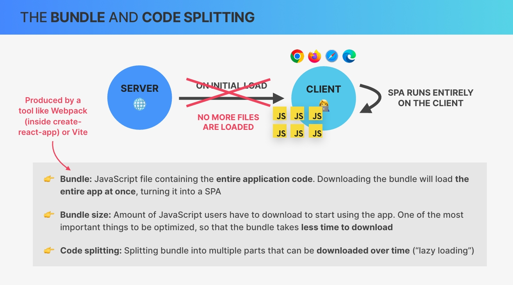

# `Advanced State Management The Context API [PART-2]`

## `Table of Contents`

1. [Back to WorldWise_Creating a CitesContext](#back-to-worldwise_creating-a-citescontext)
2. [Consuming the CitiesContext](#consuming-the-citiescontext)
3. [Finishing the City View](#finishing-the-city-view)
4. [Including a Map With the Leaflet Library](#including-a-map-with-the-leaflet-library)
5. [Display City Markers on the Map](#display-city-markers-on-the-map)
6. [Interacting With the Map](#interacting-with-the-map)
7. [Setting Map Position With Geolocation](#setting-map-position-with-geolocation)
8. [Fetching City Date in the Form](#fetching-city-date-in-the-form)
9. [Creating a new City](#creating-a-new-city)
10. [Deleting a City](#deleting-a-city)
11. [Advanced State Management System Context with useReducer](#advanced-state-management-system-context-with-usereducer)
12. [Adding Fake Authentication Setting up Context](#adding-fake-authentication-setting-up-context)
13. [Adding Fake Authentication Implementing Login](#adding-fake-authentication-implementing-login)
14. [Adding Fake Authentication Protecting a Route](#adding-fake-authentication-protecting-a-route)
15. [CHALLENGE-2 Refactoring React Quiz to Context API](#challenge-2-refactoring-react-quiz-to-context-api)
16. [Back to The WorldWise App From Performance Optimization](#back-to-the-worldwise-app)
17. [Optimizing Bundle Size With Code Splitting](#optimizing-bundle-size-with-code-splitting)

---

## `Back to WorldWise_Creating a CitesContext`

Now it's time to move back to the world wise application that we have been building to now use the context API in exactly the way that I showed you earlier. So in this lecture, we're gonna create a similar custom context provider component but this time for the city's data. So here we are back in the world wise application.

Okay. Now as we learned in the previous lecture, **just because we now know how to use the context API, that doesn't mean that it's always the right tool or the right solution for managing the state in our applications.** But when you have a small sized application like this one that we are building right now and where performance is never gonna be an issue, then the context API is a great tool indeed.

Now here in our app we actually don't even have much prop drilling going on, but I think that it's still nice to get rid of some of the props and make the code look a little bit cleaner. Also by doing this, we're gonna be able to move all of the state and the state logic into its own place.

And so let's now start doing that. So just like before we are going to create our own custom context provider and so let's actually create a new folder. **So that's a common practice to create a new folder called `context` or could also be `contexts`**. And now here, let's create our CitiesContext.jsx, which is because we are now using Vite.

And so now let's follow the exact same recipe that we created ourselves earlier. So we're going to **start by creating that new context**, so CitiesContext by calling the CreateContext function coming from React.

Next up, it's then time to create that provider component. And so this one is gonna be called CitiesProvider, and remember it will need to accept the children prop, so that we can then use this provider component as the top level component in the App component.  And now next up, let's grab all the code that are related to cities. So all the state code and the state updating logic which in this case includes this useEffect.

```jsx
// CitiesContext.jsx
const { createContext, useState, useEffect } = require("react");

const BASE_URL = `http://localhost:3001`;

const CitiesContext = createContext();

function CitiesContext({ children }) {
  const [cities, setCities] = useState([]);
  const [isLoading, setIsLoading] = useState(false);

  useEffect(function () {
    async function fetchCities() {
      try {
        setIsLoading(true);
        const res = await fetch(`${BASE_URL}/cities`);
        const data = await res.json();
        setCities(data);
      } catch (err) {
        alert("There was an error loading data...");
      } finally {
        setIsLoading(false);
      }
    }
    fetchCities();
  }, []);
}
```

So we could Even why not? We could just immediately remove all of this from here. So then we can right away see how clean this component is going to look like.

```jsx
// Code before removing variables
<Route
  path="cities"
  element={<CityList cities={cities} isLoading={isLoading} />}
/>
<Route path="cities/:id" element={<City />} />
<Route
  path="countries"
  element={<CountryList cities={cities} isLoading={isLoading} />}
/>
```

```jsx
// Code after removing variables
<Route path="cities" element={<CityList />} />
<Route path="cities/:id" element={<City />} />
<Route path="countries" element={<CountryList />} />
```

And so the homepage actually now works because it wasn't relying on any of those state variables. So if we reload this then everything looks fine. The only thing we can do is to open up our application. So that won't work because for now it doesn't have access to the cities and the isLoading state. But watch how clean our App component now has become. So all it does really for now is to define routes and match them simply to the components, so without any props. Okay.

And so with this, let's go back to our context provider. So now it's actually time to use that city's context and so that is, of course, in the return block of this component(CitiesContext).

So from CitiesContext we will return `CitiesContext.Provider`. So just like this and then here we can immediately place the children and then of course our value. And then we need another curly braces which is for our object. And so now let's see what we want to do. Well, for now we only need to pass in the cities and the isLoading state.  
So this is all we need for now. Okay. And so let's now export this component from here and remember how we used named exports before. So this time in this component we don't use the default export because we will later on also export that custom hook.

```jsx
const { createContext, useState, useEffect } = require("react");

const BASE_URL = `http://localhost:3001`;

const CitiesContext = createContext();

function CitiesContext({ children }) {
  const [cities, setCities] = useState([]);
  const [isLoading, setIsLoading] = useState(false);

  useEffect(function () {
    async function fetchCities() {
      try {
        setIsLoading(true);
        const res = await fetch(`${BASE_URL}/cities`);
        const data = await res.json();
        setCities(data);
      } catch (err) {
        alert("There was an error loading data...");
      } finally {
        setIsLoading(false);
      }
    }
    fetchCities();
  }, []);

  return (
    <CitiesContext.Provider
      value={{
        cities,
        isLoading,
      }}
    >
      {children}
    </CitiesContext.Provider>
  );
}

export { CitiesProvider };
```

And so then in App.jsx we will be able to import that. So cities provider, and you see it automatically imported that from here. And now all we need to do is to grab that from here, go all the way to the end, and beautiful. There we go.

```jsx
/// App.jsx
function App() {
  return (
    <CitiesProvider>
      <BrowserRouter>
        <Routes>
          <Route index element={<Homepage />} />
          <Route path="product" element={<Product />} />
          <Route path="pricing" element={<Pricing />} />
          <Route path="/login" element={<Login />} />
          <Route path="app" element={<AppLayout />}>
            <Route index element={<Navigate to="cities" replace />} />
            <Route path="cities" element={<CityList />} />
            <Route path="cities/:id" element={<City />} />
            <Route path="countries" element={<CountryList />} />
            <Route path="form" element={<Form />} />
          </Route>
          <Route path="*" element={<PageNotFound />} />
        </Routes>
      </BrowserRouter>
    </CitiesProvider>
  );
}

export default App;
```

Now remember that this works because we are passing in all of this here into the city's provider as children. Right? And again, that's because we provided this content here between the opening and the closing tag. So that's the reason why here we really need to accept the children prop right in CitiesContext.jsx.

Okay. So this is the first part of the recipe. Next up, we need to create that custom hook so that we can then consume this value wherever we need it.

---

## `Consuming the CitiesContext`

So let's build that custom hook to consume the city's context everywhere in the application. So let's call this one, useCities. And again, we don't need any argument. And then, use the useContext hook that React gives us and then we need to pass in our context. So the context from which we want to read the data. And by the way, this is necessary to pass the context into useContext, so we need to tell React which context we actually want to read from because there can be multiple contexts. And so then, React needs to know which is the one that we are interested in.  
Now do again the check to see if we are using the context in the wrong place. So if this is undefined it means that we are trying to access the content value in a place where we shouldn't. So in a place that is actually not a child component of this provider. So in this case, let's throw a new error.  
And then all we need to do is to export that here and import it wherever we need it. So that was, I believe, in the CityList and CountryList.

```jsx
// CitiesContext.jsx
function useCities() {
  const context = useContext(CitiesContext);
  if (context === undefined)
    throw new Error("CitiesContext was used outside the CitiesProvider");
  return context;
}

export {CitiesProvider, useCities };
```

```jsx
// CityList
// removed props and used our custom hook
// function CityList({cities, isLoading}) {
function CityList() {
  const { cities, isLoading } = useCities();

  if (isLoading) return <Spinner />;

  ...
}
```

Great. So with this, we now refactored our application to using context instead of having all that logic right in the App.jsx file as we had before.  

And so now if we want to jump into this application if we have never seen it before and open up this component then it's really easy to understand what it does. So there's no clutter here. All it has is the route definition And if we then want to know about the state, we can just go to the city's provider and to the context and see how it all works, so where the data actually comes from. And so this really is a beautiful pattern, I think.

---

## `Finishing the City View`

In this lecture, let's use our context to finish implementing the City component. Right now when we click on one of the Cities, it takes us to the city component, but it doesn't have any data about the city yet except for the id. And so let's now change that and fetch the data for the selected city and then show it in the component. So it loads the data about the city and shows it in place of city list.

So what that means is that we do an HTTP request to this URL slash cities <http://localhost:3001/cities> which remember gets all the cities but then if we take one of these IDs that is automatically generated and then pass that in the url then we get only the information about this exact object right here <http://localhost:3001/cities/73930385>.  
**Now you might be wondering why we actually need to do that if we could simply get this object out of the array that we already have, right?** And that's actually true in this small application. So technically we wouldn't have to create a new HTTP request and fetch this data from the server again because we do actually already have it in the cities array. **However, in real world web applications, it's quite common that the single objects have a lot more data than the entire collection.** **So basically this array(cities) would only have a small amount of data in each object while then the objects that we get individually from the API have really all the data.** And so let's pretend that we really need to do this. So making a request to the URL and then slash the id.

So let's go to our City component And so fetch the data, because this is where we need the data. We could do is now to create that HTTP request and then create some local **state** and call it, for example, currentCity and setCurrentCity and then use state and then store whatever the object is into the state, right? That would be a perfectly valid way of doing it. However, that **state would then of course be local state.** So it would be local to only this component. However, we do actually need the state in another place. So to implement another feature.

*So watch what happens when I go back from Lisbon. So you see that then Lisbon here is marked with this green border which means that this is now the current city still. So basically, after we visited one of these cities, when we then go back, it marks the last visited city with this border, which means that this city item component here also uses this same piece of state. So what this means is that this state is actually global state because multiple components in the tree need this state. **And therefore it is a good idea to actually place this not here but inside or context.***

**Again, if we only needed the state in one single component, it would be best to use local state in that case. However, we do need the state variable in multiple places. And so therefore, we will place it into the city's provider and then pass it into the context.**

And let's do that right now immediately in CityContext. So current city. And so now all we need to do is to create a function in CityProvider, that loads this city which we can then call right as the component mounts.

So let's just create a function called getCity which will just receive the city ID and then the logic itself is actually pretty similar to fetchCities function that we already have.

So later on we will also have more functions to create a new city and to delete a city. And so we will then have all these functions in the central place in citiesContext. Then all we have to do is to pass that here also down into the context.

```jsx
// CitiesContext.jsx (just changes)
const CitiesContext = createContext();

function CitiesProvider({ children }) {
  const [currentCity, setCurrentCity] = useState({});

  ---

  async function getCity(id) {
    try {
      setIsLoading(true);
      const res = await fetch(`${BASE_URL}/cities/${id}`);
      const data = await res.json();
      setCurrentCity(data);
    } catch (err) {
      alert("There was an error loading data...");
    } finally {
      setIsLoading(false);
    }
  }

  return (
    <CitiesContext.Provider
      value={{
        cities,
        isLoading,
        currentCity,
        getCity,
      }}
    >
      {children}
    </CitiesContext.Provider>
  );
}

function useCities() {
  const context = useContext(CitiesContext);

  if (context === undefined)
    throw new Error("CitiesContext was used outside the CitiesProvider");
  return context;
}

export { CitiesProvider, useCities };

```

But anyway, let's now then get the getCity function from useCities (in City.jsx). Alright. **And so then we can very easily do an effect, where we simply call the getCity function that we just got access to with the current ID which is coming, remember from the URL. And so we want to run this function or this effect as the component mounts.**

```jsx
// City.jsx
const { id } = useParams();
const { getCity, currentCity } = useCities();
```

And so now we want our actual JSX that will nicely render the city.

```jsx
// City.jsx
import { useParams } from "react-router-dom";
import styles from "./City.module.css";
import { useEffect } from "react";
import { useCities } from "../contexts/CitiesContext";

const formatDate = (date) =>
  new Intl.DateTimeFormat("en", {
    day: "numeric",
    month: "long",
    year: "numeric",
    weekday: "long",
  }).format(new Date(date));

function City() {
  const { id } = useParams();
  const { getCity, currentCity } = useCities();

  useEffect(
    function () {
      getCity(id);
    },
    [id, getCity]
  );

  const { cityName, emoji, date, notes } = currentCity;

  return (
    <div className={styles.city}>
      <div className={styles.row}>
        <h6>City name</h6>
        <h3>
          <span>{emoji}</span> {cityName}
        </h3>
      </div>

      <div className={styles.row}>
        <h6>You went to {cityName} on</h6>
        <p>{formatDate(date || null)}</p>
      </div>

      {notes && (
        <div className={styles.row}>
          <h6>Your notes</h6>
          <p>{notes}</p>
        </div>
      )}

      <div className={styles.row}>
        <h6>Learn more</h6>
        <a
          href={`https://en.wikipedia.org/wiki/${cityName}`}
          target="_blank"
          rel="noreferrer"
        >
          Check out {cityName} on Wikipedia &rarr;
        </a>
      </div>

      <div>{/* <ButtonBack /> */}</div>
    </div>
  );
}

export default City;

```

And we actually already see Lisbon there. Let's come back here and reload, and then I will again click on Lisbon, and there it is. Beautiful. So our logic here worked. Let's try another one, Madrid. And you saw that first it shortly displayed, Lisbon. And only then as soon as the Madrid data arrived it then switched to this new state. **So let's fix that soon but for now let's really understand what happens here. So let's start from the beginning.**

So when we click here on this link(only any city), the URL(id) will change. So we get a new ID which we then read into the City component. So then we have this ID and we use it to call the getCity function as the component mounts. So immediately after mounting, we start calling this function which is coming from our context. Remember?

So here we have the getCity function which will then immediately start fetching the city data for that ID. Then when that arrives it gets stored here into the setCurrentCity state, which we also pass into the context value. And so then immediately the city component receives that value as it updates and then, we destructure it and then display everything in the UI. So **basically here we do child to parent communication.**

So we call this function(getCity), which will then update the current city and then the current city will come back down into this component(City) where we can then use it.  
**But now about this issue that we saw earlier. So if I click here now then it will shortly still show Lisbon. Right? So saw that?** And the reason for that is very simple. **It's because that was the earlier current city,** so the one from before. And so nowhere we are resetting that. And actually we don't want to reset. So because remember we want to then use the current city to display the green border. **But what we want to do instead is to show a loading spinner here**.  

So let's also get the isLoading state and then depending on that we want to display the spinner. So where do you think we should do that? Right here(just before useEffect) maybe? like this:⬇️  
So if isLoading then return the spinner. But now it is, but as I save this, here we get this ESLint error.

```jsx
const { getCity, currentCity, isLoading } = useCities();

if (isLoading) return <Spinner />;
```

And so the reason for that(error) is because we violated the very important rule of hooks which says that **`hooks always need to be called in the same order.`** So by having this return here before this hook (useEffect), this one here might never actually be created and so that's a problem.  

So let's do it really close to the other return(jsx). And so now watch what happens. Yeah. Nice. Then we get the loading spinner and then our city.

**And now let's implement that feature which shows us which is the current city. A green border on recently opened city.**

So that is right in the CityItem, and basically we have a special class(cityItem--active) for the active city. And so we want to now conditionally apply that.

So remember that if we want to add multiple class names with CSS modules, we need to do so in a string. So let's create a template literal. So this one we want for sure, but now we need to conditionally add that class. So in which situation do we actually want to add that class? So when is a city active?

Well, when the city ID is equal to the current city ID. And so we now need to read that current city from our custom hook(useCities) into this component. So current city which we get from useCities.

Okay. And now here we can do our conditional. So if the id is equal to current city dot id then here we want styles and now we cannot do styles.cityItem--active. So this doesn't work because of the dashes in the name. And so instead we need to do this styles["cityItem--active"].

```jsx
// in CityItem component
const currentCity = useCities();
<Link
  className={`${styles.cityItem} ${
    id === currentCity.id ? styles["cityItem--active"] : ""
  }`}
  to={`${id}?lat=${position.lat}&lng=${position.lng}`}
>
```

And now finally notice how we always have to click here on cities in order to go back. So actually what we want here is a button that allows us to go back. So similar to the button that we have when we click here to show the form. Remember that? So as I click here it opens this form and so here we have this back button.

And so now we want exactly the same in the city component. So let's come to the form. And so what we want is this button plus this functionality here. So should we now just copy and paste this button? Well, actually no.

I think it would be a good idea to now make a component for this button because we clearly need to reuse this. And so this is a great candidate to extract into a new component.

```jsx
// BackButton
import { useNavigate } from "react-router-dom";
import Button from "./Button";

function BackButton() {
  const navigate = useNavigate();

  return (
    <Button
      type="back"
      onClick={(e) => {
        e.preventDefault();
        navigate(-1);
      }}
    >
      &larr; Back
    </Button>
  );
}

export default BackButton;

```

So this was a long lecture where we did a lot of different things, and so please make sure to review everything that we did here. Just clean up this. And so then with this we are actually finished and can move on to the next topic which will be to finally add the actual map here to this container.

---

## `Including a Map With the Leaflet Library`

With our context now in place, let's take a detour and implement a map in the next few lectures. So many kinds of applications require a map. And so this is a really nice feature to implement. And we are going to implement the map with the help of a third party package.

Let's install **`react-leaflet`** and then we also need to install basically the base library which is **`leaflet`**. So React leaflet is like built on top of leaflet and so we need both of them installed. So this is basically the biggest open source library to implement maps.

```bash
npm install react-leaflet leaflet
```

Now whenever we bring in a third party library like this, it's a good idea to check out the documentation. And so let's just quickly search for react leaflet. And so the we get documentation page.

In documentation they're saying, we also must set up our project using the base library. So what matters here is, that we must include this CSS. Now I actually already did that. So if we check out the index.css file then notice how up here we import already basically exactly this URL.  
*But I wanted to show you this because in the future if you want to use this library yourself then you also need to do this part. So also installing CSS.*

```css
 /* <link rel="stylesheet" href="https://unpkg.com/leaflet@1.9.4/dist/leaflet.css"
     integrity="sha256-p4NxAoJBhIIN+hmNHrzRCf9tD/miZyoHS5obTRR9BMY="
     crossorigin=""/> */
@import "https://unpkg.com/leaflet@1.7.1/dist/leaflet.css";

```

And now let's actually take this sample code from <https://react-leaflet.js.org/> and bring it into our own application. So place that right into our Map component.

```jsx
// https://react-leaflet.js.org/ 
<MapContainer center={position} zoom={13} scrollWheelZoom={false}>
  <TileLayer
    attribution='&copy; <a href="https://www.openstreetmap.org/copyright">OpenStreetMap</a> contributors'
    url="https://{s}.tile.openstreetmap.org/{z}/{x}/{y}.png"
  />
  <Marker position={position}>
    <Popup>
      A pretty CSS3 popup. <br /> Easily customizable.
    </Popup>
  </Marker>
</MapContainer>
```

`And so you see that basically what leaflet react does is to give us all of these predefined components that we can then use in order to display the map itself, or some markers and even pop ups.`

So let's now include all of these libraries/components.

```jsx
import { MapContainer, TileLayer, Marker, Popup } from "react-leaflet";
```

And now the only problem that we have is the position. So we need to give this MapContainer which is the component that is actually responsible for rendering the map itself some starting position.

**And actually, this should be state because later on when this mapPosition changes we want the map then to rerender. So let's use a piece of state here And as a starting position, I will create an array and then let's say the latitude, which is the first value is 40 and then the longitude, let's say, 0.** **So the MapContainer at the center prop expects an array of latitude and longitude.** And so that's why I'm defining the position like that. And then here, of course, we need to destructure that into mapPosition and setMapPosition.

```jsx
// Map Component
const [mapPosition, setMapPosition] = useState([40, 0]);
```

So let's give it a save and let's see. And, well, that didn't really go as expected. Let's try to manually reload here. But, well, there's no map to be seen. We can see up in inspection, so there, the height of the element is actually 0. And so that's why we cannot see the map. The reason for that is that, I actually forgot to include a class that I have already created.

Nice. So that works beautifully. So we can zoom out and move to different places. As you see, **it then takes a bit of time to load these Tiles**.

**And speaking of the tiles, I actually want them to have a different style.** So I think it does look a lot nicer. So a bit more in line with the colors of the rest of the application.  
**And so for that we need to change the URL here of the Tiles.** And one that I like is just very simple to change. Just change this here to fr then slash hot and that's it.

```jsx
// Before Changing the Tile URL
<TileLayer
  attribution='&copy; <a href="https://www.openstreetmap.org/copyright">OpenStreetMap</a> contributors'
  url="https://{s}.tile.openstreetmap.org/{z}/{x}/{y}.png" 
/>

// After Changing the Tile URL
<TileLayer
  attribution='&copy; <a href="https://www.openstreetmap.org/copyright">OpenStreetMap</a> contributors'
  url="https://{s}.tile.openstreetmap.fr/hot/{z}/{x}/{y}.png" // changes in this line
/>

```

Now what I also want to do here is that I want to change the zoom when I scroll on my mouse. So right now that doesn't happen. So that doesn't work. And that's because here the scroll wheel zoom prop is set to false. So let's just set that to true, come back here, and for some reason we always need to reload. But then then that works.

```jsx
import { useNavigate, useSearchParams } from "react-router-dom";
import { useState } from "react";
import { MapContainer, TileLayer, Marker, Popup } from "react-leaflet";

import styles from "./Map.module.css";
function Map() {
  const navigate = useNavigate();
  const [mapPosition, setMapPosition] = useState([40, 0]);

  const [searchParams, setSearchParams] = useSearchParams();
  const lat = searchParams.get("lat");
  const lng = searchParams.get("lng");
  return (
    <div className={styles.mapContainer}>
      <MapContainer
        center={mapPosition}
        zoom={13}
        scrollWheelZoom={true}
        className={styles.map}
      >
        <TileLayer
          attribution='&copy; <a href="https://www.openstreetmap.org/copyright">OpenStreetMap</a> contributors'
          url="https://{s}.tile.openstreetmap.fr/hot/{z}/{x}/{y}.png"
        />
        <Marker position={mapPosition}>
          <Popup>
            A pretty CSS3 popup. <br /> Easily customizable.
          </Popup>
        </Marker>
      </MapContainer>
    </div>
  );
}

export default Map;
```

---

## `Display City Markers on the Map`

**Next up, let's display one marker and pop up for each of our cities.** So that means that we now need to get access to the cities in the Map component. Right? Well, for that **we thankfully have now our global state. So the state that is living inside our context which is easily made available to every single component that we wanted.**

So we want to read cities out of the city's context and so we use our custom hook called useCities.

```jsx
// Map Component
const { cities } = useCities();
```

Alright. And so this is the power of having global state. Whenever you need a piece of state, you just grab it and there it. You don't have to pass any props and Yeah. It's really easy like this and really helpful.

**We want one marker for each city object. So we're basically just going to loop over that cities array and display one Marker for each. Now notice again that each of them(city object) has the position property and then in there we have lat and lng. And so now we are going to use this position to display one marker for each of them.**

So in position we need  an array of the latitude first and then the longitude. And so that is at city dot position. So just as we saw earlier, dot let. Now here we will also need a key a key. And so let's just use city.id. Okay.

*Now notice how this pop up here has some styles applied to it. And so that's because when we inspect here we can see that this pop up actually gets a few classes that leaflet puts there. And so I'm using those classes here in the CSS module to style some things about the pop up. So all of this right here. And so if you build your own application with a map you can just grab these styles if you want. And notice how here again we need to use this trick of making this global so that CSS modules then doesn't attach any of these random strings to our classes because then they would not map to the classes that leaflet exports.*

```jsx
{cities.map((city) => {
  return <Marker
    position={[city.position.lat, city.position.lng]}
    key={city.id}
  >
    <Popup>
      <span>{city.emoji}</span>
      <span>{city.name}</span>
    </Popup>
  </Marker>;
})}
```

Nice. So we're making great progress here. And Yeah. The next thing that we want to do is that when we click here on one of these cities then it should not only open the city component here but it should also move to that position on the map. So basically, we will want to update our map position state here.

---

## `Interacting With the Map`

So now let's set the position of the map to the currently selected city and let's also attach an event handler to the map. Now thanks to the query string, we already have the position of the current selected city right in the Map icon. So remember how previously we did that where we read the latitude and the longitude right from the URL.

```jsx
const [searchParams, setSearchParams] = useSearchParams();
const mapLat = searchParams.get("lat");
const mapLng = searchParams.get("lng");
```

For now let's simply center the map with this mapLat and mapLng.

```jsx
<MapContainer
  // center={mapPosition}
  center={[mapLat, mapLng]}
  zoom={6}
  scrollWheelZoom={true}
  className={styles.map}
>
```

But for now the map in not really interactive, basically, when the position changes the map will not move there. And so we need to implement this functionality on our own within this leaflet library. Now in this library, everything works with components. So whenever we need to implement a functionality like this, we need to create a custom component and then use that component.

So let's create that component at the end of Map.jsx, so in the same file. So let's call this ChangeCenter but it could really be called anything. So again, this component is our own component. It's not given to us by leaflet. However, **what is given to us by leaflet is the useMap hook.**

So we need the useMap hook to basically get the current instance of the map that is currently being displayed. So we need this map so that now on this map object we can call the setView method. And so then let's receive a position as a prop. And so then let's set the view to that position and also to the zoom level of 6. So here we need to place the zoom level or actually it's(zoom level) apparently optional so we don't need that. And then in the end, since this is a component, it needs to return some JSX. So let's return null which is completely valid JSX.

```jsx
// in Map.jsx file 
function ChangeCenter({ position }) {
  const map = useMap();
  // map.setView(position, 6); // zoom level is optional
  map.setView(position);
  return null;
}
```

And now we can use that right in the Map component. So we just include that and pass in the position prop which is going to be basically the one that we're receiving as a query string.

```jsx
// using/calling inside MapContainer
<ChangeCenter position={[mapLat, mapLng]} />
```

So this should now fix it and you see that it already moved there. So let's go back(to the cities, without having lat and lng in url) and now we have a problem because map latitude and longitude now no longer exist. Right? So they are undefined. So that's what's happening here in this ChangeCenter component.

Now one solution would be to define some default value here. So let's say also 40 and 0. like this: ⬇️

```jsx
<ChangeCenter position={[mapLat || 40, mapLng || 0]} />
```

So reload that and now let's see what happens when we click on Lisbon and it does move to Lisbon. **But now as I click on back button, watch what happens.** So it goes back to that original position. And so that's really not what we want. So now we go to Berlin. And again, as we go back, it will move back here. But in the original application, that's not what happens. So let's say we move here to Paris and then as we go back it stays there, which is a lot nicer user experience.

**So basically we want our map component to remember this latitude and longitude over time.** And so that's the reason why we created a state variable in the very beginning for mapPosition. So this is where we will want to remember this map longitude and latitude. And so we now need to synchronize the two of them.  
So let's use an **effect** for that just like this. And this one should then run whenever one of them changes. So if the mapLatitude or the mapLongitude changes then what we will want to do is to set a new position. So setMapPosition and then again an array with the current mapLatitude and mapLongitude. And this of course can only happen if these values actually exist. So let's check that here first and map longitude.

```jsx
useEffect(
    function () {
      if (mapLat && mapLng) setMapPosition([mapLat, mapLng]);
    },
    [mapLat, mapLng]
  );
```

Alright. And so now with this we synced our map position state with the current latitude and longitude as it comes from the URL. And so that value will then be remembered even as we move back to our lists when the latitude and longitude then disappear from the URL.

And so with this the map should then no longer move around. **So let's check that. So as I go to Lisbon and then go back, well, that's still jumping but it is because we are not using the correct values down here yet.** So I got scared there for a second, but, this should solve it.

```jsx
// <ChangeCenter position={[mapLat || 40, mapLng || 0]} />
<ChangeCenter position={mapPosition} />
```

And so let's try again. So hopefully this time we won't be deceived and nice. So it stays there, but then as we click, it moves to another city. And so now our component remembers basically the previous URL that we had. Nice.

So this really is not only about including the map but again to also learn about this very important hook(useEffect) which we need from time to time. So here it is to synchronize again two systems, **which is why I said earlier that useEffect is mostly a synchronization mechanism.**

**`So that part is done. And now let's quickly also implement that feature that opens the form whenever we click somewhere on the map.`**

So that is not as easy as just handling or as just adding the on click prop on MapContainer. So that doesn't exist here. So once again, this is a feature that we need to implement on our own and so we need to create yet another custom component. So let's call this one DetectClick. And then here we need to use another one of the react leaflet libraries custom hooks.  
And this one is called **useMapEvents()**. And this one we don't save anywhere but instead we pass in an object where we can define a few properties for different type of events and one of them is the click event. So this is a bit of a weird syntax or a bit of a weird way of doing things but this is just how it works in this library. And so here we specify a callback function which gets the current event and then we can do something here. So what do we want to do actually?  
Well, we want to navigate to the form, Right? And so let's actually get this navigate hook because now we want to programmatically navigate to the form, URL. So the form path.

```jsx
// DetectClick component
function DetectClick() {
  const navigate = useNavigate();
  useMapEvents({
    click: (e) => navigate(`form`),
  });
}
```

So just like this for now. And so let's now check this by also including that component in Map Component

```jsx
// Calling from MapContainer
<ChangeCenter position={mapPosition} />
<DetectClick />
```

So detect, click, and let's see. Nice. So that's just what we were looking for. Now when we add this new city we will then create a new city object which we want to contain that position where a user clicked. Right?  
So just like the objects that we already have the new city object will also need to have the position. And so this means that we need to give this Form component also access to the position where the click on the form occurred.  
**So how can we do that?** Well, let's once again leverage the power of the URL here and basically just store that state in the URL. So as we click here we can navigate to the form with the latitude and longitude set to wherever the click happened. And so then inside the form we can easily read that data from the URL just like we did also in the Map component already.  
So exactly the same thing. So basically using again this kind of global state to pass data between pages. So without this we would have to create some global state variable where we would temporarily store that position which would be a lot more work than simply storing it in the URL. So let's quickly do that.  
And to do that I will just quickly take a look at the event object that we get here. So let's say we click somewhere here and so let's see.

```jsx
function DetectClick() {
  const navigate = useNavigate();
  useMapEvents({
    click: (e) => {
      console.log(e);
      navigate(`form`);
    },
  });
}
```

**`OUTPUT: event on map coming from leaflet`**

```console
containerPoint: Point {x: 64, y: 159.33333331346512}
latlng: LatLng {lat: 40.8082657555665, lng: -0.703125}
layerPoint: Point {x: 295, y: 203.33333331346512}
originalEvent: PointerEvent {isTrusted: true, pointerId: 2, width: 1, height: 1, pressure: 0, …}
sourceTarget: NewClass {options: {…}, _handlers: Array(7), _layers: {…}, _zoomBoundLayers: {…}, _sizeChanged: false, …}
target: NewClass {options: {…}, _handlers: Array(7), _layers: {…}, _zoomBoundLayers: {…}, _sizeChanged: false, …}
type: "click"
```

Yeah, here is the special part. So here we have the let LNG property which gives us exactly the position that has been clicked. So if we click somewhere else then we will get something different. Right? So this is of course not the native event object that is created by the dom or by react, but instead this is really coming from the leaflet library. And so let's now then build again a query string so that we can then read that data later in the form.

```jsx
useMapEvents({
    click: (e) => navigate(`form?lat=${e.latlng.lat}&lng=${e.latlng.lng}`),
  });
```

And so as we click now again here then we get that data here right into our URL. Great. Now we're not going to read that data into the Form yet, but we will do that once we start actually working with Form.

**For now we just edit these two interactions to our form. So first, the interaction where we can move the map around as we click here on different cities. And then second, we can now interact with the map by clicking on it.**

---

## `Setting Map Position With Geolocation`

And now to finish this part, let's incorporate a geolocation feature. And to do that, you will actually bring back the custom hook that we wrote earlier in one of the challenges. Now if you didn't complete that challenge then you can just grab this custom hook here from this URL <https://codesandbox.io/p/sandbox/react-challenge-usegeolocation-final-2ez9eh?file=%2Fsrc%2FApp.js%3A2%2C1-30%2C1>. And so this is now really the power of custom hooks. So we just write them once and then we can drop them into any project that we want. So at least if we made them reusable enough.  
So let's copy all of this and then let's first create a new folder for our **hooks**. And then let's say **useGeolocation.js**

So this one doesn't have to be a JSX file because we are not exporting any JSX. So it's just a JavaScript function. Let's actually export this function from here. And here I'm not doing a default export but really a named export. So that's how I like to do it with hooks because sometimes we can have multiple custom hooks in the same file. So then it's easier to have this convention where we always export them with named exports.  
Now there's just one thing that I want to change in this custom hook which is to have it allow a default position. So I want this custom hook to receive a default position but if not then let's set the position to null.

```js
import { useState } from "react";

export function useGeolocation(defaultPosition = null) {
  const [isLoading, setIsLoading] = useState(false);
  const [position, setPosition] = useState(defaultPosition);
  const [error, setError] = useState(null);

  function getPosition() {
    if (!navigator.geolocation)
      return setError("Your browser does not support geolocation");

    setIsLoading(true);
    navigator.geolocation.getCurrentPosition(
      (pos) => {
        setPosition({
          lat: pos.coords.latitude,
          lng: pos.coords.longitude,
        });
        setIsLoading(false);
      },
      (error) => {
        setError(error.message);
        setIsLoading(false);
      }
    );
  }

  return { isLoading, position, error, getPosition };
}
```

Okay. And so with this we can then use the getPosition function on any button to retrieve the current position of our user.  

And so let's use that here in Map.jsx for now.

And I like to always have all my hooks at the very top to keep the code a bit more organized. So let's do that at the top in Map component.

So useGeoLocation and then import that. So import, useGeolocation from, we need to move up then into the hooks folder and use geolocation.

```jsx
import { useGeoLocation } from "../hooks/useGeoLocation";
```

Now let's just check again what this actually exports. So it exports isLoading position error and getPosition. Now let's not use the error but only these other ones. So is loading but since we are already using a variable with this name let's actually rename it. So is loading position. So just to avoid any confusion. Then we have the position and let's again rename it to geolocationPosition so that we are really sure what each of the variable names means. And then let's also get the getPosition function.

```jsx
const [searchParams] = useSearchParams();
  const {
    isLoading: isLoadingPosition,
    position: geoLocationPosition,
    getPosition,
  } = useGeoLocation();
```

Okay, And now we need to trigger this with the button right in the div(returning JSX from Map). So let's place that button also right here in this div, so besides MapContainer.

So for this we will bring back our button component that we built earlier. And then here this one is of the type of position. So I know that because here in the CSS module that's one of the types of classes that we have. So we have the primary button, the back button and the position button, and that's it. So only those 3.  
And here we also need the on click handler which is simply get position like this. And then here let's do some conditional rendering and ask is loading position. Then here display loading and otherwise use your position. Okay. Nice.

```jsx
<Button type="position" onClick={getPosition}>
  {isLoadingPosition ? "Loading..." : "Use your position"}
</Button>
```

So we should already see that button in our UI, and there it is. And now, let's see. So we click here on the btn and then we get the question if we want to allow the geolocation. So let's say so, and then at some point it will finish. It will however not do anything with the map yet because we haven't set that up.

But if we come here to our Map component in components tree(on inspect) somewhere down here in this huge tree then, we have our geolocation and then there we have our position. And so what we want to do then with this position is to move the map there.

Alright. And so let's implement that. So basically we need to do the same thing as before which is to synchronize the mapPosition state now with the geolocationPosition. So we will need another effect to do that.

Now, if we were not using the custom hook for the geolocation then we could of course directly store the received position into map position. However, since we are using this custom hook we cannot easily do that. So we could of course pass in a setter function as well but that's not the point here. So instead this geolocation hook should actually have its own position state. We just happen to now want to synchronize that state(mapPosition) here with our position so that we can then display exactly that. And so I was telling you about all that because in React there's right now a push to write as little effects as possible. And so if we did what I mentioned earlier then we could just avoid this one. So then we wouldn't need this effect but it's also not a big deal. So all we're going to do is to just synchronize two variables here very similar to what we have here.

So here we will run this effect each time that the geolocationPosition changes and then what we want to do here is to check if the position actually exists. So only if it exists then we want to set the mapPosition. And then let's create an array here. So geolocationPosition.lat and geolocationPosition.lng.

```jsx
useEffect(
  function () {
    if (geoLocationPosition)
      setMapPosition([geoLocationPosition.lat, geoLocationPosition.lng]);
  },
  [geoLocationPosition]
);
```

Okay. So at the beginning the geolocation position will by default still be null and so then this code⤴️ doesn't run. But then as we click this button the geolocation will get retrieved and then of course this state here will update. And so then this effect will run which will then in turn set the mapPosition which will re render the whole component once more and then finally the map can move to that new position. So basically this effect here introduces another render which is one of the reasons why we should avoid having too many effects. But we will learn more about that in the next section.

But anyway, I think with this we are done. So let's check and it should move to somewhere close to Lisbon. So, yeah, there it is. So this is not because there's a city there but really because that's where my GPS location is pointed to.

And actually this button should really disappear once the geolocation position has been received. So the user will not suddenly move somewhere else and so it doesn't make a lot of sense that this button stays after the position has already been received. So, let's load this button conditionally. So only if there is no geolocation position yet. So in that case display the button.

```jsx
{!geoLocationPosition && (
  <Button type="position" onClick={getPosition}>
    {isLoadingPosition ? "Loading..." : "Use your position"}
  </Button>
)}
```

**`Code Map.jsx`**

```jsx
import { useActionData, useNavigate, useSearchParams } from "react-router-dom";
import { useEffect, useState } from "react";
import {
  MapContainer,
  TileLayer,
  Marker,
  Popup,
  useMap,
  useMapEvents,
} from "react-leaflet";

import { useCities } from "../contexts/CitiesContext";
import styles from "./Map.module.css";
import { useGeolocation } from "../hooks/useGeolocation";
import Button from "./Button";
function Map() {
  const { cities } = useCities();
  const [mapPosition, setMapPosition] = useState([40, 0]);
  const [searchParams] = useSearchParams();
  const {
    isLoading: isLoadingPosition,
    position: geoLocationPosition,
    getPosition,
  } = useGeolocation();

  const mapLat = searchParams.get("lat");
  const mapLng = searchParams.get("lng");

  useEffect(
    function () {
      if (mapLat && mapLng) setMapPosition([mapLat, mapLng]);
    },
    [mapLat, mapLng]
  );

  useEffect(
    function () {
      if (geoLocationPosition)
        setMapPosition([geoLocationPosition.lat, geoLocationPosition.lng]);
    },
    [geoLocationPosition]
  );

  return (
    <div className={styles.mapContainer}>
      {!geoLocationPosition && (
        <Button type="position" onClick={getPosition}>
          {isLoadingPosition ? "Loading..." : "Use your position"}
        </Button>
      )}
      <MapContainer
        center={mapPosition}
        zoom={6}
        scrollWheelZoom={true}
        className={styles.map}
      >
        <TileLayer
          attribution='&copy; <a href="https://www.openstreetmap.org/copyright">OpenStreetMap</a> contributors'
          url="https://{s}.tile.openstreetmap.fr/hot/{z}/{x}/{y}.png"
        />
        {cities.map((city) => {
          return (
            <Marker
              position={[city.position.lat, city.position.lng]}
              key={city.id}
            >
              <Popup>
                <span>{city.emoji}</span>
                <span>{city.name}</span>
              </Popup>
            </Marker>
          );
        })}

        <ChangeCenter position={mapPosition} />
        <DetectClick />
      </MapContainer>
    </div>
  );
}

function ChangeCenter({ position }) {
  const map = useMap();
  // map.setView(position, 6);
  map.setView(position);
  return null;
}

function DetectClick() {
  const navigate = useNavigate();

  useMapEvents({
    click: (e) => navigate(`form?lat=${e.latlng.lat}&lng=${e.latlng.lng}`),
  });
}

export default Map;
```

Great. And in the next lecture, it's actually time to start working on form. So let's move there right away.

---

## `Fetching City Date in the Form`

So in this lecture, we're gonna use the position data in order to fetch all necessary information about the city where the user has clicked. So for example, if the user clicks here on Islamabad, then we want to automatically fetch that data here from an API. `So from a reverse geocoding API`. And so let's now go do that.

So let's open up our form and now the first thing that we need to do is to actually get the location data from the URL into the Form component. So reading this global state that is stored in the URL. Now we already did the same thing before which is right in the Map. Right? So the Map also depends on that data in order to move to the city that the user has clicked.  
Now should we just go copy paste the code into other component? Well, **I think that it actually makes sense to create a new custom hook now.** So let's call this useUrlPosition.js.

And so now we are extracting some more stateful logic into a custom hook. So as I was saying here we are actually creating a custom hook on top of another custom hook. So this useSearchParams is also custom hook that is coming from react-router but this is perfectly fine.  
So as long as our logic has at least one react hook we need to create our own custom hook if we want to reuse that logic.

```jsx
import { useSearchParams } from "react-router-dom";

export function useUrlPosition() {
  const [searchParams] = useSearchParams();
  const lat = searchParams.get("lat");
  const lng = searchParams.get("lng");

  return [lat, lng];
}
```

And so then whenever we need the position from the URL we very simply just call this one function and that's it.

So here let's then import that data in Map.jsx.

```jsx
// Map.jsx
import { useUrlPosition } from "../hooks/useUrlPosition";
// calling our custom hook, useUrlPosition
const [mapLat, mapLng] = useUrlPosition();
```

And so then we can just grab this line of code and use it inside our Form.jsx

And so let's now use this data to actually do the reverse geocoding. So getting the city information or really any information about the GPS position that we are currently located at.

And then we want to fetch this data right when the component mounts. So that's a useEffect for that. Now the data that we're gonna fetch here is not going to go into our global state. So into the global cities context because this data is only relevant for then creating a cities object that will be added to the array. So you only really need this data right here in this component.

And so then we just fetch it. Alright. So let's, as always, create an async function and then fetch city data, for example, and then a try catch block as always. So we're going to need a few pieces of state here apart from the ones that we already have.

So city name and country are already up there. So as always let's create a variable called response which will await fetching the actual data. And here at the top of this file, you should already have the URL, which is <https://api.bigdatacloud.net/data/reverse-geocode-client?latitude=0&longitude=0>.  
So then we await res.json from there and then as always let's just log that to the console first. Then we need to call the function out here. Let's reload that.

```jsx
// Form.jsx (only relevant code)
const BASE_URL = `https://api.bigdatacloud.net/data/reverse-geocode-client`;

function Form() {
  const [lat, lng] = useUrlPosition();

  const [isLoadingGeocoding, setIsLoadingGeocoding] = useState(false);
  const [cityName, setCityName] = useState("");
  const [country, setCountry] = useState("");
  const [date, setDate] = useState(new Date());
  const [notes, setNotes] = useState("");

  useEffect(function () {
    async function fetchCityDate() {
      try {
        setIsLoadingGeocoding(true);
        const res = await fetch(`${BASE_URL}?latitude=${lat}&longitude=${lng}`);
        const data = await res.json();
        console.log(data);
      } catch (err) {
        console.log(err);
      } finally {
        setIsLoadingGeocoding(false);
      }
    }
    fetchCityDate();
  }, []);

  return <jsx>
}
```

Yeah!! we get the city data.  
So let me now demonstrate what happens if I click somewhere else on the map. If we click here for example on Rome, then we see that nothing happened even though the URL there has changed. So basically, the latitude and longitude have changed. However, we didn't fetch any new data.

**And so do you know why that is?** Well, it's because we are missing these values(lat and lng) in the useEffect dependency array. So this function here has no way of knowing that this data has actually changed. And so therefore the effect is then not executed again. But if we pass both of them in then our effect will know that there has been a change.

```jsx
useEffect(
  function () {
    async function fetchCityDate() {
      try {
        setIsLoadingGeocoding(true);
        const res = await fetch(
          `${BASE_URL}?latitude=${lat}&longitude=${lng}`
        );
        const data = await res.json();
        console.log(data);
      } catch (err) {
        console.log(err);
      } finally {
        setIsLoadingGeocoding(false);
      }
    }
    fetchCityDate();
  },
  [lat, lng]
);
```

So now here we get the city property which is what we want to use usually. **Now if we're just clicking on some small place like in the middle of nowhere then the city is gonna be empty. And so then we can just use the  property.** So let's then set the city name to data dot city. And if that doesn't exist, then we do data dot locality. And then let's just account for the case where that also doesn't exist. And so then let's just set it to an empty string. Then we also get the country name. And so let's also set the country name because later on we will want to set that country also to the new city object. So that's data dot countryName.

```jsx
setCityName(data.city || data.locality || "");
setCountry(data.countryName);
```

And if we take a look here, then you see that actually it already changed. So that's because down here in our JSX we are already referencing the city name. And so that is already working.

Then what we also want to do is to convert that country name to an emoji, so that we can then use that. **So how do we do that? So should we create another piece of state here for that? Well, that's actually not really necessary.** So we can just derive that using this function⤵️

```js
export function convertToEmoji(countryCode) {
  const codePoints = countryCode
    .toUpperCase()
    .split("")
    .map((char) => 127397 + char.charCodeAt());
  return String.fromCodePoint(...codePoints);
}
```

So we can just calculate emoji based on that information. So convert to emoji and then this simply receives a country code. We actually don't have that country code anywhere. So we don't have that. So if we want to get that out from the response, we would have to create another piece of state.  

And so let's create a state variable for the emoji after all. SetEmoji and then use state. So you have so many pieces of state here that it might even make sense to use a useReducer at this point. But here let's just keep it simple and then set emoji right in useEffect. So this is not a big problem of having all of these different states because these state updates as we learned before are going to be batched at least since React version 18. So then here we can call that function, convert to emoji, and then it's data dot country code.

```jsx
// Creating a new state
const [emoji, setEmoji] = useState("");

// Setting the state
setEmoji(convertToEmoji(data.countryCode));

// Using the state value
<span className={styles.flag}>{emoji}</span>
```

There it is. Nice. **So we are almost done here, but now let's account for a different situation.**

So let's say we click somewhere in the middle of nowhere, so in the water where nothing really is. So then we see that the city name is this weird thing (Etc/GMT-4). It's something that's not really meaningful. So let's see what we have. So this is not a city. It's not a country. So it's really nothing. All it has is this weird locality set to that.

**And so let's now then not display the form in that situation and instead tell the user to click somewhere else.** **So how can we do that?** Well, I think a good idea to do this is to create an error. So right here in try block(in fetchCityData function) before even setting any state we can say that if there is no data dot country code, for example, then throw a new error saying that doesn't seem to be a city. Click somewhere else more like this.

```jsx
 if (!data.countryCode) throw new Error(
  "That doesn't seem to be a city. Click somewhere else😿.");
```

Okay. And then in catch block we can catch that error and place it into our state. So that then we can, depending on that state display a message right there.

So let's create another piece of state here called geocoding error and set geocoding error. So by default this will be empty and we want to make it empty also here at the beginning. So to basically reset the error but then if there actually is an error like this one here or even like some other error then we want to set geocoding error to the error dot message. So whatever we pass here into the error will become error dot message. And now here we can then say that if there is a geocoding error then just return the message component that we already created earlier. So here this then requires the message prop which is exactly going to be the geocoding error, And so that's already working.  Nice.

```jsx
// Creating a new state
const [geocodingError, setGeocodingError] = useState("");

// Setting the state
// try block
if (!data.countryCode) throw new Error(
  "That doesn't seem to be a city. Click somewhere else😿."
);

// catch block
catch (err) {
  setGeocodingError(err.message);
}
setEmoji(convertToEmoji(data.countryCode));

// Using the state value
if (geocodingError) return <Message message={geocodingError} />;

if (isLoadingGeocoding) return <Spinner />;
```

And now just one final thing, which is also the case where the city is currently loading. So is loading geocoding then return a spinner.⤴️ So notice that that's actually a lot better. So showing the user that something is happening. Okay.

**`Code (Form.jsx)`**

```jsx
// "https://api.bigdatacloud.net/data/reverse-geocode-client?latitude=0&longitude=0"

import { useEffect, useState } from "react";

import styles from "./Form.module.css";
import Button from "./Button";
import BackButton from "./BackButton";
import { useUrlPosition } from "../hooks/useUrlPosition";
import Message from "./Message";
import Spinner from "./Spinner";

export function convertToEmoji(countryCode) {
  const codePoints = countryCode
    .toUpperCase()
    .split("")
    .map((char) => 127397 + char.charCodeAt());
  return String.fromCodePoint(...codePoints);
}

const BASE_URL = `https://api.bigdatacloud.net/data/reverse-geocode-client`;

function Form() {
  const [lat, lng] = useUrlPosition();

  const [isLoadingGeocoding, setIsLoadingGeocoding] = useState(false);
  const [cityName, setCityName] = useState("");
  const [country, setCountry] = useState("");
  const [date, setDate] = useState(new Date());
  const [notes, setNotes] = useState("");
  const [emoji, setEmoji] = useState("");
  const [geocodingError, setGeocodingError] = useState("");

  useEffect(
    function () {
      async function fetchCityDate() {
        try {
          setIsLoadingGeocoding(true);
          setGeocodingError("");

          const res = await fetch(
            `${BASE_URL}?latitude=${lat}&longitude=${lng}`
          );
          const data = await res.json();
          console.log(data);

          if (!data.countryCode)
            throw new Error(
              "That doesn't seem to be a city. Click somewhere else😿."
            );

          setCityName(data.city || data.locality || "");
          setCountry(data.countryName);
          setEmoji(convertToEmoji(data.countryCode));
        } catch (err) {
          setGeocodingError(err.message);
        } finally {
          setIsLoadingGeocoding(false);
        }
      }
      fetchCityDate();
    },
    [lat, lng]
  );

  if (geocodingError) return <Message message={geocodingError} />;

  if (isLoadingGeocoding) return <Spinner />;

  return (
    <form className={styles.form}>
      <div className={styles.row}>
        <label htmlFor="cityName">City name</label>
        <input
          id="cityName"
          onChange={(e) => setCityName(e.target.value)}
          value={cityName}
        />
        <span className={styles.flag}>{emoji}</span>
      </div>

      <div className={styles.row}>
        <label htmlFor="date">When did you go to {cityName}?</label>
        <input
          id="date"
          onChange={(e) => setDate(e.target.value)}
          value={date}
        />
      </div>

      <div className={styles.row}>
        <label htmlFor="notes">Notes about your trip to {cityName}</label>
        <textarea
          id="notes"
          onChange={(e) => setNotes(e.target.value)}
          value={notes}
        />
      </div>

      <div className={styles.buttons}>
        <Button type="primary">Add</Button>
        <BackButton />
      </div>
    </form>
  );
}

export default Form;
```

**`useUrlPosition Custom Hook`**

```jsx
// hooks/useUrlPosition.js
import { useSearchParams } from "react-router-dom";

export function useUrlPosition() {
  const [searchParams] = useSearchParams();
  const lat = searchParams.get("lat");
  const lng = searchParams.get("lng");

  return [lat, lng];
}
```

And so with this we are now almost ready to actually add a new city like this to our cities array. So into our city state and uploading it to that fake API so that then it ends up into our list. And so let's move on to the next lecture and do that.

---

## `Creating a new City`

**Now it's time to finally add a new city and upload it to our fake API.**  
But before we do that, there's two things that we need to do first.

1. So the first thing is that imagine that the user somehow goes to the form without there being a latitude and a longitude in the url. So what's gonna happen then is that the geocoding API will get your(user's) location from geolocation and then get all the city information about that location as usual.  
So that doesn't make a lot of sense and so we should only run this effect(useEffect in Form component), if there actually is a latitude and a longitude in the URL. And so in our effect we can just check if there is no latitude and no longitude then just return immediately. And so if we then try that again, <http://localhost:5173/app/form> nothing going to happen

    ```jsx
    if (!lat && !lng) return;
    ```

   Now in this situation we probably also don't even want to display the form. And so we can then again account for that here in returning jsx. So saying that if there is no lat and no longitude then just return again a message. So message with the prop of message saying start by clicking somewhere on the map.

    ```jsx
    if (!lat && !lng) return <Message message="Start by clicking somewhere on the map" />;
    ```

2. Now at the beginning of the lecture I said that we should do 2 things before starting this lecture, so before actually creating the city. First thing we have done and **second what I want to do is that here we want a bit more of a friendly way of adding a date in the form.**

    So usually we then have some kind of **`date picker`**. **And so let's get ourselves a date picker again as an npm package**.  
    So now maybe you'll start noticing the trend that whenever we need something that we don't want to build ourselves we just grab it from npm. And so that is one of the huge advantages of React so that there is always some package available for whatever we need.

    ```bash
    npm install react-datepicker
    ```

    So we just npm install `react-datepicker` which will as the name says give us a date picker component for react. And as always it's a good idea to basically try to check out the documentation of whatever packages that we are bringing in. So this is a hugely popular package.

    ```jsx
    <input
      id="date"
      onChange={(e) => setDate(e.target.value)}
      value={date}
    />
    ```

    Instead of this input⤴️, what we want is now that datepicker.

    ```jsx
    import DatePicker from "react-datepicker";
    import "react-datepicker/dist/react-datepicker.css";

    <DatePicker /> // instead of input
    ```

    And so now let's see if we get something a bit nicer and indeed that looks a lot better. Alright. So let's now then define a few props here because of course as we click this, so as we click a certain date we then need to store that date somewhere. So the way we do that is to just like any other input element, the onChange prop.

    So onChange and then here actually in this callback function what we get is the selected `date`. So not an event but really the date. And so then all we have to do is setDate to that date that we just received. And then we also want to display the current date. And so usually we do that here with the value prop like this, but here instead we just use the `selected` prop which we then set to the current date.  
    So at the beginning that date is going to be basically today. So that's what this is. And finally we can also specify the date format. So with the string and then we can say `ddMMyyyy`,

    ```jsx
    import DatePicker from "react-datepicker";
    import "react-datepicker/dist/react-datepicker.css";

    <label htmlFor="date">When did you go to {cityName}?</label> // instead of for attributes in React we use htmlFor attribute
    <DatePicker
      id="date"
      onChange={(date) => setDate(date)}
      selected={date}
      dateFormat="dd/MM/yyyy"
    />
    ```

But anyway, now it's time to actually create those new city objects. And so for that we need to start by listening to the submit event on the form.

So on submit and then let's create as always a handle submit function. So let's do that here after the effect function handle submit which gets access to the event. Now this form will get submitted when one of the buttons is clicked. Remember? So that's just how HTML works.

So that is also the reason why here in this back button we did e dot prevent default. So that this button actually does not submit the form. So then only this add button can submit the form. So when we click that then the handle submit function will get called. And then here we need to do again event dot prevent default because again otherwise our page here will actually get a hard reload which we do not want in a single page application.

Let's come here in handleSubmit function and do something with this. Now, first of all, if there is no city name or no date, then we don't want to do anything. So then we just return. But if there is, then let's create ourselves a new city object.

So let's call that newCity. And so here what we want is the cityName, the country, the emoji, the date, the notes that the user provided here in this box, the position as well. So, position and remember that this is an object with the latitude and longitude.  
And so I think we have all of this now except for the ID but that is going to be automatically created by the, JSON server. So by that fake API itself. So let's just log that to the console just to make sure that everything is looking nice. Okay. And nice.

```jsx
function handleSubmit(e) {
  e.preventDefault();
  if (!cityName || !date) return;
  const newCity = {
    cityName,
    country,
    emoji,
    date,
    notes,
    position: { lat, lng },
  };

  console.log(newCity);
}

return <form className={styles.form} onSubmit={handleSubmit}> ...
```

So everything's looking great right. **And so let's then finally create that function which uploads this new object to our fake API.** And just like all the other functions that are about that API, we do that in the context. So right in the citiesContext.

We create createCity and this gets as input a newCity object. And since this is now going to be a post request we need to specify the options object. So the method is post then the actual data that we want to send now is in the body property. And so that's going to be the newCity converted to a string. And then here we just pass in the newCity. And finally, we need to specify some headers. So in this case, the content type header should be set to application JSON. Just so that the API knows what data format it is receiving.  
Alright. So pretty standard stuff. This is just the standard way of creating a post request to an API in JS. So basically to send some data to an API.  
Then all I want to do for now here is to see(log) the result of doing this operation.

```jsx
async function createCity(newCity) {
  try {
    setIsLoading(true);
    const res = await fetch(`${BASE_URL}/cities`, {
      method: "POST",
      body: JSON.stringify(newCity),
      headers: {
        "Content-Type": "application/json",
      },
    });
    const data = await res.json();

    console.log(data);
  } catch (err) {
    alert("There was an error loading data...");
  } finally {
    setIsLoading(false);
  }
}
```

Okay. And so now we are ready to call this function(createCity()) inside our handler function in the form. So let's pass this into the context.

```jsx
function handleSubmit(e) {
  e.preventDefault();

  if (!cityName || !date) return;

  const newCity = {
    cityName,
    country,
    emoji,
    date,
    notes,
    position: { lat, lng },
  };
  createCity(newCity);
}
```

In console we see newCity data.  
Okay. But now watch what happens as we go back. So maybe we expect to now see this city name there in city list but as we go back it is not there. **So it hasn't been added to the state. So why do you think that is?**

Well, if we think about this then it actually makes sense because nowhere in our code we are updating the state that is displaying these cities. So these cities are simply fetched once in the beginning, but they are never updated.

Now if we reloaded the page then that new city would appear down here. But that's only because, well, we re fetched the data. And so then of course it needs to be there. And so what we also need to do here is to add that new city to our state. So basically we're gonna keep the application state in sync with the state from the UI.  
Or in other words, using the terminology that we have learned earlier in the section, we're gonna **keep the UI state in sync with remote state.** Now this is usually not the way to go, but in a small application like this one it is perfectly fine of doing this.  
And in the next big application we will then learn how to better do this. So there we will use a specialized tool called react query which will make it so that whenever we add something new to the remote state that data will then automatically get refreshed into our application. So that would fix this problem.

But in this case we will just do the same thing manually. So we will now just also setCities and then we take the current cities and return a new array with the current cities plus the data, which is basically the new city. Okay.

```jsx
async function createCity(newCity) {
  try {
    setIsLoading(true);
    const res = await fetch(`${BASE_URL}/cities`, {
      method: "POST",
      body: JSON.stringify(newCity),
      headers: {
        "Content-Type": "application/json",
      },
    });
    const data = await res.json();

    setCities((cities) => [...cities, data]);
  } catch (err) {
    alert("There was an error loading data...");
  } finally {
    setIsLoading(false);
  }
}
```

Nice. And of course, if we reload it has been persisted to the API as well. So really if we open this file, cities.json it is now there in this file. So these new cities that we added have indeed been added also here to our cities.json. So this is how this fake API works. So it really works as if it was a real API. It's hard to notice that it isn't.

And so two things that we need to improve. First of all, **there needs to be some loading indicator that tells the user that we are currently adding a city**. And then after that, we want to **navigate back to the cities list.** And so that's the use case that I mentioned when I first talked about programmatic navigation. Remember that?

So first of all, let's get the loading state. So because right now when we're creating a city we also set isLoading to true from CitesContext. And so we can then, as always, get access to that in Form component through our context.

So when this isLoading I want to now add a special css class for form element. That's just **loading** class. So that will then make the button look disabled and also the opacity will go down a bit.

**So once again when we need multiple classes with CSS modules, we create a template literal and then here we can add that class conditionally.**

```jsx
<form
  className={`${styles.form} ${isLoading ? styles.loading : ""}`}
  onSubmit={handleSubmit}
>
```

**And so now finally what we want to do is to then programmatically navigate back to that list.**

So, well, first we need to actually get that function. So remember, that is with the use navigate hook and then we can use that in handleSubmit function. Alright. And we want to go back to the /app page which remember will then automatically redirect to cities. So we can actually write that here immediately.

```jsx
createCity(newCity);
navigate('/app'); // redirect to /app/cities
navigate(`/app/cities`); // also fine
```

Alright. However, if we do it like this it's not gonna work as expected because then right after we call this function(createCity()) immediately the navigation will happen, but that's not what we want. Instead since this(createCity) is an async function, so it will return a promise and so we can then await that.

```js
const navigate = useNavigate();

async function handleSubmit(e) {
  e.preventDefault();
  if (!cityName || !date) return;
  const newCity = {
    cityName,
    country,
    emoji,
    date,
    notes,
    position: { lat, lng },
  };

  await createCity(newCity);
  navigate(`/app/cities`);
}
```

Alright. So that's perfectly fine. So the handler function can be an async function. That's no problem at all. And so I think with this we have everything that we needed. So let's try another one and beautiful.

So this was the biggest and hardest feature yet, I believe. So let's just very quickly recap everything that we did.

**`QUICK RECAP`**

So first of all, we got the position from the URL as soon as the form is opened. So for that we created this custom hook(useUrlPosition) which will get us the latitude and longitude. Then each time those change we fetch the data about that location. So the city name, the country name and so on so that we can then display that nicely in the form. So otherwise, the user would have to write that out manually which is not nice.

It would also not have been nice if they had to write out the date here manually. Therefore, we gave the users this date picker so that they can choose from there. And then with all the data in place we are ready to submit the form. So then we create new object(newCity) and pass that into the create city function. So this create city function lives in our city's context along with all the other functions that are responsible for updating the state that is related to cities.

And so that's why this lives here. And so this then creates a post request which will mutate. So it will update the server state. So the remote state. And we then also update the UI state right in createCity function(context) so that the new object immediately gets reflected in our UI here as well.  
So otherwise we would have to manually refetch the data so that it then shows up. And then finally after all that is done, so we await that operation here and then in the end we navigate back to the page where we came from. And that's it.  
So maybe try to review this on your own if it's still a bit confusing, but if everything is crystal clear then let's move on to the next lecture where we will just quickly create the ability of also the leading cities.

---

## `Deleting a City`

Deleting a city is the next feature that we're gonna implement. And I promise it's gonna be a lot faster than the previous ones. So all that we need to do is to create a function that will delete a city from the API and from the state and then just call that function when we click on delete button.

**So let's first set up the event handler on that button.** And so that button is located inside of each city item. So here we're going to need the onClick event handler. And for now the only thing that I want to do is to log something to the console just so we can see something. So because what I want to demonstrate is watch what happens when we click now on this button.

```jsx
<button
  className={styles.deleteBtn}
  onClick={() => console.log("TEST")}
>
  &times;
</button>
```

So it logs TEST to the console but **also it goes here to this city's page**. Right? **And the reason for that is that by clicking on this button, we are at the same time also clicking on the link.** **And so we need to prevent that from happening first.**

So let's create a handle click function and then just create that. And so here, this needs to receive the current event so that then we can do ***e.preventDefault()*** like this, it will fix the issue. So now the link is no longer clicked but really only the button.

And so since this is again about our city's data, we go back to our citiesContext. Let's call this function deleteCity. And all we need is an ID and then we submit a request to the URL with that ID.  
So we are deleting the city with the ID from the API and then here also we need to again delete it from the city's state. So just like many times before deleting is basically to filter because we want the new array to be shorter than the current one. So we say cities dot filter and then we want all the cities where the city dot id is different from the one that was passed in.

```jsx
async function deleteCity(id) {
  try {
    setIsLoading(true);
    await fetch(`${BASE_URL}/cities/${id}`, {
      method: "DELETE",
    });

    setCities((cities) => cities.filter((city) => city.id !== id));
  } catch (err) {
    alert("There was an error Deleting City...");
  } finally {
    setIsLoading(false);
  }
}
```

And I think that should be good. So let's pass that into our context, deleteCity. And then, of course, in CityItem.jsx we need to, get that. And then all we need to do is to call delete city with the current ID.

```jsx
const { currentCity, deleteCity } = useCities();

function handleClick(e) {
    e.preventDefault();
    deleteCity(id);
  }
```

Nice. So a very important feature and now that is also completed. So we're almost done now with this project. It's already working really nicely. So I'm really, really enjoying working on this. And what I want to do next is to convert this state management that we have going on here to a reducer. So that's a common pattern that you will see together with the context API.

---

## `Advanced State Management System Context with useReducer`

`Let's now build an advanced state management system by combining the context API with a useReducer hook, which is a pretty common pattern in React development.`

Now with all the knowledge that we already have and with all the code that we already wrote, this is actually not gonna be such a big deal. So we already know about all the fundamental pieces of this advanced state management system. All we have to do is to now combine these three states(cities, isLoading, currentCity) from Cities Context into a reducer and then change our code a little bit to use that reducer function. So basically what we're gonna do is to refactor the entire code in the citesContext to use a useReducer hook now instead of useStates.

### `CitiesContext before using useReducer hook`

```jsx
import { createContext, useState, useEffect, useContext } from "react";

const BASE_URL = `http://localhost:3001`;

const CitiesContext = createContext();

function CitiesProvider({ children }) {
  const [cities, setCities] = useState([]);
  const [isLoading, setIsLoading] = useState(false);
  const [currentCity, setCurrentCity] = useState({});

  useEffect(function () {
    async function fetchCities() {
      try {
        setIsLoading(true);
        const res = await fetch(`${BASE_URL}/cities`);
        const data = await res.json();
        setCities(data);
      } catch (err) {
        alert("There was an error loading data...");
      } finally {
        setIsLoading(false);
      }
    }
    fetchCities();
  }, []);

  async function getCity(id) {
    try {
      setIsLoading(true);
      const res = await fetch(`${BASE_URL}/cities/${id}`);
      const data = await res.json();
      setCurrentCity(data);
    } catch (err) {
      alert("There was an error loading data...");
    } finally {
      setIsLoading(false);
    }
  }

  async function createCity(newCity) {
    try {
      setIsLoading(true);
      const res = await fetch(`${BASE_URL}/cities`, {
        method: "POST",
        body: JSON.stringify(newCity),
        headers: {
          "Content-Type": "application/json",
        },
      });
      const data = await res.json();

      setCities((cities) => [...cities, data]);
    } catch (err) {
      alert("There was an error Creating City...");
    } finally {
      setIsLoading(false);
    }
  }

  async function deleteCity(id) {
    try {
      setIsLoading(true);
      await fetch(`${BASE_URL}/cities/${id}`, {
        method: "DELETE",
      });

      setCities((cities) => cities.filter((city) => city.id !== id));
    } catch (err) {
      alert("There was an error Deleting City...");
    } finally {
      setIsLoading(false);
    }
  }

  return (
    <CitiesContext.Provider
      value={{
        cities,
        isLoading,
        currentCity,
        getCity,
        createCity,
        deleteCity,
      }}
    >
      {children}
    </CitiesContext.Provider>
  );
}

function useCities() {
  const context = useContext(CitiesContext);

  if (context === undefined)
    throw new Error("CitiesContext was used outside the CitiesProvider");
  return context;
}

export { CitiesProvider, useCities };
```

---

So let's start by creating the reducer function which gets the current state and the action. Let's also create the initialState as always. So again we already know how all of this works. So the cities start as an empty array then we have isLoading which starts at false and then the currentCity starts as an empty object.

```jsx
// initialState
const initialState = {
  cities: [],
  isLoading: false,
  currentCity: {},
};

// Reducer Function
function reducer(state, action) {}
```

And let's create the state and the dispatch function out of the useReducer hook. And here we pass in as always the reducer and the initial state.

```jsx
const [state, dispatch] = useReducer(reducer, initialState);
```

And actually here⤴️ we can immediately destructure the state back into our cities isLoading and the currentCity.

```javascript
const [{ cities, isLoading, currentCity }, dispatch] = useReducer(reducer,initialState);
```

**Now as soon as I'm gonna save this then we will get some errors because Well, all of the set state functions are no longer defined. And so we are now going to replace those basically with the dispatch function.**

`Inside our reducer function, remember that we should put as many logic as possible so that we have this central place that handles all the business logic and basically all the state transitions.`  
Now the problem in this case is that reducers need to be pure functions which means that we cannot do these API requests that we do in useEffect functions, inside the reducer function. So all we can do is to still make these fetch requests out, so in separate functions and then after the data has already been received then we can dispatch actions to the reducer. So what this means is that when asynchronous data and asynchronous code is involved then we don't get that nice benefit where we can simply pass the dispatch function into the context value instead of all of event handler functions. But let's first implement a few actions and then we will come back to this topic in a minute because this is quite important to understand.

So let's again do a switch case and then of course checking for the `action.type` and then let's create all different cases.  

**When we use a reducer in a bit larger application like this one it's very important to follow a meaningful naming conventions when it comes to the action types. So it's usually a good idea to model these actions as events and not as setters because this makes it easier to see all the related state transitions.** For example, it shouldn't be setCities but instead we can call this cities slash loaded `cities/loaded` or we can also do this `citiesLoaded` but it's a bit of a naming convention to use a slash. At least in the Redux community which is actually similar to what we are implementing.

So I like to use slash because it makes it really easy to understand that this is related to the cities and then that they have been loaded in this case. So we will also have created and deleted. And actually let's do that right now. So we can say `cities/created` and also `cities/deleted`.

```jsx
function reducer(state, action) {
  switch (action.type) {
    case "cities/loaded":

    case 'cities/created':

    case 'cities/deleted':
  }
}
```

And again, it's better to do it like this because then it's really easy to see that in that event we should both set the cities and probably also set the isLoading state. And so both of these things happen when the cities are loaded. But if we just called it again like set cities then we might think that all we do in this event is to set the cities. And so this is why we should model our event names more like this. So really as events and not just setters.

As always return the current state. Then we set is loading back to false and we set the cities to action.payload.

**Now it says it needs a `break statement` but we will take care of that in a minute because if we just return here like we're doing here then we need no break statements after each case.**  
But anyway, so in fetchCities we will now be able to use that dispatch function. However what we're also going to need is to set isLoading state to true in the very beginning.  
So let's also create an action for that and let's do that in a logical order in which the events actually happen in reducer func. So let's just call it loading. So without the city's prefix. So we want to take all the current state and then override is loading to true.

```jsx
function reducer(state, action) {
  switch (action.type) {
    case "loading": {
      return {
        ...state,
        isLoading: true,
      };
    }

    case "cities/loaded":
      return {
        ...state,
        isLoading: false,
        cities: action.payload,
      };

    case "cities/created":

    case "cities/deleted":

    default:
      throw new Error("Unknown action type");
  }
}
```

And so now let's use these in fetchCities function. And we can actually do that outside of the try catch. So dispatch the event type of loading. And then as soon as the data arrives then we can dispatch the type of cities/loaded with the payload of data. So this is what we were setting before into the set city state.

```jsx
async function fetchCities() {
  dispatch({ type: "loading" });
  try {
    const res = await fetch(`${BASE_URL}/cities`);
    const data = await res.json();
    dispatch({ type: "cities/loaded", payload: data });
  } catch (err) {
    alert("There was an error loading data...");
  }
}
```

And so now here we can also get rid of finally block but then the problem is that if there is some error then the loading state will never get back to false. And so actually to make this a bit more complete, let's also create a new state for the error. So starting as an empty string and then let's add a new case in the end called `rejected`. And so notice how again I'm *giving this basically a name(switch cases) in the past* so for something that already happened.

And so then that rejection has already happened. And so that's why then here we call it rejected. So here we return the state then we set isLoading to false and the error to action.payload. Alright. So here let's just replace that dispatch so when the type is rejected and the payload is going to be the error string.

Now we're not really gonna use this error state that we just created in our application because we're not doing much error handling there but this was just to make this a bit more complete so that you can maybe use this in the future for your own small applications. So I think here we handled the entire loading of the cities.

So we already took care of the loading states but now we need to set the currentCity for getCity. So as soon as one individual city arrives from the API. we need a new action or a new case for that.  
So let's call this one `city/loaded`. So return set to false and then, it is called the current city which is gonna be set to action.payload. And so now this is all gonna be very similar.  
And now here we just need to dispatch that action that we just created. So the type is city/loaded and the payload is the data.

And now we can finally also create two actions for those tow(createCity and deleteCity). So with this we then actually finish this reducer.  

So as soon as the city has already been created we set the loading back to false. And then what do we do here with the current cities? Well, that's right. We add the new city also to our local state. And so remember how I told you earlier that basically what we do here is to keep the remote state in sync with our UI state. So basically we are adding the new city to our API and then we are also setting it to our local state. So doing that manually which again we will solve in the next big project using react query.  
But anyway for now here we will add that new city to the current array of cities. And so we spread the state.cities and add action.payload. Alright.

And then in delete, let's do something very similar. So let's just actually copy this but now instead of adding the new city we remove it using a filter.

```jsx
import {
  createContext,
  useState,
  useEffect,
  useContext,
  useReducer,
} from "react";

const BASE_URL = `http://localhost:3001`;

const CitiesContext = createContext();

const initialState = {
  cities: [],
  isLoading: false,
  currentCity: {},
  error: "",
};

function reducer(state, action) {
  switch (action.type) {
    case "loading": {
      return {
        ...state,
        isLoading: true,
      };
    }

    case "cities/loaded":
      return {
        ...state,
        isLoading: false,
        cities: action.payload,
      };

    case "city/loaded":
      return { ...state, isLoading: false, currentCity: action.payload };

    case "city/created":
      return {
        ...state,
        isLoading: false,
        cities: [...state.cities, action.payload],
      };

    case "city/deleted":
      return {
        ...state,
        isLoading: false,
        cities: state.cities.filter((city) => city.id !== action.payload),
      };

    case "rejected":
      return {
        ...state,
        isLoading: false,
        error: action.payload,
      };

    default:
      throw new Error("Unknown action type");
  }
}

function CitiesProvider({ children }) {
  const [{ cities, isLoading, currentCity }, dispatch] = useReducer(
    reducer,
    initialState
  );

  useEffect(function () {
    async function fetchCities() {
      dispatch({ type: "loading" });
      try {
        const res = await fetch(`${BASE_URL}/cities`);
        const data = await res.json();
        dispatch({ type: "cities/loaded", payload: data });
      } catch (err) {
        dispatch({
          type: "rejected",
          payload: "There was an error loading cities...",
        });
      }
    }
    fetchCities();
  }, []);

  async function getCity(id) {
    dispatch({ type: "loading" });
    try {
      const res = await fetch(`${BASE_URL}/cities/${id}`);
      const data = await res.json();
      dispatch({ type: "city/loaded", payload: data });
    } catch (err) {
      dispatch({
        type: "rejected",
        payload: "There was an error loading the city...",
      });
    }
  }

  async function createCity(newCity) {
    dispatch({ type: "loading" });

    try {
      const res = await fetch(`${BASE_URL}/cities`, {
        method: "POST",
        body: JSON.stringify(newCity),
        headers: {
          "Content-Type": "application/json",
        },
      });
      const data = await res.json();

      dispatch({ type: "city/created", payload: data });
    } catch (err) {
      dispatch({
        type: "rejected",
        payload: "There was an error creating the city...",
      });
    }
  }

  async function deleteCity(id) {
    dispatch({ type: "loading" });
    try {
      await fetch(`${BASE_URL}/cities/${id}`, {
        method: "DELETE",
      });

      dispatch({ type: "city/deleted", payload: id });
    } catch (err) {
      dispatch({
        type: "rejected",
        payload: "There was an error deleting the city...",
      });
    }
  }

  return (
    <CitiesContext.Provider
      value={{
        cities,
        isLoading,
        currentCity,
        getCity,
        createCity,
        deleteCity,
      }}
    >
      {children}
    </CitiesContext.Provider>
  );
}

function useCities() {
  const context = useContext(CitiesContext);
  if (context === undefined)
    throw new Error("CitiesContext was used outside the CitiesProvider");
  return context;
}
export { CitiesProvider, useCities };

```

And as I save this now, you see that all the errors that we had before have been resolved. And so our application should now be back to working.

**Let's discuss a bit what we just did here and the two options that we have when it comes to passing down the value into our context.**

**When we are working with asynchronous data and code we have two options when it comes to the dispatch function.**

So the first option is to pass in all the state plus the dispatch function into the value And then we can use the dispatch function inside the components to update state.  
However, since we're dealing with asynchronous data we cannot have all the logic inside the reducer. And so in the case that we were passing the dispatch function into the context then we would have to have this function(deleteCity...) inside the component that dispatches the action. So you can, remove this function(deleteCity...) from here(already there⤴️) and not pass it into the context but instead pass in dispatch. But then you would have to pass all this data fetching logic into that component which is not really what we want if we want to keep the components nice and clean. And therefore we are using the second option which is to not pass the dispatch function into the context but instead to use it here inside the event handler functions(deleteCity...). So these are event handler functions that are called, for example, here on the click of the delete button. And so then this time we use the dispatch inside of these function and then it is these functions that we pass into the context.  

*But if we were not dealing with asynchronous data then it would be better to just pass the dispatch function and then create the actions right inside the components.*

But anyway, let's make sure that this actually works. And beautiful, that just works exactly as before.

**And so now with this structure in place it is actually quite easy to implement some more related state updates. So that's one of the huge advantages of having all the state updating logic in one central place.**  
For example, we can say that as soon as a city is created it should also become the currently active city. And so again, it's now very easy to do that. So we can just say current city is equal to action.payload in `case:'city/created'`

```jsx
case "city/created":
  return {
    ...state,
    isLoading: false,
    cities: [...state.cities, action.payload],
    currentCity: action.payload,
  };
```

And the same thing actually when we delete a city. So there's no need to then keep it in the current city and so we can set it back to the original state. Great.

```jsx
case "city/deleted":
  return {
    ...state,
    isLoading: false,
    cities: state.cities.filter((city) => city.id !== action.payload),
    currentCity: {},
  };
```

So with this, we successfully converted the useStates to a reducer and we even created a new state.

And now there's just one small thing that we can improve. So here when we get the city we can check if the ID that is being passed in is the same as the currentCity. And so basically we can check if the city that we want to load is already the currentCity. So then there's no need to call the API again. So that's id equal to current city.

```jsx
console.log(id, currentCity.id);
if (id === currentCity.id) return;
```

Now we will just have one problem. So this is something very important. So what I wanted to show you is that the second on, so the currentCity.id is actually a number, while the id that we have is a string. **And the reason for that is that we are actually reading the id somewhere in that component from the URL.** **And so everything that's coming from the URL will automatically be a string.**

And so if you want to do any comparisons like this then you always need to convert this to a number.

```jsx
if (Number(id) === currentCity.id) return;
```

And with this, we really finished just to make sure again to review everything that we did here and how we are now handling these related state updates together in these events. So again, this combination of a useReducer and the context API is a pretty common pattern in React. So therefore it's important that you now know that it exists and that you hopefully also know how to implement it yourself.

**`CODE`**

```jsx
import { createContext, useEffect, useContext, useReducer } from "react";

const BASE_URL = `http://localhost:3001`;

const CitiesContext = createContext();

const initialState = {
  cities: [],
  isLoading: false,
  currentCity: {},
  error: "",
};

function reducer(state, action) {
  switch (action.type) {
    case "loading": {
      return {
        ...state,
        isLoading: true,
      };
    }

    case "cities/loaded":
      return {
        ...state,
        isLoading: false,
        cities: action.payload,
      };

    case "city/loaded":
      return { ...state, isLoading: false, currentCity: action.payload };

    case "city/created":
      return {
        ...state,
        isLoading: false,
        cities: [...state.cities, action.payload],
        currentCity: action.payload,
      };

    case "city/deleted":
      return {
        ...state,
        isLoading: false,
        cities: state.cities.filter((city) => city.id !== action.payload),
        currentCity: {},
      };

    case "rejected":
      return {
        ...state,
        isLoading: false,
        error: action.payload,
      };

    default:
      throw new Error("Unknown action type");
  }
}

function CitiesProvider({ children }) {
  const [{ cities, isLoading, error, currentCity }, dispatch] = useReducer(
    reducer,
    initialState
  );

  useEffect(function () {
    async function fetchCities() {
      dispatch({ type: "loading" });
      try {
        const res = await fetch(`${BASE_URL}/cities`);
        const data = await res.json();
        dispatch({ type: "cities/loaded", payload: data });
      } catch (err) {
        dispatch({
          type: "rejected",
          payload: "There was an error loading cities...",
        });
      }
    }
    fetchCities();
  }, []);

  async function getCity(id) {
    if (Number(id) === currentCity.id) return;

    dispatch({ type: "loading" });
    try {
      const res = await fetch(`${BASE_URL}/cities/${id}`);
      const data = await res.json();
      dispatch({ type: "city/loaded", payload: data });
    } catch (err) {
      dispatch({
        type: "rejected",
        payload: "There was an error loading the city...",
      });
    }
  }

  async function createCity(newCity) {
    dispatch({ type: "loading" });

    try {
      const res = await fetch(`${BASE_URL}/cities`, {
        method: "POST",
        body: JSON.stringify(newCity),
        headers: {
          "Content-Type": "application/json",
        },
      });
      const data = await res.json();

      dispatch({ type: "city/created", payload: data });
    } catch (err) {
      dispatch({
        type: "rejected",
        payload: "There was an error creating the city...",
      });
    }
  }

  async function deleteCity(id) {
    dispatch({ type: "loading" });
    try {
      await fetch(`${BASE_URL}/cities/${id}`, {
        method: "DELETE",
      });

      dispatch({ type: "city/deleted", payload: id });
    } catch (err) {
      dispatch({
        type: "rejected",
        payload: "There was an error deleting the city...",
      });
    }
  }

  return (
    <CitiesContext.Provider
      value={{
        cities,
        isLoading,
        currentCity,
        error,
        getCity,
        createCity,
        deleteCity,
      }}
    >
      {children}
    </CitiesContext.Provider>
  );
}

function useCities() {
  const context = useContext(CitiesContext);

  if (context === undefined)
    throw new Error("CitiesContext was used outside the CitiesProvider");
  return context;
}

export { CitiesProvider, useCities };
```

---

## `Adding Fake Authentication Setting up Context`

The last feature that we're gonna implement in this section will be to add a **fake authentication**.

So in a typical front end application like a typical React application, **user authentication usually works in three steps.**

1. `First`, we get the user's email and password from a login form and check with an API endpoint if the password for the given user is correct.

2. Then in the `second` step, if the credentials are actually correct, we then redirect the user to our main application and we save the user object in our state.

3. And finally, as a `third` step we need to protect the application from unauthorized access. So from users who are not currently logged in.

And so we're going to implement these three steps over these three lectures.  
Now the part where the fake authentication comes into place is basically in the first step because we will not ask for the user credentials from an API, but instead we're gonna have a hard coded user object in our application and we'll simply check if the user and password are correct. So we're basically gonna only have one user in this example, but this is just to demonstrate you early on how authentication works.  
But then of course in a later project we will implement some real authentication. So where the data actually comes from a real database with real users. Alright.

So remember how I said earlier that we're going to **store the user that is logged in into state** **And we will also store into state whether the user is currently logged in or not** **so that we can protect our application from unauthorized access.** And so in order to do that, let's create another context where we can store that state and give the entire application tree access to that state.

Let's create `FakeAuthContext.jsx`.

```jsx
// boilerplate code for creating a context with custom hook.

const { createContext } = require("react");

const AuthContext = createContext();

function AuthProvider({ children }) {
  return <AuthContext.Provider>{children}</AuthContext.Provider>;
}

function useAuth() {
  const context = useContext(AuthContext);

  if (context === undefined)
    throw new Error("AuthContext was used outside AuthProvider");

  return context;
}
```

And so really notice how this⤴️ is basically always the same recipe that we follow. So this is basically all the boiler plate code that we are writing right now is almost always the same.

Let's now actually think about what we need to do. So let's just come back to our application and then we already have the login form, right? So basically what we want to happen when the user clicks on the login button is, for application to call a login function. And so that login function is where we will then check if the user's credentials are correct. So we need a login function probably in our context.  
And also we can see in our application that we have a logout button. And so we also need that. So clicking those two buttons(login & logout) will then create the actions that I mentioned earlier. So setting the user to authenticated and storing the user in state.

So let's now create first these functions and then the state itself.

So let's just call this one login and it will need the email and the password. And then we also need the logout function which doesn't need any input. And then we need those two state variables where one contains the user object and the other one stores whether the user is currently authenticated or not. So let's actually do that again using a reducer because these two state variables will always be updated at the same time. So I really like to use a reducer in this situation even though if it's a really small reducer.

So let's call those user and isAuthenticated and then we also get the dispatch function. So useReducer with the reducer function and the initialState. So let's create those initialState. So our user will be null in the beginning and isAuthenticated will be false. And finally the reducer who gets access to the current state and the action.

```jsx
case "login":
  return { ...state, user: action.payload, isAuthenticated: true };
```

So that this would be exactly the same without ...state. And actually it is because we are indeed when we do this replacing both user and is authenticated. However, we should always always keep because this makes our code more future proof. So imagine that in the future we add some other state variable here and so then we would have everywhere to remember to then add this back. And so with this there will never be any problem with that.

Alright. And now in login function we can check whether the coming in email and password are correct. And so again this is where we would typically have an API call but now we will just compare them to a fake user. So let's get that fake user object and I have it actually here in the components/User component that is part of the starter files.

And so what we can do now is to just say if the email is equal to fake user dot email and the received password is equal to fake user dot password then we can dispatch our action. So the action of login with the payload of the fake user then, so that's going to become our logged in user. All right. And so now all we have to do here is to export these two AuthProvider and useAuth.

```jsx
const { createContext, useReducer } = require("react");

const AuthContext = createContext();

const initialState = {
  user: null,
  isAuthenticated: false,
};

function reducer(state, action) {
  switch (action.type) {
    case "login":
      return { ...state, user: action.payload, isAuthenticated: true };
    case "logout":
      return { ...state, user: null, isAuthenticated: false };
    default:
      throw new Error("Unknown action type");
  }
}

const FAKE_USER = {
  name: "Jack",
  email: "jack@example.com",
  password: "qwerty",
  avatar: "https://i.pravatar.cc/100?u=zz",
};

function AuthProvider({ children }) {
  const [{ user, isAuthenticated }, dispatch] = useReducer(
    reducer,
    initialState
  );

  function login(email, password) {
    if (email === FAKE_USER.email && password === FAKE_USER.password)
      dispatch({ type: "login", payload: FAKE_USER });
  }

  function logout() {
    dispatch({ type: "logout" });
  }

  return (
    <AuthContext.Provider value={{ user, isAuthenticated, login, logout }}>
      {children}
    </AuthContext.Provider>
  );
}

function useAuth() {
  const context = useContext(AuthContext);

  if (context === undefined)
    throw new Error("AuthContext was used outside AuthProvider");

  return context;
}

export { AuthProvider, useAuth };
```

And so with this we have our context in place and are ready to connect it with the form.

---

## `Adding Fake Authentication Implementing Login`

Next up, we're gonna implement the actual login and logout functionalities in the application.  
But before we go do that, I should probably mention that when you build your own applications, you should never ever do this. So you should never have a fake user in your code like this which contains the plain word password because with this everyone who inspects your code can get access to your application. So all the code that you write inside your react application will be available on the front end. So the browsers will download it. And so any malicious attacker will be able to find combination of email and password in your source code. And so then they will get access to your application. So again never never do this, we are just doing it here because I just want you to learn the mechanics of authentication in isolation. So basically without having all that stuff like an actual API call and implementing your own database and all that like we will do later. Alright.

### `CHALLENGE`

1) Add `AuthProvider` to `App.jsx`
2) In the `Login.jsx` page, call `login()` from context
3) Inside an effect, check whether `isAuthenticated === true`. If so, programmatically navigate to `/app`
4) In `User.js`, read and display logged in user from context (`user` object). Then include this component in `AppLayout.js`
5) Handle logout button by calling `logout()` and navigating back to `/`

I hope that wasn't too hard and let's now finish the first step of the five which is the easiest one. So which is to provide the authProvider, so the authContext to our entire component tree from App.jsx.

```jsx
function App() {
  return (
    <AuthProvider>
      <CitiesProvider>
        <BrowserRouter>
          <Routes>
            <Route index element={<Homepage />} />
            <Route path="product" element={<Product />} />
            <Route path="pricing" element={<Pricing />} />
            <Route path="/login" element={<Login />} />
            <Route path="app" element={<AppLayout />}>
              <Route index element={<Navigate to="cities" replace />} />
              <Route path="cities" element={<CityList />} />
              <Route path="cities/:id" element={<City />} />
              <Route path="countries" element={<CountryList />} />
              <Route path="form" element={<Form />} />
            </Route>
            <Route path="*" element={<PageNotFound />} />
          </Routes>
        </BrowserRouter>
      </CitiesProvider>
    </AuthProvider>
  );
}
```

Let's now come to our actual login page(login.jsx) so that we can now handle clicking on the login button.

```jsx
// Login.jsx
import { useState } from "react";
import styles from "./Login.module.css";
import PageNav from "../components/PageNav";
import Button from "../components/Button";

export default function Login() {
  // PRE-FILL FOR DEV PURPOSES
  const [email, setEmail] = useState("jack@example.com");
  const [password, setPassword] = useState("qwerty");

  return (
    <main className={styles.login}>
      <PageNav />
      <form className={styles.form}>
        <div className={styles.row}>
          <label htmlFor="email">Email address</label>
          <input
            type="email"
            id="email"
            onChange={(e) => setEmail(e.target.value)}
            value={email}
          />
        </div>

        <div className={styles.row}>
          <label htmlFor="password">Password</label>
          <input
            type="password"
            id="password"
            onChange={(e) => setPassword(e.target.value)}
            value={password}
          />
        </div>

        <div>
          <Button type="primary">Login</Button>
        </div>
      </form>
    </main>
  );
}
```

So let's come here and that looks a lot nicer. And notice how here we already have these values(values for input fields) predefined. So that fake email and the fake password just so we don't have to type them over and over again while testing. And I also already set up our form with two state variables(email & password) and of course with our controlled elements like we already know how to do.⤴️

Now here(login.jsx) we will create a handle submit function. So let's place that out here, function and so this receives the event object so that as always we can do our prevent default.

Alright. And then here is where we will want to call that login function but we only want to do it if the email and password are actually set. So if we have an email and a password then we want to call the login function. So let's grab that from our context. So login from use auth and then let's then pass in the email and the password.

```jsx
const { login } = useAuth();
function handleSubmit(e) {
  e.preventDefault();

  if (email && password) login(email, password);
}

return (
  <main className={styles.login}>
    <PageNav />
    <form className={styles.form} onSubmit={handleSubmit}>
    ---
    <from/>
  <main/>
)

```

Alright. So with this we are now ready to actually log in. So we click and nothing happens but also nothing is supposed to be happening.

So let's just check our state in component tree by inspecting. In the authProvider because here it actually has changed. So we see that we now are authenticated and the user is set to that fake user. So we were actually successful. And so here on this page, we should now check whether the isAuthenticated state is now true. And if it is, we want to redirect the user to the app.

So let's do that by including a useEffect. So creating our function and then here what we want to check is whether the is authenticated state has changed.  
So basically we want to run this effect where we redirect the user each time that this state here has changed. So then we also need to get that from our context of course.

```jsx
const { login, isAuthenticated } = useAuth();
const navigate = useNavigate();

function handleSubmit(e) {
  e.preventDefault();

  if (email && password) login(email, password);
}

useEffect(
  function () {
    if (isAuthenticated) navigate("/app");
  },
  [isAuthenticated, navigate]
);
```

So that worked. So our fake login is actually working right now. And this effect⤴️ has two big purposes. So first of all when the user successfully authenticates then after this function(login()) has been called the isAuthenticated state will change to true. And so then the Login component will re render and then the effect isAuthenticated will already be true and then we navigate to the application while in the beginning this(isAuthenticated) is still false. So on the initial render this effect will also run, right? But then this year is still false. And so then we don't navigate to the application. Now the nice side effect of that is when the user is already authenticated and the user then clicks on login again then they will automatically and immediately get redirected to the /app.

**BUT Now watch what happens when we click on back button the provided by browser. So that doesn't work at all. Right?** And the reason for that is that it keeps going back to the login page but since we already logged logged in it keeps redirecting us to the app page.  
**So the solution to this is to not even go back to the login page but instead really replace that we have ever been there. So we can do that by specifying an object with the replace option set to true.**

```jsx
useEffect(
  function () {
    if (isAuthenticated) navigate("/app", { replace: true });
  },
  [isAuthenticated, navigate]
);
```

`And so then in this case⤴️ once this navigation happens it will replace the login page in the history stack with just /app. As we go back it just goes back to where we were before the login page. So it has overwritten that we were ever there. And so this part here is very important to make the browser work as usual. So in a way in which the user is familiar.`

**Let's very quickly create the logout part as well.**

So let's now come to the app layout and then will just include the User after the map.

```jsx
// AppLayout.jsx

import Map from "../components/Map";
import Sidebar from "../components/Sidebar";
import User from "../components/User";
import styles from "./AppLayout.module.css";

function AppLayout() {
  return (
    <div className={styles.app}>
      <Sidebar />
      <Map />
      <User />
    </div>
  );
}

export default AppLayout;
```

And so now all we have to do is to make that logout button work. So that shouldn't be too hard because we already have our logout function. So let's grab that from the context and then here we can simply call that.

```jsx
// from User.jsx
const { user, logout } = useAuth();
function handleClick() {
  logout();
}
```

However, if we do this now then nothing is really gonna happen. I mean, the user here will disappear but we will stay on this page. So watch what happens and so we actually get an error because we are then trying to read all this data from the user that no longer exists. So we set the user back to null and so then of course all these properties don't exist.  
**What we need to do is to redirect again to the homepage.** So const navigate, and so here more and more you see the programmatic navigation in action because this of course cannot really happen just by the user clicking. So we first need to log out the user and then we can navigate to slash(root). Alright. So let's try that again.

```jsx
// User.jsx
const { user, logout } = useAuth();
const navigate = useNavigate();

function handleClick() {
  logout();
  navigate("/");
}
```

Beautiful. Great. Working

So let's try that again because now I want to show you what happens when we try to basically open this page without being logged in. So that's what's gonna happen when we just reload the page. So if we try to just enter this URL <http://localhost:5173/app/cities> without first going to the login flow then we get error. So we need to prevent that by basically protecting our application against unauthorized access. And so remember from the very beginning that that is the third part of a typical login flow in front end applications.

And so let's implement that in the next lecture.

---

## `Adding Fake Authentication Protecting a Route`

**And now the third part of the authentication flow is to protect the application against unauthorized access.** So basically what we want to do is to redirect the user back to the homepage whenever they reach one of the routes that they should not reach when they are not logged in. Really the entire application should not be accessible to people that are not logged in.

Now we could add some functionality of course to every single component that is rendered here as the product of changing the route, but that would be a bit too much work. So we would have to have the exact same redirecting code in all of these components and that doesn't make a lot of sense. **`So instead what's a common practice is to create a specialized component which will handle this redirecting and then wrap the entire application in that component.`** So let's do that as a page, and let's call it ProtectedRoute.jsx.

All it will do is to return them(children) and in case if the user is not allowed to redirect away from the application. So first of all then this component needs to know whether the user is authenticated or not. Authenticated. So use of for that. And then of course we're also going to need the navigate function from react router.

And so actually we should not call the navigate function from the top level code. So that's basically an effect and so effects belong in useEffect. Okay. And then let's say if the user is not authenticated then just navigate to the homepage. And that's it.

```jsx
// pages/ProtectedRoute.jsx

import { useNavigate } from "react-router-dom";
import { useAuth } from "../contexts/FakeAuthContext";
import { useEffect } from "react";

function ProtectedRoute({ children }) {
  const { isAuthenticated } = useAuth();
  const navigate = useNavigate();

  useEffect(
    function () {
      if (!isAuthenticated) navigate("/");
    },
    [isAuthenticated, navigate]
  );

  return children;
}

export default ProtectedRoute;
```

This is all we have to do in this component. And so now we need to wrap our application inside of this.  
Now there are two places where we could do that.  
And the first one is in the AppLayout.jsx. So basically our entire application is rendered right there. And so we could wrap all this into the ProtectedRoute. So the one we just created.  
However, I think it's a lot more explicit to actually do this right in the application. So in app.jsx where we actually define all our routes. So where do you think we should do this? Maybe in each of the routes individually. Well, again not really but instead as we just said earlier our entire application is actually in the AppLayout. And so we can very easily wrap that app layout into the ProtectedRoute right there, because remember that this simply needs to be an element. It doesn't matter how complex it is.

```jsx
// App.jsx
<Route
  path="app"
  element={
    <ProtectedRoute>
      <AppLayout />
    </ProtectedRoute>
  }
>
```

So let's try this out. And if we reload this page here now then it should already be working. So let's see. And actually that doesn't work.

So let's go back to our ProtectedRoute and let's try to understand what actually happens. So first let's see what's the problem is. And so we are still apparently trying to read something out of avatar here in the user component which means that the user component is somehow still trying to be rendered.

`So let's use our understanding of the useEffect hook in order to solve this bug.`  
**So remember how our effect is actually only executed after the component has already been rendered.** And so that is actually the key to understanding why this happens. So our component will actually initially render the children which does of course include the user. And so then, of course everything that the user is trying to read from the user object does not exist. So that's why we get this error. So right after that is when the navigation happens. But in that split second we are still rendering the user component. And so again that then gives us that error because again this effect is only executed after the render has already happened.  
And so here we should now return conditionally. So we can say if is authenticated we can actually return the children but if not then let's just return null. ***`return isAuthenticated ? children : null;`*** And so this should then solve it.

So basically in case that we are not authenticated then in place of the AppLayout null will be rendered which is not a problem because we don't want to render the application anyway.  

So let's retry. Let's log in, and if we reload now then of course the user will not be authenticated in the beginning as we go to this URL. And so you see that we get immediately redirected to home page.

Great. So now it works. And I just want to draw your attention to, to the fact that here(home page) sometimes the background image does not show up. Now, in this case, it actually did show up but somehow it doesn't sometimes.  
And so that's happening because here we are trying to read the background image from slash app, which is not where it exists. So it is actually in the root folder. So let's come here to the CSS module where we are using that background image. And so here we are missing this lash. And so now that works, and now that is not going to happen ever again.

Nice. And so our authentication is now actually completely implemented. So we completed the three steps of the authentication even though it's a bit of a fake authentication but that's not really important.

And now we just need to change the page title and favicon from index.html.

And with this, we actually finish this section but again we are actually coming back to this project in the next section again but the features are actually all implemented now. So application is feature complete now.

---

## `CHALLENGE-2 Refactoring React Quiz to Context API`

See in React Quiz App

---

***`27 / 09 / 2024`***

---
---

---
---

`Back from Performance Optimization [memo, useMemo, useCallback]`

## `Back to The WorldWise App`

It's time to shortly go back to the world wise application in order to see whether there are any performance issues and whether there is anything that we need to optimize in terms of wasted renders.

And so now I want to use the profiler here as well. So just like we did previously in that other application. And let's actually make this window a bit bigger so that we can see exactly what's gonna happen. So what I want to do for now is just record walking through the entire application to check if there are any performance bottlenecks. So to see if there is any component that might perform really badly.

So let's start profiling and then let's just follow the flow of the application. So we can go to all of these different components or pages.

So we created 21 renders in total. And so let's now see if any of them was really slow. So in order to identify some really bad performing components, it's best to come here to the ranked tab.

So it seems like in this application we have absolutely no problem with performance, which of course is very nice to see.

Okay. Now let's go back to our code to see what we can do. And actually not a lot because everything is working really fluidly. So earlier we were optimizing our context but here there's not much to do.

There's not really a need to memoize this value from the CitiesContext because we don't have any component above this provider in the component tree that might re render this one. And so I think that there's actually nothing to do in CitiesContext.

Now let's just remember that there was some issue earlier. And so we are now actually ready to fix that. So if we come back to our City.jsx, remember that in the useEffect we left out the getCity function. *So here we see that issue where ESLint is telling us to add the get city. But remember that this created like an infinite loop of HTTP requests to our API.* But let's put getCity in dependency array.

```jsx
useEffect(
  function () {
    getCity(id);
  },
  [id, getCity]
);
```

Let's just reload the page and come actually to the network tab, clean all of this, and then watch what happens when I click on one of these cities. And indeed, immediately we get like a 1,000 requests and it keeps going even though the number here is not going up. Now we can even see the same in the profiler. So if we go back and then start profiling, clicking on any city, and then I will just leave it for a few seconds, That should be enough. And you see that we have 60 state updates only in this, like, 3 seconds that I waited.

**And so clearly, there is something wrong here. And this is the only thing that we need to fix now using the tools that we learned before.**

But first of all, of course, we need to understand what is actually happening. So now that we have getCity function in our dependency array, the effect will re-run each time that the getCity function gets updated or in other words that it gets recreated.

**Now when does this function get recreated?**

Well, since it lives in the context. So it is created in this citesProvider. But the problem is that this getCity function will update the state each time that it is executed, which will then end up in an infinite loop. So in useEffect we call the getCity function. And so that function will then update the state in CitiesContext component. Then this component will re render which will recreate getCity function. And as the function gets recreated since it is in the dependency array then getCity will get called again which then again will update the state which will re render which will cause the effect to run over and over and over again.

**How do you think we can fix this?** **So the solution is not to remove getCity function from the dependency array because that is not allowed in React. Instead what we need to do is to make this function stable.** So we need it to not be recreated on each re render. And the way we do that as you hopefully know is by using the `useCallback` hook.

So let's create a new variable which will be the new getCity function and this will then be the result of calling use callback. Then our dependency array which will need probably this currentCity.id.

```jsx
const getCity = useCallback(
  async function getCity(id) {
    if (Number(id) === currentCity.id) return;

    dispatch({ type: "loading" });
    try {
      const res = await fetch(`${BASE_URL}/cities/${id}`);
      const data = await res.json();
      dispatch({ type: "city/loaded", payload: data });
    } catch (err) {
      dispatch({
        type: "rejected",
        payload: "There was an error loading the city...",
      });
    }
  },
  [currentCity.id]
);
```

*Just having this kind of warning is reason enough to really always install ESLint in your projects. So without it you will create so many bugs.*

So this is one of these real world situations in which we will really need to reach for this tool(useCallback, useMemo etc). So that's why it's really important that you paid good attention throughout this section.

And actually remember that when I first introduced these hooks this was exactly one of the 3 use cases that I talked about. **So memoizing values that are used in the dependency array of another hook in order to prevent infinite loops.**

---

## `Optimizing Bundle Size With Code Splitting`

So we've talked a lot about optimizing wasted renders and overall app performance. However, probably the most important thing that we can and **should optimize is the bundle size**.

And so let's now learn how to do that. But before we go check out the code, we first need to understand what that bundle actually is. And let's start at the very beginning.
  
So whenever some user navigates to our application, they are basically visiting a website that is hosted on some server. So that's just how every single website and web application work. Now once the user actually navigates to the app, the server will send back a huge JavaScript file to the client that is requesting it. And this file is the bundle.

**So the bundle is simply a JavaScript file that contains the entire code of the application. And it is called a bundle because a tool like Vite or Webpack has bundled all our development files into one huge bundle, which contains all the application code.** This means that once the code has been downloaded, the entire react application is loaded at once, which essentially turns it into a single page application that is running entirely on the client. So whenever the URL changes in the app, the client just renders a new react component, but without loading any new files from the server because all the JavaScript code is already there in the bundle. **The bundle size is the amount of JavaScript code that every single user needs to download in order to start using the application.**  
So if the bundle has, for example, 500 kilobytes then all those bytes need to be downloaded before the app even starts working. And of course, the bigger the bundle, the longer it's gonna take to download, which can become a huge problem. Therefore, bundle size is probably the most important thing that we need to optimize. And thankfully for us and for our users, it's not very hard to do. **So we can just use a technique called `code splitting`.**


  
**`Code splitting` basically takes the bundle and splits it into multiple parts. So instead of just having one huge JavaScript file, we will have multiple smaller files which can then be downloaded over time as they become necessary for the application. And this process of loading code sequentially is called `lazy loading`.** And this really is one of the biggest performance gains that you can achieve for your users. And so let me now show you how it's done in practice.

Now there are many ways in which we can split the bundle. So in which we can lazily load our components.  
**The most common one is to split the bundle at the route level or in other words at the page level. So basically what we're gonna do is to take all the components that represent a page and load each of them separately.**

That's what most applications do, but of course we don't have to do it this way because this feature has really nothing to do with react router. So any component can be lazy loaded in the way that I'm gonna show you.  
So let's actually do that. And so let's first identify our pages. So it's the `homepage`, the `product`, the `pricing`, the `login`, then here the `application` itself which is an app layout, and finally page `not found`. So those are our 6 pages in our App.jsx.  

And so let's comment out all the import statement and we will now lazy load these. **So instead of writing import let's now write just the name of the component, for example, homepage, and then we use React's lazy function.**

```jsx
import { lazy } from "react";

// import Product from "./pages/Product";
// import Pricing from "./pages/Pricing";
// import Homepage from "./pages/Homepage";
// import Login from "./pages/Login";
// import AppLayout from "./pages/AppLayout";
// import PageNotFound from "./pages/PageNotFound";

const Homepage = lazy();
```

So this lazy function here is actually a feature that is built into React and then Vite or Webpack, they will automatically split the bundle when they see this lazy function.

Now actually thinking of these bundlers I had the idea that I should even show you how the bundle looks like right now before we do lazy loading.

Just run the following command in terminal

```bash
npm run build


# Now the size of bundled files
dist/assets/index-80383d0a.css   29.96 kB │ gzip:   5.07 kB
dist/assets/index-f4b8bec1.js   509.64 kB │ gzip: 148.79 kB
```

Let's actually implement the lazy loading. And so in lazy function we now need a callback function which will then call the dynamic import function, which is actually part of JavaScript. And so there we then need the path to the component itself.

```jsx
const Homepage = lazy(() => import("./pages/Homepage"));
const Product = lazy(() => import("./pages/Product"));
const Pricing = lazy(() => import("./pages/Pricing"));
const Login = lazy(() => import("./pages/Login"));
const AppLayout = lazy(() => import("./pages/AppLayout"));
const PageNotFound = lazy(() => import("./pages/PageNotFound"));
```

That should be it. Let's reload this at the root. And for now everything is working fine.

**But this is actually not yet the end of the story. So this is only the first part, but now we also want to display a `loading spinner` while we go from one page to the other one.** So basically while these pages are gonna be loaded in the background.

**This is now where the React `suspense API` comes into play for the first time.**  
**`Suspense` is a concurrent feature that is part of modern React and that allows certain components to suspend, which basically means that it allows them to wait for something to happen.** And in our case, these lazy components are gonna be suspended while they're loading. **And so we can then use the built in suspense component to show a fallback,** which in our case is gonna be that loading indicator that I just mentioned.

So let's come into our tree in App.jsx and above the **`Routes`** let's then include **`Suspense`**. So making sure that component has been included from React and then here is where we specify the fallback prop.  

```jsx
import { lazy, Suspense } from "react";
import SpinnerFullPage from "./components/SpinnerFullPage";

<Suspense fallback={<SpinnerFullPage />}>
  <Routes>

  </Routes>
</Suspense>
```

So here this then takes a React element which is going to be our Full page spinner component. So **SpinnerFullPage**.

```jsx
function App() {
  return (
    <AuthProvider>
      <CitiesProvider>
        <BrowserRouter>
          <Suspense fallback={<SpinnerFullPage />}>
            <Routes>
              <Route index element={<Homepage />} />
              <Route path="product" element={<Product />} />
              <Route path="pricing" element={<Pricing />} />
              <Route path="/login" element={<Login />} />
              <Route
                path="app"
                element={
                  <ProtectedRoute>
                    <AppLayout />
                  </ProtectedRoute>
                }
              >
                <Route index element={<Navigate to="cities" replace />} />
                <Route path="cities" element={<CityList />} />
                <Route path="cities/:id" element={<City />} />
                <Route path="countries" element={<CountryList />} />
                <Route path="form" element={<Form />} />
              </Route>
              <Route path="*" element={<PageNotFound />} />
            </Routes>
          </Suspense>
        </BrowserRouter>
      </CitiesProvider>
    </AuthProvider>
  );
}
```

And with this we should be good to go.

### `Short Recap`

With lazy loading we will now load each of the components as we need them, which will basically automatically split our bundle into separate chunks. And it is Vite in our case here that's gonna take care of that. And so then, of course there will be a time while we navigate from one page to the other where that chunk has not been downloaded yet. So for example if we go to login then that page has not been downloaded. **And so then this entire thing, so this lazy functionality is powered by the suspense API.** And so that will make the component basically suspended in the meantime, which will then display the loading spinner. And then once that has arrived, it will no longer be suspended and then the content, so the **children of the suspense** is gonna be displayed. So it's gonna be rendered. So let's see if that works, and let's actually do some throttling here like a slow 3g so that we can actually see this happening.

So our app layout which is the main part of the app and so that's why that takes a bit longer. Okay. Great. And of course, now if we go back, so the second time everything is gonna work really fluidly. Beautiful.

So this really is the most important feature I would say that we should always implement in any React application that we're building.

And now to finish, let's just see the actual chunks that Vite has created for us. So npm run build. So these chunks here are not gonna be exactly the same ones as in development because in development everything is a bit different. So this year is already optimized for production and so we see that it all is very different.

```bash
dist/assets/Logo-515b84ce.css             0.03 kB │ gzip:   0.05 kB
dist/assets/Login-f39ef3ff.css            0.35 kB │ gzip:   0.22 kB
dist/assets/Product-cf1be470.css          0.47 kB │ gzip:   0.27 kB
dist/assets/PageNav-d3c5d403.css          0.51 kB │ gzip:   0.28 kB
dist/assets/Homepage-380f4eeb.css         0.51 kB │ gzip:   0.30 kB
dist/assets/AppLayout-c49eff02.css        1.91 kB │ gzip:   0.70 kB
dist/assets/index-bc46b829.css           26.29 kB │ gzip:   4.39 kB
dist/assets/Product.module-02d70b80.js    0.06 kB │ gzip:   0.07 kB
dist/assets/PageNotFound-76345d1b.js      0.15 kB │ gzip:   0.15 kB
dist/assets/Logo-3d9995eb.js              0.21 kB │ gzip:   0.19 kB
dist/assets/PageNav-21d573e9.js           0.54 kB │ gzip:   0.28 kB
dist/assets/Pricing-1a60ac6e.js           0.65 kB │ gzip:   0.41 kB
dist/assets/Homepage-023b2e86.js          0.67 kB │ gzip:   0.41 kB
dist/assets/Product-bad98dc9.js           0.86 kB │ gzip:   0.49 kB
dist/assets/Login-3e5f39d4.js             1.04 kB │ gzip:   0.55 kB
dist/assets/AppLayout-654539fc.js         7.27 kB │ gzip:   2.83 kB
dist/assets/leaflet-src-3b9745fd.js     149.57 kB │ gzip:  43.34 kB
dist/assets/index-35f22fc7.js           351.12 kB │ gzip: 102.05 kB
```

So we have lots of different chunks now here which are then all lazy loaded. So you see that we still have a huge one right at the end. Alright. So we could now try to lazy load some other components.

So remember that it doesn't only work with routes, but I think that this is good enough. So for example the AppLayout itself was apparently 156 kilobytes. And so it's really nice that we got that out of the main bundle. And notice how even the CSS is also split into multiple parts. Alright.

**So really nice feature and, yeah, again powered by both the bundler, so Vite or Webpack and the lazy function provided by React plus the import function provided by JavaScript and then also the suspense component.**  

And with this, we have now actually finally really completed this world wise application. So this was the last video in which we worked on this project. And so once again, congratulations for finishing this big project where we learned so many new things and covered so much ground.

---

**`30/10/2024`**  
**`Yougo House Rawalpindi`**

---
