# `19. Performance Optimization and Advanced useEffect`

## `Table of Contents`

1. [Section Overview](#section-overview)
2. [Performance Optimization and Wasted Renders](#performance-optimization-and-wasted-renders)
3. [The Profiler Developer Tool](#the-profiler-developer-tool)
4. [A Surprising Optimization Trick With children](#a-surprising-optimization-trick-with-children)
5. [Understanding memo](#understanding-memo)
6. [Memo in Practice](#memo-in-practice)
7. [Understanding useMemo and useCallback](#understanding-usememo-and-usecallback)
8. [useMemo in Practice](#usememo-in-practice)
9. [useCallback in Practice](#usecallback-in-practice)
10. [Optimizing Context Re-Renders](#optimizing-context-re-renders)
11. [Back to The WorldWise App From Performance Optimization](#back-to-the-worldwise-app)
12. [Optimizing Bundle Size With Code Splitting](#optimizing-bundle-size-with-code-splitting)
13. [Don't Optimize Prematurely!](#dont-optimize-prematurely)
14. [useEffect Rules and Best Practices](#useeffect-rules-and-best-practices)
15. [CHALLENGE-1 Fix Performance Issues in Workout Timer](#challenge-1-fix-performance-issues-in-workout-timer)

---

## `Section Overview`

Hey there. In this section, we're gonna go deep into some inner workings of react once again. So we'll analyze renders in practical terms and learn how to optimize wasted renders and performance in general using some more advanced react tools. This way you'll be able to understand react apps even better and make them as fast and snappy as possible. We'll also go even deeper into the useEffect hook because there's still a few more things that we need to learn.

So this is another truly advanced section and one that I'm really excited to share with you. So get ready to take a lot of notes and really take your react skills and understanding to the next level one more time.

---

## `Performance Optimization and Wasted Renders`

**We're gonna start this section by getting a quick overview of what can actually be optimized in React applications and how we can do it. So there are three main areas that we can focus on when we need to optimize performance of React apps.**

1. we can try to **prevent wasted renders**.
2. we can improve the **overall app speed and responsiveness** to make sure that the app is 100% fluid and without delays.
3. we can **reduce the bundle size**.

**So let's quickly look at some built in React tools for each of these areas.**  

### `Techniques to Prevent Wasted Renders`

**In order to prevent wasted renders we can memoize components with memo** or **we can memoize objects and functions with useMemo and useCallback hooks.** **We can also use a technique where we pass elements into other elements as children or as a normal prop in order to prevent them from being re rendered.**

### `Improve App Speed / Responsiveness`

**To improve the perceived app speed we can again use the useMemo and useCallback hooks and we can also use the modern useTransition hook.**

### `Reduce Bundle Size`

**Finally, we can reduce the bundle size simply by using fewer third party packages in our code base, and we can also implement code splitting and lazy loading.**

<!-- adding image -->


*Now there is no need to use all these tools and techniques all the time. So the main goal of this section is to basically just give you access to these tools so that you can have them in your toolbox whenever a situation calls for one of them. And throughout this section, you will learn exactly when that is. So in which situations you need each of these tools. Also keep in mind that this list of tools and techniques is by no means exhaustive. So there are many other optimization best practices that it already told you about before and that you are already using. For example, not defining components inside other components. And so I didn't include all of these in this list. So these are mainly tools that we will talk about in this or in future sections.*

Now the first part of the section is gonna be about optimizing wasted renders. However, to understand what wasted renders actually are, we first need to review when exactly a component instance gets re rendered. So this will serve as a nice reminder of how rendering works in practice.

**In React a component instance only gets re rendered in three different situations.**

1. when the component **state changes**.
2. a component instance gets re rendered whenever there's a **change in a context** that the component is subscribed to. And this is exactly what we've learned in the previous section.
3. And finally, as we learned in the section on how react works behind the scenes, **whenever a component re renders all its child components will automatically be re rendered as well.** And so the third reason for a component to re render is a **parent component rerendering**.

But now you might be wondering **what about prop changes?** **Doesn't updating props also re render a component?** **Well, actually that's technically not the case. So that's a common misconception and actually even I told you this at the beginning of the course. But it was only because you didn't know yet how rendering works.** Because it is true that it does look as if components re render when their props change. B**ut what actually happens is that props only change when the parent rerenders**. But when the parent re renders, the children who receives the prop will re render anyway.  
**`And so the real reason why a component re renders when props change is that the parent has re rendered.`**

**It's important to also remember that rendering a component does not mean that the DOM actually gets updated**. Right? **So all that rendering means is that the component function gets called and that react will create a new virtual dom and do all the diffing and reconciliation that we have already talked about before.** And this can be an expensive and wasteful operation which brings us to an important topic of this lecture, wasted renders. **`So a wasted render is basically a render that didn't produce any change in the dom.`**

**So it's a waste because all the different calculations still had to be done, but it didn't result in any new dom.** **And so therefore, all the calculations were for nothing.** Now most of the time this is actually no problem at all because React is very fast. However, it can become a problem when re renders happen way too frequently or when the component is very slow in rendering. And so this can then make the application feel leggy and unresponsive. For example, not updating the UI fast enough after the user performs a certain action. So we want to avoid situations like that at all costs. So that's basically what we're gonna be dealing with in the next couple of lectures.

---

## `The Profiler Developer Tool`

We have used the React developer tools all the time throughout this course. But actually, we have only used half of them until now. And so, let's now meet the other half which is the **`profiler`**. So for the first half of this section, let's actually bring back our atomic block project.

So as I mentioned in the beginning, we have used the components react developer tool a lot but we have never used the other part, which is the profiler.

**With the profiler we can basically analyze renders and rerenders. So we can see which components have rendered, see why they rendered and also how long each render took.**

Now in practice, we use the profiler by clicking on blue record button and then we update some state. But before we go do that, let's change the settings and coming to this last tab which says profiler and then here we want to activate the setting which says that it should `record why each component rendered while it was profiling`.  
And so basically this will give us one of the three reasons that we talked about in the previous lecture of why each component has re rendered. So whether it was a state update, a context update or a parent re-rendering.  

But anyway, now I will start recording and then I will update the state of the page by typing in the search bar. We see how that actually looks like in the profiler and then we click there to stop the recording and then here is our Flame Graph. So we can see the result in the flame graph and also in the ranked graph.

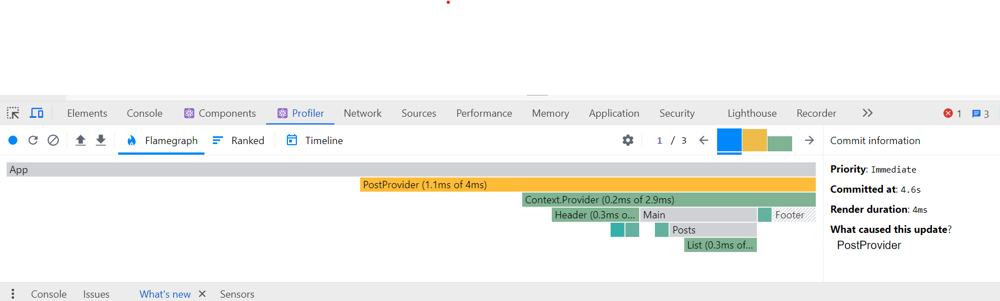

So starting with the flame graph, this is basically just another way of representing the component tree. So as the parent we have App, then we have our Provider and inside the provider we have indeed the Header and the Main which in turn contain all of these components. Now what's special about this is that some components are actually colored and some are gray. **So the gray components are the ones that did actually not render while the application re rendered.** So main, posts and app did not rerender but all these others did. **And the more yellow the color is, the longer it took to rerender.** So the PostProvider we can see took the longest.

Now in order to rank them we can, as the name says use the ranked tab.

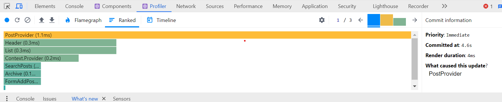

And so here we can then very clearly see for example that some of these components were really really fast(dark green) to render while this one(yellow) took a bit longer. And even though that's less than a millisecond, which is really nothing.  
Now, thanks to the setting that we activated in the beginning, we can also see why each of the components re rendered. So here⬇️, for example, we can see that the post provider re rendered because hook 2 changed.

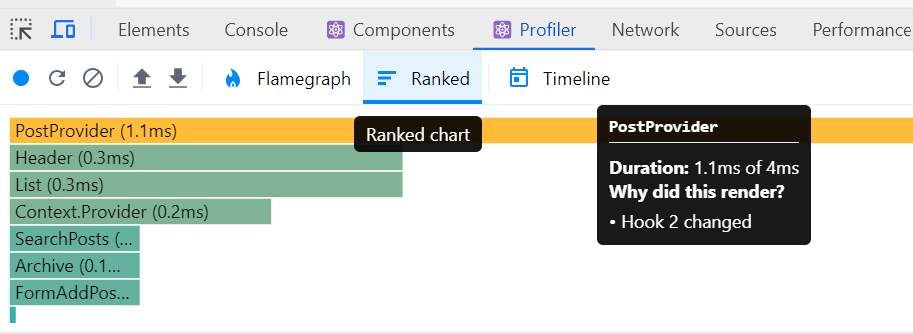

And so the hook 2 is simply the use state hook which is storing the search query. So then here the Header re rendered because context changed. So let's check that out actually in code. So indeed, the header is consuming the context and so therefore it changed as we updated the state in the context. And the Results and the Form and the List, all of them are consuming the context. And so therefore, they then also updated as the component was updated while the Main and the Post components are not consuming the context and so they did not re render. So this is how we can basically analyze this flame graph.

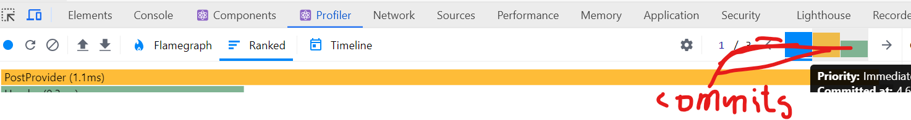

Now up here⤴️ we have the different commits how they are called or in other words each of them is one re render. So I think that's easier to understand. And so since we did 3 times the same thing here we should expect them to look basically the same. Now the timings have changed here for some reason but the components that have actually rendered and not rendered are exactly the same. Alright.

And now let's try something else. So for that we can clear and then record again, and now let's simply click on this fake dark mode button.  
So just one re render, and so then here we only get this one column. And so this time as we can see here every single component has re rendered which makes sense because the state update actually happened right in the main parent component. So here in the app component. That's why here it says that hook number 1 changed. And then we can see for example this one did render because the context changes or changed which actually seems a bit strange but we will come back to this later. So we will understand why React is saying this. So all the components that are consuming the state actually are telling us that they have re rendered because the context has changed. While these 2 which before were gray are now also colored and these 2 did re render because the parent component rendered.  
`And so again, when the parent component of the application, so the component at the top of the component tree re renders then all the child components will re render as well. Okay.`

Okay. So feel free to play around with this new tool here as much as you'd like as this will be pretty important throughout this section and also later once you start building bigger and more heavy applications which might require some performance optimization. So we will use this tool throughout this section and so make sure that you, play around again with this a bit more and then let's move on to the next lecture to talk about our first small optimization trick.

---

## `A Surprising Optimization Trick With children`

**Let's now learn about a simple performance optimization technique which leverages the children prop in order to prevent some components from re-rendering.** Now this isn't the most used technique out there but it gives us actually surprising insights into how React works internally. And so that's why I wanted to share this with you. Also, not many people know about that this is how React works and so this makes this even more interesting.  

Now in this lecture I want to bring in this Test component inside the test.js file which was part of this project in the beginning. So This test component implements a very simple counter. So it has a button to increase the count and it also displays that count and then the count also contains this LowComponent. And so what this LowComponent does is to basically create 100,000 words and place them into an array. And it then renders this 100,000 element long array, in our user interface. So let's now include that in App.js below our List just to see what's gonna happen.

```jsx
// Test.js

import { useState } from "react";
function SlowComponent() {
  // If this is too slow on your maching, reduce the `length`
  const words = Array.from({ length: 100_000 }, () => "WORD");
  return (
    <ul>
      {words.map((word, i) => (
        <li key={i}>
          {i}: {word}
        </li>
      ))}
    </ul>
  );
}

export default function Test() {
  const [count, setCount] = useState(0);
  return (
    <div>
      <h1>Slow counter?!?</h1>
      <button onClick={() => setCount((c) => c + 1)}>Increase: {count}</button>
      <SlowComponent />
    </div>
  );
}
```

So let's include that.  So let's include the Test inside the List and then let's see what we get. So we see that we have like an infinite amount of words now and the idea here is that this simulates a very slow component. And so let's see what happens as we click on `Increase` button. So I click and then it takes like half a second until the button actually updates.  
And so the reason for that is basically, each time we click on the button this state(count, setCount) updates and so this entire component needs to get re rendered. And so therefore, the SlowComponent is also re rendered each time that we click the button even though this actually isn't really dependent on the state.

The SlowComponent does not need the state at all, but still it is being re rendered simply because it is inside the Test component.  
So if you ever find yourself in a situation like this where you have one kind of slow component inside another one which updates this one without it needing it, this is where you can then use this optimization technique. So what I'm gonna do is to take the counter functionality out. Like this⤵️  
But instead here I will now render the children prop because we will now pass this slow component into the counter as children.

```jsx
function Counter({ children }) {
  const [count, setCount] = useState(0);
  return (
    <div>
      <h1>Slow counter?!?</h1>
      <button onClick={() => setCount((c) => c + 1)}>Increase: {count}</button>

      {children}
    </div>
  );
}

export default function Test() {
  return (
    <div>
      <h1>Slow counter?!?</h1>
      <Counter>
        <SlowComponent />
      </Counter>
    </div>
  );
}
```

And so this actually looks exactly the same. So the component tree will also be exactly the same where we see here that basically we still have the h1, the button, and then in the UI the SlowComponent. However, it will now work in a completely different way. So let's see what happens now when we click on the button, and we see that it is instant. Right?

So this means that actually probably this list here is no longer being re rendered. And we can actually prove that by clicking here now on the start profiling button then updating the state by clicking on the button and then stopping it. So the counter component needed to update but then we see that the SlowComponent did not render. So why is that even though basically our JSX is very similar?

So the structure of the output is very similar and indeed it does look exactly the same as it looked like here in the UI previously. Right? So the only thing that we changed is that we no longer have SlowComponent directly in Counter component but instead we pass it in as a children. So then in Counter we display it as a children.  

**So why does this work this way? Why is suddenly react no longer re rendering this component(ShowComponent)?**  
Well, again, this element, so this LowComponent has this time been passed in as a children prop. And so what this means is that this component(SlowComponent) was already created before the counter component re-rendered. And so therefore, there's no way in which this component could have been affected by the state change in the counter.

So again, as React sees this piece of JSX here, it will basically immediately create the slow component right there and then pass it into the Counter. So all while rendering. And then as we click on the button, the counter is of course re rendered but SlowComponent component has already been passed in as a prop. So it has already been created before and so it cannot be affected by that state update. It already exists.  
And so that is the reason why React then bails out of re rendering this children component because nothing could have changed inside of the SlowComponent. So React is smart enough like this and can therefore decide not to rerender this. Okay.

***And so you might actually find situations like this in the real world in your own code. And so in that case just be aware that this trick exists. So all you have to do is to refactor your code a little bit***

Alright. And this is really all I wanted to do with this test component. So let's now get our application back to normal, but this actually has another very interesting implication in the way that our context works right now. So let me again start profiling and just search once and then stop this. And so here we see again that these two components(Main and Posts) have not been re rendered.  
**But why is that? Why have they not been re rendered?** I mean, there has been a state update inside the post provider component. Right? So the PostProvider is actually just a regular component. And so when we searched, we updated this state(searchQuery) which then re rendered this(PostProvider) component. And so therefore, all the child components should have re rendered as well. Right? So all of the child should have re rendered as well if we follow that logic because all of them are child components.

**However, we see again that these two did not re render And the reason for that is exactly the same that we saw earlier with the test and the slow component.** **So the reason is that all of these child components here were actually passed into the post provider as children.** And so we are in the exact same situation as before where all these child components were already created before they were passed into this component. **And so then React once again bails out of re rendering all of them because they couldn't have possibly been affected by any state change unless, of course, they do actually consume the context itself.** So that's the case for this one.

So I hope that made sense and that you keep this technique in the back of your mind even though it is probably not used all the time. But it's very very interesting and I think this like puts you in the top 1% of React developers when it comes to knowing about this kind of stuff.

---

## `Understanding memo`

Over the next few lectures, we're gonna add three more React tools to your toolbox, the **`memo function`** and the **`useMemo`** and **`useCallback`** hooks.  
**Now the fundamental concept behind these three tools is memoization. So memoization is an optimization technique that executes a pure function one time.** **So let's say function a, and then it stores the results in memory, so in a cache.**  
Then if we later try to execute the same function again with the same inputs, it will simply return the result that was previously stored in the cache. So the function will not be executed again. And that makes a lot of sense. So if the arguments are exactly the same as before, it means that in a pure function the output will be the same. Therefore, it makes no sense to execute the entire code again if we can just read the cached result.  
On the other hand, if the inputs are different then of course the function will simply be executed again. So that's the concept of memoization.  
**But you might be wondering what this has to do with React. Well, in React we can use this technique to optimize our applications. So we can use the memo function to memoize components with exactly this principle and we can use the useMemo and useCallback hooks to memoize objects and functions.** And doing so will help us prevent wasted renders and improve the overall application speed. Okay.

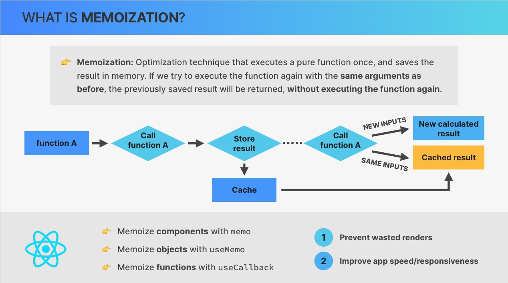

So now that we understand what memoization is, in this lecture **it's time to look at how to memoize components using the `memo function`.**  
`So react contains a memo function and we can use this function to create a component that will not rerender when its parent rerenders as long as the past props stay the same between renders. Or in other words, we use memo to create a memoized component.`

And if we think about it, this is exactly the optimization technique that I explained in the previous slide. **So the function inputs are props and calling the function multiple times is equivalent to re rendering in react.** And therefore, memoizing a react component means to not re render it if props stay the same across renders. And just like with memoizing regular functions, this makes a lot of sense because why re render the component if the input data hasn't changed at all.

**The regular behavior in React without using memo is of course that whenever a component re renders, the child component re renders as well.** **On the other hand, if we memoize the child component, it will not re-render as long as the props are the same as in the previous render.** Now, of course, if the props do change then the child component will need to re render as well in order to reflect this new data that it received.  
**`Now it's super important to keep in mind that memoizing a component really only affects props.`** **`This means that a memoized component will still re render whenever its own state changes or whenever there is a change in a context that the component is subscribed to.`** **`Because in these two situations, the component basically has new data that it needs to show in the UI. And so then it will always rerender no matter if it's been memoized or not.`**  

**So from what we just learned, memo sounds great, right? Now, does that mean that we should go ahead and memo all our components?** Well, the answer is no, not at all.  

**So memo is only useful when we're dealing with a heavy component.** So a component that creates a visible lag or a delay when it's rendered.  
Also, in order for memo to actually make sense, the **component should render quite frequently and it should do so with the same props.** And let's analyze why that is. So first, if the props are usually different between re renders, memo has no effect anyway and then there's absolutely no need to use it. And second, we learned in the 1st lecture of the section that wasted renders are only a problem when the re rendering happens too frequently or when the component is slow in rendering. Therefore, if the component only re renders from time to time or if the component is lightweight and fast anyway, then memorizing brings no benefit at all.

Okay. And now it's time to see this in action in the next lecture.

---

## `Memo in Practice`

Let's now check out a practical example of memoizing a component. So here we are still in the atomic block project, but for these next few lectures, we actually need the original app.js file from the starter files. So let's paste it right here in the project folder, and then I'm gonna rename it to App-memo.js, and then let's place it into the source folder. Okay. So the starter one because there we don't have any context yet and instead we are passing some props around, which is what we need for these next few lectures.  
Now in the Archive, let's actually remove prop and just add one called show and set it to false.

```jsx
// App-memo.js
// App component
<Archive show={false} />
```

And then let's come down here to the archive and accept that. So in this lecture, we will actually work with this Archive component. Then here let's make this show archive dependent on this show prop.

```jsx
// App-memo.js > Archive Component
function Archive({ show }) {
  // Here we don't need the setter function. We're only using state to store these posts because the callback function passed into useState (which generates the posts) is only called once, on the initial render. So we use this trick as an optimization technique, because if we just used a regular variable, these posts would be re-created on every render. We could also move the posts outside the components, but I wanted to show you this trick 😉
  const [posts] = useState(() =>
    // 💥 WARNING: This might make your computer slow! Try a smaller `length` first
    Array.from({ length: 10000 }, () => createRandomPost())
  );

  const [showArchive, setShowArchive] = useState(show);

  return (
    <aside>
      <h2>Post archive</h2>
      <button onClick={() => setShowArchive((s) => !s)}>
        {showArchive ? "Hide archive posts" : "Show archive posts"}
      </button>

      {showArchive && (
        <ul>
          {posts.map((post, i) => (
            <li key={i}>
              <p>
                <strong>{post.title}:</strong> {post.body}
              </p>
              {/* <button onClick={() => onAddPost(post)}>Add as new post</button> */}
            </li>
          ))}
        </ul>
      )}
    </aside>
  );
}
```

Alright. Let's just quickly understand what this Archive component does. So basically it creates these 10,000 random posts in the very beginning and stores them into the post state. Now by default all these 10,000 posts are not actually shown because we have the show archive state set to false. At least that's what the incoming prop(show) is.

But as soon as I click on the button(Show archive Posts), it will actually open this list of posts. Now let me actually increase the number here a bit to 30,000. So let's see again that when I click on this button it actually takes a long time for the entire thing to render. So that's probably like almost a second here.

Now the problem is not that it takes a long time to render this list because that's just completely unavoidable. So it's so many items that of course it will take some time. Now the problem is that this will slow down the entire page. See what happens when we type something into the search bar? So notice how this created a big lag. So as we type, it takes like half a second until that letter actually appears there.

And so let's now also inspect this using the profiler. So let me actually reload again so that the archive is closed. And so then we will do a before and after, so before and after showing archive.

Start Profiling. So now I type and it is really fast. But now let's open the archive so we have a second rerender. And then let's type something. And now it is really slow, but just watch how slow that actually is.

So here(in profiler), we have the 3 re renders that happened, and by the size of the bars we can already see that this last one, so the second letter was really slow. So here the first keystroke for the there was just normal. So everything took like 1 millisecond or 3 milliseconds. So something really, really fast.  
But then what how long it took to render the archive? So it took 131 milliseconds and that's just the rendering itself. So just calling the function then painting the whole thing to the DOM took even longer than that. So probably like one entire second. But anyway, what matters to us is here this second keystroke, so keypress after showing archive.  
**So notice how the archive re rendered when I typed something. And so the reason for that is of course that the archive is a child component of the app component which is where that state actually lives.** And so if we update the state in the app component that will then, as we already know, trigger a re render in all the child components. And so that includes the archive. And notice how it took even so long that all the other components don't even have space to appear in this flame graph. But if we take a look at the ranked chart then we see all the other components. And so we can see how fast all of them are in comparison to the archive.  

Alright, this is the real problem that we have which is that typing here now makes the entire application really really slow because it always needs to real render this really slow component(Archive Component). **And so this archive component is a perfect candidate for memoization.** So let's do this now in practice.

---

**So the way we do that is to just wrap the entire component function into React's memo function.** So we just call memo which is then imported from React just like use state or use effect. And then we just wrap everything into that function call.

So basically we call memo with a component function as an argument and then this function will return a brand new component. And so then we need to store that component also somewhere and so we create a variable which we call again Archive.

```js
const Archive = memo(function Archive({ show }) {
  ...
})
```

So the memoized version of the original archive. And we could probably even remove the duplicate name from second Archive and make this an anonymous function but I guess it's best like this. With this we have actually successfully memoized the archive component.  

**And remember that this was a great candidate for memoization because the archive component is very heavy. It re renders very often and it does so with the same props.** So the only prop that it has is this show prop which is always false.

And so let's now do exactly the same profiling that we did before in order to show if it improved our situation. So let's start here. So that was fast because the archive is still closed. And this of course takes exactly the same time as before, which makes sense because as we just learned, memoizing a component has nothing to do with updating state. So memoizing only affects the props. So that list still has to be rendered and so that still takes time. But what should have changed is the time that it takes to now rerender as we type something else here. So let's try that and we can immediately see that this was really fast.

So the prop that it received is show which is always true. And so then this component didn't have to re render as the parent re rendered. And so with this, so with the simple memoization just made our component really fast and snappy again.

Great. So this is why and how we memoize a component in React.  

---

**But now let's do something that will break this memoization so that I can then introduce the next lecture so that we can then solve that problem in the future.** So let's say that now instead of passing in this prop **`<Archive show={false} />`**, I instead want to pass in an object. So let's create an object here called archiveOptions and then let's say show is false and the title let's say, post archive in addition to main posts.

```js
// App-memo.js > App component
const archiveOptions = {
    show: false,
    title: "Post archive in addition to main posts.",
  };

// In JSX
<Archive archiveOptions={archiveOptions} />
```

And now let's get that in Archive component. And now here we use Archive options.show and here we use archiveOptions.title.

```jsx
// App-memo.js > Archive Component
const Archive = memo(function Archive({ archiveOptions }) {
  const [posts] = useState(() =>
    Array.from({ length: 30000 }, () => createRandomPost())
  );

  const [showArchive, setShowArchive] = useState(archiveOptions.show);

  return (
    <h2>{archiveOptions.title}</h2>
    ...
})
```

Give it a save then let's reload and then let's run exactly the same experiment as before.

**So just typing something here then opening here the archive which has always take some time. And now as I type notice how it will be back to taking a long time. So you saw that? And indeed we are now back to basically re rendering this component even though it is memoized and even though it looks as though our prop hasn't changed. So the archiveOptions that we received still looks the same as before.**

**But still our Archive component was re rendered again. So let's now find out why this is and how we can fix that in the next lecture.**

---

## `Understanding useMemo and useCallback`

In the last lecture, we found a situation where the memo function didn't actually work as expected. And so let's now understand why that happens and learn about the solution. And let's start from what we already know. So we know that **in React, whenever a component instance re renders, everything in there is recreated**. So all values are always created again and that includes objects and functions that are defined within the component.

So a **new render gets new functions and new objects even if they are the exact same ones as before.** We also know that **in JavaScript, two objects or functions that look the same, so that are exactly the same code are actually different unique objects**. And the classic example is that an empty object is different from another empty object. **Now from these two pieces of information we can understand that if we pass a function or an object to a child component as a prop, that child component will always see them as new props whenever there is a re render.** And if props are different between re renders, then memo will simply not work. So it will not do its job.

**`So in summary, if we memoize a component but then give it objects or functions as props, the component will always re render anyway, because it will always see these props as new props even when they actually look exactly the same.`**  

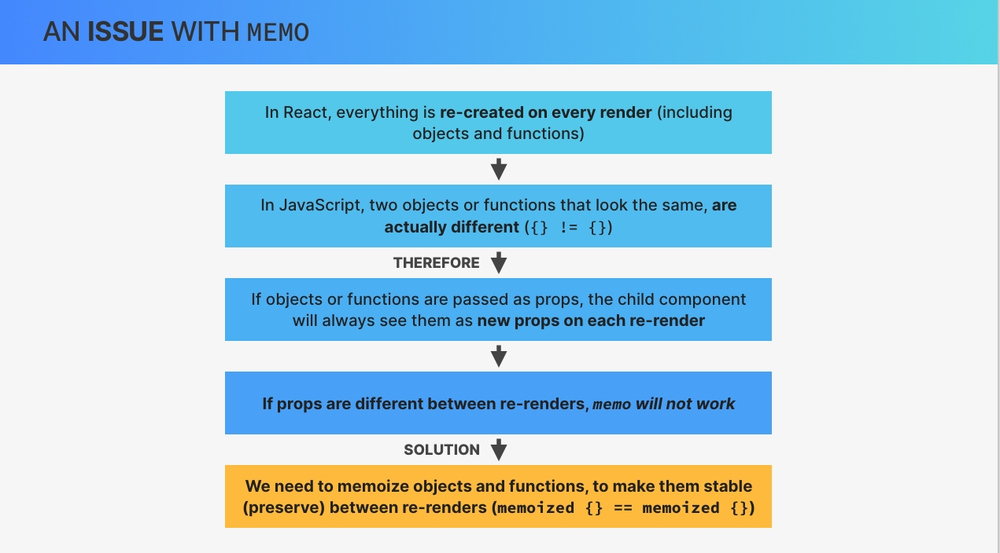

Okay, but there must be some kind of solution, right?  
Well, of course there is. So we can make objects and functions stable. So we can actually preserve them between renders by memoizing them as well. **And to do that, React gives us two more hooks, `useMemo` and `useCallback`.**

We can use `useMemo` to **memoize any value** that we want to preserve between renders and `useCallback` to **memoize functions between renders.** And I will just use the word values for everything here because useCallback is actually just a special case of useMemo.

**But anyway, what does memoization of values actually look like?**  
Well, the idea is similar to the memoization that we just talked about before. So whatever value that we pass into useMemo or useCallback will basically be stored in memory. And that cached value will then be returned in future re renders. So it will be preserved across renders as long as the inputs stay the same. **Now, in the case of useMemo and useCallback, these inputs that I just mentioned are called dependencies.**

**So just like the useEffect took useMemo and useCallback also have a dependency array.** Whenever one of the dependencies change the value will no longer be returned from the cache but will instead be recreated. So this is very similar to the memo function where a component gets recreated whenever the props change. It's just a different thing that we're memoizing here and a different way of specifying the inputs. But the idea is the same. And this will all become quite clear once we start writing the code. But for now, let's visualize what we just learned.  

**So the regular behavior in React when we do not memoize a certain value is of course that a new value is created whenever the component re renders. On the other hand, when we do memoize the value then no new value is created on re render and the cached value is returned instead.**  
And so like this, the value will stay exactly the same. So it will be stable across renders. **However, this is only true if the dependencies that we specify in the dependency array don't change.** **If they do change then a new value is actually created as if the memoization has never happened.** Okay.

**Now, this all sounds great, but when do we actually need this?**  
**Remember that we started this lecture by saying that we need to make objects or functions stable in order to actually make the memo function work.** In other words, if props are objects or functions, we need to memoize these props in order to prevent wasted renders. So that's what the very first slide of the lecture was all about, right? And this use case is probably the biggest use case for useMemo and useCallback. And it made it very easy to understand why there is a need for these hooks.

However, there are actually two additional use cases. **So the second use case is to avoid expensive recalculations on every render.** For example, you might have a derived state that is calculated from an array of 100,000 items. Now, if your component re renders all the time, then React needs to do this expensive calculation over and over again each time there is a render.  
And so to fix this you can simply preserve the result of that calculation across renders using useMemo. And so then, React doesn't have to calculate the same thing time and time again.

**Finally, another use case is memoizing values that are used in the dependency array of other hooks.** For example, in order to avoid infinite useEffect loops.

**Now just like with the memo function, it's important to not overuse these hooks.** So you should probably only use them for one of these three use cases and not start memorizing every single object and function everywhere. But anyway, with all this being said, it's time to finally try this out with code.

---

## `useMemo in Practice`

**Let's now use the useMemo hook to fix that problem that we created ourselves with the archive component earlier.** So remember how earlier we created an object(archiveOptions) and then pass that as a prop into the archive component. Now the problem with this is is that doing so actually breaks the memoization that we created for the archive component.

So as we just learned in the previous lecture, the reason for that is that this object is recreated over and over again each time that the App component re renders. And so basically, then the prop that the archive receives will always be different. And so then, of course, memo doesn't do anything. So what we need to do is to make this object stable over time. And so that's where the useMemo hook comes into play.

So let's use that hook. So useMemo which again needs to be imported from React. So let's call that but now it is actually not as simple as just wrapping this entire object(archiveOptions) into useMemo. So that's not how it works.  
**Instead use memo actually takes in a callback function which will be called on the initial render.** So very similar to the useState hook. So in this case, all we need is an arrow function which we want to return our object. **So this callback function is basically the work that should be performed on the initial render and which result should be then stored in the cache.** So should be stored in memory so that react can remember it across re renders.

```js
const archiveOptions = useMemo(() => {
  return { show: false, title: "Post archive in addition to main posts." };
}, []);
```

Now in this case all we're doing is to return an object but there could be also some more intensive calculation going on which is the reason why useMemo takes in a function and not just a value. Alright. So again, **whatever we return from this callback function will be saved in the cache.**

**And so then remember we also need to pass in the dependency array as a second argument, which will basically determine when this whole calculation here is executed again.** So just like the useEffect took, right?

**So by specifying an empty dependency array here that means that this value will only be computed once in the beginning and will then never change.** So it will never be recomputed. And so this⤴️ should actually already have fixed it.

And of course, we want to profile this again. So this is fast as always. Then we just open this again, which takes its time. And now we will see if that memoing has worked. And it was really fast so it looks like it did and indeed the archive was not rendered in the beginning and also not as it was already opened. Great, so we fixed the problem and or memoized component is now back to working. So we have now this stable value over time which will simply be taken from the cache as long as the dependencies don't change.

And speaking of the dependencies, right now we don't have any dependency but actually let's create some or at least one. So here I now want to change the title to use a stateful variable. So to use the, the post.

So now here I want to say post archive in addition to and then the number of the main posts. So that is post.length.

```jsx
const archiveOptions = useMemo(() => {
  return {
    show: false,
    title: `Post archive in addition to ${posts.length} main posts.`,
  };
}, []);
```

And so now we need to specify that value here in the dependency array because otherwise this object here will never be recomputed. And so let me first show you that actually this is how it works. So right now it says here in addition to 30 main posts. So let's add another one and watch what happens. So here it now says that 31 posts were found but down here we still say 30. And so that's because react is still reading this object from the cache which it didn't update because we didn't place this post variable into the dependency array. And so therefore, this function here was never called again and so then react is still using the stale value of this post state.

So here we are again in the presence of `stale state` and of a `stale closure`. **So a stale closure because this function here was created initially and from there on it now remembers all the variables that are referenced inside of it as they were at the time that the function was created. So that's what a closure is and it is a stale closure because it never run again.** And so it is still remembering the old values. So that's one of the weird things about React which is very confusing for beginners. But that's why I'm talking about this time and time again because this is the kind of stuff that you really need in order to master React.

But anyway, let's now then place the entire thing here into the dependency array. So not just posts but really posts.length which is a lot better because post is an object and posts.length is a primitive. So it's always best to have primitives in the dependency array. And we will learn more about that even later in this section.

```jsx
const archiveOptions = useMemo(() => {
  return {
    show: false,
    title: `Post archive in addition to ${posts.length} main posts.`,
  };
}, [posts.length]);
```

But anyway, you can see that it actually already updated there to 31 but let's change this again or test this again. So 31 up there and beautiful. Now it updated down here as well.  
Now the consequence of this is that whenever this archive is open it will then take a long time to rerender the application when we add a new post. Right?

So let's check that. And now I will just call something very short so that we don't get all those re renders in the profiler. And then notice how that took some time. And so indeed we can see that here in this last state update where now the archive of course still had to re render because now this time our object here actually has been recreated. So we added a new post and therefore posts dot length was changed And so then this object here became a new object making it so that the prop changed which in turn triggered the archive to be re rendered as a result even though it is memoized.

Okay, So hopefully all of this made sense and later on we will actually see another use case of the useMemo hook. But for now let's move on to the use callback hook.

---

## `useCallback in Practice`

After useMemo, now it's time to quickly also use useCallback. **And the goal of the useCallback hook is to memoize functions.**

And so to test this, let's now pass in a function again into the archive component. So let's now bring back the on addPost prop that we had here initially. So on addPost should be handleAddPost.

Now the problem with that is is that now we are back to having the same issue as before. So let's again Well, first let's close this actually so that we have the before and after. And actually let's this time test with this button here. So this fake dark mode button also changes state on the app component. And so it will also re render the archive. So let's click that then let's open the list and then let's set the state again. And so maybe you saw that it took a long time. And, yeah, so we are back again to having our memoized component rerender even though it is memoized. **So we had the same problem earlier in the previous lecture because of this prop which is an object but we solved that by memoizing it using useMemo. And so now we have the same problem but with a function.**

**And the solution is the same. So the solution is also to now memoize the function. And so let's do that by using the useCallback hook make sure that it gets imported from react and then the dependency array which is empty. And so this will then return the memoized function which we can then store into a regular const variable.** Okay. And that's actually it.

```js
const handleAddPost = useCallback(function handleAddPost(post) {
  setPosts((posts) => [post, ...posts]);
}, []);
```

**`useMemo` and `useCallback` are pretty similar but the difference is that `useCallback` will not immediately call the function, but will instead simply memoize the callback function. While `useMemo` will simply memoize the result of calling the callback function.** So that's the main difference. useMemo just stores a result, so like a value which is the result of callback while in useCallback only the function itself is actually memoized.

Alright. And so this should already be enough to solve our problem.

**Some teams for some reason choose to wrap each and every function and value into a useCallback or a useMemo.** **But** that actually makes very little sense and it might even do more harm than good in most of the cases. So using one of these functions useCallback actually has a cost as well. So React needs to run the function/object and needs to store the function in memory. And so that only makes sense if we actually see some improvement in our application.

*Now one thing that I wanted to mention is that in the future the need to doing any of this stuff, like any of the **memoization** might actually **disappear** completely because the React team is currently researching a compiler that would basically automatically memoize all the values that need memoization behind the scenes.*

But still, even with that on the horizon, it is still very good to know about all of this stuff. `1st`, because that **compiler might actually never happen**, and `second`, because you will still see these hooks here all the time in a bit older code basis.

And finally, I want to just quickly finish with a small experiment. So let's pass in another function into our Archive component but this time a special one. So let's say this `setIsFakeDark` function and I say special because this is the function that is returned from `useState`. So we are now passing a callback function as a prop which we did not memoize.

```jsx
// in App Component
const [isFakeDark, setIsFakeDark] = useState(false);

<Archive
  archiveOptions={archiveOptions}
  onAddPost={handleAddPost}
  setIsFakeDark={setIsFakeDark}
/>
```

So let's see if that will then again slow down our component. So let's record. Maybe you noticed that actually the archive did not re render. **The memoization is indeed still working. Even though we did not memoize `setIsFakeDark`.** **So why do you think that is?**  
**Well, basically react guarantees that the setter functions of the useState hook always have a stable identity which means that they will not change on renders.** So we can basically think of the state setter functions as being automatically memoized. **And in fact this is also the reason why it's completely okay to omit them from the dependency arrays of all these hooks.** So from useEffect useCallback and useMemo.  

Okay. Now that's actually all I had to tell you about these three important tools. So **memo**, **useMemo** and **useCallback**.  
And actually, next up we will use some of these tools a bit more to optimize context.

---

## `Optimizing Context Re-Renders`

Let's now take a look at a **few strategies that we can use in order to prevent wasted renders related to the context API**. And for that let's actually come back to our app.js which is the one where we already use our context. So notice how here we don't pass around any props anymore and we use our custom hook that is coming from our context.

Okay. And now let's see what we can do in PostContext.js to optimize this a little bit.  
**But before we go do that, it's actually very important to understand that you only need to optimize your context in case that three things are true at the same time.**

1. **The state in the context needs to change all the time.**
2. **The context has many consumers.**
3. And 3rd and probably most importantly, **the app is actually slow and leggy.**

So only if all of these are true, it is time to optimize context. The actual optimization of your context can be quite confusing because it's gonna depend a lot on how you build your application and how you set up your context and also what exactly you pass into the context. And so I cannot give you a clear recipe here but I will just try to show you a few different things here.

So first of all remember that we are already doing that optimization where we pass the children into the component. So what we render are simply the children that we pass in to the PostProvider. **And so remember from earlier that this makes it so that these children are not all automatically re rendered because they were already created before they were actually passed into PostProvider component.**  
And so this alone is already a good optimization technique. So if we just had basically this PostProvider right in the app.js file, So basically what we did earlier in App-v1.js. There we had children directly inside the post context provider. And then all of these children would also automatically have been re rendered as we changed the state inside that context. **So we already have that optimization going on, but if for some reason you are not doing that then you should memo all of the direct children of that context.** So basically what we did earlier which is to wrap Header component and the Main and the Footer all into a memo. So memoizing those components so that they don't automatically re render once we update the state in the context.

So that's one of the guidelines that I can give you. So **doing either the technique with the children** or to **memoize the direct descendants of the context**.

Now next up, let's try to see what happens when we update the state in the application above our provider, for example, change dark/light mode. This state lives in the App component but since the PostProvider is a children of that, it will then also automatically rerender. And so let's see what happens then.

And for that let's also turn on again this setting here, so recording why each component rendered. Then let's clean this. Let's clean this as well, and then let's just start recording. And now what I'm gonna do again is to change the state in a component that is above our custom provider component. So let's see what happens. And indeed, now all the components did re render. **However, they did re render for a different reason that we might think.** So of course app itself was rerendered because the state changed but then the Main was rerendered because the parent rerendered. So that makes a lot of sense. Right? The same here in Posts component and then we would expect the same to also happen in the List.  

**However, the list did actually re render because the context changed.** Well, that's strange, right? Because this state with the dark mode actually has nothing to do with context. But still, all the components that consume the context did now re render because of context. So the same thing in the Archive as well. And just keep in mind that we are now working with a different app where we no longer have the archive memoized. Remember?

But anyway, we would have thought that all of these components re rendered because their parent re rendered which is what makes sense for these 2, for example, not because the context changed. So why does that appear here? Well, the reason is that this value right in the PostContext.Provider is an object, right? And this post provider is a child element of the app component. And so therefore when the app component re renders then this PostProvider re renders as well and therefore this object will be recreated. And so if this object will be recreated it means that the context value has changed. And therefore, all the components that consume that context are going to be re rendered.  
Alright. So that's the reason why here we see that the context has changed because actually it did change because this value, so this object did update.

So the solution for that is to memoize this object.

```jsx
const value = useMemo(() => {
    return {
      posts: searchedPosts,
      onAddPost: handleAddPost,
      onClearPosts: handleClearPosts,
      searchQuery,
      setSearchQuery,
    };
  }, []);
```

Now as we save this, this will create a few additional problems. So let's see. And so indeed, we are now missing the searchQuery and the searchedPosts in dependency array.

So we didn't actually fix the wasted render itself, but we did fix the fact that this render was caused by our context.

And so if we were to memo now these components, for example let's try out the Main component, then none of these components should render anymore. Now again in this case since we don't really have this app very slow there's no need really to memo this but all this is more to show you. Just like this:

```jsx
const Main = memo(function Main() {
  return (
    <main>
      <FormAddPost />
      <Posts />
    </main>
  );
});
```

Now, actually I was expecting that React would ask me to also include these two functions(handleAppPost and handleClearPosts) into the dependency array because it seems to me that they are also dependencies of this object. So in case you get that then you need to these to the dependency array but if you do that then you also will need to wrap these tow handler functions into a useCallback because otherwise on each re render these functions will be recreated again which will then in turn also make this object to be recreated again. Alright? But in this case that didn't really happen.  
Let me just see what happens if I do handle that post here. Yeah. So then I get that warning that I was just telling you about which is that `this function makes the dependencies of the use memo hook change on every render. So move it inside that callback or wrap it in its own use callback.`

Let's finally also check what happens when we update the state that is actually part of the context itself. So, let's search a post. Then of course all the components that, consume this context are re rendered. So that's the List, the SearchPosts, the Header itself and the Archive. So here we always have all of them and then we can see that also all of these were re rendered because context has changed. **Now I'm showing you this because if you have many many components that are subscribed to a context, so that read data from a context it will become problematic to have so many different variables inside the context value.** Because as soon as you change one of these states, then all of the components that read at least one of these five values will get re rendered.  
And so again, this is not ideal and it's the reason why in the beginning I told you that **we usually create one context per state.** So we would have one post context and one search query context. And so in that situation whenever we updated for example the search query then all the components that consume the post would not get re rendered. While in this case, all of them are because it is enough for one value here to change to re render the entire thing.

Now, I'm not gonna do that right here but again, you can basically create one context for Posts(Posts, onAddPost, onClearPosts) and one context for search(searchQuery, setSearchQuery). And then what some people do is to even take it one step further. So inside the search query context, you could even create one context only for the search query and one only for the state updater function. **Or if you're using a reducer, you could then create one context for the state and one context for the dispatch function.**

These were just a few general guidelines that I hope will become useful for you in the future.

---

## `Back to The WorldWise App`

It's time to shortly go back to the world wise application in order to see whether there are any performance issues and whether there is anything that we need to optimize in terms of wasted renders.

And so now I want to use the profiler here as well. So just like we did previously in that other application. And let's actually make this window a bit bigger so that we can see exactly what's gonna happen. So what I want to do for now is just record walking through the entire application to check if there are any performance bottlenecks. So to see if there is any component that might perform really badly.

So let's start profiling and then let's just follow the flow of the application. So we can go to all of these different components or pages.

So we created 21 renders in total. And so let's now see if any of them was really slow. So in order to identify some really bad performing components, it's best to come here to the ranked tab.

So it seems like in this application we have absolutely no problem with performance, which of course is very nice to see.

Okay. Now let's go back to our code to see what we can do. And actually not a lot because everything is working really fluidly. So earlier we were optimizing our context but here there's not much to do.

There's not really a need to memoize this value from the CitiesContext because we don't have any component above this provider in the component tree that might re render this one. And so I think that there's actually nothing to do in CitiesContext.

Now let's just remember that there was some issue earlier. And so we are now actually ready to fix that. So if we come back to our City.jsx, remember that in the useEffect we left out the getCity function. *So here we see that issue where ESLint is telling us to add the get city. But remember that this created like an infinite loop of HTTP requests to our API.* But let's put getCity in dependency array.

```jsx
useEffect(
  function () {
    getCity(id);
  },
  [id, getCity]
);
```

Let's just reload the page and come actually to the network tab, clean all of this, and then watch what happens when I click on one of these cities. And indeed, immediately we get like a 1,000 requests and it keeps going even though the number here is not going up. Now we can even see the same in the profiler. So if we go back and then start profiling, clicking on any city, and then I will just leave it for a few seconds, That should be enough. And you see that we have 60 state updates only in this, like, 3 seconds that I waited.

**And so clearly, there is something wrong here. And this is the only thing that we need to fix now using the tools that we learned before.**

But first of all, of course, we need to understand what is actually happening. So now that we have getCity function in our dependency array, the effect will re-run each time that the getCity function gets updated or in other words that it gets recreated.

**Now when does this function get recreated?**

Well, since it lives in the context. So it is created in this citesProvider. But the problem is that this getCity function will update the state each time that it is executed, which will then end up in an infinite loop. So in useEffect we call the getCity function. And so that function will then update the state in CitiesContext component. Then this component will re render which will recreate getCity function. And as the function gets recreated since it is in the dependency array then getCity will get called again which then again will update the state which will re render which will cause the effect to run over and over and over again.

**How do you think we can fix this?** **So the solution is not to remove getCity function from the dependency array because that is not allowed in React. Instead what we need to do is to make this function stable.** So we need it to not be recreated on each re render. And the way we do that as you hopefully know is by using the `useCallback` hook.

So let's create a new variable which will be the new getCity function and this will then be the result of calling use callback. Then our dependency array which will need probably this currentCity.id.

```jsx
const getCity = useCallback(
  async function getCity(id) {
    if (Number(id) === currentCity.id) return;

    dispatch({ type: "loading" });
    try {
      const res = await fetch(`${BASE_URL}/cities/${id}`);
      const data = await res.json();
      dispatch({ type: "city/loaded", payload: data });
    } catch (err) {
      dispatch({
        type: "rejected",
        payload: "There was an error loading the city...",
      });
    }
  },
  [currentCity.id]
);
```

*Just having this kind of warning is reason enough to really always install ESLint in your projects. So without it you will create so many bugs.*

So this is one of these real world situations in which we will really need to reach for this tool(useCallback, useMemo etc). So that's why it's really important that you paid good attention throughout this section.

And actually remember that when I first introduced these hooks this was exactly one of the 3 use cases that I talked about. **So memoizing values that are used in the dependency array of another hook in order to prevent infinite loops.**

---

## `Optimizing Bundle Size With Code Splitting`

So we've talked a lot about optimizing wasted renders and overall app performance. However, probably the most important thing that we can and **should optimize is the bundle size**.

And so let's now learn how to do that. But before we go check out the code, we first need to understand what that bundle actually is. And let's start at the very beginning.
  
So whenever some user navigates to our application, they are basically visiting a website that is hosted on some server. So that's just how every single website and web application work. Now once the user actually navigates to the app, the server will send back a huge JavaScript file to the client that is requesting it. And this file is the bundle.

**So the bundle is simply a JavaScript file that contains the entire code of the application. And it is called a bundle because a tool like Vite or Webpack has bundled all our development files into one huge bundle, which contains all the application code.** This means that once the code has been downloaded, the entire react application is loaded at once, which essentially turns it into a single page application that is running entirely on the client. So whenever the URL changes in the app, the client just renders a new react component, but without loading any new files from the server because all the JavaScript code is already there in the bundle. **The bundle size is the amount of JavaScript code that every single user needs to download in order to start using the application.**  
So if the bundle has, for example, 500 kilobytes then all those bytes need to be downloaded before the app even starts working. And of course, the bigger the bundle, the longer it's gonna take to download, which can become a huge problem. Therefore, bundle size is probably the most important thing that we need to optimize. And thankfully for us and for our users, it's not very hard to do. **So we can just use a technique called `code splitting`.**

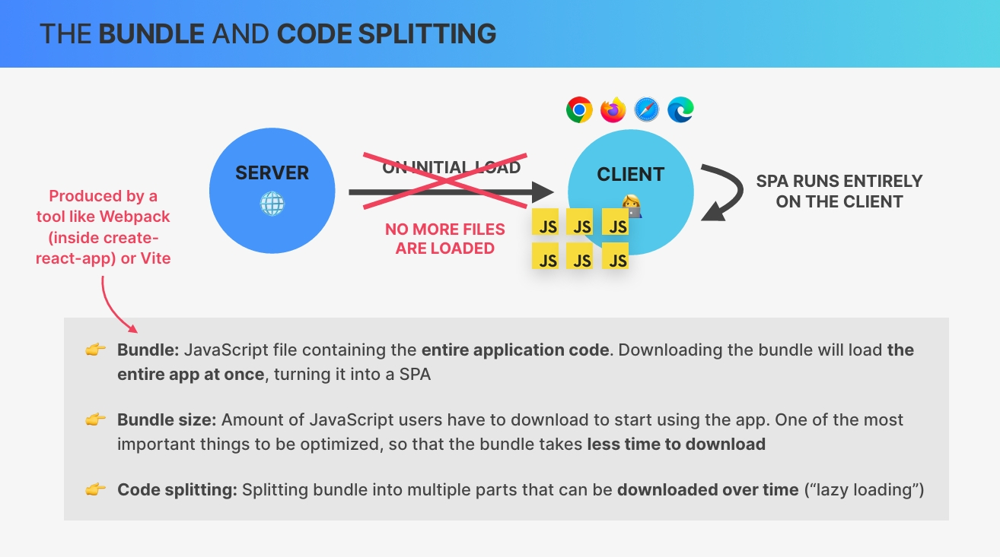
  
**`Code splitting` basically takes the bundle and splits it into multiple parts. So instead of just having one huge JavaScript file, we will have multiple smaller files which can then be downloaded over time as they become necessary for the application. And this process of loading code sequentially is called `lazy loading`.** And this really is one of the biggest performance gains that you can achieve for your users. And so let me now show you how it's done in practice.

Now there are many ways in which we can split the bundle. So in which we can lazily load our components.  
**The most common one is to split the bundle at the route level or in other words at the page level. So basically what we're gonna do is to take all the components that represent a page and load each of them separately.**

That's what most applications do, but of course we don't have to do it this way because this feature has really nothing to do with react router. So any component can be lazy loaded in the way that I'm gonna show you.  
So let's actually do that. And so let's first identify our pages. So it's the `homepage`, the `product`, the `pricing`, the `login`, then here the `application` itself which is an app layout, and finally page `not found`. So those are our 6 pages in our App.jsx.  

And so let's comment out all the import statement and we will now lazy load these. **So instead of writing import let's now write just the name of the component, for example, homepage, and then we use React's lazy function.**

```jsx
import { lazy } from "react";

// import Product from "./pages/Product";
// import Pricing from "./pages/Pricing";
// import Homepage from "./pages/Homepage";
// import Login from "./pages/Login";
// import AppLayout from "./pages/AppLayout";
// import PageNotFound from "./pages/PageNotFound";

const Homepage = lazy();
```

So this lazy function here is actually a feature that is built into React and then Vite or Webpack, they will automatically split the bundle when they see this lazy function.

Now actually thinking of these bundlers I had the idea that I should even show you how the bundle looks like right now before we do lazy loading.

Just run the following command in terminal

```bash
npm run build


# Now the size of bundled files
dist/assets/index-80383d0a.css   29.96 kB │ gzip:   5.07 kB
dist/assets/index-f4b8bec1.js   509.64 kB │ gzip: 148.79 kB
```

Let's actually implement the lazy loading. And so in lazy function we now need a callback function which will then call the dynamic import function, which is actually part of JavaScript. And so there we then need the path to the component itself.

```jsx
const Homepage = lazy(() => import("./pages/Homepage"));
const Product = lazy(() => import("./pages/Product"));
const Pricing = lazy(() => import("./pages/Pricing"));
const Login = lazy(() => import("./pages/Login"));
const AppLayout = lazy(() => import("./pages/AppLayout"));
const PageNotFound = lazy(() => import("./pages/PageNotFound"));
```

That should be it. Let's reload this at the root. And for now everything is working fine.

**But this is actually not yet the end of the story. So this is only the first part, but now we also want to display a `loading spinner` while we go from one page to the other one.** So basically while these pages are gonna be loaded in the background.

**This is now where the React `suspense API` comes into play for the first time.**  
**`Suspense` is a concurrent feature that is part of modern React and that allows certain components to suspend, which basically means that it allows them to wait for something to happen.** And in our case, these lazy components are gonna be suspended while they're loading. **And so we can then use the built in suspense component to show a fallback,** which in our case is gonna be that loading indicator that I just mentioned.

So let's come into our tree in App.jsx and above the **`Routes`** let's then include **`Suspense`**. So making sure that component has been included from React and then here is where we specify the fallback prop.  

```jsx
import { lazy, Suspense } from "react";
import SpinnerFullPage from "./components/SpinnerFullPage";

<Suspense fallback={<SpinnerFullPage />}>
  <Routes>

  </Routes>
</Suspense>
```

So here this then takes a React element which is going to be our Full page spinner component. So **SpinnerFullPage**.

```jsx
function App() {
  return (
    <AuthProvider>
      <CitiesProvider>
        <BrowserRouter>
          <Suspense fallback={<SpinnerFullPage />}>
            <Routes>
              <Route index element={<Homepage />} />
              <Route path="product" element={<Product />} />
              <Route path="pricing" element={<Pricing />} />
              <Route path="/login" element={<Login />} />
              <Route
                path="app"
                element={
                  <ProtectedRoute>
                    <AppLayout />
                  </ProtectedRoute>
                }
              >
                <Route index element={<Navigate to="cities" replace />} />
                <Route path="cities" element={<CityList />} />
                <Route path="cities/:id" element={<City />} />
                <Route path="countries" element={<CountryList />} />
                <Route path="form" element={<Form />} />
              </Route>
              <Route path="*" element={<PageNotFound />} />
            </Routes>
          </Suspense>
        </BrowserRouter>
      </CitiesProvider>
    </AuthProvider>
  );
}
```

And with this we should be good to go.

### `Short Recap`

With lazy loading we will now load each of the components as we need them, which will basically automatically split our bundle into separate chunks. And it is Vite in our case here that's gonna take care of that. And so then, of course there will be a time while we navigate from one page to the other where that chunk has not been downloaded yet. So for example if we go to login then that page has not been downloaded. **And so then this entire thing, so this lazy functionality is powered by the suspense API.** And so that will make the component basically suspended in the meantime, which will then display the loading spinner. And then once that has arrived, it will no longer be suspended and then the content, so the **children of the suspense** is gonna be displayed. So it's gonna be rendered. So let's see if that works, and let's actually do some throttling here like a slow 3g so that we can actually see this happening.

So our app layout which is the main part of the app and so that's why that takes a bit longer. Okay. Great. And of course, now if we go back, so the second time everything is gonna work really fluidly. Beautiful.

So this really is the most important feature I would say that we should always implement in any React application that we're building.

And now to finish, let's just see the actual chunks that Vite has created for us. So npm run build. So these chunks here are not gonna be exactly the same ones as in development because in development everything is a bit different. So this year is already optimized for production and so we see that it all is very different.

```bash
dist/assets/Logo-515b84ce.css             0.03 kB │ gzip:   0.05 kB
dist/assets/Login-f39ef3ff.css            0.35 kB │ gzip:   0.22 kB
dist/assets/Product-cf1be470.css          0.47 kB │ gzip:   0.27 kB
dist/assets/PageNav-d3c5d403.css          0.51 kB │ gzip:   0.28 kB
dist/assets/Homepage-380f4eeb.css         0.51 kB │ gzip:   0.30 kB
dist/assets/AppLayout-c49eff02.css        1.91 kB │ gzip:   0.70 kB
dist/assets/index-bc46b829.css           26.29 kB │ gzip:   4.39 kB
dist/assets/Product.module-02d70b80.js    0.06 kB │ gzip:   0.07 kB
dist/assets/PageNotFound-76345d1b.js      0.15 kB │ gzip:   0.15 kB
dist/assets/Logo-3d9995eb.js              0.21 kB │ gzip:   0.19 kB
dist/assets/PageNav-21d573e9.js           0.54 kB │ gzip:   0.28 kB
dist/assets/Pricing-1a60ac6e.js           0.65 kB │ gzip:   0.41 kB
dist/assets/Homepage-023b2e86.js          0.67 kB │ gzip:   0.41 kB
dist/assets/Product-bad98dc9.js           0.86 kB │ gzip:   0.49 kB
dist/assets/Login-3e5f39d4.js             1.04 kB │ gzip:   0.55 kB
dist/assets/AppLayout-654539fc.js         7.27 kB │ gzip:   2.83 kB
dist/assets/leaflet-src-3b9745fd.js     149.57 kB │ gzip:  43.34 kB
dist/assets/index-35f22fc7.js           351.12 kB │ gzip: 102.05 kB
```

So we have lots of different chunks now here which are then all lazy loaded. So you see that we still have a huge one right at the end. Alright. So we could now try to lazy load some other components.

So remember that it doesn't only work with routes, but I think that this is good enough. So for example the AppLayout itself was apparently 156 kilobytes. And so it's really nice that we got that out of the main bundle. And notice how even the CSS is also split into multiple parts. Alright.

**So really nice feature and, yeah, again powered by both the bundler, so Vite or Webpack and the lazy function provided by React plus the import function provided by JavaScript and then also the suspense component.**  

And with this, we have now actually finally really completed this world wise application. So this was the last video in which we worked on this project. And so once again, congratulations for finishing this big project where we learned so many new things and covered so much ground.

---

**`30/10/2024`**  
**`Yougo House Rawalpindi`**

---

## `Don't Optimize Prematurely!`

Let's wrap up the performance optimization part of this section with a quick list of do's and don'ts. So the main message of this lecture is that you should not optimize prematurely. And what do I mean by that? Well, basically **don't optimize anything if there is nothing to optimize**. So if your app is performing just fine, then don't just wrap all your components into a memo or all your values and callbacks into useMemo and useCallback.  
Also, there's no need to optimize context if it's not slow and if it doesn't have many consumers. So doing all these things can actually do more harm than good because memoization itself can have a slight hit on performance. And so if you have a 1,000 useless useMemos, it can actually all add up and then even worse than the performance of your application.

Instead, what you should do is to find actual performance bottlenecks using the profiler tool that we learned about in the section or even better identify problems visually. For example, when you see a laggy and sluggish UI because then you can focus on those real performance issues and fix them. For example, by memoizing expensive re renders or expensive calculations. Now when it comes to the context API, it only makes sense to optimize re renders if a certain context has lots of consumers and if the state updates all the time causing a significant issue. So in that case, you can try to memoize the context value, memoize all the direct child components of the provider or set up two separate contexts.  
So one for the actual state value and one for updating the state.

Finally, it's also super important to always implement code splitting and lazy loading for all the routes in your single page applications. Alright. And with that, you're well on your way to mastering performance optimization in React. It can be a pretty confusing subject, but also a very important one.

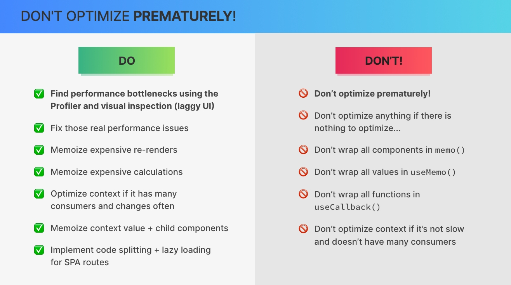

And so it's great to see that you're still here with me.

---

## `useEffect Rules and Best Practices`

So we have talked about and used the useEffect hook a lot throughout the course. Now useEffect is probably the most confusing part of React for beginners, which is why I decided that I still need to clarify some more things in the second part of the section and in this lecture.

### `Rules and guidelines for specifying a correct dependency array`

- **Every single state variable and prop that's being used in the effect must be included in the dependency array.**

    However, **this rule is not 100% complete because of two things.**
    1. **Any context value that the component is subscribed to must also be included in the dependency array.**
    2. And second, actually **we must include all so called reactive values in the dependency array as well.** What is a reactive value? Well, **a reactive value is any value that is either state, a prop, a context value or any other value that itself references one of the reactive values.**  
    `So basically, all values that are somehow connected to state, props or context are reactive values.` Now going back to our dependency array, this means that every single reactive value must be included, which again includes any functions or variables that reference any other reactive value.  
    **And the goal of this is to avoid so called stale closures that would otherwise occur inside the effect function.** Now these two rules that we just learned about are pretty strict and tell us exactly what must be included in the dependency array.

    And so this means that basically the dependencies choose themselves, right? Because if we need to include all reactive values in the list, there's not much to think about. Therefore, you should never ever ignore that ESLint rule that we've seen time and time again warning us about missing dependencies and ensuring that our dependency arrays are correct at all times. But of course, you want to understand why you're missing the dependencies that the linter is telling you about and not just blindly follow the tool. And so that's what this lecture is for.

    Also, sometimes you might be in an environment where the linter is not available and so then you really need to know what you're doing.

- The final rule is that you **should not use objects or arrays as dependencies** **because when you do so it seems to work just fine but in reality the effect will rerun on every single render.** The reason for that is that React checks if dependencies have changed between renders by simply comparing them using the triple equality operator. However, as we already know and already talked about in this section, **objects in JavaScript will have a different reference each time that they are recreated.**  
And therefore, even if the content of an object stays the same after a render, React will still see the old and the new object as different and will therefore rerun the effect.

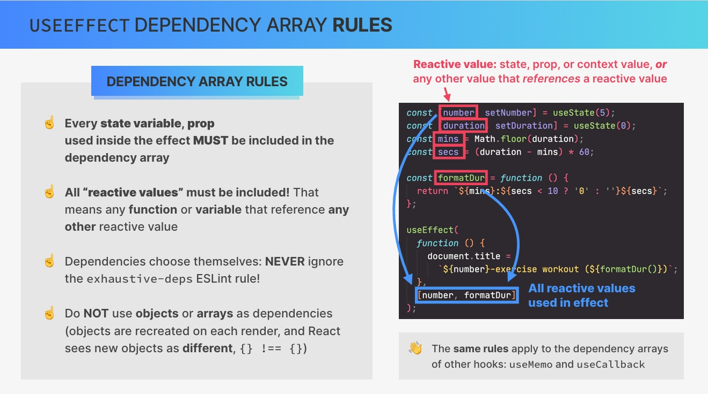

Now if you really do need an object as a dependency, I have some solutions in the next slide. But before we go there, **it's important to note that all these rules that we just talked about work in the exact same way for the other hooks that also have dependency arrays. So useMemo and useCallback.**

Okay, So as we just learned, we must include all reactive values in the list of dependencies. React calls this not lying about dependencies. **However, in certain situations, including every single dependency in the array can actually cause the effect to run way too often and introduce problems.**  

**The solution is not to omit one or more dependencies because that would be lying to react. Instead, we can use one of the strategies that can make some of the dependencies unnecessary. And so then we can remove those unnecessary dependencies from the array.**

So first off, **when you're dealing with helper functions as dependencies, the easiest way to remove the dependency is to just move the function right into the effect.** Because if the function is inside the effect then it's no longer a dependency of the effect.  
**However, if you can't do that because you might need the same function in multiple places, you can try to memoize it with useCallback.** **Also if the function is not a reactive value itself, so if it doesn't use any reactive values inside the code then you can just move it entirely out of the component** **because it's not really a dependency anyway.** And so by doing this, the function then doesn't need to be recreated on every render.

Next up, **if you want to use an object as a dependency, you can try to not include the entire object but only the properties that you actually need inside the effect.** **And you can do this as long as these properties are primitive values like strings or numbers.** However, if for some reason that doesn't work for your specific situation, you can try one of the strategies that I mentioned for functions as they are quite similar.

**And finally, we have two other strategies.**
`FIRST:` If you find yourself in a situation where your dependency list includes multiple reactive values that are related to one another, you can try using a reducer with useReducer. So sometimes a reducer can really be like a secret weapon that makes all your dependency problems completely go away.  

`SECOND:` **Also, there is no need to include the set state function from use state or the dispatch function from use reducer in the dependency list because react guarantees that these are stable between renders.**

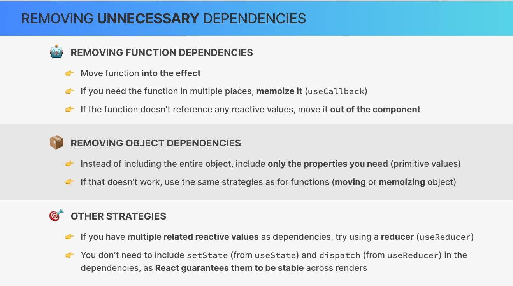

**And now to really wrap up this part about useEffect, let me give you a maybe shocking reality about effects,** **which is that effects should actually only be used as a last resort when no other solution really makes sense.** **That's the reason why react calls effects an escape hatch to step outside of react.**

Now, I'm telling you this because when hooks were first introduced into react, the useEffect hook was being overused a lot and also used in the wrong places.

Now, I'm not really gonna go deep into this right now, but here are just the **three biggest use cases where effects are still being overused** and that you should avoid as a beginner.

1. The first one is to **use an effect to respond to a user event like a click or a keystroke.** So as we learned before, a user event should, whenever possible, be handled with an event handler function and not with an effect, even if the handler does create a side effect.

2. Next, **fetching data from an API when the component first mounts is another overused application of useEffect.** Now, we did do this all the time in this course, but that's because we were still learning and building really small applications.  
And in fact, in smaller apps this is completely fine. But in a more real world application, it's best to use a professional data fetching library like `react query`.

3. And finally, **effects are overused a lot to synchronize state changes with one another,** which means to use useEffect to listen for a state change only to set another piece of state. **And the problem with this is that it will create multiple re renders which can be problematic.** Now, actually we are gonna do just this in the current project but in our case it's just gonna be because it will highly simplify the code as you will see.

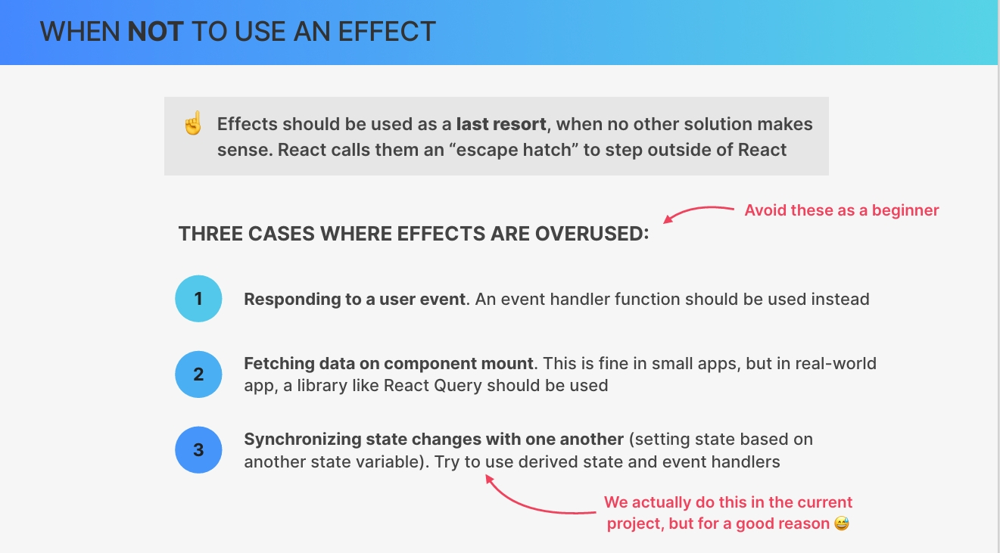

So basically, all these suggestions need to be taken with a grain of salt as always. So really, in fact, everything is acceptable in certain situations and in certain doses. But generally speaking, instead of using an effect to set state based on another state, you should rely on the arrived state and event handlers.

---

## `CHALLENGE-1 Fix Performance Issues in Workout Timer`

In this lecture, we're going to quickly set up yet another small project just to demonstrate some of the things that we just talked about useEffect. And in our starter files, we actually have again the complete project already. So come here to this folder, `workout Timer`, and then here the starter already contains the entire code.

---
