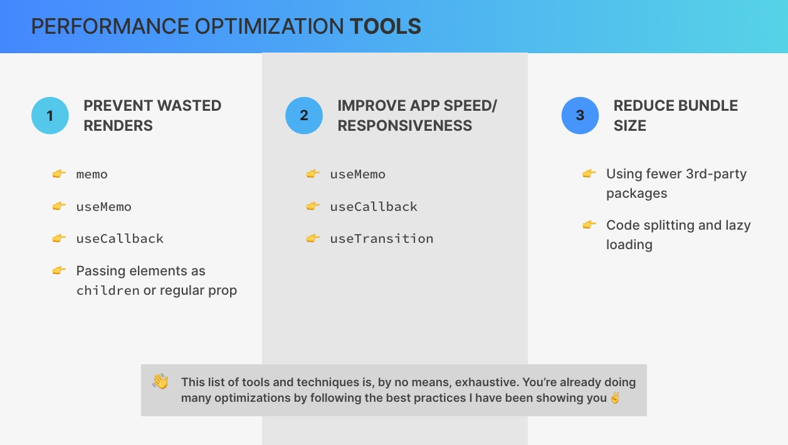

# `19. Performance Optimization and Advanced useEffect`

## `Table of Contents`

1. [Section Overview](#section-overview)
2. [Performance Optimization and Wasted Renders](#performance-optimization-and-wasted-renders)
3. [The Profiler Developer Tool](#the-profiler-developer-tool)
4. [A Surprising Optimization Trick With children](#a-surprising-optimization-trick-with-children)

---

## `Section Overview`

Hey there. In this section, we're gonna go deep into some inner workings of react once again. So we'll analyze renders in practical terms and learn how to optimize wasted renders and performance in general using some more advanced react tools. This way you'll be able to understand react apps even better and make them as fast and snappy as possible. We'll also go even deeper into the useEffect hook because there's still a few more things that we need to learn.

So this is another truly advanced section and one that I'm really excited to share with you. So get ready to take a lot of notes and really take your react skills and understanding to the next level one more time.

---

## `Performance Optimization and Wasted Renders`

**We're gonna start this section by getting a quick overview of what can actually be optimized in React applications and how we can do it. So there are three main areas that we can focus on when we need to optimize performance of React apps.**

1. we can try to **prevent wasted renders**.
2. we can improve the **overall app speed and responsiveness** to make sure that the app is 100% fluid and without delays.
3. we can **reduce the bundle size**.

**So let's quickly look at some built in React tools for each of these areas.**  

### `Techniques to Prevent Wasted Renders`

**In order to prevent wasted renders we can memoize components with memo** or **we can memoize objects and functions with useMemo and useCallback hooks.** **We can also use a technique where we pass elements into other elements as children or as a normal prop in order to prevent them from being re rendered.**

### `Improve App Speed / Responsiveness`

**To improve the perceived app speed we can again use the useMemo and useCallback hooks and we can also use the modern useTransition hook.**

### `Reduce Bundle Size`

**Finally, we can reduce the bundle size simply by using fewer third party packages in our code base, and we can also implement code splitting and lazy loading.**

<!-- adding image -->


*Now there is no need to use all these tools and techniques all the time. So the main goal of this section is to basically just give you access to these tools so that you can have them in your toolbox whenever a situation calls for one of them. And throughout this section, you will learn exactly when that is. So in which situations you need each of these tools. Also keep in mind that this list of tools and techniques is by no means exhaustive. So there are many other optimization best practices that it already told you about before and that you are already using. For example, not defining components inside other components. And so I didn't include all of these in this list. So these are mainly tools that we will talk about in this or in future sections.*

Now the first part of the section is gonna be about optimizing wasted renders. However, to understand what wasted renders actually are, we first need to review when exactly a component instance gets re rendered. So this will serve as a nice reminder of how rendering works in practice.

**In React a component instance only gets re rendered in three different situations.**

1. when the component **state changes**.
2. a component instance gets re rendered whenever there's a **change in a context** that the component is subscribed to. And this is exactly what we've learned in the previous section.
3. And finally, as we learned in the section on how react works behind the scenes, **whenever a component re renders all its child components will automatically be re rendered as well.** And so the third reason for a component to re render is a **parent component rerendering**.

But now you might be wondering **what about prop changes?** **Doesn't updating props also re render a component?** **Well, actually that's technically not the case. So that's a common misconception and actually even I told you this at the beginning of the course. But it was only because you didn't know yet how rendering works.** Because it is true that it does look as if components re render when their props change. B**ut what actually happens is that props only change when the parent rerenders**. But when the parent re renders, the children who receives the prop will re render anyway.  
**`And so the real reason why a component re renders when props change is that the parent has re rendered.`**

**It's important to also remember that rendering a component does not mean that the DOM actually gets updated**. Right? **So all that rendering means is that the component function gets called and that react will create a new virtual dom and do all the diffing and reconciliation that we have already talked about before.** And this can be an expensive and wasteful operation which brings us to an important topic of this lecture, wasted renders. **`So a wasted render is basically a render that didn't produce any change in the dom.`**

**So it's a waste because all the different calculations still had to be done, but it didn't result in any new dom.** **And so therefore, all the calculations were for nothing.** Now most of the time this is actually no problem at all because React is very fast. However, it can become a problem when re renders happen way too frequently or when the component is very slow in rendering. And so this can then make the application feel leggy and unresponsive. For example, not updating the UI fast enough after the user performs a certain action. So we want to avoid situations like that at all costs. So that's basically what we're gonna be dealing with in the next couple of lectures.

---

## `The Profiler Developer Tool`

We have used the React developer tools all the time throughout this course. But actually, we have only used half of them until now. And so, let's now meet the other half which is the **`profiler`**. So for the first half of this section, let's actually bring back our atomic block project.

So as I mentioned in the beginning, we have used the components react developer tool a lot but we have never used the other part, which is the profiler.

**With the profiler we can basically analyze renders and rerenders. So we can see which components have rendered, see why they rendered and also how long each render took.**

Now in practice, we use the profiler by clicking on blue record button and then we update some state. But before we go do that, let's change the settings and coming to this last tab which says profiler and then here we want to activate the setting which says that it should `record why each component rendered while it was profiling`.  
And so basically this will give us one of the three reasons that we talked about in the previous lecture of why each component has re rendered. So whether it was a state update, a context update or a parent re-rendering.  

But anyway, now I will start recording and then I will update the state of the page by typing in the search bar. We see how that actually looks like in the profiler and then we click there to stop the recording and then here is our Flame Graph. So we can see the result in the flame graph and also in the ranked graph.


So starting with the flame graph, this is basically just another way of representing the component tree. So as the parent we have App, then we have our Provider and inside the provider we have indeed the Header and the Main which in turn contain all of these components. Now what's special about this is that some components are actually colored and some are gray. **So the gray components are the ones that did actually not render while the application re rendered.** So main, posts and app did not rerender but all these others did. **And the more yellow the color is, the longer it took to rerender.** So the PostProvider we can see took the longest.

Now in order to rank them we can, as the name says use the ranked tab.


And so here we can then very clearly see for example that some of these components were really really fast(dark green) to render while this one(yellow) took a bit longer. And even though that's less than a millisecond, which is really nothing.  
Now, thanks to the setting that we activated in the beginning, we can also see why each of the components re rendered. So here⬇️, for example, we can see that the post provider re rendered because hook 2 changed.


And so the hook 2 is simply the use state hook which is storing the search query. So then here the Header re rendered because context changed. So let's check that out actually in code. So indeed, the header is consuming the context and so therefore it changed as we updated the state in the context. And the Results and the Form and the List, all of them are consuming the context. And so therefore, they then also updated as the component was updated while the Main and the Post components are not consuming the context and so they did not re render. So this is how we can basically analyze this flame graph.


Now up here⤴️ we have the different commits how they are called or in other words each of them is one re render. So I think that's easier to understand. And so since we did 3 times the same thing here we should expect them to look basically the same. Now the timings have changed here for some reason but the components that have actually rendered and not rendered are exactly the same. Alright.

And now let's try something else. So for that we can clear and then record again, and now let's simply click on this fake dark mode button.  
So just one re render, and so then here we only get this one column. And so this time as we can see here every single component has re rendered which makes sense because the state update actually happened right in the main parent component. So here in the app component. That's why here it says that hook number 1 changed. And then we can see for example this one did render because the context changes or changed which actually seems a bit strange but we will come back to this later. So we will understand why React is saying this. So all the components that are consuming the state actually are telling us that they have re rendered because the context has changed. While these 2 which before were gray are now also colored and these 2 did re render because the parent component rendered.  
`And so again, when the parent component of the application, so the component at the top of the component tree re renders then all the child components will re render as well. Okay.`

Okay. So feel free to play around with this new tool here as much as you'd like as this will be pretty important throughout this section and also later once you start building bigger and more heavy applications which might require some performance optimization. So we will use this tool throughout this section and so make sure that you, play around again with this a bit more and then let's move on to the next lecture to talk about our first small optimization trick.

---

## `A Surprising Optimization Trick With children`

**Let's now learn about a simple performance optimization technique which leverages the children prop in order to prevent some components from re-rendering.** Now this isn't the most used technique out there but it gives us actually surprising insights into how React works internally. And so that's why I wanted to share this with you. Also, not many people know about that this is how React works and so this makes this even more interesting.  

Now in this lecture I want to bring in this Test component inside the test.js file which was part of this project in the beginning. So This test component implements a very simple counter. So it has a button to increase the count and it also displays that count and then the count also contains this LowComponent. And so what this LowComponent does is to basically create 100,000 words and place them into an array. And it then renders this 100,000 element long array, in our user interface. So let's now include that in App.js below our List just to see what's gonna happen.

```jsx
// Test.js

import { useState } from "react";
function SlowComponent() {
  // If this is too slow on your maching, reduce the `length`
  const words = Array.from({ length: 100_000 }, () => "WORD");
  return (
    <ul>
      {words.map((word, i) => (
        <li key={i}>
          {i}: {word}
        </li>
      ))}
    </ul>
  );
}

export default function Test() {
  const [count, setCount] = useState(0);
  return (
    <div>
      <h1>Slow counter?!?</h1>
      <button onClick={() => setCount((c) => c + 1)}>Increase: {count}</button>
      <SlowComponent />
    </div>
  );
}
```

So let's include that.  So let's include the Test inside the List and then let's see what we get. So we see that we have like an infinite amount of words now and the idea here is that this simulates a very slow component. And so let's see what happens as we click on `Increase` button. So I click and then it takes like half a second until the button actually updates.  
And so the reason for that is basically, each time we click on the button this state(count, setCount) updates and so this entire component needs to get re rendered. And so therefore, the SlowComponent is also re rendered each time that we click the button even though this actually isn't really dependent on the state.

The SlowComponent does not need the state at all, but still it is being re rendered simply because it is inside the Test component.  
So if you ever find yourself in a situation like this where you have one kind of slow component inside another one which updates this one without it needing it, this is where you can then use this optimization technique. So what I'm gonna do is to take the counter functionality out. Like this⤵️  
But instead here I will now render the children prop because we will now pass this slow component into the counter as children.

```jsx
function Counter({ children }) {
  const [count, setCount] = useState(0);
  return (
    <div>
      <h1>Slow counter?!?</h1>
      <button onClick={() => setCount((c) => c + 1)}>Increase: {count}</button>

      {children}
    </div>
  );
}

export default function Test() {
  return (
    <div>
      <h1>Slow counter?!?</h1>
      <Counter>
        <SlowComponent />
      </Counter>
    </div>
  );
}
```

And so this actually looks exactly the same. So the component tree will also be exactly the same where we see here that basically we still have the h1, the button, and then in the UI the SlowComponent. However, it will now work in a completely different way. So let's see what happens now when we click on the button, and we see that it is instant. Right?

So this means that actually probably this list here is no longer being re rendered. And we can actually prove that by clicking here now on the start profiling button then updating the state by clicking on the button and then stopping it. So the counter component needed to update but then we see that the SlowComponent did not render. So why is that even though basically our JSX is very similar?

So the structure of the output is very similar and indeed it does look exactly the same as it looked like here in the UI previously. Right? So the only thing that we changed is that we no longer have SlowComponent directly in Counter component but instead we pass it in as a children. So then in Counter we display it as a children.  

**So why does this work this way? Why is suddenly react no longer re rendering this component(ShowComponent)?**  
Well, again, this element, so this LowComponent has this time been passed in as a children prop. And so what this means is that this component(SlowComponent) was already created before the counter component re-rendered. And so therefore, there's no way in which this component could have been affected by the state change in the counter.

So again, as React sees this piece of JSX here, it will basically immediately create the slow component right there and then pass it into the Counter. So all while rendering. And then as we click on the button, the counter is of course re rendered but SlowComponent component has already been passed in as a prop. So it has already been created before and so it cannot be affected by that state update. It already exists.  
And so that is the reason why React then bails out of re rendering this children component because nothing could have changed inside of the SlowComponent. So React is smart enough like this and can therefore decide not to rerender this. Okay.

***And so you might actually find situations like this in the real world in your own code. And so in that case just be aware that this trick exists. So all you have to do is to refactor your code a little bit***

Alright. And this is really all I wanted to do with this test component. So let's now get our application back to normal, but this actually has another very interesting implication in the way that our context works right now. So let me again start profiling here and just search once and then stop this.

And so here we see again that these two components have not been re rendered. But why is that? Why have they not been re rendered? I mean, there has been a state update inside the post provider component. Right?

So this post provider right here is actually just a regular component. And so when we searched here we updated this state which then re rendered this component. And so therefore, all the child components should have re rendered as well. Right? So all of these should have re rendered as well if we follow that logic because again all of them are child components.

However, we see again that these 2 did not re render And the reason for that is exactly the same that we saw earlier with the test and the slow component. So the reason again is that all of these child components here were actually passed into the post provider as children. And so we are in the exact same situation as before where all these child components were already created before they were passed here into this component. And so then React once again bails out of re rendering all of them because they couldn't have possibly been affected by any state change unless, of course, they do actually consume the context itself. So that's the case for this one.

Well, now we cannot see that because I reloaded the page in the meantime. So I would need to turn this setting back on, but this only works for the next time. Well, let's just do that now again. Alright. So, yeah.

Now we can see that. Let's make this a bit bigger. And so this one here did rerender again because the state has updated. And then this one has changed only because the context has changed, not because the parent component has rerendered. So the same here and the same here.

While again these ones were not re rendered because they were passed in as children and so they were already created before the post provider was even created and so they could not have been affected by any state change in there. Okay. So I hope that made sense and that you keep this technique in the back of your mind even though it is probably not used all the time. But it's very very interesting and I think this like puts you in the top 1% of React developers when it comes to knowing about this kind of stuff.

---
