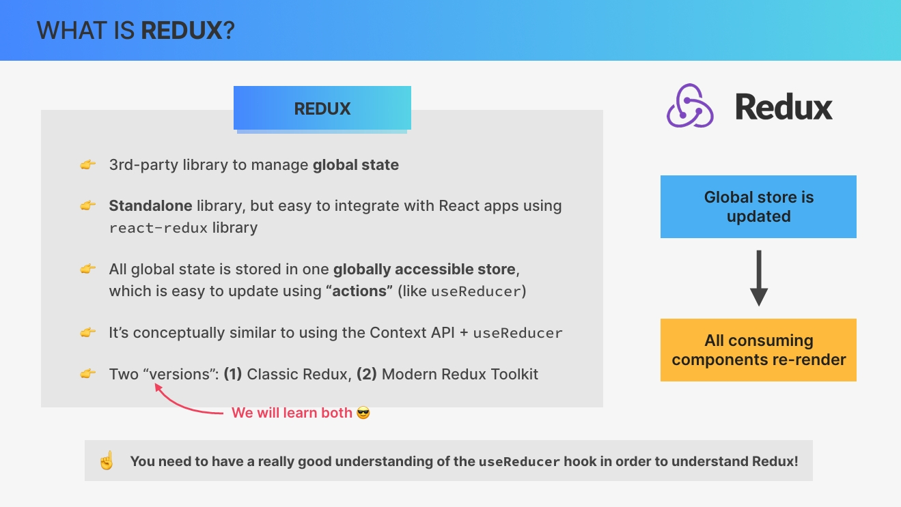
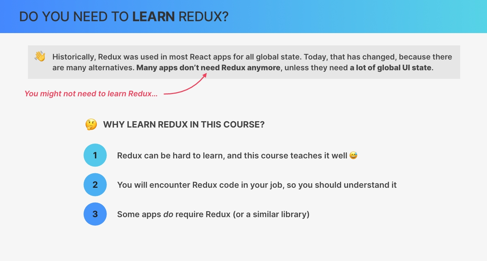
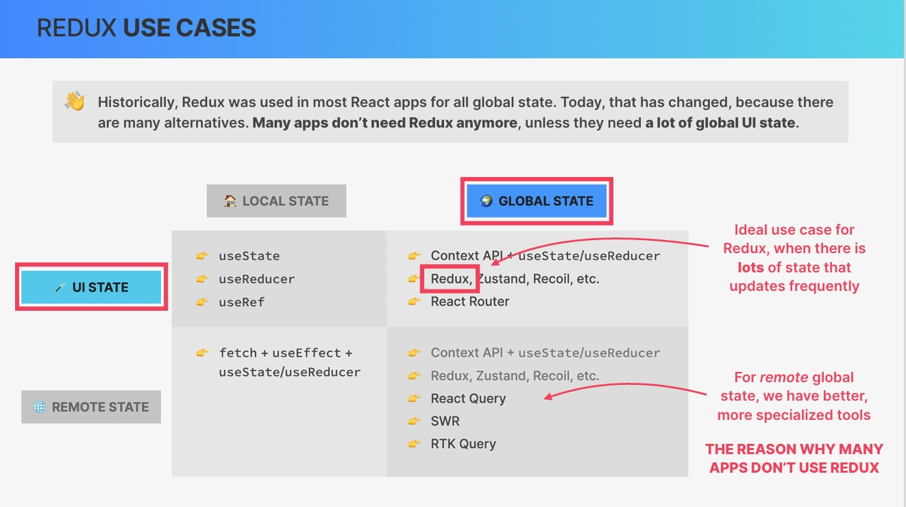
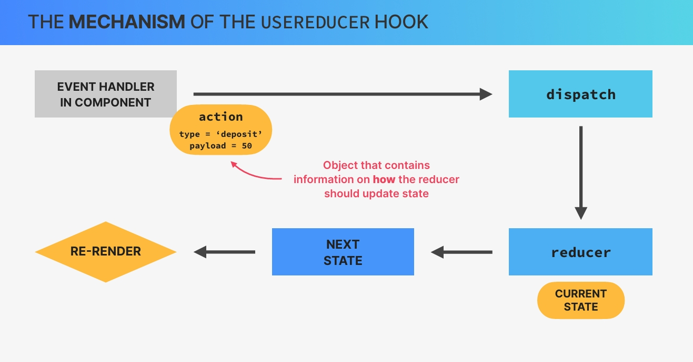
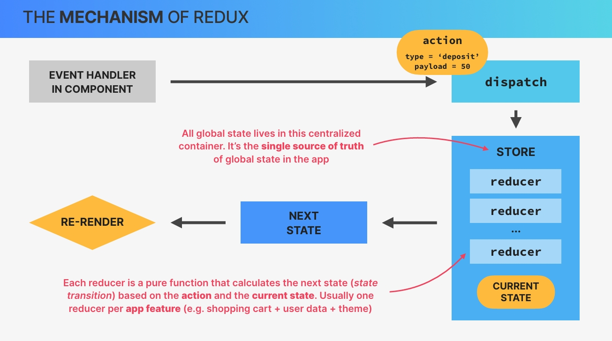
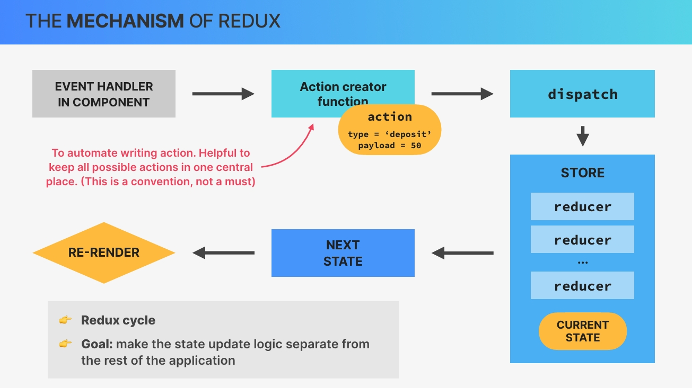

# `Redux and Modern Redux Toolkit (With Thunks)`

## `Table of Contents`

1. [Section Overview](#section-overview)
2. [Introduction to Redux](#introduction-to-redux)
3. [Creating a Reducer Bank Account](#creating-a-reducer-bank-account)
4. [Creating a Redux Store](#creating-a-redux-store)

---

## `Section Overview`

Let's get into one of the big topics of this course, **Redux**. Now for many people, Redux is this big and kind of scary thing that seems impossible to learn. For you however, it's the opposite, because you already know how to useReducer hook works. And therefore learning Redux is actually gonna be quite straightforward and a lot of fun.

To make it really easy, we're gonna start at the very fundamentals by learning Redux in isolation. Then we'll integrate Redux into this small application and also convert our Redux code to the more modern Redux toolkit. And we're even gonna make API requests right inside Redux using **thanks**. And this is actually one of my favorite sections of the entire course.

---

## `Introduction to Redux`

**As always, let's start by getting a good understanding of what Redux actually is and how the mechanics of Redux work especially when compared with the useReducer hook.**

### `What is Redux`

So in a nutshell,  
**Redux is a third party library that we can use to manage global state in a web application.** And I say web application because **Redux is actually a complete standalone library that we could use with any framework or even vanilla JavaScript.** However, Redux has always been tightly linked to React and they are actually quite easy to connect using the React Redux library as we will do throughout this section.  

**Now, the big idea behind Redux is that all the global state in our application can be stored inside one globally accessible store which we can then update using actions.** And if this sounds familiar, it's because the useReducer hook implements a very similar pattern. So updating state by dispatching actions, remember? And in fact, the mechanism behind Redux and useReducer is so similar that I will assume that you know how to use useReducer and build the teaching of Redux onto the knowledge that you already have.

*You should have a pretty good understanding of the useReducer hook in order to move on in this section. And if you don't, then please go back to that useReducer section first.*

But anyway, the idea of updating state in React and in Redux is always the same. So in the case of Redux, as soon as we update the store, all the React components that consume some data from the store will be re rendered. So conceptually, if we think about this, Redux is actually quite similar to combining the context API with the userReducer hook as we have done in the worldWise app. **And in fact, many developers even say that the context API is a replacement for Redux.** However, the truth is a bit more nuanced than that as we will discuss by the end of the section once you have some experience with both of these tools.

Now, Redux has a long history. And so today, there are two versions of Redux. So 2 different ways of writing Redux applications, but which are totally compatible with each other. So we have the classic Redux and we have the more modern way of writing Redux with Redux toolkit. And as you would expect, we will learn both of them in this section starting with classic Redux so that you get the right foundations.



### `When to use Redux`

Okay. Now before learn how Redux works, let's quickly check out when we should actually use Redux. And let's start with some history. So historically, **a few years back, Redux was used in almost every React app out there for all global state management needs.** So you really needed to know Redux. It was as if Redux was even part of React.  
Today, however, the landscape has changed tremendously because there are now many alternatives as we have already talked about in the advanced state management lecture in a previous section. **So today many apps don't actually need Redux anymore and also don't use Redux anymore.** And this means that you might not even need to learn Redux right now.

**So why is it included in this course then?**  
Well, for 3 big reasons.

1. Since Redux has a reputation for being very hard to learn, this was probably the most requested topic for this course by my current students. And I think that this course does teach it pretty well in an easy to understand way.
2. When you're working on a team, you will likely work with an older codebase and then you will definitely encounter Redux. Therefore, you need to learn how it works even if you don't master it.
3. Some applications do actually require something like Redux. And so let's take a look at when that is, by bringing back this overview from a previous lecture. So my recommendation and the recommendation of many experts is to **use a global state management library like Redux only when you have lots of global UI state that you need to update frequently.**  
`And remember that UI state basically means state that is not fetched from a server,` `That would be remote state.`

**So UI state is simply data about the UI itself or data that doesn't need to be communicated to an API or so.** And this distinction is really important because remember for **global remote** state we have many better options nowadays like **React Query**, **SWR** or even a tool that is kind of included in modern redux toolkit, which is `Redux Toolkit Query`.



**so if you need to manage a lot of non remote state in your app? If so then Redux might be perfect for that. But the truth is that most global state is actually remote, which is the reason why so many apps don't use Redux anymore.**



### `The Mechanism of the useReducer Hook`

Let's just quickly review how useReducer works.

**So with useReducer, when we want to update state from an event handler in a component, we start by creating an action.** **This action is simply an object that usually contains a type and a payload, which is information about how the state should be updated.** **We then dispatch that action to a so called reducer function.** **The reducer takes the action type and the payload and together with the current state calculates the next state, so the new state value.** **And to finish, as the state updates, of course, the component that originated the state transition will re render.**  



### `The Mechanism of the useReducer Hook`

So this mechanism should be familiar to you at this point because now we're gonna add 2 more things onto this in order to learn how Redux works.  
**So the first difference between useReducer and Redux is that in Redux we actually dispatch actions not simply to the reducer but to the store that we talked about at the beginning.** **This store is a centralized container where all global state lives.** **It's like the single source of truth of all global state across the entire application. The store is also where one or multiple reducers live.**

**And just as a reminder, each reducer must be a pure function that has the single task of calculating the next state based on the action that was dispatched to the store and the current state that's already in the store as well.** Now, you might be wondering **why there are multiple reducers in the store.** Well, it's because we should create **one reducer per application feature or per data domain** in order to keep things separated. For example, in a shopping app you could have one reducer for the shopping cart, one for some user data, and one for the application color theme, for example.

Finally, **any component that consumes the state that has been updated in the store will as always get re rendered by React**, at least if we're assuming that we're using Redux together with a React app.



Okay. So that's the Redux store, but now let's **focus on the action** again. So in the real world, **when we use Redux, we usually use functions called `action creators` in order to automate the process of writing actions.** So basically, **instead of always writing these action objects by hand, we create functions that do this automatically**. This has the advantage to keep all actions in one central place which reduces bugs because developers don't have to remember the exact action type strings.

Just note that this is optional and not a feature of Redux. It's just how we build real world Redux apps. Then the rest of the process is of course just what I explained before. Okay.

**So let's recap how this Redux cycle works.**

So in order to update global state with Redux, we start by calling an action creator in a component and then dispatch the action that resulted from the action creator. This action will then reach the store where the write reducer will pick it up and update the state according to the instructions. This then triggers a rerender of the UI where the cycle finishes. And the big goal of all this is to make the state update logic separate from the rest of the application.



And now just for fun, we can take it back to the bank analogy when we first talked about useReducer.

So remember how we said that when you need to take or to place money into a bank account you don't do that yourself directly. But instead you go to the person at the desk in the bank in order to give them your instructions. So you don't update the bank vault yourself and Redux is just like that as well. So taking the example of depositing $50 you would definitely be the action creator as you are the one giving the instructions. The instructions themselves are the action and the person that you're talking to is very clearly the dispatcher because he is the one who will instruct the bank vault to be updated.

So **the bank's vault is like the Redux store that you can touch directly but only through the dispatcher.** And there you have it. This is how Redux works. Do you still think that it's super hard and super confusing? Well, maybe you do and that's 100% not a problem.

So I will guide you step by step through the Redux fundamentals throughout this section and by the end of it all, I promise that it will be crystal clear.

---

## `Creating a Reducer Bank Account`

So let's now start learning Redux in isolation. So without React first by writing a simple reducer function. Now even though we are going to start with Redux in isolation, we are still going to start by creating a new React application now so that we have some place where we can actually write our Redux code. So let's again come to the terminal and navigate to the folder that we're interested in here. And then since we are still learning we can again use create react app.

And now, all we are going to do for now is in the source folder, create a new file called **store.js**. And so this is where we are going to write for pure Redux code. So basically Redux without React so that we can really understand Redux in isolation first. And later of course we will then integrate the two.

So what we're gonna do in this section is to model the bank account that we have already talked about earlier, but again a bit simpler. So without an account number and only with a balance, a loan and also a loan purpose. And  actually let's start with that. So just like we useReducer we start by creating some initial state object.

```jsx
// initial state object
const initialState = {
  balance: 0,
  loan: 0,
  loanPurpose: "",
};
```

And now again just like with the useReducer hook, it's time to define the reducer function. So we can just call this reducer for now and as always it receives the state and the action. **And so remember that the goal of the reducer is to calculate the new state based on the current state and on the received action.**

Now it's also important to remember that **reducers are not allowed to modify the existing state and they're also not allowed to do any asynchronous logic or other side effects.** **So instead what we should do with reducers is to place as much logic as possible inside of them.**

Okay. But anyway, **one thing that is actually different between this reducer and the reducer in the useReducer hook is that usually we directly pass in the initial state as the default state.** So using here this default parameter in JavaScript.

```jsx
function reducer(state = initialState, action) {}
```

So this is just a normal JavaScript feature where you can specify a default parameter in case there is none set. So with this we make this initial state here really the state at the very beginning. And so then let's again use a **switch statement** to basically select the action dot type. So the actions that are going to be dispatched to this reducer or actually to the Redux store, they will have the shape of a type and a payload. And so basically our reducer will look exactly the same way as we've done in useReducer Hook. And so that's why it is now so easy to learn Redux when we already know useReducer.

So here we now need to specify our actions as always and so let's do that. Now back in the day action types used to be written all upper case for example SET_BALANCE, DEPOSIT_ACCOUNT. So many times it's a setter and all upper case.

However, nowadays the Redux team advises to write these action names in a different way. So usually these action names should model what happened or what should happen. And so we write them in the shape of the state domain. So that's the account in this case and then the event name. So let's start with deposit here. ***`account/deposit`***

Now we need to again as always return the current state. So spreading all the current state into this new state that will be returned from here and then we want to set the balance to the current balance. So that's at state dot balance plus the action.payload. So action dot payload which remember is basically the data that gets passed into the reducer when the action is dispatched.

```jsx
function reducer(state = initialState, action) {
  switch (action.type) {
    case "account/deposit":
      return {
        ...state,
        balance: state.balance + action.payload,
      };
  }
}
```

And again, it's very important that you understand everything that we did earlier with the useReducer hook because this is exactly the same thing.

Okay, Then let's just duplicate this here for the withdrawal or actually let's just call this withdraw, and so here it is then minus that.

Let's also add already our default case but here we do it a bit different. So before we would usually throw some new error right here. Right? However, in **Redux or for some reason it is advised to not do that and instead to simply return the original state**. So basically, in case that the reducer receives an action that it doesn't know about it will simply return the original state back. So the state will simply not be updated but there also won't be an error. Okay. Next up again account.

So all of these are about accounts and so all our action names in this reducer will start with the account prefix but later we will have another reducer which will then have another state domain name. So here the next one is for request a loan which can only happen if there is no loan yet. So if state dot loan is greater than 0, then just return the current state. But if not, well, then return the current state and let's update then the loan. So that will be the action dot payload.

And actually, it should be action dot payload dot purpose. So like this. However, we haven't really dispatched the action yet and so this is gonna look a little bit confusing. So I think that maybe we should actually leave this for a little bit later. So this entire part right here.

```js
const initialState = {
  balance: 0,
  loan: 0,
  loanPurpose: "",
};

function reducer(state = initialState, action) {
  switch (action.type) {
    case "account/deposit":
      return { ...state, balance: state.balance + action.payload };

    case "account/withdraw":
      return {
        ...state,
        balance: state.balance - action.payload,
      };

    case "account/requestLoan":
      if (state.loan > 0) return state;

      // LATER
      return { ...state, loan: action.payload };

    case "account/payLoan":
      return {
        ...state,
        loan: 0,
        loanPurpose: "",
        balance: state.balance - state.loan,
      };
    default:
      return state;
  }
}

```

Alright. So with this we have our reducer in place and so now we can create our store. And so let's do that in the next lecture.

---

## `Creating a Redux Store`

Now it's time to create that Redux store that we talked about in the beginning. So now we will use an actual Redux feature for the very first time. So what we did in previous lec was simply writing an object and a function. So we didn't really use Redux yet, but now we need it. And so now we need to install it.

So let's come to our terminal and then let's do npm install redux.

```bash
npm install redux
```

And so out of this redux package we will now take the createStore method. So in order to create that store. So let's import that here, create store from Redux.

```jsx
import { createStore } from "redux";
```

And so now you see that it has strike through(line through). And the reason for that is that the Redux team kind of declared that **this method is deprecated**.  
So as I mentioned earlier, there is now a more modern way of writing Redux which is **Redux toolkit**.  
However, I still believe that it is really way better to first learn Redux in this way, So in the way that I'm showing you now. And then once you have all the Redux knowledge to then transition into Redux toolkit because otherwise everything will really just seem like magic. It works just too easily and then you have no idea what is going on.

Let's now actually create our store. So all you have to do is to call the create store function with the reducer. ***`createStore(reducer);`*** So that's really it, at least for now. And so then this will return the store and so let's just call it store. So just like this. ***`const store = createStore(reducer);`*** And so now on this store we can dispatch actions.  
So for example, we can do ***`store.dispatch()`***, which is going to work in exactly the same way as the dispatch function that we got as a result of calling the use reducer hook. So again, this dispatch function is basically what we already know from use reducer.  
And so this is where we can now pass in that event. So let's specify account deposit and then a payload of let's say 500. Alright.

```jsx
const store = createStore(reducer);
store.dispatch({ type: "account/deposit", payload: 500 });
```

**But now how do we actually run this code?** So how can we execute this and then see the results? Well, let's just open up our index.js file, which is the file that we already know will always be executed at the very beginning. So at first, let's just clean this up. And now what we're gonna do, again, just for learning purposes is to simply import that entire store.js file.

So just like this actually. And so what this will do is to simply run the code that is here in this file. So we're not exporting anything from here and not importing it here. But all we're doing is to importing this file which will then simply run the code that is here in the top level of this file. So if I console dot log anything from here it will then appear in our console.

So again, this is just a way of executing or test or learning code here. Okay. And now as always we should be able to run npm start. So let's wait for that. And yes, agreeing to open in another port.

And then as always this takes some time and here we go. So this will be the application that we're gonna be working on later. So it's basically like the graphical user interface to the account that we're modeling here. But for now I'm only interested here in the console. So let's make this even bigger so we can really see what's going on.

And so indeed we got our console dot log coming from here. But that's not really what we're interested in. Instead we want to now console dot log store dot get state because that will then show us the current state of our store. And nice. So our balance is already 500, which is because we dispatched that action right here.

And so now we have Redux already working in this very simple way. So let's try another one. Let's say account withdraw and then 200. And so then we need to log again because what we log here is only after that very first action. And so now that went down from 500 to 300.

Now we could also subscribe to the store which would then automatically show us these updates here on the screen, but let's keep it simple because in the real application we will later not need that. And so there's no need to learn an additional thing here. But anyway, let's get maybe rid of this one just to clean the code a little bit. And so now I want to dispatch the action of actually requesting a loan. So, request or first account request loan.

And then remember how I said that the payload here will actually a bit more complicated. So that's why we left this part here for later. So now for the very first time as a payload, we will actually pass in another object. So we haven't done that before, but of course this is perfectly fine because with this we can then pass in basically multiple pieces of data. So let's say that we want an amount of €1,000 and then the purpose is to buy a car and apparently a very cheap car but let's just roll with this example.

And so now here in this action let's use that data. So here the loan is account dot payload dot amount and the purpose, or actually I think it's called loan purpose is action dot payload dot purpose. Let's see. Yeah. And so let's see what our store looks like after this operation.

And indeed, we get our loan, we get our purpose, but we also have to now add that loan to our balance because of course after we get the loan then our balance goes up by that amount. And so let's also set a new balance which is gonna be the current balance. So state dot balance plus the action dot payload dot amount. And there we go. So that's correct.

And now finally just to experiment with this last one as well, let's then pay the loan back. So just to see that this event here actually has no payload at all. So pay loan, and so after that we are basically back to before. So the balance went down again and here we are back to the beginning as well. So this actually works great but let's add some more Redux conventions on top of this.

So remember how I mentioned in the first lecture of this section that usually in Redux we don't always manually write the type like this, but instead we create something called an action creator to automate this process. And so let's create those action creators in the next video.

---
