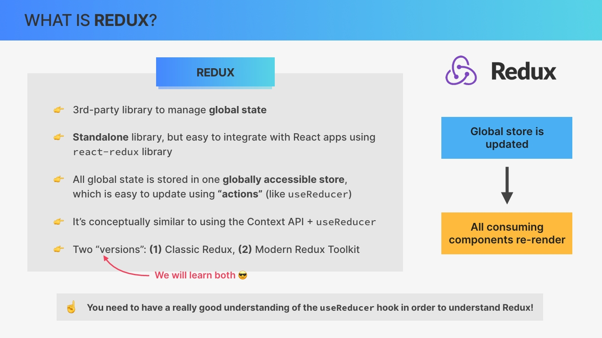
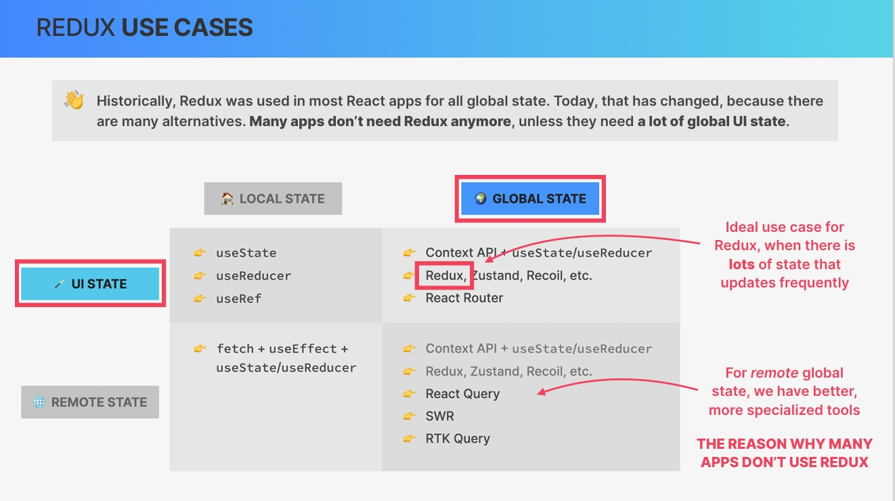
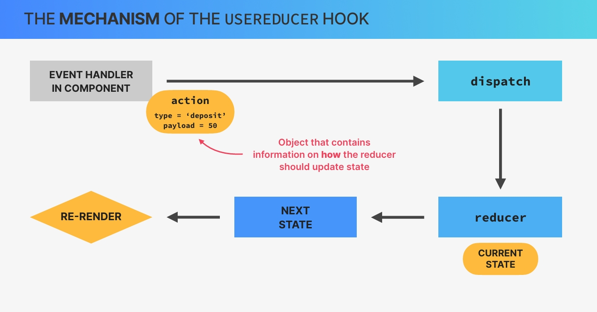
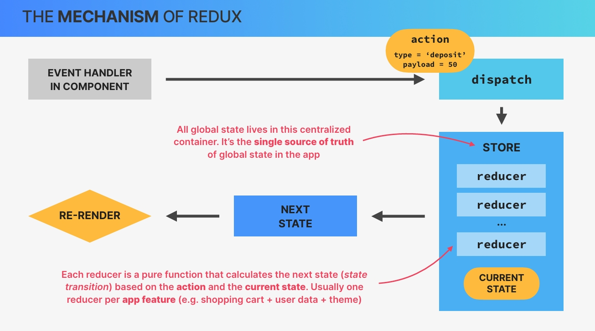
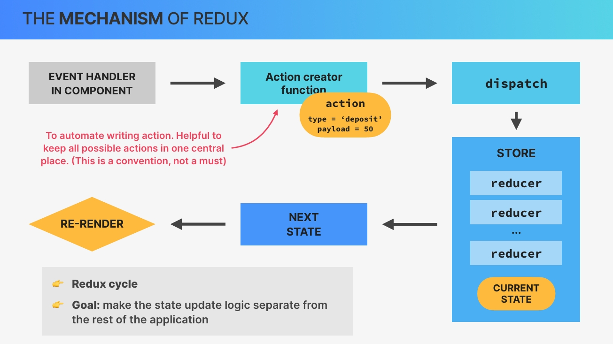
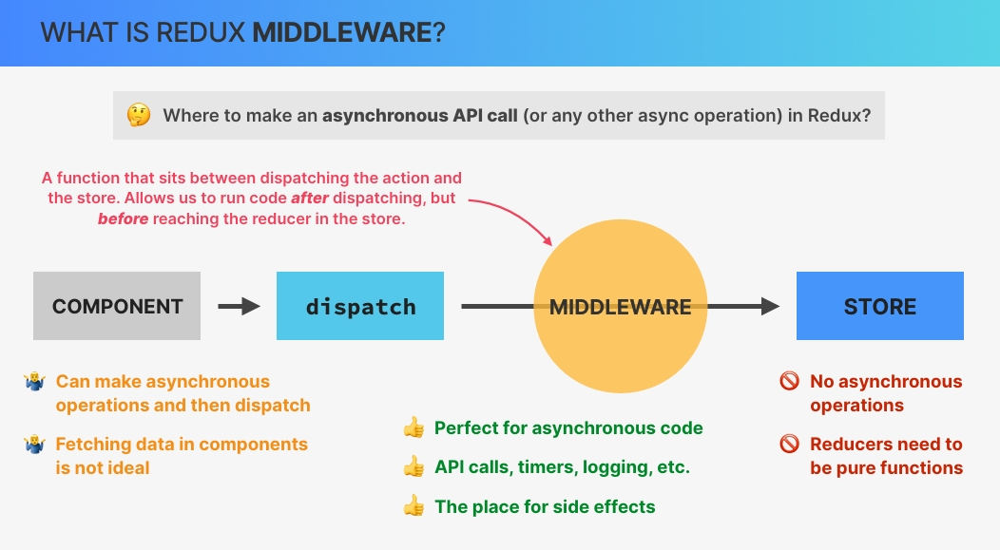
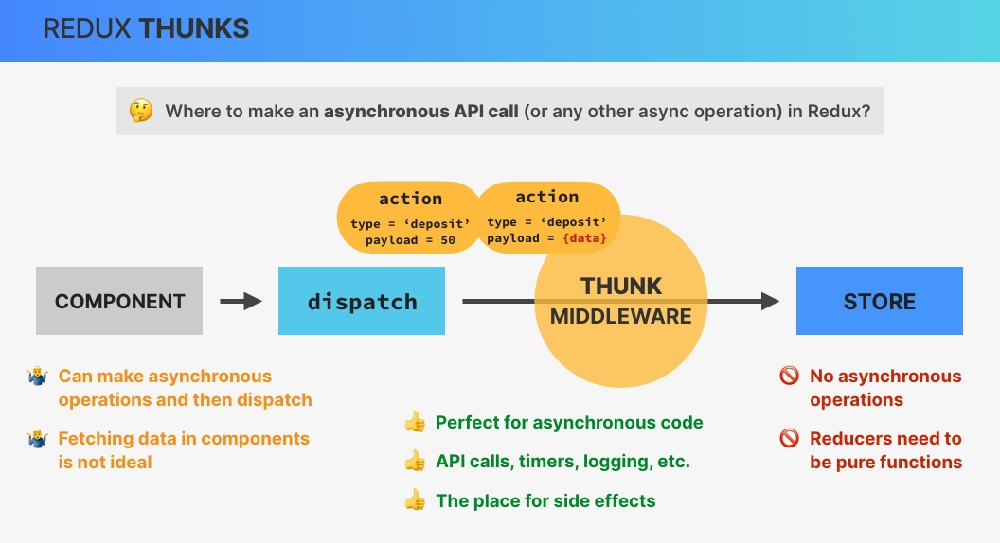

# `Redux and Modern Redux Toolkit (With Thunks)`

## `Table of Contents`

1. [Section Overview](#section-overview)
2. [Introduction to Redux](#introduction-to-redux)
3. [Creating a Reducer Bank Account](#creating-a-reducer-bank-account)
4. [Creating a Redux Store](#creating-a-redux-store)
5. [Working With Action Creators](#working-with-action-creators)
6. [Adding More State Customer](#adding-more-state-customer)
7. [Professional Redux File Structure State Slices](#professional-redux-file-structure-state-slices)
8. [Back to React! Connecting our Redux App With React](#back-to-react-connecting-our-redux-app-with-react)
9. [Dispatching Actions from Our React App](#dispatching-actions-from-our-react-app)
10. [The Legacy Way of Connecting Components to Redux](#the-legacy-way-of-connecting-components-to-redux)
11. [Redux Middleware and Thunks](#redux-middleware-and-thunks)
12. [Making an API Call With Redux Thunks](#making-an-api-call-with-redux-thunks)

---

## `Section Overview`

Let's get into one of the big topics of this course, **Redux**. Now for many people, Redux is this big and kind of scary thing that seems impossible to learn. For you however, it's the opposite, because you already know how to useReducer hook works. And therefore learning Redux is actually gonna be quite straightforward and a lot of fun.

To make it really easy, we're gonna start at the very fundamentals by learning Redux in isolation. Then we'll integrate Redux into this small application and also convert our Redux code to the more modern Redux toolkit. And we're even gonna make API requests right inside Redux using **thanks**. And this is actually one of my favorite sections of the entire course.

---

## `Introduction to Redux`

**As always, let's start by getting a good understanding of what Redux actually is and how the mechanics of Redux work especially when compared with the useReducer hook.**

### `What is Redux`

So in a nutshell,  
**Redux is a third party library that we can use to manage global state in a web application.** And I say web application because **Redux is actually a complete standalone library that we could use with any framework or even vanilla JavaScript.** However, Redux has always been tightly linked to React and they are actually quite easy to connect using the React Redux library as we will do throughout this section.  

**Now, the big idea behind Redux is that all the global state in our application can be stored inside one globally accessible store which we can then update using actions.** And if this sounds familiar, it's because the useReducer hook implements a very similar pattern. So updating state by dispatching actions, remember? And in fact, the mechanism behind Redux and useReducer is so similar that I will assume that you know how to use useReducer and build the teaching of Redux onto the knowledge that you already have.

*You should have a pretty good understanding of the useReducer hook in order to move on in this section. And if you don't, then please go back to that useReducer section first.*

But anyway, the idea of updating state in React and in Redux is always the same. So in the case of Redux, as soon as we update the store, all the React components that consume some data from the store will be re rendered. So conceptually, if we think about this, Redux is actually quite similar to combining the context API with the userReducer hook as we have done in the worldWise app. **And in fact, many developers even say that the context API is a replacement for Redux.** However, the truth is a bit more nuanced than that as we will discuss by the end of the section once you have some experience with both of these tools.

Now, Redux has a long history. And so today, there are two versions of Redux. So 2 different ways of writing Redux applications, but which are totally compatible with each other. So we have the classic Redux and we have the more modern way of writing Redux with Redux toolkit. And as you would expect, we will learn both of them in this section starting with classic Redux so that you get the right foundations.



### `When to use Redux`

Okay. Now before learn how Redux works, let's quickly check out when we should actually use Redux. And let's start with some history. So historically, **a few years back, Redux was used in almost every React app out there for all global state management needs.** So you really needed to know Redux. It was as if Redux was even part of React.  
Today, however, the landscape has changed tremendously because there are now many alternatives as we have already talked about in the advanced state management lecture in a previous section. **So today many apps don't actually need Redux anymore and also don't use Redux anymore.** And this means that you might not even need to learn Redux right now.

**So why is it included in this course then?**  
Well, for 3 big reasons.

1. Since Redux has a reputation for being very hard to learn, this was probably the most requested topic for this course by my current students. And I think that this course does teach it pretty well in an easy to understand way.
2. When you're working on a team, you will likely work with an older codebase and then you will definitely encounter Redux. Therefore, you need to learn how it works even if you don't master it.
3. Some applications do actually require something like Redux. And so let's take a look at when that is, by bringing back this overview from a previous lecture. So my recommendation and the recommendation of many experts is to **use a global state management library like Redux only when you have lots of global UI state that you need to update frequently.**  
`And remember that UI state basically means state that is not fetched from a server,` `That would be remote state.`

**So UI state is simply data about the UI itself or data that doesn't need to be communicated to an API or so.** And this distinction is really important because remember for **global remote** state we have many better options nowadays like **React Query**, **SWR** or even a tool that is kind of included in modern redux toolkit, which is `Redux Toolkit Query`.


**so if you need to manage a lot of non remote state in your app? If so then Redux might be perfect for that. But the truth is that most global state is actually remote, which is the reason why so many apps don't use Redux anymore.**



### `The Mechanism of the useReducer Hook`

Let's just quickly review how useReducer works.

**So with useReducer, when we want to update state from an event handler in a component, we start by creating an action.** **This action is simply an object that usually contains a type and a payload, which is information about how the state should be updated.** **We then dispatch that action to a so called reducer function.** **The reducer takes the action type and the payload and together with the current state calculates the next state, so the new state value.** **And to finish, as the state updates, of course, the component that originated the state transition will re render.**  



### `The Mechanism of the useReducer Hook`

So this mechanism should be familiar to you at this point because now we're gonna add 2 more things onto this in order to learn how Redux works.  
**So the first difference between useReducer and Redux is that in Redux we actually dispatch actions not simply to the reducer but to the store that we talked about at the beginning.** **This store is a centralized container where all global state lives.** **It's like the single source of truth of all global state across the entire application. The store is also where one or multiple reducers live.**

**And just as a reminder, each reducer must be a pure function that has the single task of calculating the next state based on the action that was dispatched to the store and the current state that's already in the store as well.** Now, you might be wondering **why there are multiple reducers in the store.** Well, it's because we should create **one reducer per application feature or per data domain** in order to keep things separated. For example, in a shopping app you could have one reducer for the shopping cart, one for some user data, and one for the application color theme, for example.

Finally, **any component that consumes the state that has been updated in the store will as always get re rendered by React**, at least if we're assuming that we're using Redux together with a React app.



Okay. So that's the Redux store, but now let's **focus on the action** again. So in the real world, **when we use Redux, we usually use functions called `action creators` in order to automate the process of writing actions.** So basically, **instead of always writing these action objects by hand, we create functions that do this automatically**. This has the advantage to keep all actions in one central place which reduces bugs because developers don't have to remember the exact action type strings.

Just note that this is optional and not a feature of Redux. It's just how we build real world Redux apps. Then the rest of the process is of course just what I explained before. Okay.

**So let's recap how this Redux cycle works.**

So in order to update global state with Redux, we start by calling an action creator in a component and then dispatch the action that resulted from the action creator. This action will then reach the store where the write reducer will pick it up and update the state according to the instructions. This then triggers a rerender of the UI where the cycle finishes. And the big goal of all this is to make the state update logic separate from the rest of the application.



And now just for fun, we can take it back to the bank analogy when we first talked about useReducer.

So remember how we said that when you need to take or to place money into a bank account you don't do that yourself directly. But instead you go to the person at the desk in the bank in order to give them your instructions. So you don't update the bank vault yourself and Redux is just like that as well. So taking the example of depositing $50 you would definitely be the action creator as you are the one giving the instructions. The instructions themselves are the action and the person that you're talking to is very clearly the dispatcher because he is the one who will instruct the bank vault to be updated.

So **the bank's vault is like the Redux store that you can touch directly but only through the dispatcher.** And there you have it. This is how Redux works. Do you still think that it's super hard and super confusing? Well, maybe you do and that's 100% not a problem.

So I will guide you step by step through the Redux fundamentals throughout this section and by the end of it all, I promise that it will be crystal clear.

---

## `Creating a Reducer Bank Account`

So let's now start learning Redux in isolation. So without React first by writing a simple reducer function. Now even though we are going to start with Redux in isolation, we are still going to start by creating a new React application now so that we have some place where we can actually write our Redux code. So let's again come to the terminal and navigate to the folder that we're interested in here. And then since we are still learning we can again use create react app.

And now, all we are going to do for now is in the source folder, create a new file called **store.js**. And so this is where we are going to write for pure Redux code. So basically Redux without React so that we can really understand Redux in isolation first. And later of course we will then integrate the two.

So what we're gonna do in this section is to model the bank account that we have already talked about earlier, but again a bit simpler. So without an account number and only with a balance, a loan and also a loan purpose. And  actually let's start with that. So just like we useReducer we start by creating some initial state object.

```jsx
// initial state object
const initialState = {
  balance: 0,
  loan: 0,
  loanPurpose: "",
};
```

And now again just like with the useReducer hook, it's time to define the reducer function. So we can just call this reducer for now and as always it receives the state and the action. **And so remember that the goal of the reducer is to calculate the new state based on the current state and on the received action.**

Now it's also important to remember that **reducers are not allowed to modify the existing state and they're also not allowed to do any asynchronous logic or other side effects.** **So instead what we should do with reducers is to place as much logic as possible inside of them.**

Okay. But anyway, **one thing that is actually different between this reducer and the reducer in the useReducer hook is that usually we directly pass in the initial state as the default state.** So using here this default parameter in JavaScript.

```jsx
function reducer(state = initialState, action) {}
```

So this is just a normal JavaScript feature where you can specify a default parameter in case there is none set. So with this we make this initial state here really the state at the very beginning. And so then let's again use a **switch statement** to basically select the action dot type. So the actions that are going to be dispatched to this reducer or actually to the Redux store, they will have the shape of a type and a payload. And so basically our reducer will look exactly the same way as we've done in useReducer Hook. And so that's why it is now so easy to learn Redux when we already know useReducer.

So here we now need to specify our actions as always and so let's do that. Now back in the day action types used to be written all upper case for example SET_BALANCE, DEPOSIT_ACCOUNT. So many times it's a setter and all upper case.

However, nowadays the Redux team advises to write these action names in a different way. So usually these action names should model what happened or what should happen. And so we write them in the shape of the state domain. So that's the account in this case and then the event name. So let's start with deposit here. ***`account/deposit`***

Now we need to again as always return the current state. So spreading all the current state into this new state that will be returned from here and then we want to set the balance to the current balance. So that's at state dot balance plus the action.payload. So action dot payload which remember is basically the data that gets passed into the reducer when the action is dispatched.

```jsx
function reducer(state = initialState, action) {
  switch (action.type) {
    case "account/deposit":
      return {
        ...state,
        balance: state.balance + action.payload,
      };
  }
}
```

And again, it's very important that you understand everything that we did earlier with the useReducer hook because this is exactly the same thing.

Okay, Then let's just duplicate this here for the withdrawal or actually let's just call this withdraw, and so here it is then minus that.

Let's also add already our default case but here we do it a bit different. So before we would usually throw some new error right here. Right? However, in **Redux or for some reason it is advised to not do that and instead to simply return the original state**. So basically, in case that the reducer receives an action that it doesn't know about it will simply return the original state back. So the state will simply not be updated but there also won't be an error. Okay. Next up again account.

So all of these are about accounts and so all our action names in this reducer will start with the account prefix but later we will have another reducer which will then have another state domain name. So here the next one is for request a loan which can only happen if there is no loan yet. So if state dot loan is greater than 0, then just return the current state. But if not, well, then return the current state and let's update then the loan. So that will be the action dot payload.

And actually, it should be action dot payload dot purpose. So like this. However, we haven't really dispatched the action yet and so this is gonna look a little bit confusing. So I think that maybe we should actually leave this for a little bit later. So this entire part right here.

```js
const initialState = {
  balance: 0,
  loan: 0,
  loanPurpose: "",
};

function reducer(state = initialState, action) {
  switch (action.type) {
    case "account/deposit":
      return { ...state, balance: state.balance + action.payload };

    case "account/withdraw":
      return {
        ...state,
        balance: state.balance - action.payload,
      };

    case "account/requestLoan":
      if (state.loan > 0) return state;

      // LATER
      return { ...state, loan: action.payload };

    case "account/payLoan":
      return {
        ...state,
        loan: 0,
        loanPurpose: "",
        balance: state.balance - state.loan,
      };
    default:
      return state;
  }
}

```

Alright. So with this we have our reducer in place and so now we can create our store. And so let's do that in the next lecture.

---

## `Creating a Redux Store`

Now it's time to create that Redux store that we talked about in the beginning. So now we will use an actual Redux feature for the very first time. So what we did in previous lec was simply writing an object and a function. So we didn't really use Redux yet, but now we need it. And so now we need to install it.

So let's come to our terminal and then let's do npm install redux.

```bash
npm install redux
```

And so out of this redux package we will now take the createStore method. So in order to create that store. So let's import that here, create store from Redux.

```jsx
import { createStore } from "redux";
```

And so now you see that it has strike through(line through). And the reason for that is that the Redux team kind of declared that **this method is deprecated**.  
So as I mentioned earlier, there is now a more modern way of writing Redux which is **Redux toolkit**.  
However, I still believe that it is really way better to first learn Redux in this way, So in the way that I'm showing you now. And then once you have all the Redux knowledge to then transition into Redux toolkit because otherwise everything will really just seem like magic. It works just too easily and then you have no idea what is going on.

Let's now actually create our store. So all you have to do is to call the create store function with the reducer. ***`createStore(reducer);`*** So that's really it, at least for now. And so then this will return the store and so let's just call it store. So just like this. ***`const store = createStore(reducer);`*** And so now on this store we can dispatch actions.  
So for example, we can do ***`store.dispatch()`***, which is going to work in exactly the same way as the dispatch function that we got as a result of calling the use reducer hook. So again, this dispatch function is basically what we already know from use reducer.  
And so this is where we can now pass in that event. So let's specify account deposit and then a payload of let's say 500. Alright.

```jsx
const store = createStore(reducer);
store.dispatch({ type: "account/deposit", payload: 500 });
```

**But now how do we actually run this code?** So how can we execute this and then see the results? Well, let's just open up our index.js file, which is the file that we already know will always be executed at the very beginning. In index.js file simply import that entire store.js file.

```jsx
import "./store";
```

And so what this⤴️ will do is to simply run the code that in this file. So we're not exporting anything from store.js and not importing it. But all we're doing is to importing this file which will then simply run the code that is in the top level of this file(store.js).

So this will be the application that we're gonna be working on later. So it's basically like the graphical user interface to the account that we're modeling here. But for now I'm only interested here in the console. So let's make this even bigger so we can really see what's going on.

Now we want to now console dot log store dot getState because that will then show us the current state of our store.

```jsx
// store.js file
store.dispatch({ type: "account/deposit", payload: 500 });

console.log(store.getState());

=== ! LOG ! ===
{balance: 500, loan: 0, loanPurpose: ''}
```

And nice. So our balance is already 500, which is because we dispatched that action.

And so now we have Redux already working in this very simple way. So let's try another one. Let's say account withdraw and then 200. And so now that went down from 500 to 300.

```jsx
store.dispatch({ type: "account/withdraw", payload: 200 });
console.log(store.getState());

=== ! LOG ! ===
{balance: 300, loan: 0, loanPurpose: ''}
```

Now we could also subscribe to the store which would then automatically show us these updates on the screen, but let's keep it simple because in the real application we will later not need that.

And so now I want to dispatch the action of actually requesting a loan. So, request or first account request loan.

So now for the very first time as a payload, we will actually pass in another object. So we haven't done that before, but of course this is perfectly fine because with this we can then pass in basically multiple pieces of data. So let's say that we want an amount of €1,000 and then the purpose is to buy a car.

And so now here in this action let's use that data. Let's see. Yeah. And so let's see what our store looks like after this operation. And indeed, we get our loan, we get our purpose, but we also have to now add that loan to our balance because of course after we get the loan then our balance goes up by that amount. And so let's also set a new balance which is gonna be the current balance. So state dot balance plus the action dot payload dot amount. And there we go. So that's correct.

```jsx
 case "account/requestLoan":
  if (state.loan > 0) return state;

  return {
    ...state,
    loan: action.payload.amount,
    loanPurpose: action.payload.purpose,
    balance: state.balance + action.payload.amount,
  };

store.dispatch({
  type: "account/requestLoan",
  payload: { amount: 1000, purpose: "Buy a car" },
});
console.log(store.getState());

=== ! LOG ! ===
{balance: 1300, loan: 1000, loanPurpose: 'Buy a car'}
```

And now finally just to experiment with this last one as well, let's then pay the loan back. So just to see that this event here actually has no payload at all. So pay loan, and so after that we are basically back to before.

```jsx
store.dispatch({ type: "account/payLoan" });
console.log(store.getState());

=== ! LOG ! ===
{balance: 300, loan: 0, loanPurpose: ''}
```

So this actually works great but let's add some more Redux conventions on top of this.

**`ENTIRE CODE`**

```JS
import { createStore } from "redux";

const initialState = {
  balance: 0,
  loan: 0,
  loanPurpose: "",
};

function reducer(state = initialState, action) {
  switch (action.type) {
    case "account/deposit":
      return { ...state, balance: state.balance + action.payload };

    case "account/withdraw":
      return {
        ...state,
        balance: state.balance - action.payload,
      };

    case "account/requestLoan":
      if (state.loan > 0) return state;

      // LATER
      return {
        ...state,
        loan: action.payload.amount,
        loanPurpose: action.payload.purpose,
        balance: state.balance + action.payload.amount,
      };

    case "account/payLoan":
      return {
        ...state,
        loan: 0,
        loanPurpose: "",
        balance: state.balance - state.loan,
      };
    default:
      return state;
  }
}

const store = createStore(reducer);

store.dispatch({ type: "account/deposit", payload: 500 });
store.dispatch({ type: "account/withdraw", payload: 200 });
console.log(store.getState());

store.dispatch({
  type: "account/requestLoan",
  payload: { amount: 1000, purpose: "Buy a car" },
});
console.log(store.getState());

store.dispatch({ type: "account/payLoan" });
console.log(store.getState());

```

So remember how I mentioned in the first lecture of this section that usually in Redux we don't always manually write the type like this, but instead we create something called an action creator to automate this process. And so let's create those action creators in the next lecture.

---

## `Working With Action Creators`

Now it's time to build our action creator functions. **So basically, `action creators` are nothing more than simply functions that return actions.** So they are really not a Redux thing and Redux would work perfectly fine without them, but they are a useful convention that Redux developers have used forever. So Redux would work without action creators but since it's a convention let's now create some.

So basically we are going to create one action creator for each possible action.

So let's call one **deposit**, one is **withdraw**, one is **requestLoan**, and the other one is **payLoan**. Alright. So, again, these functions only do is to return actions. And an action is basically just this object. And the payload value is gonna be the input of the function. So let's call this the amount and then we replace that with the amount.

```js
function deposit(amount) {
  return { type: "account/deposit", payload: amount };
}
```

**The way it works now is that we still call store dot dispatch, but in there instead of writing the event we just call the deposit function with or amount.** And then store dot get state is what we want to log to the console.

```jsx
store.dispatch(deposit(500));
console.log(store.getState());
```

And, yeah, we have the exact same result as before. Okay. So I think that this actually looks a lot nicer and it is especially a lot more reusable than always writing the object here by hand.  
Now, of course, you could create the same convention. So this exact same pattern also with useReducer. So that would be pretty easy to do. Right?

```jsx
function deposit(amount) {
  return { type: "account/deposit", payload: amount };
}

function withdraw(amount) {
  return { type: "account/withdraw", payload: amount };
}

function requestLoan(amount, purpose) {
  return {
    type: "account/requestLoan",
    // payload: { amount: amount, purpose: purpose },
    payload: { amount, purpose },
  };
}
function payLoan() {
  return { type: "account/payLoan" };
}

store.dispatch(deposit(500));
store.dispatch(withdraw(200));
console.log(store.getState());
store.dispatch(requestLoan(300, "buy laptop"));
console.log(store.getState());
store.dispatch(payLoan());
console.log(store.getState());
```

Okay, And that's all there is to know about building action creator functions.

Now, back in the day React developers also used to place these strings (type: 'account/deposit' etc) into separate variables into a separate file. So for example, we could have one variable called account_deposit which would then contain this string 'account/deposit'. And so then we would also have the action name string here in one central place without having to manually write it twice. So that is also something that you will see in older code bases and so that's why it's important that you are aware that this exists.

However, in more modern React that is no longer being used and so we will just go back to the way that we had earlier. Okay. And with this, we finish this part. And next, we will add some more state.

**`Entire Code till now`**

```jsx
import { clear } from "@testing-library/user-event/dist/clear";
import { createStore } from "redux";

const initialState = {
  balance: 0,
  loan: 0,
  loanPurpose: "",
};

function reducer(state = initialState, action) {
  switch (action.type) {
    case "account/deposit":
      return { ...state, balance: state.balance + action.payload };

    case "account/withdraw":
      return {
        ...state,
        balance: state.balance - action.payload,
      };

    case "account/requestLoan":
      if (state.loan > 0) return state;

      // LATER
      return {
        ...state,
        loan: action.payload.amount,
        loanPurpose: action.payload.purpose,
        balance: state.balance + action.payload.amount,
      };

    case "account/payLoan":
      return {
        ...state,
        loan: 0,
        loanPurpose: "",
        balance: state.balance - state.loan,
      };
    default:
      return state;
  }
}

const store = createStore(reducer);

// store.dispatch({ type: "account/deposit", payload: 500 });
// store.dispatch({ type: "account/withdraw", payload: 200 });
// console.log(store.getState());

// store.dispatch({
//   type: "account/requestLoan",
//   payload: { amount: 1000, purpose: "Buy a car" },
// });
// console.log(store.getState());

// store.dispatch({ type: "account/payLoan" });
// console.log(store.getState());

function deposit(amount) {
  return { type: "account/deposit", payload: amount };
}

function withdraw(amount) {
  return { type: "account/withdraw", payload: amount };
}

function requestLoan(amount, purpose) {
  return {
    type: "account/requestLoan",
    // payload: { amount: amount, purpose: purpose },
    payload: { amount, purpose },
  };
}
function payLoan() {
  return { type: "account/payLoan" };
}

store.dispatch(deposit(500));
store.dispatch(withdraw(200));
console.log(store.getState());
store.dispatch(requestLoan(300, "buy laptop"));
console.log(store.getState());
store.dispatch(payLoan());
console.log(store.getState());

```

---

## `Adding More State Customer`

Moving on, let's now create some more **action creators** and a **reducer** about the customer state. And this time let's actually start with the initial state and with the action creators so that we actually know what we later have to write in our reducer. So let's call this one initialStateCustomer.

```jsx
const initialStateCustomer = {
  fullName: "",
  nationalID: "",
  createdAt: "",
};
```

So the first action creator, let's call it createCustomer. And for this, we will probably have to pass in the customer's fullName and the nationalID.

So earlier we had account slash something. And so now let's do customer slash and for the sake of convention let's actually name this event exactly the same thing as the action creator function.  
Okay. And now here the payload will again be a bit more complex. So we will pass in the fullName, the nationalID which we both received, and then also let's pass in the createdAt. Now we could also do this inside the reducer so computing the current date but that would actually be a side effect. And so we shouldn't have side effects in the reducer function. And so let's do that here. Now usually we should in fact keep as much business logic as possible inside the reducer. But again, since this is actually a side effect this does not belong in the reducer. Okay. So here we simply return the current date nicely formatted and that's actually it.

```js
function createCustomer(fullName, nationalID) {
  return {
    type: "customer/createCustomer",
    payload: { fullName, nationalID, createdAt: new Date().toISOString() },
  };
}
```

So let's create another one for updating the name. So updateName. And so here, it's again passed in the fullName and then return the type of account slash updateName. And here the payload, all the some payload, all it needs is the full name. Alright.

```jsx
function updateName(fullName) {
  return {
    type: "customer/updateName",
    payload: fullName,
  };
}
```

And so now we know the two events that can happen and the shape of the data. And so based on that we can now easily create our reducer function. So first of all, let's rename first one to accountReducer. And yeah. And then create the customerReducer.

```jsx
function customerReducer(state = initialStateCustomer, action) {
  switch (action.type) {
    case "customer/createCustomer":
      return {
        ...state,
        fullName: action.payload.fullName,
        nationID: action.payload.nationID,
        createdAt: action.payload.createdAt,
      };

    case "customer/updateName":
      return { ...state, fullName: action.payload };

    default:
      return state;
  }
}
```

Alright. And now we need to use this reducer somehow. So we also need to place that reducer inside our store. So remember how we learned earlier that in **Redux we don't dispatch actions directly to the reducer but really to the store.** And that's going to stay the same now as we have a new reducer and basically some more state. **Now we cannot simply pass that other reducer in `createStore` function. But instead what we need to do is to combine all the reducers that we have in order to create one so called root reducer.** Because reducer that `createStore` receives is always considered the root reducer.

So we always do is to combine all the reducers that we have. So let's say that rootReducer is, So now we need to take in another function from Redux, which is `combineReducers`, make sure it is imported. And then here we specify an object and then we need to give each of the reducers a meaningful name.  
So the one that makes sense for the account is just account and so for this one we specify account reducer and then let's say for the customer we of course use the customer reducer. And then here we use that root reducer and watch what's gonna happen then here in the output.

```javascript
const rootReducer = combineReducers({
  account: accountReducer,
  customer: customerReducer,
});

// const store = createStore(accountReducer);
const store = createStore(rootReducer);
```

So, see that? We see that now we have both the account and the customer in our state. So basically that's the name of our state really. So then if we open this up inside the account is exactly the data that we had before. And in the customer is still or initial state because we didn't dispatch any actions yet. So let's do that and actually use these two action creators that we created in the beginning.

So store dispatch and then using our action creator create a customer. And so here let's pass in the fullName. You, of course, should use your own one. So first the full name and then the national ID. And then let's see what we have.

```js
store.dispatch(createCustomer("Muhammad Ahmad", "7130186091311"));
console.log(store.getState());
```

Now next up it's then time to finally organize this mess that we have here into a bit of a more professional structure.

---

**`Entire Code`**

```jsx
import { clear } from "@testing-library/user-event/dist/clear";
import { combineReducers, createStore } from "redux";

const initialStateAccount = {
  balance: 0,
  loan: 0,
  loanPurpose: "",
};

const initialStateCustomer = {
  fullName: "",
  nationalID: "",
  createdAt: "",
};

function accountReducer(state = initialStateAccount, action) {
  switch (action.type) {
    case "account/deposit":
      return { ...state, balance: state.balance + action.payload };

    case "account/withdraw":
      return {
        ...state,
        balance: state.balance - action.payload,
      };

    case "account/requestLoan":
      if (state.loan > 0) return state;

      // LATER
      return {
        ...state,
        loan: action.payload.amount,
        loanPurpose: action.payload.purpose,
        balance: state.balance + action.payload.amount,
      };

    case "account/payLoan":
      return {
        ...state,
        loan: 0,
        loanPurpose: "",
        balance: state.balance - state.loan,
      };
    default:
      return state;
  }
}

function customerReducer(state = initialStateCustomer, action) {
  switch (action.type) {
    case "customer/createCustomer":
      return {
        ...state,
        fullName: action.payload.fullName,
        nationID: action.payload.nationID,
        createdAt: action.payload.createdAt,
      };

    case "customer/updateName":
      return { ...state, fullName: action.payload };

    default:
      return state;
  }
}

const rootReducer = combineReducers({
  account: accountReducer,
  customer: customerReducer,
});

// const store = createStore(accountReducer);
const store = createStore(rootReducer);

// store.dispatch({ type: "account/deposit", payload: 500 });
// store.dispatch({ type: "account/withdraw", payload: 200 });
// console.log(store.getState());

// store.dispatch({
//   type: "account/requestLoan",
//   payload: { amount: 1000, purpose: "Buy a car" },
// });
// console.log(store.getState());

// store.dispatch({ type: "account/payLoan" });
// console.log(store.getState());

function deposit(amount) {
  return { type: "account/deposit", payload: amount };
}

function withdraw(amount) {
  return { type: "account/withdraw", payload: amount };
}

function requestLoan(amount, purpose) {
  return {
    type: "account/requestLoan",
    // payload: { amount: amount, purpose: purpose },
    payload: { amount, purpose },
  };
}
function payLoan() {
  return { type: "account/payLoan" };
}

store.dispatch(deposit(500));
store.dispatch(withdraw(200));
console.log(store.getState());
store.dispatch(requestLoan(300, "buy laptop"));
console.log(store.getState());
store.dispatch(payLoan());
console.log(store.getState());

function createCustomer(fullName, nationalID) {
  return {
    type: "customer/createCustomer",
    payload: { fullName, nationalID, createdAt: new Date().toISOString() },
  };
}

function updateName(fullName) {
  return {
    type: "customer/updateName",
    payload: fullName,
  };
}

store.dispatch(createCustomer("Muhammad Ahmad", "7130186091311"));
console.log(store.getState());
```

---

## `Professional Redux File Structure State Slices`

**Let's now organize our code into a more modern and more professional file structure while using the concept of state slices.** So our code is getting a bit out of hand. So we have all these action creators and the reducers and the initialState all in one file for all of these different state domains. So for the account and for the customer. And so imagine we had 10 reducers instead of just 2. So this is not practical at all and this is not how we do it.

Now a few years ago, so basically at the beginning of Redux developers would usually create one reducers folder and then create one file per reducer and the same with the action creators. So they would create one actions folder and then one file for each action creator. So you will definitely see that if you look at some older Redux codebase. However, this leads to a lot of jumping around in the codebase. So jumping between different files which is really not useful once you're writing your code. And so this is no longer the recommended approach. **Instead, we are now going to organize our application into features.** **And in our case, the features are pretty obvious. So we have the `account` and the `customer`**, right?

And we will then also organize our components into the same feature folders. For example, here we have the balance of the account and so that's gonna be part of the account. So this here is an account feature and the same here for these operations on the account. While creating a new customer and displaying the customer name are definitely features of the customer. So it's a customer feature and therefore let's now do that.

**So this is a completely new way of organizing code, and we will explore this a lot deeper as we start writing our next big projects. So those ones we will also organize into features.** So instead of having a components folder, we will just create, as I have been saying, the `features folder`. And then in there we create one folder for each feature like customers.  we should call them the plural name.

Alright. So all 4 components are now in their right place and the file path have been updated. Okay. But now back to Redux where it is now time to also create a file for each feature in accounts folder about Redux. So let's call this one an **`accountSlice`**.

**So a slice is basically a piece, so just a part of the total state.** So the entire state lives in the store. And so here in this file we then basically take one slice of that state. And so this one here is gonna be everything related to the account and then we will also have one **`customerSlice`**.

And so now the idea is that in each slice we co locate as much as the Redux logic as possible in one file so that we don't have to jump around all the time between files, which is really annoying. Trust me.  

So usually here in slice we place the reducer, the action creators, and the initial state. And we then export those and put them back together in the store. So let's do that. And actually, let's first create a copy of store.js so that you can basically keep this initial version.

Alright. So let's take this initialState of the account, cut it. Now the accountReducer, so let's cut that as well and let's also grab all the 4 action creators. Okay.

```jsx
// accountSlice.js For now

const initialStateAccount = {
  balance: 0,
  loan: 0,
  loanPurpose: "",
};

function accountReducer(state = initialStateAccount, action) {
  switch (action.type) {
    case "account/deposit":
      return { ...state, balance: state.balance + action.payload };

    case "account/withdraw":
      return {
        ...state,
        balance: state.balance - action.payload,
      };

    case "account/requestLoan":
      if (state.loan > 0) return state;

      // LATER
      return {
        ...state,
        loan: action.payload.amount,
        loanPurpose: action.payload.purpose,
        balance: state.balance + action.payload.amount,
      };

    case "account/payLoan":
      return {
        ...state,
        loan: 0,
        loanPurpose: "",
        balance: state.balance - state.loan,
      };
    default:
      return state;
  }
}

function deposit(amount) {
  return { type: "account/deposit", payload: amount };
}

function withdraw(amount) {
  return { type: "account/withdraw", payload: amount };
}

function requestLoan(amount, purpose) {
  return {
    type: "account/requestLoan",
    // payload: { amount: amount, purpose: purpose },
    payload: { amount, purpose },
  };
}
function payLoan() {
  return { type: "account/payLoan" };
}
```

```jsx
// customerSlice.js For now

const initialStateCustomer = {
  fullName: "",
  nationalID: "",
  createdAt: "",
};

function customerReducer(state = initialStateCustomer, action) {
  switch (action.type) {
    case "customer/createCustomer":
      return {
        ...state,
        fullName: action.payload.fullName,
        nationID: action.payload.nationID,
        createdAt: action.payload.createdAt,
      };

    case "customer/updateName":
      return { ...state, fullName: action.payload };

    default:
      return state;
  }
}

function createCustomer(fullName, nationalID) {
  return {
    type: "customer/createCustomer",
    payload: { fullName, nationalID, createdAt: new Date().toISOString() },
  };
}

function updateName(fullName) {
  return {
    type: "customer/updateName",
    payload: fullName,
  };
}

```

```jsx
// Remaining Codes in store.js file    - not working

import { clear } from "@testing-library/user-event/dist/clear";
import { combineReducers, createStore } from "redux";

const rootReducer = combineReducers({
  account: accountReducer,
  customer: customerReducer,
});

// const store = createStore(accountReducer);
const store = createStore(rootReducer);
```

And so as I said initially, now we basically need to get them back in the store.js file, So at least the reducers. So what this means is that we need to now export the reducers from accountSlice and customerSlice files.

And usually what we like to do is a default export of the reducer function like this. *`export default function accountReducer(state = initialStateAccount, action) {}`* So we export reducer as a default and then we also export all of these(action creators) as named exports. So basically just placing the export keywords right there. *`export function deposit(amount) {}`*

Alright. And now all we have to do is to import this reducer back into the store. Now these action creators, we will now no longer import them into the store because that's not where we need them. So later on we will dispatch these actions inside our React components. And so that's where we will then use action creators. So we will later import them in our React application. Also export reducer and action creators from customerSlice. And with this we actually finished with these two slices.

```jsx
// accountSlice.js
const initialStateAccount = {
  balance: 0,
  loan: 0,
  loanPurpose: "",
};

export default function accountReducer(state = initialStateAccount, action) {
  switch (action.type) {
    case "account/deposit":
      return { ...state, balance: state.balance + action.payload };

    case "account/withdraw":
      return {
        ...state,
        balance: state.balance - action.payload,
      };

    case "account/requestLoan":
      if (state.loan > 0) return state;

      // LATER
      return {
        ...state,
        loan: action.payload.amount,
        loanPurpose: action.payload.purpose,
        balance: state.balance + action.payload.amount,
      };

    case "account/payLoan":
      return {
        ...state,
        loan: 0,
        loanPurpose: "",
        balance: state.balance - state.loan,
      };
    default:
      return state;
  }
}

export function deposit(amount) {
  return { type: "account/deposit", payload: amount };
}

export function withdraw(amount) {
  return { type: "account/withdraw", payload: amount };
}

export function requestLoan(amount, purpose) {
  return {
    type: "account/requestLoan",
    // payload: { amount: amount, purpose: purpose },
    payload: { amount, purpose },
  };
}
export function payLoan() {
  return { type: "account/payLoan" };
}

```

```jsx
// customerSlice.js

const initialStateCustomer = {
  fullName: "",
  nationalID: "",
  createdAt: "",
};

export default function customerReducer(state = initialStateCustomer, action) {
  switch (action.type) {
    case "customer/createCustomer":
      return {
        ...state,
        fullName: action.payload.fullName,
        nationID: action.payload.nationID,
        createdAt: action.payload.createdAt,
      };

    case "customer/updateName":
      return { ...state, fullName: action.payload };

    default:
      return state;
  }
}

export function createCustomer(fullName, nationalID) {
  return {
    type: "customer/createCustomer",
    payload: { fullName, nationalID, createdAt: new Date().toISOString() },
  };
}

export function updateName(fullName) {
  return {
    type: "customer/updateName",
    payload: fullName,
  };
}

```

So we have now these two slices of the state and are ready to import them back in the store. So import account reducer from the features folder then accounts and account slice.  
So then we create our store again and then in the end all we have to do is to export that. So let's do again an export default of this store so that we can then in the next lecture finally get this store into our application. Alright.

```jsx
// store.js
import { combineReducers, createStore } from "redux";

import accountReducer from "./features/accounts/accountSlice";

import customerReducer from "./features/customers/customerSlice";

const rootReducer = combineReducers({
  account: accountReducer,
  customer: customerReducer,
});

// const store = createStore(accountReducer);
const store = createStore(rootReducer);

export default store;
```

So let's now actually go to index.js where we import the store file already, but now let's actually import the store from Alright. And so now on that store we can just like before dispatch some actions.

```js
// import "./store";
import store from "./store";
```

And now instead of the action creators, I will just again write one manually. So let's say the type is account slash deposit and then the payload, let's do 250 and then let's console log store dot get state. Give it a save, and let's see. Nice.

```jsx
// index.js file
import React from "react";
import ReactDOM from "react-dom/client";
import "./index.css";
import App from "./App";

// import "./store";
import store from "./store";

store.dispatch({ type: "account/deposit", payload: 250 });
console.log(store.getState());

const root = ReactDOM.createRoot(document.getElementById("root"));
root.render(
  <React.StrictMode>
    <App />
  </React.StrictMode>
);
```

So our Redux store still works in exactly the same way as before, but now it is really in this nice modern and professional file structure.

So again, what we did, we basically divided our store into these multiple slices. And so a slice basically corresponds to the initial state, the reducer, and the action creators.

And notice how thess files(accountSlice and customerSlice) really are only functions and initialState object. So we are not even using Redux there. The only file in which we're gonna use Redux is right in the store.js file. so that we can combine our reducers and then create a store. And so then in the end we export that store so that we can then import it in index.js file. And in the next lecture, we will then actually inject that store basically into our React application, and therefore, finally connecting the two(Redux with React).

---

## `Back to React! Connecting our Redux App With React`

So now it's time to finally connect our Redux store with the React application. And so to do that, we need to bring in another package. And so that is `react-redux` package.

```jsx
npm i react-redux
```

Only through this package is how Redux and React applications can actually talk to each other. So let's actually provide our store to the application. And so this actually works in a very similar way as the context API. So let me show you. **What we need to import now from the `react-redux` package is the provider.**  
*`import { Provider } from "react-redux";`*  
Now we can wrap our entire application in that Provider. So again, just like we do with the context API.

So we use the Provider component, place the application in there, and now there we need to pass the store prop. So a prop called store and as you can guess this is where we pass in our Redux store. So that is also called store.

```javascript
import React from "react";
import ReactDOM from "react-dom/client";
import { Provider } from "react-redux";
import "./index.css";
import App from "./App";

import store from "./store";

const root = ReactDOM.createRoot(document.getElementById("root"));
root.render(
  <React.StrictMode>
    <Provider store={store}>
      <App />
    </Provider>
  </React.StrictMode>
);
```

So now our application knows about the Redux store which means that every single component in the application can now read data from the store and can dispatch actions to it. So that is once again very similar to the behavior that we see in the context API. So it's basically broadcasting global state into every component that actually wants to read it.

So let's start then by reading the state. So let's come to the Customer component. So this is our simplest one and so let's start with this one.

So in order to read data from the Redux store, all we have to do is to use the **`useSelector`** hook that is provided by React Redux. Now this **useSelector** hook takes a callback function and this callback function takes single argument,which is the entire Redux store.  
So we usually call that store. But then from that store, we can simply get the data that we want. So let's say store dot customer. ***`useSelector((store) => store.customer);`*** And so these names, so the dot customer is exactly the name that we provided in combineReducers function(see in store.js file) And so that's also the name that we saw earlier in our console dot logs when we were checking out the entire state.  
And then we can just store that into any variable that we want. So let's see. And, yeah, there it is.

Now let's actually just get the customer's name from the store and we should really do as much data manipulation. So if we want to get only the fullName then we should write that in this function. And inside this function we can also do all other kinds of computations. And we will see an example of that in the next big application that we're gonna build.

**What I want you to understand is that this useSelector basically creates a subscription to the store.** And so just like we are already used to, **whenever the store changes then this component that is subscribed to that store will re render.** Now behind the scenes, Redux also implements some performance optimizations which are probably similar to the ones that we talked about earlier in the context API. But what matters is that the mechanism here is similar to the one that we already know about. So the state in the store changes and so the component re renders.

Okay. And so next up, it is actually time to create our first customer. And so in the next lecture, we will learn how to dispatch actions to the store.

---

## `Dispatching Actions from Our React App`

Let's now learn how to dispatch actions to the Redux store from within React components. So still within our customers feature, let's now open up the `CreateCustomers` component.

```jsx
// CreateCustomer.js Starter file

import { useState } from "react";
function Customer() {
  const [fullName, setFullName] = useState("");
  const [nationalId, setNationalId] = useState("");

  function handleClick() {}

  return (
    <div>
      <h2>Create new customer</h2>
      <div className="inputs">
        <div>
          <label>Customer full name</label>
          <input
            value={fullName}
            onChange={(e) => setFullName(e.target.value)}
          />
        </div>
        <div>
          <label>National ID</label>
          <input
            value={nationalId}
            onChange={(e) => setNationalId(e.target.value)}
          />
        </div>
        <button onClick={handleClick}>Create new customer</button>
      </div>
    </div>
  );
}

export default Customer;
```

So if you want to take a minute to analyze the code, feel free to do that, but this one is actually pretty simple. So we have 2 input fields which are already controlled elements, with 2 useState hooks. And so all we're gonna do is to complete handleClick function which is called when the user clicks on `CREATE NEW CUSTOMER` button.

All right, it is the function where we want to dispatch an action that will create the new customer.  

**So how do we do that?**  
**So before when we wanted to dispatch an action we called the dispatch method on the Redux store. Remember that?** However, that's not how we do it inside React. Instead, we get access to the dispatch function by using the `useDispatch` hook.  
**So useDispatch is a custom hook that was provided to us by the react-redux package once again.**

Okay. And so all this will do is to return the dispatch function to us. And so this dispatch function then of course works in exactly the same way as before. *`const dispatch = useDispatch();`* And so now we can use that right in the handler function.

**But what action should that be and how should we do that?** Well, this is where our action creators come into play again. So let's open up our customerSlice and notice how have the createCustomer action creator function and the update name action creator function. And so all we have to do is to now import this one into our component.

So here, remember that is a named export and so we need these curly braces. So create customer from customer slice. And so remember that all we need here is the customer's name, and the national ID, and we already have these. So they're already in our state.

And so we just pass them in the createCustomer action creator function, before we even dispatch we should check if the values actually exist.

```jsx
const dispatch = useDispatch();
function handleClick() {
  if (!fullName || !nationalId) return;

  dispatch(createCustomer(fullName, nationalId));
}
```

So let's test that.

But now let's test that and click here and beautiful. So that worked nice. So now my name got immediately here into the user interface. And so what I mentioned before did indeed happen.

So here we are reading that value from the store and so as soon as that value updated in the store, so basically in this global state, then this component has re rendered. Now here we could now clean the input fields but instead let's actually hide the form because once the customer has been created there's no need to display that form anymore.

So let's come to the app.js So where all these 4 components are included. And so now again if there is no customer then we only want to display CreateCustomer component and otherwise other three components. So that means that we need again to get the information, so to get the current state from the store in this component. So that's easy enough. We already know how that works. So we use useSelector which receives this callback function And then here we say state dot customer dot fullName. And now here we just need some conditional rendering. We need to create a new fragment, and I think that this should work now.

```jsx
// App.js

function App() {
  const fullName = useSelector((state) => state.customer.fullName);

  return (
    <div>
      <h1>🏦 The React-Redux Bank ⚛️</h1>

      {fullName === "" ? (
        <CreateCustomer />
      ) : (
        <>
          <Customer />
          <AccountOperations />
          <BalanceDisplay />
        </>
      )}
    </div>
  );
}
```

Yeah. Beautiful.

And now next up to keep practicing how to dispatch actions, let's also work on the other form. So on the account operations.

And here in AccountOperations file, we do have a lot more code already(in starter file).

```js
// AccountOperations.js file (Starter)
import { useState } from "react";

function AccountOperations() {
  const [depositAmount, setDepositAmount] = useState("");
  const [withdrawalAmount, setWithdrawalAmount] = useState("");
  const [loanAmount, setLoanAmount] = useState("");
  const [loanPurpose, setLoanPurpose] = useState("");
  const [currency, setCurrency] = useState("USD");

  function handleDeposit() {}

  function handleWithdrawal() {}

  function handleRequestLoan() {}

  function handlePayLoan() {}

  return (
    <div>
      <h2>Your account operations</h2>
      <div className="inputs">
        <div>
          <label>Deposit</label>
          <input
            type="number"
            value={depositAmount}
            onChange={(e) => setDepositAmount(+e.target.value)}
          />
          <select
            value={currency}
            onChange={(e) => setCurrency(e.target.value)}
          >
            <option value="USD">US Dollar</option>
            <option value="EUR">Euro</option>
            <option value="GBP">British Pound</option>
          </select>

          <button onClick={handleDeposit}>Deposit {depositAmount}</button>
        </div>

        <div>
          <label>Withdraw</label>
          <input
            type="number"
            value={withdrawalAmount}
            onChange={(e) => setWithdrawalAmount(+e.target.value)}
          />
          <button onClick={handleWithdrawal}>
            Withdraw {withdrawalAmount}
          </button>
        </div>

        <div>
          <label>Request loan</label>
          <input
            type="number"
            value={loanAmount}
            onChange={(e) => setLoanAmount(+e.target.value)}
            placeholder="Loan amount"
          />
          <input
            value={loanPurpose}
            onChange={(e) => setLoanPurpose(e.target.value)}
            placeholder="Loan purpose"
          />
          <button onClick={handleRequestLoan}>Request loan</button>
        </div>

        <div>
          <span>Pay back $X</span>
          <button onClick={handlePayLoan}>Pay loan</button>
        </div>
      </div>
    </div>
  );
}

export default AccountOperations;

```

So basically, the entire code of all our input fields are in this one big component. So in the real world we would probably split this into multiple but here, as always I wanted to keep it very simple. But anyway, what this does is basically to implement a graphical interface for all the operations that we can do with the account. So we can **deposit**, we can **withdraw**, **request a loan** and then **pay it back**. Right?

So for example, let's say we want to deposit 500, and that then actually is reflected in the `DEPOSIT` button. And then once we click there, that should then show up right here in the balance.  

So we already have the 4 event handler functions which is where we are going to dispatch our actions. So let's start with the first one and the first thing that we need to do is to get access to our dispatch function.  
And so again for that we use the **useDispatch** hook and store the resulting function into the dispatch variable which of course we could name anything that we want but this is the name that we are already used to. So first of all, if there is no deposit amount then nothing should happen.

And so now it is time to dispatch our action. And once again our action is going to come from the action creator. So in this case, that is called deposit. So coming from the accountSlice.

And so all action creator function needs is the amount and then it will automatically return this object({type: ...... }) which then gonna be dispatched into our store. And so then the reducer receives that, updates the store, and then re renders our components.

```js
// AccountOperations.js file
import { deposit } from "./accountSlice";

const dispatch = useDispatch();
function handleDeposit() {
  if (!depositAmount) return;

  dispatch(deposit(depositAmount));
  setDepositAmount("");
}
```

Now we cannot really test this yet because Balance component is not implemented yet and so we cannot see the result of depositing. But we will actually need the account state here in this component(AccountOperations.js) as well so to display the current loan. So let's read from the store the current balance. So actually let's get the entire account and then we use again use selector. And then here for now let's just log the account to the console.

```js
const dispatch = useDispatch();
const account = useSelector((state) => state.account);
console.log(account);
```

So we successfully dispatched our deposit action to our reducer.

And so now all we have to do is to basically repeat the same thing here three times.

Next up we have the loan which is slightly more complex. So for this one we need the loanAmount and the loanPurpose which are the two arguments that the request loan function requires. And actually, VS Code is smart enough to understand. So to read this function from the other file and tell us that we need the amount and the purpose. So that's very helpful and that's because actually behind the scenes Versus Code is running TypeScript. So analyzing all our file structure with TypeScript.

So instead of having multiple selectors we will just select the account and then the structure. So we get the loan and let's recall that to current loan. So not recall but rename and we get the loan purpose which here we really need to rename because the state variable has that same name. Okay. And we also want the balance so that we can display that down here.

**`AccountOperations.js File`**

```js
// AccountOperations.js File
import { useState } from "react";
import { useDispatch, useSelector } from "react-redux";

import { deposit, withdraw, payLoan, requestLoan } from "./accountSlice";

function AccountOperations() {
  const [depositAmount, setDepositAmount] = useState("");
  const [withdrawalAmount, setWithdrawalAmount] = useState("");
  const [loanAmount, setLoanAmount] = useState("");
  const [loanPurpose, setLoanPurpose] = useState("");
  const [currency, setCurrency] = useState("USD");

  const dispatch = useDispatch();
  const {
    loan: currentLoan,
    loanPurpose: currentLoanPurpose,
    balance,
  } = useSelector((store) => store.account);

  function handleDeposit() {
    if (!depositAmount) return;

    dispatch(deposit(depositAmount));
    setDepositAmount("");
  }

  function handleWithdrawal() {
    if (!withdrawalAmount) return;

    dispatch(withdraw(withdrawalAmount));
    setWithdrawalAmount("");
  }

  function handleRequestLoan() {
    if (!loanAmount || !loanPurpose) return;

    dispatch(requestLoan(loanAmount, loanPurpose));
    setLoanAmount("");
    setLoanPurpose("");
  }

  function handlePayLoan() {
    dispatch(payLoan());
  }

  return (
    <div>
      <h2>Your account operations</h2>
      <div className="inputs">
        <div>
          <label>Deposit</label>
          <input
            type="number"
            value={depositAmount}
            onChange={(e) => setDepositAmount(+e.target.value)}
          />
          <select
            value={currency}
            onChange={(e) => setCurrency(e.target.value)}
          >
            <option value="USD">US Dollar</option>
            <option value="EUR">Euro</option>
            <option value="GBP">British Pound</option>
          </select>

          <button onClick={handleDeposit}>Deposit {depositAmount}</button>
        </div>

        <div>
          <label>Withdraw</label>
          <input
            type="number"
            value={withdrawalAmount}
            onChange={(e) => setWithdrawalAmount(+e.target.value)}
          />
          <button onClick={handleWithdrawal}>
            Withdraw {withdrawalAmount}
          </button>
        </div>

        <div>
          <label>Request loan</label>
          <input
            type="number"
            value={loanAmount}
            onChange={(e) => setLoanAmount(+e.target.value)}
            placeholder="Loan amount"
          />
          <input
            value={loanPurpose}
            onChange={(e) => setLoanPurpose(e.target.value)}
            placeholder="Loan purpose"
          />
          <button onClick={handleRequestLoan}>Request loan</button>
        </div>

        {currentLoan > 0 && (
          <div>
            <span>
              Pay back ${currentLoan}({currentLoanPurpose})
            </span>
            <button onClick={handlePayLoan}>Pay loan</button>
          </div>
        )}
      </div>
    </div>
  );
}

export default AccountOperations;

```

Nice. So great work so far and I hope you are really getting the hang of it. So working with Redux together with React. So it's a bit of a different mindset but again if you already know use reducer then this shouldn't be too bad.

But anyway, the only piece that is still missing is now the balance on UI. But let's leave that, of course, for the next lecture as this one is already running pretty long.

---

## `The Legacy Way of Connecting Components to Redux`

In this lecture, I want to show you the old way. So before React Hooks existed, of connecting React components to the Redux store. So let's open up the balance display component which is the one we still have to work on.  
So the useSelector and useDispatch hooks that we have used up until this point are the modern way of using Redux in React. So before hooks existed we had to use the `connect API`.

```jsx
// BalanceDisplay.js -starter file
function formatCurrency(value) {
  return new Intl.NumberFormat("en", {
    style: "currency",
    currency: "USD",
  }).format(value);
}

function BalanceDisplay() {
  return <div className="balance">{formatCurrency(123456)}</div>;
}

export default BalanceDisplay;
```

So basically the way we usually used that API was simply with the connect function besides exporting the component. **And so this connect function takes in another function which then in turn will return a new function which will then accept our component as a new argument.** So that sounds really messy but what matters is that this is what it looks like.

***`export default connect()(BalanceDisplay);`***

And that function that I just mentioned is usually called **mapStateToProps**. And what this does is exactly what the name says. So, basically, this function receives the state object from the store. And then in the function, all we have to do is to return an object in which we can define the name of a prop that our component should receive.

So that sounds confusing, so I will just do it. So let's say, we call it balance and then the value of this balance should be state dot account dot balance. So we could also take the entire state or just the account but all we want is really this balance. And so now we pass that function into **connect**. Alright.

```jsx
function mapStateToProps(state) {
  return {
    balance: state.account.balance,
  };
}

export default connect(mapStateToProps)(BalanceDisplay);
```

And so what's gonna happen then is that this function(mapStateToProps) will return a new function. And so this(connect(mapStateToProps)) will then become a function and the BalanceDisplay component will then be the argument of that new function. And so that new function is basically a new component and that new component will have the balance prop. So we defined it as balance here and so then that's the name of the prop.

And so therefore map state to props. So that's the name of the function, and so what it does is to map some state from our store to a prop. So a prop in this component. And so now we can use that balance to display it. And we pass it then first into this format currency function that I already had provided here.

```js
// BalanceDisplay Component
import { connect } from "react-redux";

function formatCurrency(value) {
  return new Intl.NumberFormat("en", {
    style: "currency",
    currency: "USD",
  }).format(value);
}

function BalanceDisplay({ balance }) {
  return <div className="balance">{formatCurrency(balance)}</div>;
}

function mapStateToProps(state) {
  return {
    balance: state.account.balance,
  };
}

export default connect(mapStateToProps)(BalanceDisplay);
```

*Now, for some reason, sometimes this connection doesn't work in the beginning. And so, if that's the case for you, so if your balance is not showing up there then just close the application. So cancel it in the terminal and then restart it again. And so that should fix it.*

Alright. Now, of course, it's not really important to understand how this works because you will not use this on your own. This is just so that when you see this in the wild at least that you know what this does. So again, before we had hooks this is the way we needed to do it because there was no other way of getting the state somehow into the component.

Okay. And this is actually all. Now in the next lecture, we will take the complexity up a notch by talking about Redux middleware and thanks which we can use for asynchronous operations like data fetching. So that's gonna be pretty exciting, and so let's now move on.

---

## `Redux Middleware and Thunks`

Let's now take a look at how we can extend the functionality of Redux by using something called **middleware**.  

**So let's say that we wanted to make an asynchronous call to some API. So where could we actually do that in Redux?** Well,  
We can definitely not make the API call inside a reducer because reducers need to be pure functions with no side effects.  
**So by itself, a Redux store doesn't know anything about performing asynchronous logic. It only knows how to synchronously dispatch actions and update the state. Therefore, any asynchronous operations like that API call need to happen outside a reducer.**  

**So instead, should we maybe fetch the data inside the component and then dispatch an action to the store with that received data?** Well, that is actually possible, but it's not an ideal solution. And the reason for that is that we usually want to keep our components clean and free of data fetching.  
And we also want our important data fetching logic encapsulated somewhere. So all in one place and not have it spread all over the application.  
Therefore, fetching data inside components like we have been doing all this time is not ideal.  

**If not in the store and not in the components, then where do we perform asynchronous actions?** Well, that's where middleware comes into action.  
**So in Redux, `middleware` is basically a function that sits between the dispatching and the store.**  
This means that **a middleware allows developers to run some code after dispatching an action but before that action reaches the reducer in the store.**  
**Usually after we dispatch, the action immediately reaches the reducer and the state is updated. But with a middleware, we can do something with the action before that action actually gets into the reducer.** **And therefore, this is the perfect place for our asynchronous API call as well as other operations such as setting timers, logging to the console or even pausing and canceling the action altogether.**



So in essence, middleware is the go to place for side effects in the redux cycle.

Okay. **So now that we know what middleware is, where does middleware actually come from?** Well, we can write middleware functions ourselves but usually we just use some third party package. **And in the case of asynchronous operations, the most popular middleware in Redux is called `Redux Thunk`.**

### `Redux Thunks`

So let's see how thunks work by analyzing what happens to this action that we have seen before. So now that we have this thunk middleware in place, the action will no longer be immediately dispatched but will first get into the middleware. So into the func in this case. Then we can start fetching some data inside the thunk but it could also be some other asynchronous operation. But let's stick to data fetching here.  
Now as soon as the data arrives we place it into the actions payload and then we finally dispatch the action into the store where the state will then immediately get updated.

**So basically, the thunk allows Redux to wait before dispatching the fetch data into the store.** Or in other words, we have used thunks in order to defer dispatching into the future. So to the point in which the data that we need has actually arrived. Alright.



But this is, of course, a lot easier to understand in practice. And so let's implement this in our application now.

---

## `Making an API Call With Redux Thunks`

Let's now use Redux Phunks to implement the feature where the user can deposit money into the account in a foreign currency, which will then be converted by calling an external API. So basically, whenever the user deposits some money here, they can select which currency that money is. So for example, euro. And so if that currency is different from US dollar, then we need to convert these €500 back to US dollars before they actually get deposited into the account. So before that deposit action is actually dispatched to the store.

And so that's where now the Redux funk comes into play. So we will have that middleware sitting between dispatching the action as we click here on the button and that action actually reaching the store. Okay. So in order to use this middleware we need to follow 3 steps. 1st, we install the middleware package then we apply that middleware to our store and finally we use the middleware in our action creator functions.

So let's now do them 1 by 1. So down here, let's say npm install reductashthunk. Okay. And so then we can import the func function basically from redux thunk that we just installed. Not think, of course.

And here. Okay. So we installed and brought that func in. And so now we need to apply that to our store. So here in the create store function we can pass in another argument and now here we need to call the apply middleware function.

So apply middleware which is also provided by Redux itself. So see how that got imported here. And now into this apply middleware function, we pass in our middleware. And so that is the thunk. And so with this, we basically told Redux or we told our store that we want to use the thunk middleware in our application.

And so let's now go to the action creator that is actually responsible for depositing money in the account. Now here we lost our account. So there we go. But as I was saying now let's come into the account slice and in particular here into this deposit action creator. So here besides accepting the amount we now also will need to accept the currency.

So as we dispatch the action of deposit we will not only pass in the amount but also the currency. And so let's actually immediately do that. So right here, so handle deposit, this is where we dispatch this action. So where we call this action creator. And so here now we also need the currency.

And then let's also clear the currency since we're already here. And so that's it for now. So again, now our action creator receives not only the amount that should be deposited but also the currency that that amount is in. Now, first of all, if that currency is already US dollars, so if that's USD and these values, they come right here from these option values. So we have USD for US dollars, we have Euro, and we have British pounds.

So these can be the 3 currencies. So again, if the currency already is US dollars then there's nothing to convert. And so then we can simply return the object, so this action just like before. So in this case nothing is going to change. But if the currency is different then this is where we will need to make that API call.

And so for that we need the thunk. Now this middleware is in our code actually nothing special. So the only thing that changes is that here in this action creator we will not return the action immediately but instead return a function. So we can now return a function like this. And so then here when we dispatch right here and then call the deposit action creator instead of ending up with the event object right here we will end up with a function.

So basically we will dispatch a function. And so when Redux sees that it will know that that function is the func. And so it will then execute that function and not immediately dispatch the action to the store. Alright? So again, if we return a function here then Redux knows that this is the asynchronous action that we want to execute before dispatching anything to the store.

Now in order to then later actually dispatch this function here that Redux will call internally will get access to the dispatch function and to the current state. So by calling the get state function. Alright. And so then here we can do our API call and then once we are finished with that we can then finally in the end return the action. So this is where we will return the action in the end.

All right. And so let's do that API call here. We already used this API before so let's just grab the URL here from the Frank Fueter, and here it already is. So like this, and then you can just click here on documentation. And then all the way in the end, we have this URL right here from which we are going to fetch.

So just copy that. And then here, let's do the fetch request. And now here we don't have the host, so let's just grab this part here as well and place that here. Alright. Now here we of course now need to replace these values.

So the amount is the amount that we actually get. So amount and then from is this currency that we receive and the to currency is US dollars. Now, of course, we could also have defined the target currency in the state, for example. So we could create also here the currency that the account is in. And so then here we would have to check that, but let's once again just keep it simple here.

Alright. Not sure why I have 2 fetches here. But anyway we will want to await this and then store the result into the res variable. And so then we make this an async function. Okay.

Then as always we need to await the conversion to JSON and then let's take a look at the data first. And so this should at this point already be working. So let's test this. This is not really important here and so let's deposit 100 and let's say that we are depositing €100. So let's click here and so indeed our function here was now called and it logged to the console these results.

So we are interested in here is these rates and then dotusd. So let's just store that as well. So so converted is data.rates.usd. Alright. And so now we have the value that we actually want to dispatch to the store.

And so now we will return our action. So basically exactly what we had here before. So the action type is the same and the payload will now no longer be the amount but the converted amount. And so with this we did now in fact delay the creation of the action to the future. So basically to the point after this fetch request here has successfully retrieved the data.

So only after all of this is done we actually dispatch. So actually it is not return here but really dispatch. So here we no longer need to return but really to dispatch. And so that is the reason why we get access to the dispatch function right here. And so now we basically have 2 dispatches.

So first we dispatch here and in the case we have another currency that is not US dollars then this will return a function, right? So this function right here. And so then Redux will call this function and pass it the dispatch function so that we can then call that function in the future when we want to actually dispatch or action in the end to the store. So when we already have the result of the asynchronous operation. And so this should now actually work nicely.

So let's then deposit €100 and beautiful. This is exactly what €100 converted to US dollars is right now. And of course, you will see a different value here, but what matters is that this worked now. And so if we think about this, then this entire code here, what is essentially our middleware, really sits between the dispatching and the store. So when we dispatch the action and the currency is different from US dollar, then that action never actually reaches the store, at least not in the beginning.

Because instead, then this code here will be executed and only after that is finished we then dispatch a new action to our store with the new value. And so again, this really sits then in the middle. And so therefore the name middleware. And now just to finish, let's also show the user some loading indicator. So telling them that some asynchronous operation is happening.

So to do that, let's create a new state here. And as always, let's call that is loading which in the beginning will of course be false. But then as soon as we start fetching, let's then actually dispatch an action that will set is loading to true. So basically, right before here. So we can do dispatch and then the type of the event, let's call it account and then converting currency.

And so you see that we really can dispatch actions as we please right here in this middleware. So we don't have to limit ourselves to only doing that here in the end. So here we will dispatch immediately to let the user know that we are doing some work and then in the end as soon as we're done with that work we dispatch the new value into the store. So then it reaches our reducer. And so now let's then implement that new action right here.

So that's account slash converting currency I believe. And so here all this does is to return the current state and set is loading to true. Okay. And so now in the end do you think that in the end we should then hear dispatch another action? So 1, 2, basically set is loading back to false.

Well, we don't have to because that's the beauty of updating multiple states at the same time with the reducer. So all we have to do is to come here into deposit and then set the is loading to false right here. And so now all we have to do is to then get that from the state. So from here, is loading and then we can use that, right here close to the button. So, here we can use the disabled prop and set that to is loading And so then whenever this is true, we will not be able to click on that button.

And then here inside the text, let's do some conditional rendering. So let's say if is loading, then let's say, converting and else, then here we need a template literal just like this. So let's check again with our €100 and that was really fast but I think the text changed here shortly. So let's come to a network tab and do some throttling with a slow 3 g maybe, and then let's try that again. So I always like to do that.

Well, that's still very fast. So I guess that API is a fast one, but, yeah, let's just trust that everything works this way. Okay. Now the beauty of what we just implemented here is that this component here actually has no idea that the amount is converted behind the scenes. So that conversion is completely hidden from our component and instead it is encapsulated right here in the account slice.

So it's happening here in the centralized place. And if we had other API calls or other asynchronous operations in these other action creators, then of course they would also be in this file. So again, they would then all be in this one centralized place, not spread all over the application. And so with this we can keep this component here really tidy and clean. I mean it's not really that clean because we chose to have all this JSX in one file which usually we would probably split up, but you get the point.

So we don't have the data fetching anymore here in the component. So I hope this wasn't all too confusing and what I mostly want you to retain is that when we are using funcs we instead of returning an action object from the action creator function we return a new function. And so then the result of this becomes a function and no longer an object. And so then Redux when it sees that we are dispatching a function it will call that function and into that function it will pass in the dispatch function and get state which we didn't even use in this case. And so then we can use that dispatch function inside here to delay that dispatching until the asynchronous operation that we want to implement has finished.

And so therefore, we can think of this function here sitting between the initial dispatching and the reducer in the store receiving the action.

---
