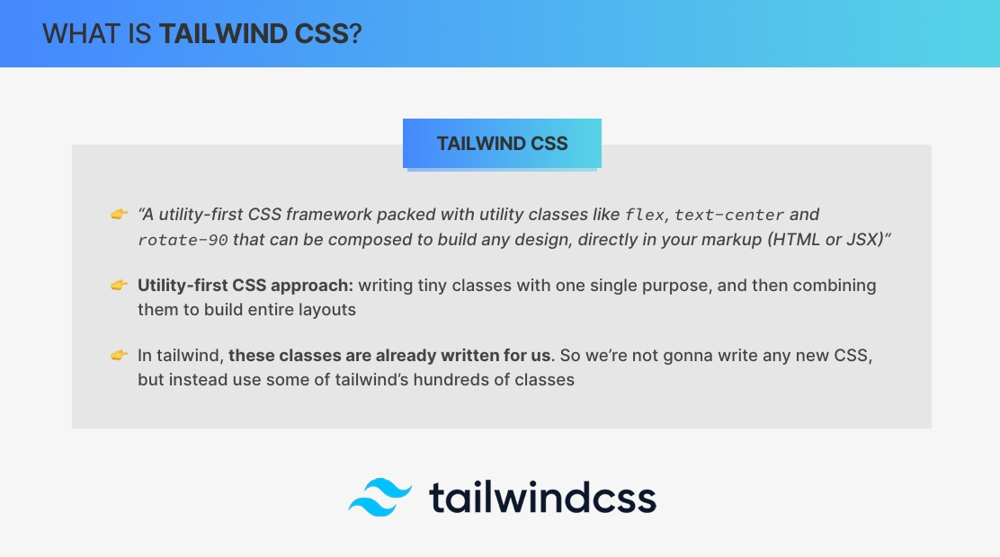
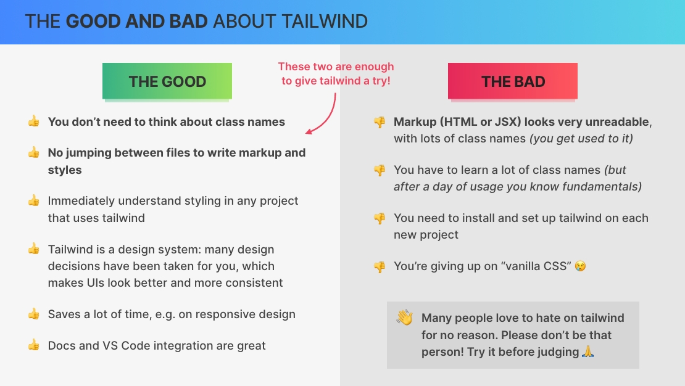

# `Tailwind CSS Crash Course Styling the App`

## `Table of Contents`

1. [Section Overview](#section-overview)
2. [What is Tailwind CSS](#what-is-tailwind-css)
3. [Setting Up Tailwind CSS](#setting-up-tailwind-css)
4. [Working With Color](#working-with-color)
5. [Styling Text](#styling-text)
6. [The Box Model Spacing, Borders, and Display](#the-box-model-spacing-borders-and-display)
7. [Responsive Design](#responsive-design)
8. [Using Flexbox](#using-flexbox)
9. [Using CSS Grid](#using-css-grid)
10. [Styling Buttons Element States and Transitions](#styling-buttons-element-states-and-transitions)
11. [Styling Form Elements](#styling-form-elements)
12. [Reusing Styles With @apply](#reusing-styles-with-apply)
13. [Reusing Styles With React Components](#reusing-styles-with-react-components)
14. [Absolute Positioning, z-index, and More](#absolute-positioning-z-index-and-more)
15. [Configuring Tailwind Custom Font Family](#configuring-tailwind-custom-font-family)
16. [Styling the Menu](#styling-the-menu)
17. [Styling the Cart](#styling-the-cart)
18. [Styling the Order Form](#styling-the-order-form)
19. [Styling the Order Overview](#styling-the-order-overview)

---

## `Section Overview`

Now it's time to actually style or application. And this time, I didn't include any pre written styles because I want to teach you all about Tailwind CSS in this Tailwind crash course. Now many people have heard about Tailwind before and really don't like it. It is however getting super popular, especially combined with react And therefore, many people do want to learn tailwind, which is why I decided to add this section to the course. Now if you're not interested in this, you can safely skip this section and pick up the project right in the next one.

But for the rest of us, let's now go set up Tailwind from scratch and then use it to style all the components that we need in this app.

---

## `What is Tailwind CSS`

So as always, let's start the section by understanding the technology that we're gonna be using. So in this case, that's `Tailwind CSS`.

**What is tailwind CSS or tailwind for short?** Well, I think there is no better way of defining tailwind than the description that they have on their own website, which says that `tailwind is a utility first CSS framework packed with utility classes like flex, text center and rotate 90 among many many other classes that can be composed to build any design directly in your markup. So right in your HTML or JSX.`

Okay. **So that sounds nice but what actually is this utility first CSS approach?** Well, basically when we write utility first CSS, we write lots and lots of tiny classes where each class has one single purpose. And we then combine these classes to build entire components and layouts. So that's the idea behind utility first CSS or atomic CSS, which is the same thing.

Now, Tailwind did not invent this approach, but they were the ones who made it really popular by building this super high quality framework that's also super easy to use. So basically, in tailwind, all these tiny classes that we just talked about are already written for us ready to be used. So when we use Tailwind for our styling, we're not gonna write any new CSS at all. Instead, we will leverage some of Tailwind's 100 of classes to design and build anything that we can imagine. So it's really that powerful.



Instead of me listing all the great features here of Tailwind, let's do this as a list of pros and cons because of course there are also some problems with an approach like this.

### Good Parts

1. So one of the main advantages of using Tailwind is that you don't have to worry about naming classes ever again, which means that you can focus on writing your styles instead of coming up with class names.
2. Another huge benefit of tailwind is the fact that you don't have to jump between files all the time. So as you write markup and styles, you do it all at the same time and all in one place which is incredibly convenient once you get used to this workflow.
3. And a great side effect of this is that you will immediately understand the styling in any project that uses Tailwind, which will not only make it easy to collaborate with other people but also to come back to your own projects after many month or even years. So in my opinion, these first two advantages alone are enough reason to give tailwind a try. Not thinking about classes and not having to jump between files all the time is really a game changer. But there are even more advantages. For example:
4. Tailwind can really be seen as a design system with very good predefined colors, font sizes, spacing and more. So the framework itself has already taken many good design decisions for you which empowers developers to build beautiful and consistent UIs a lot easier than before. So all of this will of course save you a lot of time, not only because you will write a lot less CSS but also because things like responsive design are extremely easy and fast to implement as well.  
5. And I could really go on and on here, but just one more thing that I will say is that Tailwind's documentation is world class. And the same is true for the integration into Versus code, which gives you auto completion for all tailwind classes. Now, okay, but enough praising, let's go to the bad parts that everyone likes to point out immediately.

### Bad Parts

1. And the biggest thing that people seem to hate about tailwind is that the markup, so the HTML or JSX will look extremely ugly and sometimes straight out unreadable. Because in order to style one element, you sometimes need 10 or 20 classes which will quickly make your markup look very cluttered. This however is not really a huge deal as you get used to it pretty quickly. Like after a day or two using tailwind, it's not gonna be a huge problem anymore.
2. What could be a small problem is that you will have to learn all the tailwind classes that they provide or at least the ones that you need the most. And so that's surely some extra effort there. But luckily for us, these classes are really well named and quite intuitive. And so again, after a day or two, you will have automatically memorized the most important class names that you use all the time.
3. Another downside of tailwind is that you need to install and set up tailwind on each new project, which will always take like 5 or 10 minutes.
4. Now the biggest issue, at least for me personally, was the feeling that I was kind of giving up on vanilla CSS. So as I'm recording this, I wrote my first line of CSS almost 20 years ago. So that's a lot of investment in one technology. I also was always against all kinds of CSS frameworks, for example, like Bootstrap or even against React component libraries, simply because I wanted to write my own styles. However, with Tailwind, I do actually feel like I'm still writing my own CSS, just in a different way. Tailwind is such a thin layer of abstraction that it doesn't make you feel completely removed from CSS.



So in my opinion, the benefits clearly outweigh the bad parts, at least enough to give Tailwind an honest try. So trust me, I was really hard to convince for all the reasons that I just talked about. And so if even I can like Tailwind a lot then everyone can. And I'm saying this because for some reason many people like to hate on Tailwind for no apparent reason, so without even having tried it. So please don't be that kind of person.

This is indeed a controversial technology, so just give it a try before forming an opinion about it. And in fact, this section of the course gives you exactly that opportunity. So over the next few lectures, we will style the entire project that we're building right now using 100% tailwind. And so this is guaranteed to show you if you like tailwind or if you're never gonna use it again. So let's go find out.

---

## `Setting Up Tailwind CSS`

So as I mentioned in the previous lecture, we need to set up Tailwind on each new project that we want to use it on. And so let's now do that for our current project. Now instead of me just showing you all the steps to set up Tailwind, let's actually follow the official documentation.

So let's open up a new browser tab and then we just Google for Tailwind and then this will take us to their documentation page. So here we then move to the documentation and actually immediately we are on the installation page. <https://tailwindcss.com/docs/installation>

Now it's also important that you select version 3 right here. So whatever is the latest version of the major version 3 because that's the one that we're gonna be using in this course. Okay.

So here we have different options for installation. Let's select the framework guides. And then what we want to do is to set up Tailwind with Vite. And again, if in the meantime, the website here has changed then just Google for Tailwind install Vite. And so that will then probably take you to the exact same page.

Alright. And so now that you have your list of instructions, let's just follow it. So the first step, of course, we already did. So we already have our project.  

So next up, we need to install Tailwind like this. I want you to make sure that you are using Tailwind at version 3 because otherwise something might have changed in the meantime.  
So let's head back here and get this next step. So let's do this one which will then create the tailwind and the post CSS config files.

```bash
npm install -D tailwindcss postcss autoprefixer
npx tailwindcss init -p
```

And so now we have these two new files. So `postcss.config.js` and `tailwind.config.js`.

So let's see what we have to do next. And so for this one, let's actually open up our tailwind config file.

And so what we need to do is to now copy this array to the content. So instead of this empty array, what we want is this, to basically tell Tailwind where our index. Html file is located and also where all our JavaScript files are located.

```js
// tailwind.config.js
content: ["./index.html", "./src/**/*.{js,ts,jsx,tsx}"],
```

So by default they are inside this source folder but if for some reason we changed all of this right here then we would also have to change this config. But by default this is how it works.

Let's keep going. And so now what we have to do is to actually change our index.css file for the first time. So let's grab all of this⤵️. So copy this and paste it right at the very top of index.css.

```css
@tailwind base;
@tailwind components;
@tailwind utilities;
```

And with this, we are actually finished. So, all we need to do now is to start our project and then we can start using Tailwind in our project.

So npm run dev. So let's wait for it. And in fact, we can immediately see that something looks different here. So Tailwind already applied some base styling to our application.

So basically it removed all the styling from all the elements. And if you want to know exactly what that CSS reset is, you can come here to the documentation again and it is right here in this **`preflight`**. So all the base styles that Tailwind is applying are described right there. But anyway, let's now test this out for the very first time. So just to see if tailwind is really working. So let's come to our homepage and then let's style this text a bit.

```jsx
<h1 className="text-xl text-yellow-500 font-semibold">
  The best pizza.
  <br />
  Straight out of the oven, straight to you.
</h1>
```

So you just wrote your very first line of tailwind CSS, and the result is exactly what we might have expected, Now, of course, we will go over the course of the section into how all of these class names work. But for now, I just want you to type these classes just to see their effect.

**Now, okay. So we might think that with this we are done but actually there are two more things that we need to do.** And the first one is to install the Tailwind VS Code extension. So the nice thing about this is that it will now show you exactly what CSS is being written for you as you use each of these classes. So hover over any class name it will give you CSS properties and values. So for example, text xl corresponds to a font size of 1.25rem which is equivalent to 20 pixels.

So that's really really helpful but that's not even all because we also get now auto completion out of the box. So if we start writing text center, for example, then here we get this auto completion.

Okay, so this is one of the important things that we needed to do. **And now finally we also need to install a special `prettier extension`.**

<https://github.com/tailwindlabs/prettier-plugin-tailwindcss>

We need to install also this one. So let's copy that, open again a new terminal, and then install this plugin.

```bash
npm install -D prettier prettier-plugin-tailwindcss
```

And so what this will do is to automatically sort the order of the class names in the way that Tailwind recommends it.  
And this is gonna be pretty helpful for you because then you will always find the same class names in the same position of this long string of classNames.

Alright, and now this might already work by default out of the box but just to make sure let's also create this Prettier config file (may be .prettierrc) and then copy this code in there. So you see that we are starting to have a lot of these config files but well, that's just how it works in modern React development or actually modern web development in general. So prettier.config.js. We could even config all kinds of other stuff about Prettier here.

So in case you're not familiar with this config file, for example, we could also say that we want single quotes instead of double quotes.

But here is the problem. So rename prettier.config.cjs to end in cjs. Okay.

Great. So now we have a tailwind correctly set up and so we are ready to start using it right in the next lecture.

---

## `Working With Color`

Let's now start to really dive into Tailwind by learning how to work with colors.

<https://tailwindcss.com/docs/installation>

And to start, let's go back to Tailwind's excellent documentation. So whenever you are writing some tailwind, I think it's always a good idea to keep this documentation open at all times because this documentation is really really well made and will allow you to find what you're looking for very fast. And so with this you will be learning the most important tailwind classes in no time.

So let's then come again here to the menu(sidebar).

So let's come here to the customization part, and then let's check out Tailwind's colors. So Tailwind comes with all these different color palettes predefined. And so what usually we do when we are designing a page is to select like one gray color and then we also have some main or base or primary color for our brand or for the application. So that's going to be one of these other colors.

**Now, of course, we can also use our own color palettes simply by adding them to tailwinds config file.** But for now we will not do that and instead we will just select some colors from here.

So our main color will be the Yellow and so that's why we used text yellow 500 for this h1. So this color name and this number right here maps exactly to the colors that we have here.

So this is the yellow and this is the shade of 500. And as you see, they vary here between 50 and 950. And so if we wanted this h1 here to be a bit darker then we could use for example a 700 and then that got a little bit darker or of course we could also go really bright for example 300. But 500 works best in this situation. So you see that to change the color of text we use **text** and then **dash** the **color** and then dash the **shade**. like this: `text-yellow-500`

Now, if you didn't know yet how to style the color of text then you could come, so sidebar, where we have all these different properties or all these different classes that we need. So here in typography we have for example the text color but even easier than scrolling up and down here all the time is this really nice search bar. So you can just click here or at any time hit control or command k `Control + k`, and then here you can search for example for text color.    And so that will then bring you to that page. And so then here indeed it shows you that we can control the text color using text dash and then the color itself. So with this name of the color and then the intensity. We can also give it some opacity like this: `text-blue-600/75` as we can see here but let's leave that for later. Okay.

Now sometimes we also need this color set to inherit and so then we can use `text-inherit` class or we need to set it to transparent then we can use `text-transparent` class.

So that's one way where we use color and another one is background color. So let's try for that.

So background color and there it is. And so here you see that basically we set the background color of some element with **bg dash and then again the name and the intensity of the color like this: `bg-yellow-500`** that we want. So that's pretty intuitive, I think.

And let's start with our header element. So let's give it the same yellow here as a background. And so we just type bg yellow 500, and beautiful.

```jsx
function Header() {
  return (
    <header className="bg-yellow-500">
      <Link to={'/'}>Fast React Pizza Co.</Link>

      <SearchOrder />
      <p className="text-stone-300">Muhammad</p>
    </header>
  );
}
```

Let's also style CartOverview, the the color that I want to select, Right here. So I'm actually going to select this **`stone gray`** because it has a bit of this brown touch which compliments the yellow color very nicely. So these ones up here are a bit more bluish, so they are a bit colder and then these grays here get a bit warmer.  
And so I'm looking for one of these more warmer grays. Alright. So let's add that background color right there. So `bg-stone` and then let's see what happens if we go for the darkest one which is 950. So that's almost black.
So that's maybe a bit too much. Let's see 900 and that's still pretty black and 800 I think looks just right.`bg-stone-800`.

Then we have the problem that the text becomes too dark as well. And so let's immediately change the text color as well. So let's say text and instead of making it completely white. So usually white color doesn't look so good and instead it's best to use the same color but with a lighter shade. So let's use a 200 and that looks just right. So with this the contrast isn't too high. Now here since I want this link actually to stand out, let's make this paragraph then just a bit darker.

```jsx
import { Link } from 'react-router-dom';

function CartOverview() {
  return (
    <div className="bg-stone-800 text-stone-200">
      <p className="text-stone-300">
        <span>23 pizzas</span>
        <span>$23.45</span>
      </p>
      <Link to="/cart">Open cart &rarr;</Link>
    </div>
  );
}
```

So let's say, text stone 300 and Yeah. Nice. So just a very small touch but since we have all these colors available, why not just use them to create a little bit of visual hierarchy. Alright.

And now let's go back to Home because I want to style this here in a bit of a different way.

So right now the entire text of h1 is yellow but actually I want it to be gray and then only after br it should be yellow. So let's make this one here actually again with our stone color and then 700. So this is a color that looks really nice on top of a white background And then let's just wrap this here into a span just like this. And then let's give this one here the text color of yellow 500.

```jsx
function Home() {
  return (
    <div>
      <h1 className="text-xl text-stone-700 font-semibold text-center">
        The best pizza.
        <br />
        <span className="text-yellow-500">
          Straight out of the oven, straight to you.
        </span>
      </h1>
    </div>
  );
}

export default Home;
```

And, yeah, there we go. Great. And this is essentially how you work with colors in tailwind. So you need to know the name of the color and then whenever some color is necessary like in a background or for text, you just add the color name and the color shade and then tailwind will transform this to our actual CSS.

---

## `Styling Text`

Next up, let's do some basic text styling. But before we go do that, I actually wanted to show you something else in the previous lecture. But let's now go do that, **which is that of course we cannot only use these tailwind classes in the JSX but also inside or HTML.** So for example, we can add some classes to the body that we want every element on the page to inherit or that we want to set on the entire body element. So typically that is like a background color or a text color that we want the entire page to inherit. So that's pretty standard CSS which I'm assuming at this point that you know about.

In html we do not use the className but just class which is regular HTML. And so, let's give this here a background color of stone 100. And so, you see that it turned a little bit darker here.

```html
<body class="bg-store-100 text-store-700"></body>
```

So a bit gray. And then let's also give it the text color of also stone and 700.

Great. So we already learned a little bit about formatting text actually or we didn't really learn but we already used it in the 1st tailwind lecture. So we learned that we can basically position text with text dash center or we can also use text dash right to center it to the right or to the left which is not really necessary because that's also the default.

Now the most common thing I would argue that we do with text is to define the **text size** and the **font weight**. And so let's again come to our documentation and then we have all the most important classes regarding `typography`.

And so let's start with the font size. So here we have all the classes that we can use in order to style the size of text. So text extra small, small, base then large, extra large and then all the way to 9XL. So which then gives us this font size of 8rem(128px).

And notice how this not only sets the font size but also the line height which immediately makes the design look a bit better.

Now this class name was for me one of the more confusing ones because font size is the name of the CSS property, but then in tailwind it is called text for some reason. But again after some time you will just automatically memorize this.

Then for the font weight the property is actually called font and then something. So instead of having to mess with these different numbers now we just have names. So font-semibold, which is the one that we used for h1 there.

Let's come to the CartOverview again and let's do some changes. So first, let's make this text also semibold. And so as we start typing out these classes, we will slowly start memorizing them automatically. And finally, let's also make all of this upper case. So both the link and the paragraph, and so we can do that in the parent element. And so to make text upper case, all we have to do is the upper case class.

```jsx
function CartOverview() {
  return (
    <div className="bg-stone-800 text-stone-200 uppercase">
      <p className="text-stone-300 font-semibold">
        <span>23 pizzas</span>
        <span>$23.45</span>
      </p>
      <Link to="/cart">Open cart &rarr;</Link>
    </div>
  );
}
```

Yep. That worked. And so let's move on to the header. And here, let's do actually the same thing. So make this here upper case as well. And also i want to give it some letter spacing.

The class name for letter spacing is a bit confusing. So for me that was one of the hardest ones. And so let's just search for that. And so we have the actual name which is this **tracking**. And so let's try this widest one. So tracking **widest** and nice. So at this we got some space here between our letters.

```jsx
<Link to={'/'} className="tracking-widest ">
  Fast React Pizza Co.
</Link>
```

Now notice how this tracking that we just used is actually the highest one. So it's the widest one that we can use, but **what if we want more?** Well, let's come down in documentation. what we're concerned with is to give an arbitrary value. So some other value that is not covered by one of the tailwind classes. So in this case we can instead of defining this keyword like wider, use the square brackets and then place any value that we want. So that can be pixels or rams or whatever we want.

```jsx
// <Link to={'/'} className="tracking-widest ">Fast React Pizza Co.</Link>

<Link to={'/'} className="tracking-[5px] ">Fast React Pizza Co.</Link>
```

Okay. So that's not really so relevant and shouldn't be used all the time but it's nice to know that this works in tailwind. And of course, it doesn't only work with the tracking where it's not really that important but it also works for example with the text size.  

```jsx
<h1 className="text-[100px]  font-semibold text-center">The best pizza.<br /><span className="text-yellow-500">Straight out of the oven, straight to you.</span></h1>
```

So for example, here we could also say text should be 100 pixels then it would become huge. So even though there is no actual tailwind class for these 100 pixels. So there is something similar, maybe 96 pixels or something like that, but something truly huge. Let's say we wanted 300, then we would really have to use like this `escape hatch`.  
So this is basically an escape hatch where we can escape the predefined in more rigid classes of tailwind. But most of the time we shouldn't do this and just stick to the classes that tailwind gives us. So 99% of the cases they are more than enough.

And now just to finish I want to also style this user name in Header. So let's actually create a new component in the user feature folder. For now just hard code my name again but later on this will actually come from Redux.

Let's include that in Header.jsx. And then let's just style it a little bit. So let's make the text smaller. So it text as m and also make it semi bold again.

```jsx
function Username() {
  return <div className="text-sm font-semibold">Muhammad</div>;
}
export default Username;
```

And with this we have styled, most of the text that is visible right now. Of course, we still have all these other pages to style but we will leave that for a bit later.

---

## `The Box Model Spacing, Borders, and Display`

One of my favorite things when working in tailwind is spacing. So using classes for **margin** and for **padding** and also for all the other things in the **box model**. So things like **borders** and **display**. And so let's now explore these a little bit as these are one of the most important things that we use all the time in tailwind.

Now, let's start by actually including this createUserForm component right into the Home page. So here we have very basic form but now we need some spacing around all of these elements in Home Page.

### `Margin and Padding`

So we need some spacing between the h1 and the form and probably also at the beginning. So let's use some of tailwinds classes for that. So right in the h1, we want to now add some margin to the bottom. And the way we do that is by writing **mb** and then some number.

So this mb-4, all it does is to set margin bottom to 1rem. And so let's now come to our tailwind docs and let's search for margin.

<https://tailwindcss.com/docs/margin>

So this one actually takes some time to memorize because there are many different options. But basically the **m always stands for margin** then **x** means in the x direction, so left and right. The **y** direction is top and bottom, and then we also have margin for the top, the right, the bottom and the left. So these are the most important ones that we really need to know.

So 0 is of course 0 pixels, then we have 0.5, and then from there we have some scale that tailwind came up with. So we have 1 which is 4 pixels, then 6 pixels which is this 1.5, and then so on and so forth.  
But it is not a linear scale because for example, 8 is already 32 pixels. So this 8 is not 8 pixels. You see it finishes at 96 which is this huge margin. **`m-96 margin: 24rem; /* 384px */`**  
**We also have auto here which is margin auto that we use many times to center elements.**

**So, what I just explained works this way for margin and also for padding.** So we also have like pb-4.

```jsx
function Home() {
  return (
    <div className="text-center my-10">
      <h1 className="text-xl  font-semibold mb-8">
        The best pizza.
        <br />
        <span className="text-yellow-500">
          Straight out of the oven, straight to you.
        </span>
      </h1>

      <CreateUser />
    </div>
  );
}
```

`my-10`, So that gives then 10 pixels to the top and to the bottom and not 10 pixels but really just this value of 10 which translates to actually 40 pixels.

Next up, let's go to the header and add a little bit of padding inside the header. So just add some padding to the x direction. Let's say px-4, And so that x direction is the left and the right and then top and bottom py-3. Okay.

```jsx
<header className="bg-yellow-500 uppercase px-4 py-3">
</header>
```

### `Border`

Now let's also add a border. So the border is also part of the CSS box model and so let's also talk about. So the way in which we add a border is in two steps. First, we write border and then the direction which again is b for bottom, but it could also be top or it could be left, right, or x and y. But we just want it at the bottom and then we can again set a value for the width. So this one for example would be 2 pixels. Now we don't need anything actually because by default if we just write border b that will then be 1 pixel, and then as a second step we also need to define the color. So that's border and then we write a color in our usual way. So stone and then some color.  
**`border-b-2 border-stone-500`**  

### `Space Between`

And then to finish let's as always also style this **cartOverview** that is part of our layout. So here we want some padding as well. So let's do just padding and then p-4. And so this will then apply it to all 4 sides.

**And now staying again on the topic of spacing tailwind actually includes a very very nice and helpful class which allows us to add spacing between elements in a very easy way. So without flexbox tricks.**  
Let's say we wanted some space between these two **span elements** inside p tag. So by just doing, on the parent we simply use space then the direction. So x for horizontal and y for vertical and then the amount, and beautiful.

```jsx
<p className="text-stone-300 font-semibold space-x-4"><span>23 pizzas</span><span>$23.45</span></p>

// And let's see what this actually does. So what CSS is actually written, and so this one is a little bit more complex. And so with this class we can achieve this really important thing that we need all the time just by writing this simple class. 
```

So by now hopefully you are starting to see all the advantages that tailwind gives us. So again for me the main advantage is that we can write all of the styling here without having to switch between CSS and JSX or between these component files. And also we don't have to come up with all these class names which is always a lot of work which might sound strange but actually if you have a large application then you need to come up with lots of class names which will then create all sort of problems.

### `Display`

And now just to finish let's also talk about the display property because that is once again also part of the CSS box model.

So basically for all of these different display set to anything the class name is simply the property value. So we have **block**, **flex**, **inline** and then the one that I'm interested in now is the **hidden** one. So in this case it's actually different from the value. So **display none is equivalent to the hidden class**.

So what I want to do now here is to hide the user on smaller screens.

Let's use the hidden class and then it's gone.

```jsx
return <div className="text-sm font-semibold hidden">Muhammad</div>;

```

Nice. Now notice how I just talked about smaller screens which actually brings us to the topic of responsive web design which is fundamental in Tailwind. And so let's now move on to the next lecture and start learning about that.

---

## `Responsive Design`

The way in which responsive design works in Tailwind is one of the most fundamental things that you need to understand about Tailwind. And so let's now get to that. So by default, Tailwind comes with 5 breakpoints. And these breakpoints are mobile first which means that they are min width media queries.

So let's again head over to the documentation and check this out. So this is one of the core concepts. And of course you can read about all these other ones, but here we are focused on responsive design.

```txt
sm 640px @media (min-width: 640px) { ... }
md 768px @media (min-width: 768px) { ... }
lg 1024px @media (min-width: 1024px) { ... }
xl 1280px @media (min-width: 1280px) { ... }
2xl 1536px @media (min-width: 1536px) { ... }
```

And so here we have these 5 min width media queries that I was just talking about. So again, these are mobile first. This means that when we're working with Tailwind, it's usually a good idea to start by implementing the mobile layout. So a mobile first design.

**The way that this works in practice is that we can prefix any of tailwinds class names with one of these breakpoint prefixes.** So the `sm` is for the small media query. So for all the viewport width that are larger than 640 pixels and the same with these other ones. But since this is a bit confusing to just understand like this let's again use it in practice.

So since tailwind is mobile first all of these classes will by default apply for all the screen width. And then if we use one of these prefixes that will then apply from that viewport width on.  

So let's say that when the viewport is a bit larger we actually want more margin on Home page. And so we can basically redefine this margin here for one of these breakpoints. So let's say that at the small breakpoint, so sm then colon we want margin y to be 16.

```jsx
<div className="text-center my-10 sm:my-16">
</div>
```

So notice how here the small breakpoint starts at 640. And so whenever the width is greater than 640 then this margin will override the default one that we have here. And so that's what I was saying initially. So that these classes, so the default ones without any prefix are the mobile first classes. So they apply only if there is no breakpoint overriding them. So here as we approach then that other width, then here we get this extra space. So the margin is then increased because then from there on this class here is going to be applied and is overriding this one. Alright.

So it's very important that straight from the very beginning you start getting into the habit and into the mindset of building your layouts mobile first. And then from there you can start adding these prefixes here for different media queries. Okay.

So now let's start also applying a bit more spacing in the header and also in the card overview. So here also from the small viewport on, let's change the padding in the x direction to 6.

Don't make the mistake that many developers make which is to think that this **(sm)** small means that this class is going to apply to small screens. So that's not how it works.  
How it works instead is that this class starts being applied from this value on. So from the small breakpoint on which is this 640 pixels, but below that everything that we have here without the prefix will be applied. Alright.

So here we will have the p x, so padding at x also set to 6 but as we save this actually nothing happens. And the reason for that is that we do not have the unprefixed version of this. So instead of p 4 let's do px4 and py4 which is effectively the exact same thing.

```jsx
<div className="bg-stone-800 text-stone-200 uppercase py-4 px-4 sm:px-6">
  <p className="text-stone-300 font-semibold space-x-4 sm:space-x-6">
    <span>23 pizzas</span>
    <span>$23.45</span>
  </p>
  <Link to="/cart">Open cart &rarr;</Link>
</div>
```

---

So next up, we have the medium`md` one which starts applying at 768 pixels. Now, if you took any of my HTML and CSS courses, you will know that we should usually not target any devices in our breakpoints, `but instead we should set breakpoints at specific points where our design actually breaks.` So where there is some problems in our designs.  
And so if you are using tailwind in a real world project we should actually customize these breakpoints. So basically creating our own which should be explained somewhere down in the responsive design tab in the tailwind docs. So we can customize your theme in the tailwind config file where we can then give it our own names. So you could call them `tablet`, `laptop`, and `desktop` instead of just small, large, and medium, and then also specify our own values.  
<https://tailwindcss.com/docs/responsive-design#customizing-your-theme>

So just with all the default values.

Next up, let's also style a little bit this create user.

```jsx
<p className="mb-4 text-sm text-stone-600 md:text-base">
  👋 Welcome! Please start by telling us your name:
</p>

<input
  type="text"
  placeholder="Your full name"
  value={username}
  onChange={(e) => setUsername(e.target.value)}
  className="w-72"
/>
```

Great. So we're making great progress. Next up, one of the most important things we haven't talked about yet is basically building layouts, so flexbox and CSS grid. And so let's start talking about flexbox right in the next lecture.

---

## `Using Flexbox`

Now it's time to finally learn how to use Tailwind's utility classes to implement layouts with flexbox. And let's actually start in the CartOverview. So the simple thing that we want to do now is to place the link of `OPEN CART` and the text side by side. So that's something very easy to do with flexbox.  
So all we have to do is to make this a flex container then align the items vertically and then also justify the items. So this is what we do most of the time in flexbox. And so let's now learn how to do that. So the flex container is of course the parent container of both the link and this paragraph.

So in order to declare this as a flex container we usually do display flex. And so in this case, we just have to do `flex` because as we hover over this, we will see that this implements exactly display flex.

Then let's say we want to vertically align the items and for that we would use align items center. So the corresponding tailwind class for that is `items-center`, let's also justify the items. So if we want the space between them to be basically divided between all the different items, we would usually do justify content space between. And so in tailwind that is `justify-between`, and beautiful.

```jsx
function CartOverview() {
  return (
    <div className="bg-stone-800 text-stone-200 uppercase py-4 px-4 sm:px-6 md:text-base text-sm flex items-center justify-between">
      <p className="text-stone-300 font-semibold space-x-4 sm:space-x-6">
        <span>23 pizzas</span>
        <span>$23.45</span>
      </p>
      <Link to="/cart">Open cart &rarr;</Link>
    </div>
  );
}

```

Nice. And as always, let's also check out flexbox from tailwind docs.  
<https://tailwindcss.com/docs/flex>

And now let's do the same thing here in the header as well. So making it a flex container then align items center is items center. And I think that all of these are actually pretty easy to memorize.

And now it's actually time to also bring back the username there.

```jsx
function Username() {
  return <div className="text-sm font-semibold hidden md:block">Muhammad</div>;
}
```

And for now, this is all I had to show you about flexbox. And so next up is CSS Grid so that we can actually build or layout a bit better.

---

## `Using CSS Grid`

Next up, let's use CSS Grid in order to build or over all layout, and we will then also improve that layout using some additional tailwind classes. So basically, what we want to do is to set up a grid which contains 3 rows for the layout. So one row here for the header, one for content and one for CartOverview.

The goal of that is that we can then easily push CartOverview all the way to the bottom of the screen.

So let's come here to our AppLayout, and then let's make this the grid container.

```jsx
<div className="grid grid-rows-3 h-[400px] bg-red-500"></div>
```

Now the problem with this is that it will create 3 rows of the exact same size which is really not what we want. Instead, what we want is or can be visible actually right here which is to have 2 rows like this.

So the first one(header) should be just the size of the content, the, last one(footer) as well, and then the one in the middle(content) should fill all the other remaining space. And so let's go ahead and do that.

The way we can do this is to again use square brackets to define our own custom column. So again kind of as an escape hatch from tailwind. And so here we can say auto then we need this underscore then 1fr and then auto again.

```jsx
<div className="grid grid-rows-[auto_1fr_auto] h-[100vh] bg-red-500"></div>
```

Now to finish let's just get rid of this `h-[400px]` and instead of specifying a special value we can use `h-screen`. And so this will then give it basically the entire height of the viewport which is equivalent to setting the height to 100vh units.

---

***`01/01/2025`***  ***`11: 49 PM`***

---

Yeah. Now that's great. But watch what happens if the page was really small, so for very> small viewport height. So then we would have to scroll which is really not what we want. So what we need to do is to set the scroll behavior to scroll on the main element(so the content, not header and footer).  

```jsx
<main className="overflow-scroll">
  <Outlet />
</main>
```

So again, that's pretty standard CSS but with tailwinds all we have to do is to use the class of `overflow-scroll`.

Now next up, let's go to the new-order page. So /order/new and then here we see that we have all this content in the left side of the page.  
So usually what we do most of the time when we design a page or an app is to center somehow the content. So center it in the middle of the viewport. And so let's also learn how to do that.

```jsx
<div className="overflow-scroll">
  <main className="max-w-3xl bg-red-500 mx-auto">
    <Outlet />
  </main>
</div>
```

So now the scroll bar is nicely appearing on the right side and everything works nicely. Alright. So let's remove this from here and beautiful. Now, we could also add the, margin that we have in the homepage. So here at the top and at the bottom.

So let's do that here maybe. So we could do margin y and set it to 10 again. And so that would then create some nice spacing.

```jsx
<div className=" overflow-scroll my-10">
    <main className="max-w-3xl  mx-auto">
      <Outlet />
    </main>
  </div>

  <CartOverview />
</div>
```

But actually I want different spacing at the top of the page for different pages. And therefore let's define this margin individually for each page and not here on this wrapper in AppLayout. So basically all the styles that we defining right in the AppLayout will apply to all the pages because the pages are rendered in the outlet and therefore here inside these elements. But of course, we can also set individual styles on the page level simply by adding some styles, well, to the components that make up these different pages. So let's revert it back to what we had and with this we finished the lecture on CSS Grid. And as always, make sure to check out the documentation here to learn everything that you need to know. But for now, let's move on to our next topic.

---

## `Styling Buttons Element States and Transitions`

Next up, we're gonna take a look at element states such as **hover**, **disabled**, or **focus**, and we will also implement CSS **transitions**. And we will do all this while styling some links and buttons.

So in the cart page, so up here we have `Back to menu` link. And now I want to style this here a little bit, so make it blue like a usual link, and then when we hover it I want to make it a bit darker. So that's something pretty straightforward, and so let's learn how to handle that hover state in tailwind.  
Let's implement the hover state and it's as simple as now writing hover and then here writing another class name which will then replace the other one.

```jsx
<Link to="/menu" className="text-sm text-blue-500 hover:text-blue-600 hover:underline">
  &larr; Back to menu
</Link>
```

So this was just a very simple example. And so next up let's style a more complex button.

So let's come again to /order/new and now we want to style this `Order Now` button. So let's close this and then in create order this is where all button is. Yeah. Right here. And let's start here with some basic stuff.

So let's give it the same background color as the rest of the app. So let's make the text also upper case, let's make the font semi bold, let's make the text also darker since we are now on this yellow background. And so remember that our gray is stone and then let's use the 800 variation. And finally, let's add some padding. So vertically let's use 3 and horizontally let's use 4. And in order for this to actually take effect, we need to make this button an inline-block. So that's display inline block, and the corresponding tailwind class is just inline block.

Alright. So this is already looking pretty nice. Let's just add maybe some letter spacing there. And then finally let's also give it some rounded corners. So that's a new class that we haven't talked about yet but it's very simple.

```jsx
<button
  disabled={isSubmitting}
  className="bg-yellow-400 uppercase font-semibold text-stone-800 py-3 px-4 inline-block tracking-wide rounded-full"
>
  {isSubmitting ? 'Placing order...' : 'Order now'}
</button>
```

And so with this basic styling in place, let's now add some element states starting again with hover. So when we hover this time we want to make the background a bit lighter.

And so let's see, and indeed that works. However there is no transition, so no animation which usually we also have in most web applications. And so let's now add that transition here in tailwind. And the way that we do this is to do transition and then the properties that we actually want to be transitioned.

```jsx
<button
  disabled={isSubmitting}
  className="bg-yellow-400 uppercase font-semibold text-stone-800 py-3 px-4 inline-block tracking-wide rounded-full hover:bg-yellow-300 transition-colors duration-300"
>
```

And what I wanted to show you in the first place was actually the focus state here. So let's just do it this way. So here by default we have this really ugly looking blue outline and so we don't want that. And so let's get rid of it.

So in order to remove that ugly focus there, we can do focus, so the focus state, and then here outline none. However, we cannot just leave it like this because this will create some accessibility issues.

And so we need to do something else. So in this focus state instead of having this outline we can use something that tailwind created which is what they call a **ring**. **So a `ring` as we can see here is basically some shadows that they will place outside the element.** So this creates this ring and then we also need to define the color of the ring. So again, that's within the focus state.

So all of this should only happen when the element is focused. And so we need to prefix all of this always with this focus word. So let's make it the same color as the button already has. So that's yellow 300 at least in the focused state because actually when we focus the button we also want the entire background color to change to that yellow. So yellow 300.

And so now watch what happens when we focus. Now we still cannot really see it because we forgot the **offset**. So focus ring offset and let's set it to 2. Nice. So this is looking a lot better than before, right?

```jsx
<button
  disabled={isSubmitting}
  className="bg-yellow-400 uppercase font-semibold text-stone-800 py-3 px-4 inline-block tracking-wide rounded-full hover:bg-yellow-300 transition-colors duration-300 focus:outline-none focus:ring focus:ring-yellow-300 focus:bg-yellow-300 focus-ring-offset-2"
>
  {isSubmitting ? 'Placing order...' : 'Order now'}
</button>
```

And again we can learn all about that in the documentation.

So again when the button is focused we give it this yellow background color which is the same one as the hover one. And then we remove the outline and give it ring. Here we could also specify some values to make it a larger ring. And then we give the ring a color and an offset. So a space between the ring and the element itself.

Okay. Next up, we could also use the **active state**. So which is basically the state whenever the button is being clicked. So this one we are not interested in but I just want to show you something. So just, let's say we give it another color and so as I click it will get that new color. `active:bg-slate-400`

But now finally what we actually want to do is to also style the disabled state. So in the disabled state we want to change the cursor. So we can use a cursor class. So cursor and then let's use the not allowed, `disabled:cursor-not-allowed`.  
And again, just make sure to check out the documentation to find out which cursors can be used.  
Let's just temporarily set this to true so we can see. And so now as we hover we can no longer click it and we get this visual confirmation of that. So this new cursor.

This is already more than enough. Alright. So this is by far the biggest element that we wrote yet. So the biggest class name string but don't worry, if we later want to reuse this button we will be just able to create a new component and then use that component and reuse it all over the application.

But let's leave that for a bit later and next up talk about styling form elements. So like these input fields right here.

---

## `Styling Form Elements`

So next up, let's style some form input elements using tailwind. And let's start with search order.

Let's get immediately started.

- So first of all we want it to be **completely rounded**.
- Then let's add some **padding** to it. So **p-x** and **p-y**.
- And so to make it a bit smaller, let's make the **text smaller**.  
- Let's also give it a very faint **yellow background** so that it blends in a little bit better with that background color.
- And next up, let's actually also **style the placeholder**. So in CSS we can easily style the placeholder pseudo element. And so in tailwind we can do the same simply by prefixing placeholder.  
So basically we want the placeholder to have a text color of stone 400. So making it a little bit darker.
- Also let's actually make it a little bit wider. So setting the width, so that's just w and then 28.  
- And so we need this to be really tiny because otherwise it might not fit besides the logo.
- And then right in the next media query, so at the next breakpoint we can make it a bit bigger.
- Next up, let's then also make it a little bit bigger as soon as we focus the element. So let's make it then 72 wide, and so as we click it gets a little bit bigger. However, it does kind of jump from one state to the other, and so that means that we need a transition here.
- And let's this time actually use **transition all**.  
- And let's set the duration again to 300 milliseconds, and that's a lot better.  
And now next up, let's take care of that **focus ring**. So let's first get rid of that.
- So **focus outline** none and then focus, let's use the ring.  
- Let's give it a color. So let's make it yellow 500 this time actually so that it stands out from the background.  
- Let's try this out and this is looking quite nice.
- Let's give this maybe some **opacity** so that we can try to play around with another class here. So ring opacity 50.

```jsx
<form onSubmit={handleSubmit}>
  <input
    placeholder="Search order #"
    value={query}
    onChange={(e) => setQuery(e.target.value)}
    className="rounded-full px-4 py-2 text-sm bg-yellow-100 placeholder:text-stone-400 w-28 sm:w-64 focus:w-72 transition-all duration-300 focus:outline-none focus:ring focus:ring-yellow-500 focus:ring-opacity-50"
  />
</form>
```

So I think this looks really nice. Now there's just one small problem which is if this is really tiny then if we now click then it becomes really big and messes up the entire layout on the small screen. So we need to fix that.  
So basically we only want the **wider width on fucus** to happen at the small breakpoint. So only after that breakpoint this should happen and that's no problem at all because we can actually prefix all of this also with the small breakpoint.

```jsx
<input
  placeholder="Search order #"
  value={query}
  onChange={(e) => setQuery(e.target.value)}
  className="rounded-full px-4 py-2 text-sm bg-yellow-100 placeholder:text-stone-400 w-28 sm:w-64 sm:focus:w-72 transition-all duration-300 focus:outline-none focus:ring focus:ring-yellow-500 focus:ring-opacity-50"
/>
```

Great. So we successfully styled this form input element. And so now let's go ahead to CreateOrder form and style that one.

And now we want to create some contrast here between the field and the background. So we want this to become a bit more visible. So let's add a border and this one is simply 1 pixel. So if we don't write any number here then by default it's just 1 pixel, and then let's give it some color. So border stone 200, let's say, and then also as always some space.

So some padding here vertically and some padding horizontally, or actually the other way around. Nice. And now we could go ahead and copy some of the styles that we just wrote earlier but instead let's just keep going here and just write the code. So again making it a bit smaller here, giving it a transition. So transition all setting the duration to 300 and also style the placeholder.

So let's say text stone 400 and actually there isn't even any place holder here. So I'm not sure why I did that but I guess it can not hurt also. The next let's get rid of that focus, So outline none and instead let's bring back our focus ring. And then also giving it the color of yellow 400. Alright.

And this looks already a lot better. So this one compared to this one. Now what I also want to do is to actually give it the full width of the form. So let's do width full which is exactly the width of 100%. So then it fills up the entire form.

So at this point it doesn't look so nice but we will take care of styling the page and the form itself later. What matters is that of course once the page becomes bigger then all of this stays nicely in the center. Alright. And also as we go bigger let's increase the field also a little bit more. So from the medium breakpoint on let's have the padding x set to 6 and then in the y direction to 3.

```jsx

<label>Address</label>
<div>
  <input
    className="rounded-full border border-stone-200 px-4 py-2 text-sm transition-all duration-300 placeholder:text-stone-400 focus:outline-none focus:ring focus:ring-yellow-400 focus:ring-opacity-50 w-full md:px-6 md:py-3"
    type="text"
    name="address"
    required
  />
</div>
</div>

<div>
<input
  type="checkbox"
  name="priority"
  id="priority"
  // value={withPriority}
  // onChange={(e) => setWithPriority(e.target.checked)}
/>
<label htmlFor="priority">Want to yo give your order priority?</label>
</div>

```

And that's actually it. So I could now go ahead and copy this entire thing to other input fields. But actually I will show you a way of reusing these classes in the next lecture. And so for now let's just leave it like this and not style these ones yet.  

So the only one that I want to style now to finish is this checkbox right there in the form.

So let's go there, add a class name, and the way we do this is to define a height and a width. So let's say height of 6 which let's see what that is.

So 24 pixels looks great. Then it should have the same width. And then here we can use the accent class. So the accent which allow us to also specify a color which will then style the, input like this. So basically what this does is to set the **accent color which is a pretty modern CSS property** which well then makes our style box or check box look like that.

```jsx

<input
  className="h-6 w-6 accent-yellow-400 focus:outline-none focus:ring focus:ring-yellow-400 focus:ring-offset-2"
  type="checkbox"
  name="priority"
  id="priority"
  // value={withPriority}
  // onChange={(e) => setWithPriority(e.target.checked)}
/>

```

---

## `Reusing Styles With @apply`

In this lecture, we're gonna learn how we can reuse some styles using tailwinds apply directive. So basically using apply, we can create an old school CSS class by composing many tailwind classes together. So let me show you what I mean by that. So let's come here to our index.css file.

Let's create a new so called **layer** which we called components. So in tailwind, we can create a few of these different so called **layers**.  

And if we want to learn more about that then as always you can check out the documentation because in practical terms that's not really important.

And so let's now create the input class. So just like this, and now what I want to add all of these different tailwind classes that we wrote in previous lecture for input filed. write @apply, and paste all of that, give it a save.

```css
/* index.css */
@layer components {
  .input {
    @apply bg-yellow-400 uppercase font-semibold text-stone-800 py-3 px-4 inline-block tracking-wide rounded-full hover:bg-yellow-300 transition-colors duration-300 focus:outline-none focus:ring focus:ring-yellow-300 focus:bg-yellow-300 focus-ring-offset-2 disabled:cursor-not-allowed;
  }
}
```

And now this input class is basically composed of all these tailwind classes. And so I can now replace this simply with input.

```css
<input className="input" type="text" name="address" required />
```

Let's reuse this class for other input fields.

So this looks really nice and helpful, right? But **that doesn't mean that we should start using this technique all over the place.** Because basically if we started to doing this for all our elements then we would simply go back to writing CSS in the old school way. So being back to writing classes and then applying those classes. So that's what we did before. And so then there would be no point in using tailwind in the first place.

So this should really be treated as an exception, **when there are so many classes that we are using all at the same time** like we had.

**We do not want to create a new component because the actual better solution would be to reuse all of this by creating a react component.**  
So for example creating an input component which we could then reuse in all these different places which is actually what we're going to do in the next lecture for our buttons.  

So again keep in mind that this way of creating new classes by composing many other classes together with apply should really be the exception and not the rule. Because with this, we are throwing out of the window all of the advantages that Tailwind actually gives us.

---

## `Reusing Styles With React Components`

So as I just mentioned, let's now learn about the better way of reusing styles in Tailwind, which is by creating new React components.  
We want to reuse all of the styles of the `Order now` button. And so what we're gonna do is to just create a new React component.

And in the generic components folder, let's create Button.jsx.  
And as always we need to then take in the children. So all the elements that will be passed into this button element And then here we simply return a button with all of the classes. Now to make this really reusable we also need to accept the disabled prop and then also place that on the button.

```jsx
function Button({ children, disabled }) {
  return (
    <button
      disabled={disabled}
      className="bg-yellow-400 uppercase font-semibold text-stone-800 py-3 px-4 inline-block tracking-wide rounded-full hover:bg-yellow-300 transition-colors duration-300 focus:outline-none focus:ring focus:ring-yellow-300 focus:bg-yellow-300 focus-ring-offset-2 disabled:cursor-not-allowed"
    >
      {children}
    </button>
  );
}

export default Button;
```

And that should actually be it. So here we should be able to just replace this button with the one that we just created but of course without this className.

```jsx
<Button disabled={isSubmitting}>{isSubmitting ? 'Placing order...' : 'Order now'}</Button>
```

It looks exactly the same. And so we can now back on our homepage, reuse the same button there.

Beautiful. Now, this is not perfect yet. So this needs a bit more styling. And here we can now actually reuse that input class that we already have. So in the previous lecture.  
And so we now get exactly the same style that we had before. And in this case, the advantage is that now onto this class, so onto all the styles that we already have, we can now keep adding on more. So here besides all of these we now also added this width and we can even add a margin to the bottom of 8 for example. And so this is another good use case of actually using the apply directive that we used in the previous lecture.

```jsx
<input
  type="text"
  placeholder="Your full name"
  value={username}
  onChange={(e) => setUsername(e.target.value)}
  className="w-72 input mb-8"
/>

{username !== '' && (
  <div>
    <Button>Start ordering</Button>
  </div>
)}

```

So whenever you are in a situation where you actually need to add a lot more other classes in some situations. And so here again we were able to use all the styles here from the input class but then add these 2 on top.  

And now let's also reuse this link(`Back to menu`) that we have in Cart. So let's open up the cart where we have this **Link** and then also in the error we have a similar looking link even though it is actually a **button**.

And so let's create another button. So this one will be a bit more complex. So let's call it a LinkButton.jsx.

And again it needs to receive the children and also the to prop. So let's just grab all of this because what we want to return from this link button is usually this Link. And here we now want to dynamically set the to.

```jsx
// LinkButton.jsx
import { Link } from 'react-router-dom';

function LinkButton({ children, to }) {
  return (
    <Link
      to={to}
      className="text-sm text-blue-500 hover:text-blue-600 hover:underline"
    >
      {children}
    </Link>
  );
}

export default LinkButton;
```

And so let's now use this in the Cart.

```jsx
<LinkButton to="/menu">&larr; Back to menu</LinkButton>
```

Beautiful. But now what about the button in Error.jsx? So we want to use the exact same thing right there, but there we have a button.

Well, let's do some trick here. Let's still use the LinkButton that we just created with this text but then as the **`to` prop**, let's pass in just minus -1 as a string. And then inside the LinkButton component, we can check whether this is the to prop that we received. And if so, what we want to return is this button. Alright.

```jsx
<LinkButton to="-1">&larr; Go back</LinkButton>
```

So we abstract again all that logic right here. So we can just say, if 2 is equal minus 1 then return this button right here.

```jsx
if (to === '-1')
return (
  <button className={className} onClick={() => navigate(-1)}>
    {children}
  </button>
);
return (
<Link className={className} to={to}>
  {children}
</Link>
);

```

And actually since we are already doing this, we should do something very similar with the first button that we built as well. Because right in the Cart, we actually have a link to order pizzas which we want to look exactly like all or other buttons. So we want to reuse those styles for this link here as well because indeed this is right now just a link which takes us to this new order page.

**So how can we do that?** Well, it's gonna be something very similar to what we just did earlier. So let's use our Button.

```jsx
<Button to="/order/new">Order pizzas</Button>
```

And then in the Button we need to accept this **to prop** because right now as we click on the button nothing is going to happen. So let's go to this Button component and then also accept the **to** prop And then basically if there is a to prop then all we want to do is to actually return a Link and not a Button. So exactly this link right here and again with the children. And then again, let's create that class name variable.

```jsx

import { Link } from 'react-router-dom';
function Button({ children, disabled, to }) {
  const className =
    'bg-yellow-400 uppercase font-semibold text-stone-800 py-3 px-4 inline-block tracking-wide rounded-full hover:bg-yellow-300 transition-colors duration-300 focus:outline-none focus:ring focus:ring-yellow-300 focus:bg-yellow-300 focus-ring-offset-2 disabled:cursor-not-allowed sm:px-6 py-4';
  if (to) {
    return (
      <Link to={to} className={className}>
        {children}
      </Link>
    );
  }

  return (
    <button disabled={disabled} className={className}>
      {children}
    </button>
  );
}

export default Button;
```

**Alright. So all of what we're doing is just normal react development, right? This has not a lot to do with tailwind. We are just using a mechanism or creating a mechanism to reuse these class names.** So basically we are creating a button that can act both as a link and as a button.

Beautiful. So for now this works fine, and later on we will then create some variations as well. For example other secondary button or maybe for some smaller button. But for now, this is really nice and so this is one of the ways in which we can reuse some tailwind styles using regular React components.

---

## `Absolute Positioning, z-index, and More`

In this lecture, it's time to move into a bit more advanced or maybe a bit more obscure topics such as **absolute positioning**, **z index** and a few more. So this is gonna be a lot of fun actually. So let's get started.  

And the idea is to now finally format our loader. So let's come here to the menu actually and notice how right now that loader is showing up there at the top of the page.

So let's come to our AppLayout and in order to format the loader, let's actually always display it. So let's comment this one out and here let's just say true.

```jsx
{/* {isLoading && <Loader />} */}
{true && <Loader />}
```

And so with this, the loader will basically always be there.

So what we want with this loader is that it basically will cover the entire page sitting kind of in the middle. So on top of everything else and also adding a small background blur.

So the way we can achieve this with CSS is to basically add one parent element around this loader, and then absolutely position that element in the top left corner in making it so that it occupies the entire page.

So let's do that in our Loader. And as I was just saying, let's then wrap this entire element here into another div. Okay. So for now of course nothing happens and so let's start by adding some classNames.

- So first of all, we want to position this **absolutely**. So using absolute positioning and so we can do that just using the **absolute class**.
- Next up, let's give it a background color.
- Now what we also want is for this div(loader container) to stretch the entire viewport. **So the way in which we can achieve that in CSS is to set both the top, the bottom, the left and the right position to 0**.  
    **And thankfully for us in tailwind there is a nice utility class for that.** And so that is called **`inset-0`**. And so what this does is basically what I just explained.

- However, now we can of course no longer see the background here. And so now it's time to give this some **opacity** which we can do by adding a slash here and then a value between 0 and 100 basically.
- Now to make this look even nicer let's add a really nice **background blur**. So this we can achieve with **`backdrop-blur`** and then we can choose one of these options.
- Now, all we have to do is to center this here in the middle which is a piece of cake using flexbox.
- And finally, the last thing that we need to fix here is the color of these bars because let's come here to the index.css where you see that this loader was actually defined using just this class. So first off, let's move all of this here into the components layer. So it works exactly the same way as before but with this it's a bit cleaner. So it's a bit more the tailwind way but notice how this is just using this random color.  
However, luckily for us tailwind gives us a nice way of accessing tailwinds colors right here in the index.css. So instead of hard coding this value, we can write theme, so without that hash. So just theme and then colors dot stone dot 800.

```css
 /* https://dev.to/afif/i-made-100-css-loaders-for-your-next-project-4eje */
.loader {
  width: 45px;
  aspect-ratio: 0.75;
  --c: no-repeat linear-gradient(theme(colors.stone.800) 0 0);
  background:
    var(--c) 0% 50%,
    var(--c) 50% 50%,
    var(--c) 100% 50%;
  background-size: 20% 50%;
  animation: loading 1s infinite linear;
}
```

Give it a safe and then if you check this out then this is exactly the, stone color with the value of 800 that we saw earlier here in our tailwind documentation.  

And so with this we just used all these kind of weird properties or these weird class names to create really nice beautiful effect.

```jsx
function Loader() {
  return (
    <div className="absolute bg-slate-200/20 inset-0 backdrop-blur-sm flex items-center justify-center z-50">
      <div className="loader"></div>;
    </div>
  );
}

export default Loader;
```

---

## `Configuring Tailwind Custom Font Family`

One of the big advantages of Tailwind is its extreme flexibility, which allows us to configure basically everything about it. Now, while we are not gonna go deep into configuration in this crash course, let's at least try to explore it a little bit by changing the default font family and by doing some other changes.

Now, you can read all about changing the configuration in the tailwind docs. <https://tailwindcss.com/docs/configuration>.  
So basically, what we will need now is *tailwind.config* file where we can really change everything about tailwind.

Now, there we go. So this looks a lot better. But anyway, we can see that we can really change everything that we want. And the easiest way, I found to see what exactly we can change is to open up this link <https://github.com/tailwindlabs/tailwindcss/blob/main/stubs/config.full.js>, which takes us to the default configuration. And so then here we can see all the things that Tailwind basically sets by default. And so this is all the stuff that we can overwrite. And so what we will overwrite now is the default font family. And let's get that font from Google Fonts.

So Google Fonts and let's immediately search the one that we want which is `Roboto Monospaced`. So let's open it up right here and let's select a couple of styles. So let's say, 300, 400, 500 maybe even 700 and then we can grab this link from here. So just copy this and then place it right into the HTML file.

Now inside the theme we can create the font family field. So, font family and then here we can define any name that we want. So for example, let's say we wanted to call this one pizza and the font stack would be Roboto Mono that we just included. And then as a fallback, let's just use a monospace.

```js
// tailwind.config.js

/** @type {import('tailwindcss').Config} */
// eslint-disable-next-line
export default {
  content: ['./index.html', './src/**/*.{js,ts,jsx,tsx}'],
  theme: {
    fontFamily: {
      pizza: 'Roboto Mono, monospace',
    },

    extend: {},
  },
  plugins: [],
};

```

And so we are now overriding the font family field. So now we will end up with a new font which is gonna be called pizza. So let's say we wanted to use this in the header. So let's open that. And so in order to select a font we just write font and then we see that we get this font called pizza. `font-pizza`

```jsx
<header className="bg-yellow-400 uppercase px-4 py-3 border-b border-stone-200 sm:px-6 flex items-center justify-between font-pizza"></header>
```

So if we hover over this, we get exactly what we specified earlier. And so if we give this a safe, then there it is. Great.

This is however not that helpful, at least not if we want to use this everywhere. And so instead what we can do is to override the `sans` font that tailwind automatically injects into our HTML. So therefore, if we change this here then this will automatically update for the entire page.

```jsx
theme: {
  fontFamily: {
    sans: 'Roboto Mono, monospace',
  },

  extend: {},
},
```

So if I save this now, then we immediately notice that the entire page gets this new `Roboto Mono` font. Beautiful.

Here in doc there are some more things that we could try if we wanted. So for example, we could also create some other color. So let's say colors, and then let's again call it pizza, and then let's make it some weird color like this.

```js
theme: {
  fontFamily: {
    sans: 'Roboto Mono, monospace',
  },
  colors:{
    pizza: '#123456',
  }

  extend: {},
},
```

**Here we get an lot of `Errors`.** Because all of the color classes that we used earlier do actually no longer exist because now the only colors that we have are these ones⤴️ that we specified in tailwind.config.js file.

So if we wanted to keep the colors that we already have but add this one, then you would have to place this into the extend.

```jsx
theme: {
    fontFamily: {
      sans: 'Roboto Mono, monospace',
    },

    extend: {
      colors: {
        pizza: '#123456',
      },
    },
  },
```

Let's use our pizza color class. `bg-pizza`

So by doing this, we extended tailwind's color palette which is new color.  

We could now basically extend all of this that we wanted. So we could do, for example, **fontSizes**.

So really the possibilities are absolutely endless as you can see. So I keep doing some things here but **what I actually wanted to change is now, `height`.**

Remember how in the layout we used the height of screen which corresponds to 100vh. However, this creates problems on mobile browsers. And so instead of using this unit, we should use an even more modern unit which is called **`dvh`**.

```jsx
extend: {
  colors: {
    pizza: '#123456',
  },

  fontSize: {
    huge: ['80rem', { lineHeight: '1' }],
  },

  height: {
    screen: '100dvh',
  },
},
```

So screen should now no longer be 100vh but 100dvh which stands for dynamic viewport height units. And so with this we no longer have the problem that on mobile browsers sometimes the viewport height is not really 100%. Alright.

So this all looks pretty magical and it is indeed really amazing. So all the things that we can, change here really opens up a lot of possibilities. But this was actually all that I wanted to show you here in this lecture. So configuring some stuff here where what we do here, so just in the theme object basically overwrites everything in that category while if we just extend then we keep the original things of tailwind but at our own ones.  

And now we learned most of the stuff that we actually wanted to learn in this section. And so now over the next few lectures all we have to do is to basically style the remaining part of the application.

---

## `Styling the Menu`

So let's now finally style the menu page.

```jsx
// Menu.jsx
import { useLoaderData } from "react-router-dom";
import { getMenu } from "../../services/apiRestaurant";
import MenuItem from "./MenuItem";

function Menu() {
  const menu = useLoaderData();
  console.log(menu);

  return (
    <ul>
      {menu.map((pizza) => (
        <MenuItem pizza={pizza} key={pizza.id} />
      ))}
    </ul>
  );
}

export async function loader() {
  const menu = await getMenu();
  return menu;
}

export default Menu;
// http://localhost:5173/menu
```

So this is the menu page. And as we see, it loops over the menu data that it receives. And for each of them one menu item component is rendered. And so let's actually start by styling the MenuItem.

And the first thing that we're gonna do is to get rid of these huge images. So let's give them a height of 24 which is a lot better. Now let's, implement the layout. So basically placing the text on the right side of the image, and so let's come to this li item and make this a flex container.

```jsx
<li className="flex gap-4">
  
</li>
```

Now next what I want to do is to create some lines between all of these items. Now what we can do is to add a margin to the bottom to each of these gap items. Right? However, there is a very handy class in tailwind which is the `divide class`.  
So we can use the divide class on the parent element of these list items. So in the list itself, so to the ul in Menu.jsx, and that will then place some lines between all the child elements. So that's really really useful and it's a bit similar to the `space class`. So the class that we used in the CartOverview.  
So where we can use this space in order to basically create some space between the child elements. And so with divide we can create a line between child elements. So in order to do that we just use divide and then the direction. So in this case the y direction and then just like a regular border we also need to specify the color. So that's gonna be stone-200.

```jsx
<ul className="divide-y divide-stone-200 px-2 ">
  {menu.map((pizza) => (
    <MenuItem pizza={pizza} key={pizza.id} />
  ))}
</ul>
```

Now let's turn our attention to this part(texts) of the menu item. So we have, this title, then the ingredients of the pizza, and then this price. So what I want to do now is to push this price all the way down here, and for that we can make this a flex container.

So making it a flex container, but this will only make it so that the items are side by side but instead we want them to be one after another. So basically we need to change the flex direction to column. So changing the main axis of the flex container and we can do that with flex call. Alright. And so now it looks basically exactly the same way as before but since these are now flex items, so this this and this, what we can do is to specify the margin top of auto which will then push this down all the way.

So margin top and then auto and there we go. And since we are already here, let's immediately format also these paragraphs. So let's just make the text small, so smaller than the rest. And notice how here we have 2 different situations. We have either the price or this sold out part.

So sometimes some pizzas don't exist and then they are marked here as sold out. That's why we have this conditional rendering right here. So we also need to style that one. So also making it small. Let's also make it upper case here in this case, upper case, then let's increase the font weight a little bit.

Let's say to medium, and finally let's make it stand out a little bit less by making it lighter. So we're changing the text color to 500. Nice. So that's looking great but in order to really show the user very easily that this pizza is sold out, let's also make this image here grayed out a little bit. So let's make it gray scale and reduce the opacity.

And so with this I can show you a few more tailwind classes. So right here in the image now we need some conditional styling basically. So let's create a template literal here inside this JavaScript mode. And then let's say, if sold out then we want to add some classes here and if not then no new classes at all. So first of all let's reduce the opacity so we can use the opacity class and then some value here.

So between 0 and 100, and also let's make it grayscale. So that opacity worked but here probably it's gray with an a and beautiful. So now it's very easy to see that this pizza doesn't exist. Next up, let's play a bit with the visual hierarchy here of this text. So to make the title stand out a bit more.

So let's say here we want the font to be of a medium weight just like this. And then here let's make it a little bit smaller. So text small, let's make it italic as well. And let's also make it lighter just like the sold out text. And also one thing that I want to do is to change here the capitalization of the words or actually of the text because notice how right now this first string here is lower case.

So we can easily change this with the capitalize class which will basically just do text transform capitalize. Nice. So actually it's not just the first word of the string but really all of the words will simply get capitalized which looks a lot nicer than before. Great. So we are almost finished.

Let's just add now a button here to add this menu item to the cart. So that's something really important that we don't have here yet, and so let's add that right here in the div that we have down here. So remember that we have this paragraph, we have this other paragraph with ingredients, and then we have this div which right now only contains this price or this sold out. And so now in the same line here we want to have the button here at the very end. So let's just add that here.

And for this we can use again our button class. Now later on here we will then have to pass in some handler function because we will need to add some handler function here in order to actually add the menu item to the cart but let's leave that for later. Alright. Now here we have a couple of problems. First of all, this button is really huge so we should change that and we also want this to be side by side with this part here.

And so let's also make this one a flex container as well and then let's vertically align the items. So that's not align but items center and then justify between. However, now here we see a problem. So let's try to inspect this so we can get a bit more space. And so notice how actually this flex container ends right here.

So here as soon as the content is finished then the div also finishes. So this element and the same thing up here in this one and in this one. And therefore all these buttons here are not in the same position. So what we need to do is to allow these flex items to grow as much as they can. And for that with regular CSS we set the flex property on a flex item to 1.

So hopefully again, you know about all of these flexbox fundamentals but if not that's also not a big problem here. So what I was saying is that here in this div we should now do flex grow. And so what this will do is exactly what I was just saying. So it is a bit different here but it's essentially the same thing. So it sets flex grow to 1 and so as I save this well nothing happens.

And actually it's because I am here in the wrong div. This is not the one that I want but actually this one of course. So all of this is this div right here. And the property that I want is actually not even flex grow but just grow. And so this one is actually exactly the same thing as before.

So grow or flex grow are apparently the same but, yeah, what matters is that it works now. Now, let's just see what happens when we make this for example really small. Yeah, it works great. So it works great here in responsive design. And so let's go back.

And now, as I was saying, a few minutes ago is that we now want to change the size of this button. So what we're gonna do is to now allow this button to receive a prop about its size or maybe about the type of the button. And then according to that type we set a different style. So here let's already pass in the type prop. Let's call this one small which of course for now won't do anything, but now let's go to the other places where we used this button and then give it the type of primary.

So I believe that was here in create user. Right? So type of primary. So this here is really the primary button. And then in create order is the other place.

So again, type primary. And so with this we can now just accept that prop in the button and then handle the styles accordingly. So type and now the technique that I'm going to use is to create an object here with the styles and then based on the type we will get the style from the object. So let's call this styles and let's start just with the base style. So let's just copy all of this for now and then we will delete what we don't want to be in the base style.

So the base style is basically what will be common to all the buttons and then some things we change. So what we want to change is probably the text size which is not even here, then also these paddings. So essentially the size of the button and then that's it. So the rest here can stay the same for all the buttons. And so let's now create the styles for the primary which will be the space here plus some new styles.

So actually, there's not even a point of having these styles here in this object. So that's actually so I changed my mind because I'm just building this as I go. So let's make it an outside variable here and then here we can easily say the base styles plus some other styles. So the ones that we removed here from the primary were these 2 and then these 2 right here. Okay.

And with this, we no longer need this. And then, of course, here, react is going to complain. And now all we do here is to use styles and then get the type from the styles object. So styles at type. And so this type will be received dynamically.

So here from this prop. Right? So in all those places where the type is set to primary then here we will get styles primary which will then receive exactly these styles right here. So this makes it so that right now the button is no longer working. And so let's also make the small style.

So that's again the base. And now all we will have to do is to basically change these other styles. So making everything a little bit smaller. So this one, let's actually leave it the same but let's just make it smaller in the y direction. So making it a bit less tall.

Then here in the media queries, I think this button should actually only start to become bigger at the medium breakpoint. So let's grab this here and then let's just change this. So here let's give it 5 and here for the first time we can also use 2.5 and beautiful. So we already start to have something here but it's not really perfect. So actually we still need to give it here the p x class, so padding x because we did of course remove it completely from here but we still don't have the padding on the x.

But I guess that's because right now we don't have a space between this class and this class. So let's add that there and there we go. Nice. So here we have this bit smaller button and actually let's make the text also small. So text Actually, let's make it really small.

So extra small like this and yeah, this looks a bit more natural. But now if we go to the cart where I think we also use this button then, well, it should appear there but actually I think we didn't change the type in this one. So let's give it the type of primary and nice. So there we get actually the big button and the same thing here as well. So here again the primary button, here as well, but then if we go to the menu we get the small variation.

And so with this we made our button component here even more versatile. And now just one very very minor small correction that I'm gonna make is that here we have now a lot more space than here in the beginning. So this doesn't look really centered and so let's just add a tiny amount of padding to the top here. So for example, just 0.5, so which is like 2 pixels. Yeah.

And so with this, I think we finished this menu. Looks really nice and really beautiful and we did design it right here in a markup. We didn't have to come up with any class names. We didn't have to use, for example, the BEM methodology and we didn't have to jump between this file and or CSS file which really are huge advantages.

```jsx
// Button.jsx.
// Analyze the logic very carefully!!!
import { Link } from 'react-router-dom';

function Button({ children, disabled, to, type }) {
  const base =
    'bg-yellow-400 uppercase font-semibold text-stone-800 inline-block tracking-wide rounded-full hover:bg-yellow-300 transition-colors duration-300 focus:outline-none focus:ring focus:ring-yellow-300 focus:bg-yellow-300 focus-ring-offset-2 disabled:cursor-not-allowed';

  const styles = {
    primary: base + ' px-4 py-3 sm:px-6 sm:py-4',
    small: base + ' px-4 py-2 md:px-5 md:py-2.5 text-xs',
  };
  if (to) {
    return (
      <Link to={to} className={styles[type]}>
        {children}
      </Link>
    );
  }

  return (
    <button disabled={disabled} className={styles[type]}>
      {children}
    </button>
  );
}

export default Button;
```

```jsx
// MenuItem.jsx
import { formatCurrency } from '../../utils/helpers';

import Button from '../../ui/Button';

function MenuItem({ pizza }) {
  const { id, name, unitPrice, ingredients, soldOut, imageUrl } = pizza;

  return (
    <li className="flex gap-4 py-2">
      
      <div className="flex flex-col grow pt-0.5">
        <p className="font-medium">{name}</p>
        <p className="text-sm italic text-stone-500 capitalize">
          {ingredients.join(', ')}
        </p>
        <div className="mt-auto flex items-center justify-between ">
          {!soldOut ? (
            <p className="text-sm">{formatCurrency(unitPrice)}</p>
          ) : (
            <p className="text-sm uppercase font-medium text-stone-500">
              Sold out
            </p>
          )}

          <Button type="small">Add to cart</Button>
        </div>
      </div>
    </li>
  );
}

export default MenuItem;
```

---

## `Styling the Cart`

Next in line for styling is the cart. So let's go there and let's jump right in. So let's actually start by adding now some space here. So between the beginning of the page and the content. And so let's do that right here.

So some, horizontal padding here of 3 and also let's add some on the sides. Yeah. That looks nice. And here we don't need a lot of space at the top because I want this link here actually to be pretty close to the top. Then where we will have a bit more space is between that and the h one.

So let's add then some space here. So a margin to the top of 7, let's say, and then let's also increase the text here a lot, so to extra large and let's make it semi bold. Alright. Now here of course later we will then replace this with the real name but for now let's just leave it and then let's actually display. So kind of render this fake card also here on this page.

So we already have these card item components here. Let's just include or import this module here. And so as always we will render one of those card items for each object in that array. So let's do that right here inside an unordered list. So card dot map and the card has multiple items and for each of them we will render 1 card item and we will pass in the item as an item and then the key will be item dot key.

```jsx
<ul>
  {cart.map((item) => (
    <CartItem item={item} key={item.key} />
  ))}
</ul>
```

So pretty standard stuff. Let's just close this right here and there we go. So here we have these, cart items and let's immediately add again a divider between them. So divide y, let's also give it again the same color. So stone 200 and nice.

The only problem is that these, dividers are basically only between the elements. But here we also want one at the end basically to close that list. And so let's add a border to the bottom and it will automatically use the color of this divider right here because basically what this does is to set the border color. Alright. Then let's also add some spacing here to the top.

So margin top, let's say 3. Okay. And then let's also add some margin there. So class name margin top of 6 and nice. And since we are here let's also add some margin, so some space between those buttons.

And for that we can again use that trick of space. So the space helper class, so vertical space, let's say 2. So that's very little but when we will style this button you will see that this is enough. So let's leave that button for the end and now let's style each of these cart items and let's start by adding some space between them. So by giving each of them some padding like this.

So here we can have a bit more padding than in the menu because we have usually not so many items in the cart. Now later on we will also have some buttons here for deleting the item from the cart and to change the quantity. And actually let me add one of those buttons here temporarily right now. So let's use or button with the type of small and then let's say delete. And of course, these should be side by side.

So as always, we use our friend flexbox then justify between and items center as well. Now, let's change this one here a little bit as well. So here we want the text to be a bit smaller. So text small and let's make it then bold just like this. And now here just some space vertically.

So let's say margin bottom 1 to give it a bit more breathing room because of this button and so like this, it will look great at least on smaller screens. So on something like this, this is going to look really great. So keep in mind that we will also have like some buttons here to change the quantity. And so if all of this was side by side then there wouldn't really be enough space. However, at a certain point there is so much space that it actually starts looking a little bit strange.

So at some point we should probably have all of this side by side here, because like this the content looks a bit lost. So let's actually start doing that here at this small viewport. So we can of course use flexbox also at different breakpoints. So just like this, and there we go. And now we just need to do our regular things which is items center and also justify between.

And all of these only at a small break point. Now due to the nature of flexbox, now this content here doesn't stretch over one entire line. And so therefore this justify between here no longer takes effect. But that's not a problem because here at this point we actually don't even want that behavior. So here we only want some space between them.

And so here at this break point let's just add a gap for example of 6. Alright. And we will then adapt this a little bit as soon as we add these other buttons here to update the quantity. Now we also don't need this margin here anymore at this point. And so we can remove that also at this breakpoint by saying margin bottom 0.

And so that's basically what these zeros here are for. So sometimes we need to set or reset something to 0 and that's when these classes with the 0 come into place. So you saw a small change here and now everything is nicely aligned again. So with this, I think we finished this cart item for now and so let's turn our attention to this other button here. So here we want, like, a really de emphasized button which might even be transparent and just with a light gray border.

So basically, what we're gonna do is to create yet another variation in or button. So let's make this the type of secondary and then clear card. Alright. Now, Now, of course, that type doesn't exist yet so let's create it. So right here.

And this button is actually gonna be really really different. And so here I will not even update the base styles. I will just copy all of this and then change what we want to change. For example, the background should actually be transparent. So really no background and this one is actually not even necessary because by default the button is already transparent.

But we want to have some border as well with the width of 2 and let's give it a color of stone 300. And if we save this then you see that actually it is already taking effect. Alright. Now let's just also copy these paddings because they should be similar, place them right here. We just need to decrease them a little bit.

So let's basically do some hack here where we just slightly decrease the padding to take into account the border. So that looks a bit more natural. And then here at the media query, let's set it to 3.5. And here let's just decrease the color there and then finally all the other hover styles and also the focus style. So this one we also want to be very different.

So here let's have stone 800, let's say. And for the focus the same. So background stone and actually I think, 800 is gonna be way too much. So that's some more like black. So what we actually want is, 300 here just like this but let's then of course make the text also a little bit darker.

So hover text stone and here let's use that 800. And then finally, let's change the focus ring as well to stone 200. Alright. Let's change the focus as well. And so what we have to do here to finish is also having this one for the focus.

Place that right here because here, of course, the Prettier plugin is no longer sorting these classes. So that only works when we have the classes right here in the class name, but not here. Okay, so that looks great. And I believe that with this we finished yet another page. And so let's move on straight to the next one which is going to be our order form.

```jsx
// CartItem.jsx
import { formatCurrency } from '../../utils/helpers';

import Button from '../../ui/Button';

function CartItem({ item }) {
  const { pizzaId, name, quantity, totalPrice } = item;

  return (
    <li className="py-3 sm:flex sm:justify-between sm:items-center">
      <p className="mb-1 sm:mb-0">
        {quantity}&times; {name}
      </p>
      <div className="flex justify-between items-center sm:gap-6">
        <p className="text-sm font-bold">{formatCurrency(totalPrice)}</p>
        <Button type="small">Delete</Button>
      </div>
    </li>
  );
}

export default CartItem;

```

```jsx
// Cart.jsx
import { Link } from 'react-router-dom';

import LinkButton from '../../ui/LinkButton';
import Button from '../../ui/Button';
import CartItem from './CartItem';

const fakeCart = [
  {
    pizzaId: 12,
    name: 'Mediterranean',
    quantity: 2,
    unitPrice: 16,
    totalPrice: 32,
  },
  {
    pizzaId: 6,
    name: 'Vegetale',
    quantity: 1,
    unitPrice: 13,
    totalPrice: 13,
  },
  {
    pizzaId: 11,
    name: 'Spinach and Mushroom',
    quantity: 1,
    unitPrice: 15,
    totalPrice: 15,
  },
];

function Cart() {
  const cart = fakeCart;

  return (
    <div className="px-3 py-3">
      <LinkButton to="/menu">&larr; Back to menu</LinkButton>

      <h2 className="mt-7 text-xl font-semibold">Your cart, %NAME%</h2>

      <ul className="divide-y divide-stone-200 border-b mt-3">
        {cart.map((item) => (
          <CartItem item={item} key={item.key} />
        ))}
      </ul>

      <div className="mt-6 space-x-2">
        <Button to="/order/new" type="primary">
          Order pizzas
        </Button>

        {/* <Link to="/order/new">Order pizzas</Link> */}

        <Button type="secondary">Clear cart</Button>

        <button>Clear cart</button>
      </div>
    </div>
  );
}

export default Cart;
```

---

## `Styling the Order Form`

We're almost finishing this long section. And so next up, let's now quickly style the order form. And as always, let's start by getting some spacing here around the page, basically, just like this. And then let's start styling all these elements here 1 by 1. So here, let's again make the text extra large and make it also semi bold just like this and let's give it a margin to the bottom this time of 8.

So whatever that means. So that's 32 pixels. So a bit more here below then on top. Great. So next up, let's then basically format each of these different boxes here.

So we will just first style this one and then I will just copy paste this style here to the other ones. So let's add first some margin to the bottom and then, we need some spacing between the label and the input field itself. So So basically, on small screens we will have these 2 stacked while on a bigger screen when there is enough space we will want to have the input side by side with this label here. And so let's just use flexbox here right away and then we will change the orientation according to the breakpoint. So let's again make these flex items just like this and let's give them and let's immediately give them a gap of 2 like this.

And keep in mind that we need to start by styling the mobile layout first. So this small layout right here. And so here what we want is for the flex items to be arranged in a column. So here we need flex column to change the flex orientation to something like this. And then as soon as we reach the small breakpoint we will set it then to flex row which is basically the default.

And then at that situation, let's also then vertically center the items. So with items center like this. So here we are actually already at the medium breakpoint apparently. So let's make this a bit smaller. So that here by default we are basically always in the mobile layout.

Then as soon as we have a bit more space we then have them side by side. Now the problem here is that this label then gets a bit compressed and so let's change the flex spaces here. So basically instead of using a width for flex items we should use the flex property. So at this breakpoint let's set the flex basis to 40. So this then gives it enough space.

So, yeah, as I was saying this sets the flex spaces in this case then to 10 rem. And so now it works nicely on all screens. Alright. And so let's now just go ahead and copy this. So that's absolutely no problem.

So there is no need to always create a new component as soon as we need to reuse some of these styles, at least if they are on the same page. So in my opinion and according to the Tailwind documentation as well, whenever we are in this situation we shouldn't immediately create a new abstraction. And instead if we had to change something here we can just use our editor's tools. So if we had to update this we would just select all of them and then change them all at once. So that's really no big deal.

Let's also grab this one right here for the label like this and nice. Now, the reason why these here look different, well, not here but here they actually do look different. And the reason for that is that the input field is here inside this div and the same down here because here in some situations we want to also display this error. So the paragraph here with the error inside and therefore we have this div here and actually the div should be here. So the paragraph should really be inside that div.

And so what we need to just do here is to add the grow class so it will give it flex grow 1 and the same thing here. Now for some reason here, we also have some differences. Let's make this a bit bigger so that you can actually see something here. And so let's inspect what is going on here. So here we have indeed the, flex spaces of 40 which gives us, as we see there, the width of 160 pixels which is exactly what is supposed to happen.

So that's what we see here. However, for some reason here apparently that is not working. And so let's also add the grow class here to this other flex item. Okay. So here in this situation the other flex item is this div, so we added the class name of grow there, but here the second flex item is this one.

And so besides this input class that we created ourselves, let's try to add the grow class as well. And well, that doesn't fix anything. So let's maybe see what is happening here with this input field. So inspecting that class right there. So let's see what we have.

Immediately here I see that the width probably shouldn't be here. So let's see what happens if we take that off, and now it works. So when we are using these elements as flex items, we should never use the width property. So that right there was our bug. So let's come to our index dot CSS file and from here we need to remove this full width.

Okay. And so now we need to put it back on these 2 right there. So where is that? So right here with full and not flex grow because since this is inside the stiff, this is now no longer a flex item. Alright.

Nice. So this was probably all a little bit confusing but it would be easier if we were just writing the markup and the styles at the exact same time. So here we already had the markup and now we are adding the classes later on. But if we were doing everything at the same time, this would be a bit more straightforward. But anyway, now let's talk about finally this checkbox here.

And so here we will also want to add some margin to the bottom. Let's say a lot of margin to actually give it some space there just like this and then let's use flexbox to put these side by side and add some space. So a gap of 5 and then items center. And to finish, let's just make this one here a bit more prominent with fontmedium just like this. Beautiful.

Now, all we will have to do is to style that error message that might appear down there. So right now nothing here is working. So no new orders are gonna be created. But now I'm just inputting here some fake data so that we can see the error there. So here is that error message, and so let's now format this because, of course, this doesn't look the way that it should.

So where is that error message? Right here. So let's start by making the text smaller, so extra small maybe. So that's already a huge improvement. Let's add some margin to the top.

So margin top, let's say 2, and then let's place this here in a nice box so that it really looks like an error. So first let's make the text red, And again, it's so handy that we have all these colors here one class away basically. And then let's use also red but a very faint one like this. And then we just need to add some padding to all sides and make it completely rounded. So just like this and really nice.

Now maybe don't make it completely rounded but just a little bit maybe like this. This looks a bit more natural. Now we could add some trickery here to also make this label here still in line with the text box but let's just leave it like this. So this is good enough, I think. And the same thing is true also here in the mobile view.

The only thing that I think we should change and do so for the entire application is the text size of this button. So this is actually way too big and I've been noticing that for some time but now let's fix that actually. So here the base style should have the text set to small. So that always looks a bit better in these buttons. So let's place the same thing also in the secondary buttons and there we go.

So this one has the small text and then the small button has the extra small text. Alright. And so for example in a cart that then also looks a bit more natural.

```jsx
// CreateOrder.jsx
import { useState } from 'react';
import { Form, redirect, useActionData, useNavigate } from 'react-router-dom';
import { createOrder } from '../../services/apiRestaurant';
import Button from '../../ui/Button';

// https://uibakery.io/regex-library/phone-number
const isValidPhone = (str) =>
  /^\+?\d{1,4}?[-.\s]?\(?\d{1,3}?\)?[-.\s]?\d{1,4}[-.\s]?\d{1,4}[-.\s]?\d{1,9}$/.test(
    str,
  );

const fakeCart = [
  {
    pizzaId: 12,
    name: 'Mediterranean',
    quantity: 2,
    unitPrice: 16,
    totalPrice: 32,
  },
  {
    pizzaId: 6,
    name: 'Vegetale',
    quantity: 1,
    unitPrice: 13,
    totalPrice: 13,
  },
  {
    pizzaId: 11,
    name: 'Spinach and Mushroom',
    quantity: 1,
    unitPrice: 15,
    totalPrice: 15,
  },
];

function CreateOrder() {
  const navigation = useNavigate();
  const isSubmitting = navigation.state === 'submitting';

  const formErrors = useActionData();

  // const [withPriority, setWithPriority] = useState(false);
  const cart = fakeCart;

  return (
    <div className="px-4 py-6">
      <h2 className="text-xl font-semibold mb-8">Ready to order? Lets go!</h2>

      {/* <Form method="POST" action="/order/new"> */}
      <Form method="POST">
        <div className="mb-5 flex gap-2 flex-col sm:flex-row sm:items-center">
          <label className="sm:basis-40">First Name</label>
          <input className="input grow" type="text" name="customer" required />
        </div>

        <div className="mb-5 flex gap-2 flex-col sm:flex-row sm:items-center">
          <label className="sm:basis-40">Phone number</label>
          <div className="grow">
            <input className="input w-full" type="tel" name="phone" required />
            {formErrors?.phone && (
              <p className="text-xs mt-2 text-red-700 bg-red-100 p-2 rounded-md">
                {formErrors.phone}
              </p>
            )}
          </div>
        </div>

        <div className="mb-5 flex gap-2 flex-col sm:flex-row sm:items-center">
          <label className="sm:basis-40">Address</label>
          <div className="grow">
            <input
              className="input w-full"
              type="text"
              name="address"
              required
            />
          </div>
        </div>

        <div className="mb-12 flex gap-5 items-center">
          <input
            className="h-6 w-6 accent-yellow-400 focus:outline-none focus:ring focus:ring-yellow-400 focus:ring-offset-2"
            type="checkbox"
            name="priority"
            id="priority"
            // value={withPriority}
            // onChange={(e) => setWithPriority(e.target.checked)}
          />
          <label htmlFor="priority" className="font-medium">
            Want to yo give your order priority?
          </label>
        </div>

        <div>
          <input type="hidden" name="cart" value={JSON.stringify(cart)} />
          <Button type="primary" disabled={isSubmitting}>
            {isSubmitting ? 'Placing order...' : 'Order now'}
          </Button>
        </div>
      </Form>
    </div>
  );
}

export async function action({ request }) {
  const formData = await request.formData();
  const data = Object.fromEntries(formData);

  const order = {
    ...data,
    cart: JSON.parse(data.cart),
    priority: data.priority === 'on',
  };

  const errors = {};

  if (!isValidPhone(order.phone))
    errors.phone =
      'Please give us your correct phone number. we might need it to contact you.';

  if (Object.keys(errors).length > 0) return errors;

  // If no errors, create the order and redirect to the order details page
  const newOrder = await createOrder(order);

  return redirect(`/order/${newOrder.id}`);
}

export default CreateOrder;

```

Alright. So with this we finished actually the order form.

There's just one tiny thing that I have been wanting to fix for a long time which is the title of the page. So let's change that here also to fast react pizza co from index.html.  
And then finally let's get rid of this favicon and we will use an emoji instead. So there is a very nice trick that we can use to do that. And so let me Google, and you should Google as well emoji as a favicon which should then bring you to a CSS trick website.

<https://css-tricks.com/emoji-as-a-favicon/>

So CSS tricks emoji as a favicon, and then all we have to do is to copy this code snippet right here, and then replace that favicon that we have right now, which is this one.  
And then here we can replace that with a slice of pizza. Alright. Let's wait for it and beautiful.

```html
<link rel="icon" href="data:image/svg+xml,<svg xmlns=%22http://www.w3.org/2000/svg%22 viewBox=%220 0 100 100%22><text y=%22.9em%22 font-size=%2290%22>🍕</text></svg>">
```

So this looks really cool, I think, and adds this nice touch to our application. Now, okay. But anyway, with this we are almost finished. The only thing that we have left to do is to style the order overview page. So let's open that up actually.

So let's search for this order right away and so then I can show you what I actually mean. So this is the page that we need to style next and so let's quickly move on to the last lecture of this section.

---

## `Styling the Order Overview`

In the last lecture of this section, let's now style the order overview page. So this will require a lot of styling so that we can practice tailwind a lot more. And so let's quickly get started. So we are already here on the order overview page and in the order component. And so let's start as always by adding some padding here to the page like this which again remember we didn't use right in the layout because these values are a bit different for all of the pages.

Especially the menu page doesn't have, this padding right here. So we need to set this individually. Now here on this page, we have first this part which contains the number of the order. So that should be here. We will place that here in a minute.

And then it has basically the status of that order and if it's a priority order. So then we also have the estimated delivery time. And then here finally we have the prices. And later on we will also add then a list of all the pizzas that are part of the order. So let's add some equal spacing between all of these.

And so when we have an equal spacing we don't have to mess with margins but can instead use that space helper class. So space vertically 8, and there we go. So here we already have now some breathing space. And now what I want to do here is to actually display the order number. So order number, and then here let's add the ID and then the status.

And then let's also style this similar to all the other page heading that we have on other pages. So we could again make a component for that but it also works just like this. And so now here we have the same ID that we have here in the URL. And so now let's place this here side by side there on the other side. So as always flexbox for that, let's center the items and justify between.

So it's a bit annoying that it always basically loads the data here again, but, yeah, we cannot really prevent that. I just want to show you what happens if the screen is really small. So then we get this which we don't really like. And so let's use another flex box trick that we haven't used yet which is to basically allow the flex items to wrap onto a new line. So that we do with flex wrap which translates exactly to flex wrap set to wrap.

And so let's wait for it. Yeah. This looks a lot better like this. Alright. Now let's style these 2 right here which are inside this div and let's start by giving them some space between them.

So space x2 and I guess I shouldn't save so many times because then it also takes some time to load that data again. But anyway, here let's now make like a pill shaped thing basically which will make this here red telling us that this is an important priority. So background red 500 then rounded full for that pill shape that I was just talking about. Then let's add some padding here. Let's make the text really small and upper case and also semi bold.

Let's give it a save here just to see what we have. That's already looking nice. Let's just make the text also a lot lighter. So text red 50 instead of white and let's also add some tracking here again which is always a good idea whenever we have some upper case text. Alright.

So that looks great and now let's do something very similar here for preparing the order and all we will do is to change the text from red to green. So green right here and right here as well. And with this, I think we have finished this first part which is looking pretty nice and so let's move on here to this second part. And so here let's do basically something very similar. So just grab this, paste that here and so that's already a bit nicer.

And again, whenever there's not enough space it will just move to the next line basically. Now here we should probably add some gap and the same thing also here. So right before moving to the next, row we will have those elements really touching there. So let's add that gap here in both these situations. So gap of 2 and here as well.

Okay. And then let's also give this here some other background color. So to stand out from the rest of the content a little bit. And then we also need some padding. Let's say, 5 here.

And then horizontally, I like to always give it a little bit more. Okay. And so this is what it would look like on a bigger screen. Well, not like this. So this is the small screen again.

So this is the bigger one. And now let's just style this text there a little bit. So fontmedium for this one and then let's de emphasize this text by making it smaller, so extra small and then text stone 500. And by the way, if you want to learn about all these design principles that I'm sometimes mentioning here, you can check out my HTML and CSS course. So even if you already know HTML and CSS, that course has a huge section on design principles that will help you design interfaces just like these ones.

Because you can know all the CSS that you want and also no tailwind, But without these design principles you will not be able to create nice looking and well working interfaces like the ones we are designing here. But anyway, let's just move on here. And here we will simply basically list these prices. So here we won't have any flex box. We will just add a little bit of space between them and also again give this a different background color and the same padding as we had, in the previous element.

Okay. So this looks a bit strange right now but that's because we will add the list of pizzas here in the middle very soon. So first let's finish this part right here. And so let's de emphasize this first two prices here and then really emphasize this total price. So the pizza price plus the priority price.

So class name making it small, still giving it the medium font here, medium and then let's also again change the text color. Then I will do the same thing with the other one. So the priority price and then finally, let's just make this one here bold. Alright. And now finally, let's then make the list of all the pizzas that are part of this order.

And so they are stored in this cart property of the order that we receive from the API because remember that this year is already real data, right? So this is already coming from the API and so let's now use these real pizzas in this order and render them right here. So right after these prices. So let's create an unordered list and then as always there we map over this list or over this array where then each item should be rendered as one order item. So we already have that component there actually.

So our colleague basically already built that for us so we can now use it. But for some reason we do have to import it manually. So import order item from order item. Alright. Now here, of course, we get an error message because we didn't pass in the data that we need.

So that's item equal item and the key is as always item dot id. So this should fix it. And indeed, here we get our pizzas but this looks pretty bad as it is. And so let's just always format this. Starting just like in the cart with a divider here, then using that same, divider color.

So nicely like this but now let's again add a border to the bottom and this time also to the top, bottom and top. And with this we are ready to go right into the order item itself and then do some simple styling here as well. So first of all as always let's add some vertical space nicely like this and here our component will not, refetch the data all the time because this here is just a presentational component which doesn't fetch any data. And so now here let's just put these two things side by side. So items center and justify between.

So pretty standard stuff. Let's just add some gap here as well and make the text small because this information is not really that important. Alright. And now to finish let's just make the values here basically bold. So here just the number, so class name, font bold here and also the price itself.

And with this we finished the styling for now. Later on we will add some more stuff to this page but for now we are good to go. And this looks absolutely beautiful if you ask me. Let's just make this window here again a bit bigger so that we are not anymore in that small mobile view. But in any case we just finished this tailwind section.

So I hope that you really enjoyed learning about tailwind and that with this you were able to take a decision if basically you want to keep using it in the future or if maybe you really don't like it, which of course is also more than okay. But in this project we will of course keep using it as we keep adding more components to really implement all the features that we are still missing in the application. So we cannot really add any pizzas to the menu yet for example. And so all of that is what we will start working on right away in the next section. And so hopefully, I see you there very soon.

---

```jsx
// Order.jsx
// Test ID: IIDSAT
// Order.jsx

import OrderItem from './OrderItem';

import { useLoaderData } from 'react-router-dom';
import { getOrder } from '../../services/apiRestaurant';
import {
  calcMinutesLeft,
  formatCurrency,
  formatDate,
} from '../../utils/helpers';

function Order() {
  const order = useLoaderData();
  const {
    id,
    status,
    priority,
    priorityPrice,
    orderPrice,
    estimatedDelivery,
    cart,
  } = order;
  const deliveryIn = calcMinutesLeft(estimatedDelivery);

  return (
    <div className="py-6 px-6 space-y-8">
      <div className="flex items-center justify-between flex-wrap gap-2">
        <h2 className="text-sl font-semibold">Order #{id} status</h2>

        <div className="space-x-2">
          {priority && (
            <span className="bg-red-500 rounded-full py-1 px-3 text-sm uppercase font-semibold text-red-50 tracking-wide">
              Priority
            </span>
          )}
          <span className="bg-green-500 rounded-full py-1 px-3 text-sm uppercase font-semibold text-green-50 tracking-wide">
            {status} order
          </span>
        </div>
      </div>

      <div className="flex items-center justify-between flex-wrap gap-2 bg-stone-200 py-5 px-6">
        <p className="font-medium">
          {deliveryIn >= 0
            ? `Only ${calcMinutesLeft(estimatedDelivery)} minutes left 😃`
            : 'Order should have arrived'}
        </p>
        <p className="text-xs text-stone-500">
          (Estimated delivery: {formatDate(estimatedDelivery)})
        </p>
      </div>

      <ul className="divide-y divide-stone-200 border-b border-t ">
        {cart.map((item) => (
          <OrderItem item={item} key={item.id} />
        ))}
      </ul>

      <div className="space-y-2 bg-stone-200 px-6 py-5">
        <p className="text-sm font-medium text-stone-600">
          Price pizza: {formatCurrency(orderPrice)}
        </p>
        {priority && (
          <p className="text-sm font-medium text-stone-600">
            Price priority: {formatCurrency(priorityPrice)}
          </p>
        )}
        <p className="font-bold">
          To pay on delivery: {formatCurrency(orderPrice + priorityPrice)}
        </p>
      </div>
    </div>
  );
}

export async function loader({ params }) {
  const order = await getOrder(params.orderId);
  return order;
}

export default Order;

```

```jsx
// OrderItem.jsx
import { formatCurrency } from '../../utils/helpers';

function OrderItem({ item, isLoadingIngredients, ingredients }) {
  const { quantity, name, totalPrice } = item;

  return (
    <li className="py-3">
      <div className="flex justify-between items-center gap-4 text-sm">
        <p>
          <span className="font-bold">{quantity}&times;</span> {name}
        </p>
        <p className="font-bold">{formatCurrency(totalPrice)}</p>
      </div>
    </li>
  );
}

export default OrderItem;
```

---
***`14/ 01/ 2024`***  

***`Tuesday 11:48 PM`***

---

*`اکیلا ہوں تنہائیوں میں  
یوں ہی بکھرتا رہا گیا  
سازش تھی، کچھ کچھ تھی گلے  
میں نے تو لبوں کو سی لئے  
مجھے خدا پہ یقین ہے`*  

***`دل ہی تو ہے نہ سنگ و خشت، درد سے بھر نہ آئے کیوں  
روئیں گے ہم ہزار بار، کوئی ہمیں ستائے کیوں`***

---
