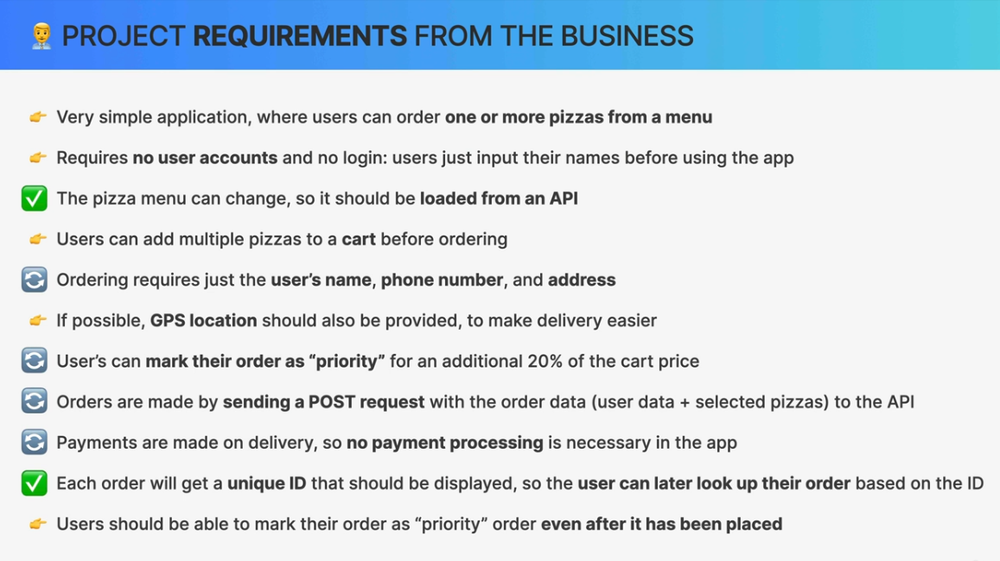

# `Adding Redux and Advanced React Router`

## `Table of Contents`

1. [Section Overview](#section-overview)
2. [Modeling the User State With Redux Toolkit](#modeling-the-user-state-with-redux-toolkit)
3. [Reading and Updating the User State](#reading-and-updating-the-user-state)
4. [Modeling the Cart State](#modeling-the-cart-state)
5. [Adding Menu Items to the Cart](#adding-menu-items-to-the-cart)
6. [Building the Cart Overview With Redux Selectors](#building-the-cart-overview-with-redux-selectors)
7. [Building the Cart Page](#building-the-cart-page)
8. [Deleting Cart Items](#deleting-cart-items)
9. [Updating Cart Quantities](#updating-cart-quantities)
10. [Using the Cart for New Orders](#using-the-cart-for-new-orders)
11. [Redux Thunks With createAsyncThunk](#redux-thunks-with-createasyncthunk)
12. [Integrating Geolocation](#integrating-geolocation)
13. [Fetching Data Without Navigation useFetcher](#fetching-data-without-navigation-usefetcher)
14. [Updating Data Without Navigation](#updating-data-without-navigation)

---

## `Section Overview`

Welcome back. In this section, we're gonna implement the heart of the application by adding a shopping cart with Redux toolkit. And by doing this, we'll explore the advanced parts of react routers data loading features and we'll continue exploring some real world use cases of Redux, which means that you will need to have learned Redux in an earlier section in order to finish this project. But anyway, let's now jump right back into our project and continue building.

---

## `Modeling the User State With Redux Toolkit`

So as we discussed in the application planning lecture at the very beginning of this project, we're gonna use Redux for all our global state. So for the user state and for the cart state. And storing global UI state is exactly what Redux was made for. And so it's a great choice for this app. But before we go do this let's quickly look at our list of project requirements again.



So many of these features are already implemented or at least they are implemented partially with some fake data.

And so now in this section, we will implement all the remaining features starting with the simple user state. So in this lecture and the next one.

And we have already decided earlier that this user state is going to be global UI state. And the reason for that is that we need that state in many places in the application tree.

And so let's just use Redux in order to store that global state. Of course we could also just create a state variable right inside App.jsx and then I guess we could somehow pass that into the components even though that wouldn't be super practical. We could also create a context but let's just practice Redux a little bit more here.

So long story short let's just come here to our terminal and let's start by installing Redux. And in particular we are actually going to use Redux toolkit, so the recommended way of using Redux and then let's also immediately install react redux so that we can then later connect Redux with our React application.  
**`npm i @reduxjs/toolkit react-redux`**

*And so let's now come to the UserSlice.js file that we already got earlier from our starter files.*

Let's now create a state of slice using the Redux toolkit tools. And as always let's just start with the initialState object. So we will have userName and set it to an empty string and for now that's actually it. So later we will add some more stuff. So in particular the user's address but for now we will really just have this.

Let's now create our userSlice. And so this is exactly what we have learned previously in the Redux section.

Let's now then create our slice which we of course need to import from redux-toolkit and then what we need to pass in here is an object with the name of the slice. So that's user then the initial state and then an object of our reducers. And for now the only one that we will have here is one to update the username. So let's just call that update name and as always it will receive the current state and the action object and then we can mutate state dot username and set it to the received username. So as always that's action.payload. Alright, and this is actually it. So let's now then export our reducers from here which we can get by immediately destructuring that from user slice dot actions. So again, I'm going really really fast here because I'm assuming that you already know how Redux toolkit works. Alright, but anyway, let's then also export default the reducer itself.

```jsx
// userSlice.js
const { createSlice } = require('@reduxjs/toolkit');

const initialState = {
  username: '',
};

const userSlice = createSlice({
  name: 'user',
  initialState,
  reducers: {
    updateName(state, action) {
      state.username = action.payload;
    },
  },
});

export const { updateName } = userSlice.actions;

export default userSlice.reducer;
```

So just to `quickly recap`, we created a slice of our global UI state. So by using `createSlice` function, we created the slice called `user` which has initial state right here and then we have a reducer which is this function that is responsible for updating the state object. So that function, in this case this method receives the current state and the action. And then since we are using Redux Toolkit we can directly mutate this state object and then set the state.username to the one that we receive as soon as we're going to dispatch the action. So that is then going to be action.payload.  
And then inside userSlice.actions we will get access to the action creators. And so we then export that as a named export so that we can then use that in our application and in particular probably here in this form. So here we will then update the name using this action creator and then we also export default the slice.reducer.

And so let's now actually use this reducer to set up our store. So let's create a new file right at the top level of the source folder and is by convention is just called store.js. So let's create a variable called store which will be the result of calling configure store from redux-toolkit.

And so this one all it needs right now is to receive an object with the reducer property where we can then pass in the user reducer. And so that is going to be this one that we exported here. So let's import that here. So import user reducer from and features and user and user slice. Okay, and then all we need to do is to export this store.

```js
// store.js
const { configureStore } = require('@reduxjs/toolkit');

import userReducer from './features/user/userSlice';

const store = configureStore({
  reducer: {
    user: userReducer,
  },
});

export default store;
```

And with this we have our Redux store nicely configured and can now provide it to our React application. So all we did up until this point was in Redux land but now we have to of course connect the two. **And so we usually do that at the very top of our component tree which is actually inside main.jsx.** So we want to provide our global state really to the entire app tree. And so here we need to now use the provider component which is part of the React Redux package.

So exactly this one right here and in here as the single prop we need to pass in the store object that we just exported from store.js.

```jsx
import { Provider } from 'react-redux';
import store from './store.js';

ReactDOM.createRoot(document.getElementById('root')).render(
  <React.StrictMode>
    <Provider store={store}>
      <App />
    </Provider>
  </React.StrictMode>,
);
```

So our application should now be correctly connected to Redux. And to see if it actually is let's come here to our username component and we will try to get that state from Redux. And remember that the way we get some state from Redux inside a React component is by using the use selector hook.  
So useSelector is provided by react redux and then here we need to pass in a selector function and that function gets as a parameter the entire state and then we can select only what we want. So that's state.user.username and then let's of course store that in a variable called username. And then user that variable in jsx.

```jsx
import { useSelector } from 'react-redux';

function Username() {
  const username = useSelector((state) => state.user.username);

  if (!username) {
    return null;
  }

  return (
    <div className="text-sm font-semibold hidden md:block">{username}</div>
  );
}

export default Username;
```

And of course, at this point we won't see anything because by default the user is empty. So let's just place some name here and then let's see, and beautiful.

And if no username then just return null from username.jsx. And so in this case then there is nothing to be displayed there. Great.

---

## `Reading and Updating the User State`

Let's now update the user state from our application and also display that state in multiple places. **Do you remember how we update the state inside Redux?** Well, we update Redux state by dispatching an action to our reducer. And we do that by using the action creator that was automatically created by the create slice function. So in that case, that's the updateName function. *-userSlice.js*  

So let's do that in practice right in the createUser component that we already have. And this exists because remember that one of the requirements of the application was that the user needs to input their name before starting to use the application. And so therefore we have this form, where we can start typing a name and then as soon as something is there we can click on this button. And so as soon as we click on the button we want to update the username in Redux and then we want to navigate to the pizza menu.

```jsx
// CreateUser Starter file
import { useState } from 'react';
import Button from '../../ui/Button';

function CreateUser() {
  const [username, setUsername] = useState('');

  function handleSubmit(e) {
    e.preventDefault();
  }

  return (
    <form onSubmit={handleSubmit}>
      <p className="mb-4 text-sm text-stone-600 md:text-base">
        👋 Welcome! Please start by telling us your name:
      </p>

      <input
        type="text"
        placeholder="Your full name"
        value={username}
        onChange={(e) => setUsername(e.target.value)}
        className="w-72 input mb-8"
      />

      {username !== '' && (
        <div>
          <Button type="primary">Start ordering</Button>
        </div>
      )}
    </form>
  );
}

export default CreateUser;
```

Okay. So let's just quickly look here at the component that we already have and we see that we have a local username state. And so that's simply because, the input field is a regular controlled element. So we always read the value from username and each time we type a new character, we update that state.

**And we do it this way. So we are basically temporarily storing the username in the component itself because it is a very bad practice to basically connect an input field right to the Redux store.** So as we change the some character from the name field (we type a new input) we should really update a local state variable and not always update the Redux store. **Instead we should only do that as soon as we actually submit the form.** So basically as soon as we are done inputting the username. And so that's in the handle submit function.

As always use the handleSubmit function to handle that. And so it is where we will then actually update the Redux store and then redirect the user to the menu. All right. So let's start doing that.

And first let's do a guard clause saying that if there is no username then just return. But in all other cases we now want to update the store. **And so remember how we said earlier that we do that by dispatching an action.** Now the way in which we get access to the **dispatch function is to use the useDispatch hook that is provided by react redux** and then let's store that in dispatch and then we can dispatch an action.

```jsx
 const dispatch = useDispatch();

function handleSubmit(e) {
  e.preventDefault();

  if (!username) return;

  dispatch();
}
```

Now instead of manually creating the action we use an action-creator function which again is the one right that was exported from userSlice.

So that's called updateName.

And so here we automatically import that from the slice and all that we need to pass in is going to be the username because this username will then become the action dot payload which will then become assigned to state.username. And then as soon as that happens, of course the entire application will rerender and display that username everywhere. And so this should actually already be working.

```jsx
import { useDispatch } from 'react-redux';

import { updateName } from './userSlice';

function CreateUser() {
const [username, setUsername] = useState('');
const dispatch = useDispatch();

function handleSubmit(e) {
  e.preventDefault();

  if (!username) return;

  dispatch(updateName(username));
}}
```

Great. And now all we need to do is to then also redirect to the menu. And so for that we need the navigate function which we get from use navigate. So part of react router. So navigate to the menu.

```jsx
import { useDispatch } from 'react-redux';
import { updateName } from './userSlice';
import { useNavigate } from 'react-router-dom';

function CreateUser() {
  const [username, setUsername] = useState('');
  const dispatch = useDispatch();
  const navigate = useNavigate();

  function handleSubmit(e) {
    e.preventDefault();

    if (!username) return;

    dispatch(updateName(username));
    navigate('/menu');
  }
}
```

GREAT: And so, here we are at the menu and we have that updated name. Nice. So that one is finished but now as soon as we go back then it is again asking for the username. So there's not really a good way of going back to the menu.

And so in the homepage we only want to display the createUser form, so the create user component in case there is no user yet. So let's do that.

So right here, let's read the user from the state. So let's say, user name is equal to use selector, remember, which is how we read data from Redux store And then again this gets access to the entire state and then we get state dot user dot username.

```jsx
const username = useSelector((state) => state.user.username);
```

And so then we can conditionally render either the form or a button that will then redirect us to that menu.

So let's say if the user name is equal to an empty string, then render this create user component. But otherwise, let's then render this button component that we created earlier, and then let's place the to prop.

So continue ordering and then let's also add the username.

```jsx
{username === '' ? (
  <CreateUser />
) : (
  <Button to="menu" type="primary">
    Continue ordering, {username}
  </Button>
)}
```

So continue ordering test. So if we click here, we are then back at the menu. Great. And of course, if we reload this entire app then the application state will be gone. So we are not persisting this state to any API and therefore whenever we reload then everything will be lost. But that's just the way that our business wants this application to work.

And now we just need this in 2 more places, First at **Cart** and then also on **OrderPizzas** page. So let's quickly do that.

Finally in CreateOrder, So it's right here in this input field. However, we cannot do like this⤵️. So not just username because that would show username but then whenever we wanted to update this field, so I'm typing here now then this wouldn't change anything because we are not listening for any change event here.

```jsx
// Don't do this
<input
  className="input grow"
  type="text"
  value={username}
  name="customer"
  required
/>
```

So we don't want this to be really the value but just the default value. So that's another prop that we can use and I'm not sure if we have ever used it. But this is a very important one because it basically as the name says simply allows us to set a default value at the beginning but which we can then still change. And so this is now not a controlled element. It's simply a normal HTML element which happens to have a default value. And so now I can just keep writing here if I want.

```jsx
<input
  className="input grow"
  type="text"
  defaultValue={username}
  name="customer"
  required
/>
```

Okay. And I think that with this we have actually finished this user state. So nothing really new and nothing really groundbreaking but we got to basically practice a little bit more about what we learned earlier with Redux.

And now next up, it's time to start working on the card global state. And with this, we will be able to then finally really make the application work.

---

## `Modeling the Cart State`

So let's now model and implement the more complex card state. And by doing this, we will then be able to implement or to finish all of the features over the next few lectures. So let's start by creating a new Redux state slice in the cart features folder(src->features->cart). And so this is the beauty of having this features folder in the first place because it allows us to nicely co locate all of these files that are necessary to implement one of the features all in one folder. So again, we then could close all of these other folders and then while we are implementing a certain feature, all we have to worry about is that particular folder. So no jumping around all the time, between different folders.

But anyway, let's again start with the initial state and then all we will need in the state is actually one cart array. So this is where we will store all the items in the cart. **So many of the state management principles that we have learned throughout this course still apply here to modeling state in Redux.**  
**For example, the fact that whenever possible we should always derive state. And so that's the reason why we are not storing for example the total cart price. So we could store the total price also maybe even the number of items. Right? However, we can easily derive these from the card array itself.**  
And so then we don't need to create these because that would just create more problems because then we would have to keep them in sync while we are updating the cart. Alright.  

```jsx
const initialState = {
  cart: [],
};
```

Now, let's create our cartSlice by calling createSlice. The name is of course, cart, the initialState and then our reducers.

```jsx
const createSlice = createSlice({
  name: 'cart',
  initialState,
  reducers: {},
});
```

So let's think exactly what operations we need for the cart. So first of all, we need to be able to **add a new item to the cart,** right? So that's our first reducer. So as always that takes the state and the action And now let's do a couple of more. So let's just duplicate this here a few times and then let's think about what else we need.

So we need to add an item. We need to be able to also delete an item and maybe we might want to update an item. However, we don't really want to go that way. So we don't want to be able to update 1 entire item. The only thing that we will want to update about the item is the quantity. So according to the application requirements, the users should be able to add multiple pizzas to the cart. And so for example, they might want to add 5 pizzas of a certain type. And so to do that they will then click some button that will always increase the item quantity. And so let's simply implement one reducer for this activity. So for increasing, so increase the item quantity and then also one for decreasing.  
And then finally, right in our cart page, we also have the button to clear the cart. And so we need then also a reducer and an action creator for that. So clear cart.

```jsx
const createSlice = createSlice({
  name: 'cart',
  initialState,
  reducers: {
    addItem(state, action) {},
    deleteItem(state, action) {},
    increaseItemQuantity(state, action) {},
    decreaseItemQuantity(state, action) {},
    clearCart(state, action) {},
  },
});
```

And now let's implement a code here for all of them. And to make this a little bit easier, let's add a fake pizza right here.

```jsx
const initialState = {
  // cart: [],
  cart: [
    {
      pizzaId: 12,
      name: 'Mediterranean',
      quantity: 2,
      unitPrice: 16,
      totalPrice: 32,
    },
  ],  // Fake cart data
};
```

Having now this fake cart, it's a bit easier to implement these different reducers, at least some of those right there.

So whenever a new item should be added to the cart, how do we do that with our code? Well, remember that here we can actually mutate the state. And so we can just say state.card.push and then push the newly received item in there which in this case is going to be action. Payload. And remember that the payload is going to be simply what we pass into the action creator. So when we dispatch an action.

```jsx
reducers: {
  addItem(state, action) {
    // payload is = newItem
    state.cart.push(action.payload);
  },
}
```

Next up, when we delete an item from the cart, here the  payload that we will need will be the ID of the item. Right? So basically the pizzaId because that's the name that they have in the cart. So when we delete we will try to find the item with that ID and then delete it.  
Now since here we are actually allowed to directly mutate the state we could use the splice method and then directly mutate the array. However, I find it a lot easier to still use the filter method like we have been doing all along because it actually requires a lot less code.

```jsx
deleteItem(state, action) {
  // payload is = pizzaId
  state.cart = state.cart.filter((item) => item.pizzaId !== action.payload);
},
```

Next up, we want to increase the quantity of a certain item. So the way we can do that is to first find that item and then we can mutate the quantity on that item.

So that's state.card.find and then we are again looking for or we are actually passing in a pizza ID as the actions payload. So just like we have here. So with this we selected or item basically and now we can just mutate it. So we can do item quantity plus plus and then from here on this value has already been updated and so then we can calculate item dot total price from that value. So item dot quantity times item dot unit price. So since we have both the quantity and the total price which depends on the quantity, we need to not only update the quantity but also the total price. So basically keeping them in sync.

```jsx
increaseItemQuantity(state, action) {
  // payload is = pizzaId
  const item = state.cart.find((item) => item.pizzaId === action.payload);
  if (item) {
    item.quantity++;
    item.totalPrice = item.quantity * item.unitPrice;
  }
},
```

So to decrease the quantity, we will just copy and paste this code, and just need to change ++ to --.

```jsx
decreaseItemQuantity(state, action) {
  // payload is = pizzaId
  const item = state.cart.find((item) => item.pizzaId === action.payload);
  if (item) {
    item.quantity--;
    item.totalPrice = item.quantity * item.unitPrice;
  }
},
```

And then finally, here we need to clear the cart. And clearing the cart is as easy as setting the cart back to the initial state. Or in other words, doing state dot cart equal this. And so here we actually don't even need the action.

```jsx
clearCart(state) {
  state.cart = [];
},
```

Alright. So these are our 5 reducers and so let's now grab the 5 action creators.

So 5 reducers and therefore 5 action creators from card slice dot actions. So we have our actions and then we can immediately destructure them. And finally let's also default export cart.slice.reducer.

```js
export const {
  addItem,
  deleteItem,
  increaseItemQuantity,
  decreaseItemQuantity,
  clearCart,
} = createSlice.action;

export default createSlice.reducer;
```

Great.

***`Full Code cartSlice.js`***

```jsx
const initialState = {
  // cart: [],
  cart: [
    {
      pizzaId: 12,
      name: 'Mediterranean',
      quantity: 2,
      unitPrice: 16,
      totalPrice: 32,
    },
  ],
};

const createSlice = createSlice({
  name: 'cart',
  initialState,
  reducers: {
    addItem(state, action) {
      // payload is = newItem
      state.cart.push(action.payload);
    },
    deleteItem(state, action) {
      // payload is = pizzaId
      state.cart = state.cart.filter((item) => item.pizzaId !== action.payload);
    },
    increaseItemQuantity(state, action) {
      // payload is = pizzaId
      const item = state.cart.find((item) => item.pizzaId === action.payload);
      if (item) {
        item.quantity++;
        item.totalPrice = item.quantity * item.unitPrice;
      }
    },
    decreaseItemQuantity(state, action) {
      // payload is = pizzaId
      const item = state.cart.find((item) => item.pizzaId === action.payload);
      if (item) {
        item.quantity--;
        item.totalPrice = item.quantity * item.unitPrice;
      }
    },
    clearCart(state) {
      state.cart = [];
    },
  },
});

export const {
  addItem,
  deleteItem,
  increaseItemQuantity,
  decreaseItemQuantity,
  clearCart,
} = createSlice.action;

export default createSlice.reducer;

```

So this is what our cartSlice. But for now let's come to our store.js, because of course we also need to now connect this new slice to our store. So cartReducer from features.

```jsx
// store.js
import { configureStore } from '@reduxjs/toolkit';

import userReducer from './features/user/userSlice';
import cartReducer from './features/cart/cartSlice';

const store = configureStore({
  reducer: {
    user: userReducer,
    cart: cartReducer,
  },
});

export default store;
```

Nice. And so in the next lecture, we can start adding some of these pizza items here to the user's cart.

---

## `Adding Menu Items to the Cart`

So let's start using our cart state by adding new pizzas to the cart. So where exactly are we going to do that in our code? Well, in the user interface the user is able to add new pizzas to the cart simply by clicking on `Add to CART` buttons from menu. And so, all we have to do is to come to the MenuItems and then implement that functionality right there.

So here is where the cart and the menu features intersect a little bit. And so we now need to implement some cart functionality here in the item. But of course things are never so linear in any real world application. So carts cannot be completely separated from the menu feature. And so, sometimes we need to implement some parts of a feature inside another feature.

And I want to actually start by only rendering this button here in case that the pizza is not sold out.

```jsx
{!soldOut && <Button type="small">Add to cart</Button>}
```

Now, here we actually want to pass in an on click handler. So in regular buttons, so in HTML buttons we are able to pass in some function into a button. Now our own button right now doesn't have that functionality yet but let's do that in a second.

```javascript
// Button.jsx
function Button({ children, disabled, to, type, onClick }) {
  if (onClick)
    return (
      <button onClick={onClick} disabled={disabled} className={styles[type]}>
        {children}
      </button>
    );
}
```

All right. And only if there is no to and no on click prop, then just return this regular button. So this one without the on click. So we have a bit of duplicate code right here but this is really not a problem.

```jsx
// MenuItem.jsx
function handleAddToCart() {
  console.log('Add to cart:', id);
}

{!soldOut && (
  <Button type="small" onClick={handleAddToCart}>
    Add to cart
  </Button>
)}
```

And so now what we need to do is to create a new pizza object. So a new item that has this exact shape.

It's just to indicate that it is computed using these two values. And now all we need to do is to again dispatch an action. So we already know how that works at this point.

So we use the useDispatch hook provided by react redux and now we can dispatch actions from here and this action object will be created by calling the add item action creator. Alright. So for addItem then the payload needs to be the newItem which is exactly what we're going to pass in here. So that one right there.

```jsx
// MenuItem.jsx
import { formatCurrency } from '../../utils/helpers';

import Button from '../../ui/Button';
import { useDispatch } from 'react-redux';
import { addItem } from '../cart/cartSlice';

function MenuItem({ pizza }) {
  const dispatch = useDispatch();

  const { id, name, unitPrice, ingredients, soldOut, imageUrl } = pizza;

  function handleAddToCart() {
    console.log('Add to cart:', id);
    const newItem = {
      pizzaId: id,
      name: name,
      quantity: 1,
      unitPrice,
      totalPrice: unitPrice * 1,
    };

    dispatch(addItem(newItem));
  }

  return (
    <li className="flex gap-4 py-2">
      
      <div className="flex flex-col grow pt-0.5">
        <p className="font-medium">{name}</p>
        <p className="text-sm italic text-stone-500 capitalize">
          {ingredients.join(', ')}
        </p>
        <div className="mt-auto flex items-center justify-between ">
          {!soldOut ? (
            <p className="text-sm">{formatCurrency(unitPrice)}</p>
          ) : (
            <p className="text-sm uppercase font-medium text-stone-500">
              Sold out
            </p>
          )}

          {!soldOut && (
            <Button type="small" onClick={handleAddToCart}>
              Add to cart
            </Button>
          )}
        </div>
      </div>
    </li>
  );
}

export default MenuItem;
```

Alright. And this should already be working. So let's reload here and add this pizza. And we didn't get any errors, so that's already a great sign. But of course, also nothing happened in the UI which is because nothing is really using this state yet. However, luckily for us we have the Redux DevTools. Remember them? So we installed them way back in the Redux section. And so let's get them back here.

---

## `Building the Cart Overview With Redux Selectors`

Let's now dive a little bit deeper into the topic of **redux selectors** by building the cartOverviewComponent.

**And so basically what we want to do now is to select the cart state and then from there compute the number of pizzas that are in the card and the total price as well.**

So to read some state from the Redux store, remember how we use the useSelector hook. And so remember that in here we pass a so called selector function. That's why this hook is actually called a selector. And so this time let's actually write a little bit of a more complex selector. So as always here, this function receives the state and then let's start by reading state dot cart dot cart.

```jsx
const totalCartQuantity = useSelector((state) => state.cart.cart);
```

So the reason for this double cart is that or state itself is called cart and then we have cart property in there. Alright.

And here we actually want to keep going and immediately calculate the number of pizzas that are currently in the cart. So to do that we can use the reduce method.  
So this gets access to the current accumulator value which will just be the sum and then also the current element, current element of the array which we could also call item. So let's do that actually. And so then in each iteration we will add to the current sum which starts at 0 here as the second argument. So to that sum that starts at 0 in each iteration we will add the item dot quantity, just like this.

```jsx
// CartOverview.jsx
const totalCartQuantity = useSelector((state) =>
  state.cart.cart.reduce((sum, item) => sum + item.quantity, 0),
);
```

So, redux actually recommends that we do this kind of data manipulation that we just did here. So selecting the cart and then immediately calculating the value that we want right inside the selector function and not out here in a component. So doing it like this is a good practice whenever we are using Redux. And we will make this even better but for now let's see if this actually worked. **`<span>{totalCartQuantity} pizzas</span>`** So total cart quantity and indeed we have now 4 pizzas.

What matters is that this is already working and so this selector function is doing its job. However, redux again recommends to take this function(that we put in useSelector hook) and actually place it right into the cart slice file. So let's do that. Let's cut it from here. So then of course we get an error and so let's place it right here.

```jsx
// CartSlice.js
export const getTotalCartQuantity = (state) =>
  state.cart.cart.reduce((sum, item) => sum + item.quantity, 0);
```

So again, this is now a redux selector function and the recommendation and the standard is that these functions start with the **`get keyword`** and that we have them all in the central place in the cart slice file because we will actually need this operation later on in another component. And so then all we will need to do is to take this function here and just reuse it.

Let's now then import this.

```jsx
// CartOverview.jsx

import { getTotalCartQuantity } from './cartSlice';
const totalCartQuantity = useSelector(getTotalCartQuantity);
```

Great. So let's keep going and let's do something similar for the total price.

So coming here into or slice, let's write another selector function. I will just actually duplicate this here.

And so here, all we have to do is to change this from item.quantity to item.totalPrice.

```jsx
export const getTotalCartQuantity = (state) =>
  state.cart.cart.reduce((sum, item) => sum + item.quantity, 0);
export const getTotalCartPrice = (state) =>
  state.cart.cart.reduce((sum, item) => sum + item.totalPrice, 0);
```

And by the way, having these selector functions like this might actually cause performance issues in larger applications. And so if you are really serious about redux you can look into the **`reselect library`** which will allow us to optimize these selectors.

Let's do total cart price here. And so now the name of use selector starts to make a little bit more sense. Like this. And then let's here use or help or function called format currency. And then here is where we use that total card price and beautiful.  
Nice. And now just one final thing which is that if we don't have any pizzas in our cart, I guess we shouldn't even display this cart overview here in the first place. And so here we can easily say, if there is no total cart quantity then have this component simply return null.

```jsx
import { useSelector } from 'react-redux';
import { Link } from 'react-router-dom';
import { getTotalCartPrice, getTotalCartQuantity } from './cartSlice';
import { formatCurrency } from '../../utils/helpers';

function CartOverview() {
  const totalCartQuantity = useSelector(getTotalCartQuantity);
  const totalCartPrice = useSelector(getTotalCartPrice);

  if (!totalCartQuantity) return null;
  return (
    <div className="bg-stone-800 text-stone-200 uppercase py-4 px-4 sm:px-6 md:text-base text-sm flex items-center justify-between">
      <p className="text-stone-300 font-semibold space-x-4 sm:space-x-6">
        <span>{totalCartQuantity} pizzas</span>
        <span>{formatCurrency(totalCartPrice)}</span>
      </p>
      <Link to="/cart">Open cart &rarr;</Link>
    </div>
  );
}

export default CartOverview;

```

And now as we move to our actual cart page, we still have a problem. So we still have this fake cart object right here and we are not yet using the cart from the state. And so let's fix that in the next lecture.

---

## `Building the Cart Page`

So next up, let's finish building the cart page. Now we want to replace this fake cart, of course, with the actual cart coming from our Redux store. So, use selector, and here, let's actually now write again a selector function and place it right here. So here maybe before these other ones as this one is a bit simpler.

So again following the get convention and here it's just get cart and so that's state. So this function receives the state and we want it to return state dot cart.cart.

```jsx
// CartSlice.js
export const getCart = (state) => state.cart.cart;

// Cart.jsx
const cart = useSelector(getCart);

```

Now we should already get our updated cart. Nice!

So this page was really easy to build because we had already basically done all the rendering logic here earlier.

All we have to do is to make these delete buttons here work which we will do a little bit later and this clear card button as well. And so let's take care of that right now.

So this one is actually pretty easy. So it's this one right here and all we need to do is to specify the on click prop and then here all we want to do is to dispatch this clear card action. So this one right here. So we need now this clear card action creator and of course or dispatch function. So const dispatch and then useDispatch and then here.  
Let's do it here directly instead of creating a separate event handler function. And then but then here we need to also import that clear card action creator. So just as you were saying earlier.

```jsx
// Cart.jsx
import { getCart, clearCart } from './cartSlice';

const dispatch = useDispatch();

<Button type="secondary" onClick={() => dispatch(clearCart())}>
  Clear cart
</Button>

```

And now this should actually already work. So let's click and beautiful.

Nice. But now actually when we have no items in the cart probably we don't want to display this, right? So there's no point in ordering any pizzas if we have no pizzas in the first place. So that's why actually from the starter files we already have this empty cart component(EmptyCart.jsx). So what we can do is to say, if there is no card dot length then return the empty card component.

```jsx
// Cart.jsx
if (!cart.length) return <EmptyCart />;

```

Now, all we need is some styling. So first of all here we have the same link that points back to the menu that we have in a cart.

In the next lecture we can then take care of actually deleting the cart items one by one which is also a very important feature.

---

## `Deleting Cart Items`

Next in line is deleting pizzas from the cart. And doing so is really easy because the most difficult part is already done which is actually our reducer.  
So all we have to do is to now dispatch an action that is created by the delete item action creator each time that we click on the delete button. So let's go do that.  

But before we blindly just attach an event handler to this button let's think about this.

So we want to delete the pizza from the cart but the same thing might also be true in the menu. So in other words, we want that delete button not only in the cart but also here in the menu item.

So what this means is that we should create a reusable component in cart feature folder. So let's do that. So new file and then DeleteItem.jsx. And then basically we can take that delete button that we already have and place that right there in that component that we are building.

```jsx
// DeleteItem.jsx
import Button from '../../ui/Button';

function DeleteItem() {
  return <Button type="small">Delete</Button>;
}

export default DeleteItem;
```

And so add this button in cartItem.jsx as it was before. So visually we have the same thing as before but now we can also add this same button to each menu item. But actually let's do that a bit later.

So let's first actually worry about  delete item button from cart. So we will want to add the on click prop because here is where we want to dispatch that delete action. So dispatch which we need to get as always from useDispatch and then we need our action creator which is delete item just like this.

```jsx
import { useDispatch } from 'react-redux';
import Button from '../../ui/Button';

function DeleteItem() {
  const dispatch = useDispatch();
  return (
    <Button type="small" onClick={() => dispatch(DeleteItem())}>
      Delete
    </Button>
  );
}

export default DeleteItem;
```

And now let's think about this deleteItem action creator. So remember that right in the cartSlice the payload in the reducer needs to be the pizzaId because this **pizzaId is necessary to actually delete the item from the cart. And so we need to pass that right into the delete item function call. so when calling from dispatch function.**

`However`, in DeleteItem.jsx we don't really have that data. And so we need to pass it in as a prop.

```jsx
import { useDispatch } from 'react-redux';
import Button from '../../ui/Button';

function DeleteItem({ pizzaId }) {
  const dispatch = useDispatch();
  return (
    <Button type="small" onClick={() => dispatch(DeleteItem(pizzaId))}>
      Delete
    </Button>
  );
}

export default DeleteItem;
```

And then back from the CartItem we need to pass in that pizzaId prop. And so that is exactly called pizzaId.

```jsx
// CartItem.jsx
<DeleteItem pizzaId={pizzaId} />
```

All right? So the way the data flows here through this application might be a little bit confusing. So if you have any doubts about this just make sure to pause the video at any point and really analyze the data flow. You can as always also use here the component tree for that. But basically what happens is that in the cart we have a list of cart items and each of the cart items receives indeed the item. And so that includes the pizza ID, the name, the quantity and the total price. And so then we take that pizza ID and pass it here into the delete item component so that this component can then use it to effectively delete that item.

Just test now!, And so let's see what happens when we click. Beautiful.

So we placed all this code into the separate component so that now we can reuse it in the menu item as well. And so let's do that.
And then let's place that button right here. For now, I will simply place it here which will create some problems as we will see but let's actually wait for them.

```jsx
<DeleteItem pizzaId={id} />
```

And so now we have this button always. So all the components have this button which of course doesn't make a lot of sense because most of these pizzas are actually not in the cart. And so it doesn't make any sense that this button is.

But in any case we only want to display this delete button if the pizza is actually in the cart. So how can we do that? Well, basically we need to determine whether the quantity of each of these pizzas is greater than 0 in the cart. And if it is, then we can display the delete button and not the add to cart button. But if there is no pizza in the cart, then we only show the add to cart.

So let's try to do that up. So basically we need the current quantity. So that can be useSelector. `const currentQuantity = useSelector();` Now we need to write some selector here in useSelector hook. However, none of the selectors that we have yet works in this situation because the only selector that we have is to get the total quantity, but not the quantity for each individual pizza in cartSlice.js.

And so we need to now here create another one. So the way we want this one to work is getCurrentQuantityById. And then we want to pass in actually the current pizza ID.

And So export const getCurrentQuantityById and then remember that we passed in actually an ID. So the ID is the argument and then what this should return is a selector of this type. So a function that receives a state and then returns something. So what we're gonna do is to try to find an item in the cart with this pizza ID and if there is 1, then we return the quantity. Otherwise, we just return 0. So that is state. Card. Card. Find and then item where the item dot pizza ID is equal to the one that has been passed in. And so then if this exists we use optional chaining for that. We get the quantity and if not then we return 0.

```javascript
// cartSlice.js
export const getCurrentQuantityById = (id) => (state) =>
  state.cart.cart.find((item) => item.pizzaId === id)?.quantity ?? 0;
```

All right. And so, all we have to do now is to then import this function in the MenuItem.jsx.

And now this should actually work. So let's just log this value to the console, the current quantity. So now we can use this value here basically to compute another state which is just called isInCart.

```jsx
// MenuItem.jsx (Selected Code)
const currentQuantity = useSelector(getCurrentQuantityById(id));
  const isInCart = currentQuantity > 0;

{isInCart && <DeleteItem pizzaId={id} />}

```

And so with this, it disappeared from everywhere except from this one here which we just added to the cart earlier. Now, here we don't want to then display this button. And so let's also say that the add to cart button should only be visible if it's not sold out and it is not in a cart. So is in cart.

```jsx
{isInCart && <DeleteItem pizzaId={id} />}
  {!soldOut && !isInCart && (
    <Button type="small" onClick={handleAddToCart}>
      Add to cart
    </Button>
  )}
```

Great. And so here we can now only delete this pizza but not add another one. So at least not for now.

So here the complicated part was definitely to get the information whether each pizza item is actually in the cart or not. So we did that right here by writing this special selector. So here the selector function is actually a function that returns another function which is already `pretty advanced JavaScript` but at this point I'm sure this is nothing new and nothing complicated for you. So just make sure to review how this function(getCurrentQuantityById) works. And so I think that after that all of this will make sense to you.

And then all we have left to do regarding our card state is to update the quantities.

---

## `Updating Cart Quantities`

Alright. So to finish this part where we are working with the cart state, let's update the pizza quantities. And this is going to be very similar to what we did before with deleting pizzas from the cart. So we will want to be able to increase and to decrease the amount of pizzas both in each of these, menu items here and also right here in the cart items. And so just like with delete item, we will now create a reusable component for that.

So let's call this one UpdateItemQuantity.jsx. Just like before, we will also need to receive the current pizza ID. Now, here we will then have 2 buttons. So 1 for decreasing and 1 for increasing. So let's bring in our button here and the type will be a new 1.

So we will create a round button. And then for now, let's not specify the on click. Let's leave that for later. So here we have the minus and then another 1 for the plus. And then let's immediately include that right in the CartItem.jsx.

```jsx
// UpdateItemQuantity.jsx
import Button from '../../ui/Button';

function UpdateItemQuantity() {
  return (
    <div>
      <Button type="round">-</Button>
      <Button type="round">+</Button>
    </div>
  );
}

export default UpdateItemQuantity;
```

Now we just need to now create this new round type button in our Custom button in Button.jsx. So adding a new entry into our styles object.

Beautiful. So this is looking really cool. And so let's now then add or on click event handlers. And so just like before, this is where we will now dispatch our actions.

So dispatch for which just like before we need to get that function, And then remember that right in slice, we have increaseItemQuantity and decreaseItemQuantity. And both of them as the payload need the pizza ID. So that's why we pass the pizza ID right into the component.

```jsx
// UpdateItemQuantity.jsx
import { useDispatch } from 'react-redux';
import Button from '../../ui/Button';
import { decreaseItemQuantity, increaseItemQuantity } from './cartSlice';

function UpdateItemQuantity({ pizzaId }) {
  const dispatch = useDispatch();
  return (
    <div className="flex gap-1 items-center md:gap-3">
      <Button
        type="round"
        onClick={() => dispatch(decreaseItemQuantity(pizzaId))}
      >
        -
      </Button>
      <Button
        type="round"
        onClick={() => dispatch(increaseItemQuantity(pizzaId))}
      >
        +
      </Button>
    </div>
  );
}

export default UpdateItemQuantity;
```

And so this should already be working. So let's test this and beautiful.

Now watch what happens when we do minus, when we are already at 1. So we basically go down to 0 and to minus 1 and or cart then keeps getting cheaper and we keep getting less and less pizzas. And so this of course should not be allowed. **And so let's actually prevent that right in our reducer.**

`And so what we can do is to check if the item dot quantity is equal to 0, then we want to completely delete the item from the cart.` So that's a very common thing to see in web applications like some online shopping. So essentially when we decrease the quantity from 1 to 0 then that element is taken out. So basically, we want to then delete that item, and so we could write exactly the logic that we wrote for deleteItem. However, we don't have to because we can reuse this logic by using a really nice trick that I'm about to show you.

So we can do card slice dot caseReducers, and then we can basically manually call one of these reducers. So then let's call delete item with the same state and action that we just received here.

```jsx
if (item.quantity === 0) cartSlice.caseReducers.deleteItem(state, action);
```

Alright. So let's test this. And nice.

```jsx
 decreaseItemQuantity(state, action) {
  // payload is = pizzaId
  const item = state.cart.find((item) => item.pizzaId === action.payload);
  if (item) {
    item.quantity--;
    item.totalPrice = item.quantity * item.unitPrice;
  }

  if (item.quantity === 0) cartSlice.caseReducers.deleteItem(state, action);
},
```

And now just to finish this component, let's actually also display the current number of pizzas between these 2 buttons, (b/w + and - btns). So for that, in UpdateItemQuantity.jsx we also need access to the current quantity.  

Right from CartItem.jsx we need to pass that in. So how do we get access to that? Well, we already wrote or selector for that earlier. Right? In the menu item.

```jsx
// CartItem.jsx
const currentQuantity = useSelector(getCurrentQuantityById(pizzaId));

// passing to updateItemQuantity
<UpdateItemQuantity
  pizzaId={pizzaId}
  currentQuantity={currentQuantity}
/>
```

And so here we have the current quantity which we can now pass here into the UpdateItemQuantity component. So current quantity is equal to current quantity which we can then display here in the middle. So let's create some span element here not with that but with the current quantity. Let's just style this a little bit. Let's make the text smaller.

So text small and also give it some more boldness. So let's say font medium here and then maybe also increasing the gap. Okay.

```jsx
import { useDispatch } from 'react-redux';
import Button from '../../ui/Button';
import { decreaseItemQuantity, increaseItemQuantity } from './cartSlice';

function UpdateItemQuantity({ pizzaId, currentQuantity }) {
  const dispatch = useDispatch();
  return (
    <div className="flex gap-2 items-center md:gap-3">
      <Button
        type="round"
        onClick={() => dispatch(decreaseItemQuantity(pizzaId))}
      >
        -
      </Button>
      <span className="text-sm font-medium">{currentQuantity}</span>
      <Button
        type="round"
        onClick={() => dispatch(increaseItemQuantity(pizzaId))}
      >
        +
      </Button>
    </div>
  );
}

export default UpdateItemQuantity;
```

We now actually want to reuse this in the menu.

And so, let's also of course include that right here. So along the delete item button. So let's wrap this here in some div.

```jsx
<div className="flex items-center gap-3 sm:gap-8">
  <UpdateItemQuantity
    pizzaId={id}
    currentQuantity={currentQuantity}
  />
  <DeleteItem pizzaId={id} />
</div>

```

Alright. Nice.

Now, right. And so there you have it. This is basically how we can implement a very simple shopping cart using Redux. So this feels really real world right now because in many of the shopping apps that you have used, they will probably work exactly like this.

So I hope that you really liked doing this part. But of course, we are still not done here because now we actually need to use exactly this data(data on from cart) to then submit an order. And that shouldn't be too hard. And so let's quickly do that right in the next lecture.

---

## `Using the Cart for New Orders`

With our cart now in place and nicely working, it's time to actually use the card data to submit a new order. So thankfully for us, that is pretty easy now because all we have to do is to go to that component and then select the entire cart and then use that to submit the order because the rest of the logic has already been written before.

So here in the order feature, let's come to CreateOrder. And so right now, we are always submitting our orders using fake cart object.

But now, of course, let's get rid of that. So let's use use selector here again. And I think that we already have a selector in place in CartSlice. Yeah. So here we have getCart. And so let's use that.

```jsx
// cartSlice.js
export const getCart = (state) => state.cart.cart;
```

Just use this in CreateOrder.jsx

```jsx
const cart = useSelector(getCart());
```

And now let's reload this and then you see that we get some kind of error here. So cannot read properties of undefined. So let's see what we have here. Well, there's some problem here in get cart apparently. But as I look at my code again, actually I'm noticing something. So in useSelector() we should of course not call this selector function, getCart().

So redux is the one who will call the getCart function, not us. And so with this, we are good again.

```jsx
// const cart = useSelector(getCart()); // Error
const cart = useSelector(getCart);
```

Now here, we have some problem which is that the cart is right now empty. And so in this situation, when there is no cart, we shouldn't be able to submit the order. Right?

And so before we do anything else, let's check for that empty cart. So if there is no cart dot length, then let's immediately return that empty cart component that we already used in our cart page.

```js
if (!cart.length) return <EmptyCart />;
```

Nice.

So now we have something in our cart and are ready to order.  

So let's just recap quickly what we did before, which was to basically pass that cart, as a hidden field. So we converted this card to a string and assigned that to the value of this hidden input field.

```jsx
// CreateOrder.jsx
<input type="hidden" name="cart" value={JSON.stringify(cart)} />
```

And the reason why we had to do that is because we are not able to get the data from Redux in this action. There would actually be a way around this, but like this, even though it's a bit of a hack and a trick, this is actually a bit cleaner than doing that. Alright.

Let's try to finally submit an order.  
So let's place our order. Let's wait for it. And there it is. So now our application is basically working.

Now, you might have noticed a small problem, which is that we still have the pizzas in our cart. So that shouldn't be happening. So usually after place an order, then your cart gets automatically emptied out.

Let's implement that as well, even though it is not going to be super easy. So we will have to use some kind of hack again. Because clearly the dispatching of the clear cart action will need to happen right inside this form `action`. However, for dispatching, we need to call the useDispatch hook, which is only available in components and not in a regular function like the oen that we have.  

So the hack that we can use and which we should really really not overuse is to directly import the store object into this function and then dispatch directly on that store.

So this is our store and on the store object, we can just call dispatch directly. And so we can now then use that clear cart action creator.

```jsx
store.dispatch(clearCart()); // Clear the cart after creating the order
```

Alright. So again, a bit of a hacky approach, but this is what we have to do in order to make it work. But really don't overuse this technique because it deactivates a couple of performance optimizations of Redux on this page.

So let's try this out now. And now our cart is actually empty. Great.

Now, finally, for one final small feature, let me add a pizza again to the cart because now I want to show the final price in the `ORDER NOW` button. Alright. So that shouldn't be too hard because we already have all the things that we need for that.

Let's just keep going for this, final feature. So the total cart price is given from use selector and then there we have to get total cart price selector function.

Yeah. There we go. But now what about the priority price? So how do we calculate this? So basically whenever we check priority field, we then want to update the price, and we want to update it by exactly 20% of this total cart price because from the list of requirements that is the price of making the order priority. So if we want to change the UI whenever changes, so whenever we check that means that we need some state.

Right? So basically, we need a reactive value. And so that's why here, we actually already have that. Let me place that at the very top right here. And then let's also use this here.

So now we're making this checkbox here a controlled element again. Okay. And so, then we can use that reactive value, so that piece of state here to compute the priority price. So, in case we are with priority, then the price should be the total card price times 0.2 and otherwise just 0. Yeah.

Nice.

```jsx
// CreateORder.jsx
import { useState } from 'react';
import { Form, redirect, useActionData, useNavigate } from 'react-router-dom';
import { createOrder } from '../../services/apiRestaurant';
import Button from '../../ui/Button';
import EmptyCart from '../cart/EmptyCart';
import { useSelector } from 'react-redux';
import { clearCart, getCart, getTotalCartPrice } from '../cart/cartSlice';
import store from '../../store';
import { formatCurrency } from '../../utils/helpers';

// https://uibakery.io/regex-library/phone-number
const isValidPhone = (str) =>
  /^\+?\d{1,4}?[-.\s]?\(?\d{1,3}?\)?[-.\s]?\d{1,4}[-.\s]?\d{1,4}[-.\s]?\d{1,9}$/.test(
    str,
  );

function CreateOrder() {
  const [withPriority, setWithPriority] = useState(false);
  const username = useSelector((state) => state.user.username);

  const navigation = useNavigate();
  const isSubmitting = navigation.state === 'submitting';

  const formErrors = useActionData();

  // const cart = fakeCart;
  // const cart = useSelector(getCart());
  const cart = useSelector(getCart);
  const totalCartPrice = useSelector(getTotalCartPrice);
  const priorityPrice = withPriority ? totalCartPrice * 0.2 : 0;

  const totalPrice = totalCartPrice + priorityPrice;

  if (!cart.length) return <EmptyCart />;
  return (
    <div className="px-4 py-6">
      <h2 className="text-xl font-semibold mb-8">Ready to order? Lets go!</h2>

      {/* <Form method="POST" action="/order/new"> */}
      <Form method="POST">
        <div className="mb-5 flex gap-2 flex-col sm:flex-row sm:items-center">
          <label className="sm:basis-40">First Name</label>
          <input
            className="input grow"
            type="text"
            defaultValue={username}
            name="customer"
            required
          />
        </div>

        <div className="mb-5 flex gap-2 flex-col sm:flex-row sm:items-center">
          <label className="sm:basis-40">Phone number</label>
          <div className="grow">
            <input className="input w-full" type="tel" name="phone" required />
            {formErrors?.phone && (
              <p className="text-xs mt-2 text-red-700 bg-red-100 p-2 rounded-md">
                {formErrors.phone}
              </p>
            )}
          </div>
        </div>

        <div className="mb-5 flex gap-2 flex-col sm:flex-row sm:items-center">
          <label className="sm:basis-40">Address</label>
          <div className="grow">
            <input
              className="input w-full"
              type="text"
              name="address"
              required
            />
          </div>
        </div>

        <div className="mb-12 flex gap-5 items-center">
          <input
            className="h-6 w-6 accent-yellow-400 focus:outline-none focus:ring focus:ring-yellow-400 focus:ring-offset-2"
            type="checkbox"
            name="priority"
            id="priority"
            value={withPriority}
            onChange={(e) => setWithPriority(e.target.checked)}
          />
          <label htmlFor="priority" className="font-medium">
            Want to yo give your order priority?
          </label>
        </div>

        <div>
          <input type="hidden" name="cart" value={JSON.stringify(cart)} />
          <Button type="primary" disabled={isSubmitting}>
            {isSubmitting
              ? 'Placing order...'
              : `Order now from ${formatCurrency(totalPrice)}`}
          </Button>
        </div>
      </Form>
    </div>
  );
}

export async function action({ request }) {
  const formData = await request.formData();
  const data = Object.fromEntries(formData);

  const order = {
    ...data,
    cart: JSON.parse(data.cart),
    priority: data.priority === 'true',
  };

  const errors = {};

  if (!isValidPhone(order.phone))
    errors.phone =
      'Please give us your correct phone number. we might need it to contact you.';

  if (Object.keys(errors).length > 0) return errors;

  // If no errors, create the order and redirect to the order details page
  const newOrder = await createOrder(order);

  // Do NOT Overuse
  store.dispatch(clearCart()); // Clear the cart after creating the order

  return redirect(`/order/${newOrder.id}`);
}

export default CreateOrder;
```

---

## `Redux Thunks With createAsyncThunk`

Let's now go back to some more advanced redux toolkit. And in particular, we will now create a thunk middleware by using the built-in **createAsyncThunk** function, which is a way of creating a thunk that we avoided when we first learned about Redux.

And the idea here is to implement the feature where our users can use geolocation in order to get their GPS position and their address. Let's open up a userSlice, there we already have some pre written code which we now need.

```jsx
import { createSlice } from '@reduxjs/toolkit';
import { getAddress } from '../../services/apiGeocoding';

function getPosition() {
  return new Promise(function (resolve, reject) {
    navigator.geolocation.getCurrentPosition(resolve, reject);
  });
}

async function fetchAddress() {
  // 1) We get the user's geolocation position
  const positionObj = await getPosition();
  const position = {
    latitude: positionObj.coords.latitude,
    longitude: positionObj.coords.longitude,
  };

  // 2) Then we use a reverse geocoding API to get a description of the user's address, so we can display it the order form, so that the user can correct it if wrong
  const addressObj = await getAddress(position);
  const address = `${addressObj?.locality}, ${addressObj?.city} ${addressObj?.postcode}, ${addressObj?.countryName}`;

  // 3) Then we return an object with the data that we are interested in
  return { position, address };
}

// const { createSlice } = require('@reduxjs/toolkit');

const initialState = {
  username: '',
};

const userSlice = createSlice({
  name: 'user',
  initialState,
  reducers: {
    updateName(state, action) {
      state.username = action.payload;
    },
  },
});

export const { updateName } = userSlice.actions;

export default userSlice.reducer;

```

Let's analyze what we have⤴️. So we have a function called **fetchAddress** which as the name says, is responsible for fetching some information about the user's address. And it does so in two steps. So first of all, it gets the user's geolocation position which is provided by **getPosition** function right above. So basically wrapping a promise around **getCurrentPosition** function. So then we can use async await. So then we get the user's position and then with that position so so that latitude and longitude we use reverseGeocoding API from apiGeocoding.js file. And so there(in apiGeocoding file) all we do is to make a fetch request to the API with the user's current latitude and longitude. And so this will then do reverse geocoding which is basically getting some information about that GPS position like the city or the street name. And so then we can display that information later in the form.
  
Okay. So this is just an overview of how this function works but as we can see this(fetchAddress) is an async function which means that we cannot just call this function directly inside a redux reducer because remember **redux is by nature completely synchronous.**

And so that's why we now need to talk about **thunks** again. So we learned all about thanks back in the Redux section which you can of course revisit and review but basically all you need to know at this point is that a **thunk is a middleware that sits between the dispatching and the reducer itself.** So it will do something to the dispatched action before actually updating the store.

Now back then when we wanted to use thanks with redux-toolkit, we manually created our own action creator and placed the thunk in there. So instead of using redux-toolkit's native way of creating a thunk.

But now let's actually do that. And so now in order to create a thunk we will use the **createAsyncThunk** function.

So let me do that right in the userSlice.js file. So here let's create again fetchAddress because we will now then remove that one.  
And so this **fetchAddress** will be the result of calling **createAsyncThunk**. **And this createAsyncThunk receives 2 things. 1st, we need to pass in the action name.** So that's gonna be user and then fetch address **and then second we need to pass in an async function that will return the payload for the reducer later.** So this function needs to return a promise and so an async function is ideal here.

So, let's just create an anonymous function here and then grab all this code and place that in there.

```jsx

export const fetchAddress = createAsyncThunk('user/fetchAddress', async function () {
  // 1) We get the user's geolocation position
  const positionObj = await getPosition();
  const position = {
    latitude: positionObj.coords.latitude,
    longitude: positionObj.coords.longitude,
  };

  // 2) Then we use a reverse geocoding API to get a description of the user's address, so we can display it the order form, so that the user can correct it if wrong
  const addressObj = await getAddress(position);
  const address = `${addressObj?.locality}, ${addressObj?.city} ${addressObj?.postcode}, ${addressObj?.countryName}`;

  // 3) Then we return an object with the data that we are interested in
  return { position, address };
});
```

Alright. And now this fetchAddress will actually become the action creator function that we will later call in our code. And so let's export this one as well.

So now besides this update name action creator, we also have this new one here which is fetch address. And we should not call it something like getAddress because those names are reserved for selectors. So by convention these names for the async thunks should not be called something with get.

So let's just `quickly recap` what we did. So this time we used the redux-toolkit way of creating a thunk function. So we called this function where we passed in the action type name. And so that's this one right here which we will never manually use but still Redux needs this internally. And then as a second argument we pass in the actual thunk function. So the code that we want to execute as soon as this action here will be dispatched. Now what's special about this is that this createAsyncThunk will basically produce 3 additional action types. So **one for the pending promise state**, **one for the fulfilled state** and **one for the rejected state**.  

And so now we need to handle these cases separately back in our reducers. And so this is how we then connect this thunk with our reducers down.

So let's do that and the syntax is actually pretty confusing again. So here we need to now specify these **extraReducers** which will then get something called a **builder**. So this is basically, a function here. And then on this builder, we call at case. So again, pretty confusing here but this is just the way Redux toolkit works. But anyway, now let's use that function that we just created. So that fetchAddress and then we are going to handle the pending state. So dot pending and then here is where the actual reducer finally comes into play. So here we can now get the state and the action again. And so here what we will want to do is to update the state by setting the status to loading.

```jsx
extraReducers: (builder) =>
builder.addCase(
  fetchAddress.pending,
  (state, action) => (state.status = 'loading'),
),
```

Okay. And so let's actually now update also our initial state. So besides this username, we now need a few more things here. So let's start with a status and let's make it by default idle.

And then as soon as we start loading so that's this pending state we set it to loading right here. Just place this into these curly braces. And then we also want to store the user's position. Let's start here with this empty object, the address and also some possible error. Okay.

And so let's now handle the other two cases. So for the fulfilled state, so the case when there is success and also the rejected state for an error. So builder dot at case fetch address dot full field. And then again, finally our reducer. So state and action and here we have this small problem where actually we need to chain this here after the other at case.

So first of all let's set the status then back to idle. And here I'm again forgetting this dot here. Then let's actually take care of the important part. So as I mentioned earlier this data that we return here will become the payload of the fulfilled state. So payload of the fulfilled state.

Alright? And so, let's then use that. So let's do state dot position will be equal to the action dot payload dot position and then state dot address will be equal to action dot payload dot address. And finally, let's add a case for a possible error. So for example, when the user doesn't accept geolocation.

So state and action. And then here let's do state dot status will be an error and not like this and state dot error. So here we will then also have an error string which actually gets automatically placed on the action. So action.error.message. Okay.

```jsx

const userSlice = createSlice({
  name: 'user',
  initialState,
  reducers: {
    updateName(state, action) {
      state.username = action.payload;
    },
  },
  extraReducers: (builder) =>
    builder
      .addCase(fetchAddress.pending, (state, action) => {
        state.status = 'loading';
      })
      .addCase(fetchAddress.fulfilled, (state, action) => {
        state.status = 'succeeded';
        state.position = action.payload.position;
        state.address = action.payload.address;
      }).addCase(fetchAddress.rejected, (state, action) => {
        state.status = 'error';
        state.error = action.error.message;
      })
});

```

So we actually finished this part here but before we review this to make this a bit less confusing, let's quickly add just a temporary button right here in this create order so that we can dispatch an action and then actually see this working. So let's create a button here with the on click handler where we then dispatch and so let's actually get that. I think we don't have it yet. Let's just do that somewhere here. So useDispatch.

```jsx
// CreateOrder function
<button onClick={() => dispatch(fetchAddress())}>Get Position</button>
```

And so here what we want to dispatch is exactly this action creator. So we want to dispatch an action that is created by this action creator that we just made here. And so that will then basically dispatch an action with this string here. So with this action name and attached the pending state and the fulfilled and the rejected state. So that's why we exported that.

And so let's see if this works. So get position like this but then we need to add some pizza here actually to the cart first. Alright. And now let's actually open up our redux dev tools again. So that's gonna be really handy here.

And so let's click here and so something is definitely working. So it's asking me here to allow geolocation. So let's allow that. And you see that a lot of things happened down here. So let's check it out.

So as soon as we clicked here on get position, in fact, the user slash fetch address slash pending action was dispatched. And so what this did here was set the status from idle to loading. And so that is actually exactly what we have here. So this one right here. And so that's what I was saying earlier.

So that dispatching the action would create an action with a type of user slash fetchAddress slash pending. So exactly what we have here. And so that's what this reducer right here is then responsible for handling. So for updating the state right here. And then as soon as the promise was finished, so as soon as it got fulfilled after all of this work here, so after getting the position and then fetching the address.

So after all this, that data was then returned here from the function. And so remember that this then became the payload of the fulfilled state. And so this fulfilled state is then handled by this reducer right here. And so this then updated the state here to idle to the address itself and to the GPS position. And in case that the user, for example, did not allow the, geolocation to happen.

So if we clicked here on block then this rejected state. So this reducer right here would be called. So then we would get an error which we could then display in the user interface. Now, okay. So our Redux logic here works even though it is, as I keep saying, pretty confusing.

But this is basically just a recipe that you will have to follow in case you are interested in creating things with Redux toolkit. So just make sure to maybe review the flow of the data here and how all of this works And then let's move on to the next video where we will integrate this geo position logic here into this actual form.

```jsx
// userSlice.js
import { createAsyncThunk, createSlice } from '@reduxjs/toolkit';
import { getAddress } from '../../services/apiGeocoding';

function getPosition() {
  return new Promise(function (resolve, reject) {
    navigator.geolocation.getCurrentPosition(resolve, reject);
  });
}

// async function fetchAddress() {}

export const fetchAddress = createAsyncThunk(
  'user/fetchAddress',
  async function () {
    // 1) We get the user's geolocation position
    const positionObj = await getPosition();
    const position = {
      latitude: positionObj.coords.latitude,
      longitude: positionObj.coords.longitude,
    };

    // 2) Then we use a reverse geocoding API to get a description of the user's address, so we can display it the order form, so that the user can correct it if wrong
    const addressObj = await getAddress(position);
    const address = `${addressObj?.locality}, ${addressObj?.city} ${addressObj?.postcode}, ${addressObj?.countryName}`;

    // 3) Then we return an object with the data that we are interested in
    // Payload of the Fulfilled State
    return { position, address };
  },
);

// const { createSlice } = require('@reduxjs/toolkit');

const initialState = {
  username: '',
  status: 'idle',
  position: {},
  address: '',
  error: '',
};

const userSlice = createSlice({
  name: 'user',
  initialState,
  reducers: {
    updateName(state, action) {
      state.username = action.payload;
    },
  },
  extraReducers: (builder) =>
    builder
      .addCase(fetchAddress.pending, (state, action) => {
        state.status = 'loading';
      })
      .addCase(fetchAddress.fulfilled, (state, action) => {
        state.status = 'succeeded';
        state.position = action.payload.position;
        state.address = action.payload.address;
      })
      .addCase(fetchAddress.rejected, (state, action) => {
        state.status = 'error';
        state.error = action.error.message;
      }),
});

export const { updateName } = userSlice.actions;

export default userSlice.reducer;

```

---

## `Integrating Geolocation`

Now let's finish this feature and integrate the geolocation data that we just loaded using Redux into our createOrder form.

So we want a button like this one but not right here. So we want it actually to be really close to the address field.

Now, our cart is empty again. So let's add something. And there we go. So the idea is to put this button right here. So on top of this input field.

So let's grab it from here and then down in the form. Let's place it right here. Alright. So, of course, this now looks a bit wrong. And so let's, first of all, use or button component, which apparently we need to include manually or actually it's already there but we need to, of course give it the type.

And so let's make this one a small button, and that's a bit better. And so now let's basically position it absolutely here on top of this field. Now, here we cannot really pass in any new class names. So let's just wrap it into a span. So that's no problem at all.

And so here, we need to position this absolutely. For this, we just use tailwind's absolute class. But for that, we then need to make the closest parent relatively positioned. So with position relative. So we are getting somewhere.

Now we just need to position it all the way to the right there. So let's say, right zero. Or, actually, let's move it a little bit more to the left. So let's do right one, and that's a bit too much. So maybe we have 0.5, and that's a little bit too little.

So let's use our own values here to escape tailwinds rigidly, formatted values. That's a bit too much, maybe three pixels just like this. And just to make sure that it stays on top here, we can also set the z index just by typing z and then just some value here. It's not really important. Alright.

So that's working now. But if we clicked this button then we would have a problem because this is right now a button inside a form. And so clicking this would then automatically submit the form. So we need to prevent that default behavior. So let's do that right here.

So then we need the event object. Then let's wrap all this into curly braces so that then we can first do e dot prevent default. And now if we clicked here that will then again get our position. So here probably we now have a new item which you can't really see but that's also not really important because we actually want to get this data right here into this component. So, let's select it.

And this code here is getting a little bit messy, but never mind. So we are actually already selecting some stuff here from the user state, but let's now change this. So let's remove this username here and simply get the entire user. So then we can here destructure that into the username, the status. Let's rename that to address status just to make things a bit more clear.

Then the position and the address. Alright. So we will check then for this address status a few times. And so let's create a variable for that. So is loading position or address.

And so this is going to be true whenever the address status is gonna be equal to loading. Alright. And so let's use that right here. So here, whenever we are loading the position, we want to make this here disabled. So disabled whenever is loading address.

And the same for this button. So disabled is loading address like this. And so let's test this. And indeed, for a short period of time, it was disabled there. And now, let's again use the default value prop here to then display that address here.

And so by doing this, the user is then able to edit it before submitting the form. So this, for example, might not be super helpful. And so then the user can come in and change it here. Now, if we do already have a position, it doesn't make sense to then keep displaying the button here, I guess. And so let's make some conditional rendering here and say that we want to display this only if there is no latitude.

So that's position dot latitude and no position longitude and so only then we want to display the button. And so now since we already fetched the position the button is gone. But if we reloaded this then it would be back which I'm not going to do now because then we have to add another item to the cart again. Let me just also use that state right here in the submitting one. So that here we can also not submit if we are loading the address.

Next up, let's also display a possible error there. So let's copy that style from here. So taking all of this, which we already styled earlier, and then let's place that here. And of course, here we will want to display it whenever the address status is equal to error. So that we set here in this situation.

Right? So whenever this happens here, we then want to display some message. So let's actually use this error message right there. So I think we haven't grabbed that yet. So let's call that error address.

So let's take this here from the state. So error and renaming it to error address like this. So now we need to reload this. So let's add some new item to the cart. There we go.

And now as we get the position, but we forgot to actually disallow it again because that is what will create that error. So we need to basically, block this here. So you can click here and block it, but then we need to again reload first. Or maybe we can try to reset the state here, or or we could also just try to revert to this state here. Yeah.

And so this is now the nice thing about these Redux dev tools, which is that we can basically travel in time. And so now if we click this, then there should be some error. Well, somehow there isn't. At least that what it seems like. Or, actually, we do see here that we got an error.

And here the user denied geolocation. But for some reason it's not showing up here in the UI. So let's see if we did something wrong, but I don't think we did. Let's try to write something else here. No, that's not working.

But, yeah, this is actually the same thing and we are now at error. So I'm not sure what's happening here. Let's maybe just actually reload, add another item to the menu. And then here let's again disallow geolocation. So for that we can also do it here.

Yeah. And it is already disallowed. So let's try to get that. And now it is actually working. Nice.

So I don't really like that error message there, but let's fix that in a minute. For now, let's just fix here the positioning of the error. So here we probably also need to add this to the top. So top and three pixels as well. Now, this worked actually on the smaller screen, but right now, we need a bit more.

So basically, let's just add some media queries here. So I think it's the small one. So this, of course, just a minor detail, but if we're doing it, let's do it right. Alright. So now we have it positioned correctly again.

Let's make it here the medium media media query, and that looks just right. Now, here, let's change the error message to something a bit more actionable. So let's say, there was a problem getting your address. Make sure to fill this field because this one is of course really important. Alright.

Let's just try this one more time. Yeah. Beautiful. Okay. But now let's actually allow it again so that also works.

And then as a last step, we, of course, also need to get this data then here into our form action. So right here in the form action, when we submit the new order, we will also want to submit it with the actual position data. So with the user's GPS location because that's going to be really important or really helpful for the company to deliver the pizza. And so let's use the same trick that we used here for the cart. So let's do another hidden input field.

So of the type of hidden, Let's name this one here simply position. And then as a value here, let's actually simply create a string. So let's say, position dot latitude comma position dot longitude. Just like this And apparently, we forgot to close the element and nice. However, when the user denies the geolocation or if there is some other problem with geolocation then we do not get this position right here.

But still we want to allow the user to submit the form in that situation. So they can still manually input their address here and that should be good enough. And so let's first check here if this position actually exists. So if position longitude then let's basically submit this string that we just created and otherwise just an empty string. Here we should probably also ask for position dot latitude.

So both of these. So if they exist, then we pass this formatted GPS position into the form action. And if not, well, then it just receives that empty string. So let's just check out what we get here with the order but once again without actually doing any of this here. Let's just do a big comment like this, and then we also need to return null again.

So let's check our console. We just input some name here and some valid phone number, and then let's try to order. Let's see what we get. And indeed, there is our GPS position. Beautiful.

And so now as we submit this order, it will be submitted not only with this address but also with this position. Great. So we can put this back just like this. And actually, with this, all work is finished. Let's just submit this here just to make sure, but we shouldn't get any problems after implementing this.

And indeed, it seems like it worked. Nice. So this was a lot of work over these two lectures only to implement this small feature, but if it makes the application better, it's totally worth it. And in this case, of course, this was more of a learning exercise so that we could learn and practice how to use these, redux funcs with this new function here inside redux toolkit.

```jsx
// CreateOrder.jsx

import { useState } from 'react';
import { Form, redirect, useActionData, useNavigate } from 'react-router-dom';
import { createOrder } from '../../services/apiRestaurant';
import Button from '../../ui/Button';
import EmptyCart from '../cart/EmptyCart';
import { useDispatch, useSelector } from 'react-redux';
import { clearCart, getCart, getTotalCartPrice } from '../cart/cartSlice';
import store from '../../store';
import { formatCurrency } from '../../utils/helpers';
import { fetchAddress } from '../user/userSlice';

// https://uibakery.io/regex-library/phone-number
const isValidPhone = (str) =>
  /^\+?\d{1,4}?[-.\s]?\(?\d{1,3}?\)?[-.\s]?\d{1,4}[-.\s]?\d{1,4}[-.\s]?\d{1,9}$/.test(
    str,
  );

function CreateOrder() {
  const [withPriority, setWithPriority] = useState(false);
  const {
    username,
    status: addressStatus,
    position,
    address,
    error: errorAddress,
  } = useSelector((state) => state.user);
  const isLoadingAddress = addressStatus === 'loading';

  const navigation = useNavigate();
  const isSubmitting = navigation.state === 'submitting';

  const formErrors = useActionData();
  const dispatch = useDispatch();

  // const cart = fakeCart;
  // const cart = useSelector(getCart());
  const cart = useSelector(getCart);
  const totalCartPrice = useSelector(getTotalCartPrice);
  const priorityPrice = withPriority ? totalCartPrice * 0.2 : 0;

  const totalPrice = totalCartPrice + priorityPrice;

  if (!cart.length) return <EmptyCart />;
  return (
    <div className="px-4 py-6">
      <h2 className="text-xl font-semibold mb-8">Ready to order? Lets go!</h2>

      {/* <Form method="POST" action="/order/new"> */}
      <Form method="POST">
        <div className="mb-5 flex gap-2 flex-col sm:flex-row sm:items-center">
          <label className="sm:basis-40">First Name</label>
          <input
            className="input grow"
            type="text"
            defaultValue={username}
            name="customer"
            required
          />
        </div>

        <div className="mb-5 flex gap-2 flex-col sm:flex-row sm:items-center">
          <label className="sm:basis-40">Phone number</label>
          <div className="grow">
            <input className="input w-full" type="tel" name="phone" required />
            {formErrors?.phone && (
              <p className="text-xs mt-2 text-red-700 bg-red-100 p-2 rounded-md">
                {formErrors.phone}
              </p>
            )}
          </div>
        </div>

        <div className="mb-5 flex gap-2 flex-col sm:flex-row sm:items-center relative">
          <label className="sm:basis-40">Address</label>
          <div className="grow">
            <input
              className="input w-full"
              type="text"
              name="address"
              disabled={isLoadingAddress}
              required
            />
            {addressStatus === 'error' && (
              <p className="text-xs mt-2 text-red-700 bg-red-100 p-2 rounded-md">
                {errorAddress}
              </p>
            )}
          </div>
          {!position.latitude && !position.longitude && (
            <span className="absolute top-[3px] rigth-[3px] md:right-[5px] z-10 md:top-[5px]">
              <Button
                disabled={isLoadingAddress}
                defaultValue={address}
                type="small"
                onClick={(e) => {
                  e.preventDefault();
                  dispatch(fetchAddress());
                }}
              >
                Get Position
              </Button>
            </span>
          )}
        </div>

        <div className="mb-12 flex gap-5 items-center">
          <input
            className="h-6 w-6 accent-yellow-400 focus:outline-none focus:ring focus:ring-yellow-400 focus:ring-offset-2"
            type="checkbox"
            name="priority"
            id="priority"
            value={withPriority}
            onChange={(e) => setWithPriority(e.target.checked)}
          />
          <label htmlFor="priority" className="font-medium">
            Want to yo give your order priority?
          </label>
        </div>

        <div>
          <input type="hidden" name="cart" value={JSON.stringify(cart)} />
          <input
            type="hidden"
            name="position"
            value={
              position.longitude && position.longitude
                ? `${position.latitude}, ${position.longitude}`
                : ''
            }
          />
          <Button type="primary" disabled={isSubmitting || isLoadingAddress}>
            {isSubmitting
              ? 'Placing order...'
              : `Order now from ${formatCurrency(totalPrice)}`}
          </Button>
        </div>
      </Form>
    </div>
  );
}

export async function action({ request }) {
  const formData = await request.formData();
  const data = Object.fromEntries(formData);

  const order = {
    ...data,
    cart: JSON.parse(data.cart),
    priority: data.priority === 'true',
  };

  const errors = {};

  if (!isValidPhone(order.phone))
    errors.phone =
      'Please give us your correct phone number. we might need it to contact you.';

  if (Object.keys(errors).length > 0) return errors;

  // If no errors, create the order and redirect to the order details page
  const newOrder = await createOrder(order);

  // Do NOT Overuse
  store.dispatch(clearCart()); // Clear the cart after creating the order

  return redirect(`/order/${newOrder.id}`);
}

export default CreateOrder;

```

---

## `Fetching Data Without Navigation useFetcher`

Welcome back. So in the final two lectures of the section, let's go back to some more advanced features of React Router. And in particular, let's learn about how we can fetch and mutate data without actually causing navigations, so without moving to another page.

Now we will, be back to working on Order page.

So as I said in the beginning, sometimes we need to fetch some data from another route. So basically data that is not associated with the current page. But we want to do that without causing a navigation sometimes.  
So for example, let's say that in the order page, we wanted to load the menu data. And we already wrote all the logic for fetching exactly that data, but it is associated to another route. So to the menu route and not to this one. But still, we want to use it here because there is no point in writing that logic again.

**So in other words, what we want to do is to use the data from the menu route but without the user actually going there.** And so for that, we can use the `useFetcher hook.` So this hook will return something called a fetcher.

```jsx
const fetcher = useFetcher();

```

So the idea is to load the menu data so that we can then associate the ingredients to each of the different pizzas. And so what we want to do is to extend each of these items here with their ingredients. And so we can get that data from the menu route.

So what we want to do is right after the Order component mounts, we want to fetch that menu data using our fetcher. So if we want to do this at component mount, then let's again use our friend useEffect. We need useEffect here because we want to fetch this data not on any event but really when it first loads.

And the way we use this fetcher is simply by calling fetcher dot load and then the name of the route and this is actually it. So this will then load the data and will store it basically in this fetcher object. And then later, we can retrieve the data from there when we want.  
And actually, let's only fetch this data if there is no data yet. So we can do if there is no fetcher dot data. Alright.  
And just like normal page navigation, this fetcher can also be in different states. So just like, remember that we can have in the navigation the state of idle, loading, or submitting. And so with the fetcher, it's the same thing. And so by default, the state is idle. And so let's only start fetching this data whenever the fetcher is in the idle state. So when it's not already doing something, equal to idle. Alright. And here we need to include that fetcher in the dependency array and beautiful.

```jsx
const fetcher = useFetcher();
useEffect(
  function () {
    if (!fetcher.data && fetcher.state === 'idle') fetcher.load('/menu)');
  },
  [fetcher],
);
```

So with this, our data should already be fetching which we can probably see in the network tab. Or may be immediately logged it to the console.

```jsx
const fetcher = useFetcher();

useEffect(
  function () {
    if (!fetcher.data && fetcher.state === 'idle') fetcher.load('/menu)');
  },
  [fetcher],
);

console.log(fetcher.data);
```

And yeah. So now there is or menu data. But, anyway, what we want to do now is to pass this data into each of these order items.

So we want to pass in basically now only the array of ingredients. So let's check that. And so that's what we want to pass in now as the ingredients prop. So each of these items doesn't need to know about the entire menu, only the ingredients that are relevant for the item itself.

So we access the entire data at fetcher.data. And then if that exists, so again, very helpful optional chaining. And then let's find the menu item that corresponds to this order item. So that should be easy because they share the same ID. So let's just say item dot ID. So here, they actually are called ID, but in the order, they are called pizza ID. So they need to be equal to the pizza ID.

```jsx
 <OrderItem
  item={item}
  key={item.pizzaId}
  ingredients={fetcher.data?.find((el) => el.id === item.pizzaId)}
/>
```

Okay. So this then returns the entire object that corresponds to the pizza. And then from there, let's just grab the ingredients array.

```jsx
<OrderItem
  item={item}
  key={item.pizzaId}
  ingredients={
    fetcher.data?.find((el) => el.id === item.pizzaId).ingredients
  }
/>
```

Okay. And then here in that component, let's accept that. And then actually we already have that prop along with the is loading ingredients prop. So why not also define that here immediately? So this is loading is basically fetcher dot state whenever it is equal to loading.

```jsx
<OrderItem
  item={item}
  key={item.pizzaId}
  ingredients={
    fetcher.data?.find((el) => el.id === item.pizzaId).ingredients
  }
  isLoadingIngredients={fetcher.state === 'loading'}
/>
```

So just like before similar to this navigation dot state that can also be equal to loading. Alright. And so here, let's now then use these two by adding a new paragraph here below this div. And let's style this, of course, a little bit making the text small, capitalizing the letters, making it italic and a bit lighter. So text stone 500.

And then here, whenever we are loading the ingredients, then let's just return here loading and otherwise let's return ingredients dot join like this. And let's give it a save and beautiful. There is the data. So let's try that again. We'll just copy it then move here And, well, I'm glad we tested that because here we have some kind of bug.

So probably we are trying to read the data here from fetcher before it even exists. And so let's just use optional chaining here on all of this and then one of them should fix it. So let's just go back here, reload, try that again, but apparently we have still some other error and, yeah, just here from this message we can see, since we have the problem with the join that the problem is apparently right here. So maybe this is loading ingredients is not doing its job. Let's try to lock that here to the console.

Let's just reload here. And so then let's see if we get that lock. And so it is actually always false. So let's see why that is. But apparently, here everything is correct.

So there should be no problem with this. So I'm guessing that, the issue is that in the very beginning, fetcher dot state will be idle. But that doesn't mean that we already have our ingredients so that we have our data already. And so in those very first instance, here we will not be loading the data but we also don't have the data yet. And so let's just try to return an empty array then in this case.

So basically, if this here doesn't exist, then we just return an empty array. So that will then fix the problem that here we are trying to join undefined. And actually, we can already see that this worked. So let's see that one more time. And so then it says loading.

And after some time, you will see that, data arrive. So here then, let's just add a bit of space between. So space y one and nice. So with this, we finished yet another very small feature which wasn't even part of the requirement list, but I still wanted you to show this way of basically fetching data without going to the page where the data is actually coming from. So here we are fetching the data from the menu route.

And so we are making use of this loader function right here to get the menu, but again without navigating there. And so if you are using React router and all these data loading features in order to build a very interactive application, you will use this useFetcher hook here quite often, which is why I thought that it was important to also include that more advanced part here at the end of this section.

---

## `Updating Data Without Navigation`

And now to finish, let's do the same thing but with writing. So with updating data using a form but without causing a new navigation. And by doing this, we will be able to implement the last feature that is still missing from this application, which is to allow users to mark their order as a priority order even after the order has already been placed. And so let's get back to work.

So the idea is to whenever the order is not a priority order, to display a button below the order where the user can click to make the order a priority order.

So lets that that button in the Order, but let's actually encapsulate this functionality in a new component in order folder order -> updateOrder.jsx.  
And let's then receive that entire order object even though we will only update the order's priority. Okay. And so as I was saying earlier, let's then actually return a Button of the type primary in order to make priority.

```jsx
// updateOrder.jsx
import Button from '.../../ui/Button';

function updateOrder({ order }) {
  return <Button type="primary">Make priority</Button>;
}

export default updateOrder;
```

And then let's, include that right in the Order.jsx file at the very end only if the order is not priority order.

So we should already be priority property, which will be either true or false.

And so let's say, if it's not priority, then we want to render that update order.

```jsx
{!priority && <UpdateOrder order={order}></UpdateOrder>}
```

And so indeed, now here we have or make priority button. And so as we click this, we want to change priority from false to true, and then this whole page(Order) should rerender and make this button disappear and displaying the priority status. So let's see how we can do that using again the **use fetcher** hook. So just like we did in the previous lecture. So useFetcher and now in order to update, so to write data, we do not use fetcher dot load but instead we use a form component that the fetcher provides to us.  
So, basically what we will do is to simply wrap the button into a form even though we don't have any input elements. But still, this is how it works. So the syntax looks a bit strange, but this is actually just a component.

```jsx
// UpdateOrder.jsx
 return (
    <fetcher.Form method='PATCH' className="text-right">
      <Button type="primary">Make priority</Button>
    </fetcher.Form>
  );
```

So basically, this is just like the other form that we worked with earlier. Just like React router form with the only difference that submitting react-router form creates a new navigation. So it navigate away from the page while this one, so `fetcher.Form` will not navigate away. It will simply submit a form and then also revalidate the page. But let's talk about revalidation, in a minute.

For now, let's set the method here to patch. I think it should be because we will update the order. And then let's also quickly move that button to the right side.⤴️ So this is really nice about Tailwind again. So as soon as we have it installed, we can simply very easily apply this kind of styling without any effort from our side

But now let's write the actual logic to update to order. And so for that, we need again an action. So async function, which by default should be called action. And so here, we again get access to the request and to the params. And we will see how we use these later. For now, let's just log something here to the console. Let's say update. And then we, as always, need to return something, which in this case will just be null. So just like before, let's export this here as a named export.

```jsx
// updateOrder.jsx
// named export
export async function action({ request, params }) {
  console.log('update order action');

  return null;
}

```

And then just like before, we need to wire everything up in our route definition. **So we need to connect this action with the page.**  
So let's come back here to `App.jsx` where we have our route definitions. And so this one, we will actually connect to '/order/:orderId' route.

First we need to, of course, import that. So let's do that. And it is a named import.

```jsx
// App.jsx
import { action as updateOrderAction } from './features/order/updateOrder';
```

Alright. And now in route, let's then use that. So update order action.

```jsx
// App.jsx
{
  path: '/order/:orderId',
  element: <Order />,
  loader: orderLoader,
  errorElement: <Error />,
  action: updateOrderAction,
},

```

And this is going to work just fine even though the form that we want to connect with this action is not really on this page but on a child component of this order page. Right? So the form that we want to be handled with this action here is actually inside UpdateOrder.jsx, which is a child component of Order.jsx. But React router is smart enough to figure that out. Okay.

And so as soon as we click here, we should get this log in our console. So let's see. And apparently, something went wrong. So let's go back to our route definition. But here everything seems to be correct.

This should be handled and indeed we get the update logged to the console. So now our form is connected with the action. And so now all we have to do is to actually set the priority to true on the current order. So usually when we do some kind of data updating, we will then have a couple of inputs here also in this form. But in this case, we don't have any inputs. All we have is Make Priority button. And so in this case, we don't even need to read any data from the request. So here we got the request and then we read the data from there, which again in this case is not necessary so we don't even need that request. Let's just leave it there so that you know that it exists.

And what we are going to do now is to use one of our services. So the **apiRestaurant.js** and call **updateOrder** function. So this update order function.

And as we see, this is a patch request which is one of the two ways of updating data. So there is the put request where we need to pass in the entire new updated object and then there is patch which will only take in the data that has actually changed and add that to the original object on the server.

So long story short, all we need to pass in here in this function is the ID of the order that should be updated and then only the data that should be updated. So the data that should be updated is only the priority field and it should always simply be set to true because this button is only visible here whenever the priority is false. And so then here let's await that update order function which needs the current ID and that data.

So where do we get the order ID from? Well, luckily for us, we also have here this ***params*** object, which is still able to give us the information here about the current URL, and that contains the order ID param right there. So we can simply do params Order ID and then the data and that is actually already it.

```jsx
export async function action({ request, params }) {
  const data = { priority: true };
  await updateOrder(params.orderId, data);
  return null;
}
```

So let's click here now and see what happens. So take good notice here of what will happen.

So let's click and immediately our page updated. So we got now the priority price and we have the priority status also displayed. And so this is the power of **revalidation** that I mentioned earlier.  
**So revalidation basically means that React Router knows that the data has changed as a result of this action.** And so then whenever that happens, it will automatically refetch the data in the background and then re render the page with that new data. And so that's what is so helpful about this fetcher.Form. So this form that we can use to update some data without causing a navigation. And so just like I mentioned earlier, if you are building a highly interactive web application, you will use this all the time probably. Now as I had mentioned earlier, probably you will then also use some input fields here. And if you want, you can now practice this new skill here by allowing the user to update some other information.

For example, their address or their phone number. So you can play around with this here if you want, which would probably be a good idea if you want to really cement these new skills.

But with that being said, we now have actually `finished this Fast React Pizza application`. So congratulations for building your biggest application yet, and I hope that you're as happy as I am about the way that this application turned out. So I really, really like this small application here and we covered a lot of ground in terms of features and also in terms of how to actually build a real more professional web application with React.

Now, I have a lot more ideas about features that we could implement here, but I think that this is more than enough. And if you're interested in knowing about these other features, if you want to practice, then just ask me in the course q and a. But for now, let's wrap up this project and also this section so that I can see you right in the next section where we will start building the main and the biggest project of the entire course.

---

***`KiwiLogics RWP`***  
***`09 / 04 / 2025` | `10:55 AM`***  

---
