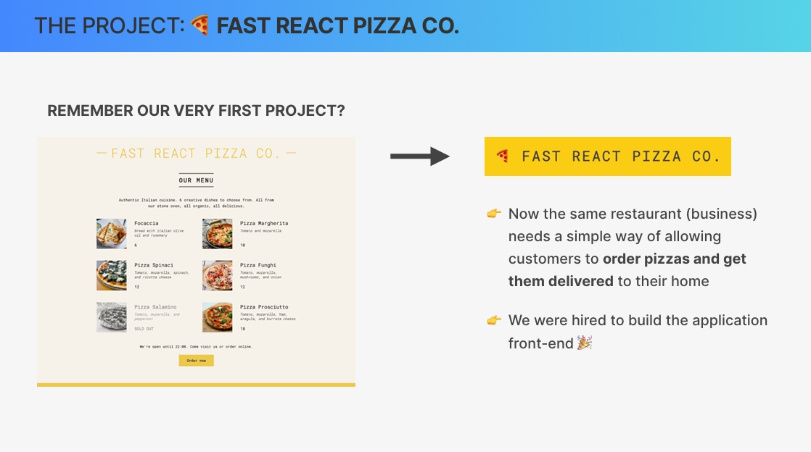
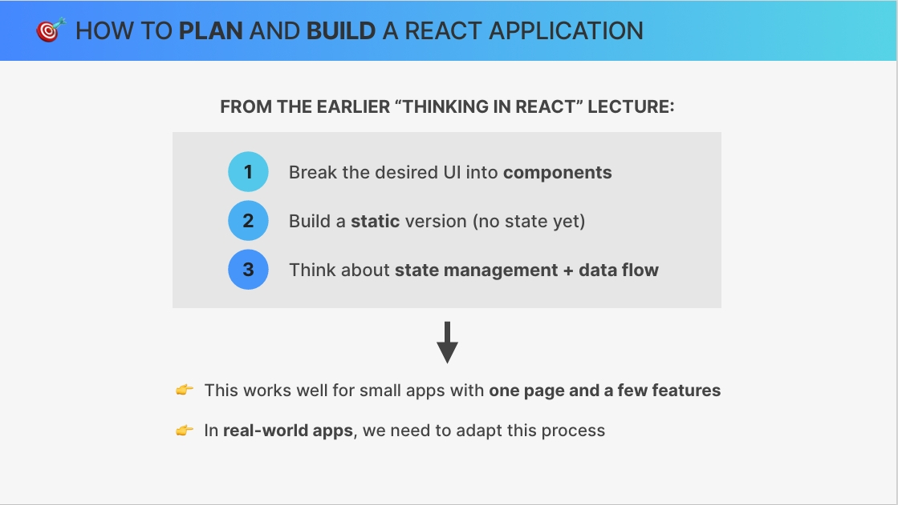
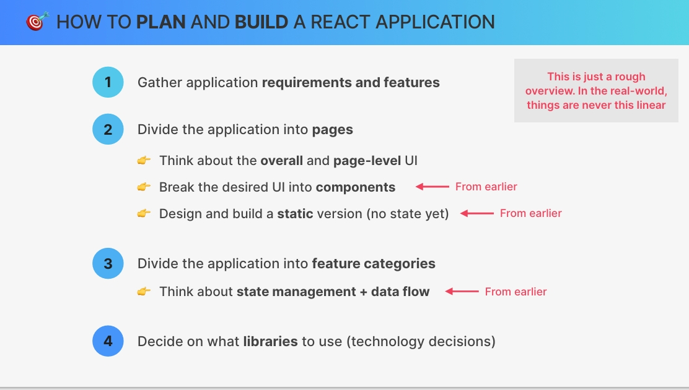
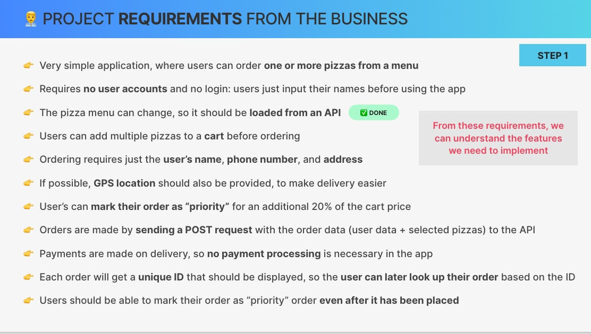
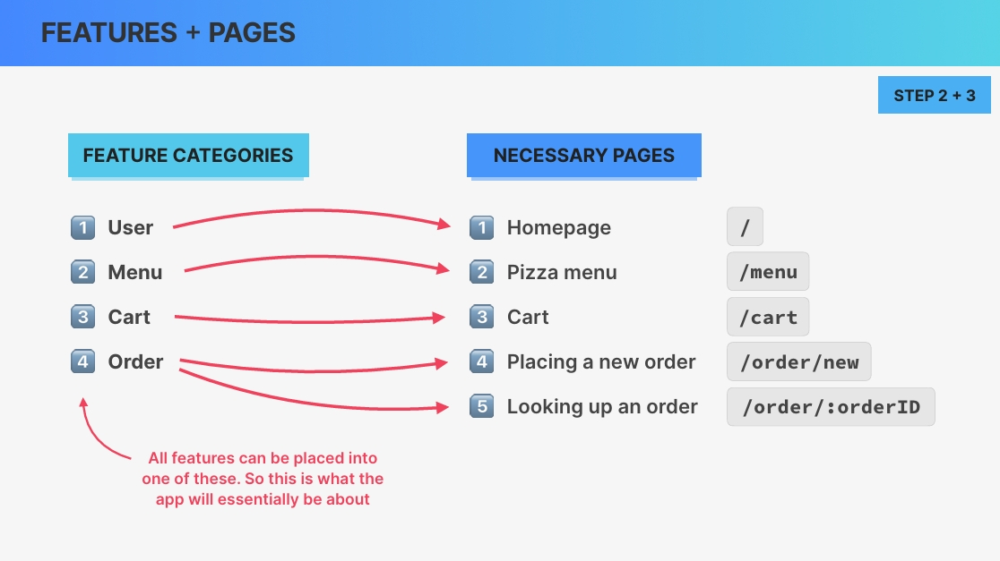
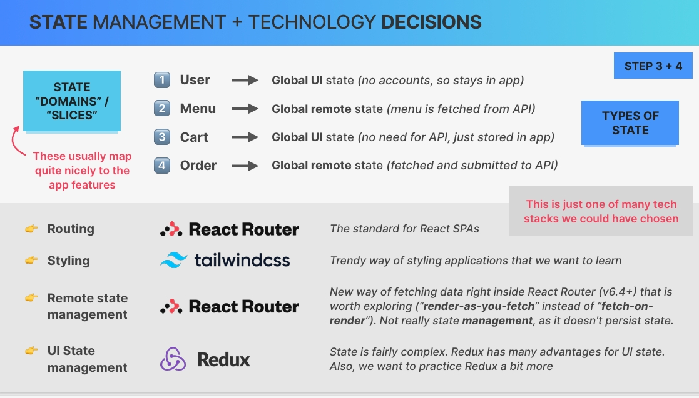

# `React Router With Data Loading (v6.4+)`

## `Table of Contents`

1. [Section Overview](#section-overview)
2. [Setting Up a New Project Fast React Pizza Co](#setting-up-a-new-project-fast-react-pizza-co)
3. [Application Planning](#application-planning)
4. [Setting Up a Professional File Structure](#setting-up-a-professional-file-structure)
5. [A New Way Of Implementing Routes](#a-new-way-of-implementing-routes)
6. [Building the App Layout](#building-the-app-layout)
7. [Fetching Data With React Router Loaders Pizza Menu](#fetching-data-with-react-router-loaders-pizza-menu)
8. [Displaying a Loading Indicator](#displaying-a-loading-indicator)
9. [Handling Errors With Error Elements](#handling-errors-with-error-elements)
10. [Fetching Orders](#fetching-orders)
11. [Writing Data With React Router Actions](#writing-data-with-react-router-actions)

---

## `Section Overview`

In this first project of part 4, we're gonna go back to react router. And in particular, we're gonna make use of the modern data loading capabilities of react router in the really cool pizza ordering project. We'll also talk about how to actually plan a professional react project, which is something that we haven't done in all previous projects. So this time we're actually getting a bit more serious and I'm super super excited about that because building professional react apps is what this course is all about. And with that being said, let's jump right into our next biggest project yet.

---

## `Setting Up a New Project Fast React Pizza Co`

As always, let's start this section by actually setting up our next project. And since we are now in the professional react development part of this course, we are of course going to use Vite and not create-react-app to scaffold this new application. And so let's open up our terminal move to the folder where all our projects live. And then in there let's run **npm create vite@latest** But in this case it's important that you run vite actually at version 4 so that everything is going to work exactly like here in the video.

So in this section, the project that we're gonna build is called **`fast-react-pizza`**. Then let's use our arrow keys to select react and just with JavaScript. And there we go.

And remember that with Vite, we actually don't initially have the node modules folder. So all of the libraries like React and React DOM actually haven't been installed yet. And so that's the first thing that we need to do now. So let's open up our terminal and then let's just run `npm install`.  
And now that this is finished, we also need to configure ESLint. So just like we did before also in our world wise application.

We also need the Vite ESLint plugin. So that's Vite plugin ESLint. And then we also need the basically ESLint configuration rules specifically for React apps.

```bash
npm install eslint vite-plugin-eslint eslint-config-react-app --save-dev
```

And once that is done let's again **create the `.eslintrc.json` file**. We can use this file to configure ESLint in this project. Just make sure that you also have the ESLint extension installed in your VS Code. And so here what we're gonna do is to tell ESLint that we want to use the previously installed set of rules(eslint-config-react-app) for React apps. So what we want to do is to extend.

So we use extents and then it actually needs to be these quotes and then react app.

```json
// .eslintrc.json file
{
  "extends": "react-app"
}
```

So that's the first step in configuring ESLint. And now we also need to change something in vite.config.js File. So this is the config file where we can change all kind of settings about the Vite application itself. And so here what we're going to do is to import ESLint from the Vite-plugin-ESLint module, so `vite-plugin-eslint`. And so now what we need to do here is to then use that in this array of plugins. So we already have the React plugin here because that's the starter template that we basically chose in the beginning when we set up the project. And now here we just need to add eslint as well.

```js
// vite.config.js plugin
import { defineConfig } from "vite";
import react from "@vitejs/plugin-react";
import eslint from "vite-plugin-eslint";

// https://vitejs.dev/config/
export default defineConfig({
  plugins: [react(), eslint()],
});
```

With this we should have eslint correctly configured in our project which again is really really important because without ESLint it's a bit like coding half blind. So for example, we need help with the useEffect hook all the time. So with the dependency array and things like that. And so for this ESLint is really indispensable.

Great, so with this we are now ready to start building our application. And this time actually I don't have a demo version of the application for you because instead we will basically build the complete application from complete scratch as if we were building the app for a real client. And so we really need to plan it from scratch. And so let's go do that now in the next lecture.

---

## `Application Planning`

So as I just mentioned earlier, this time around we have no demo application because we will pretend that we are now building this project for a real client. And so in this lecture, I will show you how we can plan a professional react application step by step.

But before we go do that, let's introduce our new fictional client. So do you remember this⤵️(in ss image) very first project that we built at the very beginning of the course? So it was simply this static page that displayed the pizza menu of the Fast React Pizza Company.  
And so now this same business basically needs a simple way of allowing their customers to order pizzas so that they can get them delivered to their homes. And so basically, this company, so this fictional business is now hiring us to build their applications front end. And of course, we are going to do that using React. So for some reason they already have the back end API built and so our only job will be to build the front end, so the visible part of this application.



Now building a complete application like this from scratch is of course a bit intimidating.  
And so let's learn how we can break this process into multiple steps. And let's actually start from what we learned earlier in the thinking in React lecture. So back then we learned that we can build a simple React project by breaking the desired user interface into components, then building a static version without state in the beginning. And then after that, we think about the state management plus the data flow. So this works quite well for small applications that only has like one page and only very little features.



But in a real world application like the one that we're going to build next, we actually need a bit of a more complete process. And so we need to adapt this a little bit. So let's see how we can do that.

1. So when we build a large and more real world application, we need to start by gathering the application requirements and the features that the application needs.

2. And then based on those, we can divide our application into multiple pages. So a bit like we did earlier with the world wise application.

3. Next up, we need to divide the application and the application features into multiple feature categories. So basically, we need to place all the features into a few categories so that we can then build the application around those and so that we can organize our code any logical way. And if all this sounds a bit confusing then don't worry because next up we will of course do all this in practice with the application that we are currently building.

4. But anyway, finally, we will also need to decide on which libraries we actually want to use. So we call this the technology decisions because this is basically where we decide exactly what tech tag we are going to use to implement our application.

We can divide some of these points into some sub points. As we divide the application into pages, for each of the pages we can think about the overall and the page level user interface. And so then comes the time where we can break the desired user interface into its components. So just like we learned before in the thinking in react lecture.

So this is where the steps that we learned about earlier actually come into play. So they are still very valid and very important but we now basically do them on a page and on a feature level. And for each of the pages we can now design and build a static version, so if we want.



Now there's still one step missing from earlier, so from that thinking in React lecture which is to think about state management and data flow. And so that we do for each of the feature categories. So for each of these categories that we identified, we will now need to think about what data it needs and where we can store that data. And so that's basically what state management is all about. Now, all this is of course just a rough overview.

So in the real world things are never this linear. But still I think that this is a very good overview of the whole process that we need to go through. So with this at least you have a couple of guidelines that you can use in your own projects in the future.

And with that being said, let's now quickly go through these 4 steps here one by one and apply them to the application that we are currently building or that we actually want to start building based on this planning. And we are going to start with the business requirements.

### `Project Requirements from the Business`

`Just go through the ss image⤵️`  
So basically with everything that the business expects from this application. So first off, this should just be a very simple application where users can order 1 or more pizzas from a menu. So that's a high level overview of the application that the business wants us to build.  
And so whenever you need to work on some project for someone even if it's just for yourself you need to start by gathering a list like this⤵️.

So next up, this application does actually not require any user accounts and no auth, so no login functionality. So users simply input their names before they start using the application.

Now, the pizza menu can actually change from time to time and so it should be loaded from an API that is already done. So as I mentioned at the beginning, for some reason the business already has their own API. And so we can just start using that to load the pizza menu.

Now, remember that users can order multiple pizzas from the menu. And so therefore, we need some sort of cart where the users can place multiple pizzas before they order. Now, since this app has no user accounts, all that the user needs to provide in order to start an order is their name, their phone number and their address. So that pizzas can be correctly delivered and the user can be reached in case there is some problem.

Now if possible, the GPS location should also be provided to make the delivery easier for the company.

Now one important feature that the business requires from us is that users should be able to mark their orders as a priority order. And the cost of that will just be 20% on top of the cart price.  
Now in practical terms these orders are actually made by sending a post request with all the order data. So that's the user data. So the name, the phone number and the address plus all the selected pizzas from the cart. And so all this data will be sent to the same API that we already have.

Now, remember how we said that this is a very simple application. And so therefore, all payments are made on delivery. So users will only pay in the moment that they actually receive the pizzas at home. And therefore, no payment processing is necessary to implement in this application.

Now, once the user has placed a new order, each new order will actually get a unique identification that should be displayed somewhere in the user interface because then the user can later look up the status of their order based on this ID. And so this is again necessary because there are no user accounts in this application to keep it really simple.

And finally, users should also be able to mark their orders as priority even after the order has already been placed.



This is the list of requirements that our application will need to satisfy. But of course, this is all still a bit confusing. So we don't really know how to build our application just from this, right?

However, from these requirements we can now start to understand what features we actually need to implement. And so let's take a look at that in the next slide.

### `Features + Pages`

So basically what we want to do now is to derive the application's main feature categories from the list of requirements that we just saw.

So first of all, remember how the user needs to input their name in order to start using the application. And so **one feature category is going to be everything related to the user**.

Another pretty obvious **category is the menu**. So all the features that are related, for example, to loading and displaying the menu will be part of this feature category, because the menu is a pretty important part of this application.

And another pretty important part that we have of course also mentioned in the list of requirements is the cart. So this is where the user will be able to take 1 or more items from the menu and add them to their cart. And also of course to update the quantities of each pizza.

And finally, one of the big feature categories is going to be the order because many features of the application are going to be related to this topic. For example, placing a new order or looking up an existing order based on the ID. And of course, in practice, once we start doing this, it will all become a lot easier. But for now, what's important to understand is that all the different features that we are going to implement in the application can be placed into one of these feature categories. So basically, this is what the entire application is going to be about. So it will be about users, about a menu, about a cart and about orders.

And so this basically gives us a high level overview of what the project is all about. Now from this list of requirements and also especially from this feature categories, we can already start to understand the pages that we are going to need to implement. So first off we are probably going to need some homepage, then we need a page for the pizza menu, we will need a page to display the user's card, and we will need a page to place a new order. So here we could use this URL of order slash new or of course we could do some other thing as well. So for example, it could also be called simply slash new order. But this makes sense because in our next page we will then have slash order slash the order ID. And so this page will be to look up an order. So these pages 45 then follow a similar URL structure where they both start with slash order and then in one of them we can place a new order and in the other one we can look up an existing order by passing in the order ID as a param.

Now remember how in the list of requirements we stated that the user needs to input their name in order to start using the application. And so this is how we connect the user feature with the page. So in this case, the homepage, because that's where the user will input their name. Then of course, the menu category is connected to the pizza menu page and the same for the cart and for the order. And so with this we can really see how the feature categories help us to determine which pages we need in the app. So we need one page for the menu, one for the cart, and in this case two pages for the order. One to place a new one and one to look up an existing order.  
And again, this will all become a lot clearer as we actually start building this project in practice. But here we are just doing this long exercise of trying to plan the project before we actually start, which is always a good idea.



### `State Management + Technology Decisions`

And now moving on in this process, let's talk about state management and tech decisions. And let's start with state management by bringing back our 4 feature categories.  
Now many times these feature categories actually map really nice to different state slices or state domains. And notice how I'm borrowing the term of state slices from Redux because I really like this term. So basically we have our entire state and then one slice of that state will be the user, one slice, so one part or one domain of the state will be the menu, one will be the cart and one will be the order. Because all of these different features will of course require some data, so some state in order to work.

Now the way in which we actually manage each of these state slices will depend on what type of state each of them actually is. And so let's classify each of them. So the first one(User) is going to be simply global UI state. So here we don't need any accounts and so therefore this data will simply stay in the application and needs to be accessible to many different components in the tree. And again, we will see this later in practice.

But anyway, next up the Menu is going to be global remote state because remember that the menu is actually gonna be fetched from an API.

Next up, again, since this is a very simple application, the card will simply be global UI state just like the user. So this data will also simply be stored in the application and not in some kind of remote database.

So there is no API in this case. And finally, the order will again be global remote state because this one of course needs to be submitted to an API and also fetched from an API.

So essentially the menu and the orders are remote state because they live on a server while the user and the cart are simply stored in the application. And again, like I just said earlier, many times you will only take these decisions while you are already building the application. And so it's not always going to be this linear process.

But here we wanted to do this because based on this we are now going to take or take decisions. So we are going to select or technology stack to build this application.

And let's start actually with routing. So for routing we are going to use the standard for react single page applications which is **react router**.

Next up, we need to take a decision regarding to styling the application.

And so this is where the controversial part is going to start because here we actually want to use **Tailwind CSS**. So Tailwind is a very trendy way of writing CSS that's becoming really really popular. And so many people want to learn that and so that's why we are going to go with this technology for this application.

Next up, let's talk about state management. And remember how we have 2 different types of state, so UI state and remote state. And so we are going to need 2 different ways of managing that state.

Starting with remote state management, we will actually **use the new data fetching capabilities of react router**. So since version 6.4, react router is now able to fetch data right inside of react router. And so this is something that is really worth exploring because **this allows us to implement a so called render as you fetch approach instead of the fetch on render that we have been using up until this point.** And of course we will learn what each of these strategies actually means once we start using React Router in practice for this.

Just notice that this is not really state management in the classical sense because it doesn't really persist state in a place that is easy to access from everywhere. But again, it's still worth exploring this new and modern option because it allows us to do so many things using just one library. And it's also quite a nice way of working as you will see soon.

Now finally, we also need to talk about UI state management. And so for that we will bring back Redux.  
So this state that we're going to manage is a bit complex. And so let's bring back Redux because it has many advantages for this kind of state. And also in this case, we actually want to practice Redux a bit more in a real world setting. And so that's why I decided to include Redux in the text stack of this application. So just notice that I'm not advocating for this particular technology stack.



So of course we could have chosen completely different libraries here, but this is just some technology that we want to learn more and to explore in this project. But for example, for remote state management I really highly prefer react query instead of react router. But again, here we just want to explore these different technologies and so this is going to be our tech stack. And so this really has been enough talking now and so let's finally go back to code and actually start building our application based on all the planning that we just did in this long lecture. So I hope to see you there very soon.

---

## `Setting Up a Professional File Structure`

Let's start by setting up a professional file structure for our project and place our starter files within that structure.

Now there are many different ways in which we can structure a professional React application. And every developer has a different opinion about this. **But what I like to do and what I find works really really well with big projects is a feature based structure.** So instead of creating 1 big folder which contains all the components, instead what I like to do is to create one features folder.

So **right inside source, let's create a folder called features**. And so now, this is where the feature groups that we identified in the previous lecture come into play because now we will have one folder for each of these feature groups or feature categories. So let's then create one folder for each of them. And so here we will have the `user`. We will have also the `menu`. So all inside features, we have the `cart` and we also have the `order`.

**Each of these folders here will contain all the components, all the custom hooks and really all the JavaScript files that are necessary to make each of the feature work.** So all of these files are going to be co located in the same place so that we don't have to jump around all the time inside our folder structure.

However, there are also some components that are more reusable or that don't really belong in any of these features. And so for that let's create one folder called `UI`. And so this will basically contain reusable UI components such as buttons, inputs and so on. So these are many times just presentational and don't contain any side effects.

Now next up, **let's create the `services` folder**. This folder is basically for reusable code for interacting with an API. So in this case with the pizza API that we already have. Okay.

Let's keep going and add one for utilities, `utils`. And so these are basically just some helper functions that we can also reuse in multiple places of the application. So these are reusable and more importantly stateless helper functions that don't create any side effects, for example, for date or for number manipulations.

And we could keep going here and we would do that if we had a more complex app. For example, we could create a reusable `contexts` folder or a reusable `hooks` folder or also a `pages` folder like we did before in the world wise application. However, here in this app we will not have that special folder and instead also place these pages right here in the feature folders. So that again we don't have to jump around so much in our file structure.

Let's now get our starter files as always. And let's actually grab the entire folder and place it inside source. And then from there, we will sort these different files into the folder in which they belong.

So here we have 2 files which are called API geocoding and API restaurant. So here for example to interact with the react fast pizza API I already have all of this code here. And so these 2 are essentially services. So reusable code for interacting with these APIs.

And here we have some helper functions. So as I was saying for number or currency manipulation to format some date and some other calculations here, and so let's place this one in the utilities folder.

So we have these ones here called cart, cardItem and cardOverview. And so these are very obviously all about the card.

---

## `A New Way Of Implementing Routes`

**Now it's time to finally go back to React Router and to a new way of implementing routes.**

**So React version 6.4 introduced a whole new way of defining routes and of working with React Router.** So from now on we can use some powerful mechanisms inside React Router for fetching data into pages and for submitting data using forms. So all within React Router. Now to enable this we need to define our routes as I just said in the beginning in a completely different way.

And so to show you how it works let's start by installing react router. Let's do npm install react router dom and then here it's important that you do version 6. **`npm i react-router-dom@6`** Alright.

Let's open up the React Router documentation. So once you start working with these professional React development libraries, it's very important that you start getting into the habit of always working with the documentation. And so React Router is of course one of those third party libraries that we use all the time.

So first off here in this case you can select the current version up here in the selector, and then here we have the navigation. And so the function that I just mentioned we are going to need is **createBrowserRouter**. <https://reactrouter.com/6.28.0/routers/create-browser-router>.

And so if you want you can then check out the documentation for this function or you can also learn first how to actually pick a router. But I would say if you want to work with data fetching in React Router you are most likely going to need this one `createBrowserRouter`. Okay.

So let's actually use that function outside the component. So **createBrowserRouter**. And so now that got of course imported from React Router DOM.

**And so this is a function where we define all routes. And we do that by passing in an array of objects where each object is one route.** So let's start with the Homepage. And so we define the path property. And so let's set it here to the root path and then here we define the element. So here now we want to use this home component here as the home page.

```js
import Home from "./ui/Home";
createBrowserRouter([
  {
    path: "/",
    element: <Home />,
  },
  {}
]);
```

Now for now nothing changed here because we haven't actually used the result of this yet, but before we do that let's just add another one. So let's now add the Menu. So with this, we have created our browser router but we are actually not doing anything with it yet.

So let's start by saving the result of calling this function into a variable called router and then here inside our application let's now then place this router. And so let's return and then here again a new component which is called **RouterProvider**. So this one right here, and so then this one takes a prop where we pass in that router that we just created. And so, there it is. So this is now our homepage.

```jsx
// App.js
import { createBrowserRouter, RouterProvider } from "react-router-dom";
import Home from "./ui/Home";
import Menu from "./features/menu/Menu";

const router = createBrowserRouter([
  {
    path: "/",
    element: <Home />,
  },
  { path: "/menu", element: <Menu /> },
]);

function App() {
  return <RouterProvider router={router} />;
}

export default App;
```

And so our new router is now working. Now I just want to quickly compare the way that this looks with the more traditional approach.

So let's come back here to our world wise application and then the app.js file. Let's open it inside Versus Code.

```js
// From WorldWise Application (Ap.js File)
function App() {
  return (
    <AuthProvider>
      <CitiesProvider>
        <BrowserRouter>
          <Suspense fallback={<SpinnerFullPage />}>
            <Routes>
              <Route index element={<Homepage />} />
              <Route path="product" element={<Product />} />
              <Route path="pricing" element={<Pricing />} />
              <Route path="/login" element={<Login />} />
              <Route
                path="app"
                element={
                  <ProtectedRoute>
                    <AppLayout />
                  </ProtectedRoute>
                }
              >
                <Route index element={<Navigate to="cities" replace />} />
                <Route path="cities" element={<CityList />} />
                <Route path="cities/:id" element={<City />} />
                <Route path="countries" element={<CountryList />} />
                <Route path="form" element={<Form />} />
              </Route>
              <Route path="*" element={<PageNotFound />} />
            </Routes>
          </Suspense>
        </BrowserRouter>
      </CitiesProvider>
    </AuthProvider>
  );
}
```

So remember that here we declare routes in this declarative way. So we use the really the **BrowserRouter** component and **Routes** and **Route** where we then define the path itself as a prop. So here we are doing it more in an imperative way. So we're declaring the router outside of the JSX and using this JavaScript array right here. **And this is necessary in React Router 6.4 in order to enable data fetching or data loading with React Router.**

**The old way still works even in the modern React router, but then we cannot use it to load data or to submit data using forms. So all these new data loading capabilities are enabled and are only possible to use when we create a router using this create browser router function.**

Alright. But anyway, let's keep going here and let's basically create all our routes. So all the pages that we talked about in the planning lecture.

To create a new order we'll use slash order slash new route. So create order and finally, we also had the path to check out an existing order. And so that's order and then here we can just like before define params with this colon and then the param name. So that's just order ID and then here the element is just the order.

So notice how in that new Router that we just created we didn't do one path as a fallback, so for part not found (404). So the path with the star(*) in previous version of react-router where we then used page not found. **So again, here we don't need to do that because we will have a special way of handling errors. So for example, when a certain page is not found. Okay.**

```jsx
// App.js
import { createBrowserRouter, RouterProvider } from "react-router-dom";
import Home from "./ui/Home";
import Menu from "./features/menu/Menu";
import Cart from "./features/cart/Cart";
import CreateOrder from "./features/order/CreateOrder";
import Order from "./features/order/Order";

const router = createBrowserRouter([
  {
    path: "/",
    element: <Home />,
  },
  { path: "/menu", element: <Menu /> },
  { path: "/cart", element: <Cart /> },
  { path: "/order/new", element: <CreateOrder /> },
  { path: "/order/:orderId", element: <Order /> },
]);

function App() {
  return <RouterProvider router={router} />;
}

export default App;

```

**`QUICK RECAP`**

So just to recap in the new react router since version 6.4, if we want to use the new powerful APIs like data loaders, data actions or data fetchers we need to create a new router using this⤴️ new syntax. So specifying an array of objects where each object is now the route. So a correspondence between a path and the component that we want to display in the user interface And we then provide that router object using the RouterProvider component.

---

## `Building the App Layout`

In this lecture, let's learn how we can implement a **global application layout using React Router**.  
And let's start by actually first building that layout so that we can then connect it with our router.

So what I want to do is to create a layout that is going to work both for big screens or even for mobile phones. So for really small screens. So what I want to do is to create a header with the name of the company and a link to the homepage and maybe the username as well.  
Then the main part of the page should be for the content itself, so like the pizza menu or for the current cart view.  
And then down I want to have overview of the cart that is always visible on all the pages. So basically that displays how many items are in the cart and a link to the cart. So to make that very important part of the application always accessible from everywhere. And so this cart overview and the header will be part of the layout. So the part of the application that is always visible, while the only thing that changes is the part in the middle, which again can be the menu or the cart or the form to create a new order. Alright.

So let's create a new component file inside the UI folder and let's call it appLayout just like we did in the world wise application. Here we want that header and again we need to create a new component for that here because we don't have that yet. And again this is one of these UI components. So Header.jsx.

So here let's make it a header element and then start with a Link that always allows us to go back to the homepage. So this is something very common, in all web applications(Logo with site url). So let's import that(Link El) from react-router-dom and then the Link goes to the root URL basically.

```jsx
// Header.jsx
import { Link } from "react-router-dom";

function Header() {
  return (
    <header>
      <Link to={"/"}>Fast React Pizza Co.</Link> // like a logo
      <p>Muhammad</p>
    </header>
  );
}
export default Header;
```

And with this, we can close this and then start to include that in our appLayout.

So let's place that inside a main HTML element and then for now let's just place h1. And then we want that cart overview as I was saying. So that component we actually already have. So it's just some static HTML for now, but that's going to work for now.

```jsx
// CartOverview.jsx
function CartOverview() {
  return (
    <div>
      <p>
        <span>23 pizzas</span>
        <span>$23.45</span>
      </p>
      <a href="#">Open cart &rarr;</a>
    </div>
  );
}
export default CartOverview;
```

Also notice that there is no styling here anywhere. So there are no class names or anywhere to be seen and that's just because we are going to style this using tailwind in the next section.  
Now here notice how we have a link to the cart and so let's actually replace this anchor element here with again the Link from react router.

```jsx
// AppLayout.jsx
import CartOverview from "../features/cart/CartOverview";
import Header from "./Header";

function AppLayout() {
  return (
    <div>
      <Header />

      <main>
        <h1>Content</h1>
      </main>

      <CartOverview />
    </div>
  );
}

export default AppLayout;

```

And with this we have our AppLayout done for now. So the header, the content and the cart overview.

**And so now how do we connect this with our Router definition?** Well, remember how we did something similar earlier in the WorldWise application. So remember how here we also had the AppLayout component inside the Route. So as the element for the Route and we then had all these other routes as nested routes. So routes that are rendered inside the parent route. And so here we can do something similar.

So basically we can do the exact same thing but with a different syntax inside new **createBrowserRouter** function. So the way that we define child routes, so **nested routes is by defining the children property**.

So let's create a new object and the element that we want is that AppLayout that we just created. And we don't need any path which will then effectively make this a layout route. So basically a route with the only purpose of providing a layout to the application.  
So then as I was saying earlier, we need to make all of this year their child routes. So basically the nested routes. And so we define this children property and then we pass it a new array of routes.

```jsx
import { createBrowserRouter, RouterProvider } from "react-router-dom";
import Home from "./ui/Home";
import Menu from "./features/menu/Menu";
import Cart from "./features/cart/Cart";
import CreateOrder from "./features/order/CreateOrder";
import Order from "./features/order/Order";
import AppLayout from "./ui/appLayout";

const router = createBrowserRouter([
  {
    element: <AppLayout />,
    children: [
      {
        path: "/",
        element: <Home />,
      },
      { path: "/menu", element: <Menu /> },
      { path: "/cart", element: <Cart /> },
      { path: "/order/new", element: <CreateOrder /> },
      { path: "/order/:orderId", element: <Order /> },
    ],
  },
]);

function App() {
  return <RouterProvider router={router} />;
}

export default App;

```

And indeed, that worked beautifully. However, of course here we are still showing the exact same, h1 content in all pages and that's simply because we didn't tell the app layout yet to use the child route. So basically we didn't tell this component where to render the child route content.

So we want in main instead of just h1 with content we want the content from each route(pages). And if we are in the cart URL then we of course want this cart element to be shown.  
**And remember how we do that. So basically remember how we render the content of a nested route inside another route.**  
Well, maybe you remember the `Outlet component`. **So outlet provided by react router dom.**

```jsx
function AppLayout() {
  return (
    <div>
      <Header />

      <main>
        <h1>Content</h1>
        <Outlet />
      </main>

      <CartOverview />
    </div>
  );
}
```

So inside this main, we now really only want that content and no longer that h1.

And so with this we now have our layout in place.

***`QUICK RECAP`***

So we created AppLayout component which we will want to use as the parent route of every single other route that we have in our application. And so that's why we placed that AppLayout element right at the top and then we made all the other routes child routes of the AppLayout. So they are all nested routes now.  
So then inside the parent route we can use the Outlet component to render whatever is the current nested route. And so again this is similar to what we did earlier in a world wise application. The difference was that we didn't have the app layout component as the parent component. So the parent layout of the entire page. It was really only of that part that was the visible application with the map on the right side and that sidebar with the cities. So remember that? But then outside of that app layout here we also had all these other pages that had a different layout. So this was a different application and so we did things in a different way but here this is how we do it. So we have just one layout all the time. It never changes throughout the app. And so therefore this is basically or parent route of all other routes.  

**And as I mentioned earlier since AppLayout doesn't have a path it is technically called in React router a layout route.** Alright, but that's enough talk about layouts. Now let's actually get to fetching data which is as I mentioned earlier the main new feature of React Router 6.4 and it's the whole reason why we declared our routes like this in the first place.

---

## `Fetching Data With React Router Loaders Pizza Menu`

**Let's now learn about React router's powerful new data loading feature, which is called `loaders`.**  
So the idea behind a loader is that somewhere in our code we create a function that fetches some data from an API. We then provide that loader function to one of our routes and that route will then fetch that data as soon as the application goes to that route. And then in the end once the data has arrived it will be provided to the page component itself using a custom hook. So that sounds a bit confusing.

And so let's actually implement this with code. And I want to start by fetching the menu data.  
So, we do this in **3 steps**.

1. Create a loader.  
2. Provide the loader.  
3. Provide the data to the page.

Now this data loader can be placed anywhere in our code base but the convention seems to be to place the loader for the data of a certain page inside the file of that page.

So here in this case, we want to load the Menu data. And so let's go to the Menu component and create the loader function right there. *The convention is to just call this function a `loader`.*

And so then here this function needs to fetch the data and then return it. **Now where are we actually going to get that data from?** Well, that's where the apiRestaurant.js file now comes into play. So let's open up this file and you see that here we have multiple functions. So we have get menu, we have get order based on an ID, we have create order and we have update order.

So if you want you can take a look at all of this code but this is just some pretty standard code here. What matters is that this is the API URL <https://react-fast-pizza-api.onrender.com/api/menu> which again is that API that the react fast pizza company already has.

```js
// Function to fetch a menu
const API_URL = 'https://react-fast-pizza-api.onrender.com/api';

export async function getMenu() {
  const res = await fetch(`${API_URL}/menu`);

  // fetch won't throw error on 400 errors (e.g. when URL is wrong), so we need to do it manually. This will then go into the catch block, where the message is set
  if (!res.ok) throw Error('Failed getting menu');

  const { data } = await res.json();
  return data;
}
```

And so all we need to do now in that loader is to call this getMenu function. So basically we abstracted this function right here into the service so that now we can use it inside our loader functions.  
And of course, we could also place all this logic right there in the loader as well, but it's a lot better to have this kind of logic in a central place. Also because this might be necessary in some different places and also because then we centralize the API URL.  
So it's nice to abstract this logic away here so into that service folder and then here all we need to do is to call that function.

So let's then save the result into a variable called menu and then here we await calling getMenu. So this is then an async function that we also need to export. And so now here we have the default export for the component itself, and then we also have a named export for the loader function, but that's no problem at all. And now all we need to do is to return the menu, and we could have done this all in one line but like this it's a bit more explicit. So the loader function needs to return whatever data it wants to provide to the page.

```jsx
import { getMenu } from "../../services/apiRestaurant";

function Menu() {
  return <h1>Menu</h1>;
}

// Named export
export async function loader() {
  const menu = await getMenu();
  return menu;
}
// Default export
export default Menu;
```

Okay. **And now let's do the second step which is to connect the loader function to the route.**

So import the loader function into App.jsx.
The loader is in Menu component. And so in order to import now the named export we do it like this and then let's actually rename it because otherwise we will later end up with multiple loaders. So let's say loader as menuLoader. So this is how we rename some named exports or named imports in this case.

```jsx
// App.jsx
import Menu, { loader as menuLoader } from "./features/menu/Menu";
```

And so in menu route we can now specify the loader property and then specify the menuLoader. Okay. Give it a safe.

```jsx
// App.jsx
{ path: "/menu", element: <Menu />, loader: menuLoader },
```

And so with this we completed step number 2. So we now provided this loader function to the menu route.

And now all we have to do is to get that data into the component. And so as I mentioned earlier for that we can use a custom hook which is called **useLoaderData**. And here we don't have to pass in anything into the function because React Router will automatically know that the data that we want here is the one that is associated to this page. And so that's the data coming from this exact loader that associate with this route. So let's then call it menu, and for now just log it to the console.

```js
function Menu() {
  const menu = useLoaderData();
  console.log(menu);

  return <h1>Menu</h1>;
}
```

So let's give it a safe. Let's open up here actually or network tools. So this is pretty small but I can't make it too big as well.

Let's move to the menu by clicking menu link. And indeed you see that a new fetch request was fired off automatically. And if we then check out our console and indeed here we have our menu data. Beautiful. So this worked and so we successfully connected this loader function now to this page.

And effectively what we just did here was to implement or to **use a render as you fetch strategy** because **the nice thing about this is that React router will actually start fetching the data at the same time as it starts rendering the correct route.**  
So these things really happen at the same time while what we did before using useEffect was always a **fetch on render approach**. **So basically we rendered the component first and then after the component was already rendered is when we then would start to fetch the data. And so that would then create so called `data loading waterfalls`,** but not here. So here everything really happens at the same time which is a really nice and really modern thing to do as well.

**So with this, what we just did React Router is no longer only responsible for matching component to URLs in the browser, but to also provide the data that is necessary for each page.** So again, in this case for providing the menu data using the menu loader to the menu page. And this is really useful because your else pages and the data that pages require are very often tightly coupled together. And so it is really practical in these situations to get both the page and the data all in one place. So all nicely integrated within React Router.

But anyway, now that we know how this works let's then actually do something with the menu. So let's create one ul where we then loop over the menu. So dot map and then here each item of the array is a pizza and for each pizza we want to render this menu item here. So here I see we have another error. So let's just automatically import that here, and then here notice how this menu item all it does is to receive 1 pizza object.

So that's basically one of these objects that we have here in the menu. So menu item and here we pass in the current pizza and the ID or actually the key. So never forget the key in a map like this. And so here let's use pizza.id.

```JSX
// Menu.jsx
import { useLoaderData } from "react-router-dom";
import { getMenu } from "../../services/apiRestaurant";
import MenuItem from "./MenuItem";

function Menu() {
  const menu = useLoaderData();
  console.log(menu);

  return (
    <ul>
      {menu.map((pizza) => (
        <MenuItem pizza={pizza} key={pizza.id} />
      ))}
    </ul>
  );
}

export async function loader() {
  const menu = await getMenu();
  return menu;
}

export default Menu;

```

Alright, give it a save and it is actually already working. So again, there's no styling but here we have our menu. This data is coming from react router or at least it is being injected into this page using react router. Now you could of course argue that this is no different from what we have doing before. So we still have this function here right inside the component file. And so this might look very similar to simply fetching the data right in the component. So basically just doing that data fetching here right inside the useEffect here in the component.

However, as I mentioned earlier this is actually using the render as you fetch strategy. So not the fetch on render that creates waterfalls.  
Also, as I mentioned in the beginning this function(loader in Menu.js) really could be placed anywhere because what matters is that the data fetching logic is actually centralized in the route definition. So the data fetching really is fired off right in the router itself not in the component. And so if all of these components here would be fetching some data then all of that would be happening in this one place which is something that we always strive for. So it's always good to have all the data loading and really many other things as well happening just in one place so that we can see what's happening all at once.

But anyway, after this long explanation of how data loading works in modern React Router, let's also use these capabilities to display a loading indicator right in the next lecture.

---

## `Displaying a Loading Indicator`

So as I was just saying, let's now go implement that loader. So here in our page, When we click on menu link, we could see that there is a small delay between the click and the data actually arriving. So that's taking some time for data fetching, and so during that time we of course want to display like a loading spinner or some other loading indicator.

Now in order to be able to display an indicator like this, we need to know whether this data is actually being loaded right now, right? So currently we don't have that information anywhere here yet, right? So there's no like isLoading state somewhere to be seen. And so we now need to get that information into our application. And in React router we can get access to this by using the useNavigation hook.  
So not useNavigate but really useNavigation. And with this we will be able to see whether the application is currently idle, whether it is loading or submitting. And this information is actually for the entire application. So not just for one page but really here for the entire router. So if one of these pages here is loading then the navigation state will become loading no matter which of these pages is actually being loaded.  

Therefore it doesn't make much sense to create that loading indicator right in the component. So this is not where we will need to display it because we will never really know whether it is actually this data that is being loaded. So instead let's just do one generic big loader right in AppLayout.js. So let's use that hook that I just mentioned. So useNavigation and not navigate.

```js
const navigation = useNavigation();
console.log(navigation);
```

And so here let's just log this to the console. So just navigation. Alright. Let's clear this and also no longer need that one. And so here notice how we have this navigation dot state.  
So here when we click on home it is **idle** when we click cart then it is idle again, but watch what happens as we click on the menu. So notice that briefly it was **loading** and then it became **idle** again. And so using this information we can now basically create or own isLoading variable. So that's simply navigation.state is equal loading. So whenever this is true we now want to render that loading indicator.

```js
function AppLayout() {
  const navigation = useNavigation();
  const isLoading = navigation.state === "loading";
  return (
    <div>
      <Header />

      <main>
        <Outlet />
      </main>

      <CartOverview />
    </div>
  );
}

export default AppLayout;
```

Now we don't have a component for that(loader) yet and so let's create that loader.jsx in UI folder. Now the name here might be confusing because in React Router a loader is actually a function that fetches some data, but well we are already used to this name of loader. So let's just roll with it here. Alright. Now here for now all we will do is to use the loader class name which is part of our CSS and then here in the layout, actually also I want to temporarily use the layout class name.

```js
// Loader.js
function Loader() {
  return <div className="loader"></div>;
}

export default Loader;
```

Alright. But anyway, now we want to display that loading indicator. And so let's do that right inside the div, and this loading indicator is actually a big loader that will overlay the entire page at least later when we actually style it. But anyway, so here now we want is loading and if that's true then we want to render our loader. And everything else should also be rendered but basically it will then appear below this loader. But you will see that here in practice once we style all of this.  
So here we will not have a conditional rendering where we show either the content or the loader but instead we will always show the content but if we are currently loading then we will also show the loader. Alright. So the loader, give it a save.

```js
// AppLayout.js
import { Outlet, useNavigation } from "react-router-dom";
import CartOverview from "../features/cart/CartOverview";
import Header from "./Header";
import Loader from "./Loader";

function AppLayout() {
  const navigation = useNavigation();
  const isLoading = navigation.state === "loading";
  return (
    <div className="layout">
      {isLoading && <Loader />}
      <Header />

      <main>
        <Outlet />
      </main>

      <CartOverview />
    </div>
  );
}

export default AppLayout;
```

And now when I go to the menu we should already see that loader. And indeed, there it was. Saw that.

So this is how we use the global navigation state of our application in order to display the loader there.

---

## `Handling Errors With Error Elements`

Let's move on to everyone's favorite topic which is error handling. Well, not really, but error handling is an important part of building web applications. And so let's now see how it's done in the new React router. So with createBrowserRouter, whenever there is some error that is thrown in a loader, an action, or simply while rendering a component, we can render an error element instead of these elements that correspond to the actual pages. So again, if for example some error happens here in the menu we can instead of rendering this Menu render an Error element.

And so let's specify that error element first up here. So here in the parent route because these errors that happen in the nested routes, they will bubble up to the parent route. So error element, and then let's use the error that we already have. And then let's of course import that.

```js
import Error from "./ui/Error";

const router = createBrowserRouter([
  {
    element: <AppLayout />,
    errorElement: <Error />,
    children: [
      {
        path: "/",
        element: <Home />,
      },
      { path: "/menu", element: <Menu />, loader: menuLoader },
      { path: "/cart", element: <Cart /> },
      { path: "/order/new", element: <CreateOrder /> },
      { path: "/order/:orderId", element: <Order /> },
    ],
  },
]);

function App() {
  return <RouterProvider router={router} />;
}

export default App;

```

And then what I want to try first is to render some path that doesn't exist. And so there we go. So now we moved immediately to the error element. So something went wrong and then here we have this temporary message.  
But instead of this(temporary msg) we can actually get the actual error message that happened inside React Router by using yet another custom hook.

So since we are using this as the Error element right in the createBrowserRouter. So right in the property, then this(Error) component gets access to the error that has occurred. So let's call it error and we get the error by using **useRouteError**. Alright. Then let's log that to the console and let's try that again.

```js
function Error() {
  const navigate = useNavigate();
  const error = useRouteError();
  console.log(error);
}
```

And here it is. So we have the status, we have the error itself and we should have some message. So let's see. So usually each error always has a message. And so that's the one that we then want to render in jsx.

So let's do error dot data. And so here with this we get a nice error message. The `Go Back` Button here,  So it just calls the navigate function that we already know about.

But now let's try something else which is to basically create an error in a loader, and the way we can do that is by simply basically changing the API's URL, But now as we try to access the menu then after some time we get our error here. Now for some reason we don't get again the string.  
So let's just do Try to do another one. Let's see what the error says this time. Well, here there's nothing. And, yeah. So here we get the failed to fetch error message which is exactly what happened. So if error dot data doesn't exist then error dot message will be displayed.

```js
<p>{error.data || error.message}</p> // quick fix; for some reason error message is not available in error dot data, so....
```

Alright. However, now we see that this error message is really completely outside of our layout. So the complete application has been replaced with just this screen here. And so that's really not what we want. Instead in this situation we want the error to appear within the layout. And so we can basically also place the same error element inside of any of these child routes. Now in this case it only makes sense to place it in '/menu' path route. because this component is the only one that is loading some data. So only here things can actually go wrong.

```js
{
  path: "/menu",
  element: <Menu />,
  loader: menuLoader,
  errorElement: <Error />,
},
```

And so as I reload you immediately see that now the error is nicely within the rest of the application layout. So let's try that again, and it tries for some time and then something went wrong and then we get our error message. Nice. And this is really all that I wanted to show you here. So this is the very basic and most straightforward way of dealing with errors using the new React router.

**So basically using the error element property that we can define on each of the routes. It's just important to notice that each of these errors here will bubble up to the parent route unless it is actually handled in the route itself.** **So by placing error element right on the route where the error might happen.**

---

## `Fetching Orders`

Let's start this lecture by taking a look at our project requirements to see what we actually already implemented. So up until this point, actually all we did was to load the menu from the API. Since we are now loading data from API let's also load individual orders, so that we can implement other feature where a user can look up their order based on the ID of that order.  
So we cannot create orders yet but we can already use some dummy IDs to look up orders that had been placed before. And so let's now implement that functionality.

So basically now we are going to work on this route **`{ path: "/order/:orderId", element: <Order /> },`** on the Order page. So actually right now if we go to /order and then slash something, we will actually already get one dummy order. So if we take a look at our order component, So we see that we then have this⤵️, fake order basically.

```js

const order = {
  id: "ABCDEF",
  customer: "Jonas",
  phone: "123456789",
  address: "Arroios, Lisbon , Portugal",
  priority: true,
  estimatedDelivery: "2027-04-25T10:00:00",
  cart: [
    {
      pizzaId: 7,
      name: "Napoli",
      quantity: 3,
      unitPrice: 16,
      totalPrice: 48,
    },
    {
      pizzaId: 5,
      name: "Diavola",
      quantity: 2,
      unitPrice: 16,
      totalPrice: 32,
    },
    {
      pizzaId: 3,
      name: "Romana",
      quantity: 1,
      unitPrice: 15,
      totalPrice: 15,
    },
  ],
  position: "-9.000,38.000",
  orderPrice: 95,
  priorityPrice: 19,
};

```

Of course, what we want to do next is to make this dynamic. So we want to read the order ID from the URL and then display all the data regarding this exact order here on our page. And so that's what we will implement now.

So the first thing that we need to do is to implement a way in which we can actually search for the order. So in which we can input the order ID into our application. So basically we want a search field right in the header so that we can always access the search functionality from everywhere.

So let's then create a new component and since this component is gonna be related to searching a new order it is of course part here of the order feature. And so let's create that component right in the order folder. So let's say `SearchOrder.jsx` and then here let's just return an input.

So the placeholder should be search order # then let's make this actually a controlled element. So that means that we need some state now. So let's call it query and setQuery = useState with an empty string. So this is something we have done many many times. So we already know really well how this works. So here when we change then the text, we will update the query with e.target.value. Alright. And now in order to actually automatically submit this input field, let's wrap it into a form element. So that's a nice trick with which we can basically automatically submit this input value simply by hitting the enter key.

So let's then use on submit and create as always a handleSubmit function. So this then needs to receive the event so that we can do event dot prevent default because otherwise this will then create a new navigation which we do not want in a single page application.

```jsx
import { useState } from "react";

function SearchOrder() {
  const [query, setQuery] = useState("");

  function handleSubmit(e) {
    e.preventDefault();
  }
  return (
    <form onSubmit={handleSubmit}>
      <input
        placeholder="Search order #"
        value={query}
        onChange={(e) => setQuery(e.target.value)}
      />
    </form>
  );
}
export default SearchOrder;
```

Alright, Now we are not done yet, but I still want to already include this in Header. So searchOrder. Alright.

```jsx
// Header.jsx
function Header() {
  return (
    <header>
      <Link to={"/"}>Fast React Pizza Co.</Link>

      <SearchOrder />
      <p>Muhammad</p>
    </header>
  );
}
```

Alright! **So what do we want to happen here whenever a user type something and then hit Enter?** Well, we will want to move to this page <http://localhost:5173/order/fieldValue>. So slash order slash and then whatever a user type in form's field.

Now, first of all if there is no query then just return but otherwise what we want to do is to then navigate to that page. So for that we again need the navigate function.

So just like we learned before in a previous project. So for that we use the useNavigate hook and then we can call navigate to slash order slash and then the query. And then finally, let's set the query back to empty and this should be all we need.

```jsx
// SearchQuery
const [query, setQuery] = useState("");
const navigate = useNavigate();

function handleSubmit(e) {
  e.preventDefault();
  if (!query) return;
  navigate(`/order/${query}`);
  setQuery("");
}
```

Beautiful. So here we have now order slash ID but of course the data is still the dummy data. And so next up what we need to do is to then actually fetch the data from the API.

So using getOrder function that we already have in apiRestaurant.js file, which will receive exactly that ID. Okay.

And so let's now work here on the order. The way we will do this is exactly the same way as we did with the menu. So first of all we create our loader function. So we will do that again right here inside the component, then we will connect the loader function with the route definition right in App.js, and then in the page component itself. So inside the order we will get that data. Alright.

And we could even define the loader function of course right here in App.js. So we wouldn't have to place it inside Order.js file but it's a bit of a convention to do so.

So let's do export the async function called loader and then here what we want to do is to get the order. So we do await get order.

```js
// Order.js
export async function loader() {
  const order = await getOrder();
}
```

But now remember that this(getOrder func) needs to receive the ID. So how do we get the ID from the URL right into this function? Well, we previously used the **`useParams`** hook, right? So something like this. However, since this is a hook it only works inside components. It doesn't work in regular functions. But luckily for us React Router has of course thought of the situation and therefore it passes in some data into the loader function as it calls it. **And one of the properties of the object that the loader function receives is exactly the `params`.** So we destructure that object here and get out the params.

```js
export async function loader({ params }) {
  const order = await getOrder(params.orderId);
}
```

And so here we then get params.orderId, and it is called orderId because that is exactly the name that we gave it in App.jsx.

```jsx
// App.jsx
{ path: "/order/:orderId", element: <Order /> },

```

So this `/order/:orderId` is the name of our param, right?

And now all we need to do is to really return something from the loader function,

```jsx
export async function loader({ params }) {
  const order = await getOrder(params.orderId);
  return order;
}
```

And then let's connect the two. So we useLoader but first of all we need to of course import that. loader as order loader. So that's a bit of a funny name But anyway, let's now connect

```jsx
// App.jsx
import Order, { loader as orderLoader } from "./features/order/Order";

{ path: "/order/:orderId", element: <Order />, loader: orderLoader },
```

And here immediately we get some error here. So couldn't find order with this ID which is already nice, I guess. So something is already working.

Now let's come here to this order because here actually I have a test ID.

And so now as a third step we need to get the data from the loader. And so just like before, and let's actually do this here. So let's do useLoaderData.

```jsx
const order = useLoaderData();
```

And so this is now the new order. So we can delete this one here. All right. But what matters is that now we are actually getting this data from the API. So this is now the actual fetched data and we can confirm this if we use another ID here.

So let's use cqe92u then hit enter. And now indeed the data has changed here and maybe you noticed that actually we also had our loading indicator automatically working up here, right?

And it is indeed really nice that we automatically get that loading indicator right there which is because of the reason that I mentioned earlier, which is the fact that this navigation state `const isLoading = navigation.state === "loading";` really is universal for the entire application. So that's the whole reason why we placed this loading indicator in the AppLayout in the first place because this will then render or load each time that somewhere in the app something is loading.

---

## `Writing Data With React Router Actions`

Let's now change subjects and learn how we can use React Router's actions to write data or to mutate data on the server. **So while the loaders that we used earlier are to read data, actions are used to write data or to mutate data. So state that is stored on some server.** Or in other words actions allow us to manage this remote server state using action functions and forms that we then wire up to routes similar to what we did earlier with the loaders. Okay.

So remember from the project requirements that orders are made by sending a post request with the order data to the API. And so these actions and forms that we just talked about are ideal to create new orders. And so that's what we're going to do in this lecture. So we will come now to this create order page component and there we will create a form and we will create an action. So let's open up this component and let's just take a quick look.

So here we already have a card which is basically this fake cart right here. So when we submit a new order we need to submit the user data plus the selected pizzas which are stored in the cart. Now we don't have that cart yet but we still want to already learn how to create a new order using these actions and forms. And therefore for now we are just going to use this fake cart object. Then you see we actually already have the form as well and it has an input field for the customer.

So for the customer name, then for the customer phone and the address and also to mark whether the order is priority or not. So let's actually come here to that URL which is order slash new. And so here we see exactly that form that I just described. Okay. Now to make this form work nicely with React Router, we need to replace this with a form component that React Router gives us.

So let's replace this form with the upper case form that we can again import from react router dom. So make sure that you have this line right here. Then let's just see if it closed correctly, and yeah, it did. Then here we also need to specify another method which is going to be a post request. So just like we said earlier, we are doing a post request to create a new order.

But here we could also use patch and delete but not get. So the get method here wouldn't work in the way that we will see throughout this lecture but post patch and delete are going to work. Then we could also specify the action where we could then write the path that this form should be submitted to. But this is not going to be necessary because by default React router will simply match the closest route. So there's no need to write order slash new.

Okay. But let's actually leave this here like this because it also does work. And so I'm just going to leave both of these ways here. Now this on its own doesn't do anything yet and so now we need to specify or we need to create an action. And so this is similar to the loaders that we created earlier.

So we will also create now a function that we are going to export from here. So export function and then by default as a convention we just call this function action. Now, as soon as we submit this special form here that will then create a request that will basically be intercepted by this action function as soon as we have it connected with React Router. So here with this route, but more about that later. So again, whenever this form here will be submitted behind the scenes react router will then call this action function and it will pass in the request that was submitted.

And so here we can then get access to that. Alright. Then here let's create a variable called form data. And then here we just await request which is this request that we just got dot form data. And this is actually just a regular web API.

So this form data here is provided by the browser. So now this is complaining because this now needs to be an a sync function. Then let's log something to the console. So this form data here, and then I believe that we also need to always return something. So for now let's just return null here.

And now as a final step we need to connect these 2. So we need to come to our route and then connect this action to the route. So let's do that, and as always let's first import it here. So here action as create, let's say, create order action. And then here, let's specify the action property.

And then here is where we specify that one. So create order action just like this. And so now whenever there will be a new form submission on this route right here, so on this path then this action that we specified here will be called. And so that's then this function right here. So let's just reload this here.

Let's just test this with something, order now, and beautiful. So we have something here even though we can't really see it here. So let's actually also convert it to an object. So from entries form data. Then let's just log the data itself, try that again, and here we go.

So it's a bit difficult to work with this form data object here, but this part is not really so important. So this is just some standard or some recipe that we always will need to follow. But anyway, what matters here is that it was really really easy to get all this data out of the form here into this function. So notice how this entire form right here works completely without any JavaScript and without any on submit handlers, for example. So all we have is this form here and then React Router takes care of the rest.

We also didn't have to create any state variables here for each of these input fields and we didn't even have to create a loading state. So React router will do all of this automatically without us having to do anything. And the idea behind all this is to basically allow us to go back to the basics. So to the way HTML used to work back in the day before everyone started using JavaScript for the front end. So back then we simply created HTML forms similar to this one and then when we submitted them a request was sent to the server which then did the work that it needed to.

So this here is now very similar. The only difference is that the data then gets into this action where we can then do our action. Well, just as the name says. The only thing that we need to do again to make this work is to connect this URL here with the action. Alright.

Now next up we also want to get our card data here into this action. So the card is right here in this component but we also now want to basically submit it in the form so that we can then get access to it in the action. So you might think that we can just use this variable here right in the action but later on this card will actually come from Redux. And so then we can really only get this card right here in the component. Now thankfully for us there is a nice way of actually getting some data into the action without it being a form field.

So what we can do is a hidden input. So we can do that anywhere in the form but let's just do it here at the very end. So if we set it to type hidden and the name to cart and the value to jason. Stringify because this card is right now an object but here we can only have strings. So we need to convert this to a string here.

So if we do it like this then later on when we submit this form again it should then show up right here in our form data as well. So let's actually try that immediately and there it is. So right there, but what about this priority field? So I think I have to actually select it here in order for it to show up and indeed there it is. So now we have priority on.

So we have our raw data right here in the action now but we need to model it a little bit. So this priority should be always existent in the data that we are going to submit and it should be true or false, not this on. And of course the card also needs to be converted back to an object. And so let's now quickly do that. So let's create a new variable here called the order just like this, and then let's start by spreading in the data and then we will just overwrite some of them.

So the card should be jason. Parse fdata.cart and then the priority will be data.priority and then we just check if it is equal to on. More like this. And then let's log it to the console. Let's clean this up and this looks beautiful.

So here now we have all card back to being an array and priority is set to true. And if we change this here now then the priority should be false. Nice. So we have the data now in the shape that we want it to be. And so now we can use it to create a new order.

So we already once again have an API endpoint for that inside a function right here in API restaurant. So we have the create order function which receives a new order object as an argument. So that's pretty straightforward. And so let's do create order and make sure that it has been correctly imported, and then we pass in the order. Now, let's just open up this function here again so that I can show you that this create order function actually returns the newly created object.

So the new order is actually returned. And so the nice thing about that is that we can now await that here. So we can call this here new order and then what we will want to do is to immediately redirect the page to the order slash ID. So basically showing the user all the information about that new order. So basically what we implemented in the previous lecture.

So let's do that here but we cannot do it using the navigate function because the navigate function comes from calling the use navigate hook but we cannot call hooks inside this function. So hooks can only be called inside components. And so here we need to use another function which is called redirect. So this is basically, another function that is provided to us by react router which basically will just create a new response or a new request. I'm not really sure but it's also not so important.

What matters is that behind the scenes all of this really works with the web APIs standard request and response APIs. And so if from here we return a new response then React Router will automatically go to the URL that is contained in that new response. So again, this redirect here will actually create that response which we can see right here in this TypeScript definition. But anyway, long story short, all we have to do here is to now specify basically this new URL. So order slash and then new order dot id which will have been created on the server by the API.

So again this new order that we get here is already the new object that is coming back from the API as a response of calling this function here. And so this will then already contain the ID which will then be placed here in the URL which will then fetch that new order immediately from the server and display it here. So that's again what we implemented in the previous lecture. So let's try this now again and nothing happened. So let's see here our network tab to see, well, maybe we should clear all of this and try that again.

So just to see if any request was created and indeed it actually was and now it did work. So then we quickly saw the loader here and then we just got our brand new order. So mine is here on May 1st, but you will see exactly the date that you are on right now. And these prices here will be the same because we are all using still this fake card here, of course. Beautiful.

So that worked really nicely. And so once again, this is really really an amazing pattern for doing data manipulation and also for writing new data simply using these actions and react routers form component. So without writing all the boilerplate code that we used to write earlier. So where we had to create state variables for all these inputs then we had to handle the request here. We had to prevent default and really all that stuff.

But with this we kind of go back to the roots. All we do is to have a form and then we submit this form. And then since we wired up this action that we created to this URL then we catch that request right here in this action and do whatever work that we have to do. So in this case we get all the data from the form which is probably always going to be these two lines of code here which might change in the future I think but for now this is just how it works. Then we create our new order object and submit it with a post request to this create order right here.

So the post request is really made here. So here in this fetch request where we have this post method, this is where actually the new order is created. Alright. Then we get back that new order object and we redirect immediately to order slash the new order dot id. So the ID of this newly created order is exactly this, and for you it's going to be another one.

So let's just copy this here. Let's go back to the homepage, and then we can of course paste this in here, hit enter, and then we will get exactly that order that we just created right here. So in other words, the user can now search for the order that they created. Great. So I hope that this made sense.

And now all we have to do in the next lecture is some error handling here.

---

## ``

---
