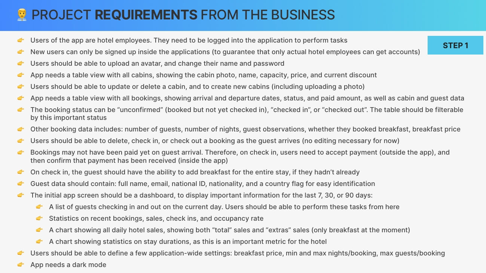
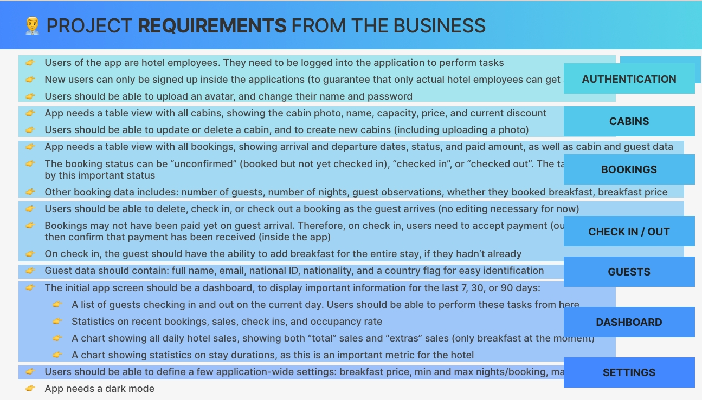
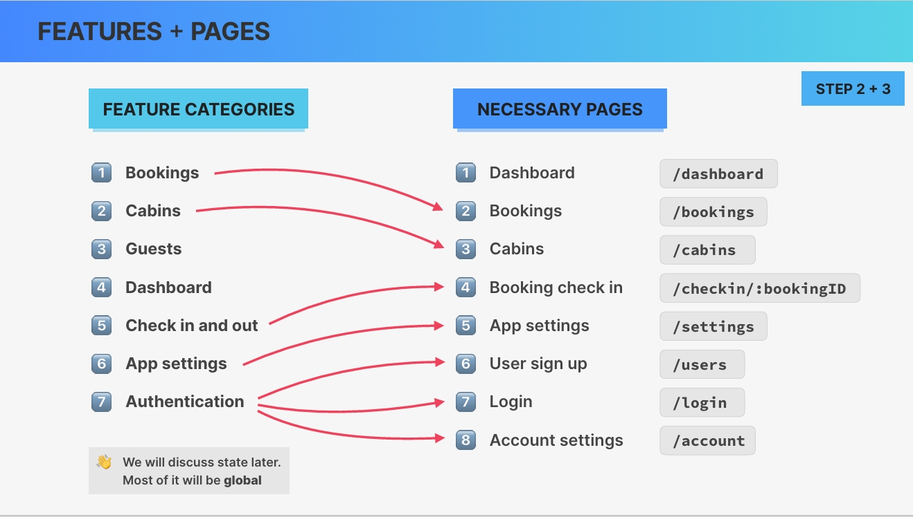
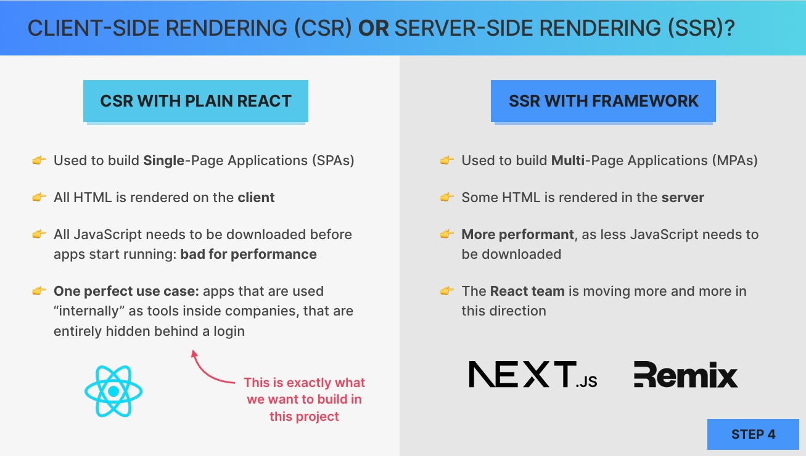
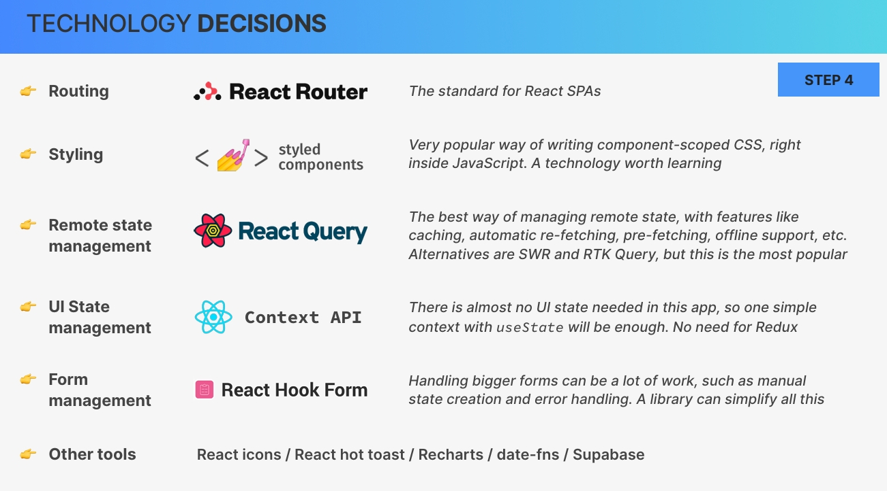

# `25. Setting Up Our Biggest Project + Styled Components`

Welcome to the biggest, most beautiful, and most real world project of this course. So over the next few sections, together, we'll plan and build this stunning project using many professional libraries from the React ecosystem, such as styled components, React query, React hook forms, and React router again. We'll even set up our own back end with a complete database from scratch using an amazing service called SuperBase so that you can easily build your own full stack projects. So let's get started with the project in this section now by setting everything up and learning all about styled components.

---

## `Table of Content`

1. [Application Planning](#application-planning)
2. [Setting Up the Project The Wild Oasis](#setting-up-the-project-the-wild-oasis)
3. [Introduction to Styled Components](#introduction-to-styled-components)
4. [Global Styles With Styled Components](#global-styles-with-styled-components)
5. [Styled Component Props and the css Function](#styled-component-props-and-the-css-function)
6. [Building More Reusable Styled Components](#building-more-reusable-styled-components)
7. [Setting Up Pages and Routes](#setting-up-pages-and-routes)
8. [Building the App Layout](#building-the-app-layout)
9. [Building the Sidebar and Main Navigation](#building-the-sidebar-and-main-navigation)

---

## `Application Planning`

Welcome back. So this time around, in this most real world project of the course, let's really start the project by first learning about the business and the requirements and then planning out the entire application.

So we're gonna build an application for a small boutique hotel called the Wild Oasis, which features eight luxurious wooden cabins. So what they need us to do is to build a custom application where they can manage everything about their hotel. So the bookings, the cabins and also the guests. And so this is basically an internal application that this business will use inside the hotel to check-in the guests as they arrive. So right now, this business is still just building out this hotel. And so right now, they have absolutely nothing. So they will also need us to build the API for us. So we will need to model all the data. We will have to store it somewhere. And then basically the application that we're gonna build will function as a back office to manage the data that lives in that API. And later on, they will then also want a customer facing website where customers will then be able to basically book stays on their own. And so this will then work with the same API. But again, we might do this one later, but for now this project that we're building now is the internal application where the hotel is basically manage everything about it. So again, bookings, cabins and guests.


So this is gonna be a really, really cool application. And so let's start planning it now very quickly. And so just to review what we learned earlier, this is how we can plan a React or really any other web application.

So first, we need to gather the business requirements and features that we should implement. Then we divide the application into multiple pages and basically think about the UI and how we divide everything into components. And then after that, we divide the application also into different feature categories. So all the features from the requirements can be gathered into a few feature categories. So just like we did before in the fast pizza application. And then finally, we also need to decide on our technology stack. So basically, we need to decide what libraries we want to use in order to implement the project. Okay. And so let's start with step number one, which are the project requirements.

So this time around, we have a lot of requirements as you can see here. And so I want you to pause the video right now and read this entire list on your own.



Now immediately group these requirements into some feature categories.

So let's do that not on the next slide, but right here where we actually have the requirements.



So first up, we will have some authentication in this application. So these three first points are basically about logins and about creating user accounts. And so that's all under the umbrella of authentication.

Then next up, we have the cabins features. We also have bookings and then more details. Here we also have checking ins and outs. So basically, the users of the application which are the hotel employees, will be able to check guests in and out as they arrive at the hotel or on the day that they leave. And so that can be a different feature group. Just note that all of this is of course highly subjective.

So we might, for example, also group the bookings together with the check-in and check out feature, but I thought it might be better to have them separate here. And in any case, this is just a quick overview here. So as we implement each of these features, we will then come back to this list. But now going on, next up we have this requirement which is about the guests features and then apparently we will also need to build a huge dashboard. So here we will have all kinds of statistics and of charts And so this one is actually going to be a lot of fun to build. So this will give the application a real real world touch. So it's gonna be really cool. And then finally, we also need to allow the users to set some settings. So that's yet another feature group. Alright.

And so now let's move on and group these feature groups into some pages. So here are these feature categories.



So all the seven that we just identified. And again, from these, we can kind of easily derive the pages that we are going to need. And right off the bat, we can see here that this application is a lot bigger than the one that we had before. So we had so many requirements and here we have so many feature categories, which means that probably we will also need a lot of different pages.

Starting here with the dashboard page, which will basically be the homepage of the application. Then we will also need a bookings page, which is where all the current bookings will be displayed. And actually not just the current ones but also the past ones and the future ones, then we will have a page for displaying all the cabins which is where the users will then also be able to edit and delete cabins. Now for the guests, we don't really need any page because in the requirements, they told us nothing about that.

So they didn't tell us that we need a way to edit or to delete guests, for example. And so that means that we probably don't need to implement a guest's page. While for the bookings and the cabins, since there needs to be a way of showing all of them and maybe deleting and editing, then we need to do that somewhere and so we need a page for those. Now what we also need a page for is to check users in actually. And so here we can use this check-in route with the booking ID param.

And then also a settings page which is where users, as the name says, can define the settings. And finally, we also need a sign up page. So a page where users can be signed up and then a login page. And this login page is probably going to be like our default home page in case that the user is not logged in.  

Also notice how the user sign up is actually not going to happen on a page called /sign-up, but instead on a page called /users. And the reason for that is that people will basically not be allowed to simply sign up to the application. Instead, it will be inside of the app where existing users can register new ones. Alright? But of course, this will all make more sense once we actually implement this. And then finally, we also need a page where users can update some account settings. So things like the name or the avatar or also the password.

Alright. And so these are, at least for now, the eight pages that we are going to implement. Just note that if you were to build this app on your own, then you would probably not figure all of this out right at the very beginning. So you might do a part of this in the beginning, but not all of it. So things are never this linear, but since this is kind of a linear video course, we need to do this planning somewhere. So we are doing it all here at the very beginning. Alright.

Also notice that the dashboard here, doesn't have an arrow pointing to it. And the reason for that is that the dashboard combines multiple of the other features.

Great. So next up, we would typically discuss state, but let's actually leave that for later because most of our state will just be global remote state. And since we will also need to build the API, we will discuss how we will store all this data that we need for this application later when we built that API. So we are going to use a really nice service called Supabase for that. And so then we will talk about or state and or data.
  
And so instead, let's immediately jump into some tech decisions. So discussing what kind of technology we will want to use. So up until a few years ago, it was kind of a standard that all React applications would simply be 100 rendered on the client, which means that we would use React to build single page applications like we have been doing all this time. However, over the last few years things have been changing a bit and the React team has been advocating more and more for a move back to the server. Now I'm not gonna go really deep into this topic at this point because we will discuss this deeply in a section that it will add to the course later, which is going to be all about Next.Js.

But for now, we will just talk briefly about this because these days it's actually a very important technology decision between using client side rendering with so called vanilla React, so the way we have been doing it all this time, or if we go with a React framework like Next.Js or Remix for server side rendering. And so let's just very briefly go through some differences here.



So basically client side rendering with vanilla react is used to build single page applications. While with server side rendering, we typically build multi page applications. And so the big difference is that single page applications are 100% rendered on the client. So all the HTML is basically generated right in the user's browsers. The problem with this rendering on the client is that it needs to be all done by JavaScript, which means that this JavaScript needs to be downloaded before the app can even start running, which can be bad for the performance especially when the users are using more of a low end device. And also if the user has a worse Internet connection that can impact the performance as well.

So here is where the main advantage of server side rendering lies because with server side rendering the HTML or at least some of it can be rendered on the server, which means that this solution is a bit more performant because a lot less JavaScript needs to be downloaded to the user's devices. Now as I was saying initially, the React team right now is advocating more and more for the solution. So they are basically telling developers now that server side rendering might be the way to go in the future. However, this is not really true for all applications. For example, one perfectly fine use case for client side rendering are applications that are basically used internally as tools inside some companies. So that are not downloaded by many users. So these are many times applications that are hidden behind a login screen with no need for search engine optimization. And so these are perfectly fine as single page applications despite all the server side rendering hype. And there are many applications in this category. So many applications that are only used internally. And so client side rendering with vanilla or with plain React isn't going anywhere.

Now, okay. And so now that we know that this is what we want to build, it's time to assemble our tech stack again.  



- And so we need to make our technology decisions right now. And starting with routing, here we are going to use again the gold standard for single page applications, which is React router.  
- Next up for styling, in this project, we are going to use a very popular library called styled components. So this is a completely new way of writing styles because we will do so right inside JavaScript. So right inside all React components. And this technology is used at IMDB, Spotify, Coinbase, and many, many others. And so it can be a bad choice, and it's definitely a technology worth learning for you. And so that's why I included it in this project.  
- Next up, we need to talk about state management and in particular about remote state management Because basically all the state in this application will be remote state as I was saying earlier. So essentially this application will implement an easy to use interface to this remote data that lives on a server. And so we will load and mutate that data a lot, and so for that we need a specialized library. And that specialized library that we have talked about many many times before is **React Query**. So in my opinion this really is the best way of managing remote state because it has many many features that work really easily out of the box. So things like state caching, automatic refetching in many situations, prefetching for things like pagination, offline support, and many many more. Now as an alternative, we could have used also **SWR** or **Redux Toolkit Query**, which would have been quite interesting as well And you could definitely learn that one after this project. But since React Query seems to be by far the most popular of these options, that's the one that we are going with. And it's also the one that I really like the most.
- Now about UI state management, since there is almost no UI state in this application, we will just use the **context API** for that. So we don't need to read for Redux in this case.
- Now another library that will make our lives a lot easier is a library for managing forms. So there are gonna be lots of forms in this application, and so we can use a form management library like **React Hook Form**, which will make many tasks a lot easier for us. So for example, instead of having to manually create state variables for each element in a form and also manually handling errors, we can just allow this library to take care of all of that.

And so these are the five main big tools that we will use on the front end application. Alright. So these are all extremely popular libraries and tools that many, many developers out there use to build professional React applications.

And so now you will learn how to do the same. And we will even use a few other tools such as React icons, React Hot Toast for notifications, ReadCharts for displaying beautiful charts in our UI, date fns for date manipulation, and finally the super base library as I already mentioned earlier. So this is where we will store all our remote state and basically build an API as you will see later.

Alright. So after all this talk, it's now finally time to get our hands dirty.

---

## `Setting Up the Project The Wild Oasis`

So let's now set up a brand new project from scratch for the wild oasis application. Now as we decided in the previous lecture, we are going to build a regular single page application. And so for that, a Vite application is definitely the way to go. So let's again fire up or terminal or command prompt moving onto the desktop.

And then let's do npm create Vite version four `npm create vite@4`. Hit enter and then this will ask you for the project name which of course is the wild oasis.

And then as always, a Vite project doesn't come with all the NPM packages installed by default. So we need to open up our terminal and manually do that. So NPM install, and then let's wait for these packages to download. And so now, as always, we need to also configure ESLint. And we have done that many times before, so I will just do that here very quickly.

So basically, we need to install these three packages here and save them as developer dependencies.

we can already, start creating the dot `eslintrc.json` file. So this file where we will tell ESLint that we want to basically extend it with the, React application rules that we are installing right now, which will tell ESLint about all the react specific ESLint rules. For example, about the useEffect dependency array.

```json
// .eslintrc.js

{
  "extends": "react-app"
}

```

Then all we need to do is to also add right here the ESLint Vite plugin. So that is at Vite plugin ESLint. And then all we need to do is to call that here. So I'm not really explaining all of this because we have done this many times before. So at least twice, I believe.

```js
// vite.config.js
import { defineConfig } from "vite";
import react from "@vitejs/plugin-react";
import eslint from "vite-plugin-eslint";

// https://vitejs.dev/config/
export default defineConfig({
  plugins: [react(), eslint()],
});
```

And so let's come here to the source folder and let's delete most of this stuff here. So that in the end, we only remain with main dot JSX and app dot JSX.

Great. And now, next up, let's bring in all our starter files. So as always, let's come here into this last folder and then let's grab the entire starter folder, copy that, move here, and then let's actually paste it right here.

And then we take all of these folders and drag them right into the source folder. And so then we can delete again starter, and then let's move back. So this time around, we actually already have our entire folder structure here set up for us. So we have the data folder, we have features, hooks, pages, services, styles, UI, and utilities. And so most of these folders are exactly the same folders that we already used in the previous project.

So in the Fast React Pizza project. Remember that? And just in case that you skipped that project, let's just quickly review or recap what each of them here does.

- So here we have the features folder, which is for all the feature categories that we identified in the previous lecture. So here we have one folder for authentication, bookings, cabins, check-in and check out, one for the dashboard, then for the guests, and also for our settings. Now, So basically each of these folders will co locate all the files that are necessary to implement that feature. So that's going to be all the components, all the hooks, and maybe even some other JavaScript files.

- Then here we have the hooks folder, which is for truly reusable custom hooks. So custom hooks that we need in multiple features. Then we have our pages folder which we actually didn't have in the previous project. But since this project will be a lot bigger, it is actually going to be helpful to have one folder which contains all the pages. So basically, here we will have one component file per route. And what's important about these, so one convention that we create for ourselves is that each of these pages will not have any side effects. But instead, they will delegate all their functionality to the components that are associated with the feature. So basically, we just need to create these pages once and then completely forget about them. But of course, more about that once we actually start writing the code.

- Then we have the services folder, which just like before contains some code for interacting with APIs.

- Then we have styles which as the name says is for things regarding CSS.
Then we have the UI folder which is for all the components that are not belonging to one of the features or that we might reuse in many different features. So that's for generic things like inputs, forms, buttons, tables and so on.
And then finally, we have the utility folders which simply, contains helpers dot JS. Alright.

So this was just a brief overview. And so now we have our project correctly set up and are ready to finally get started. And so right in the next video, we will actually start learning about styled components.

---

## `Introduction to Styled Components`

Now before we really start building the project, let's first learn about the way in which we are going to style the application, **which is by using a `library` called `styled components`.**

So styled components essentially allow us to write CSS right inside our JavaScript component files. And the way it works is that we take a regular HTML element and then using the styled function, we create a brand new React component with some CSS styles applied to it. And we can then use and reuse that new component instead of using the regular HTML element.

But let's actually do it in practice, of course. And so for that, we need to install the styled components library. So `npm install styled-components`. And so now let's start using that styled function that I just mentioned earlier. So let's just write styled. And so then we need to, as always, import that function.

And then here, let's say that we want to style an h1 element. And so we just write styled dot h1 and then we write a template literal which is basically the string in which we are going to write our styles. And this is just a nice trick that leverages the ES6 feature called tagged template literals. And the et's now write some CSS inside the template literals.

**And so this will now actually return a new component.** And so let's save that inside a variable called H1 And since this is indeed a React component, it needs to start with an uppercase.

And so now inside our App component, we can use that H1 component. So h1, and then let's say, the wild oasis. And if we save this now, then indeed, now we got this h one with our styles applied.

```js
import styled from "styled-components";

const H1 = styled.h1`
  font-size: 30px;
  font-weight: 600;
  color: #333;
`;

function App() {
  return (
    <div>
      <H1>The Wild Oasis</H1>
    </div>
  );
}

export default App;

```

So let's actually inspect this here. And so, indeed, here we have the h1 and here we have the styles applied to it. And so behind the scenes what the style components library did was to create this randomly named class and then assigned it to our h1 which is where then or styles appear. So basically, they created this class where then or styles appear.

```html
<!-- component when inspect -->
<h1 class="sc-Qotzb crXLTl">The Wild Oasis</h1>
```

```css
/* CSS when inspect */
.crXLTl {
    font-size: 30px;
    font-weight: 600;
    color: #333;
}

```

And so **what's great about this is that this CSS that we just wrote is only scoped to this exact component**, which eliminates all the problems of global CSS that we talked about earlier. Such as name collisions between class names or for example another developer changing the class without some other developer knowing about that, which would create all sorts of problems.  
And so this fixes that because this CSS will only be available for this exact component which we can then use all over the place in our application.

`Now in order for this, CSS here to actually have this styling, so where it looks like actual CSS, we need a special VS Code extension. So let's install that. So styled components, it should be called. So, yeah, I think it is exactly this one.`

And so this is how styled components essentially work. And so let's keep going. Let's write ourselves some other reusable components. So let's say we want a button now. And so we do styled dot button.

```jsx
import styled from "styled-components";

const H1 = styled.h1`
  font-size: 30px;
  font-weight: 600;
  color: #333;
  background-color: yellow;
`;

const Button = styled.button`
  font-size: 1.4rem;
  padding: 1.2rem 1.6rem;
  font-weight: 500;
  border: none;
  border-radius: 7px;
  background-color: purple;
  color: white;
`;

function App() {
  return (
    <div>
      <H1>The Wild Oasis</H1>
      <Button>Check in</Button>
    </div>
  );
}

export default App;
```

**There we have a nice button. Now what's really cool and really helpful about this is that these styled components actually are able to receive all the same props that the regular HTML or JSX elements can receive.** So for example, we can just as always use the onClick prop in order to attach some event handler. So let's say we wanted to alert. And so if we click here now, then indeed we get that alert. So without us having to do any additional work where before if we were to create our own button component then we would have to manually accept the onClick prop in there and then pass it to the regular HTML element. So we did that many times before, but here, again, we don't need to do that. And of course, we can also reuse this as many times as we want.

```jsx
import styled from "styled-components";

const H1 = styled.h1`
  font-size: 30px;
  font-weight: 600;
  color: #333;
  background-color: yellow;
`;

const Button = styled.button`
  font-size: 1.4rem;
  padding: 1.2rem 1.6rem;
  font-weight: 500;
  border: none;
  border-radius: 7px;
  background-color: purple;
  color: white;
`;

function App() {
  return (
    <div>
      <H1>The Wild Oasis</H1>
      <Button onClick={() => alert("Check in")}>Check in</Button>
    </div>
  );
}

export default App;

```

Now let's do just one more which is going to be an input element.

And of course, we can call them anything that we'd like. But usually, what we do is to just give them the same name as the, HTML element here, but of course, with the upper case.  
And then again, this input element can now accept all the same props as the normal JSX element. So we can say, for example, the type should be number and let's add some placeholder number of guests.

```jsx
const Input = styled.input`
  border: 1px solid #ddd;
  border-radius: 5px;
  padding: 0.8rem 1.2rem;
`;

function App() {
  return (
    <div>
      <H1>The Wild Oasis</H1>
      <Button onClick={() => alert("Check in")}>Check in</Button>
      <Button onClick={() => alert("Check out")}>Check in</Button>

      <Input type="number" placeholder="Enter of guests" />
    </div>
  );
}
```

And so there it is. And so this is the most basic and most fundamental way in which we can use styled components in order to basically build these small reusable components like these ones.

**But now the question that you might have is, how do we actually style this app component itself?**  
Because App itself is, of course, already a component. And so if the styled function here also returns a component, then how can we do this? So basically, what we want to style is this div right here. Right? And so what we can do is to create yet another styled component only to basically replace this div right here.

So let's do that, styled dot div. And then here a convention is to call this new component StyledApp. Alright. So let's write our styles here. Let's say we wanted a background color of orange red to make this design even more ugly and then a padding of 20 pixels.

And so as I was just saying, we can then replace this entire div element right here. So we already have that div here. And so now we have a styled div. And so let's use that here, of course, closing it down here. And nice.

```jsx
import styled from "styled-components";

const H1 = styled.h1`
  font-size: 30px;
  font-weight: 600;
  color: #333;
  background-color: yellow;
`;

const Button = styled.button`
  font-size: 1.4rem;
  padding: 1.2rem 1.6rem;
  font-weight: 500;
  border: none;
  border-radius: 7px;
  background-color: purple;
  color: white;
  margin: 20px;
  cursor: pointer;
`;

const Input = styled.input`
  border: 1px solid #ddd;
  border-radius: 5px;
  padding: 0.8rem 1.2rem;
`;

const StyledApp = styled.div`
  background-color: orangered;
  padding: 20px;
`;

function App() {
  return (
    <StyledApp>
      <H1>The Wild Oasis</H1>
      <Button onClick={() => alert("Check in")}>Check in</Button>
      <Button onClick={() => alert("Check out")}>Check in</Button>

      <Input type="number" placeholder="Enter of guests" />
    </StyledApp>
  );
}

export default App;

```

So let's again distinguish between the two different things that we did here. So first, we created some simple reusable components which we can then think of primitives of our user interface. So for example, if we want a reusable input element, we just call that input here and then use that all over the place. So we can, of course, again, reuse this as many times as we want. And then if we want to basically style the component itself, so a component that is already pre built then we have to do it in a slightly different way.

So if the component is called app then the convention is to create a styled component which is called StyledApp And then we apply all the styles to that and use it instead of the regular HTML element that we had here before.

And so this is basically a very basic crash course into styled components. But next up, let's build on this foundation and learn how we can include some global styles using styled components. For example, for things like CSS resets that need to apply to the entire page.

---

## `Global Styles With Styled Components`

So let's now include a few or actually a lot of global styles into our application using the styled components way. So here in our styles folder, we already have our index dot CSS. However, we are not going to directly use this CSS file. But instead, when we use style components, we basically create a brand new style component which will then become our global style component. So let's just do that.

Create a new file in Styes folder, let's call it GlobalStyles.js. And then here, we use the createGlobal style function. So instead of using the styled function like we did in the last lecture, we now use this create global style. And then just like before, we basically call this function using template literal, and then we can take all of our styles here and paste them in there. So let's just grab all of the CSS here, which I want to be global.  
So copy all that and paste that right in here. Alright. And then let's also save this here as global styles like this. And then in the end, let's export default that. Alright.

```js

// GlobalStyles.js
import { createGlobalStyle } from "styled-components";

const GlobalStyles = createGlobalStyle`
:root {
  /* Indigo */
  --color-brand-50: #eef2ff;
  --color-brand-100: #e0e7ff;
  --color-brand-200: #c7d2fe;
  --color-brand-500: #6366f1;
  --color-brand-600: #4f46e5;
  --color-brand-700: #4338ca;
  --color-brand-800: #3730a3;
  --color-brand-900: #312e81;

  /* Grey */
  --color-grey-0: #fff;
  --color-grey-50: #f9fafb;
  --color-grey-100: #f3f4f6;
  --color-grey-200: #e5e7eb;
  --color-grey-300: #d1d5db;
  --color-grey-400: #9ca3af;
  --color-grey-500: #6b7280;
  --color-grey-600: #4b5563;
  --color-grey-700: #374151;
  --color-grey-800: #1f2937;
  --color-grey-900: #111827;

  --color-blue-100: #e0f2fe;
  --color-blue-700: #0369a1;
  --color-green-100: #dcfce7;
  --color-green-700: #15803d;
  --color-yellow-100: #fef9c3;
  --color-yellow-700: #a16207;
  --color-silver-100: #e5e7eb;
  --color-silver-700: #374151;
  --color-indigo-100: #e0e7ff;
  --color-indigo-700: #4338ca;

  --color-red-100: #fee2e2;
  --color-red-700: #b91c1c;
  --color-red-800: #991b1b;

  --backdrop-color: rgba(255, 255, 255, 0.1);

  --shadow-sm: 0 1px 2px rgba(0, 0, 0, 0.04);
  --shadow-md: 0px 0.6rem 2.4rem rgba(0, 0, 0, 0.06);
  --shadow-lg: 0 2.4rem 3.2rem rgba(0, 0, 0, 0.12);

  --border-radius-tiny: 3px;
  --border-radius-sm: 5px;
  --border-radius-md: 7px;
  --border-radius-lg: 9px;

  /* For dark mode */
  --image-grayscale: 0;
  --image-opacity: 100%;
}

*,
*::before,
*::after {
  box-sizing: border-box;
  padding: 0;
  margin: 0;

  /* Creating animations for dark mode */
  transition: background-color 0.3s, border 0.3s;
}

html {
  font-size: 62.5%;
}

body {
  font-family: "Poppins", sans-serif;
  color: var(--color-grey-700);

  transition: color 0.3s, background-color 0.3s;
  min-height: 100vh;
  line-height: 1.5;
  font-size: 1.6rem;
}

input,
button,
textarea,
select {
  font: inherit;
  color: inherit;
}

button {
  cursor: pointer;
}

*:disabled {
  cursor: not-allowed;
}

select:disabled,
input:disabled {
  background-color: var(--color-grey-200);
  color: var(--color-grey-500);
}

input:focus,
button:focus,
textarea:focus,
select:focus {
  outline: 2px solid var(--color-brand-600);
  outline-offset: -1px;
}

/* Parent selector, finally 😃 */
button:has(svg) {
  line-height: 0;
}

a {
  color: inherit;
  text-decoration: none;
}

ul {
  list-style: none;
}

p,
h1,
h2,
h3,
h4,
h5,
h6 {
  overflow-wrap: break-word;
  hyphens: auto;
}

img {
  max-width: 100%;

  /* For dark mode */
  filter: grayscale(var(--image-grayscale)) opacity(var(--image-opacity));
}

/*
FOR DARK MODE

--color-grey-0: #18212f;
--color-grey-50: #111827;
--color-grey-100: #1f2937;
--color-grey-200: #374151;
--color-grey-300: #4b5563;
--color-grey-400: #6b7280;
--color-grey-500: #9ca3af;
--color-grey-600: #d1d5db;
--color-grey-700: #e5e7eb;
--color-grey-800: #f3f4f6;
--color-grey-900: #f9fafb;

--color-blue-100: #075985;
--color-blue-700: #e0f2fe;
--color-green-100: #166534;
--color-green-700: #dcfce7;
--color-yellow-100: #854d0e;
--color-yellow-700: #fef9c3;
--color-silver-100: #374151;
--color-silver-700: #f3f4f6;
--color-indigo-100: #3730a3;
--color-indigo-700: #e0e7ff;

--color-red-100: #fee2e2;
--color-red-700: #b91c1c;
--color-red-800: #991b1b;

--backdrop-color: rgba(0, 0, 0, 0.3);

--shadow-sm: 0 1px 2px rgba(0, 0, 0, 0.4);
--shadow-md: 0px 0.6rem 2.4rem rgba(0, 0, 0, 0.3);
--shadow-lg: 0 2.4rem 3.2rem rgba(0, 0, 0, 0.4);

--image-grayscale: 10%;
--image-opacity: 90%;
*/
`;

export default GlobalStyles;


```

So all of this is pretty normal and Yeah. So let's now include this in our application. So we created these global styles, but now in order to actually apply them, let's come back to our App component and then include them right here. And the way that this works is that the global styles component that we just exported needs to be added to the component tree but it cannot accept any children. So basically, we want this to be a sibling of the **StyledApp**. So basically, like this. And so then here we need to return this fragment.

```jsx
// GlobalStyles.js

import { createGlobalStyle } from "styled-components";
function App() {
  return (
    <>
      <GlobalStyles />
      <StyledApp>
        <H1>The Wild Oasis</H1>
        <Button onClick={() => alert("Check in")}>Check in</Button>
        <Button onClick={() => alert("Check out")}>Check in</Button>

        <Input type="number" placeholder="Enter of guests" />
      </StyledApp>
    </>
  );
}

export default App;

```

And immediately, you see that it took effect. So now all the margins and paddings are gone, and we also have this sense serif font.

Now, back in the index.css, we actually have some code that we should include in our HTML.

```html
<link rel="preconnect" href="https://fonts.googleapis.com" />
<link rel="preconnect" href="https://fonts.gstatic.com" crossorigin />
<link
  href="https://fonts.googleapis.com/css2?family=Poppins:wght@400;500;600;700&display=swap"
  rel="stylesheet"
/>
<link
  href="https://fonts.googleapis.com/css2?family=Sono:wght@400;500;600&display=swap"
  rel="stylesheet"
/>
```

So all of this here is for adding two different fonts to our web page. So to our HTML document. So let's grab that. And then here inside index dot HTML, let's place that. And so then you saw that also right away the font changed to this Poppins font right.

Now, next up, I want to turn our attention to all of these CSS variables that we have right int the GlobalStyles.js file. So basically, the idea of these is to have all the different design tokens in one central place so that we can then use them in all or different styled components that we're gonna build.

```css
border-radius: var(--border-radius-sm);
background-color: var(--color-brand-600);
color: var(--color-brand-50);
box-shadow: var(--shadow-sm);

```

And then here we have a small bug and beautiful.  
Let's also add a box shadow maybe. And so again, all of these is what we call design tokens. So they might change, for example, when we change to a dark mode. So then it's really nice to have all these CSS variables. So let's use shadow small here.⤴️

**Now instead of using all of these CSS variables that we have right here, the style components library actually also gives us its own way of providing variables like these to our entire application by using a mechanism that it calls themes.** So basically with styled components themes, we can also inject design tokens into our application. However, this mechanism was designed before CSS variables were really popular and really usable in modern CSS. And so I think that it's actually a lot better to just stick to native CSS instead of relying to this JavaScript way which the themes are of injecting these variables into our code.

But of course, if you want to learn more about themes, you can as always go to the styles component documentation. <https://styled-components.com/docs/advanced#theming>.

*And so then you provide that entire theme to the application. And then inside of each styled components, you can get access to these values like this. So it props dot theme and then whatever name you gave it inside the theme. So I think this is definitely a lot more work than just using CSS variables, which again are now basically the modern way of doing the same thing. Now, right?*

We now want to actually export these components into their own files. So we really want to reuse these components that we just wrote throughout the entire application. So then, of course, they should not be right here in this file, but probably in the UI folder.

So export default button, and we will then come back later to what all of this here is.

```jsx
// Button.jsx
import styled, { css } from "styled-components";

const sizes = {
  small: css`
    font-size: 1.2rem;
    padding: 0.4rem 0.8rem;
    text-transform: uppercase;
    font-weight: 600;
    text-align: center;
  `,
  medium: css`
    font-size: 1.4rem;
    padding: 1.2rem 1.6rem;
    font-weight: 500;
  `,
  large: css`
    font-size: 1.6rem;
    padding: 1.2rem 2.4rem;
    font-weight: 500;
  `,
};

const variations = {
  primary: css`
    color: var(--color-brand-50);
    background-color: var(--color-brand-600);

    &:hover {
      background-color: var(--color-brand-700);
    }
  `,
  secondary: css`
    color: var(--color-grey-600);
    background: var(--color-grey-0);
    border: 1px solid var(--color-grey-200);

    &:hover {
      background-color: var(--color-grey-50);
    }
  `,
  danger: css`
    color: var(--color-red-100);
    background-color: var(--color-red-700);

    &:hover {
      background-color: var(--color-red-800);
    }
  `,
};

const Button = styled.button`
  font-size: 1.4rem;
  padding: 1.2rem 1.6rem;
  font-weight: 500;
  border: none;
  border-radius: var(--border-radius-sm);
  background-color: var(--color-brand-600);
  color: var(--color-brand-50);
  box-shadow: var(--shadow-sm);
  cursor: pointer;
`;

export default Button;

```

Alright. So, apparently, it's easier to just grab it and create the files manually. So let's do Input.jsx, export default input, and then we also need to import this styled function. And then also import the input here. So let's do it manually.

```jsx
// Input.jsx

import styled from "styled-components";

const Input = styled.input`
  border: 1px solid var(--color-gray-300);
  background-color: var(--color-gray-0);
  border-radius: var(--border-radius-sm);
  box-shadow: var(--shadow-sm);
  padding: 0.8rem 1.2rem;
`;

export default Input;

```

```jsx
// App.jsx
import styled from "styled-components";
import GlobalStyles from "./styles/GlobalStyles";
import Button from "./ui/Button";
import Input from "./ui/Input";

const H1 = styled.h1`
  font-size: 30px;
  font-weight: 600;
  color: #333;
  background-color: yellow;
`;

const StyledApp = styled.div`
  background-color: orangered;
  padding: 20px;
`;

function App() {
  return (
    <>
      <GlobalStyles />
      <StyledApp>
        <H1>The Wild Oasis</H1>
        <Button onClick={() => alert("Check in")}>Check in</Button>
        <Button onClick={() => alert("Check out")}>Check in</Button>

        <Input type="number" placeholder="Enter of guests" />
      </StyledApp>
    </>
  );
}

export default App;

```

And now there's just one final small thing that I want to do which is the hover state of this button. So that's something that we haven't talked about yet.

And so let's go back to our button and implement that hover state. And the way we can do that is very easily and actually very similar to SCSS or to Sass. So we can just do this`&` which will basically select the button element itself. And then on there, we can as usually use the hover pseudo class. So then we can say background color should then become a darker variation of this like 700.

```jsx
const Button = styled.button`
  font-size: 1.4rem;
  padding: 1.2rem 1.6rem;
  font-weight: 500;
  border: none;
  border-radius: var(--border-radius-sm);
  background-color: var(--color-brand-600);
  color: var(--color-brand-50);
  box-shadow: var(--shadow-sm);
  cursor: pointer;

  &:hover {
    background-color: var(--color-brand-700);
  }
`;

export default Button;
```

And indeed that is working. And we even get the transition here for free because that is already we did using `*` in GlobalStyles.js. So all the elements have this transition property which replaced here because of dark mode, but it's also useful because then we don't have to place it manually in all the components.

So `&` basically simply selects the currently selected element. So right here, that is this Button.

---

## `Styled Component Props and the css Function`

In this lecture, we'll build a reusable heading component by learning about some more advanced styled component topics, such as accepting props and the CSS function. So let's say that we wanted to make a more reusable heading component similar to the h1 that we built. But instead of the component just working for the h1 element, we also want it to work as an h2 and an h3 element.

```jsx
import styled from "styled-components";

const Heading = styled.h1`
  font-size: 30px;
  font-weight: 600;
  color: #333;
  background-color: yellow;
`;

export default Heading;

```

So for now we have exactly what we had before. But now I want to turn your attention to the fact that this here(all CSS properties)⤴️ is in fact a template literal, which means that we can actually write JavaScript expressions in there.

So, for example, we could conditionally define font size.   `font-size: ${10 > 5 ? "30px" : "20px"};`  
And so this is one simple way of conditionally defining some CSS property.  
But what we can also do is to write CSS in some external variable. So let's just say here, text align, set it to center, and then we can grab that and simply place that here.

```jsx
import styled from "styled-components";

const test = `text-align: center`;

const Heading = styled.h1`
  // font-size: ${10 > 5 ? "30px" : "20px"};
  font-size: 20px;
  font-weight: 600;
  color: #333;
  background-color: yellow;
  ${test}
`;

export default Heading;
```

Now, if we write big blocks of CSS this way, so basically in an external variable, then we don't get the syntax highlighting that we are used to. And so one way of fixing that is to use the CSS function before the properties. So we can import CSS from styled components.

```jsx
import styled, { css } from "styled-components";

const test = css`
  text-align: center;
`;
```

And so then here we get again this syntax highlighting. So in this case, the CSS function actually wouldn't be necessary, but we can still use it just to get our syntax highlighting back.

Now, **this function(`css`) is actually necessary if we want to do some logic** in there. So, if we wanted to write some JavaScript expression here and then use that, in here, let's say again five or 10 greater than five, then in that case.

```jsx
const test = css`
  text-align: center;
  ${10 > 5 ? "color: gray;" : "color: blue;"}
`;

```

However, if we removed the CSS, then that should no longer work. Well, actually it does work, but in some situations it will not work.

```jsx
import styled, { css } from "styled-components";

const test = css`
  text-align: center;
  ${10 > 5 ? "color: gray;" : "color: blue;"}
`;

const Heading = styled.h1`
  font-size: 20px;
  font-weight: 600;
  color: #333;
  background-color: yellow;
  ${test}
`;

export default Heading;

```

And what I want to do now is to pass a prop to this Heading component. And so then we can use that prop to conditionally set some styles.

Now I want to pass in here the type, for example, and we can give it any prop name that we want. And so let's say that here we want actually an h1, h2 and h3.

```jsx
// App.jsx
<Heading type="h1">The Wild Oasis</Heading>
<Heading type="h2">Check in and out</Heading>
<Heading type="h3">From</Heading>
```

And so now we want, of course, these three headings to look different. So that's why we passed this type prop in there. And again, we could give it any name that we wanted.

And so now, we can actually receive that prop in Heading.js. So let's enter our JavaScript mode. And then in here, we can get access to the props by using a callback function like this. So this function receives the props. And then from there, we can read props dot type.

```jsx
import styled, { css } from "styled-components";

const Heading = styled.h1`
  ${(props) =>
    props.type === "h1" &&
    `font-size: 3rem;
  font-weight: 600;
`}
  ${(props) =>
    props.type === "h2" &&
    `font-size: 2rem;
  font-weight: 600;
`}
  ${(props) =>
    props.type === "h3" &&
    `font-size: 2rem;
  font-weight: 500;
`}


  line-height: 1.2;
`;

export default Heading;
```

**Now we have a big problem because if we inspect this, we will see that here we actually still have an h1 element. So it does look like or h2, but the HTML element is still an h1 and the same of course for h3.** And so this is really not good for SEO and for accessibility issues. So if we want an h2 then we should really have an h2 element.

**Well luckily for us the style components library has thought of that.** **So we can pass a special prop to our components to tell them as which HTML element they should be rendered.** And that special prop is called the `as` prop. So we should now instead of type actually use this as prop right here.

```jsx
// App.jsx
<Heading as="h3">From</Heading>
```

So it could also be a paragraph here, so then we'd get a paragraph, could be even a button. So it could be whatever we wanted here. But in this case, we want it to be an h3 here.

**So this type prop that we had before was basically our own prop that we defined ourselves, but now we are using this `as` prop that is really part of styled components.** Alright. But now, of course, we lost all of our styling, but that's very easy to get back because we can just replace this `type prop` here with the `as prop`. So then all our stylings are back to what they were before, but now they are also semantically correct here in the markup.

```jsx
${(props) =>
    props.as === "h2" &&
    `font-size: 2rem;
  font-weight: 600;
`}
```

```jsx
// App.jsx

import styled from "styled-components";
import GlobalStyles from "./styles/GlobalStyles";
import Button from "./ui/Button";
import Input from "./ui/Input";
import Heading from "./ui/Heading";

const StyledApp = styled.div`
  background-color: orangered;
  padding: 20px;
`;

function App() {
  return (
    <>
      <GlobalStyles />
      <StyledApp>
        <Heading as="h1">The Wild Oasis</Heading>

        <Heading as="h2">Check in and out</Heading>

        <Button onClick={() => alert("Check in")}>Check in</Button>
        <Button onClick={() => alert("Check out")}>Check in</Button>

        <Heading as="h3">From</Heading>

        <Input type="number" placeholder="Enter of guests" />
      </StyledApp>
    </>
  );
}

export default App;

```

```jsx
// Heading.jsx
import styled, { css } from "styled-components";

const Heading = styled.h1`
  ${(props) =>
    props.as === "h1" &&
    `font-size: 3rem;
  font-weight: 600;
`}
  ${(props) =>
    props.as === "h2" &&
    `font-size: 2rem;
  font-weight: 600;
`}
  ${(props) =>
    props.as === "h3" &&
    `font-size: 2rem;
  font-weight: 500;
`}


  line-height: 1.2;
`;

export default Heading;

```

---

## `Building More Reusable Styled Components`

To finish this part about styled components, let's just build two more reusable components that we are going to need all the time while we'll be building our application.

And let's start with a reusable `row component`. So basically, we want a row which contains boxes(columns).

And so let's create a component for that.

let's create row dot JSX.

```jsx
// Row.jsx 
import styled from "styled-components";

const Row = styled.div``;

export default Row;

```

Let use the Row component, even though there is no styling yet, but we will add that later.

```jsx
// App.jsx
<StyledApp>
        <Row>
          <Heading as="h1">The Wild Oasis</Heading>

          <div>
            <Heading as="h2">Check in and out</Heading>

            <Button onClick={() => alert("Check in")}>Check in</Button>
            <Button onClick={() => alert("Check out")}>Check in</Button>
          </div>
        </Row>

        <Row>
          <Heading as="h3">From</Heading>

          <from>
            <Input type="number" placeholder="Enter of guests" />
            <Input type="number" placeholder="Enter of guests" />
          </from>
        </Row>
      </StyledApp>
```

So the first one we might want it to be of the `type of horizontal` and the second one might be of the `type vertical`. Here we are just using this `type` prop but it could be any other one.

So this is basically the API of this component. So the way that we want to use it. And so let's now style this thing.

And first of all, let's actually make both of these types of rows flex containers.  
So immediately, something starts to happen there, but now we want different behaviors for the two. So let's enter JavaScript mode and then let's grab our props again. And so then based on that, we can do, or we can create here some extra styles.

```jsx
// Row.jsx
import styled, { css } from "styled-components";

const Row = styled.div`
  display: flex;
  /* flex-direction: ${(props) =>
    props.type === "vertical" ? "column" : "row"}; */
  ${(props) =>
    props.type === "horizontal" &&
    css`
      justify-content: space-between;
    `}

  ${(props) =>
    props.type === "vertical" &&
    css`
      flex-direction: column;
      gap: 1.6rem;
    `}
`;

export default Row;

```

Okay. Nice.

So basically, one by one, we are kind of building a design system here which contains all of these small components right in the ui folder.  
And as you see, many of them are actually already built.
For example, this TextArea or this small Tag component.  
And of course, the styling here could be completely different, but this is simply what's going to be best for our project.

Now just one final thing that we can do with this component, and this actually has nothing to do with styled components but really with React.  
So on any React component, we can actually set default props.
So we can do exactly this. And so we can then set the type to vertical by default.

```jsx
// Row.jsx
...
Row.defaultProps = {
  type: "vertical",
};

export default Row;
```

Now we haven't ever used this before because usually when we define props or when we want to define props in a regular component, then we always just do it like this. So using this destructuring syntax.
But here, since we are defining it in another way, we cannot do that. So then we can still use this way, which is really really handy. Okay.

---

And with that being said, let's go back to the button component actually.
And so let's take a look at this other code that we already have in Button.jsx file.  
So basically, we have here one object called sizes which has the small, medium, and large property.  
And for each of them I included some lines of CSS code.

```jsx
const sizes = {
  small: css`
    font-size: 1.2rem;
    padding: 0.4rem 0.8rem;
    text-transform: uppercase;
    font-weight: 600;
    text-align: center;
  `,
  medium: css`
    font-size: 1.4rem;
    padding: 1.2rem 1.6rem;
    font-weight: 500;
  `,
  large: css`
    font-size: 1.6rem;
    padding: 1.2rem 2.4rem;
    font-weight: 500;
  `,
};
```

And the same thing for these variations. So we will have a primary, a secondary, and a danger button. So there are basically nine combinations of buttons that we can create.

And so now all we have to do here is to receive these things as props. And so then based on those props, we select whatever styles we want from these two objects.

```jsx
// Button.jsx
<Button
  variation="primary"
  size="medium"
  onClick={() => alert("Check in")}
>
  Check in
</Button>
<Button
  variation="secondary"
  size="small"
  onClick={() => alert("Check out")}
>
  Check in
</Button>
```

And so let's now grab those props and then select those styles accordingly.
So starting with the sizes, we can just do sizes at props dot size and then the same thing actually with the variations. Then dot variation, I believe.

```jsx
const Button = styled.button`
  border: none;
  border-radius: var(--border-radius-sm);
  box-shadow: var(--shadow-sm);

  ${(props) => sizes[props.size]}
  ${(props) => variations[props.variation]}
`;
```

And so this is just some regular JavaScript.  
So from this variations object, we simply take the property that has whatever name we are inputting there.

And just like before, let's declare some default props.

So variation will be by default a primary button and the size, let's make it by default medium.

```jsx
Button.defaultProps = {
  variations: "primary",
  size: "medium",
};
```

And so then that first button that we have here doesn't need any props even.  
Nice.

And so this is just another way in which we can create a highly reusable component using styled components.

```jsx
// Button.jsx 
import styled, { css } from "styled-components";

const sizes = {
  small: css`
    font-size: 1.2rem;
    padding: 0.4rem 0.8rem;
    text-transform: uppercase;
    font-weight: 600;
    text-align: center;
  `,
  medium: css`
    font-size: 1.4rem;
    padding: 1.2rem 1.6rem;
    font-weight: 500;
  `,
  large: css`
    font-size: 1.6rem;
    padding: 1.2rem 2.4rem;
    font-weight: 500;
  `,
};

const variations = {
  primary: css`
    color: var(--color-brand-50);
    background-color: var(--color-brand-600);

    &:hover {
      background-color: var(--color-brand-700);
    }
  `,
  secondary: css`
    color: var(--color-grey-600);
    background: var(--color-grey-0);
    border: 1px solid var(--color-grey-200);

    &:hover {
      background-color: var(--color-grey-50);
    }
  `,
  danger: css`
    color: var(--color-red-100);
    background-color: var(--color-red-700);

    &:hover {
      background-color: var(--color-red-800);
    }
  `,
};

const Button = styled.button`
  border: none;
  border-radius: var(--border-radius-sm);
  box-shadow: var(--shadow-sm);

  ${(props) => sizes[props.size]}
  ${(props) => variations[props.variation]}
`;

Button.defaultProps = {
  variations: "primary",
  size: "medium",
};

export default Button;
```

---

```jsx
// Row.jsx 
import styled, { css } from "styled-components";

const Row = styled.div`
  display: flex;
  /* flex-direction: ${(props) =>
    props.type === "vertical" ? "column" : "row"}; */
  ${(props) =>
    props.type === "horizontal" &&
    css`
      justify-content: space-between;
    `}

  ${(props) =>
    props.type === "vertical" &&
    css`
      flex-direction: column;
      gap: 1.6rem;
    `}
`;

Row.defaultProps = {
  type: "vertical",
};

export default Row;

```

---

```jsx
// App.jsx

import styled from "styled-components";
import GlobalStyles from "./styles/GlobalStyles";
import Button from "./ui/Button";
import Input from "./ui/Input";
import Heading from "./ui/Heading";
import Row from "./ui/Row";

const StyledApp = styled.div`
  /* background-color: orangered; */
  padding: 20px;
`;

function App() {
  return (
    <>
      <GlobalStyles />
      <StyledApp>
        <Row type="vertical">
          <Row type="horizontal">
            <Heading as="h1">The Wild Oasis</Heading>

            <div>
              <Heading as="h2">Check in and out</Heading>

              <Button
                // variation="primary"
                // size="medium" // default props will take care of this
                onClick={() => alert("Check in")}
              >
                Check in
              </Button>
              <Button
                variation="secondary"
                size="small"
                onClick={() => alert("Check out")}
              >
                Check in
              </Button>
            </div>
          </Row>

          <Row type="vertical">
            <Heading as="h3">From</Heading>

            <from>
              <Input type="number" placeholder="Enter of guests" />
              <Input type="number" placeholder="Enter of guests" />
            </from>
          </Row>
        </Row>
      </StyledApp>
    </>
  );
}

export default App;

```

---

## `Setting Up Pages and routes`

So now that we understand the fundamentals of styled components, it's time to finally install React router and set up our routes.  

So let's open up our terminal here and then `npm install react- router-dom@6`.  

And so let's now actually delete everything from App.jsx. So we built already this nice looking UI, but now we will just delete it all and start from scratch.
But of course, we will still need all the components that we just built.

***`Deleted App.jsx file`***

```jsx
// Deleted App.jsx
import styled from "styled-components";
import GlobalStyles from "./styles/GlobalStyles";
import Button from "./ui/Button";
import Input from "./ui/Input";
import Heading from "./ui/Heading";
import Row from "./ui/Row";

const StyledApp = styled.div`
  /* background-color: orangered; */
  padding: 20px;
`;

function App() {
  return (
    <>
      <GlobalStyles />
      <StyledApp>
        <Row type="vertical">
          <Row type="horizontal">
            <Heading as="h1">The Wild Oasis</Heading>

            <div>
              <Heading as="h2">Check in and out</Heading>

              <Button
                // variation="primary"
                // size="medium" // default props will take care of this
                onClick={() => alert("Check in")}
              >
                Check in
              </Button>
              <Button
                variation="secondary"
                size="small"
                onClick={() => alert("Check out")}
              >
                Check in
              </Button>
            </div>
          </Row>

          <Row type="vertical">
            <Heading as="h3">From</Heading>

            <from>
              <Input type="number" placeholder="Enter of guests" />
              <Input type="number" placeholder="Enter of guests" />
            </from>
          </Row>
        </Row>
      </StyledApp>
    </>
  );
}

export default App;

```

But anyway, now it's time to set up all routes.  
And in this application, we will not use the data loading features of React router that we used in the previous project. And so therefore, we can go back to setting up all routes in the way that we did it in the world wise application. So basically, in a declarative way.  
And so for that, let's do it right in a JSX.
So we start with the `BrowserRouter` component, and then in there we specify the `Routes` component which is the one that actually figures out which route matches the URL. And then for each `Route`, we will again have one route element. And so these are self closing elements unless they have child routes.

And then here we can just define the path. So let's start with the dashboard. And, actually, we already have all of our pages or at least most of them in the pages folder.

```jsx
// App.jsx File (updated)
import { BrowserRouter, Routes, Route } from "react-router-dom";
import Dashboard from "./pages/Dashboard";
import Bookings from "./pages/Bookings";
import Cabins from "./pages/Cabins";
import Users from "./pages/Users";
import Settings from "./pages/Settings";
import Account from "./pages/Account";
import Login from "./pages/Login";
import PageNotFound from "./pages/PageNotFound";
function App() {
  return (
    <BrowserRouter>
      <Routes>
        <Route path="dashboard" element={<Dashboard />} />
        <Route path="Bookings" element={<Bookings />} />
        <Route path="cabins" element={<Cabins />} />
        <Route path="users" element={<Users />} />
        <Route path="settings" element={<Settings />} />
        <Route path="account" element={<Account />} />
        <Route path="login" element={<Login />} />
        <Route path="*" element={<PageNotFound />} />
      </Routes>
    </BrowserRouter>
  );
}

export default App;

```

So just make sure that your routes are exactly the same ones as I have here. And so then the result should be that after you have everything set up, the result is that the page you're looking for could not be found.
And so that's this last route(*) which will be matched if none of these other URLs here can be matched. And the reason for that is that we actually don't have like an index route.

And so let's change that.
So let's duplicate this first one right here because this is what we want to see as soon as we open up the app. So this would be our index route. And so let's actually do that using the index prop.

```jsx
<Route index element={<Dashboard />} />  // index route
<Route path="dashboard" element={<Dashboard />} />
```

However, here we have now this duplicate code.
And so usually what we do is a declarative redirect.
So for that, we use the navigate component provided by React router, then replace so that the URL gets replaced in the history stack, And then here, just the route again.
So this is a little bit cleaner and the result is the same. Well, not in the URL.

```jsx
{/* <Route index element={<Dashboard />} /> */}
<Route index element={<Navigate replace to="dashboard" />} />
```

So now if we open up index(home) page, it will automatically immediately redirect us to the dashboard.
Okay.

And now finally, as you might be seeing, we are again missing all styles. And so let's bring them back here.

So importing this component called GlobalStyles.
So let's import that here at the very top.
Styles and then global styles like this.
But of course, then we need again that fragment because as you already know each React component can only return exactly one element or one component.

```jsx
import { BrowserRouter, Routes, Route, Navigate } from "react-router-dom";

import GlobalStyles from "./styles/GlobalStyles";
import Dashboard from "./pages/Dashboard";
import Bookings from "./pages/Bookings";
import Cabins from "./pages/Cabins";
import Users from "./pages/Users";
import Settings from "./pages/Settings";
import Account from "./pages/Account";
import Login from "./pages/Login";
import PageNotFound from "./pages/PageNotFound";
function App() {
  return (
    <>
      <GlobalStyles />
      <BrowserRouter>
        <Routes>
          {/* <Route index element={<Dashboard />} /> */}
          <Route index element={<Navigate replace to="dashboard" />} />
          <Route path="dashboard" element={<Dashboard />} />
          <Route path="Bookings" element={<Bookings />} />
          <Route path="cabins" element={<Cabins />} />
          <Route path="users" element={<Users />} />
          <Route path="settings" element={<Settings />} />
          <Route path="account" element={<Account />} />
          <Route path="login" element={<Login />} />
          <Route path="*" element={<PageNotFound />} />
        </Routes>
      </BrowserRouter>
    </>
  );
}

export default App;

```

Let's reload and let's test out some of the pages here.
For example, the bookings page.
And as you see, here we are actually already using the heading that we created earlier and also the row component.
Let's also check out the account, for example.
And so here again, we are using that row quite a bit.

Great.
And so we are done with setting up our routes.
And so let's move on to the next lecture where we will then, as always, build the applications layout.

---

## `Building the App Layout`

Let's now build our overall application layout.
And we're going to build it completely from scratch and even write all the styles.
And so let's quickly get started.

Now this app layout doesn't really belong into any of these features.
And so let's, create the new component right  in the UI folder.

So `AppLayout dot JSX` once again.  
And for now, let's just add some very bare bones content like App layout, and then let's use this right here in our router definition, so in App.jsx.  

So remember that the way we set up a layout route is by placing all the routes that should be rendered inside the layout as child routes of the layout route.  
So we have done that, at least two times before, I believe.
And so this is nothing new at this point.

So basically, we just set up another route. And, the element will be the AppLayout that we just created.  
And then here, instead of immediately closing the route, we will place all the routes that should be rendered inside the layout here inside the route.  
And those are all the routes except these last two.
So the login page will be a completely different page and will not be inside the layout and the same here for page not found.

```jsx
import { BrowserRouter, Routes, Route, Navigate } from "react-router-dom";

import GlobalStyles from "./styles/GlobalStyles";
import Dashboard from "./pages/Dashboard";
import Bookings from "./pages/Bookings";
import Cabins from "./pages/Cabins";
import Users from "./pages/Users";
import Settings from "./pages/Settings";
import Account from "./pages/Account";
import Login from "./pages/Login";
import PageNotFound from "./pages/PageNotFound";
import AppLayout from "./ui/AppLayout";
function App() {
  return (
    <>
      <GlobalStyles />
      <BrowserRouter>
        <Routes>
          <Route element={<AppLayout />}>
            {/* This is the layout route, which will render AppLayout */}
            {/* All child routes will be rendered inside this layout */}

            <Route index element={<Navigate replace to="dashboard" />} />
            <Route path="dashboard" element={<Dashboard />} />
            <Route path="Bookings" element={<Bookings />} />
            <Route path="cabins" element={<Cabins />} />
            <Route path="users" element={<Users />} />
            <Route path="settings" element={<Settings />} />
            <Route path="account" element={<Account />} />
          </Route>
          <Route path="login" element={<Login />} />
          <Route path="*" element={<PageNotFound />} />
        </Routes>
      </BrowserRouter>
    </>
  );
}

export default App;

```

And so then immediately, we get the App layout text that we have in the UI.  

**And now, do you remember how we actually display those child routes in here?**  
So right now, for example, how do we actually make it so that this account component will be rendered inside the layout?  
Well, for that, we use again the `outlet component`.

So all of this is basically the outlet and in is that paragraph that is always part of the account.
So if we remove this, then we go to the dashboard, but of course, we still have everything around it from the layout.

```jsx
// AppLayout.jsx
import { Outlet } from "react-router-dom";

function AppLayout() {
  return (
    <div>
      <p>App Layout</p>
      <Outlet />
    </div>
  );
}

export default AppLayout;

```

So in this case, only this paragraph.
But if we go now to the login page, then that will be outside.

So this one here has nothing to do with the app layout anymore, and that's because this is not a child route of or layout route here.

`<Route element={<AppLayout />}>`  And remember that this is called a layout route because it doesn't have the path prop.

Now let's actually build the layout, so the AppLayout.jsx.  

And we are going to do a very classic web application layout with a sidebar on the left side. And then on the right side, we will have a header bar at the top and below that the content itself.  
So let's actually create some components for those.
So we will have the header, and we will have also the sidebar here as separate components because, otherwise, our app layout would become a bit too big.  
Then next up, let's place this outlet inside like a main component.
And so the reason for that is that then we can have all these pages basically with the same style because later we will style this element. And then whatever content is gonna come here from the pages, so which is going to be this, will simply be placed all inside the main.

```jsx
// AppLayout.jsx
import { Outlet } from "react-router-dom";
import Sidebar from "./Sidebar";
import Header from "./Header";

function AppLayout() {
  return (
    <div>
      <Sidebar />
      <Header />
      <main>
        <Outlet />
      </main>
    </div>
  );
}

export default AppLayout;
```

And now let's have some fun styling all of this.
So we're going to use our knowledge about style components and format this stuff.  
So let's create a main component using styled dot main.

And so, now we can replace this with this main and beautiful.

```jsx
import { Outlet } from "react-router-dom";
import Sidebar from "./Sidebar";
import Header from "./Header";
import styled from "styled-components";

const Main = styled.main`
  background-color: green;
  padding: 4rem 4.8rem 6.4rem;
`;

function AppLayout() {
  return (
    <div>
      <Sidebar />
      <Header />
      <Main>
        <Outlet />
      </Main>
    </div>
  );
}

export default AppLayout;

```

Next up, let's then style the Header and the sidebars And so what we're gonna do is then this trick or this convention that I mentioned earlier.
So we're going to call this the StyledHeader because we cannot again, create a new component called Header. So we already have that. So we call this one simply StyledHeader.

Again, starting with some background color and some padding here, 1.2 rem and let's say 4.8 rem on the sides.

```jsx
import styled from "styled-components";

const StyledHeader = styled.header`
  background-color: orangered;
  padding: 1.2rem 4.8rem;
  border-bottom: 1px solid var() (--color-gray-100);
`;

function Header() {
  return <StyledHeader>Header.</StyledHeader>;
}

export default Header;
```

And then all we have to do is something similar in the sidebar.

So const styled sidebar is styled dot site.
So again repeating that, HTML element that we are about to replace.
Let's here start with this blue color then again some padding And of course, if you were building this for the first time then you would experiment around with these values and then also a border right similar to the one that we had in the header.

```jsx
import styled from "styled-components";

const StyledSidebar = styled.aside`
  background-color: lightblue;
  padding: 3.2rem 2.4rem;
  border-right: 1px solid var(--color-gray-100);
`;

function Sidebar() {
  return <StyledSidebar>Sidebar.</StyledSidebar>;
}

export default Sidebar;
```

But this doesn't really look like any kind of layout yet.
Right?

And so let's do what I said initially which is to position this sidebar on the left and then on the right we will have the header and this main part.
**And so for that we are going to use CSS grid**.
So what we need to do is to basically style the div element from AppLayout.jsx. So this element is what's going to become the grid container.  
And so once again, let's follow that convention of styledAppLayout.

So this is just a regular div and so display grid which won't make, any change yet but let's also make the height of this 100 viewport heights.
And then, well, more importantly than that, let's define or grid template columns.
So more like this.
So let's have the first column which will contain the sidebar with the fixed width of 26 rem and then the rest will be flexible.
So just one fractional unit there.

```jsx
import { Outlet } from "react-router-dom";
import Sidebar from "./Sidebar";
import Header from "./Header";
import styled from "styled-components";

const StyledAppLayout = styled.div`
  display: grid;
  grid-template-columns: 26rem 1fr;
  grid-template-rows: auto 1fr; // auto = size of the content, 1fr = remaining space for main content

  height: 100vh;
`;

const Main = styled.main`
  background-color: green;
  padding: 4rem 4.8rem 6.4rem;
`;

function AppLayout() {
  return (
    <StyledAppLayout>
      <Header />
      <Sidebar />
      <Main>
        <Outlet />
      </Main>
    </StyledAppLayout>
  );
}

export default AppLayout;

```

Cool.  
And so what we need to do next is to just have this sidebar span all the way from the first row to the last row.  

```jsx
import styled from "styled-components";

const StyledSidebar = styled.aside`
  background-color: var(--color-grey-0);
  padding: 3.2rem 2.4rem;
  border-right: 1px solid var(--color-gray-100);

  grid-row: 1 / -1; /* Span all rows */
`;

function Sidebar() {
  return <StyledSidebar>Sidebar.</StyledSidebar>;
}

export default Sidebar;

```

And there we go.
This is exactly the layout that we were looking for.

So now we can finally get rid of these colors and use the actual colors that we want here.
And so that is going to be color gray zero, which is white at this point. But later for dark mode, we will then have this color here being the darkest one. And therefore, we cannot just leave this background color off. So everything needs to have a background color so that we can then invert the colors later.

So basically, we will have the sidebar and the header as white, and then the main part here will have a very very subtle gray, which will give this whole application a really nice and modern touch.

And so that's also the reason why we then have these very subtle borders here.

So this is starting to look like something, but of course, now what we're missing is some links so that we can actually jump between the different pages.
So usually those kinds of links are what appear in an application sidebar.
And so in the next lecture, let's build our main navigation in the sidebar.

---

## `Building the Sidebar and Main Navigation`

And so now to wrap up this section, let's build the sidebar and in particular, the main app navigation.  
So both these components actually already exist, at least the styles for them.  
So let's import the Logo and the MainNav components in the Sidebar.jsx and let's bring them in.

Now let's turn our attention to what actually matters, which is this main navigation.  

So usually we implement a navigation like this by using the nav element and then in there an unordered list which will contain many list item elements and then each of them will contain a link. Alright.

So let's check out what we already have here.
So we already have this nav list, which is an unordered list, and we already have the links.  
So let's replace this here with the NavList.
And then here, let's actually use that Link that we already have, at least temporarily.  
So since this is an a element, so an anchor, it needs the eight ref, prop.

And then the first link right here should go to the apps dashboard.
And then here, let's say home because this is essentially our homepage.
So if we click here, then that actually causes a page navigation and it goes to the dashboard.
So let's just do another one just so we see the problem with this.

```jsx
function MainNav() {
  return (
    <nav>
      <NavList>
        <li>
          <Link href="/">Home</Link>
        </li>
        <li>
          <Link href="/bookings">Bookings</Link>
        </li>
      </NavList>
    </nav>
  );
}

export default MainNav;
```

So if I click here, then notice how the entire page was actually reloaded, which we could see up here from the browser. So also there was now a flash of paint here on the screen.  
And so that's exactly what we do not want in a single page application.
And so therefore, just like before, we need to actually use the Link or the NavLink component that is built into React router.

So, here we actually want the nav Link component that is provided again by React router and replace href with to prop.

```jsx
function MainNav() {
  return (
    <nav>
      <NavList>
        <li>
          <NavLink to="/">Home</NavLink>
        </li>
        <li>
          <NavLink to="/bookings">Bookings</NavLink>
        </li>
      </NavList>
    </nav>
  );
}

export default MainNav;
```

Now we can move between our pages very smoothly and without causing any page transitions.
Great.

**But now the problem is how do we actually style these NavLink components?** Because they are coming from a third party library, but we still want to style them somehow.  
So how can we do that?  
How can we style these components that we didn't write ourselves?  
**Well, luckily for us, we can use a nice trick with styled components. So instead of doing styles dot the HTML element, we can pass in basically some other component.** And so as you can guess, here we are going to pass in the NavLink.

```jsx
// const Link = styled.a`
//   &:link,
//   &:visited {
//     display: flex;
//     align-items: center;
//     gap: 1.2rem;

//     color: var(--color-grey-600);
//     font-size: 1.6rem;
//     font-weight: 500;
//     padding: 1.2rem 2.4rem;
//     transition: all 0.3s;
//   }`


const StyledNavLink = styled(NavLink)`
  &:link,
  &:visited {
    display: flex;
    align-items: center;
    gap: 1.2rem;

    color: var(--color-grey-600);
    font-size: 1.6rem;
    font-weight: 500;
    padding: 1.2rem 2.4rem;
    transition: all 0.3s;
  }`


<nav>
<NavList>
  <li>
    <StyledNavLink to="/">Home</StyledNavLink>
  </li>
  <li>
    <StyledNavLink to="/bookings">Bookings</StyledNavLink>
  </li>
</NavList>
</nav>


```

So now it even marks the current one as the active link.  
And so if you want, you can of course go check out exactly the styles that I wrote here.  
But in a nutshell, remember that when we use the NavLink component, then React router will automatically place the active class on the link that is currently being active.
Okay.

And then we also have stylings for SVG, which brings us to my next point or to my next topic, which is that right in these links, we also want some really nice icons.  

And so let's bring in the React icons library.  
So, **`npm install react-icons`**.

And then in the meantime, let's actually go check out the documentation. <https://react-icons.github.io/react-icons/>
So if you just Google React icons.  
And so what this library does is to basically import many, many popular icon sets. And so here are all the icon sets that we can use with the React icons package.

And the ones that we are going to use are the heroicons2, which again are actually part of Tailwind.  

So here we can then see how this is going to work.
So all we need to do in order to use one of these icons is to import the icon name that we see here from react icons slash hi2, which stands for hero icons two. `import { IconName } from "react-icons/hi2";` `import { HiOutlineHome } from "react-icons/hi2";`

And now all we have to do is to place that right here in our code.

```jsx
<li>
  <StyledNavLink to="/">
    <HiOutlineHome /> <span>Home</span>
  </StyledNavLink>
</li>
```

Okay.

So really, really nice design, I think.  
Let's just keep going and implement the entire thing here.

So here changing the text and then finally also a settings page.  
Now, remember how we actually have a few more pages and a few more routes, but these we don't want in the main navigation.  
For example, we have the accounts page, And so that will later be in the header.

So this is looking really amazing here if you ask me.  

And so let's just, to finish, add a bit of space there between the logo and that menu.  
So let's make this here just a flex container.
The flex direction should be column because then we can easily add a gap of 3.2 rem.

And with this, we finished this sidebar here and we also finished this section because before we keep going any further in building out the application, we first need to deal with our data.  
And so next up, we will explore **Supabase** where we will be able to build a fully fledged API and store all or data.  
So that's going to be really, really exciting because that's gonna allow you to essentially build full stack apps completely on your own.
So completely without knowing anything about back end development.

```jsx

// MainNav.jsx
import { NavLink } from "react-router-dom";
import styled from "styled-components";
import {
  HiOutlineCalendar,
  HiOutlineCalendarDays,
  HiOutlineCog6Tooth,
  HiOutlineHome,
  HiOutlineHomeModern,
  HiOutlineUser,
  HiOutlineUsers,
} from "react-icons/hi2";

const NavList = styled.ul`
  display: flex;
  flex-direction: column;
  gap: 0.8rem;
`;

const StyledNavLink = styled(NavLink)`
  &:link,
  &:visited {
    display: flex;
    align-items: center;
    gap: 1.2rem;

    color: var(--color-grey-600);
    font-size: 1.6rem;
    font-weight: 500;
    padding: 1.2rem 2.4rem;
    transition: all 0.3s;
  }

  /* This works because react-router places the active class on the active NavLink */
  &:hover,
  &:active,
  &.active:link,
  &.active:visited {
    color: var(--color-grey-800);
    background-color: var(--color-grey-50);
    border-radius: var(--border-radius-sm);
  }

  & svg {
    width: 2.4rem;
    height: 2.4rem;
    color: var(--color-grey-400);
    transition: all 0.3s;
  }

  &:hover svg,
  &:active svg,
  &.active:link svg,
  &.active:visited svg {
    color: var(--color-brand-600);
  }
`;

function MainNav() {
  return (
    <nav>
      <NavList>
        <li>
          <StyledNavLink to="/">
            <HiOutlineHome /> <span>Home</span>
          </StyledNavLink>
        </li>
        <li>
          <StyledNavLink to="/bookings">
            {" "}
            <HiOutlineCalendarDays />
            <span>Bookings</span>{" "}
          </StyledNavLink>
        </li>
        <li>
          <StyledNavLink to="/cabins">
            {" "}
            <HiOutlineHomeModern />
            <span>Cabins</span>{" "}
          </StyledNavLink>
        </li>
        <li>
          <StyledNavLink to="/users">
            {" "}
            <HiOutlineUsers />
            <span>Users</span>{" "}
          </StyledNavLink>
        </li>
        <li>
          <StyledNavLink to="/settings">
            {" "}
            <HiOutlineCog6Tooth />
            <span>Settings</span>{" "}
          </StyledNavLink>
        </li>
      </NavList>
    </nav>
  );
}

export default MainNav;

```

---

***`20 / 07 / 2025`***

---
